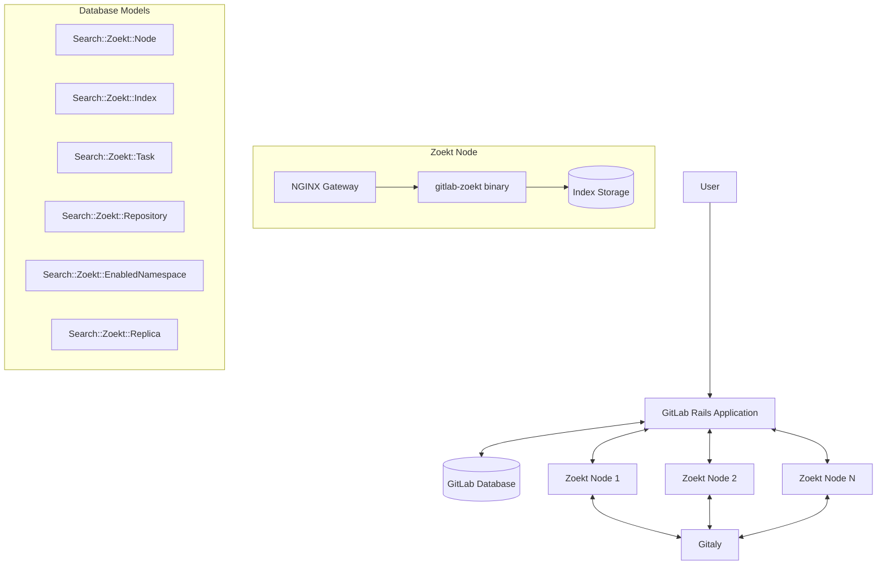
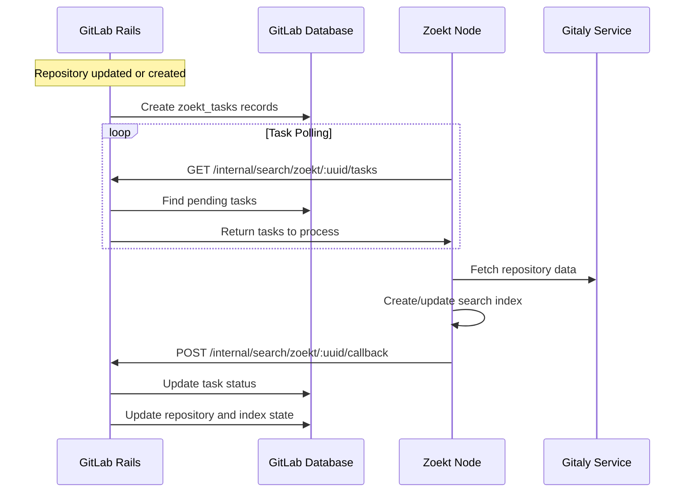
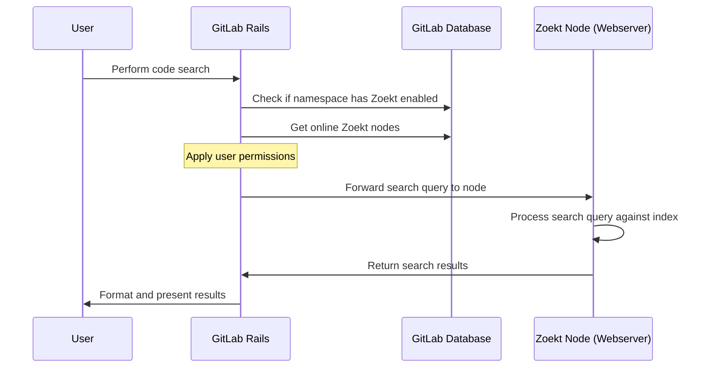
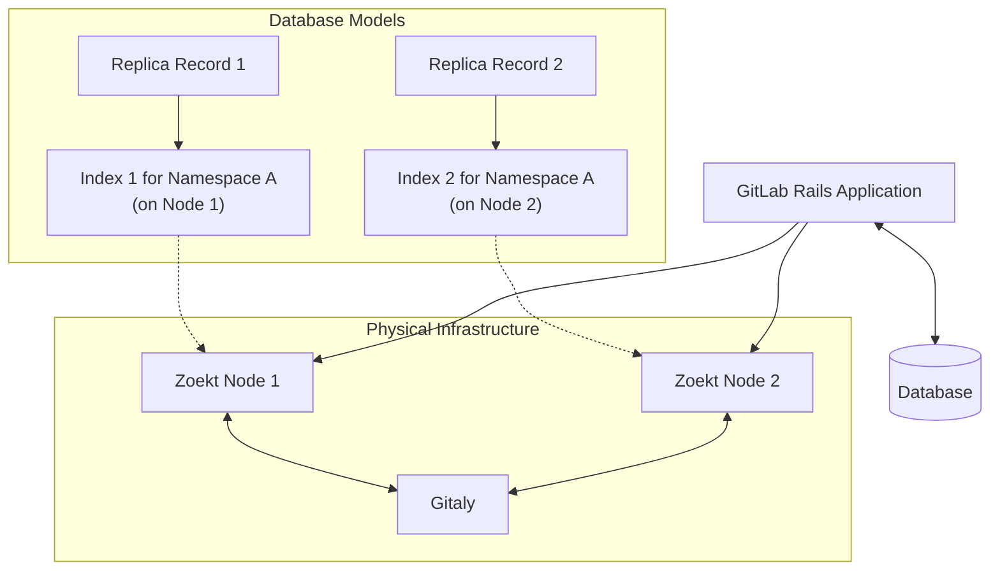
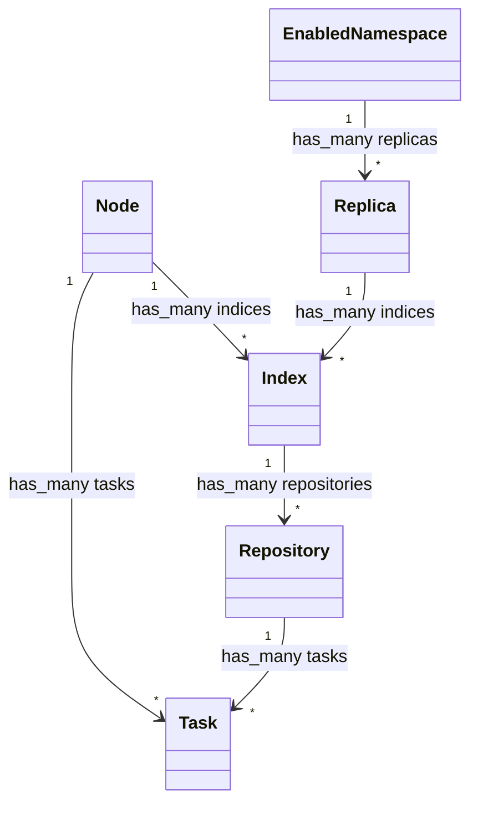
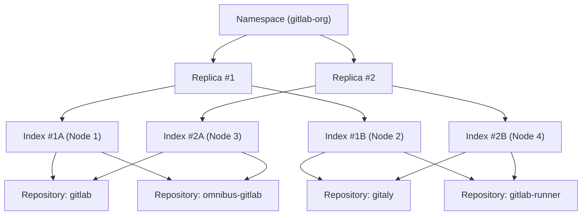



## Summary

We have implemented an additional code search functionality in GitLab that
is backed by [Zoekt](https://github.com/sourcegraph/zoekt), an open source
search engine specifically designed for code search. Zoekt is used as
an API by GitLab and remains an implementation detail, while the user interface
in GitLab has been enhanced with new features enabled by Zoekt's capabilities.

This integration provides significant improvements over the existing Elasticsearch-based search, including:

1. **Exact match mode**: Returns results that precisely match the search query, eliminating false positives
1. **Regular expression mode**: Supports regex patterns and boolean expressions for powerful code searching
1. **Multiple line matches**: Shows multiple matching lines from the same file in the search results
1. **Self-registering architecture**: Enables simple scaling and management of search infrastructure

## Motivation

GitLab code search functionality has historically been backed by Elasticsearch.
While Elasticsearch has proven useful for other types of search (issues, merge
requests, comments, etc.), it is not ideally suited for code search where users expect matches to be precise (no false positives) and
flexible (supporting features like [substring matching](https://gitlab.com/gitlab-org/gitlab/-/issues/325234)
and [regexes](https://gitlab.com/gitlab-org/gitlab/-/issues/4175)).

After [investigating our options](https://gitlab.com/groups/gitlab-org/-/epics/7404),
we determined that [Zoekt](https://github.com/sourcegraph/zoekt) is the most suitable
well-maintained open source technology for code search. Our research indicated that
the fundamental architecture of Zoekt matches what we would implement if we were
to build a solution from scratch.

Our [benchmarking](https://gitlab.com/gitlab-org/gitlab/-/issues/370832#note_1183611955)
showed that Zoekt is viable at our scale, and the integration has been successfully
deployed to GitLab.com.

### Goals

The main goals of this integration have been to implement the following highly
requested improvements to code search:

1. [Exact match (substring match) code searches in advanced search](https://gitlab.com/gitlab-org/gitlab/-/issues/325234)
1. [Support regular expressions with Advanced Global Search](https://gitlab.com/gitlab-org/gitlab/-/issues/4175)
1. [Support multiple line matches in the same file](https://gitlab.com/gitlab-org/gitlab/-/issues/668)

The rollout was designed to catch and resolve scaling or infrastructure cost issues
as early as possible, allowing us to pivot if necessary before investing too heavily
in this technology.

### Non-Goals

The following were not initial goals but could be built upon this solution in the future:

1. Improving security scanning features by leveraging fast regex scans across repositories
1. Reducing search infrastructure costs (though this may be possible with further optimizations)
1. AI/ML features to predict what users might be interested in finding
1. Comprehensive code intelligence and navigation features (which would require more structured data)

## Proposal

An [initial implementation of the Zoekt integration](https://gitlab.com/gitlab-org/gitlab/-/merge_requests/105049)
was created to demonstrate the feasibility of using Zoekt as a drop-in
replacement for Elasticsearch code searches. This design document outlines the details
of the implementation and the steps taken to scale the solution for GitLab.com and self-managed instances.

## Design and implementation details

### User Experience

When a user performs an advanced search on a group or project where Zoekt is enabled,
they can now toggle between two search modes in the UI:

- **Exact match mode**: Returns results that exactly match the query (default mode)
- **Regular expression mode**: Supports regex patterns and boolean expressions

Users can select their preferred search mode using a toggle in the UI. The search syntax supports advanced filtering with modifiers like:

- `file:` to filter by filename
- `lang:` to filter by programming language
- `sym:` to search within symbols (methods, classes, etc.)
- and other [syntax options](https://docs.gitlab.com/user/search/exact_code_search/#syntax)

Here's a screenshot of the new UI:


### Key Components

#### Unified Binary: `gitlab-zoekt`

Zoekt comes with it's own binaries for indexing and searching. Initially we used some of these and we started to build out our own binaries over time. We then pivoted to a single binary for both indexing and searching.
We call this unified binary `gitlab-zoekt`, which replaces the previously separate binaries (`gitlab-zoekt-indexer` and `gitlab-zoekt-webserver`). This is a Go codebase which uses public modules from the Zoekt codebase as a library, rather than using the binaries directly. This unified binary can operate in two distinct modes:

- **Indexer mode**: Responsible for indexing repositories
- **Webserver mode**: Responsible for serving search requests

Having a unified binary simplifies deployment, operation, and maintenance of the Zoekt infrastructure. The key advantages of this approach include:

1. **Simplified deployment**: Only one binary needs to be built, deployed, and maintained
1. **Consistent codebase**: Shared code between indexer and webserver is maintained in one place
1. **Operational flexibility**: The same binary can run in different modes based on configuration
1. **Testing mode**: The unified binary can run both services simultaneously for testing purposes

#### Database Models

Zoekt is not a distributed database (like Elasticsearch) or even really a database service (like Postgres) but instead it's a set of Go modules (and binaries) that interact with index files on disk. It supports creating index files and searching them. Since we needed to build a higher level distributed, clustered and replicated search engine on top of it we needed to manage all of the lifecycle of Zoekt processes and indexes somewhere. We chose to store all this lifecycle data in Rails and Zoekt processes periodically poll Rails state to figure out what to do next.

GitLab uses several database models to manage Zoekt:

- **[`Search::Zoekt::EnabledNamespace`](https://gitlab.com/gitlab-org/gitlab/-/blob/master/db/docs/zoekt_enabled_namespaces.yml)**: Tracks which top-level namespaces have Zoekt enabled
- **[`Search::Zoekt::Node`](https://gitlab.com/gitlab-org/gitlab/-/blob/master/db/docs/zoekt_nodes.yml)**: Represents a Zoekt server node with information about its capacity, status, and configuration
- **[`Search::Zoekt::Replica`](https://gitlab.com/gitlab-org/gitlab/-/blob/master/db/docs/zoekt_replicas.yml)**: Manages replica relationships for high availability
- **[`Search::Zoekt::Index`](https://gitlab.com/gitlab-org/gitlab/-/blob/master/db/docs/zoekt_indices.yml)**: Manages the index state for a top level namespace, including storage allocation and watermark levels
- **[`Search::Zoekt::Repository`](https://gitlab.com/gitlab-org/gitlab/-/blob/master/db/docs/zoekt_repositories.yml)**: Represents a project repository in Zoekt with indexing state
- **[`Search::Zoekt::Task`](https://gitlab.com/gitlab-org/gitlab/-/blob/master/db/docs/zoekt_tasks.yml)**: Tracks indexing tasks (index, force_index, delete) that need to be processed by Zoekt nodes

### Architecture Overview



The Zoekt integration consists of several key components working together:

1. **GitLab Rails Application**: Manages which repositories need to be indexed, coordinates with Zoekt nodes
1. **Zoekt Nodes**: Run the `gitlab-zoekt` binary to handle indexing and searching of repositories
1. **Gitaly**: Provides Git repository access to Zoekt for indexing
1. **Database**: Stores metadata about nodes, indices, tasks, and repositories

### Indexing Flow



The indexing process follows these steps:

1. When a repository is created or updated, the GitLab Rails application creates `zoekt_tasks` records
1. Zoekt nodes (running in indexer mode) periodically pull tasks through the internal API
1. Zoekt nodes process the tasks by fetching repository data from Gitaly and creating search indices
1. Zoekt nodes send callback notifications to GitLab to update task status
1. GitLab updates the appropriate database records (`zoekt_task`, `zoekt_repository`, `zoekt_index`)

`zoekt_task` can be of three different types:

- `index_repo`: Incremental indexing (from the last indexed SHA to the latest SHA of the default branch)
- `force_index_repo` or forced indexing: Full reindex of the repository (deletes existing index files and reindexes everything)
- `delete_repo`: Schedules existing indexed files for deletion

To avoid race conditions, there is a locking mechanism to ensure only one indexing operation occurs for a project at any given time.

### Search Flow



The search process follows these steps:

1. User performs a search in GitLab UI
1. GitLab determines if the search should use Zoekt based on user preferences and enabled namespaces
1. If Zoekt is appropriate, GitLab forwards the search to a Zoekt node running in webserver mode
1. Zoekt processes the search and returns results
1. GitLab formats and presents the results to the user

### Communication Flow

The communication between GitLab and Zoekt nodes happens through bidirectional API calls, all secured with appropriate authentication mechanisms.

#### Authentication Architecture

The Zoekt integration implements a comprehensive authentication system with these key components:

1. **Indexer → Rails Authentication (JWT)**: Zoekt indexer authenticates to GitLab Rails using JWT tokens signed with the GitLab shell secret
2. **Rails → Webserver Authentication (Basic Auth)**: GitLab Rails authenticates to Zoekt webserver using HTTP Basic Authentication via NGINX
3. **Future Planned Authentication (JWT)**: Plans to replace Basic Auth with JWT for Rails → Webserver authentication, mirroring the approach used for Indexer → Rails

This tiered authentication approach ensures secure communication in all directions while maintaining compatibility with GitLab's existing security patterns.

#### Task Retrieval API

Zoekt nodes periodically call GitLab's internal API to:

- Register themselves with GitLab (providing node information like UUID, URL, disk space)
- Retrieve tasks that need to be processed
- Update their status and metrics

```http
GET /internal/search/zoekt/:uuid/tasks
```

This API is secured with JWT authentication, where:

- The JWT token is generated by the Zoekt indexer using the GitLab shell secret
- The token is included in the `Gitlab-Shell-Api-Request` header
- GitLab Rails validates the token using the same shell secret

This authentication mechanism ensures that only authorized Zoekt nodes can register and retrieve tasks from GitLab.

#### Callback API

After processing tasks, Zoekt nodes call GitLab's callback API to:

- Update task status (success/failure)
- Provide additional information (for example, repository size)
- Report errors or issues

```http
POST /internal/search/zoekt/:uuid/callback
```

This API also uses JWT authentication with the same mechanism as the Task Retrieval API, ensuring secure bidirectional communication.

This asynchronous callback architecture is a significant improvement over the previous design, which used Sidekiq jobs for indexing operations. By using callbacks instead of blocking Sidekiq jobs, the system gains several important benefits:

1. **Reduced Sidekiq load**: Indexing operations no longer block Sidekiq workers, freeing them for other critical GitLab tasks
1. **Better scalability**: The number of concurrent indexing operations is only limited by Zoekt node capacity, not by Sidekiq worker availability
1. **Improved reliability**: If a node goes down during indexing, it doesn't leave Sidekiq jobs in an incomplete state
1. **More efficient resource usage**: Long-running indexing tasks don't consume valuable Sidekiq resources
1. **Separation of concerns**: Zoekt nodes handle indexing independently, reporting back only when completed

This approach allows GitLab to maintain a lightweight coordination role while the computationally intensive work is handled by specialized Zoekt nodes, resulting in better overall system performance and responsiveness.

#### Search API

GitLab calls the Zoekt webserver API to:

- Execute search queries
- Retrieve search results
- Apply filtering based on user permissions

```http
GET /api/search
```

In deployed environments (particularly with Helm), this communication is secured with HTTP Basic Authentication configured in NGINX. This provides a simple but effective authentication layer for search requests.

The authentication approach for search is planned to transition to JWT-based authentication in the future, which will provide more granular control and better align with GitLab's authentication patterns.

### Zoekt Infrastructure

Each Zoekt node runs a single `gitlab-zoekt` binary that can operate in both indexer and webserver modes simultaneously. The nodes store `.zoekt` index files on persistent storage for fast searches.

A typical deployment includes:

- The `gitlab-zoekt` binary serving both indexing and search requests
- Universal CTags for symbol extraction
- An internal NGINX gateway for routing requests

### Scaling and High Availability

#### Self-Registering Node Architecture

Zoekt implements a self-registering node architecture inspired by GitLab Runner:

1. Zoekt nodes register themselves with GitLab by providing their address, name, and status
2. GitLab maintains a registry of nodes with their status, capacity, and assignments
3. GitLab manages the shard assignments internally, assigning namespaces to specific nodes
4. Nodes that don't check in for a configurable period can be automatically removed

This architecture makes the system self-configuring and facilitates easy scaling.

Unlike the GitLab Runner the Zoekt nodes authenticate with a shared secret managed at the infrastructure level and cannot be registered by users. So self-registration is more of a convenience for the operator rather than a feature for users.

#### Sharding Strategy

1. Groups/namespaces are assigned to specific Zoekt nodes for indexing and searching
1. GitLab manages the shard assignments internally based on node capacity and load
1. When new nodes are added, they can automatically take on new workloads
1. If nodes go offline, their work can be reassigned to other nodes

#### Replication Strategy



The replication strategy works at the database record level rather than through actual data synchronization between nodes:

1. **Independent Indexing**: Each Zoekt node independently indexes repositories by fetching data directly from Gitaly
1. **Multiple Replica Records**: For high availability, GitLab can create multiple `Search::Zoekt::Replica` records for a single namespace
1. **Distributed Indices**: Each replica record is associated with an index record that may be assigned to different physical Zoekt nodes
1. **Fast Indexing**: Indexing is efficient (approximately 10 seconds for a large repository like `gitlab-org/gitlab`), making it practical to maintain multiple independent indices
1. **No Complex Synchronization**: This approach eliminates the need for complex index file synchronization between nodes
1. **Search Load Distribution**: GitLab can route search requests to any node that has an index for the relevant namespace

Currently, GitLab typically creates a single replica record per namespace, but the system is designed to support a configurable number of replicas per namespace in the future. This approach provides the following benefits:

- **Horizontal Scalability**: Add more nodes to handle more namespaces or increase replication
- **High Availability**: If one node fails, searches can be routed to other nodes with replica indices
- **Simple Operation**: No complex replication mechanisms to maintain or troubleshoot
- **Independent Scaling**: Search and indexing capacity can be scaled independently by adding more nodes

This design prioritizes operational simplicity and reliability while still providing the necessary redundancy for high availability.

Since our Zoekt database is not a source of truth (ie. it simply syncing repos from Gitaly) we do not need to worry about assigning specific replicas to be a "primary" or "leader". Instead we just let the replicas independently sync data from Gitaly and assume that each time they update the index they will get the new source of truth.

### Deployment Options

#### Kubernetes/Helm

GitLab provides a Helm chart ([`gitlab-zoekt`](https://gitlab.com/gitlab-org/cloud-native/charts/gitlab-zoekt)) for Kubernetes deployments with the following features:

- Deploys Zoekt in a StatefulSet with persistent volumes for index storage
- Configurable resource allocation, scaling, and networking options
- Automatic node registration and service discovery
- Gateway component for load balancing and authentication
- Configurable Basic Authentication through NGINX for Rails → Webserver communication

The `gitlab-zoekt` Helm chart has proven to be highly scalable in production environments. On GitLab.com, this deployment is handling over 36 TiB of data, demonstrating its ability to operate at enterprise scale. The chart's design allows for both horizontal and vertical scaling to accommodate growing code search needs while maintaining performance and reliability.

#### Docker/Container

Containers are built from the [CNG repository](https://gitlab.com/gitlab-org/build/CNG/-/tree/master/gitlab-zoekt) with:

- The unified `gitlab-zoekt` binary
- Universal CTags for symbol extraction
- Configurable environment variables for different operating modes

### Database Schema

Key database tables include:

- `zoekt_nodes`: Information about Zoekt server nodes
- `zoekt_indices`: Tracks the indexing state for namespaces
- `zoekt_repositories`: Maps GitLab projects to Zoekt indices
- `zoekt_tasks`: Queue of indexing tasks to be processed
- `zoekt_enabled_namespaces`: Configuration for which namespaces use Zoekt
- `zoekt_replicas`: Manages replica relationships for high availability

#### Database Model Relationships

The following diagram illustrates the relationships between the database models:



Here's an example of the database structure for a namespace with multiple replicas and indices:



In this example:

- A namespace (`gitlab-org`) has Zoekt enabled through an `EnabledNamespace` record
- Two replica records are created for this namespace
- Each replica has an associated index record, assigned to different physical nodes
- Each index contains repositories for multiple projects within the namespace
- Tasks are created for each repository, tracking their indexing state on the respective nodes

This structure enables high availability and load distribution while maintaining a clear organization of the relationship between namespaces, indices, nodes, and repositories.

### Current Development

#### Federated Search Using gRPC

A new [gRPC-based federated search capability](https://gitlab.com/gitlab-org/gitlab/-/issues/500087) is being developed to enhance search performance across multiple Zoekt nodes. This feature replaces the previous HTTP-based search proxying by using a more efficient gRPC streaming implementation.

#### JWT Authentication for Rails → Webserver

In addition to the gRPC improvements, there are plans to implement JWT-based authentication for the Rails → Webserver communication flow. This would replace the current Basic Authentication approach with a more secure JWT implementation that mirrors the existing Indexer → Rails authentication. The goal is to provide a consistent, unified authentication strategy across all communication channels while leveraging GitLab's existing security infrastructure.

The gRPC federated search offers several advantages:

1. **More efficient communication**: gRPC uses HTTP/2 for transport, providing better performance than HTTP/1.1
1. **Streaming between Zoekt nodes**: Results are streamed between Zoekt nodes as they're found, allowing the coordinating node to stop requesting results from other nodes once it has gathered enough matches
1. **Reduced latency**: Faster response times, especially for searches across many repositories, achieved through:
   - Concurrent searches across multiple nodes
   - Early termination once enough results are collected
   - More efficient binary protocol with HTTP/2
   - Processing results as they arrive rather than waiting for complete result sets
1. **Better resource management**: More granular control over search processing limits

It's important to note that while this implementation streams results between Zoekt nodes, the final results are still collected by the coordinating Zoekt node before being returned to Rails. The current implementation does not stream results to Rails. Instead, the performance benefits come from more efficient inter-node communication and the ability to stop searching once sufficient results are found, rather than exhaustively searching all repositories.

### Configuration Options

The GitLab Zoekt integration can be configured through:

1. **GitLab Admin Settings**: Enable/disable indexing and searching, configure concurrent indexing tasks, set auto-deletion settings
1. **User Preferences**: Enable/disable exact code search for individual users
1. **Zoekt Node Settings**: Resource allocation, storage configuration, network settings
1. **Feature Flags**: Control specific features or behaviors of the integration

### Rollout Strategy

The rollout strategy has followed these steps:

- [x] Initial availability for `gitlab-org` group
- [x] Improvements to monitoring and performance
- [x] Expansion to select customers with high code search needs
- [x] Implementation of sharding and replication for scalability
- [x] Gradual rollout to more licensed groups
- [x] Implementation of automatic balancing of shards
- [x] Assessment of costs and performance for broader rollout
- [x] Continued performance improvements
- [x] Availability to the majority of licensed groups on GitLab.com
- [ ] General availability to all licensed groups on GitLab.com (pending)

For self-managed instances, administrators can enable Zoekt by installing the required components and enabling the feature in the admin area.

### Monitoring and Maintenance

To monitor the health and performance of the Zoekt integration, GitLab provides:

1. **Admin UI**: Shows indexing status, node health, and storage utilization
1. **Rake Tasks**: Tools to check indexing status. For example,
   `gitlab:zoekt:info`
1. **Automated Management**: Features to automatically delete offline nodes, manage watermark levels, and redistribute indices
1. **Logging**: Detailed logging of indexing operations, search queries, and errors
1. **Metrics**: Performance metrics for indexing and search operations

### Watermark Management

The Zoekt integration implements a sophisticated watermark management system that operates at both the node level and index level to ensure efficient storage utilization while preventing resource exhaustion.

#### Node-Level Watermarks

Each Zoekt node has watermark thresholds based on the percentage of total disk space used:

1. **Low Watermark (60%)**: When disk usage exceeds this threshold, GitLab starts taking proactive measures to avoid reaching higher levels
1. **High Watermark (75%)**: Signals potential storage pressure and prioritizes rebalancing actions
1. **Critical Watermark (85%)**: May pause new indexing operations to prevent node overload while performing evictions

These node-level watermarks are used for overall node health monitoring and to make decisions about task assignment and index reallocation.

#### Index-Level Watermarks

In addition to node-level watermarks, each index within a node has its own watermark levels based on the ratio of used storage to reserved storage:

1. **Ideal Storage Utilization (60%)**: Target level for optimal operation
1. **Low Watermark (70%)**: Triggers evaluation for potential rebalancing or increasing reserved storage allocation
1. **High Watermark (75%)**: Indicates the index is consuming more storage than expected and may prompt additional storage allocation if available
1. **Critical Watermark (80%)**: May trigger eviction processes for this specific index or, if storage is available, a significant increase in reserved storage allocation

Each index has an associated `watermark_level` enum state that reflects its current status:

- `healthy`: Operating within expected parameters
- `overprovisioned`: Using less than the ideal storage percentage (has more reserved space than needed)
- `low_watermark_exceeded`: Exceeded the low watermark threshold
- `high_watermark_exceeded`: Exceeded the high watermark threshold
- `critical_watermark_exceeded`: Exceeded the critical watermark threshold

These watermark levels directly influence how storage allocation adjustments are made. Indices in the `ready` state can both increase their reserved storage when hitting higher watermarks (if node storage is available) or decrease their reservations when overprovisioned.

#### Storage Reservation Mechanism

The system uses a storage reservation mechanism where:

1. Each index maintains a `reserved_storage_bytes` value representing its allocation
1. The node tracks its total `usable_storage_bytes` and the sum of all index reservations
1. When an index needs more storage, it attempts to claim additional bytes from the node's unclaimed storage
1. Indices in a `ready` state can both increase and decrease their reservations as needed
1. Indices in initialization states can only increase their reservations until they're fully indexed

This reservation system prevents overcommitment of storage while allowing flexible allocation based on actual needs. If a node approaches its critical watermark, indices may be marked for eviction to reclaim space.

The combination of node-level and index-level watermarks provides a comprehensive approach to storage management, ensuring efficient resource utilization while preventing resource exhaustion at both the node and index levels.

## Conclusion

The Zoekt integration significantly improves GitLab's code search capabilities by providing exact match and regular expression search modes. The architecture is designed to be scalable, self-managing, and resilient, with features like node self-registration, automatic sharding, and high availability through replication.

The unified binary approach simplifies deployment and maintenance, while the bidirectional communication between GitLab and Zoekt nodes enables efficient task distribution and status tracking.

Current development efforts focus on enhancing search performance through gRPC-based federated search and improving overall system scalability to support namespaces with more than tens of thousands of projects.
