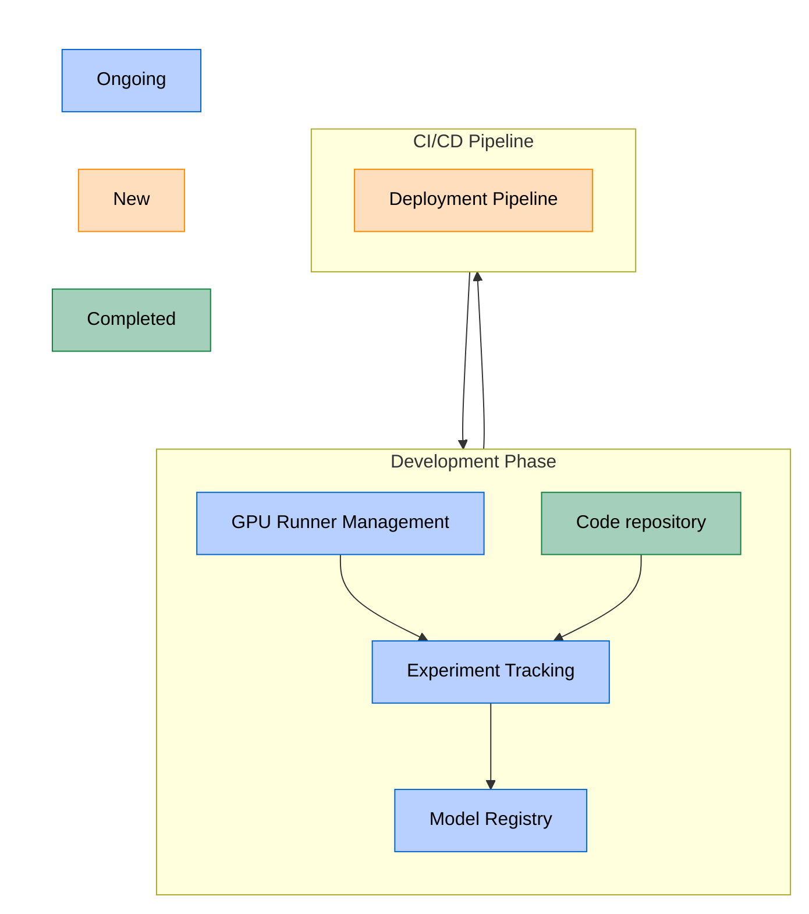



This blueprint describes GitLab end-to-end MLOps platform architecture, designed to support the complete machine learning lifecycle from experimentation to production deployment. This initiative supports our SaaS instance and self-managed instances while maintaining our "single application" philosophy.

## Summary

GitLab MLOps is an integrated platform that provides end-to-end machine learning lifecycle management capabilities within GitLab's single application. It extends GitLab's existing CI/CD and registry capabilities to support ML workflows from experimentation to production and observability.

## Motivation

Organizations face several key challenges when operationalizing ML:

1. **Reproducibility**: Data scientists struggle to track experiments and recreate results
1. **Collaboration**: Disconnect between data science, engineering and governance teams slows development
1. **Deployment**: Manual, error-prone processes for moving models to production
1. **Governance**: Difficulty maintaining oversight of model development, deployment and impact

These challenges often result in:

- Extended time-to-production for ML models
- Inconsistent development practices
- Security and compliance risks
- Resource inefficiencies

### Goals

- Provide end-to-end ML lifecycle management integrated with existing GitLab DevOps workflows
- Provide a Model Registry - a place to store model versions, runs, metadata and artifacts
- Enable deployment of model versions from the model registry using CI/CD pipelines
- Enable importing models from Vertex and Huggingface to GitLab model registry
- Limited compatability with MLflow client for model experiments and registry

### Non-Goals

- Providing extensive computation resources for model training beyond GPU runners
- Providing a model serving infrastructure
- Implementing feature stores
- Implementing data stores and becoming a dataops platform
- Developing a full-fledged MLflow server by achieving 100% MLflow API compatibility
- Model monitoring and tracing

## Proposal

GitLab will provide a comprehensive MLOps platform built on top of existing GitLab infrastructure, leveraging and extending our CI/CD capabilities, package registry for artifact storage. The platform will support the full ML lifecycle through dedicated components while maintaining GitLab single application philosophy.

## Design and Implementation Details

### Component Architecture

#### Diagram Notes

- **Code Repository**: This is the Git repository either remote or locally.
- **Experiment tracking**: Code produces runs, artifacts, metrics etc. the metadata is stored centrally in Experiment Tracking
- **Model Registry**: Uses Package Registry to store artifacts
- **Deployment pipeline**: These are triggered either via Model Registry or via Git triggers.

### Core Components

#### 1. Experiment Tracking  (existing feature)

The experiment management system will track ML training runs and their parameters:

- [Experiment tracking](https://docs.gitlab.com/ee/user/project/ml/experiment_tracking/) with metadata storage
- [Metric logging and visualization](https://docs.gitlab.com/ee/user/project/ml/experiment_tracking/#view-logged-metrics)
- [Storing artifacts](https://docs.gitlab.com/ee/user/project/ml/model_registry/#add-artifacts-to-a-model-version)
- [Compatibility with MLflow client](https://docs.gitlab.com/ee/user/project/ml/experiment_tracking/mlflow_client.html)
- Access control and security policies for model experiments based on existing roles, custom roles and model registry read and write permissions.  See [Roles and permissions for model registry and experiments](https://docs.gitlab.com/user/permissions/#machine-learning-model-registry-and-experiment)
- Data stored as in the code repository for smaller data sets using git or larger sets using git LFS.

#### 2. Model Registry (existing feature)

Central repository for ML model management: [Model registry docs](https://docs.gitlab.com/ee/user/project/ml/model_registry/).

- Model versioning and tagging (link to [docs](https://docs.gitlab.com/ee/user/project/ml/model_registry/#model-versions-and-semantic-versioning))
- Model metadata and lineage tracking
- Model approval workflows using GitLab labels for models and versions
- Integration with CI/CD pipelines to allow training and deployment
- Access control and security policies for model registry based on existing roles, custom roles and model registry read and write permissions.
- Compatibility with MLflow client
- Model cards with freeform markdown descriptions
- Governance instruments
- Users can store large data files in model registry too next to their model version artifacts for example.
- Integration with GCP Vertex AI [model registry](https://gitlab.com/gitlab-org/modelops/mlops/gitlab-mlops/-/tree/main/gitlab_mlops/provider/gcp?ref_type=heads)

#### 3. Connection to GPU resources (existing feature)

Link to [GPU runners docs](https://docs.gitlab.com/ee/ci/runners/hosted_runners/gpu_enabled.html).

- Maintain compatibility with GitLab runner
- Ensure ease of use with GPU runners

#### 4. Model Deployment

Automated model deployment pipeline:

- Container-based deployment
- Multi-variate testing support
- Canary deployments
- Rollback capabilities
- Environment management
- Integration with GCP Vertex AI for deployment

#### 5. API Clients

- [Gitlab MLOps client for Python](https://gitlab.com/gitlab-org/modelops/mlops/gitlab-mlops)
- [Limited MLflow client support](https://docs.gitlab.com/user/project/ml/experiment_tracking/mlflow_client/#supported-mlflow-client-methods-and-caveats): Logging of metrics, artifacts. Creation of models, versions and runs.
- Command-line (cURL) support with the existing [API](https://docs.gitlab.com/development/documentation/restful_api_styleguide/#curl-examples)

### Integration Points

1. **GitLab CI/CD Integration**

    - Provide training, evaluation and validation CI/CD templates for ML workflows using GitLab (GPU) runners.
    - Predefined variables for ML operations
    - ML-specific CI/CD stages

2. **Issue Tracking Integration**

    - Model development issues
    - Approval workflows

3. **GitLab Package registry**

   - Used for storage of model artifacts

### Deployment Options

MLOps will support self-managed installation, including support for air-gapped environments and GitLab.com deployment and GitLab Dedicated.

### Development Guidelines

No additional need beyond GDK. You might need MLflow client and [GitLab MLOps Python Client](https://pypi.org/project/gitlab-mlops/)

## Out of scope

- Full MLflow client compatibility
- LLMOps
- AgentOps
- Model Governance, Security and Compliance
- Container Registry Integration

## Conclusion

This technical blueprint provides a framework for implementing a comprehensive MLOps platform within GitLab. The proposed architecture leverages GitLab existing strengths while adding ML-specific capabilities that enable organizations to effectively manage their ML workflows at scale.
