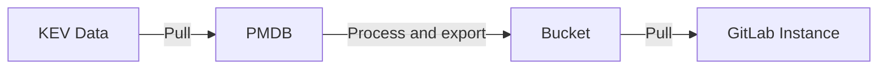
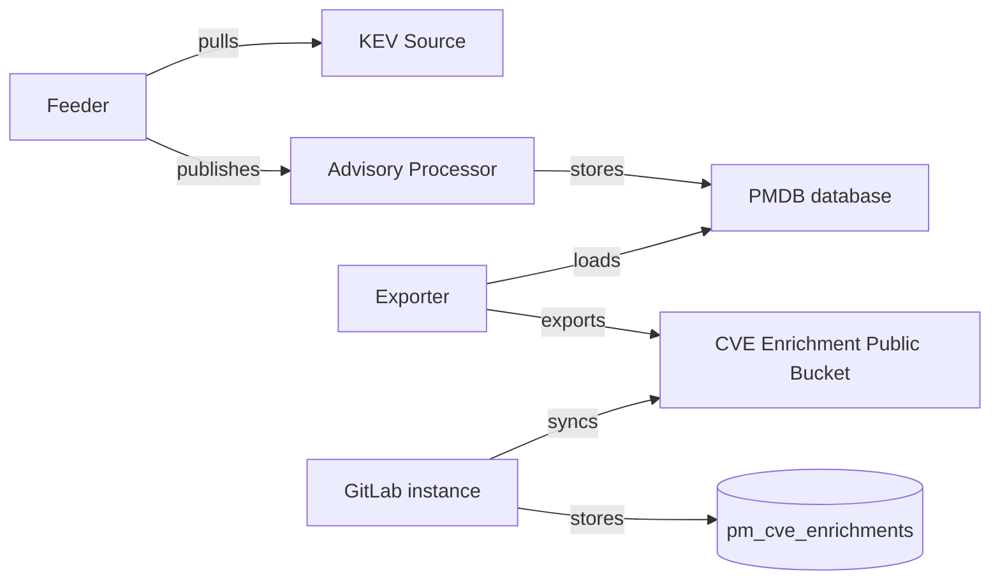

<!-- This renders the design document header on the detail page, so don't remove it-->


## Summary

[KEV (Known Exploited Vulnerabilities)](https://www.cisa.gov/known-exploited-vulnerabilities-catalog) is a catalog
maintained by [CISA](https://www.cisa.gov) that identifies vulnerabilities
that have been actively exploited in the wild.
KEV support in GitLab aims to enhance vulnerability prioritization and
remediation efforts by highlighting these high-risk vulnerabilities.
The KEV support requirements are outlined
in [the KEV epic](https://gitlab.com/groups/gitlab-org/-/epics/11912). This
document focuses on the technical implementation of KEV support.

KEV data will be sourced from the CISA KEV catalog, which is
available [as a JSON file on the CISA website](https://www.cisa.gov/sites/default/files/feeds/known_exploited_vulnerabilities.json).
This file is regularly updated by CISA and can be
downloaded and processed to extract the latest KEV information.
The goal is to make KEV information accessible through the GitLab GraphQL API,
visible on vulnerability report and details pages, and usable for filtering and
policy setting.
The implementation will leverage the existing Package Metadata Database (PMDB,
also known as license-db) infrastructure for advisory pull-and-enrichment. The
flow is as follows:

## Motivation

The classic approach to vulnerability prioritization is using severity based on
CVSS.
This approach provides some guidance, but is too unrefined - more than half of
all published CVEs have a high or critical score.
Other metrics need to be employed to reduce remediation fatigue and help
developers prioritize their work better. KEV provides a focused list of
vulnerabilities that are actively exploited in the wild.
These vulnerabilities also likely have documented exploitation techniques which
attackers may reproduce. Many vulnerabilities marked as critical will never be
exploited; KEV defines a list of ones that have been exploited and likely will
be exploited again.
Combined with existing prioritization methods, KEV helps to focus remediation
efforts on the most immediate threats and reduce overall remediation workload.
By adding KEV data to the information presented to users, we deliver these
benefits to the GitLab platform, enabling more effective and efficient
vulnerability management.

Additionally, FCEB (federal civilian executive branch) agencies must address
vulnerabilities in the KEV catalog
under [BOD 22-01](https://www.cisa.gov/news-events/directives/bod-22-01-reducing-significant-risk-known-exploited-vulnerabilities).
While this directive doesn't apply to other government levels or industry, they
often follow federal cybersecurity guidance, making it relevant to a wider
audience.

### Goals

- Enable users to use KEV data on GitLab as another metric for their
  vulnerability prioritization efforts.

#### Phase 1 (MVC)

- Enable access to KEV status through GraphQL API.

#### Phase 2

- Show KEV information in vulnerability report and details pages.

#### Phase 3

- Allow filtering vulnerabilities based on KEV status.
- Allow creating policies based on KEV status.

### Non-Goals

- Dictate priority to users based on KEV (or any other metric).

## Proposal

Support KEV on the GitLab platform.

Following the discussions in
the [KEV epic](https://gitlab.com/groups/gitlab-org/-/epics/11912), the proposed
flow is:

1. PMDB database is extended with a new table to store KEV data.
1. PMDB infrastructure runs the KEV feeder daily to pull, process, and publish
   KEV data.
1. The advisory-processor receives the KEV data and stores them to the PMDB DB.
1. The exporter combines KEV and EPSS data into a single CVE enrichments
   dataset, exporting it to a dedicated bucket.
1. GitLab instances pull the CVE enrichments data from the bucket.
1. GitLab instances store KEV and EPSS data in a new `pm_cve_enrichments` table.
1. GitLab instances expose KEV status through GraphQL API and present data in
   vulnerability report and details pages.

## Design and implementation details

### Decisions

- [001: Unify KEV and EPSS as CVE Enrichments](decisions/001_unify_kev_and_epss_as_cve_enrichments.md)

### Important note

- Though the KEV catalog is updated with new entries, the status of exploited
  vulnerabilities rarely changes.
  However, [vulnerabilities can be removed from the catalog](https://www.cisa.gov/news-events/alerts/2023/12/01/cisa-removes-one-known-exploited-vulnerability-catalog#:~:text=CISA%20Removes%20One%20Known%20Exploited%20Vulnerability%20From%20Catalog,-Release%20Date&text=As%20a%20result%20of%20this,816L%20Remote%20Code%20Execution%20Vulnerability),
  and CISA doesn't guarantee immutability here. Therefore, we should support
  this edge case as well.

### PMDB

- Create a new KEV table
  in [PMDB](https://gitlab.com/gitlab-org/security-products/license-db) with an
  advisory identifier. This includes changing
  the [schema](https://gitlab.com/gitlab-org/security-products/license-db/schema)
  and any necessary migrations.
- Ingest KEV data into this new PMDB table. Make sure to remove advisories that
  do not exist in the JSON and have been removed from the catalog.
- Export KEV data along with EPSS data as a unified CVE enrichments dataset.
- Add new pubsub topics to deployment to be used by PMDB components, using
  existing terraform modules.

### GitLab Rails backend

- Create a new `pm_cve_enrichments` table in the GitLab database to store
  unified KEV and EPSS data.
- Configure Rails sync to ingest the unified CVE enrichments data and save to
  the new table.
- Include KEV status attribute in GraphQL API Occurrence objects, querying from
  the `pm_cve_enrichments` table.

### GitLab UI

- Add KEV status to vulnerability report page.
- Add KEV status to vulnerability details page.
- Allow filtering by KEV status.
- Allow creating policies based on KEV status.

## Glossary

- **PMDB** (Package metadata database, also known as License DB): PMDB is a
  standalone service (and not solely a database), outside of the Rails
  application, that gathers, stores and exports packages metadata for GitLab
  instances to consume.
  See [complete documentation](https://gitlab.com/gitlab-org/security-products/license-db/deployment/-/blob/main/docs/DESIGN.md?ref_type=heads).
  PMDB components include:
  - **Feeder**: a scheduled job called by the PMDB deployment to publish data
  from the relevant sources to pub/sub messages consumed by PMDB processors.
  - **Advisory processor**: Runs as a Cloud Run instance and consumes messages
    published by the advisory feeder containing advisory related data and
    stores them to the PMDB database.
  - **PMDB database**: a PostgreSQL instance storing license and advisory
    data.
  - **Exporter**: exports license/advisory data from the PMDB database to
    public GCP buckets.
- **GitLab database**: the database used by GitLab instances.
- **CVE** (Common Vulnerabilities and Exposures): a list of publicly known
  information-security vulnerabilities. "A CVE" usually refers to a specific
  vulnerability and its CVE ID.
- **CISA** (Cybersecurity and Infrastructure Security Agency) is a U.S. agency
  focused on cybersecurity and infrastructure protection.
- **KEV** (Known Exploited Vulnerabilities): a catalog of actively exploited
  vulnerabilities maintained by CISA
