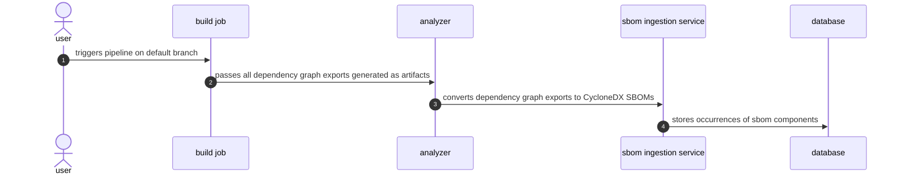

<!-- This renders the design document header on the detail page, so don't remove it-->


<!--
Don't add a h1 headline. It'll be added automatically from the title front matter attribute.
For long pages, consider creating a table of contents.
-->

## Summary

The dependency scanning feature is powered by a set of analyzers - `gemnasium`,
`gemnasium-maven`, and `gemnasium-python`. Associated with CI templates, these analyzers have the
responsibility of detecting supported projects, building the dependency graph or
list when needed, parsing the detected dependencies, and finally, producing a
security report with detected vulnerabilities alongside a CycloneDX SBOM that
contains the dependencies. This approach has worked well, but over time it's
become evident that the actions required to build a project's dependency graph
exports come with a lot of complexity. This complexity negatively impacts the
maintenance and creation of features, and the user experience of setting up and
maintaining the dependency scanning analyzer.

## Motivation

The high cost associated with building the dependency graphs/list exports
motivates us to rethink how we can structure the dependency scanning feature.
Instead of building the project dependency graphs or lists for customers, we
can delegate this responsibility to a job that runs before the analyzer does.
A build stage is a very common part of the development cycle, and generating the
dependency artifacts during this stage is a lot simpler than mapping existing
build system configuration values to the ones used by the gemnasium set of
analyzers.

In addition, build jobs can take a considerably large amount of time, so removing
the build process from dependency scanning reduces user's CI minute usage, and
further tightens the development feedback loop. Further yet, building a
project twice presents the possibility that the analyzer may build something that
does not match what is deployed. This mismatch can lead to false positives and
negatives, both of which skew a project's security status signal.

### Goals

- Customers remove the need to set up a secondary build process. Historically,
  Python and Java have required a build process.
- Reduced bug maintenance costs. A large amount of our issues surface from edge
  cases that are already handled by a customer in a previous build step, but were
  not accounted for by the analyzer's build implementation. These issues
  increase the code complexity, and cut into scheduled additions and improvements.
- Offline support by default.
- Reduced security maintenance costs. Building projects means that the analyzer
  images need to ship with pre-installed versions of supported build systems, for
  example Gradle and Maven, and runtimes like Java or Python.
- Removal of historical limitations like single project analysis for Java and
  Python monorepos.

### Non-Goals

- Supporting 3rd party SBOM generators. We can still support this in a future
  iteration.

## Proposal

Create a new analyzer that focus on supporting only
[dependency graph exports](https://docs.gitlab.com/ee/user/application_security/terminology/#dependency-graph-export).
Document how to generate the exports with example projects, and provide
a dependency scanning CI/CD component that scans the generated artifacts.

Because of the change to SBOM-based scanning in [epic 8026](https://gitlab.com/groups/gitlab-org/-/epics/8026),
do not port over the vulnerability matching done by the Gemnasium analyzers,
as this functionality is already [planned for deprecation](https://gitlab.com/groups/gitlab-org/-/epics/14146).
The new analyzer should be based on a scratch image to reduce the attack surface introduced by container dependencies.

### Pros

- Simplified integration tests. No need to test against various permutations of
  package managers, runtime, and compiler versions.
- We should always have zero container-scanning vulnerabilities. This translates
  to a reduced workload on the engineers going through reaction rotation.
- Smaller image sizes. Fast CI job start-up, reduced network traffic.
- Simplified FIPS-compliance as the library does not use crypto libraries.
- Improved community contribution experience due to simplified permissions for
  development pipeline execution.

### Cons

- Additional documentation required with examples and guides on getting started
  with a dependency scanning for certain package managers.
- Requires the establishment of new graph export naming standards.
- Users need to configure their build jobs as instructions. It doesn't work out of the box.

## Design and implementation details

At a high level, the new dependency scanning feature will operate as follows.

### Build job(s)

It's important to note that we cannot expect for a dependency graph export to be
checked into a project's repository. This is likely to happen in cases where
the dependency graph export does not also function as a lock file like in the
cases of `pipdeptree` and `pipenv graph` dependency graph exports. In such
cases, we will expect the build job to generate the dependency graph exports,
and for the job to store these as [job artifacts](https://docs.gitlab.com/ee/ci/jobs/job_artifacts.html).

We'll use the following naming conventions to establish a contract with users on
what file's we'll detect in cases where the dependency graph export does not
function as a lock file, and thus does not have a canonical name.

| Pattern | Description
| ------- | -----------
| `**/go.graph` | Generated via `go mod graph > go.graph`
| `**/pipenv.graph.json` | Generated via `pipenv graph --tree-json > pipenv`

It's required for the build job to run in a stage that precedes the one in which
the dependency scanning analyzer runs. This is true by default, since the
analyzer runs in the `test` stage which runs after the `build` stage.

### Analyzer

Once the build jobs complete, and the artifacts are stored, they will be passed
on to [proceeding jobs](https://docs.gitlab.com/ee/ci/jobs/job_artifacts.html#prevent-a-job-from-fetching-artifacts)
unless specifically asked not to do so. The analyzer takes advantage of this and
expects that users have configured the build jobs to pass on the artifacts using
the documented naming patterns. It will then search the entire target directory,
by default this is the project's repository, detect all supported files, parse
them, and convert them into a CycloneDX SBOM that can be utilized by the
services running in the GitLab monolith.

### Pros

- No preinstalled compilers, runtimes or system dependencies
  required.
- Small attack surface.
- Runs offline by default.

### Cons

- Graph export documentation varies in quality. Some package managers like `npm`
  document each version of the lock file, while others like `pnpm` do not.
- Java and Python projects require additional configuration since they do not
  capture graph information in their lock files by default.

## Alternative Solutions

### Require lock file, add graph information to it

One alternative solution to dependency graph exports is to make every supported
lock file a dependency graph export by default. In this scenario, we would work
directly with package manager maintainers to enhance lock files with transitive
dependency relationships, and dependency group metadata. For example, we could
work with the Gradle maintainers to add a new version of their `gradle.lockfile`
that includes parent dependencies. Our contributions would have the added
benefit of improving the experience for our users by including the necesssary
tooling out of the box, overall improving the workflow for getting started with
GitLab's dependency scanning feature.

#### Pros

- Does not require establishing new file requirements.
- Works out of the box in majority of cases. Package managers usually generate
  a lock file if one doesn't exist.

#### Cons

- Package managers tend to have large code bases that increase the onboarding
  time required.
- Lock files require domain expertise. For example, in [pnpm's issue 7685](https://github.com/pnpm/pnpm/issues/7685)
  you can see the discussion of a very specific corner case that must be handled.
- Project maintainers have their own sets of concerns that may not align with
  our own. For example, they may prioritize stability and maintenance over new
  features.
- Older versions of package managers, or build tools, would not be compatible
  with new additions.

### Rely on 3rd party CycloneDX generators

This approach moves the direction of composition analysis so that we interface
only with user provided `cyclonedx` CI reports from 3rd party CycloneDX generators.

#### Pros

- No CI/CD component integration testing.
- No analyzer maintenance required.

#### Cons

- Tied to the GitLab release schedule, so we can't deploy new features,
  enhancements, and bug fixes mid milestone.
- There are a lot of third party analyzers that can generate a CycloneDX report.
  Supporting all of their custom [metadata properties](https://cyclonedx.org/docs/1.5/json/#metadata_properties)
  and [component properties](https://cyclonedx.org/docs/1.5/json/#components_items_properties)
  can be challenging.
- Requires time to get up to speed with third party SBOM generator code bases.
- Proposals to the generators may be rejected. If required, we could fork the
  project, but that comes with its own set of challenges.
- Dependency graphs may be incomplete like `cyclondex_py` in some circumstances.

### Generate custom dependency graph exports with package manager plugins

In the cases where package managers expose a public API, we are able to write a
plugin to generate the dependency graph in a format of our choosing. This has
been used for `gemansium-maven` dependency analysis.

#### Pros

- Choice of output format.
- Can re-use the bundled `gemnasium-maven` plugins.

#### Cons

- Not all package managers have support for third party plugins. For example,
  `pnpm` does not have documented plugin support.
- Plugins that do not use Ruby or Go require new language expertise, which
  lead to a smaller pool of plugin maintainers, and higher review load per
  maintainer.
- Additional overhead required for the maintenance, improvements, and
  deployments of plugin projects.

## Appendix

- [dependency graph export](https://docs.gitlab.com/ee/user/application_security/terminology/#dependency-graph-export)
- [package manager](https://docs.gitlab.com/ee/user/application_security/terminology/#package-managers)
- [lock file](https://docs.gitlab.com/ee/user/application_security/terminology/#lock-file)
