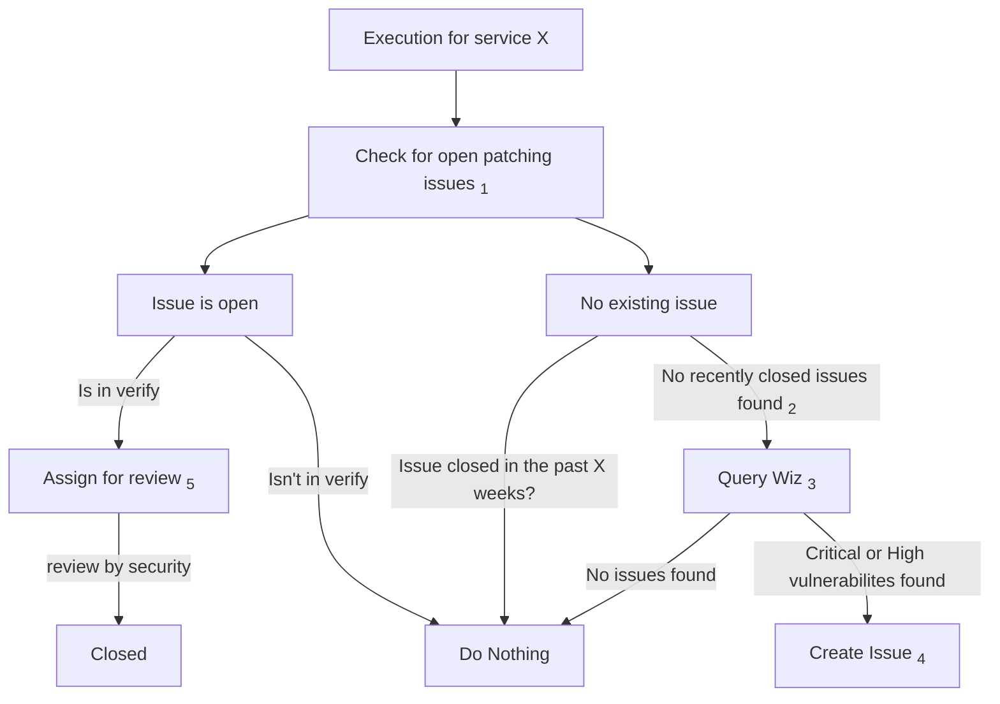



This document is a work-in-progress and proposes architecture changes for the GitLab.com SaaS.
The goal of this document is to define the processes followed for applying security patches to the major Linux fleets supporting GitLab.com.

This document is intended to extend the Linux OS Patching [runbook](https://gitlab.com/gitlab-com/runbooks/-/blob/master/docs/security-patching/linux-os/linux-os-patching.md?ref_type=heads), where existing processes and patching cadences are defined. Please refer to that document for scope definitions.

## Current state

As described in the [Services](https://gitlab.com/gitlab-com/runbooks/-/blob/master/docs/security-patching/linux-os/linux-os-patching.md?ref_type=heads#services) section of the previously mentioned runbook. Most of the systems currently in scope lack meaningful automation to help us keep these systems up to date with security patching. This means that most patching done is currently reactive in nature, and done manually. This is time consuming, and represents considerable toil for our SRE teams.

## Scope

This proposal looks to target Kernel and OS package vulnerabilities found on the VM instances that directly support the
services running on GitLab.com. The primary fleets being targeted are as follows:

| Service | Owner | Exposure | Maintenance Impact | Automation |
| ------- | ----- | -------- | :----------------: | :--------: |
| Runner Managers | scalability:practices | internal | low | no |
| HAProxy | production_engineering_foundations | external | low | no |
| Gitaly | gitaly | internal | high | no |
| Patroni | reliability_database_reliability | internal | low | no |
| PGBouncer | reliability_database_reliability | internal | low | no |
| Redis | scalability_practices | internal | low | no |
| Console | none | internal | low | no |
| Deploy | none | internal | medium | no |
| Bastions | none | external | low | no |

*See the [table in runbooks](https://gitlab.com/gitlab-com/runbooks/-/blob/master/docs/security-patching/linux-os/linux-os-patching.md?ref_type=heads#services) for additional details*

## Proposal

This proposal looks to implement a process that does the following:

1. Notifies system owners when patching is nearing it's due date, based on the previously defined patching cadence in the Linux OS Patching [runbook](https://gitlab.com/gitlab-com/runbooks/-/blob/master/docs/security-patching/linux-os/linux-os-patching.md?ref_type=heads#services). It should include recent vulnerability findings in these notifications.
1. Provides a common place to implement patch automation tooling. We want to avoid duplication of work, and maintenance overhead of the process by using a common set of tools across systems where possible.
1. Once patching has been performed, new vulnerability reports for the system will be provided that confirm whether or not the identified issues have been resolved.
1. Provides the results to security and compliance teams.

### Notifications

*The below proposal is planned to be a stop-gap solution to get working system patching notifications in place
while a permanent solution is built within [VulnMapper](https://gitlab.com/gitlab-com/gl-security/threatmanagement/vulnerability-management/vulnerability-management-internal/vulnmapper).*

I propose a script be written to take on the responsibility of creating GitLab issues that are assigned to the appropriate service owner team.

A general workflow that this might follow looks like:

1. The script looks for service configuration that defines patching and reboot cadences.
    1. It could get this either from the [service-catalog](https://gitlab.com/gitlab-com/runbooks/-/blob/master/services/service-catalog.yml), or configuration local to the script.
1. It looks for previously closed (or opened) patching notification issues for each service.
1. It queries [Wiz](../../../business-technology/tech-stack/#wizio) for vulnerabilities related to each service.
1. If there are Critical or High severity vulnerabilities found for a system, and the system is due for patching based on the closure time of the previous patching issue, a new issue is created with the vulnerability findings attached.
1. Once patching is complete (as designated by a workflow label), Wiz is queried again with updated findings being attached to the issue.
1. Security / Compliance teams are notified (or assigned) on the issue for final sign-off.

A flow chart of how this proposal would work:

1. We'll look for all patching issues that contain the `~Service::` label
   associated with the script execution run. If none are open, we record the
   time that the last patching issue was closed.
2. Recently closed is defined as the current date minus the patching cadence
   specific for the service. We do this primarily as a mechanism to ensure we
are only creating a single issue within our agreed upon patching cadence,
preventing issue spam and considerable SRE toil.
3. We query Wiz for all vulnerabilities found, and then group them by a common
   label. Currently this is the `gitlab_com_service` label pulled in from GCP.
4. When creating a new issue, we do the following:
    1. Add a summarization of the vulnerabilities found for the fleet, grouped by CVE.
    1. Set a due date
    1. Assign the issue to the team (or manager of said team).
5. When the issue is moved to `workflow-infra::verify`, we attach an updated list of vulnerabilities to
   the issue, and assign to the user/team responsible for the review.

### Patch automation

#### Proposal

I'm proposing that we use Ansible playbooks stored in a central repository, where they can be executed with CI pipelines to automate patch application where applicable.

Initially, the CI pipelines would likely be run by hand in response to patching notification issues that are created based on each service's defined patching cadence. As confidence is built in the process, these pipelines could be set to run on a schedule, where no SRE intervention is required.

Example Playbooks:

- [HAProxy](https://gitlab.com/gitlab-com/gl-infra/ops-team/toolkit/patch-automation/-/blob/main/haproxy.yaml?ref_type=heads)
- [Bastion hosts](https://gitlab.com/gitlab-com/gl-infra/ops-team/toolkit/patch-automation/-/blob/main/bastion.yaml?ref_type=heads)

Pros:

- We can easily reuse common tasks such as:
  - Alert silencing / unsilencing
  - Chef enable / disable
  - Apt package upgrades
- Concurrency and update ordering is easily controllable with variables.
- System discovery is straightforward with the GCP inventory plugins.
- By preserving logs from the CI pipelines, we will retain the full Ansible playbook output "for free" in a common location.

Cons:

- Requires a user with full `sudo` privileges to be installed across all systems.
  - This can be somewhat mitigated by limiting where login is allowed from to specific systems.
- This would likely only work with systems we manage with Chef.

##### Ansible Execution

Given the elevated privileges required to execute Ansible across the majority of
our fleet, care must be taken regarding where execution is run from, and who can
access the private keys allowing login. The following risk mitigation techniques
will be used:

1. The private key will be stored in Vault with limited read access granted.
1. The key will only be used from a single project on the ops.gitlab.net GitLab instance and fetched from Vault.
1. Git commit and pipeline execution in this project will be restricted to infrastructure SREs that are
responsible for patching operations.
1. The user provisioned for this purpose will have login restricted to a single
   network where runners are created for the Ops GitLab instance running in
us-central1.
1. Protected environments will be used to require multiple approvals from
   qualified SREs before pipeline execution is allowed in the GPRD environment.
1. The repository will be subject to regular compliance auditing, by means of
   the completion of a [Security Compliane Intake](https://gitlab.com/gitlab-com/gl-security/security-assurance/security-compliance-commercial-and-dedicated/security-compliance-intake/-/issues/new?issue%5Btitle%5D=System%20Intake:%20%5BSystem%20Name%20FY2%23%20Q%23%5D&issuable_template=intakeform) issue.

#### Alternatives considered

##### Ansible Pull

Pros:

- Because [ansible-pull](https://docs.ansible.com/ansible/latest/cli/ansible-pull.html) is pull based, no elevated credentials need to be installed across the fleet to coordinate patching.
- Common tasks could likely still be reused among nodes.

Cons:

- Because ansible-pull uses cron, it would be difficult (or impossible) to control when the patches would be applied on each node.
- This would likely only work with systems we manage with Chef.

##### Internally developed patching scripts

It was considered that we could develop scripts that perform the same actions as Ansible, but using scripts maintained ourselves.

Pros:

- We could provision users on all instances that have limited privileges to the systems.
  - A user could be installed with only `sudo` privileges to the commands required for patching the system.
- The scripts could still be called against remote instances from a CI pipeline.
- Concurrency and update ordering can still be controlled.
- We could script around systems that aren't Chef managed VMs.

Cons:

- Maintenance overhead is likely to be significant.
- The process is going to be more fragile compared to using an off-the-shelf tool like Ansible
- A user with login access is still going to need to be installed on each system. We're only limiting the access that the user has with this method.
