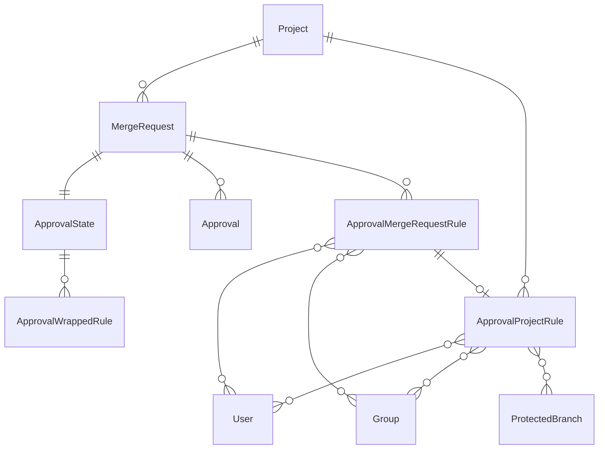
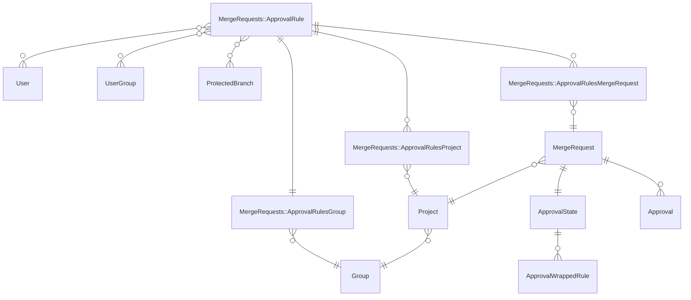



## Summary

This blueprint outlines a major re-architecture of GitLab's approval rules system, which aims to enhance performance and flexibility.

The proposed changes seek to address 3 key objectives:

- Boost the efficiency of approval rule modifications, particularly in projects with numerous open Merge Requests (MRs).
- Streamline updating approval rules across various levels, including groups, projects, and MRs.
- Lay the groundwork for the future implementation of group-level approval rules.

## Motivation

By implementing a more efficient architecture, it is expected that GitLab will improve the performance of approval rule updates, enabling and reflecting those changes across various levels of entities. This rearchitecting also lays the groundwork for future implementations, such as group-level approval rules, ensuring GitLab can evolve to meet the needs of complex organizational structures. Users will benefit from faster approval rule updates, improved rule management across different organizational levels, enhanced overall performance, and a more seamless workflow.

### Current limitations

Changes to project-level rules are not reflected in any MR-level rules after they have been created. To mitigate this problem we allow project administrators to restrict the editing of approval rules at the MR-level. This means project-level rules are applied directly to MRs, and any updates to them are not propagated. See [prevent editing approval rules in merge requests](https://docs.gitlab.com/ee/user/project/merge_requests/approvals/settings.html#prevent-editing-approval-rules-in-merge-requests) for more details.

### Goals

Ideally, we would like to be able to:

- Allow the addition of group approval rules. Without this new architecture, [propagating new and modified group approval rules](https://gitlab.com/gitlab-org/gitlab/-/issues/509984#note_2291076614) to sub groups, projects and MRs [would be very expensive](https://gitlab.com/gitlab-org/gitlab/-/merge_requests/48511#note_469497257). With this new architecture, that operation becomes more manageable.
- Allow users to modify inherited rules within MRs, projects, and sub-groups.
- Facilitate updating of open MR level rules from the project level where overriding is allowed but has not occurred. For more details, see https://gitlab.com/gitlab-org/gitlab/-/issues/254958.
- Retain inherited approval rules at the MR level, which have been modified.
- Retain existing behavior including:
  - TODO: list all current behavior that we wish to retain.

### Non-Goals

TBD

## Proposal

The proposal aims to improve the performance, flexibility, and scalability of GitLab's approval rules system by introducing a new architecture. The main points of the proposal are:

- Create new models and tables to support the system needs.
- Change the relationship structure: instead of copying rules attributes, create associations between merge requests and approval rules.
- Maintain existing behavior: when "Prevent editing approval rules in merge requests" is enabled, continue using project-level rules directly.
- Handle rule overrides: when a rule is overridden at the MR-level, create a new `ApprovalRule` and associate it with the merge request.
- Retain compliance information: keep the existing `ApprovalMergeRequestRule` table to store the state of approval rules when a merge request is merged. We may rename the table to better describe the purpose.

A new data model structure, proposed first by `@patrickbajao` in [this comment](https://gitlab.com/gitlab-org/gitlab/-/merge_requests/48511#note_477202833):

- `MergeRequests::ApprovalRule`.
- `MergeRequests::ApprovalRulesGroup` - join table associating `MergeRequests::ApprovalRule` to a `Group`.
- `MergeRequests::ApprovalRulesProject` - join table associating `MergeRequests::ApprovalRule` to a `Project`.
- `MergeRequests::ApprovalRulesMergeRequest` - join table associating `MergeRequests::ApprovalRule` to a `MergeRequest`

### Existing Data Models

### Proposed Data Models

## Design and implementation details

The development plan is defined in the [Rearchitecting Approval Rules](https://gitlab.com/groups/gitlab-org/-/epics/12955) Epic.

## Alternative Solutions

TBD
