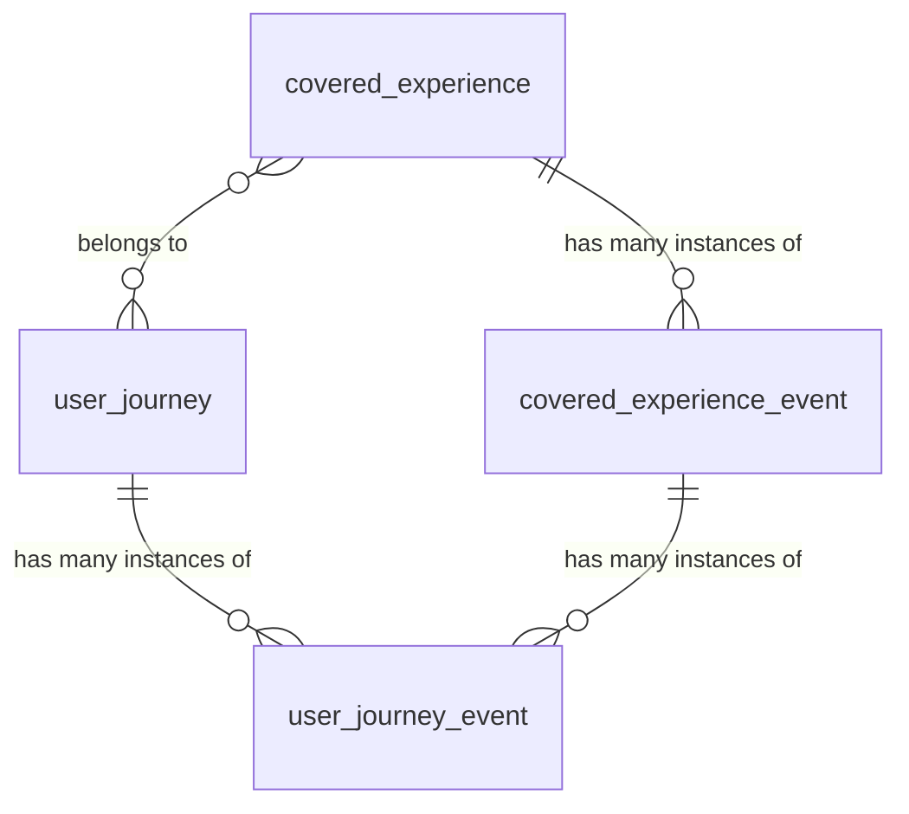
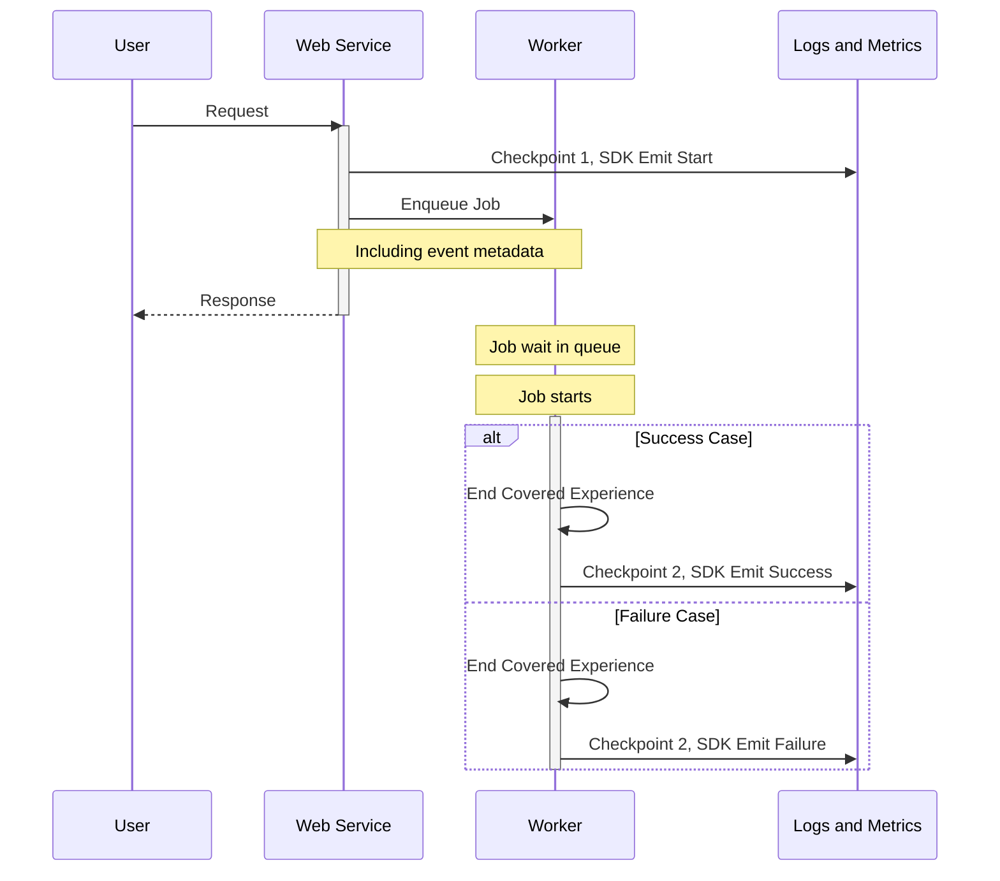

<!-- vale gitlab.FutureTense = NO -->

<!-- This renders the design document header on the detail page, so don't remove it-->


## Glossary

- **SLI**: [Service Level Indicator](https://en.wikipedia.org/wiki/Service_level_indicator) is a measure of the service level provided by a service provider to a customer.
- **Application SLI**: This is an SLI defined on the application side: the application decides what is “good” for apdex and error portion. The SLI is associated with a service for monitoring in the runbooks repository. https://docs.gitlab.com/ee/development/application_slis/
- **Apdex (Application Performance Index)**: At GitLab in the context of covered experience SLIs, it is the completion of something within an acceptable amount of time, for example, the changes of a push are visible on the merge request within 30 seconds.
- **User Journey**: A comprehensive visualization or map that illustrates all the checkpoints, interactions, and emotions a customer experiences when engaging with a product, service, or brand, from initial awareness through purchase and beyond. In GitLab, it is the journey a user takes through the application. This can include multiple experiences. For example: Create a project -> Create an issue -> Create a merge request.
- **Covered Experience**: An action that a user takes inside the application that is covered with an indicator. A Covered Experience outlines the precise services, scenarios, and user interactions that establish clear performance expectations between a service provider and their client, some of which are covered by an SLI. Examples of experiences: “create a project”, “create an issue”, “create a merge request”.
- **Covered Experience SLI**: An SLI implementation that represents an end-to-end flow of user interactions that may span multiple services.
- **Multi-action Experience**: A user journey that consists of multiple user interactions before completion, for example creating an issue consisting of 2 checkpoints: render new, submit form. We will not support this in the first iteration of Covered Experience SLIs.
- **Single-action Experience**: A user journey that consists of a single user interaction, for example “view an issue” or “add a comment to an issue”.
- **Multi-service Experience**: A journey that depends on multiple services to successfully complete, for example: a push gets received by GitLab-shell, which calls out to Rails, Gitaly and Sidekiq. A multi-service experience could be a single-action experience, only a single user-action is required for the experience, but it spans multiple services to be completed.
- **Criteria**: Each Experience can have one or more criteria that can be used to measure success. For example: “The issue is successfully created” AND “The issue is created fast enough”.
- **Covered Experience Definition**: The specification of the Covered Experience, distinguished by its `covered_experience_id`. Example: covered_experience_id="create_merge_request".
- **Covered Experience Event**: One instance of a Covered Experience. Distinguished by the properties `covered_experience_id` and `correlation_id`. Example:
covered_experience_id="create_merge_request" & correlation_id="01G65Z755AFWAKHE12NY0CQ9FH".
- **Covered Experience Checkpoint**: This is the moment in the experience that we emit one event: the start of a request, the start of a job, the end of a request, the end of a job, etc.
We'll have at least one of these within a Covered Experience Event, but there can be multiple.

## Motivation

While GitLab has robust service-level metrics through our SLI framework, we currently lack a systematic way to track and measure Covered Experiences that span multiple services. Our existing SLIs excel at measuring individual service performance but cannot effectively track the success/failure rate and performance of end-to-end user interactions. This gap makes it challenging to:

- Understand the true user experience across service boundaries
- Set and monitor user-centric SLOs for complex user interactions
- Identify bottlenecks in multi-service flows
- Measure reliability and impact of incidents for customers and users

## Goal

Track and measure Covered Experiences across GitLab services, establishing a framework for product teams to define and monitor Covered Experience SLIs.

### How do Covered Experiences relate to User Journeys?

Covered Experiences are small interactions that users do on the platform. Covered Experiences focus specifically on single-actions users do that can be tracked and monitored through SLIs. While User Journeys represent comprehensive end-to-end paths a user might within the application. A User Journey can consist of many Covered Experiences, and a single Covered Experience can be part of many User Journeys.

Key relationships between the two concepts:

- **Scope**: A User Journey might encompass multiple Covered Experiences. For example, the User Journey of "contributing code to a project" might include several Covered Experiences like "git push," "merge request creation," and "CI pipeline execution".
- **Measurability**: Covered Experiences are specifically designed to be measurable through our SLI framework, with clear success criteria and thresholds. They should not include ambiguity through decisions that a user makes throughout their Journey.
- **Implementation**: User Journeys are often conceptual and used for product planning. Covered Experiences have specific technical implementations with instrumentation, metrics, and alerting.

Product defines the User Journeys and works together with Engineering to specify which Covered Experiences are part of those journeys. Here's a graphical representation:

[graph src](https://lucid.app/lucidchart/e911c437-dbdf-4540-bf44-23962e048661/edit)

## Dos

- Create a framework for product teams to define important Covered Experience SLIs in a structured way
- Develop an SDK that makes it easy for engineers to instrument Covered Experiences
- Support both GitLab.com and Dedicated deployments
- Enable measurement of Covered Experience success/failure rates and durations through metrics and logs
- Inform on the performance of Covered Experiences through SLIs that allow alerting on specified thresholds through our existing alerting framework

## Don'ts

- Building a general-purpose distributed tracing solution
- Tracking client side timings, and time on the wire to clients. In the future, we want to add support for clients we build (IDE-extensions, our frontend), but we're keeping this out of scope in the first iteration.
- Real-time Covered Experience visualization or debugging tools
- Logs and metrics will be emitted from self-managed, but it won't officially support ingesting information from those instances as we don't have control over such environments

## Unscoped

1. Other projects could benefit from Covered Experience SLIs, but are not part of the scope of this proposal. Such as:
    - Ensure critical user paths are well-tested and monitored (i.e. https://gitlab.com/groups/gitlab-org/quality/-/epics/144).
    The Covered Experience SLIs could provide data that can help identify end-to-end test coverage gaps for critical user paths.
    - Use Covered Experiences to inform Service Level Agreements (https://gitlab.com/gitlab-com/gl-infra/mstaff/-/issues/423)
2. Implementing a Covered Experience Tracker. There's a [proposal](next_step.md) for implementing a new service, as the likely
next step (covered in [epic #1540](https://gitlab.com/groups/gitlab-com/gl-infra/-/epics/1540)), however, it is prone to change
as we progress on the implementation of Covered Experiences SDK, and discover its nuances and leverage points.

## Scope

The implementation consists of the following components:

1. [Covered Experience Definition Framework](#covered-experience-definition)
2. [LabKit SDK](#sdk-requirements)

The project work items are scoped in the [epic #1539](https://gitlab.com/groups/gitlab-com/gl-infra/-/epics/1539).

The [Covered Experience Definition](#covered-experience-definition) will provide an specification for each Covered Experience SLI,
and the [SDK](#sdk-requirements) will be used to instrument the services to emit events (metrics and logs).

Example:

### Covered Experience Definition

- YAML-based Covered Experience definition authored by product teams
- Support for specifying success criteria

The Covered Experience definition will contain the following fields:

| Field                 | Type   | Required | Description                                                                                                   | Example                        |
|-----------------------|--------|----------|---------------------------------------------------------------------------------------------------------------|--------------------------------|
| covered_experience_id | string | Yes      | Covered Experience identifier                                                                                 | "merge_request_creation"       |
| description           | string | Yes      | Human readable description                                                                                    | "User creates a merge request" |
| feature_category      | string | Yes      | [GitLab feature category](https://docs.gitlab.com/development/feature_categorization/#feature-categorization) | "source_code_management"       |
| urgency               | string | Yes      | How quickly a process needs to complete based on user expectations                                            | "sync_fast"                    |

Non-exhaustive list of urgencies to be supported:

| Threshold    | Description                                                                                                                                                      | Examples                                                                       | Value |
|--------------|------------------------------------------------------------------------------------------------------------------------------------------------------------------|--------------------------------------------------------------------------------|-------|
| `sync_fast`  | A user is awaiting a synchronous response which needs to be returned before they can continue with their action                                                  | A full-page render                                                             | 2s    |
| `sync_slow`  | A user is awaiting a synchronous response which needs to be returned before they can continue with their action, but which the user may accept a slower response | Displaying a full-text search response while displaying an amusement animation | 5s    |
| `async_fast` | An async process which may block a user from continuing with their user journey                                                                                  | MR diff update after git push                                                  | 15s   |
| `async_slow` | An async process which will not block a user and will not be immediately noticed as being slow                                                                   | Notification following an assignment                                           | 5m    |

As product teams implement more Covered Experiences, the list of urgencies will grow to accomodate different scenarios.

Examples:

| covered_experience_id  | description                         | feature_category       | urgency     |
|------------------------|-------------------------------------|------------------------|-------------|
| merge_request_creation | User creates a merge request        | source_code_management | "sync_fast" |
| git_push               | User pushes commits to a repository | source_code_management | "async_fast" |

Given that Application SLIs are implemented in the [Rails monolith](https://gitlab.com/gitlab-org/gitlab) at the moment, it will also function as a
[registry](https://gitlab.com/gitlab-com/gl-infra/observability/team/-/issues/4099) initially to store the definitions for the Covered Experience SLIs.

### SDK Requirements

- Implementation in [LabKit](https://gitlab.com/gitlab-org/ruby/gems/labkit-ruby)
- DSL for sending Covered Experience events and checkpoints

The SDK will emit 1 event in every checkpoint (each interaction along the entire flow):

**gitlab_covered_experience_checkpoint_total**

| LABEL                 | EXAMPLE VALUE                                                                                                                                                                | METRIC | LOG |
|-----------------------|------------------------------------------------------------------------------------------------------------------------------------------------------------------------------|--------|-----|
| covered_experience_id | security_scan                                                                                                                                                                | yes    | yes |
| correlation_id        | f93ae47de7f848343cf85511b47923ce                                                                                                                                             | no     | yes |
| feature_category      | vulnerability_management                                                                                                                                                     | yes    | yes |
| checkpoint            | start \| intermediate \| end                                                                                                                                                 | yes    | yes |
| checkpoint_category   | e.g. authorize (impose limited cardinality)                                                                                                                                  | no     | yes |
| type                  | web                                                                                                                                                                          | yes    | yes |
| meta                  | { "relevant attributes": "tailored for the specific event" }   i.e. https://docs.gitlab.com/development/logging/#logging-context-metadata-through-rails-or-grape-requests | no     | yes |

And 2 more events, emitted at the end of the flow, to signify error and success:

**gitlab_covered_experience_total**

| LABEL                 | EXAMPLE VALUE                                                                                                                                                                | METRIC | LOG |
|-----------------------|------------------------------------------------------------------------------------------------------------------------------------------------------------------------------|--------|-----|
| covered_experience_id | security_scan                                                                                                                                                                | yes    | yes |
| correlation_id        | f93ae47de7f848343cf85511b47923ce                                                                                                                                             | no     | yes |
| feature_category      | vulnerability_management                                                                                                                                                     | yes    | yes |
| error                 | true \| false                                                                                                                                                                | yes    | yes |
| type                  | sidekiq                                                                                                                                                                      | yes    | yes |
| meta                  | { "relevant attributes": "tailored for the specific event" }   i.e. https://docs.gitlab.com/development/logging/#logging-context-metadata-through-rails-or-grape-requests | no     | yes |

**gitlab_covered_experience_apdex_total**

| LABEL                 | EXAMPLE VALUE                                                                                                                                                                            | METRIC | LOG |
|-----------------------|------------------------------------------------------------------------------------------------------------------------------------------------------------------------------------------|--------|-----|
| covered_experience_id | security_scan                                                                                                                                                                            | yes    | yes |
| correlation_id        | f93ae47de7f848343cf85511b47923ce                                                                                                                                                         | no     | yes |
| feature_category      | vulnerability_management                                                                                                                                                                 | yes    | yes |
| success               | true \| false                                                                                                                                                                            | yes    | yes |
| type                  | sidekiq                                                                                                                                                                                  | yes    | yes |
| meta                  | { "relevant attribute to the event": "tailored for the specific event" }   i.e. https://docs.gitlab.com/development/logging/#logging-context-metadata-through-rails-or-grape-requests | no     | yes |

## Alternative Solutions

1. Do Nothing
   Pros:
   - No implementation cost

   Cons:
   - Continue lacking end-to-end covered experience visibility and measurement
   - Harder to set meaningful SLOs
   - Miss opportunities for better capturing perceived user experience and testing coverage
