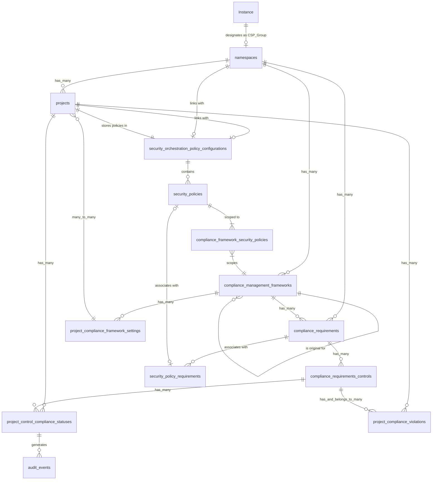



## Introduction

Compliance frameworks and security policies are currently managed at the group level, which creates challenges for organizations that need to apply consistent compliance and security requirements across multiple groups. This document outlines a proposed architecture to implement Instance Level Compliance and Policy Management functionality using a designated Compliance and Security Policy (CSP) Group approach, allowing organizations to centrally manage and consistently apply compliance frameworks and security policies across the entire instance.

Refer to [Instance Level Compliance and Policy Management](https://gitlab.com/groups/gitlab-org/-/epics/15864) epic for product requirements.

## Proposal

We propose designating a top-level group as the central authority for compliance frameworks and security policies at the instance level. This CSP Group will contain the master version of frameworks and policies, which will then be mirrored to other groups throughout the instance. Top-level group owners can apply these frameworks to their projects but cannot modify them, ensuring consistent application of compliance and security requirements.

## Goals

- Allow the application of compliance frameworks and security policies across multiple top-level groups from a central location.
- Enable compliance and security professionals to enforce common requirements across an organization's projects.
- Improve separation of duties for compliance and security management, such as granting only Admin users the ability to designate a CSP group and the users who may manage those policies.
- Simplify the user experience of centralized compliance and policy management by removing the requirement to manage security policy project (SPP) links across groups to a centralized SPP.
- Reduce the need for complex scripting to maintain consistent compliance frameworks across groups.
- Allow for top-level groups to manage policies within their own group while also enabling enforcement of centralized policies across all top-level groups.
- Create a design that can easily evolve when Organization-level scoping becomes available.

## Non-Goals

- Replacing existing group-level compliance framework or security policy functionality.
- Building Organization-level management in this phase (though we aim to design for future compatibility).
- Creating new compliance framework types or security policy types.
- Changing the underlying policy evaluation engine.

## Terminology/Glossary

- **CSP Group**: Compliance and Security Policy Group - a designated top-level group with elevated permissions for centrally managing compliance and security policies.
- **Mirrored Framework**: A read-only copy of a compliance framework from the CSP Group that appears in other groups.
- **Framework-scoped Policy**: A security policy that targets specific compliance frameworks.
- **Original Framework**: The source version of a compliance framework in the CSP Group.
- **Instance Level**: Functionality that applies across the entire GitLab instance.

## Design Overview

### Core Approach

1. Instance administrator designates a top-level group as the CSP Group.
2. CSP Group admins create compliance frameworks and security policies.
3. Compliance frameworks are automatically mirrored to all other top-level groups in the instance.
4. Security policies are scoped to compliance frameworks.
5. Projects in any group can use the mirrored frameworks.
6. When a project with a mirrored framework runs a pipeline, it enforces associated policies from the CSP Group.

### Entity Relationship Diagram



## Data Model

### Tables

**application_settings**

```sql
ALTER TABLE application_settings
ADD COLUMN csp_namespace_id BIGINT REFERENCES namespaces(id);
```

### Modified Tables

**compliance_management_frameworks**

```sql
ALTER TABLE compliance_management_frameworks
ADD COLUMN is_csp_framework BOOLEAN NOT NULL DEFAULT FALSE,
ADD COLUMN is_mirror BOOLEAN NOT NULL DEFAULT FALSE,
ADD COLUMN original_framework_id BIGINT REFERENCES compliance_management_frameworks(id),
ADD INDEX(original_framework_id);
```

**compliance_framework_security_policies**

```sql
ALTER TABLE compliance_framework_security_policies
ADD COLUMN is_from_csp_group BOOLEAN NOT NULL DEFAULT FALSE;
```

## Core Workflows

### CSP Group Designation

1. Instance administrator navigates to `Admin Area > Settings > Security and compliance`.
2. Administrator selects a top-level group to designate as the CSP Group.
3. System creates an entry in the `application_settings` table.
4. UI updates to show special indicators for the CSP Group.
5. Generate an instance audit event tracking creation, modification, and deletion of CSP Group Designations.

### Compliance Framework Creation and Mirroring

1. CSP Group admin creates a compliance framework in the CSP Group.
2. System marks the framework as `is_csp_framework = true`.
3. System automatically creates mirrored copies in all other top-level groups.
4. When new top-level groups are created, system creates mirrors for all CSP frameworks.

### Security Policy Management

1. CSP Group admin creates security policies in the policy project (`.gitlab/security-policies/policy.yml`)
2. Admin scopes policies to specific compliance frameworks
3. System creates entries in `compliance_framework_security_policies` with `is_from_csp_group = true`

The CSP Group approach supports all security policy types, including scan execution policies, merge request approval policies, and vulnerability management policies. Each policy type follows the same scoping mechanism but has different configuration parameters and enforcement behaviors. Below are examples of different policy types:

#### Scan execution policy example

```yaml
scan_execution_policy:
  name: Block vulnerable dependencies
  description: Vulnerability scanning for dependencies
  enabled: true
  rules:
  - type: pipeline
    branches:
    - release/*
  actions:
  - scan: sast
  policy_scope:
    csp_compliance_frameworks: # CSP compliance framework
      - id: 1
```

#### Merge request approval policy example

```yaml
merge_request_approval_policy:
  name: Security approval for production code changes
  description: Require security team approval for changes to production code
  enabled: true
  rules:
  - type: merge_request
    branches:
    - main
    - production/*
  approvals_required: 1
  user_approvers:
    - security-team
  policy_scope:
    csp_compliance_frameworks: # CSP compliance framework
      - id: 1
      - id: 3
```

#### Vulnerability management policy example

```yaml
vulnerability_management_policy:
  name: Critical vulnerability remediation policy
  description: Sets timelines for addressing critical vulnerabilities
  enabled: true
  rules:
  - type: vulnerability
    severity: critical
  actions:
  - issue_creation:
      due_date: 7 # days
      assignee: vulnerability_author
  policy_scope:
    csp_compliance_frameworks: # CSP compliance framework
      - id: 2
```

Each policy type follows its specific workflow for enforcement:

- Scan execution policies are enforced during CI/CD pipeline execution
- Merge request approval policies are enforced at merge request creation and update
- Vulnerability management policies are triggered when vulnerabilities are detected

### Project Compliance Framework Assignment

1. Group owner can assign mirrored frameworks to projects.
2. Group owner can set mirrored frameworks as default for new projects.
3. System creates entries in `project_compliance_framework_settings` referencing the mirrored framework.

### Policy Enforcement in CI/CD Pipeline

1. When a project pipeline runs, system checks for assigned compliance frameworks.
1. If framework is mirrored, system retrieves the original framework from CSP Group.
1. System retrieves all security policies scoped to the original framework.
1. Policies are enforced against the project's pipeline.

### CSP Group Change Management

#### Changing CSP Group Designation

1. Instance administrator navigates to `Admin Area > Settings > Security and compliance`.
1. Administrator selects a different top-level group to designate as the new CSP Group.
1. System displays a confirmation dialog with impact information.
1. Upon confirmation:
   1. System updates the entry in `application_settings` table.
   1. System marks all frameworks in the old CSP Group as `is_csp_framework = false`.
   1. System marks all frameworks in the new CSP Group as `is_csp_framework = true`.
   1. All mirrored frameworks linked to the old CSP Group are deleted across the instance.
   1. All mirrored frameworks linked to the old CSP Group are removed from projects.
   1. All security policies linked to the old CSP Group are unlinked.
   1. New frameworks from the new CSP Group are mirrored to all top-level groups.
   1. System generates an audit event tracking the CSP Group change.
1. UI indicators update to reflect the new CSP Group.

#### Removing CSP Group Designation

1. Instance administrator navigates to `Admin Area > Settings > Security and compliance`.
1. Administrator selects "Remove CSP Group designation".
1. System displays a confirmation dialog with impact information.
1. Upon confirmation:
   1. System removes the entry from `application_settings` table.
   1. System marks all frameworks in the CSP Group as `is_csp_framework = false`.
   1. All mirrored frameworks linked to the CSP Group are deleted across the instance.
   1. All mirrored frameworks linked to the CSP Group are removed from projects.
   1. System generates an audit event tracking the CSP Group removal.
1. UI indicators are removed to reflect the absence of a CSP Group.

### Compliance Framework Change Management

#### Modifying a Compliance Framework in CSP Group

1. CSP Group admin edits a compliance framework in the CSP Group.
1. System triggers `CSP::FrameworkUpdatePropagationService`.
1. Service finds all mirrored frameworks associated with the original.
1. Service updates all mirrored frameworks with the new information.
1. System generates audit events for each update.
1. UI updates to show the updated framework information across all groups.

#### Deleting a Compliance Framework in CSP Group

1. CSP Group admin deletes a compliance framework in the CSP Group.
1. System displays a confirmation dialog with impact information.
1. Upon confirmation:
   1. System marks the framework as deleted in the database.
   1. System triggers `CSP::SyncDeletedFrameworksJob`.
   1. Any projects that had the deleted framework assigned have that framework unassigned.
   1. Job deletes all mirrored frameworks associated with the original.
   1. System generates audit events for each deletion.

#### Tracking progress of propagation

When a compliance framework in the CSP Group is modified, it may take some time for the changes to fully propagate to all mirrored frameworks, especially in instances with many top-level groups. To enhance the user experience, we can track propagation progress by calculating the total number of frameworks to be mirrored in advance and updating the status as each one is completed.

### Security Policy Change Management

#### Modifying a Security Policy in CSP Group

1. CSP Group admin edits a security policy in the policy project.
1. System updates the policy yaml.
1. Changes take effect immediately for all projects using frameworks associated with that policy.
1. No action is needed on mirrored frameworks as policy enforcement looks up the original framework.
1. System generates an audit event tracking the policy change.

#### Removing a Security Policy in CSP Group

1. CSP Group admin removes a security policy from the policy project.
1. System updates the policy configuration.
1. Policy is immediately removed from enforcement across all projects.
1. System generates an audit event tracking the policy removal.

### Top-Level Group Management

#### Adding a New Top-Level Group

1. User creates a new top-level group.
1. System triggers `CSP::MirrorComplianceFrameworksJob` for the new group.
1. Job creates mirrors of all CSP Group frameworks in the new group.
1. Group owners can immediately assign these frameworks to projects.

#### Deleting a Top-Level Group

1. User deletes a top-level group.
1. System performs standard group deletion operations.
1. All mirrored frameworks in that group are deleted as part of group deletion.
1. No special handling is needed beyond standard group deletion.

## API Design

### GraphQL Extensions

```graphql
type Query {
  instanceCspGroup: Namespace
  complianceManagementFrameworks(
    namespaceId: ID!,
    isMirror: Boolean,
    isCspFramework: Boolean
  ): [ComplianceManagementFramework!]!
}

type Mutation {
  designateInstanceCspGroup(namespaceId: ID!): Namespace
  removeCspGroupDesignation: Boolean
  createCspComplianceFramework(input: FrameworkInput!): ComplianceManagementFramework
  updateCspComplianceFramework(id: ID!, input: FrameworkInput!): ComplianceManagementFramework
  deleteCspComplianceFramework(id: ID!): Boolean
  scopePolicyToFramework(policyId: ID!, frameworkId: ID!): ComplianceFrameworkSecurityPolicy
  assignFrameworkToProject(projectId: ID!, frameworkId: ID!): ProjectComplianceFrameworkSetting
  setDefaultGroupFramework(namespaceId: ID!, frameworkId: ID!): Namespace
}

type ComplianceManagementFramework {
  isCspFramework: Boolean!
  isMirror: Boolean!
  originalFramework: ComplianceManagementFramework
  mirroredFrameworks: [ComplianceManagementFramework!]!
  scopedPolicies: [SecurityPolicy!]!
}

extend type Namespace {
  cspFrameworks: [ComplianceManagementFramework!]!
  defaultFramework: ComplianceManagementFramework
  isCspGroup: Boolean!
}

extend type Project {
  assignedFrameworks: [ComplianceManagementFramework!]!
}
```

## Authorization Model

### Permission Structure

#### CSP Group-Related Permissions

- `manage_instance_csp_group`: Designate/undesignate CSP Group (instance admins only).
- `manage_csp_compliance_frameworks`: Create/edit frameworks in CSP Group (CSP Group admins).
- `manage_csp_security_policies`: Create/edit policies in CSP Group (CSP Group admins).
- `scope_csp_policies_to_frameworks`: Associate policies with frameworks (CSP Group admins).

#### Group-Related Permissions

- `assign_mirrored_frameworks`: Assign mirrored frameworks to projects (group owners/maintainers).
- `set_default_mirrored_frameworks`: Set default frameworks for group (group owners).

### Permission Matrix

| Role | Designate CSP | Manage CSP Frameworks | Manage CSP Policies | Assign Mirrored Frameworks | Set Default Frameworks |
|------|---------------|----------------------|---------------------|----------------------------|------------------------|
| Instance Admin | ✅ | ✅ | ✅ | ✅ | ✅ |
| CSP Group Admin | ❌ | ✅ | ✅ | ✅ | ✅ |
| CSP Group Maintainer | ❌ | ✅ | ✅ | ✅ | ✅ |
| Group Owner | ❌ | ❌ | ❌ | ✅ | ✅ |
| Group Maintainer | ❌ | ❌ | ❌ | ❌ | ❌ |
| Developer | ❌ | ❌ | ❌ | ❌ | ❌ |

## User Interfaces

### CSP Group Management UI

- Instance Settings > Compliance page with CSP Group designation.
- Visual indicator for CSP Group in groups list.
- Special header in CSP Group pages indicating its role.

### CSP Framework Management UI

- Enhanced compliance framework UI in CSP Group.
- Framework creation/editing forms.

### CSP Policy Management UI

- Policy editor in CSP
- Security Policy Project in CSP

### Group Policies UI (Secure > Policies)

- Group users may view policies applied to their group, including those enforced via CSP

### Project Policies UI (Secure > Policies)

- Project users may view policies applied to their project, including those enforced via CSP

### Group Framework UI

- List of available mirrored frameworks.
- Framework assignment UI for projects.
- Default framework settings for group.
- Visual indicators showing frameworks are mirrored (read-only).

### Project Compliance UI

- Assigned frameworks display.
- Framework assignment selector.
- Pipeline integration showing applied policies.

## Technical Implementation

### Models and Associations

These models define the structure of the compliance framework mirroring system.

#### ComplianceManagementFramework

- This model represents a compliance framework, which consists of a set of security policies, requirements, and rules that organizations must follow.
- Defines compliance frameworks that belong to a namespace (group).
- Includes mirrored framework functionality with `is_mirror` and `original_framework_id` fields.
- Establishes relationships with:
  - Mirrored frameworks (so that it knows which groups have copies)
  - Compliance framework security policies (for applying security policies)
  - Security policies (via `compliance_framework_security_policies`).
- Defines a scopes:
  - `csp_frameworks`: filters frameworks that are designated as CSP frameworks.
  - `mirrored`: filters frameworks that are mirrors of CSP frameworks.
  - `originals`: filters frameworks that are not mirrors.

### Services

#### CSP::FrameworkMirroringService

- Ensures that compliance frameworks created in the CSP group are propagated to other groups automatically.
- Initializes with a CSP group ID.
- Returns an error if no CSP group is set (to prevent execution without context).
- Retrieves all compliance frameworks in the CSP group.
- Identifies all top-level groups (excluding the CSP group).
- Creates a mirrored compliance framework in each top-level group for each CSP framework by:
  - Setting `is_mirror` = true
  - Setting `original_framework_id` to the ID of the source framework
  - Copying relevant attributes from the original

#### CSP::FrameworkUpdatePropagationService

- New service that propagates updates from original frameworks to their mirrors.
- When an original framework is updated, finds all mirrors and updates their attributes.
- Maintains consistency between originals and mirrors.

#### CSP::PolicyResolverService

- Provides a way to resolve and return policies that apply to a specific project.
- Retrieves policies for a given project and returns them as a structured response.

### Background Jobs

These are asynchronous workers that run in the background to handle framework mirroring and cleanup.

#### CSP::MirrorComplianceFrameworksJob

- Automates the initial framework mirroring process without requiring manual execution.
- Retrieves the CSP group ID from InstanceSettings.
- Runs CSP::FrameworkMirroringService to mirror compliance frameworks across top-level groups.

#### CSP::SyncDeletedFrameworksJob

- Prevents stale mirrored frameworks from existing when the original compliance framework is deleted.
- Finds frameworks where `is_mirror` = true and `original_framework_id` points to a non-existent framework.
- Deletes these orphaned mirrored frameworks.

### Controllers

Controllers expose API endpoints for managing the CSP group configuration.

#### API::V4::Instance::CspGroupController

- Provides an API to retrieve and update the CSP group that holds the source compliance frameworks.
- Authentication & Authorization
  - Requires user authentication.
  - Ensures only admins can update the CSP group.
- Show Action
  - Retrieves and returns the CSP group namespace ID.
- Update Action
  - Updates the CSP group namespace in InstanceSettings.
  - Triggers CSP::FrameworkMirroringService to immediately mirror compliance frameworks to other groups.
  - Returns a success response.

## Future Considerations

### Organization Entity Integration

The mirroring approach provides a clean path to organization-level implementation:

- Replace instance-level designation with organization entity.
- Convert mirroring system to work across organizations.
- Maintain the same permission model but at organization level.

### Extended Capabilities

- Exclusion requests for specific projects.
- Detailed compliance reporting.
- Framework version control and history.
- Enhanced policy templating.
- Automated compliance violation remediation.
- Compliance dashboard for instance-wide visibility.
