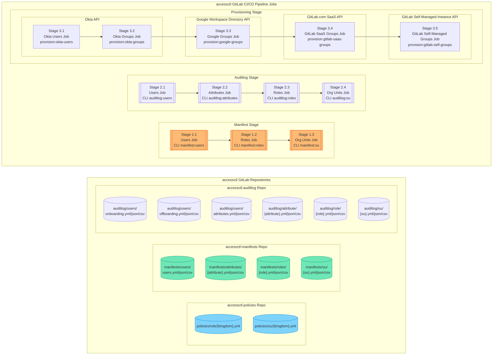
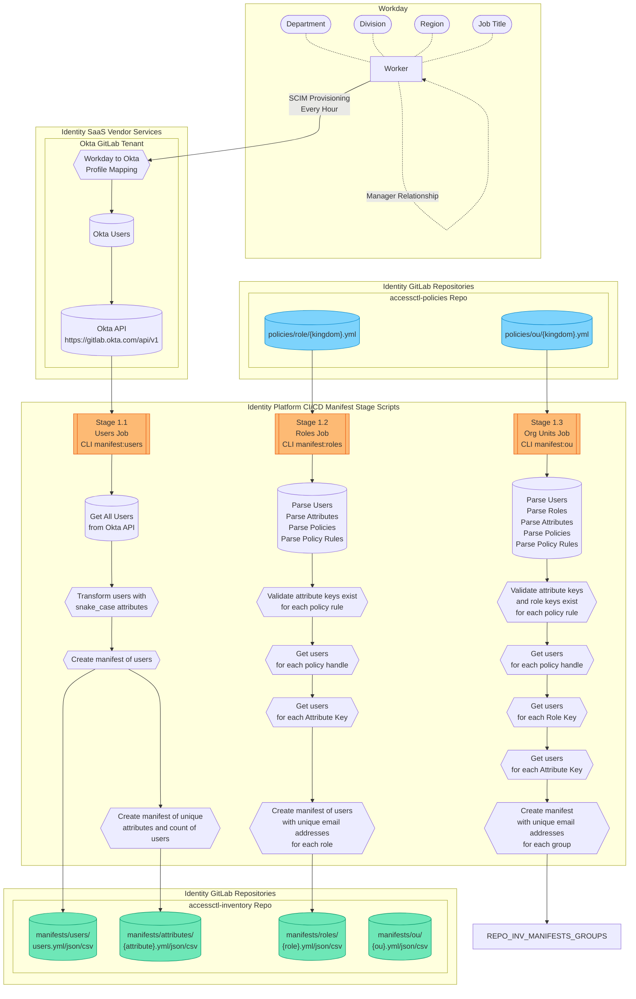

{}
You are viewing a preview of documentation for the future state of GitLab Identity v3 (mid 2024). See the <a href="/handbook/security/security-and-technology-policies/access-management-policy/">Access Management Policy</a> for the GitLab Identity v2 current state with baseline entitlements and access requests. See the roadmap in the <a href="https://gitlab.com/groups/gitlab-com/gl-security/identity/eng/-/roadmap?state=all&sort=start_date_asc&layout=QUARTERS&timeframe_range_type=THREE_YEARS&group_path=gitlab-com/gl-security/identity/eng&progress=WEIGHT&show_progress=true&show_milestones=false&milestones_type=ALL&show_labels=true">epics gantt chart</a>.
{}

## Pipeline Overview

## CI/CD Job Workflows

## Policy and Manifest Breaking Changes

### Attribute Key No Longer Exists

When a policy is parsed prior to creating a manifest, the `manifests/attributes/{attribute}.yml` file is parsed to verify that the attribute key exists. This file includes the latest list of unique values from users in the Okta API.

This will detect if a `department`, `division`, `title`, etc no longer exists (ex. has been renamed upstream).

If a policy uses an attribute key value that no longer exists, no updated manifest will be created so the current (previous) state will be retained. This freezes the current manifest until the policy is updated by Identity Operations and the policy `CODEOWNERS`.

See the [updating keys in policies](#updating-keys-in-policies) documentation to learn how this process has been partially automated.

### Manager No Longer Exists

Similar to an [attribute key that no longer exists](#attribute-key-no-longer-exists), every `manager` value is verified against the latest manifest of users. This will ensure that the user has not been offboarded and email handle hasn't changed (ex. maiden name change).

If the manager user no longer exists based on the `manager` handle defined in the policy, no updated manifest will be created so the current (previous) state will be retained. This freezes the current manifest until the policy is updated by Identity Operations and the policy `CODEOWNERS`.

See the [updating keys in policies](#updating-keys-in-policies) documentation to learn how this process has been partially automated.

### Updating Keys in Policies

If a key in a policy cannot be found, a branch and merge request is automatically created by `accessctl` and the `CODEOWNERS` and Identity Operations team members are assigned to make edits.

A comment is posted automatically to the merge request with the list of the previous manifest users and their latest updated values for the key of the value that does not exist anymore. This automates the research work to determine what the new values appear to be upstream that can be verified or adjusted by `CODEOWNERS`.

The policy manifest remains frozen until the changes are made. After the branch is merged, an updated manifest will be created on the next pipeline run which automatically heals the problem.
