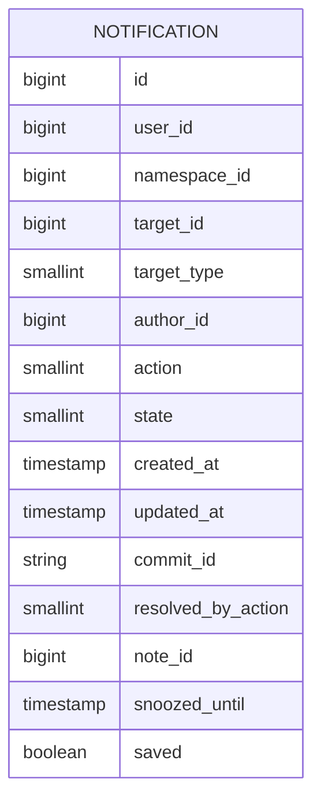
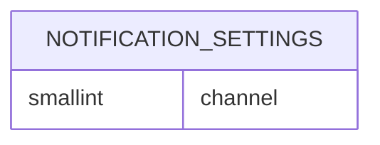
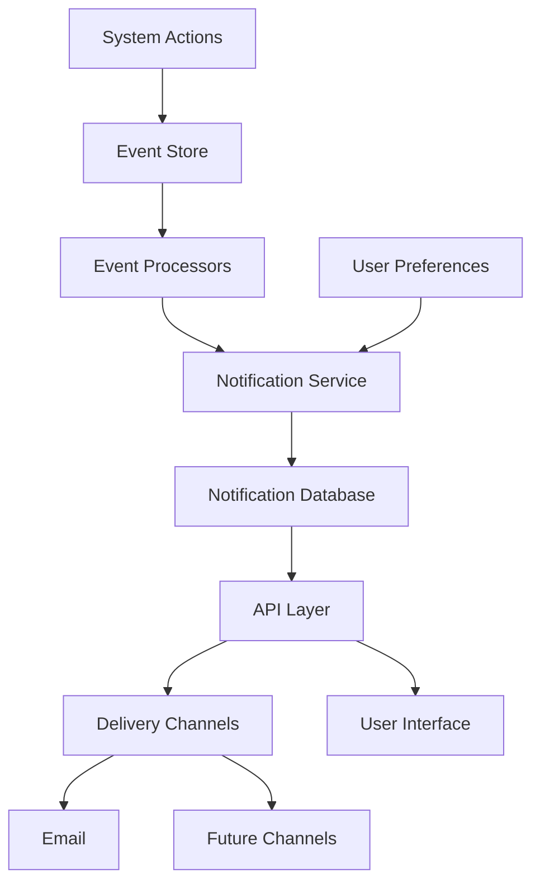

---
# This is the title of your design document. Keep it short, simple, and descriptive. A
# good title can help communicate what the design document is and should be considered
# as part of any review.
title: Notification system
status: accepted
creation-date: "2025-02-25"
authors: [ "@mksionek" ]
coaches: [ "@fabiopitino" ]
dris: [ "@jtucker_gl", "@samdbeckham" ]
owning-stage: "~group::personal productivity"
participating-stages: []
# Hides this page in the left sidebar. Recommended so we don't pollute it.
toc_hide: true
---

<!-- Design Documents often contain forward-looking statements -->
<!-- vale gitlab.FutureTense = NO -->

<!-- This renders the design document header on the detail page, so don't remove it-->


<!--
Don't add a h1 headline. It'll be added automatically from the title front matter attribute.

For long pages, consider creating a table of contents.
-->

## Summary

The current notification system is based on emails, requiring users to move constantly between their inbox and GitLab. At the same time, we have a system of to-dos that partially overlaps with notifications but generally establishes only a subset of those. To-dos are also not controlled by any user preferences.

To improve user experience and create parity between to-dos and email notifications, we propose creating a notification system within GitLab itself, which will replace our current, fixed system of to-dos. The system of notifications will be based on how we handle e-mail notifications now - users will be able to define rules for email notifications and notification visible in the notification center in GitLab. Visually, notification center will be similar to our current to-dos page.

[Epic](https://gitlab.com/groups/gitlab-org/-/epics/13794) that defines needs for the new system.

## Motivation

Our goal is to create a system that allows users to receive information about activity in their groups and projects in GitLab itself, without the need to check their email inbox. These notifications should be personalizable, easy to filter, and simple to mark as done/read. We want to grow the usage of notifications (metrics to be determined).

Our internal motivation is to create a system that is easy to extend and loosely coupled with other parts of the codebase. We also want to create a system with clear retention policies, allowing for a maintainable database load. We also want to ensure that adding new notifications to the codebase is easy and feature teams can self-serve with it.

### Goals

- Create a comprehensive experience for users, who will have one place to see everything they need to know to work
- Improve MAU (Monthly Active Users) metric between current to-dos and new notification center
- Refactor code to achieve higher cohesion and a more extendable system

### Non-Goals

- Replace all functionality that users may get from their inbox (ie. search all mentions of all time). We instead want to focus on day to day interactions mostly using GitLab

## Proposal

### Summary

We propose unifying our currently fragmented notification systems (email notifications and to-dos) into a single, cohesive notification center using an event-driven architecture. This will improve user experience, simplify code maintenance, and enable future extensibility.

### Proposed Solution

Create a unified notification center built on an event-driven architecture that:

- Uses our existing Event Store as the backbone for all notifications
- Establishes a single database model for all notification types
- Implements sensible retention policies (3-6 months by default)
- Allows users to save important notifications indefinitely
- Provides consistent API access for both internal and external integrations

#### Pros and Cons

##### Pros

1. Improved user experience:
   - Single location for all notifications
   - Consistent interface and behavior
   - Greater control over notification preferences

2. Technical benefits:
   - Decoupled architecture allows independent service development
   - Centralized notification logic improves maintainability
   - Event-driven design enables easy addition of new notification types
   - Reduced code duplication and complexity

3. Future flexibility:
   - Straightforward path to add new notification channels (web, mobile push, etc.)
   - API-first approach enables third-party integrations
   - Retention policies prevent database bloat

##### Cons

1. Migration complexity:
   - Requires careful handling of existing notifications
   - User settings need thoughtful transition
   - Temporary increased system complexity during transition

2. System dependencies:
   - Increased reliance on Event Store reliability
   - Need to manage event processing performance
   - Potential for more complex failure scenarios
   - Bigger database load due to more notifications being saved

3. Resource requirements:
   - Significant engineering effort
   - Careful testing required to ensure seamless transition

## Design and implementation details

### Database table

We need to persist notifications in a new _notifications_ database table. This table will store data about notifications - what kind of notification it is, what resource it's connected with, the state of it, information if it is saved by the user, etc.

An example of the table schema could be the following, although actual schema is TBD:

Our requirements are that we will be accessing todos in the majority of situations by user_id, and possible filtering patterns are:

- by project
- by group (so all notifications coming from projects from particular group)
- by author
- by resource connected to the notification
- by action (for example: mentioned/assigned/etc)
- by state
- by snoozed status.

We also have some other requirements:

- Non-functional requirement: The new database tables must not use STI.
- Functional requirement: We need to be able to paginate.

### Notification settings

Currently notification settings allow users to define highly customizable rules for when to receive email notifications. To create parity between the current to-dos and email system, we should add the ability for users to establish if they want to receive email only, email and web-based notification, or just an web-based notification.

NOTE: Changes to the notification settings system apart from adding notification/email differentiation are out of scope for this project.

New columns in the `notification_settings`table:

This will allow to not change anything for current records (we will add the `channel` column with `email` value) and for web-based notifications - we will be adding separate row, allowing maximal flexibility.

### Events

The event system is the backbone of this proposal. GitLab event store implementation is described [here](https://docs.gitlab.com/development/event_store/). Every notification record and every notification email should be handled in the subscriber to the particular event.

The Event Store will serve as the single source of truth for all notification-triggering events. This approach provides several key advantages:

- Decoupling: System actions generate events without knowledge of how those events will be processed or which notifications they'll trigger.
- Consistency: Using a single event source ensures all notification types derive from the same consistent data.

#### Event Processing Pipeline

- Event Emission: When a relevant action occurs in the system (assignment, comment, due date change, etc.), an event is published to the Event Store.
- Event Processing: Event processors subscribe to specific event types and transform raw events into notification candidates.
- Notification Filtering: The notification service applies user preferences to determine if a notification should be created.
- Notification Storage: Valid notifications are stored in the unified notification database with appropriate metadata.
- Delivery Determination: Based on user preferences and notification type, the system determines which delivery channels to use (emails for now).

### REST API and GraphQL endpoints

Important part of the new implementation is providing REST API and GraphQL endpoints that would allow to interact with notification records, in individual and batch manner. Current implementation of REST API and GraphQL endpoints for to-dos can serve as example of what we are looking for.

## Alternative Solutions

1. Enhance current systems independently

Pros:

- Less initial development effort
- Lower migration risk
- Can be implemented incrementally

Cons:

- Maintains fragmented user experience
- Doesn't solve code maintenance issues
- Limited future extensibility
- Duplicated effort for common features

1. Introduce new notifications system with new settings, without use of the events

Pros:

- More flexibility on the settings side

Cons:

- Doesn't solve code maintenance issues
- Limited future extensibility

1. Introducing [Read Model](https://www.qlerify.com/event-storming-concepts/read-model) to Notifications table to not use STI pattern

Pros:

- Focus on retrieval patterns, optimizing for read speed

Cons:

- Requires extensive event system development to make sure every change is reflected in the notifications table

## Architectural Decision Record

Database proposal: [link](adr/001_database_schema.md)
