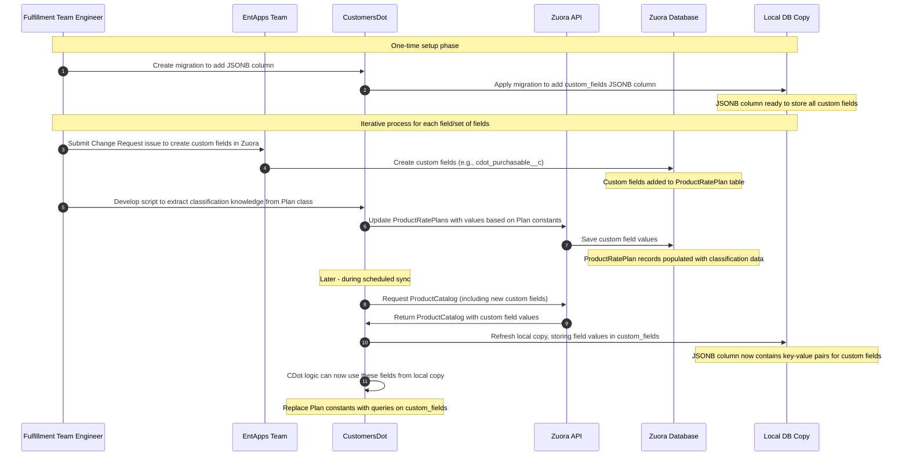
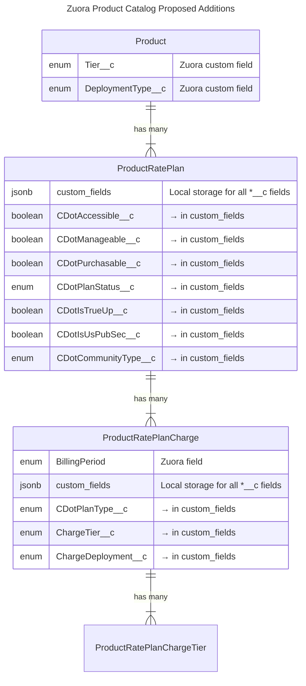



## Summary

The [GitLab Customers Portal](https://customers.gitlab.com/) is an independent application, distinct from the GitLab product, designed to empower GitLab customers in managing their accounts, subscriptions, and conducting tasks such as renewing and purchasing additional seats. More information about the Customers Portal can be found in [the GitLab docs](https://docs.gitlab.com/ee/subscriptions/customers_portal.html). Internally, the application is known as [CustomersDot](https://gitlab.com/gitlab-org/customers-gitlab-com) (also known as CDot).

GitLab uses [Zuora's platform](../../../../business-technology/enterprise-applications/guides/zuora/) as the SSoT for all product-related information. The [Zuora Product Catalog](https://knowledgecenter.zuora.com/Get_Started/Zuora_quick_start_tutorials/B_Billing/A_The_Zuora_Product_Catalog) represents the full list of revenue-making products and services that are salable, or have been sold by GitLab, which is core knowledge for CustomersDot decision making. CustomersDot currently has a local copy of the Zuora Product Catalog and refreshes it daily through a scheduled job. However, every time a new Product, Product Rate Plan, or Product Rate Plan Charge is updated or added to the Zuora Product Catalog, additional manual effort is required to make it available in CustomersDot.

CustomersDot uses `Plan` as a wrapper class for easy access to all the details about a Plan in the Product Catalog. Given that the name, price, minimum quantity, and other details of the Plan are spread across the `Zuora::ProductRatePlan`, `Zuora::ProductRatePlanCharge`, and `Zuora::ProductRatePlanChargeTier` objects, traditional access to these details can be cumbersome. This class is very useful because it saves us from having to query for all these details. Additionally, the class helps with the classification of `Zuora::ProductRatePlan`s based on their tier, deployment type, and other criteria used across the app.

The main goal of this design document is to improve the architecture and maintainability of the `Plan` model within CustomersDot. When the Product Catalog is updated in Zuora, it should automatically reflect in CustomersDot without requiring app restarts, code changes, or manual intervention.

## Motivation

Every time a new Product/SKU is added to the Zuora Product Catalog, despite having a daily refreshed local copy, it requires code changes in CustomersDot to make it available. This is due to the current strategy the `Plan` class uses for classification, which consists of assigning the `Zuora::ProductRatePlan` IDs to constants and then manually forming groups of IDs to represent different categories like all plans in the Ultimate tier or all the add-ons available for self-procurement for GitLab.com. These categories are then used for decision-making during execution.

As the codebase and number of products grow, this manual intervention becomes more expensive.

### Goals

Automate the Plan management in CustomersDot so it will require no manual intervention for basic Product Catalog updates in Zuora. For example, when a new Product/SKU is added, a RatePlanCharge is updated, or a Product is discontinued. To achieve this, we need to move away from statically defining product rate plan IDs within CustomersDot and transfer the classification knowledge to the Zuora Product Catalog (by adding CustomersDot metadata to it in the form of custom fields) to be able to resolve these sets dynamically.

### Decisions

1. [ADR-001 Use JSONB for Classification Metadata Storage](decisions/001_jsonb_for_classification_metadata.md)

## Proposal

Transfer CustomersDot's classification knowledge to the Zuora Product Catalog to resolve `ProductRatePlan`s by querying our Product Catalog local copy dynamically. This transfer can be handled in iteration following the flow represented below until all the plan constants that refer to `ProductRatePlan` IDs are replaced and removed.



### New Custom Fields



| Field Name | Level | New Field? | Data Type | Values | Description |
|------------|-------|------------|-----------|--------|-------------|
| **CDotAccessible__c** | `ProductRatePlan` | Yes | Boolean | `true`, `false` | Indicates whether a plan is accessible within CustomersDot. Plans marked `true` are displayed to users and their details can be viewed, regardless of purchase origin. Plans marked `false` exist in Zuora but are completely invisible in CustomersDot. |
| **CDotManageable__c** | `ProductRatePlan` | Yes | Boolean | `true`, `false` | Indicates whether management actions (renewals, modifications) are available for this plan in CustomersDot. These plans can be serviced through CustomersDot even if they weren't purchased there. |
| **CDotPurchasable__c** | `ProductRatePlan` | Yes | Boolean | `true`, `false` | Indicates whether a plan is available for self-service purchase directly through CustomersDot without sales assistance. Plans marked `true` appear in the web store and can be purchased online. |
| **CDotPlanStatus__c** | `ProductRatePlan` | Yes | String | `active`, `deprecated`, `legacy`, `not_applicable` | Represents the lifecycle stage of a plan: <br>• `active`: Currently salable and fully supported / available plans<br>• `deprecated`: Plans being phased out but still available to existing customers<br>• `legacy`: Historical plans maintained only for existing subscriptions<br>• `not_applicable`: Special cases where status concept doesn't apply |
| **CDotIsTrueUp__c** | `ProductRatePlan` | Yes | Boolean | `true`, `false` | Identifies true-up plans, which are special product rate plans used to reconcile usage beyond what was initially purchased. |
| **CDotIsUsPubSec__c** | `ProductRatePlan` | Yes | Boolean | `true`, `false` | Identifies plans specifically designed for US Public Sector customers. |
| **CDotCommunityType__c** | `ProductRatePlan` | Yes | String | `education`, `open_source`, `startup`, `not_applicable` | Identifies special pricing programs for specific communities:<br>• `education`: Educational institutions<br>• `open_source`: Open source projects<br>• `startup`: Startup companies<br>• `not_applicable`: Standard commercial plans |
| **CDotPlanType__c** | `ProductRatePlanCharge` | Yes | String | `ci_minutes`, `storage`, `duo_pro`, `duo_enterprise`, `duo_amazon_q`, `agile_planning`, `product_analytics`, `professional_services`, `ecosystem`, `base_product`, `not_applicable` | Categorizes charges by the services they provide:<br>• `ci_minutes`: Additional CI/CD pipeline minutes<br>• `storage`: Additional repository storage<br>• `duo_pro`: GitLab Duo Pro AI capabilities<br>• `duo_enterprise`: GitLab Duo Enterprise AI capabilities<br>• `duo_amazon_q`: Amazon Q integration<br>• `agile_planning`: Enterprise Agile Planning features<br>• `product_analytics`: Product analytics capabilities<br>• `professional_services`: Training, consulting, and implementation services<br>• `base_product`: Standalone charge e.g. Ultimate or Premium <br>• `ecosystem`: GitLab Ecosystem offering discount charge<br>• `not_applicable`: None of the mentioned |
| **BillingPeriod** | `ProductRatePlanCharge` | No | String | `monthly`, `annual`, `two_year`, `three_year`, `four_year`, `five_year` (or `1`, `12`, `24`, `36`, `48`, `60`) | Defines the duration of the billing cycle for the plan. Can use either named periods or the number of months. |
| **ChargeTier__c** | `ProductRatePlanCharge` | No | String | `ultimate`, `premium`, `bronze`, `silver`, `gold`, `starter`, `free`, `null` | Represents the feature tier of a plan, with different tiers offering progressively more features:<br>• `ultimate`: Most comprehensive feature set<br>• `premium`: Advanced features<br>• `bronze`/`silver`/`gold`: Legacy tier names<br>• `starter`: Entry-level paid tier<br>• `free`: No-cost tier with limited features |
| **ChargeDeployment__c** | `ProductRatePlanCharge` | No | String | `self_managed`, `dedicated`, `gitlab_dot_com`, `not_applicable` | Indicates how the GitLab instance is deployed and managed:<br>• `self_managed`: Customer installs and manages GitLab on their infrastructure<br>• `dedicated`: GitLab-managed single-tenant instance<br>• `gitlab_dot_com`: Multi-tenant SaaS offering at gitlab.com |

## Additional Considerations

- Field names match Zuora custom field naming conventions with the `__c` suffix
- New fields added specifically for CDot are prefixed with `CDot`

## Design and implementation details

Our classification is at the `ProductRatePlan`, `ProductRatePlanCharge` levels. As a first step we will add a column (JSONB) to our local copy of `ProductRatePlan` and `ProductRatePlanCharge` to persist this classification.

```ruby
# example migration
class AddCustomFieldsToProductRatePlans < ActiveRecord::Migration[7.1]
  def change
    add_column :zuora_product_rate_plans, :custom_fields, :jsonb, default: {}, null: false,
      comment: column_comment
    add_index :zuora_product_rate_plans, :custom_fields, using: :gin
  end

  private

  def column_comment
    {
      owner: 'section::fulfillment',
      data_classification: 'orange',
      description: 'Stores plan classification metadata as key-value pairs.'
    }.to_json
  end
end

class AddCustomFieldsToProductRatePlanCharges < ActiveRecord::Migration[7.1]
  def change
    add_column :zuora_product_rate_plan_charges, :custom_fields, :jsonb, default: {}, null: false,
      comment: column_comment
    add_index :zuora_product_rate_plan_charges, :custom_fields, using: :gin
  end

  private

  def column_comment
    {
      owner: 'section::fulfillment',
      data_classification: 'orange',
      description: 'Stores plan charge classification metadata as key-value pairs.'
    }.to_json
  end
end
```

### Iteration Plan

We will iterate over the proposed custom fields picking one field / set of fields at a time and:

1. Submit a Change Request to EntApps to add the necessary field(s) to Zuora.
2. Transfer the CustomersDot knowledge to the Zuora Product Catalog by populating the new field(s) via a rake task in CustomersDot.
3. Confirm that the Product Catalog copy has synced correctly (either manually trigger the sync or wait for the scheduled daily sync).
4. [Behind a feature flag] Replace any usage of `Plan` constants that represent a collection of records that meet a given classification with a call to a method that loads the same collection from the local copy of the Product Catalog leveraging the custom field.
5. Validate both logic and performance in the staging environment.
6. Deploy the change to production and enable it for all users.

The following code example illustrates steps 4 from the iteration process described above. It shows how we would replace hardcoded constants in the `Plan` class with dynamic methods that leverage the custom fields from our local Product Catalog copy. This example specifically demonstrates migrating from hardcoded constants for SaaS plans to dynamic queries based on the `cdot_purchasable__c` and `charge_deployment__c` fields.

```ruby
# app/models/zuora/local/product_rate_plan.rb
scope :cdot_purchasable, -> { where("custom_fields->>'cdot_purchasable__c' = 'true'") }
scope :gitlab_com, -> {
  joins(:product_rate_plan_charges)
    .where("product_rate_plan_charges.custom_fields->>'charge_deployment__c' = 'gitlab_dot_com'")
    .distinct
}

# lib/plan_classifier.rb
module PlanClassifier
  def self.all_gitlab_com_plans
    Zuora::Local::ProductRatePlan.gitlab_com.map(&:id)
  end

  def self.self_service_gitlab_com_plans
    Zuora::Local::ProductRatePlan.cdot_purchasable.gitlab_com.map(&:id)
  end
end

# In app/models/plan.rb
class Plan
  # before
  def self.self_service_gitlab_com_plans
    @@self_service_gitlab_com_plans ||= ALL_SELF_SERVICE_SAAS_PLANS
  end

  # after
  def self.self_service_gitlab_com_plans
    PlanClassifier.self_service_gitlab_com_plans
  end

  # before
  def self.all_gitlab_com_plans
    @@all_gitlab_com_plans ||= [
      BASIC_SAAS_1_YEAR_PLAN,
      PREMIUM_SAAS_PLANS,
      ULTIMATE_SAAS_PLANS,
      GITLAB_COM_BRONZE_PLANS,
      DEPRECATED_SILVER_SAAS_PLANS,
      DEPRECATED_GOLD_SAAS_PLANS,
      ALL_GITLAB_COM_EDU_OSS_PLANS,
      TRIAL_SAAS_PLANS
    ].flatten.compact
  end

  # after
  def self.all_gitlab_com_plans
    PlanClassifier.all_gitlab_com_plans
  end
```

As a first iteration we can replace the True up related logic as it doesn't have provision implications.

### Validation Strategy

1. **Data Integrity**: Compare classifications from both approaches using a rake task
2. **Performance**: Benchmark queries using both approaches
3. **Coverage**: Ensure all existing use cases are covered by metadata-based approach

### Rollback Plan

Each feature flag provides a built-in rollback mechanism. If issues are detected:

1. Disable the feature flag
2. Return to using the constant-based approach
3. Document issues for resolution
4. Re-enable once fixed

## Implementation Timeline

1. **Phase 1** (FY2026Q1):
   1. Implement JSONB column and basic classification fields
   2. Create Change Requests (EntApps) to add the custom fields to the ProductRatePlan in Zuora
   3. Update CustomersDot syncing mechanism so it can sync metadata dynamically
   4. Refactor codebase so the `Plan` constants are used within `Plan` class ONLY and external usages are through methods so we can replace each method's approach once the metadata is available.
   5. Establish baseline metrics for plan-related operations

2. **Phase 2** (FY2026Q2) In iteration, starting with high-priority constants:
   1. Transfer CustomersDot knowledge by using a rake task to populate the custom fields added in the previous iteration
   2. Validate that metadata queries return identical results to constant-based approach
   3. Replace constants with metadata queries
   4. Compare performance metrics after implementation
   5. Update documentation, record demos and conduct knowledge sharing sessions (specially after the first iteration so new additions can to `Plan` can follow it)
   6. Rollout

_Priority criteria: "high-priority" constants will be determined by usage frequency._

## Risk Mitigation

| Risk | Mitigation |
|------|------------|
| Incomplete custom field population in Zuora | Implement validation checks in the synchronization process |
| Performance impact of JSONB queries | Add monitoring and benchmarking; create indexes on common query patterns |
| Discrepancies between old and new classification | Create reconciliation reports to compare classifications |
| Edge cases not covered by metadata | Document process for handling special cases |
