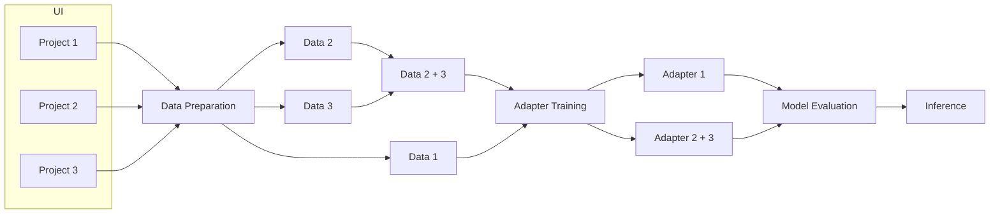
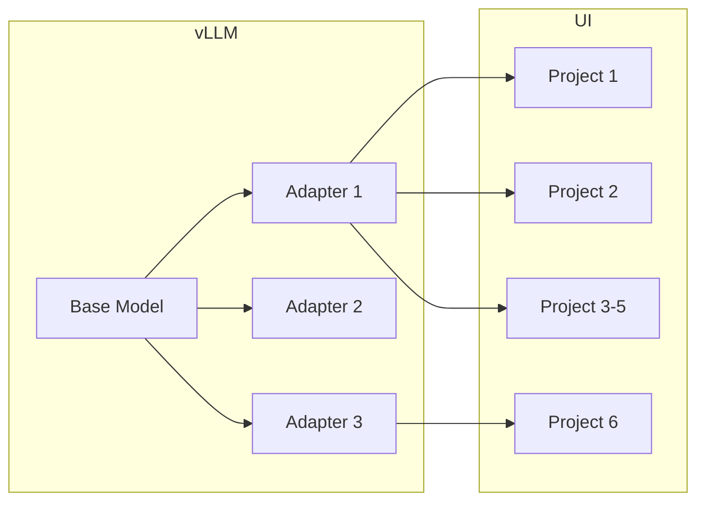
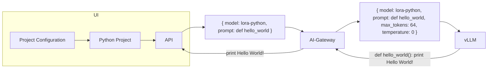
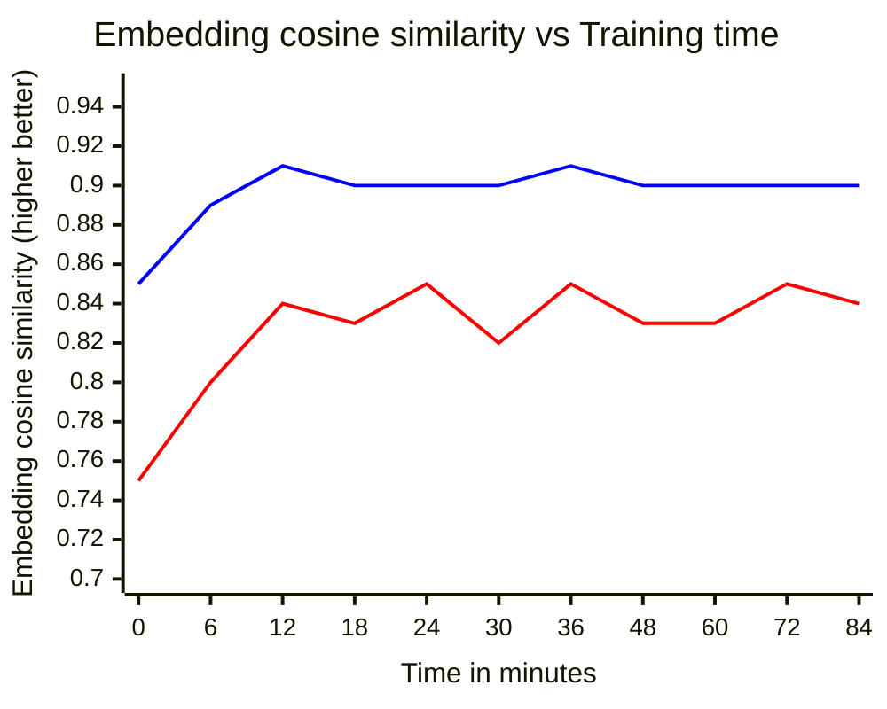
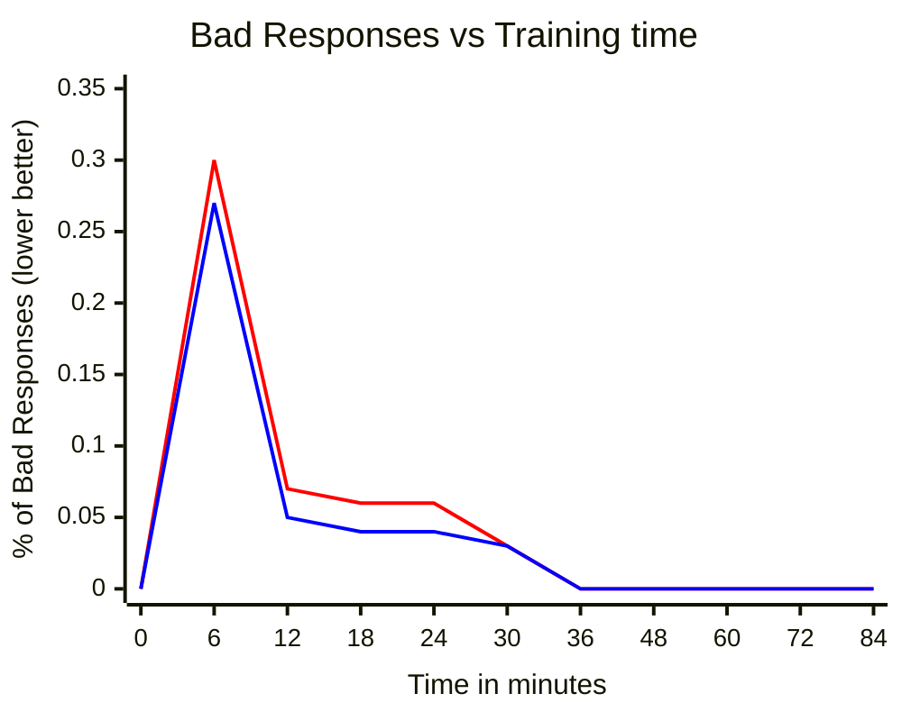

<!-- Design Documents often contain forward-looking statements -->

<!-- This renders the design document header on the detail page, so don't remove it-->



## Summary

This blueprint proposes a solution for fine-tuning Duo Self-hosted models using Parameter-Efficient Fine-Tuning (PEFT).

## Goal

Enable lightweight and efficient model fine-tuning for GitLab Duo Self-hosted customers.

## Non-goals

Any other forms of customizing the model:

- Full model fine-tuning
- RAG
- RLHF

## Motivation

With the development of Duo Self-hosted, the need for model customization has arisen. As the first example, customers were dissatisfied with the performance of the supported models on Code Suggestions for some niche coding languages. Another example was the desire for more personalized code suggestions, i.e. feature responses that are more accurate to their requirement and follow the coding patterns of their codebase. One of the possible approaches to customize the model is to fine-tune it for a specific task or user's codebase.

### Challenges of Model's Fine-tuning

While fine-tuning the entire model is a solution for model customization, it comes with several big challenges:

1) Training a model usually requires roughly 3-4x more vRAM than simply loading the model.
2) Storing _n_ custom fine-tuned models would have high disk usage.
3) Serving _n_ different fine-tuned models simultaneously might be slow and resource expensive.
4) Training a model requires extensive and specific knowledge, reinforcing the need to enable customers with an user-friendly UI.

This, together with the overall expectation that an average customer would be limited in its available hardware resources, motivates us to look into other more efficient approaches.

## PEFT and light-weight adapters

The solution selected to achieve lightweight and quick fine-tuning is using PEFT techniques; specifically the use of adapters.

### What is an adapter?

Adapter-based methods add extra trainable parameters to the existing (base) model's layers. The base model weights stay frozen, while the new additional weights are trained on a new dataset. In the case of Code Suggestions, the dataset could be the customer's codebase or any other suitable data. One of the most widely used adapter-based methods is Low-Rank Adaptation (LoRA). In a nutshell, LoRA uses small rank matrices that are combined with the original model's weights. These small new weights are stored separately and are a magnitude smaller in size than the weights of a base model. During the inference, the new weights are combined with the base model weights, allowing us to simultaneously host one base model and multiple different task-specific LoRAs.

Additional Resources:

- [LoRA: Low-Rank Adaptation of Large Language Models](https://arxiv.org/abs/2106.09685)
- [A Survey on LoRA of Large Language Models](https://arxiv.org/abs/2407.11046)

### Advantages and Limitations

As with any method, the LoRA method comes with its advantages and limitations. _Generally_, LoRA slightly loses against a fully fine-tuned model in the overall performance; if time and hardware are the restrictions, however, then a small performance degradation may be acceptable.

**Advantages:**

1) Training an adapter requires less memory and is much more time-efficient than full-model fine-tuning
2) The adapter's size would be in 100s of megabytes rather than 100s of gigabytes, simplifying storage and enabling easier use of multiple adapters, though the base model is still needed.
3) Hosting and switching between different adapters is usually a low-latency procedure

**Limitations:**

1) LoRAs tend to "forget things" a bit more than the fully fine-tuned model. Thus, we can expect LoRA to perform better than the base model on the task for which it was trained, but it could perform worse than a base model on the tasks for which it was not trained.
2) LoRAs are model-specific, meaning LoRAs can only properly work on the model it was trained on.
3) LoRA is likely to lose in the overall performance and generalization to a fully tuned model.

## Design and Implementation details

### Training

#### Launching Fine-tuning in the UI

As a first step for adapter training, the user would select a project or a collection of projects to use for fine-tuning in the UI. Once selected, the user will configure and launch the fine-tuning pipeline.
The configuration page will allow the user to:

- Confirm the projects and select the file types for which the adapter will be trained
- Configure where the data will be stored and provide necessary keys (if stored remotely)
- Configure where the adapters weights will be stored
- Change the hyperparameters via sliders or fields (defaults will be provided by GitLab)

The fine-tuning pipeline would then deploy an instance of the fine-tuning service on their configured infrastructure and trigger the following steps:

- Data Preparation
- Adapter Training
- Evaluation

The fine-tuning service would be provided as a Docker image.

The container will be published in the GitLab.com Container Registry and DockerHub regularly.

#### Data Preparation

Once the fine-tuning pipeline is triggered and service has been deployed, it would start with preparing the data.

The Data Preparation step of the pipeline would process the data provided by the selected repositories, constructing both a training and a validation dataset out of it and storing them on the hard disk based on the provided configuration. The data could be stored either locally or on third-party storage solution (i.e. AWS S3), as long as it is supported and accessible by the fine-tuning service. To speed up training, data will be encoded and stored in vector format.

At the initial version of the service we will support local storage and AWS S3.

#### Adapter Training

Once the data is ready, the next step in the pipeline is to train an adapter for the given data and provided configuration. The fine-tuning service would fetch the data and use that data as the basis for training. The user would be provided with the feedback on the training, such as evalution and training performance and the remaining time.

The fine-tuned service will be written using well-known HuggingFace libraries and PyTorch and the weights will be stored in the widely accepted and used HuggingFace format.

#### Fine-tuned Model Evaluation

Once the adapter is trained, the next step in the pipeline would evaluate it in terms of the overall performance and responses.

The evaluation step would use a small random sample from validation dataset to test the fine-tuned model and present the results to the customer.

Under the hood, the evaluation step will deploy a newly fine-tuned model using HuggingFace libraries and run the model on the prompts from the validation datasets. The model's outputs will then be evaluated against the ground truth responses using [Cosine Embedding Distance](https://python.langchain.com/v0.1/docs/guides/productionization/evaluation/string/embedding_distance/).

### Inference

#### Fine-tuned Model Deployment

Once the task-specific adapters are trained, customers would need to host their base model and trained LoRAs using vLLM.

vLLM supports hosting and inference of base model and LoRAs out-of-the-box. To deploy the base model with its adapters, the user would need to provide the paths to the stored adapter's weights.

To trigger the inference with a specific adapter, the customer could specify the adapter's name in the API request to vLLM. The vLLM will do all the heavy lifting behind the scene, by loading and merging the adapter weights into the base model.

#### Fine-tuned Model and UI during the Inference

Each adapter could be used with either a single project or a collection of projects. It is also true that one project could use several adapters at the same time. The UI will provide a way for the user to select which adapter to use for which project. The UI will also inform the user which adapters were trained for which project. By default, each project would be assigned a base model.

If the project is new (i.e. there isn't much code to fine-tune on), the user could still pick an adapter from already existing ones. By default such project will also be assigned a base model.

During the feature request the configured model will be used for the inference by the backend.

## Technical Details and Early results

### Technical Details

**Storage per Adapter**: 200Mb - 1GB. The size of 1 LoRA adapter could vary based on the configuration.

**Training Time per Adapter**: 30 minutes to 1 hour (Tested on 4xA100 80GB GCP server). Time varies based on the size of the training dataset. In the chart below, we present the results for the embedding cosine similarity vs training time. Here "0" minutes represents the base model without any fine-tuning. Red line is the results for `code_suggestions_aig_signatures` and blue line for `code-suggestions-input-testcases-v1` datasets, respectively.

While we see the relative performance increase after only 6 minutes, the model is still unstable and requires further training time to reduce the number of empty responses.

As a conclusion, it seems to be optimal to train the model for 30-40 minutes.

**Hardware Specs for Training an Adapter**: This depends on the selected base model. For Codestral-22B, the minimum spec is 4xA10, while recommended spec is 4xA100 80GB GPUs. In total the current set up uses **242GB** of vRAM.

### Early Experimentation (PoC) results

A PoC has been developed for Code Suggestions (code generation and completion) feature. The adapter was trained for [ai-gateway](https://gitlab.com/gitlab-org/modelops/applied-ml/code-suggestions/ai-assist) for Codestral-22B. The fine-tuned model has shown positive results on both manual and automated evaluations.

For **manual** evaluations, the model has been deployed and tested with GitLab Duo Self-Hosted in the WebIDE. The fine-tuned model proposed code suggestions that are more aligned with the overall code structure than the base Codestral-22B model:

[Results for manual evaluations in WebIDE](https://gitlab.com/gitlab-org/gitlab/-/issues/505598#note_2284037077)
and [code completion results](https://gitlab.com/gitlab-org/gitlab/-/issues/505598#note_2285961471)

In addition to the manual evaluations, the fine-tuned model was evaluated on several datasets where it also showed positive results (i.e. code suggestions were more aligned with existing code).

[Results for Code Completion using ELI5](https://gitlab.com/gitlab-org/gitlab/-/issues/508867#note_2290318225)

In the table below, we present the results of evaluating the fine-tuned model and base model on three different datasets for a code completion task.

In the columns, the two numbers are: embedding similarity, exact match. Higher number is better (meaning results were more similar to the expected output).

| Model | code-suggestions-input-testcases-v1 | code_suggestions_aig_random_fim | code_suggestions_aig_signatures |
| ------ | ------ | ------ | ------ |
| Codestral-22B | 0.89, 0.03 | 0.84, 0.0 | 0.80, 0.0 |
| LoRA+Codestral-22B | **0.91**, **0.17** | **0.87**, 0.0 | **0.85**, **0.05** |

Other models to be assessed: [Mistral Small 3](https://gitlab.com/gitlab-org/gitlab/-/issues/520221).

## Alternatives

Adapters, and in particular, LoRAs are not a panacea; it is one of the methods that we could utilize if it is found suitable for our use cases. Other potential approaches are:

1) Full fine-tuning of a smaller model
2) Human-feedback (RLHF)

**Smaller experts.**
Fine-tuning a smaller model might be a suitable approach, as the time and hardware resources to train such a model are better than a model with a high number of parameters. However, the scalability of such an approach is questionable, as well as the overall performance of a smaller model.

Pros:

- Small LLMs would be relatively quick to fine-tune.
- Fully fine-tuned model generalizes better than LoRA.

Cons:

- Less scalable than LoRA. Hosting several models at the same time is resource expensive.
- Generally less capable than big LLMs.
- Potentially more resource expensive than LoRA.

**Reinforcement Learning from Human Feedback (RLHF).**
Human feedback could be used together with reinforcement learning (RLHF) to further fine-tune the model to the user's needs. For example, whether a suggestion was accepted or rejected can serve as valuable domain-specific feedback data to then further customize the model's fine-tuning process.

Pros:

- Utilizes human feedback, fine-tuning the model to the real user needs.
- Continuous learning.

Cons:

- Usually requires a lot of data. The approach would be more suitable for .com rather than Self-hosted.

**Why Adapters?**
As discussed before, the main challenge of fine-tuning on the customer's infrastructure is to make the process quick and resource efficient. Adapters allow us to fine-tune the model quickly and relatively cheap. In addition, adapters are scalable and lightweight allowing us to potentially host hundreds of them on the single GPU-capable instance. Adapters are widely used in the industry, where quick and lightweight fine-tuning is required for example [Apple Intelligence](https://developer.apple.com/videos/play/wwdc2024/102/?time=185)) and [Github Copilot](https://github.blog/news-insights/product-news/fine-tuned-models-are-now-in-limited-public-beta-for-github-copilot-enterprise/).
