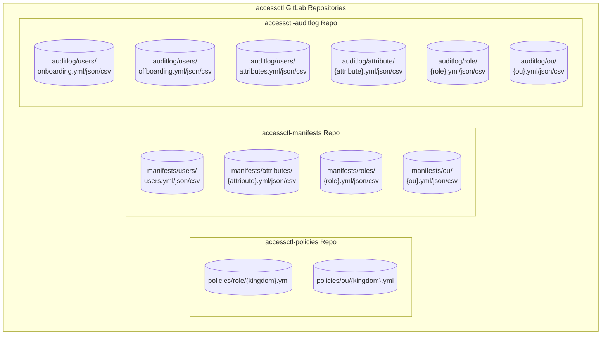
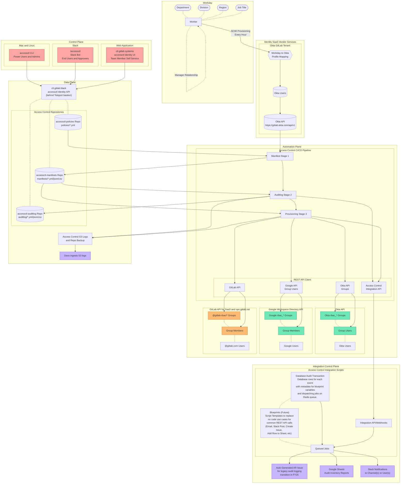

{}
You are viewing a preview of documentation for the future state of GitLab Identity v3 (mid 2024). See the <a href="/handbook/security/security-and-technology-policies/access-management-policy/">Access Management Policy</a> for the GitLab Identity v2 current state with baseline entitlements and access requests. See the roadmap in the <a href="https://gitlab.com/groups/gitlab-com/gl-security/identity/eng/-/roadmap?state=all&sort=start_date_asc&layout=QUARTERS&timeframe_range_type=THREE_YEARS&group_path=gitlab-com/gl-security/identity/eng&progress=WEIGHT&show_progress=true&show_milestones=false&milestones_type=ALL&show_labels=true">epics gantt chart</a>.
{}

## Identity Platform Architecture

- CI/CD Pipeline
  - [Manifests Stage](/handbook/security/identity/platform/manifests)
  - [Auditlog Stage](/handbook/security/identity/platform/auditlog)
  - Provisioning Stage
    - [Okta Provisioning](/handbook/security/identity/platform/provisioning/okta)
    - [Google Groups Provisioning](/handbook/security/identity/platform/provisioning/google)
    - [GitLab Groups Provisioning](/handbook/security/identity/platform/provisioning/gitlab)
    - [GitLab Projects Provisioning](/handbook/security/identity/platform/provisioning/gitlab)
- [Access Requests](/handbook/security/identity/access-requests)
- [Approvals](/handbook/security/identity/approvals)
- [Access Check (accesschk) Audit](/handbook/security/identity/platform/accesschk)
- [Terraform GitOps Configuration-as-Code](/handbook/security/identity/gitops)
  - [AWS Configuration](/handbook/security/identity/gitops/aws)
  - [GCP Configuration](/handbook/security/identity/gitops/gcp)
  - [Okta Configuration](/handbook/security/identity/gitops/okta)

## User Guides

- [Admin Guide](/handbook/security/identity/guide/admin)
- [Application Configuration Guide](/handbook/security/identity/guide/app)
- [Audit and Compliance Guide](/handbook/security/identity/guide/audit)
- [Change Management Guide](/handbook/security/identity/guide/change-mgmt)
- [Developer Guide](/handbook/security/identity/guide/developer)
- [Incident Response Guide](/handbook/security/identity/guide/incident)
- [Manager Guide](/handbook/security/identity/guide/manager)
- [Offboarding Ops Guide](/handbook/security/identity/guide/offboarding)
- [Onboarding Ops Guide](/handbook/security/identity/guide/onboarding)
- [Policy Management Guide](/handbook/security/identity/guide/policy)
- [Team Member End User Guide](/handbook/security/identity/guide/user)

## Why It Exists

We use Terraform with a GitOps CI/CD pipeline for managing the configuration and resources in each platform/vendor (ex. Okta Settings and Okta Applications), and specifying which groups are assigned to each application/resource/permission in each respective platform (ex. Okta application groups, GCP project roles, etc). We believe that configuration and state management auditlogs are much easier to audit without all of the user membership changes, so we use Access Control to keep those changes separate and provide improved automation user experience for those use cases.

In other words, it's not realistic to have every user perform self-service Terraform changes for access requests.

The Identity Engineering team has created a standardized group and user management architecture that is used for role-based access control. Each of the standardized roles are used in combination with Groups in various systems to uniformally assign access to a known list of users that are managed with centralized policies and change management processes.

The Identity Platform is designed to use the API for each of the vendors and provide the integration plumbing between them using policy files and manifests that are stored in a centrally managed GitLab repository. Since we maintain a centralized database (via Git), we can provide a unified policy management, streamlined user experience, and provide 90%+ automation for onboarding, access requests, career mobility, and offboarding.

While many vendors have partial capabilities and some overlap, the ease-of-use and integrations vary drastically and we have had a lot of inefficiency problems in Identity v2. Since Group management is at the heart of the problem, the Identity Platform is primarily focused on group user management automation that is used downstream in vendor configurations that we automate using Terraform where possible.

### Open Source

Although the risks that we need to solve are confidential, we believe in open sourcing the best practice documentation and tools to solve those risks after we have mitigated the risk to give back to the community and inspire other companies.

**We are stronger and more secure together.**

Our Identity Platform open source projects can be explored at [https://gitlab.com/gitlab-identity](https://gitlab.com/gitlab-identity). Our team members also maintain side project packages that are useful dependencies and development helpers at [https://gitlab.com/provisionesta](https://gitlab.com/provisionesta).

## Terminology

### Identity Types

> Okta User Attribute: `rbac_type`

We have different categories of users (ex. employees, contractors, service accounts, system administrators) that need birthright access to various systems. We use our [access level wristbands](https://internal.gitlab.com/handbook/it/it-self-service/access-level-wristband-colors/) color coding to specify each Okta user's type as `blue`, `purple`, `gray`, `brown`, or `black`.

### Identity Roles

> Okta User Attribute: `rbac_role`

An **Identity Role** is a standardized snake case format for the functional team that the user is on or job title, as it relates to access control and permissions.

This is a next generation iteration of a GitLab Identity v2 [job family](/job-families/) and [role-based baseline entitlements](https://internal.gitlab.com/handbook/it/end-user-services/access-request/baseline-entitlements/).

Each role uses a syntax of `{department_slug}_{functional_team_slug}_{specific_role_if_applicable}`. For example, if your department is `Infrastructure`, the RBAC slug is `infra`.

The job title of `Site Reliability Engineer` is too vague for IAM/RBAC purposes since we have multiple functional teams of Site Reliability Engineers that should have different levels of access.

We have defined RBAC slugs for each functional team in Infrastructure that include the `infra_` prefix:

- `infra_analytics`
- `infra_people_leader`
- `infra_platforms_leader`
- `infra_scalability_leader`
- `infra_eng_leader`
- `infra_ded_general`
- `infra_ded_env_automation`
- `infra_ded_switchboard`
- `infra_ded_us_pubsec`
- `infra_ded_ext`
- `infra_deployment`
- `infra_foundations`
- `infra_observability`
- `infra_ops`
- `infra_orchestration`
- `infra_practices`

Each of these functional teams usually has 1-10(ish) team members that report to one or two managers. Some functional teams may be larger (ex. product manager, sales roles, etc).

From a policy perspective, we associate a user with a role based on their `manager` in most cases, or a specific job `title` or a named user `handle` if needed.

There is no need for a specific role for most of these teams (no IAM difference between the Site Reliability Engineer title and Engineering Manager title). For teams that have approval permission requirements, we will suffix `_engineer`, `_manager`, `_leader`, etc as appropriate. We may also suffix the region for certain roles (ex. `sales_ent_amer_east_northeast`). For roles that aren't necessarily on a specific team, `_general` (Staff/Principal Engineers across multiple functions), `_ext` (contractors with least privilege access), and others at the Identity Team's naming convention discretion.

The team manager and department leadership is responsible for naming their functional teams. The Identity team is responsible for parsing the handbook pages or provided organization chart documentation for each team and creating the short hand standardized abbreviation nomenclature.

As our organization structure ebbs and flows, we have 200-250 unique Identity Roles at any given time.  See all of the roles in the [policies](https://gitlab.com/gitlab-com/gl-security/identity/data-poc/policies) and [manifests](https://gitlab.com/gitlab-com/gl-security/identity/data-poc/manifests) repositories.

| Division/Function | Identity Roles | Upstream Data Source |
|-------------------|----------------|----------------------|
| Administrators | [Policies](https://gitlab.com/gitlab-com/gl-security/identity/data-poc/policies/-/blob/main/role/policies/black_ops.yml?ref_type=heads) | Identity Engineering |
| Executive | [Policies](https://gitlab.com/gitlab-com/gl-security/identity/data-poc/policies/-/blob/main/role/policies/business_executive.yml?ref_type=heads) | Identity Engineering |
| Finance | [Policies](https://gitlab.com/gitlab-com/gl-security/identity/data-poc/policies/-/blob/main/role/policies/business_finance.yml?ref_type=heads) | Managers and Job Titles |
| Legal | [Policies](https://gitlab.com/gitlab-com/gl-security/identity/data-poc/policies/-/blob/main/role/policies/business_legal.yml?ref_type=heads) | Identity Engineering |
| Marketing | [Policies](https://gitlab.com/gitlab-com/gl-security/identity/data-poc/policies/-/blob/main/role/policies/business_marketing.yml?ref_type=heads) | Department Names |
| People | [Policies](https://gitlab.com/gitlab-com/gl-security/identity/data-poc/policies/-/blob/main/role/policies/business_people.yml?ref_type=heads) | [Handbook Page](/handbook/people-group/#how-to-reach-the-right-member-of-the-people-group) and Manager |
| Sales | [Policies](https://gitlab.com/gitlab-com/gl-security/identity/data-poc/policies/-/blob/main/role/policies/business_sales.yml?ref_type=heads) | Sales EBA Team and Department/Manager |
| Product Development | [Policies](https://gitlab.com/gitlab-com/gl-security/identity/data-poc/policies/-/blob/main/role/policies/product_dev.yml?ref_type=heads) | [DevOps Stages](/handbook/product/categories/#devops-stages) / [YAML](https://gitlab.com/gitlab-com/www-gitlab-com/-/blob/master/data/stages.yml?ref_type=heads) |
| Product Production | [Policies](https://gitlab.com/gitlab-com/gl-security/identity/data-poc/policies/-/blob/main/role/policies/product_prd.yml?ref_type=heads) | [Handbook Page](/handbook/engineering/infrastructure/#organization-structure) |
| Security | [Policies](https://gitlab.com/gitlab-com/gl-security/identity/data-poc/policies/-/blob/main/role/policies/security.yml?ref_type=heads) | [Handbook Page](/handbook/security/#division-structure) |
| Service Accounts | [Policies](https://gitlab.com/gitlab-com/gl-security/identity/data-poc/policies/-/blob/main/role/policies/service_accounts.yml?ref_type=heads) | Identity Engineering |

### Identity Organization Units

The goal of creating Identity Roles is to implement role-based access control (RBAC) for application and group assignment, however it can be tedious and inefficient to add every single role to each application.

For less granular permissions or nonsensitive access, we can grant access to an organization unit instead of a long list of roles.

An **Identity Organization Unit (OU)** is a grouping of *two or more* **Identity Roles** for higher-level groups that are useful for granting access to entire divisions, departments, sub-departments, teams, regional groups or other functional groups. The Identity team is responsible for organization unit conventions with collaborative input from the Director/VP/EBA team members for each respective division.

A user can only belong to one role, however they can belong to multiple organization units.

See all of the organization units in the [policies](https://gitlab.com/gitlab-com/gl-security/identity/data-poc/policies) and [manifests](https://gitlab.com/gitlab-com/gl-security/identity/data-poc/manifests) repositories.

### Identity Groups

We use **Identity Types**, **Identity Roles** and **Identity Organization Units** across multiple systems for role-based access control (RBAC) by creating an Okta Group, Google Group, and GitLab SaaS Group with the same name. Each of these groups can be attached to one or more Okta Applications, Google Cloud projects or folders, or GitLab Groups or Projects. Additional systems may be added in the future.

Since the user list for each role is centrally managed and users are automatically synced, this removes a lot of manual provisioning inefficiency.

Our automation automatically creates each group and keeps the user list synced every hour with audit logs and automation workflows for any detected attribute and policy manifest changes. See more about [manifests](/handbook/security/identity/platform/manifests), [auditlog](/handbook/security/identity/platform/auditlog), and [provisioning](/handbook/security/identity/platform/provisioning).

The generated Okta Groups and Google Groups can be assigned to applications, accessed in scheduled generation of JSON/YAML/CSV, accessed via API calls to the Identity Platform, audited by Compliance team members, viewed in generated Google Sheets, and can be trusted as a single source of truth that is updated hourly or daily.

#### Okta and Google Groups

Each **Type** group is prefixed with `rbac_type_{color}`.

Each **Organization Unit** group is prefixed with `rbac_ou_{ou_name}`

Each **Role** group is prefixed with `rbac_role_{color}_{role_name}`.

We do not create a role group for `brown` accounts since each service account has least privilege permissions based on the use case. The grouping of all service accounts uses the `rbac_type_brown` group.

#### GitLab SaaS Groups

The GitLab SaaS group for the type, role, or organization unit can be invited as a Direct Member on any other GitLab group (with child projects) or a GitLab project with the appropriate [permission role](https://docs.gitlab.com/ee/user/permissions.html).

- `@gitlab-rbac/type/{color}`
- `@gitlab-rbac/ou/{ou_name}`
- `@gitlab-rbac/role/{role_name}`

This allows us to grant minimum permissions at the top level of the `gitlab-com` and `gitlab-org` namespaces, and programatically add elevated `Developer`, `Maintainer`, and `Owner` [permissions](https://docs.gitlab.com/ee/user/permissions.html) in downstream groups and projects for specific teams to self manage their own child namespaces without having full read-write access across all projects inherited by the top-level namespace.

In the (distant) future, we will manage GitLab groups and project configuration settings using Terraform.

### Identity Policies

Each Identity Role and Identity Organization Unit is defined in a YAML file with a list of conditional rules that defines which user attributes need to match for a user to be added to the manifest.

For granular roles, you can specify one or more job titles. If a job title exists in multiple departments, you can specify job titles in a specific department or that report to a specific manager. For less granular roles, you can use a user's manager since one manager usually owns a specific named function. For larger functional teams, multiple managers can be mapped to a single role.

See all of the policies  in the [policies](https://gitlab.com/gitlab-com/gl-security/identity/data-poc/policies) repository.

#### Identity Policy Rulesets

Our rules logic is simple, yet reasonably powerful. You can define one or more attributes to check for, and if any of the attribute conditions match, the user is added to that group.

For programmatic consistency with YAML, all attribute values are converted to lower_snake_case for calculation purposes. This removes all punctuation, replaces spaces with underscores, and solves for slight naming inconsistencies.

```plain
Infrastructure => infrastructure
Site Reliability Engineer => site_reliability_engineer
Director, Infrastructure => director_infrastructure
```

##### Available Attributes

You can use any of the Okta user profile attributes that were imported during the Manifest Users stage.

```yaml
# {accessctl_key}: '{oktaApiKey}'
email_to_handle:
  handle: 'email'
  manager: 'managerEmail'
snake_case:
  cost_center: 'costCenter'
  division: 'division'
  department: 'department'
  management_level: 'workday_managementLevel'
  organization_name: 'organization'
  region: 'workday_region'
  role: 'rbac_role'
  title: 'title'
``````

##### Single Attribute Rule

This covers the basic use case of matching the value of a single attribute. If any condition matches, the user will be added to the manifest.

```yaml
# Any user with these job titles
accounting_payable_analyst:
  - title: accounts_payable_analyst
  - title: senior_accounts_payable_analyst

# Any user with these job titles
product_manager:
  - title: product_manager
  - title: senior_product_manager
  - title: principal_product_manager
  - title: group_manager_product

# Any user that reports to this manager, including the manager too
eng_productivity:
  - manager: dmurphy
  - handle: dmurphy
```

##### Multiple Attribute Rule

Since the goal of Identity Groups is to provide granularity, you can define multiple attributes to check (programmatically unlimited, but realistically less than 5). All attribute values must match. To perform an "either/or" rule, you would define an additional rule for each "or".

```yaml
# Any user in this specific department with this job title
dev_eng_leader:
  - {department: development, title: distinguished_engineer}
  - {department: development, title: senior_distinguished_engineer}
  - {department: development, title: engineering_fellow}
  - {department: development, title: principal_engineer}
  - {department: development, title: principal_fullstack_engineer}

# Any user in this department, that is at a specific management level (to accommodate title variations)
dev_people_leader:
  - {department: development, management_level: vice_president}
  - {department: development, management_level: director}
```

##### Organization Unit Rules

Each Identity Role policy allows you to use the Okta user profile attribute keys. Organization Unit policies allow you to specify roles as well.

Although it is a best practice to exclusively use roles, we have the flexibility to use attributes or named user handles if needed.

```yaml
infra_saas_prod_log_viewers:
  - department: infrastructure
  - handle: dmurphy
  - handle: klibby
  - role: sec_logging
  - role: sec_sirt
  - role: eng_core_database
  - role: eng_core_dbre
```

```yaml
infra_saas_extended:
  - {department: infrastructure, management_level: leader}
  - {department: infrastructure, management_level: vice_president}
  - {division: engineering, management_level: leader}
  - {division: engineering, management_level: vice_president}
  - handle: dmurphy
  - handle: klibby
  - role: infra_saas_leaders
  - role: infra_saas_scalability_leaders
  - role: infra_saas_dedicated_general
  - role: infra_saas_dedicated_env_automation
  - role: infra_saas_dedicated_switchboard
  - role: infra_saas_dedicated_us_pubsec
  - role: infra_saas_deployment
  - role: infra_saas_foundations
  - role: infra_saas_observability
  - role: infra_saas_ops
  - role: infra_saas_orchestration
  - role: infra_saas_practices
```

### Manifest Generation

When the Identity Platform CI/CD job runs, it will calculate a fresh list of users that match the rules.

Each rule is evaluated independently, and all user email handles that match that attribute criteria are included in the returned array.

After all rules have been evaluated, the result arrays from each rule are aggregated and any duplicates are removed if a user matched two or more rules.

```plain
Generate a JSON manifest of users based on a policy.yml definition file

Manifest Does Not Exist Yet rbac/roles/{role_name}/manifest.json

[member] abarton@example.com Added user to manifest
[member] acummerata@example.com Added user to manifest
[member] akonopelski@example.com Added user to manifest
[member] alegros@example.com Added user to manifest
[member] arunte@example.com Added user to manifest
... truncated

[member] Added Total 119 users

File Created rbac/roles/{role_name}/manifest.json
```

#### Diff and Drift Management

We have diff detection for the previous and latest manifest for logging and alerting.

```plain
Generate a JSON manifest of users based on a policy.yml definition file

[member] acummerata@example.com Removed user from manifest
[member] akonopelski@example.com Removed user from manifest

[member] Removed Total 2 users

File Updated rbac/roles/{role_name}/manifest.json
```

#### Log Schema

<details>

```json
{
  "message": "User added to manifest",
  "job_batch_id": "{uuid}",
  "timestamp": "YYYY-MM-DDTHH:II:SS.000000Z",
  "event": "accessctl.manifest.create.user.added",
  "policy_type": "role",
  "policy_name": "{role_name}",
  "manifest_email": "acummerata@example.com",
  "user_key": "acummerata",
  "status": "active",
  "status_updated_at_timestamp": "YYYY-MM-DDTHH:II:SS.000000Z",
  "department": "entr",
  "division": "sales",
  "title": "inside_sales_representative",
  "management_level": "individual_contributor",
  "manager": "vdooley",
  "region": "japac",
  "rbac_type": null,
  "rbac_role": "{role_name}"
},
{
  "message": "User removed from manifest",
  "job_batch_id": "{uuid}",
  "timestamp": "YYYY-MM-DDTHH:II:SS.000000Z",
  "event": "accessctl.manifest.create.user.removed",
  "policy_type": "role",
  "policy_name": "{role_name}",
  "manifest_email": "akonopelski@example.com",
  "user_key": null,
  "status": "deprovisioned",
  "status_updated_at_iso8601": "YYYY-MM-DDTHH:II:SS.000000Z"
}
```

</details>

### Group User Sync

Many vendors rules engines work well for adding a user to a group, but there are limitations with removing a user from the group. This problem is amplified with offboarded users since deactivated users aren't removed from the groups automatically (their authentication is blocked, however their authorization is still in-tact).

There is also limited to no functionality available with vendors to detecting changes and diff logging or triggering automation workflows.

With `accessctl`, we have advanced change/diff audit logging and workflow automation, and keep groups in sync for adding and removing users.

For any Google Groups, Okta Groups, or tech stack APIs that are managed by the Identity Platform, our CI/CD jobs query the API to get all current members for that group, compare it to our manifest, and perform add user or remove user API calls if needed.

#### Adding Users to Group

```php
// https://developer.okta.com/docs/reference/api/groups/#add-user-to-group
$okta_response = OktaApiClient::post(
    connection: config('connections.okta.prod'),
    uri: 'groups/ ' . $okta_group_id . '/members/' . $okta_user_id,
);

// https://developers.google.com/admin-sdk/directory/reference/rest/v1/members/insert
$google_response = GoogleApiClient::post(
    connection: config('connections.google.workspace'),
    url: 'https://admin.googleapis.com/admin/directory/v1/groups/' . $google_group_id . '/members',
    form_data: [
        'email' => $email,
        'role' => 'MEMBER',
        'type' => 'USER',
    ]
);

// https://docs.gitlab.com/ee/api/members.html#add-a-member-to-a-group-or-project
// https://docs.gitlab.com/ee/api/members.html#roles
$gitlab_response = GitlabApiClient::post(
    connection: config('connections.gitlab.saas'),
    uri: 'groups/' . $gitlab_group_id . '/members',
    request_data: [
        'user_id' => $gitlab_user_id,
        'access_level' => $gitlab_access_level,
        'expires_at' => null
    ]
);
```

#### Removing Users from Group

```php
// https://developer.okta.com/docs/reference/api/groups/#remove-user-from-group
$okta_response = OktaApiClient::delete(
    connection: config('connections.okta.prod'),
    uri: 'groups/ ' . $okta_group_id . '/members/' . $okta_user_id,
);

// https://developers.google.com/admin-sdk/directory/reference/rest/v1/members/delete
$google_response = GoogleApiClient::delete(
    connection: config('connections.google.workspace'),
    url: 'https://admin.googleapis.com/admin/directory/v1/groups/' . $google_group_id . '/members/' . $email
);

// https://docs.gitlab.com/ee/api/members.html#remove-a-member-from-a-group-or-project
$gitlab_response = GitlabApiClient::delete(
    connection: config('connections.gitlab.saas'),
    uri: 'groups/' . $gitlab_group_id . '/members/' . $gitlab_user_id
);
```

## CI/CD Pipeline Jobs

We consider Workday to be the source of truth for **new users** and **changes** to user profile attribute values, and we **fetch** those values from the Okta API Users endpoint. When a user's Okta status changes to `deprovisioned`, we consider them to be offboarded and remove them from all manifests.

The Identity Platform runs scheduled CI/CD pipeline jobs that use `accessctl` CLI jobs to recalculate the list of users (a.k.a. manifest) for every Identity Role and Identity Organization Unit based on the latest data.

When a user attribute value changes in Workday and pushes to Okta, the Identity Platform will detect the diff during the [manifests](/handbook/security/identity/platform/manifests) pipeline stage and create audit log entries and dispatch automation workflows in the [auditlog](/handbook/security/identity/platform/auditlog) pipeline stage. After a manifest has been created, the provisioning pipeline syncs all of the groups and group users across the `rbac_*` prefixed [Okta groups](/handbook/security/identity/platform/provisioning/okta), [Google Groups](/handbook/security/identity/platform/provisioning/google), `@gitlab-rbac/*` [GitLab groups](/handbook/security/identity/platform/provisioning/gitlab) that the Identity Platform manages.

When we reach maturity, the scheduled jobs will run every hour and all attribute values and groups will be automatically calculated and programatically maintained without any human user intervention or day-to-day provisioning tasks. While we are in PoC/alpha/beta, the jobs run daily and created in a merge request that is reviewed by the Identity Ops team for accuracy to catch any bugs or unintended changes.

```mermaid
graph LR

subgraph accessctl GitLab CI/CD Pipeline Jobs
direction LR
subgraph Manifest Stage
direction LR
CI_MANIFEST_USER_JOB[["Stage 1.1<br />Users Job<br/>CLI manifest:users"]]
CI_MANIFEST_ROLE_JOB[["Stage 1.2<br />Roles Job<br />CLI manifest:roles"]]
CI_MANIFEST_GROUP_JOB[["Stage 1.3<br />Org Units Job<br/>CLI manifest:ou"]]
end
subgraph Auditlog Stage
direction LR
CI_CHANGELOG_USER_JOB[["Stage 2.1<br />Users Job<br/>CLI auditlog:users"]]
CI_CHANGELOG_ATTRIBUTE_JOB[["Stage 2.2<br />Attributes Job<br/>CLI auditlog:attributes"]]
CI_CHANGELOG_ROLE_JOB[["Stage 2.3<br />Roles Job<br/>CLI auditlog:roles"]]
CI_CHANGELOG_GROUP_JOB[["Stage 2.4<br />Org Units Job<br/>CLI auditlog:ou"]]
end
subgraph Provisioning Stage
direction LR
subgraph Okta API
CI_PROVISIONING_OKTA_USER_JOB["Stage 3.1<br />Okta Users Job<br />provision:okta-users"]
CI_PROVISIONING_OKTA_GROUP_JOB["Stage 3.2<br />Okta Groups Job<br />provision:okta-groups"]
end
subgraph Google Workspace Directory API
CI_PROVISIONING_GOOGLE_GROUP_JOB["Stage 3.3<br />Google Groups Job<br />provision:google-groups"]
end
subgraph GitLab.com SaaS API
CI_PROVISIONING_GITLAB_SAAS_GROUP_JOB["Stage 3.4<br />GitLab SaaS Groups Job<br />provision:gitlab-saas-groups"]
end
subgraph GitLab Self-Managed Instance API
CI_PROVISIONING_GITLAB_SELF_GROUP_JOB["Stage 3.5<br />GitLab Self-Managed Groups Job<br />provision:gitlab-self-groups"]
end
end

CI_MANIFEST_USER_JOB --> CI_MANIFEST_ROLE_JOB --> CI_MANIFEST_GROUP_JOB
CI_CHANGELOG_USER_JOB --> CI_CHANGELOG_ATTRIBUTE_JOB --> CI_CHANGELOG_ROLE_JOB --> CI_CHANGELOG_GROUP_JOB
CI_PROVISIONING_OKTA_USER_JOB --> CI_PROVISIONING_OKTA_GROUP_JOB --> CI_PROVISIONING_GOOGLE_GROUP_JOB --> CI_PROVISIONING_GITLAB_SAAS_GROUP_JOB --> CI_PROVISIONING_GITLAB_SELF_GROUP_JOB

click CI_MANIFEST_USER_JOB "/handbook/security/identity/platform/manifests" "View Details"
click CI_MANIFEST_ROLE_JOB "/handbook/security/identity/platform/manifests" "View Details"
click CI_MANIFEST_GROUP_JOB "/handbook/security/identity/platform/manifests" "View Details"
click CI_CHANGELOG_USER_JOB "/handbook/security/identity/platform/auditlog" "View Details"
click CI_CHANGELOG_ATTRIBUTE_JOB "/handbook/security/identity/platform/auditlog" "View Details"
click CI_CHANGELOG_ROLE_JOB "/handbook/security/identity/platform/auditlog" "View Details"
click CI_CHANGELOG_GROUP_JOB "/handbook/security/identity/platform/auditlog" "View Details"
click CI_PROVISIONING_OKTA_USER_JOB "/handbook/security/identity/platform/provisioning/okta" "View Details"
click CI_PROVISIONING_OKTA_GROUP_JOB "/handbook/security/identity/platform/provisioning/okta" "View Details"
click CI_PROVISIONING_GOOGLE_GROUP_JOB "/handbook/security/identity/platform/provisioning/google" "View Details"
click CI_PROVISIONING_GITLAB_SAAS_GROUP_JOB "/handbook/security/identity/platform/provisioning/gitlab" "View Details"
click CI_PROVISIONING_GITLAB_SELF_GROUP_JOB "/handbook/security/identity/platform/provisioning/gitlab" "View Details"

classDef slate fill:#cbd5e1,stroke:#475569,stroke-width:1px;
classDef red fill:#fca5a5,stroke:#dc2626,stroke-width:1px;
classDef orange fill:#fdba74,stroke:#ea580c,stroke-width:1px;
classDef yellow fill:#fcd34d,stroke:#ca8a04,stroke-width:1px;
classDef emerald fill:#6ee7b7,stroke:#059669,stroke-width:1px;
classDef cyan fill:#67e8f9,stroke:#0891b2,stroke-width:1px;
classDef sky fill:#7dd3fc,stroke:#0284c7,stroke-width:1px;
classDef violet fill:#c4b5fd,stroke:#7c3aed,stroke-width:1px;
classDef fuchsia fill:#f0abfc,stroke:#c026d3,stroke-width:1px;
end
```



## Configuration and Data Repositories

The `tf_*` Terraform GitOps repository contains the Terraform that manages the configuration and resources in each platform/vendor (ex. Okta Settings and Okta Applications), and specifies which groups are assigned to each application/resource/permission in each respective platform (ex. Okta application groups, GCP project roles, etc). We believe that configuration and state management auditlogs are much easier to audit without all of the user membership changes, so we use Access Control to keep those changes separate and provide improved automation user experience for those use cases. In other words, it's not realistic to have every user perform self-service Terraform changes for access requests.

Access Control uses the Identity Data `policies` and `manifests` repositories that are focused on who belongs to a group.

The `policies` repository is for managing YAML policy files that are managed by humans using the CLI for generating properly formatted changes and has strict merge request approval rules for change management before changes are merged.

The `manifests` repository has the data that has been generated by the `accessctl` automation, with detected changes separately added in the `auditlog` repository for audit preservation.

See the mirrored [PoC data repositories](https://gitlab.com/gitlab-com/gl-security/identity/data-poc) for a sneak peak of the future of Identity v3.



### Data Security

- Although these could be part of the same repository, we provide separation so that the pipeline automation has read-only access to the policies repository to avoid any potential compromise.
- The SSOT repository is hosted on the Black OPs self-managed GitLab instance to protect the data integrity, and repository data is mirrored to GitLab.com SaaS for team member read-only visibility.
- The runtime pipelines, CI/CD variables, and secrets management are on the Black Ops GitLab instance that no team members have elevated permissions on other than break glass access by the Identity Engineering Team. We use the CLI for generating properly formatted changes via API calls to avoid users making freeform changes or clicking buttons.

## Data Flow



## Access Control (accessctl)

Access Control is an open source monolith [code base](https://gitlab.com/gitlab-identity/accessctl) created by Jeff Martin that is built with the [Laravel framework](https://laravel.com) with multiple functional components included that are deployed in a distributed fashion to dogfood GitLab CI/CD pipelines and GitLab Runner for background jobs, GitLab repository for policy and manifest storage, CODEOWNERS and merge request approvals for change management.

Although Laravel has [batteries included](https://laravel.com/docs/11.x) for all of the full stack web application and SQL database capabilities that rivals Django or Ruby on Rails, we are using it as more of a scripting engine that is easier for team members to contribute to and leverages GitLab for backend processing wherever possible. We still use Laravel native capabilities to expose a REST API, Web UI, and CLI for improved frontend user experience.

We use [Laravel Actions](https://www.laravelactions.com/) for our business logic service classes. By using Laravel Actions, we simplify our architecture since each single responsibility principle (SRP) action can be invoked as a class, a console CLI command, or a background job. This also allows us to get data from the GitLab API for repository data instead of needing to use models and migrations for a large SQL database.

See the [gitlab-identity/accessctl](https://gitlab.com/gitlab-identity/accessctl) repository and README to learn more.

### Why Laravel

It's a simple case of using the tools that we know and can deliver business value efficiently. Jeff Martin is the primary developer has been using it for 10+ years and has tried using Ruby on Rails, Golang, Python, and still finds that the Laravel ecosystem is richer.

You may have already seen what's possible with GitLab Sandbox Cloud, Demo Systems, and Training Lab Manager. It just works and only requires 1 engineer part time to take us to production. We've taught more than a dozen team members how Laravel works without any trouble. This isn't part of the GitLab product itself so that's a non factor. Please reach out to Jeff for a code pair if you're interested.

### CI/CD Scripts

We use a Docker image with the `accessctl` application with GitLab Runner to run Artisan Console commands that from Laravel actions. Each CI/CD job is usually related to ETL operations for (E)xtracting IAM/RBAC data from vendor APIs, (T)ransforming the API responses into standardized YAML and JSON array schemas, and (L)oading the data into the GitLab repositories (`accessctl-manifests`, `accessctl-auditlog` and `accessctl-policies` for system automation) and Google Sheets (for human use).

The CI/CD pipeline has several stages:

- [Manifests Stage](/handbook/security/identity/platform/manifests)
- [Auditlog Stage](/handbook/security/identity/platform/auditlog)
- [Provisioning Stage](/handbook/security/identity/provisioning)

### API

We have the `accessctl` application deployed at `https://ctl.gitlab.black` that provides a REST API for data stored in the GitLab repository that is proxied and formatted as if we used a traditional SQL database. This improves the consumability of our data, and provides an endpoint for CLI application.

This is deployed separately from the Web UI since we use network ACLs to only allow access for users connected to the VPN or service accounts that have pre-configured allowlist IP addresses.

### Web UI

We have the `accessctl` application deployed at `https://ctl.gitlab.systems` that provides Web UI with Okta authentication (with 2FA and Okta Verify device trust) for end user team members and managers to perform day-to-day tasks without administrative access.

For security and UI design internal tool efficiency reasons, only the CLI is used for admin actions.

### Slack Bot

We will be building a Slack bot that will be used for end user form wizard workflows and just-in-time/manager approvals to supplement the Web UI.

### CLI

The `accessctl` CLI is used by power users and admins for generating properly formatted MRs with policy changes with the accessctl API.

We only accept system generated changes. No human generated (manual edit) MRs are allowed.

## Access Check (accesschk)

Access Check is a series of scripts for performing audit evidence collection. It is part of the accessctl codebase but is run using an independent CI/CD pipeline.

You can think of this as an audit automation platform that also provides a single source of truth (SSOT) data source for the latest aggregated information available from each vendor's API and saving it as a CSV/JSON/YML file and Google Sheet that can be referenced by auditors, compliance teams, and other team members as needed.

See the [accesschk](/handbook/security/identity/platform/accesschk) handbook page to learn more.

## Additional Reading

See the [Identity Platform Architecture](#identity-platform-architecture) and [User Guide](#user-guides) links at the top of this page.
