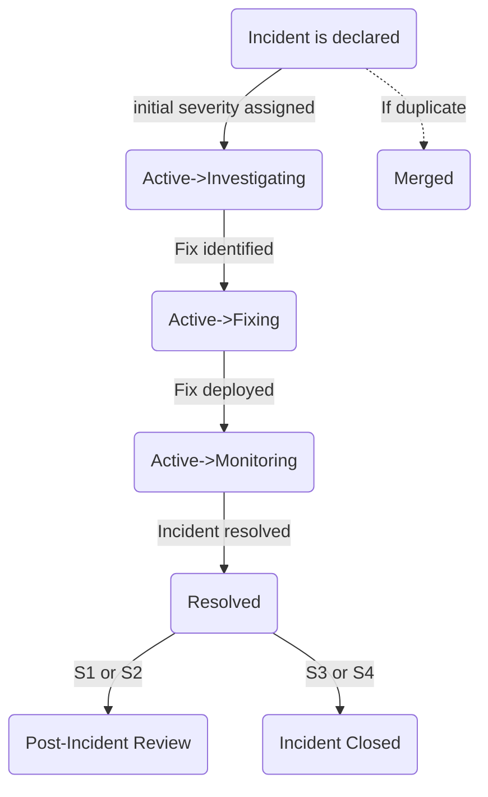

{}
If you're a GitLab team member and are looking to alert Reliability Engineering about an availability issue with GitLab.com, please find quick instructions to report an incident here: [Reporting an Incident](#reporting-an-incident).
{}

{}
If you're a GitLab team member looking for who is currently the Engineer On Call (EOC), please see the [Who is the Current EOC?](#who-is-the-current-eoc) section.
{}

{}
If you're a GitLab team member looking for the status of a recent incident, please see the incident [board](https://gitlab.com/gitlab-com/gl-infra/production/-/boards/1717012?&label_name%5B%5D=incident). For detailed information about incident status changes, please see the [Incident Workflow](#incident-workflow) section.
{}

## Incident Management

Incidents are **anomalous conditions** that result in—or may lead
to—service degradation or outages. These events require human
intervention to avert disruptions or restore service to operational status.
Incidents are _always_ given immediate attention.

The goal of incident management is to organize chaos into swift incident
resolution. To that end, incident management provides:

1. well-defined [roles and responsibilities](#roles-and-responsibilities) and [workflow](#incident-workflow) for members of the incident team,
1. control points to manage the flow information and the resolution path,
1. an incident review where lessons and techniques are extracted and shared

When an [incident starts](#reporting-an-incident), the incident automation sends a message
in the correponding [incident announcement channel](#incident-announcement-channels)
containing a link to a per-incident Slack channel for text based communication.
Within the incident channel, a per-incident Zoom link will be created.
Additionally, a GitLab issue will be opened in the [Production tracker](https://gitlab.com/gitlab-com/gl-infra/production)

### Scheduled Maintenance

Scheduled maintenance that is a `C1` should be treated as an undeclared incident.

30-minutes before the maintenance window starts, the Engineering Manager who is responsible for the change should notify the SRE on-call, the Release Managers and the CMOC to inform them that the maintenance is about to begin.

Coordination and communication should take place in the Situation Room Zoom so that it is quick and easy to include other engineers
if there is a problem with the maintenance.

If a related incident occurs during the maintenance procedure, the EM should act as the Incident Manager for the duration of
the incident.

If a separate unrelated incident occurs during the maintenance procedure, the engineers involved in the scheduled maintenance should
vacate the Situation Room Zoom in favour of the active incident.

## Ownership

The Incident Lead role must be deliberately set for every incident. If you need help determining the owner of an incident, the EOC can help.
The Incident Lead can delegate ownership to another engineer or escalate ownership to the IM at any time.
There is only ever **one** owner of an incident and only the owner of the incident can declare an incident resolved.
At anytime the Incident Lead can engage the next role in the hierarchy for support. The Incident Lead role should always be assigned to the current owner.

## Roles and Responsibilities

Clear delineation of responsibilities is important during an incident.
Quick resolution requires focus and a clear hierarchy for delegation of
tasks. Preventing overlaps and ensuring a proper order of operations is vital
to mitigation.

To make your role clear edit your zoom name to start with your role when you join the Zoom meeting.  For Example "IM - John Doe"
To edit your name during a zoom call, click on the three dots by your name in your video tile and choose the "rename" option.
Edits made during a zoom call only last for the length of the call, so it should automatically revert to your profile name/title with the next call.

| **Role** | **Description** | **Who?** |
| ---- | ----------- | ---- |
| `EOC` - **Engineer On Call** | The EOC is usually the first person alerted - expectations for the role are in the [Handbook for oncall](/handbook/engineering/on-call/#expectations-for-on-call). The checklist for the EOC is in our [runbooks](https://gitlab.com/gitlab-com/runbooks/blob/master/on-call/checklists/eoc.md). If another party has declared an incident, once the EOC is engaged, the EOC owns the incident. The EOC can escalate by [engaging the Incident Manager and CMOC](#how-to-engage-the-eoc-im-or-cmoc). | The **Engineer On Call** is generally an SRE and can declare an incident. They are part of the "SRE 8 Hour" on call shift in PagerDuty. |
| `DRI` - **Directly Responsible Individual** | The DRI is the owner of the incident and is responsible for the coordination of the incident response and will drive the incident to resolution. The DRI should always be the person assigned to the issue. | By default, the `IM` is the DRI for Sev1 and Sev2 externally facing incidents, the EOC is the DRI for all other incidents. The DRI can and should transfer ownership in cases where it makes sense to do so. |
| `IM` - **Incident Manager** [Information about IM onboarding](/handbook/engineering/infrastructure/incident-management/incident-manager-onboarding/) | The Incident Manager is engaged when incident resolution requires coordination from multiple parties. The Incident Manager is the tactical leader of the incident response team—not a person performing technical work. The IM checklist is in our [runbooks](https://gitlab.com/gitlab-com/runbooks/-/blob/master/incidents/general_incidents.md#imoc-checklist). The Incident Manager assembles the incident team by engaging individuals with the skills and information required to resolve the incident. | The Incident Manager On Call rotation is in [PagerDuty](https://gitlab.pagerduty.com/schedules#?query=incident%20manager) |
| `IM Coordinator` - **Incident Manager Coordinator** | The IM Coordinator is responsible for helping to coordinate IM coverage, on-boarding and off-boarding. | A single person dedicated to the role in the Infrastructure department |
| `EOC Coordinator` - **Engineer on-call Coordinator** | The EOC Coordinator is responsible for maintaining EOC quality of life and confidence. | A single person dedicated to the role in the Infrastructure department |
| `CMOC` - Incident **Communications Manager On Call** | The CMOC disseminates information internally to stakeholders and externally to customers across multiple media (e.g. GitLab issues, status.gitlab.com, etc.). | The **Communications Manager** is generally member of the support team at GitLab. Notifications to the `Incident Management - CMOC` service in PagerDuty will go to the rotations setup for CMOC. |
| `Infrastructure Leader` | The Infrastructure Leader is part of the Infrastructure Leadership rotation that handles escalations for high severity incidents. | A Staff+ or EM in the Infrastructure, Platform department. |
| `Infrastructure Liaison` | The Infrastructure Liaison is someone who speaks on behalf of the department to the e-team for severity 1 incidents. | A [grade 10+](/handbook/total-rewards/compensation/compensation-calculator/#gitlab-job-grades) member of Infrastructure. |

These definitions imply several on-call rotations for the different roles. Note that not all incidents include engagement from Incident Managers or Communication Managers.

### Engineer on Call (EOC) Responsibilities

The Engineer On Call is responsible for the mitigation of impact and resolution to the incident that was declared.
The EOC should reach out to the Incident Manager for support if help is needed or others are needed to aid in the incident investigation.

For Sev3 and Sev4 incidents, the EOC is also responsible for [Incident Manager Responsibilities](#incident-manager-im), second to mitigating and resolving the incident.

1. **As EOC, your highest priority for the duration of your shift is the stability of GitLab.com.**
1. When there is uncertainty of the cause of a degradation or outage, the **first action of the EOC** is to evaluate whether any changes can be reverted. It is always appropriate to toggle (to previous state) any recently changed application feature flags without asking for permission and without hesitation. The next step is to review Change Requests and validate the eligibility criteria for application rollbacks.
1. The SSOT for who is the current EOC is the [GitLab Production](https://gitlab.pagerduty.com/service-directory/PATDFCE) service definition in PagerDuty.
    1. SREs are responsible for arranging coverage if they will be unavailable for a scheduled shift.  To make a request, send a message indicating the days and times for which coverage is requested to the `#eoc-general` Slack channel.  If you are unable to find coverage reach out to the [EOC coordinator](#engineer-on-call-coordinator) for assistance.
1. Alerts that are routed to PagerDuty require acknowledgment within 15 minutes, otherwise they will be escalated to the oncall Incident Manager.
    1. Alerts that page PagerDuty will automatically create a triage incident in [`#incidents-dotcom-triage`](https://gitlab.slack.com/archives/alerts). If it is determined to be a true incident, the triage incident should be accepted.
    1. Alert-manager alerts in [`#alerts`](https://gitlab.slack.com/archives/alerts) and [`#feed_alerts-general`](https://gitlab.slack.com/archives/feed_alerts-general) are an important source of information about the health of the environment and should be monitored during working hours.
    1. If the PagerDuty alert noise is too high, your task as an EOC is clearing out that noise by either fixing the system or changing the alert.
    1. If you are changing the alert, it is your responsibility to explain the reasons behind it and inform the next EOC that the change occurred.
    1. Each event (may be multiple related pages) should result in an issue in the `production` tracker. See [production queue usage](/handbook/engineering/infrastructure/production/#implementation) for more details.
1. If sources outside of our alerting are reporting a problem, and you have not received any alerts, it is still your responsibility to investigate. [Declare a low severity incident](#reporting-an-incident) and investigate from there.
    1. Low severity ([S3/S4](/handbook/engineering/infrastructure/production/#severity)) incidents (and issues) are cheap, and will allow others a means to communicate their experience if they are also experiencing the issue.
    1. **"No alerts" is not the same as "no problem"**
1. GitLab.com is a complex system. It is ok to not fully understand the underlying issue or its causes. However, if this is the case, as EOC you should [page the Incident Manager](#how-to-engage-the-eoc-im-or-cmoc) to find a team member with the appropriate expertise.
    1. Requesting assistance does not mean relinquishing EOC responsibility. The EOC is still responsible for the incident.
    1. The [GitLab Organizational Chart](https://comp-calculator.gitlab.net/org_chart) and the [GitLab Team Page](/handbook/company/team/), which lists areas of expertise for team members, are important tools for finding the right people.
1. As soon as an [S1/S2](/handbook/engineering/infrastructure/production/#severity) [incident is declared](#report-an-incident-via-slack), join the Zoom room for the incident. The Zoom link is in the bookmarks of the relevant incident channel.
    1. GitLab works in an asynchronous manner, but incidents require a synchronous response. Our collective goal is high availability of 99.95% and beyond, which means that the timescales over which communication needs to occur during an incident is measured in seconds and minutes, not hours.
1. It is important that updates are posted regularly during an incident. This supports our async ability to independently discover the context of an incident and helps all stakeholders (including users) understand the general idea of what is going on. Use `/inc update` in the Slack channel to easily post an update.
1. Keep in mind that a GitLab.com incident is not an "infrastructure problem". It is a company-wide issue, and as EOC, you are leading the response on behalf of the company.
    1. If you need information or assistance, engage with Engineering teams. If you do not get the response you require within a reasonable period, escalate through the Incident Manager.
    1. As EOC, require that those who may be able to assist to join the Zoom call and ensure that they post their findings in Slack and pin (📌) the message to the incident timeline.
1. By acknowledging an incident in PagerDuty, the EOC is implying that they are working on it. To further reinforce this acknowledgement, post a note in Slack that you are joining the incident Zoom as soon as possible.
    1. If the EOC believes the alert is incorrect, comment on the thread in `#production`. If the alert is flappy, create an issue and post a link in the thread. This issue might end up being a part of RCA or end up requiring a change in the alert rule.
1. _Be inquisitive_. _Be vigilant_. If you notice that something doesn't seem right, investigate further.
1. The EOC should not consider immediate work on an incident completed until the Incident Summary is filled out with useful information to describe all the key aspects of the Incident.
1. After the incident is resolved, the EOC should review the comments and ensure that the [corrective actions](#corrective-actions) are added to the issue description, regardless of the incident severity. If it has a `~review-requested` label, the EOC or whoever is the assigned incident lead should start on performing an [incident review](/handbook/engineering/infrastructure/incident-review/), in some cases this may be a synchronous review meeting or an async review depending on what is requested by those involved with the incident.

### Incident Manager (IM)

_For general information about how shifts are scheduled and common scenarios about what to do when you have PTO or need coverage, see the [Incident Manager onboarding documentation](/handbook/engineering/infrastructure/incident-management/incident-manager-onboarding/#frequently-asked-questions)_

When paged, the Incident Managers have the following responsibilities during a Sev1 or Sev2 incident and should be engaged on these tasks immediately when an incident is declared:

1. **In the event of an incident which has been triaged and confirmed as a clear Severity 1 impact:**
    1. Notify Infrastructure Leadership by typing `/incident escalate` in Slack. In the `On-call teams` drop-down menu, select `dotcom leadership escalation` with the appropriate message in the `Notification Message`.This notification should happen 24/7.
    2. In the case of a large scale outage where there is a serious disruption of service, the Incident Manager should check in with Infrastructure Leadership whether a senior member should be brought into the incident to coordinate and manage recovery efforts. This is to ensure that the person in charge of coordinating multiple parallel recovery efforts has a deeper understanding of what is required to bring services back online.
1. Consider engaging the release-management team if a code change related issue is identified as a potential cause and we need to explore rollbacks or expedited deployment. This can be done by using their slack handle `release-managers`
1. Responsible for posting regular status updates using the `/incident update` in the incident Slack channel. These updates should summarize the current customer impact of the incident and actions we are taking to mitigate the incident. This is the most important section of the incident timeline. It will be referenced to status page updates and should provide a summary of the incident and impact that can be understood by the wider community.
1. Ensure that the incident issue has all of the required fields applied. If not set them using `/incident field` command from the incident slack channel
1. Ensure that the incident issue is appropriately restricted based on [data classification](#incident-data-classification), to mark the issue as confidential use `/incident field` and set the `Keep GitLab Issue Confidential` to `true`
1. If present, ensure that the `Summary for CMOC notice / Exec summary` is filled , use the `/incident summary` to do so
1. Ensure that necessary public communications are made accurately and in a timely fashion by the [Communications Manager](#communications-manager-on-call-cmoc-responsibilities). Be mindful that, due to the directive to [err on the side of declaring incidents early and often](/handbook/engineering/infrastructure/incident-management/#report-an-incident-via-slack), we should first confirm customer impact with the Engineer On Call prior to approving customer status updates.
1. Ensure that all necessary Actions are created and assigned to the appropriate engineers. These actions should cover both tasks required during the incident to drive resolution, as well as any post-incident corrective steps.
To create an action, use the command `/incident action <thing-to-do>` and complete the pop-up form with the relevant details.
1. Ensuring that the Timeline section of the incident in the `post-incident` tab is accurate and complete with the start and end of the customer impact.
1. Ensuring that the root cause is stated clearly and plainly in the incident description by updating the `causes` section in the `/incident summary`, or can be alternatively shared as an internal status update using the `:pushpin:` emoji or confidential follow-up if the root cause cannot be made public.
1. If necessary, help the EOC to engage development using the [InfraDev escalation process](/handbook/engineering/development/processes/infra-dev-escalation/process/).
1. If applicable, coordinate the incident response with [business contingency activities](/handbook/business-technology/entapps-documentation/policies/gitlab-business-continuity-plan/).
1. If the incident is Sev 1/2, A [post-incident review](/handbook/engineering/infrastructure/incident-review/) is required to be done by the IM Post-mortem tasks are notified in the incident Slack channel once the incident is marked as resolved. The DRI role for this can be delegated.
1. Following the first significant Severity 1 or 2 incident for a new Incident Manager, schedule a feedback coffee chat with the Engineer On Call, Communications Manager On Call, and (optionally) any other key participants to receive actionable feedback on your engagement as Incident Manager.
1. For all Severity 1 and Severity 2 incidents, [initiate an async incident review](/handbook/engineering/infrastructure/incident-review/#process-for-asynchronous-reviews) and inform the Engineering Manager of the team owning the root cause that they may need to initiate [the Feature Change Lock process](/handbook/engineering/#feature-change-locks).

The Incident Manager is the DRI for all of the items listed above, but it is expected that the IM will do it with the support of the EOC or others who are involved with the incident. If an incident runs beyond a scheduled shift, the Incident Manager is responsible for handing over to the incoming IM.

The IM won't be engaged on these tasks unless they are paged, which is why the default is to page them for all Sev1 and Sev2 incidents.
In other situations, [page the Incident Manager](#how-to-engage-the-eoc-im-or-cmoc) to engage them.

### Incident Manager Coordinator

1. Around the 1st Tuesday of each month:
   - The coordinator will review any open `~IM-Onboarding::Ready` and `~IM-Offboarding` issues on the [IM onboarding/offboarding board](https://gitlab.com/gitlab-com/gl-infra/production-engineering/-/boards/5078854?label_name%5B%5D=IM) and add these team members to the schedule.
   - The schedule is updated by creating an MR that updates [im_locals.tf](https://ops.gitlab.net/gitlab-com/gl-infra/config-mgmt/-/blob/main/environments/pagerduty/im_locals.tf?ref_type=heads).
     A single MR is created for all users that need updating. They will be assigned to the appropriate shift and the `start_date` will be set to the beginning of the second full month after the current day.
     For example, if the current day is Jan 5, the `start_date` will be make to go into effect during the first week of March.
1. An announcement will be posted in [`#im-general`](https://gitlab.slack.com/archives/C01NY82EJF6) indicating that the schedule has been modified with a link to the MR and a brief overview of who was added or removed.
1. All issues on the [IM onboarding/offboarding board](https://gitlab.com/gitlab-com/gl-infra/production-engineering/-/boards/5078854?label_name%5B%5D=IM) need to be reviewed once a month for overdue due dates.
   If any issues are overdue, the coordinator will need to check in with the author to see if they need more time or support to finish their on-boarding.

### Engineer on-call Coordinator

The EOC Coordinator is focused on improving SRE on-call quality of life and setting up processes to keep on-call engineers across the entire company operating at a high level of confidence.

Responsibilities of this role:

1. Identifying gaps in process and tooling that help EOC increase QoL, capture via PI.
2. Coordinating regular training and workshops.
3. Enabling knowledge transfer between SREs as a follow up to incident reviews and notable incidents.
4. Facilitate larger changes regarding incident management through coordination and priority setting with other teams inside of SaaS Platforms.

The EOC Coordinator will work closely with the Ops Team on core on-call and incident management concerns, and engage other teams across the organization as needed.

### Tier 2 Oncall

Tier 2 on-calls are established to provide subject matter expertise when required. Additional teams may be added when appropriate.
To initiate onboarding of a new tier 2 team, follow the guidelines in [Tier 2 Oncall Onboarding for teams](/handbook/engineering/infrastructure/incident-management/tier2-oncall-onboarding)
To page a Tier 2 team, use `/inc escalate` in Slack and choose the team you'd like to contact.

### Communications Manager on Call (CMOC) Responsibilities

For serious incidents that require coordinated communications across multiple channels, the Incident Manager will rely on the CMOC for the duration of the incident.

The GitLab support team staffs an oncall rotation and via the `Incident Management - CMOC` service in PagerDuty. They have a section in [the support handbook](/handbook/support/workflows/cmoc_workflows/) for getting new CMOC people up to speed.

During an incident, the CMOC will:

1. Be the voice of GitLab during an incident by updating our end-users and internal parties through updates to our [status page](https://status.gitlab.com/) hosted by Status.io.
    - Tip: use `/woodhouse incident post-statuspage` on Slack to create an incident on Status.io. Any updates to the incident will have to be done manually by following [these instructions](/handbook/support/workflows/cmoc_workflows/#stage-2-updating-incidents).
1. Update the status page at regular intervals in accordance with [the severity of the incident](/handbook/support/workflows/cmoc_workflows/#frequency-of-updates).
1. Notify GitLab stakeholders (customer success and community team) of current incident and reference where to find further information. Provide additional update when the incident is mitigated.
1. Given GitLab's directive to [err on the side of declaring incidents early and often](/handbook/engineering/infrastructure/incident-management/#report-an-incident-via-slack), it is important for the Communications Manager not to make public communications without first confirming with the Engineer on Call and Incident Manager that the incident has significant external customer impact. Rushing to communicate incidents before understanding impact can lead to a public perception of reliability impacts that may not be accurate, because we regularly declare an incident at Severity 1 or 2 initially and then downgrade it one or even two levels once the scope of customer impact is more clearly understood.

### Infrastructure Leader

To page the Incident leader directly, run `/inc escalate` and choose the `dotcom leadership escalation` from the `Oncall Teams` drop-down menu

The Infrastructure Leadership is on the escalation path for both Engineer On Call (EOC) and Incident Manager (IM).
This is not a substitute or replacement for the active Incident Manager (unless the current IM is unavailable).

They will be paged in the following circumstances:

1. If IM is unable to respond to a page within 15 minutes.
1. If there are multiple ongoing incidents that is overloading the EOC, or if coordination is required among multiple SREs, the Infrastructure Leader can be paged to help coordinate recovery and bring in additional help if needed.

When paged, the Infrastructure Leader will:

1. Join the incident call
1. Ask the EOC if help is needed from additional SREs.
1. Ask the IM to ensure they are able to fulfill their duties.
1. Evaluate whether a separate zoom should be created for technical investigations.
1. Be the primary technical point of contact for the IM/CMOC to ensure the EOC can focus completely on remediation.

### Infrastructure Liaison

To page the Incident Liaison directly, run `/pd trigger` and choose the `Infrastructure Liaison` as the impacted service.

During a verified Severity 1 Incident the IM will page the Infrastructure Liaison.
This is not a substitute or replacement for the active Incident Manager.

When paged, the Infrastructure Liaison will:

1. Make an overall evaluation of the incident and further validation of Severity.
1. Assist with further support from other teams, including those outside of Engineering (as appropriate)
1. Post a notice to e-group slack channel. This notice does not have to be expedited, but should occur once there is a solid understanding of user impact as well as the overall situation and current response activities.  The e-group notice should be in this format

```markdown
:s1: **Incident on GitLab.com**
**— Summary —**
(include high level summary)
**— Customer Impact —**
(describe the impact to users including which service/access methods and what percentage of users)
**— Current Response —**
(bullet list of actions)
**— Production Issue —**
 Main incident: (link to the incident)
 Slack Channel: (link to incident slack channel)
```

1. After posting the notice, continue to engage with the incident as needed and also post updates to a thread of the e-group notification when there are material/significant updates.

## References

### Other escalations

Further support is available from the Scalability and Delivery Groups if required.
Scalability leadership can be reached via PagerDuty [Scalability Escalation](https://gitlab.pagerduty.com/escalation_policies#PDJ160O) (further [details available on their team page](/handbook/engineering/infrastructure/team/scalability/#emergency-escalation-during-s1s2-incidents)).
Delivery leadership can be reached via PagerDuty. See the [Release Management Escalation](/handbook/engineering/infrastructure-platforms/gitlab-delivery/delivery/#release-management-escalation) steps on the Delivery group page.

### Incident Mitigation Methods - EOC/Incident Manager

1. If wider user impact has been established during an S1 or S2 incident, as EOC you have the authority - without requiring further permission - to [Block Users](https://docs.gitlab.com/ee/administration/moderate_users.html#block-a-user) as needed in order to mitigate the incident. Make sure to follow [Support guidelines regarding `Admin Notes`](../../../support/workflows/admin_note/#adding-the-note), leaving a note that contains a link to the incident, and any further notes explaining why the user is being blocked.
    1. If users are blocked, then further follow-up will be required. This can either take place during the incident, or after it has been mitigated, depending on time-constraints.
        1. If the activity on the account is considered [abusive](../../security/security-operations/trustandsafety/#what-is-abuse), report the user to [Trust and Safety](../../security/security-operations/trustandsafety/#-contact-us) so that the account can be permanently blocked and cleaned-up. Depending on the nature of the event, the EOC may also consider reaching out to the SIRT team.
        1. If not, [open a related confidential incident issue and assign it to CMOC](https://gitlab.com/gitlab-com/gl-infra/production/-/issues/new?issuable_template=confidential_incident_data) to reach out to the user, explaining why we had to block their account temporarily.
        1. If the EOC is unable to determine whether the user's traffic was malicious or not, please engage the [SIRT](../../security/security-operations/sirt/) team to carry out an investigation.

### When to Engage an Incident Manager?

If any of the following are true, it would be best to engage an Incident Manager:

1. There is a S1/P1 report or security incident.
1. An entire path or part of functionality of the GitLab.com application must be blocked.
1. Any unauthorized access to a GitLab.com production system
1. Two or more S3 or higher incidents to help delegate to other SREs.

**Please note** that when an incident is upgraded in severity (for example from S3 to S1), incident.io automatically pages the EOC, IMOC, and CMOC via PagerDuty.

### What happens when there are simultaneous incidents?

Occasionally we encounter multiple incidents at the same time. Sometimes a single Incident Manager can cover multiple incidents. This isn't always possible, especially if there are two simultaneous high-severity incidents with significant activity.

When there are multiple incidents and you decide that additional incident manager help is required, take these actions:

1. Post a slack message in #im-general as well as the appropriate [incident announcement channel](#incident-announcement-channels) asking for additional Incident Manager help.
1. If your ask is not addressed via slack, escalate to  [Infrastructure Leadership](https://gitlab.pagerduty.com/service-directory/PJKOEIS) in PagerDuty.

### Weekend Escalations

EOCs are responsible for responding to alerts even on the weekends.  Time should not be spent mitigating the incident _unless_ it is a `~severity::1` or `~severity::2`.  Mitigation for `~severity::3` and `~severity::4` incidents can occur during normal business hours, Monday-Friday.  If you have any questions on this please reach out to an [Infrastructure Engineering Manager](https://gitlab.com/gitlab-com/gl-infra/managers).

If a `~severity::3` and `~severity::4` occurs multiple times and requires weekend work, the multiple incidents should be combined into a single `severity::2` incident.
If assistance is needed to determine severity, EOCs and Incident Managers are encouraged to contact [Reliability Leadership via PagerDuty](https://gitlab.pagerduty.com/schedules#P12EH0Z)

### Incident Manager Escalation

A page will be escalated to the Incident Manager (IM) if it is not answered by the Engineer on Call (EOC).
This escalation will happen for all alerts that go through PagerDuty, which includes lower severity alerts.
It's possible that this can happen when there is a large number of pages and the EOC is unable to focus on acknowledging pages.
When this occurs, the IM should reach out in Slack in the corresponding [incident announcement channel](#incident-announcement-channels) to see if the EOC needs assistance.

Example:

```plaintext
@sre-oncall, I just received an escalation. Are you available to look into LINK_TO_PAGERDUTY_INCIDENT, or do you need some assistance?
```

If the EOC does not respond because they are unavailable, you should escalate the incident using the PagerDuty application, which will alert Infrastructure Engineering leadership.

### How to engage the EOC, IM or CMOC?

If during an incident, the EOC, Incident Manager or, CMOC need to be engaged, page the person on-call using one of the following. This triggers a PagerDuty incident and page the appropriate person based on the **Impacted Service** that you select.

- Use the `/inc escalate` command in Slack , select the correct team from the `Oncall team` drop down menu based on the role below,
or
- Directly from PagerDuty, navigate to [Incidents page in PagerDuty](https://gitlab.pagerduty.com/incidents), create a new incident and select the **Impacted Service** based on the role below.

| Role | Team |
| ----- | ----- |
| EOC | dotcom EOC |
| IM | dotcom IMOC |
| CMOC | dotcom CMOC |
| ----- | ----- |
| EOC | GitLab Production |
| IM | Incident Manager Oncall |
| CMOC | Incident Management - CMOC |

### Incidents requiring direct customer interaction

If, during an S1 or S2 incident, it is determined that it would be beneficial to have a synchronous conversation with one or more customers a new Zoom meeting should be utilized for that conversation. Typically there are two situations which would lead to this action:

1. An incident which is uniquely impacting a single, or small number, of customers where their insight into how they are using GitLab.com would be valuable to finding a solution.
1. A large-scale incident, such as a multi-hour full downtime or regional DR event, when it is desired to have synchronous conversation with key customers, typically to provide another form of update or to answer further questions.

Due to the overhead involved and the risk of detracting from impact mitigation efforts, this communication option should be used sparingly and only when a very clear and distinct need is present.

Implementing a direct customer interaction call for an incident is to be initiated by the current Incident Manager by taking these steps:

1. Identify a second Incident Manager who will be dedicated to the customer call. If not already available in the incident, announce the need in #im-general with a message like `/here A second incident manager is required for a customer interaction call for XXX`.
1. Page the [Infrastructure Leadership pagerduty rotation](#infrastructure-leader) for additional assistance and awareness.
1. Identify a Customer Success Manager who will act as the primary CSM and also be dedicated to the customer call. If this role is not clear, also refer to Infrastructure Leadership for assistance.
1. Request that both of these additional roles join the main incident to come up to speed on the incident history and current status. If necessary to preserve focus on mitigation, this information sharing may be done in another Zoom meeting (which could then also be used for the customer conversation)

After learning of the history and current state of the incident the Engineering Communications Lead will initiate and manage the customer interaction through these actions:

1. Start a new Zoom meeting - unless one is already in progress - invite the primary CSM.
1. The Engineering Communications Lead and CSM should appropriately set their Zoom name to indicate `GitLab`, as well as their Role, `CSM` `Engineering Communications Lead`
1. Through the CSM, invite any customers who are required for the discussion.
1. The Engineering Communications Lead and the Incident Manager need to prioritize async updates that will allow for the correct information to flow between conversations. Consider using the incident slack channel for this but agree before the customer call starts.
1. Both the Engineering Communications Lead and CSM should remain in the Zoom with the customers for the full time required for the incident. To avoid loss of context, neither should "jump" back and forth from the internal incident Zoom and the customer interaction Zoom.

In some scenarios it may be necessary for most all participants of an incident (including the EOC, other developers, etc.) to work directly with a customer. In this case, the customer interaction Zoom shall be used, NOT the Incident Zoom. This will allow for the conversation (as well as text chat) while still supporting the ability for primary responders to quickly resume internal communications in the Incident Zoom.

## Corrective Actions

Corrective Actions (CAs) are work items that we create as a result of an incident.
Only issues arising out of an incident should receive the label `~"corrective action"`.
They are designed to prevent the same kind of incident or improve the time to mitigation and as such are part of the Incidence Management cycle.
Corrective Actions must be related to the incident issue to help with downstream analysis.

Corrective Actions issues in the [Production Engineering project](https://gitlab.com/gitlab-com/gl-infra/production-engineering/-/issues/new) should be created using the [Corrective Action issue template](https://gitlab.com/gitlab-com/gl-infra/reliability/-/blob/master/.gitlab/issue_templates/incident-corrective-action.md) to ensure consistency in format, labels and application/monitoring of [service level objectives for completion](/handbook/engineering/infrastructure/engineering-productivity/issue-triage/#severity-slos)

Issues that have the `~"corrective action"` label will automatically have the `~"infradev"` label applied.
This is done so teams these issues are follow the same process we have for development to resolve them in [specific time-frames](/handbook/engineering/infrastructure/engineering-productivity/issue-triage/#severity-slos).
For more details see the [infradev process](/handbook/product/product-processes/#infradev).

### Best practices and examples, when creating a Corrective Action issue

- Use [SMART](https://en.wikipedia.org/wiki/SMART_criteria) criteria: Specific, Measurable, Achievable, Relevant and Time-bounded.
- Link to the incident they arose from.
- Assign a Severity label designating the highest severity of related incidents.
- Assign a priority label indicating the [urgency](/handbook/engineering/infrastructure/engineering-productivity/issue-triage/#priority) of the work. By default, this should match the incident Severity
- Assign the label for the associated affected service if applicable.
- Provide enough context so that any engineer in the Corrective Action issue's project could pick up the issue and know how to move forward with it.
- Avoid creating Corrective Actions that:
  - Are too generic (most typical mistake, as opposed to Specific)
  - Only fix incident symptoms.
  - Introduce more human error.
  - Will not help to keep the incident from happening again.
  - Can not be promptly implemented (time-bounded).
- Examples: (taken from several best-practices Postmortem pages)

| Badly worded | Better |
| ------------ | ------ |
| Fix the issue that caused the outage | (Specific) Handle invalid postal code in user address form input safely |
| Investigate monitoring for this scenario | (Actionable) Add alerting for all cases where this service returns >1% errors |
| Make sure engineer checks that database schema can be parsed before updating | (Bounded) Add automated presubmit check for schema changes |
| Improve architecture to be more reliable | (Time-bounded and specific) Add a redundant node to ensure we no longer have a single point of failure for the service |

## Runbooks

[Runbooks](https://gitlab.com/gitlab-com/runbooks) are available for
engineers on call. The project README contains links to checklists for each
of the above roles.

**In the event of a GitLab.com outage**, a mirror of the runbooks repository is available on the Ops instance at https://ops.gitlab.net/gitlab-com/runbooks.

### Who is the Current EOC?

Use the `@sre-oncall` handle to check who the current EOC is

### When to Contact the Current EOC

The current EOC can be contacted via the `@sre-oncall` handle in Slack, but please only use this handle in the following scenarios.

1. You need assistance in halting the deployment pipeline. note: this can also be accomplished by [Reporting an Incident](/handbook/engineering/infrastructure/incident-management/#reporting-an-incident) and setting the custom field "Blocks Deployments" to "Yes".
1. You are conducting a production change via our [Change Management](/handbook/engineering/infrastructure/change-management/) process and as a required step need to seek the approval of the EOC.
1. For all other concerns please see the [Getting Assistance](/handbook/engineering/infrastructure/getting-assistance/) section.

The EOC will respond as soon as they can to the usage of the `@sre-oncall` handle in Slack, but depending on circumstances, may not be immediately available. If it is an emergency and you need an immediate response, please see the [Reporting an Incident](/handbook/engineering/infrastructure/incident-management/#reporting-an-incident) section.

## Reporting an Incident

If you are a GitLab team member and would like to report a possible incident related to GitLab.com and have the EOC paged in to respond, choose one of the reporting methods below. Regardless of the method chose, please stay online until the EOC has had a chance to come online and engage with you regarding the incident. Thanks for your help!

### Report an Incident via Slack

Type `/incident` or `/inc` in GitLab's Slack and follow the prompts to open an incident issue.
It is always better to err on side of choosing a higher severity, and declaring an incident for a production issue, even if you aren't sure.
Reporting high severity bugs via this process is the preferred path so that we can make sure we engage the appropriate engineering teams as needed.


_Incident Declaration Slack window_

| Field | Description |
| ----- | ----------- |
| Name | Give a short description of what is happening. If you'd like to, you can leave it blank and change it later |
| Incident Type | Select the appropriate incident type: GitLab.com, Dedicated, SIRT, or Gameday depending on the service affected  |
| Initial status | Choose "Active incident" if you've confirmed there's a problem and you'd like to investigate it right away, or "Triage a problem" for initial investigation |
| Severity | If unsure about the severity, but you are seeing a large amount of customer impact, please select S1 or S2. More details here: [Incident Severity](#incident-severity). |
| Summary (optional) | Provide your current understanding of what happened in the incident and the impact it had. It's fine to go into detail here |
| Who should be able to see this incident? | Choose "Everyone (public)" - this means everyone in this Slack workspace will have access. Choose "Private" to mark the issue confidential - do this for all security related issues or incidents that primarily contain information that is not [SAFE](/handbook/legal/safe-framework/#what-is-safe). |


_Incident Declaration Results_

As well as opening a GitLab incident issue, a dedicated incident Slack channel will be opened. incident.io will post links to all of these resources in the corresponding [incident announcement channel](#incident-announcement-channels). Please join the incident Slack channel, created and linked as a result of the incident declaration, to discuss the incident with the on-call engineer.

## Definition of Outage vs Degraded vs Disruption and when to Communicate

This is a first revision of the definition of Service Disruption (Outage), Partial Service Disruption, and Degraded Performance per the terms on Status.io.
Data is based on the graphs from the [Key Service Metrics Dashboard](https://dashboards.gitlab.net/d/general-service/service-platform-metrics?orgId=1)

Outage and Degraded Performance incidents occur when:

1. `Degraded` as any sustained 5 minute time period where a service is below its documented Apdex SLO or above its documented error ratio SLO.
1. `Outage` (Status = Disruption) as a 5 minute sustained error rate above the Outage line on the error ratio graph


In both cases of Degraded or Outage, once an event has elapsed the 5 minutes, the Engineer on Call and the Incident Manager should engage the CMOC to help with external communications.  All incidents with a total duration of more than 5 minutes should be publicly communicated as quickly as possible (including "blip" incidents), and within 1 hour of the incident occurring.

SLOs are documented in the [runbooks/rules](https://gitlab.com/gitlab-com/runbooks/blob/master/rules/service_apdex_slo.yml)

To check if we are Degraded or Disrupted for GitLab.com, we look at these graphs:

1. Web Service
    - [Error Ratio](https://dashboards.gitlab.net/d/general-service/service-platform-metrics?orgId=1&fullscreen&panelId=8&var-PROMETHEUS_DS=Global&var-environment=gprd&var-type=web&var-stage=main&var-sigma=2)
    - [Apdex](https://dashboards.gitlab.net/d/general-service/service-platform-metrics?orgId=1&var-PROMETHEUS_DS=Global&var-environment=gprd&var-type=web&var-stage=main&var-sigma=2&fullscreen&panelId=7)
1. API Service
    - [Error Ratio](https://dashboards.gitlab.net/d/general-service/service-platform-metrics?orgId=1&fullscreen&panelId=8&var-PROMETHEUS_DS=Global&var-environment=gprd&var-type=api&var-stage=main&var-sigma=2)
    - [Apdex](https://dashboards.gitlab.net/d/general-service/service-platform-metrics?orgId=1&fullscreen&panelId=7&var-PROMETHEUS_DS=Global&var-environment=gprd&var-type=api&var-stage=main&var-sigma=2)
1. Git service(public facing git interactions)
    - [Error Ratio](https://dashboards.gitlab.net/d/general-service/service-platform-metrics?orgId=1&fullscreen&panelId=8&var-PROMETHEUS_DS=Global&var-environment=gprd&var-type=git&var-stage=main&var-sigma=2)
    - [Apdex](https://dashboards.gitlab.net/d/general-service/service-platform-metrics?orgId=1&fullscreen&panelId=7&var-PROMETHEUS_DS=Global&var-environment=gprd&var-type=git&var-stage=main&var-sigma=2)
1. GitLab Pages service
    - [Error Ratio](https://dashboards.gitlab.net/d/general-service/service-platform-metrics?orgId=1&fullscreen&panelId=8&var-PROMETHEUS_DS=Global&var-environment=gprd&var-type=pages&var-stage=main&var-sigma=2)
    - [Apdex](https://dashboards.gitlab.net/d/general-service/service-platform-metrics?orgId=1&fullscreen&panelId=7&var-PROMETHEUS_DS=Global&var-environment=gprd&var-type=pages&var-stage=main&var-sigma=2)
1. Registry service
    - [Error Ratio](https://dashboards.gitlab.net/d/general-service/service-platform-metrics?orgId=1&fullscreen&panelId=8&var-PROMETHEUS_DS=Global&var-environment=gprd&var-type=registry&var-stage=main&var-sigma=2)
    - [Apdex](https://dashboards.gitlab.net/d/general-service/service-platform-metrics?orgId=1&fullscreen&panelId=7&var-PROMETHEUS_DS=Global&var-environment=gprd&var-type=registry&var-stage=main&var-sigma=2)
1. Sidekiq
    - [Error Ratio](https://dashboards.gitlab.net/d/general-service/service-platform-metrics?orgId=1&var-PROMETHEUS_DS=Global&var-environment=gprd&var-type=sidekiq&var-stage=main&var-sigma=2&fullscreen&panelId=8)
    - [Apdex](https://dashboards.gitlab.net/d/general-service/service-platform-metrics?orgId=1&fullscreen&panelId=7&var-PROMETHEUS_DS=Global&var-environment=gprd&var-type=sidekiq&var-stage=main&var-sigma=2)

A Partial Service Disruption is when only part of the GitLab.com services or infrastructure is experiencing an incident. Examples of partial service disruptions are instances where GitLab.com is operating normally except there are:

1. delayed CI/CD pending jobs
1. delayed repository mirroring
1. high severity bugs affecting a particular feature like Merge Requests
1. Abuse or degradation on 1 gitaly node affecting a subset of git repos. This would be visible on the Gitaly service metrics

### High Severity Bugs

In the case of high severity bugs, we prefer that an incident is still created via [Reporting an Incident](/handbook/engineering/infrastructure/incident-management/#reporting-an-incident). This will give us an incident issue on which to track the events and response.

In the case of a high severity bug that is in an ongoing, or upcoming deployment please follow the steps to [Block a Deployment](/handbook/engineering/deployments-and-releases/deployments/#deployment-blockers).

## Security Incidents

If an incident may be security related, engage the Security Engineer on-call by using `/security` in Slack. More detail can be found in [Engaging the Security Engineer On-Call](/handbook/security/security-operations/sirt/engaging-security-on-call/).

## Communication

Information is an asset to everyone impacted by an incident. Properly managing the flow of information is critical to minimizing surprise and setting expectations. We aim to keep interested stakeholders apprised of developments in a timely fashion so they can plan appropriately.

This flow is determined by:

1. the type of information,
1. its intended audience,
1. and timing sensitivity.

Furthermore, avoiding information overload is necessary to keep every stakeholder's focus.

To that end, we will have:

1. a dedicated Zoom call for all incidents. A link to the Zoom call can be found in the incident Slack channel posted in the coresponding [incident announcement channel](#incident-announcement-channels) channel.
1. a Google Doc as needed for multiple user input based on the [shared template](https://docs.google.com/document/d/1NMZllwnK70-WLUn_9IiiyMWeXs-JKPEiq-lordxJAig/edit#)
1. [Incident Announcement channels](#incident-announcement-channels) for internal updates
1. regular updates to status.gitlab.com via status.io that disseminates to various media (e.g. Twitter)
1. a dedicated repo for issues related to [Production](https://gitlab.com/gitlab-com/production) separate from the queue that holds Infrastructure's workload: namely, issues for incidents and changes.

### Incident Announcement channels

We have three dedicated incident slack channels where incidents are announced

- [#incidents](https://gitlab.slack.com/archives/incidents) : All incidents are announced here
- [#incidents-dotcom](https://gitlab.slack.com/archives/incidents-dotcom) : All .com incidents are announced here
- [#incidents-dedicated](https://gitlab.slack.com/archives/incidents-dedicated) : All [Dedicated](/handbook/support/workflows/dedicated/) incidents are announced here

### Status

We manage incident [communication](#communication) using status.io, which updates [status.gitlab.com](https://status.gitlab.com). Incidents in status.io have **state** and **status** and are updated by the CMOC.

To create an incident on status.io, you can use `/woodhouse incident post-statuspage` on Slack.

#### Status during Security Incidents

In some cases, we may choose not to post to status.io, the following are examples where we may skip a post/tweet. In some cases, this helps protect the security of self managed instances until we have released the security update.

- If a partial block of a URL is possible, for example to exclude problematic strings in a path.
- If there is no usage of the URL in the last week based on searches in our logs for GitLab.com.

#### States and Statuses

Definitions and rules for transitioning state and status are as follows.

| **State** | **Definition** |
| ----- | ---------- |
| Investigating | The incident has just been discovered and there is not yet a clear understanding of the impact or cause. If an incident remains in this state for longer than 30 minutes after the EOC has engaged, the incident should be escalated to the Incident Manager On Call. |
| Active | The incident is in progress and has not yet been mitigated.  **Note:** Incidents should not be left in an `Active` state once the impact has been mitigated |
| Identified | The cause of the incident is believed to have been identified and **a step to mitigate has been planned and agreed upon**. |
| Monitoring | The step has been executed and metrics are being watched to ensure that we're operating at a baseline. If there is a clear understanding of the specific mitigation leading to resolution and high confidence in the fact that the impact will not recur it is preferable to skip this state. |
| Resolved | The impact of the incident has been mitigated and status is again Operational. Once resolved the incident can be [marked for review](/handbook/engineering/infrastructure/incident-review/#incident-review-process) and [Corrective Actions](/handbook/engineering/infrastructure/incident-management/#corrective-actions) can be defined.|

Status can be set independent of state. The only time these must align is when an issues is

| **Status** | **Definition** |
| ------ | ---------- |
| Operational | The default status before an incident is opened and after an incident has been resolved. All systems are operating normally. |
| Degraded Performance | Users are impacted intermittently, but the impact is not observed in metrics, nor reported, to be widespread or systemic. |
| Partial Service Disruption | Users are impacted at a rate that violates our SLO. The Incident Manager On Call must be engaged and monitoring to resolution is required to last longer than 30 minutes. |
| Service Disruption | This is an outage. The Incident Manager On Call must be engaged. |
| Security Issue | A security vulnerability has been declared public and the security team has requested that it be published on the status page. |

## Severities

### Incident Severity

Incident severity should be assigned at the beginning of an incident to ensure proper response across the organization.  Incident severity should be determined based on the information that is available **at the time**.  Severities can and should be adjusted as more information becomes available. The severity level reflects the maximum impact the incident had and should remain in that level even after the incident was mitigated or resolved.

Incident Managers and Engineers On-Call can use the following table as a guide for assigning incident severity.

| Severity | Description     | Example Incidents     |
| ------------- | ------------- | -------------|
| `~severity::1` |  &emsp;- GitLab.com is unavailable or severely degraded for the typical GitLab user<br>&emsp;- Any data loss directly impacting customers<br>&emsp;- The [guaranteed self-managed release date](/handbook/engineering/releases/#timelines) is put in jeopardy<br>&emsp;- It is a [high impact security incident](/handbook/security/security-operations/sirt/severity-matrix/#functional-impact-rating-examples)<br>&emsp;- It is an internally facing incident with full loss of metrics observability (Prometheus down)<br><br>[Incident Managers](/handbook/engineering/infrastructure/incident-management/#incident-manager-responsibilities) should be paged for all `~severity::1` incidents| Past `severity::1` [Issues](https://gitlab.com/gitlab-com/gl-infra/production/-/issues/?sort=updated_desc&state=closed&label_name%5B%5D=severity%3A%3A1&first_page_size=100)|
| `~severity::2` |   &emsp;- There is a recorded impact to the availability of one or more [GitLab.com Primary Service with a weight > 0](https://dashboards.gitlab.net/d/general-slas/general-slas?orgId=1&from=now-1h&to=now). This includes `api`, `container registry`, `git access`, `API` and `web`.<br>&emsp;- GitLab.com is unavailable or degraded for a small subset of users <br>&emsp;- GitLab.com is degraded but a reasonable workaround is available<br>&emsp;- A widespread styling problem (frontend degradation) that makes the platform look unreliable.<br>&emsp;- Any [moderate impact security incident](/handbook/security/security-operations/sirt/severity-matrix/#functional-impact-rating-examples)<br>&emsp;- CustomersDot is offline<br><br>[Incident Managers](/handbook/engineering/infrastructure/incident-management/#incident-manager-responsibilities) should be paged for all `~severity::2` incidents| Past `severity::2` [Incidents](https://gitlab.com/gitlab-com/gl-infra/production/-/issues/?sort=updated_desc&state=closed&label_name%5B%5D=severity%3A%3A2&first_page_size=100)|
| `~severity::3` |   &emsp;- Broad impact on GitLab.com and minor inconvenience to typical user's workflow <br>&emsp;- A workaround is not needed<br>&emsp;- Any [low impact security incident](/handbook/security/security-operations/sirt/severity-matrix/#functional-impact-rating-examples)<br>&emsp;- Most internally facing issues pertaining to blocked deployments (should a higher-severity incident be blocked by deployments, the severity for the blocker is still 3)<br>&emsp;- CustomersDot is in maintenance mode | Past `severity::3` [Incidents](https://gitlab.com/gitlab-com/gl-infra/production/-/issues/?sort=updated_desc&state=closed&label_name%5B%5D=severity%3A%3A3&first_page_size=100)|
| `~severity::4` |   &emsp;- Minimal impact on GitLab.com typical user's workflow | Past `severity::4` [Incidents](https://gitlab.com/gitlab-com/gl-infra/production/-/issues/?sort=updated_desc&state=closed&label_name%5B%5D=severity%3A%3A4&first_page_size=100)|

### Alert Severities

1. Alerts severities do not necessarily determine incident severities. A single incident can trigger a number of alerts at various severities, but the determination of the incident's severity is driven by the above definitions.
1. Over time, we aim to automate the determination of an incident's severity through service-level monitoring that can aggregate individual alerts against specific SLOs.

## Incident Data Classification

There are four data classification levels defined in GitLab's [Data Classification Standard](/handbook/security/standards/data-classification-standard/#data-classification-levels).

- RED data should never be included in incidents, even if the issue is confidential.
- ORANGE and YELLOW data can be included and the Incident Manager managing the incident should ensure the incident issue is marked as confidential or is in an internal note.

The Incident Manager should exercise caution and their best judgement, in general we prefer to use internal notes instead of marking an entire issue confidential if possible.
A couple lines of non-descript log data may not represent a data security concern, but a larger set of log, query, or other data must have more restrictive access.
If assistance is required follow the [Infrastructure Liaison Escalation process](#infrastructure-liaison).

## Incident Workflow

### Summary

The entire incident lifecycle is managed through incident.io. All `S1` and `S2` incidents require a review, other incidents can also be reviewed as [described here](/handbook/engineering/infrastructure/incident-review/#the-criteria-which-triggers-a-review).

Incidents are [reported](/handbook/engineering/infrastructure/incident-management/#reporting-an-incident) and resolved when the degradation has ended and will not likely re-occur.

### Incident Lead

The Incident Lead is responsible for ensuring that the incident progresses and is kept updated. This role is deliberately assigned after the start of an incident.
The Lead should be chosen based on the type of incident, for example:

- Low Complexity Incidents: The team member most familiar with the affected system should lead (often the reporter)
- High Complexity Incidents: IMOC (for Sev1/2) or EOC (for Sev3/4) should typically lead due to coordination requirements, but product engineers and engineering managers are also capable of fulfilling this role.
- Delivery-Related Incidents: Release managers are often well-positioned to lead
- Security Incidents: Security team members should typically lead

### Timeline

The incident Timeline is available on the incident in the incident.io web interface by changing "Highlights" to "All Activity" in the Activity section towards the bottom of the page.
Items can be added to the timeline via the :pushpin: (📌) emoji reaction to a Slack post within the incident channel.

### Labeling

We no longer use only GitLab labels to describe the status of an incident. The source of truth for any incident is incident.io.
However, we do have incident.io set some labels based on the state of the incident.

#### Workflow Labeling

| **Label** | **Workflow State** |
| ----- | -------------- |
| `~Incident::Active` | Indicates that the incident labeled is active and ongoing. Initial severity is assigned when it is opened. This will be set when the incident is set to `Active -> Investigating` or `Active -> Fixing` |
| `~Incident::Mitigated` | Indicates that the incident has been mitigated. This label is applied if the incident status is set to `Active -> Monitoring` |
| `~Incident::Resolved` | Indicates that SRE engagement with the incident has ended and the condition that triggered the alert has been resolved. This will be applied when the incident is in the "Post-incident" or "Closed" stages of the incident lifecycle. |

#### Other Incident Labels

These labels are added to incident issues as a mechanism to add metadata for the purposes of metrics and tracking.

| **Label** | **Purpose** |
| ----- | ------- |
| `~incident` (automatically applied) | Label used for metrics tracking and immediate identification of incident issues. |
| `~blocks deployments` | Indicates that if the incident is active, it will be a blocker for deployments. This label is set when the custom field "Blocks Deployments" in incident.io is set to yes. It is automatically applied to `~severity::1` and `~severity::2` incidents. |
| `~blocks feature-flags` | Indicates that while the incident is active, it will be a blocker for changes to feature flags. This label is set when the custom field "Blocks Deployments" in incident.io is set to yes. It is automatically applied to `~severity::1` and `~severity::2` incidents. |

### Duplicates

When an incident is created that is a duplicate of an existing incident it is up to the EOC to merge it with the appropriate primary incident.
Incidents can only be merged into open incidents, so if necessary you may need to briefly reopen the incident to merge.

### Follow-up Issues

GitLab issues are created automatically when a "Follow-up" is created in incident.io. Any GitLab issue can be added as a Follow-up item by pasting the link into the incident Slack channel.

### Workflow Diagram



## Near Misses

A near miss, "near hit", or "close call" is an unplanned event that has the potential to cause, but does not actually result in an incident.

### Background

In the United States, the Aviation Safety Reporting System has been collecting reports
of close calls since 1976. Due to near miss observations and other technological improvements,
the rate of fatal accidents has dropped about 65 percent.
[source](https://en.wikipedia.org/wiki/Near_miss_(safety))

As [John Allspaw states](https://qz.com/504661/why-etsy-engineers-send-company-wide-emails-confessing-mistakes-they-made):

> Near misses are like a vaccine. They help the company better defend against
> more serious errors in the future, without harming anyone or anything in the process.

### Handling Near Misses

When a near miss occurs, we should treat it in a similar manner to a normal incident.

1. Open an [incident](/handbook/engineering/infrastructure/incident-management/#reporting-an-incident) issue, if one is not already opened. Label it with the severity label appropriate to the incident it would have caused, had the incident actually occurred. Label the incident issue with the `~Near Miss` label.
1. [corrective actions](/handbook/engineering/infrastructure/incident-management/#corrective-actions) should be treated in the same way as those for an actual incident.
1. Ownership of the incident review should be assigned to the team-member who noticed the near-miss, or, when appropriate, the team-member with the most knowledge of how the near-miss came about.
