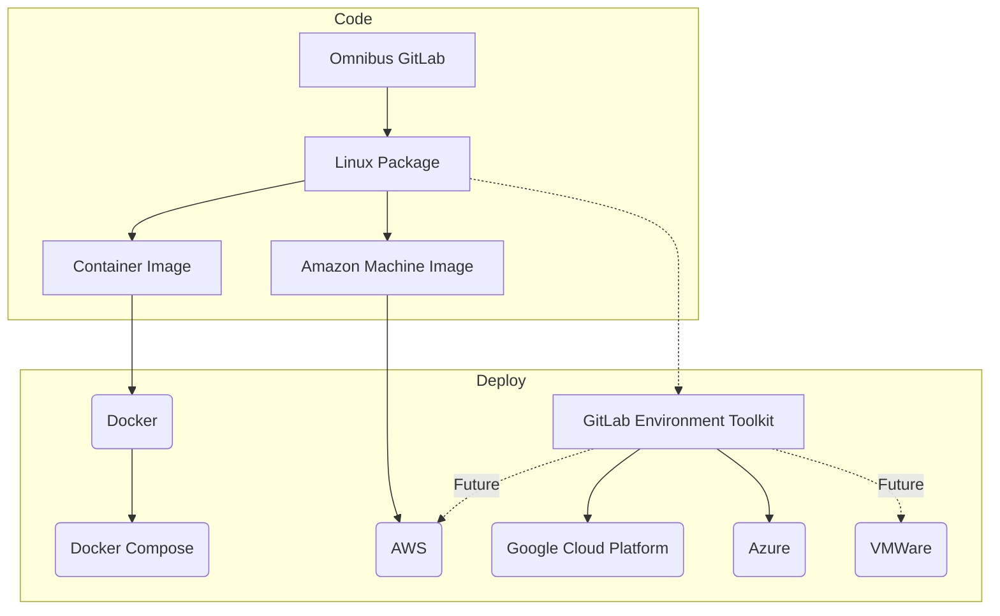
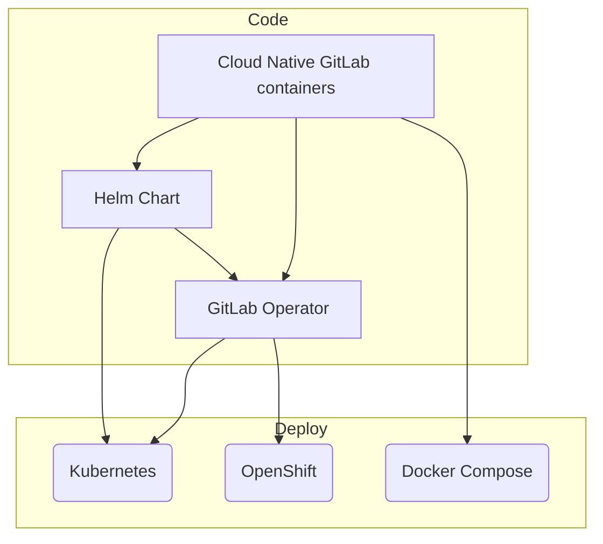

## Overview

The Distribution team is composed of two subgroups: **Distribution:Build** and **Distribution:Deploy**

Build team is focused on producing artifacts including system packages, container images, and related components like marketplace listings along with tooling required to create and maintain them.

Deploy team is focused on installation and upgrade mechanisms to ensure smooth deployments. This includes system integration, scripting, templating, and related configuration management tooling.

In addition to [product deliverables](https://gitlab.com/groups/gitlab-org/-/issues/?sort=created_date&state=opened&label_name%5B%5D=group%3A%3Adistribution&label_name%5B%5D=Deliverable&milestone_title=Any), both groups review a large number of MR's authored outside the team. These include dependency and security updates along with configuration controls and other bundled components like PostgreSQL, Consul, Patroni.

## Target Consumers

The primary user persona for Distribution are system administrators who are responsible for managing GitLab instances. Team goals are to make it as easy as possible to deploy, upgrade and configure GitLab on a range of on-prem and cloud platforms at a variety of scales.

Deployments include everything from single node deployments for evaluating GitLab all the way through the 50K user reference architecture and beyond. The primary goal is to ensure end users have a high-speed, low-friction experience when managing GitLab with limited downtime or sevice disruptions.

Omnibus packages, Helm Charts and Operators are primary deployment methods Distribution currently supports.

### Distribution Build

<!-- markdownlint-disable MD051 -->
[Team](#distribution-build-team)    |
[Charter](#distributionbuild-charter)

Responsibilities:

- Research for the support of new clouds, platforms, architecture, and components
- Access controls, permissions, and CVE patches
- Dependency updates
- License management
- Submissions to Partners for validations/certifications
- The [install](https://about.gitlab.com/install/), [update](https://about.gitlab.com/update/), and [upgrade](https://about.gitlab.com/upgrade/) pages
- Build and own the infrastructure used for creating the various installation methods
- [Maintaining infrastructure](#infrastructure-and-maintenance) used in Distribution

### Distribution Deploy

[Team](#distribution-deploy-team)
[Charter](#distributiondeploy-charter)
<!-- markdownlint-enable MD051 -->

Responsibilities:

- Initial installation and composability for self-managed installations and GitLab.com
- Upgrades / Downgrades
- Scaling deployments
- Migration between platforms or providers
- Data lifecycle management
- Secure configuration & communication
- Research of clouds and platforms for integration to existing tools

## Vision

Distribution team vision is shown below, and not limited to:

### Technology

- GitLab has an official installation method on all major platforms and architectures.
- GitLab offers official one click installation method on all major cloud platforms.
- GitLab is able to automatically upgrade itself safely and reliably.
- Official repositories for any Kubernetes package repository.
- GitLab runs equally well on both high and low resource systems (such as Raspberry Pi).
- GitLab.com is running using the official installation methods.
- All GitLab features are installed and configured by default.
- Installation interface to set up and configure GitLab.
- Any GitLab installation is able to report installation/upgrade errors automatically.
- Setting up GitLab in HA configuration is automated and simple.
- All installation methods are automatically tested before release.
- Most frequently used configuration options are tested using end-to-end integration tests.

### Team

- Each team member is able to work on all team projects along with the ability to focus on specific technologies.
- Each team member is a part of a hiring panel aimed to hire better than the best in the team.
- Team creates documentation to increase knowledge and awareness to support a self-service model.
- Team is able to reach a conclusion independently all the time, consensus most of the time.
- Team has official certifications for frequently used technologies and platforms.
- On-boarding and off-boarding is efficient.
- Career development paths are clear.

## Mission

Distribution ensures the experience of installing and maintaining GitLab is easy and safe for everyone. It is Distribution team's task to think about the widest variety of installation/update use-cases and provide a solution that will satisfy most needs. Distribution is there to provide the best possible experience for a user that is a novice but also a veteran when it comes to installing and maintaining software.

### Distribution:Build Charter

Build team focus is ensuring GitLab components are tested, current, license compliant, and available for our users' platforms and architectures. This group manages the build pipelines, researches support for new services, platforms, and architectures, as well as maintains existing ones. We strive to respond efficiently to build failures, security results, and dependency changes in order to ensure a safe reliable product for our users.

### Distribution:Deploy Charter

Deploy team focus is configuration, deployment, and operation of GitLab as a whole product. The goal is to deliver an intuitive, clear, and frictionless installation experience, followed by smooth, seamless upgrade and maintenance processes for deployments of any scale. We strive to deliver ongoing operational behaviors for scaling, little to zero downtime upgrades, and highly reliable experiences for not only instance administrators but their users.

## Goals

[Increase # of active installations](https://10az.online.tableau.com/#/site/gitlab/workbooks/2298821/views)

[Reduce average days behind latest version](https://10az.online.tableau.com/#/site/gitlab/views/VersionUpgradeMetrics/InstallationsonLatestVersionsofGitLab?:iid=1)

## Team members

### Distribution Build Team

The following people are members of the Distribution:Build Team:



### Distribution Deploy Team

The following people are members of the Distribution:Deploy Team:



### Stable counterparts

The following members of other functional teams are our [stable counterparts](/handbook/leadership/#stable-counterparts):



## Common links

- [Distribution team issue tracker](https://gitlab.com/gitlab-org/distribution/team-tasks)
- [Slack chat channel](https://gitlab.slack.com/archives/distribution)

## Team responsibility

In addition to the [separate responsibilities](#overview) for Build and Deploy. The Distribution team as a whole is responsible for:

1. The omnibus-gitlab installation package.
   - Installation using package is simple, quick, secure and protects the data integrity.
1. A cloud native installation method.
   - Installation using the Helm charts is able to scale easily with the increased demand.
1. [Triaging issues](triage.md) and [Reviewing Merge Requests](merge_requests.md) in all owned [projects](#all-projects).
1. Providing regular [demonstrations](demo.md) of recent solutions or works in progress

## Team objectives

Based on team responsibilities, the following objectives apply:

- Distribution:Build
  - Installation pages need to be complete, correct, easy, helpful, and attractive. Even if team's primary skill is not design and UX, team can maintain the pages with the help of teams that have this skill as their primary.
  - Nightly builds are installed on dev.gitlab.org using one of the official artifacts of the Distribution Build team. Purpose of this exercise is to have a production level instance using one of the installation methods that the community will be using.
- Distribution:Deploy
  - The omnibus-gitlab installation package and the cloud native installation method should allow a beginner to install GitLab quickly, correctly and completely. Required configuration should be minimal, and it is the Distribution Deploy team's responsibility to automate as much of this configuration as possible for the user.
  - The omnibus-gitlab installation package and the cloud native installation method should be sufficiently configurable to allow an advanced user a way of setting up a more complex GitLab architecture.
  - The above two goals might sound opposing, however they are not. A compromise can be made between these two goals without increasing the project maintenance cost for the Distribution team. We optimize for the best initial installation experience and then expand to further complexity.
- Distribution Common Objectives
  - Triaging issue tracker is a task that allows us to keep on the pulse of the changes we make. By being in contact with users and customers, we can maintain visibility into most frequently reported bugs or requested features. Not everything reported will be resolved, however _all_ of the reports should be triaged. This also applies to mentions in GitLab CE/EE repositories on issues with `Distribution` and `group::distribution` label.
  - Every Distribution team member is responsible for creating a training session for the rest of the team. See the page on [team training](training.md) for details.
  - When the team that manages GitLab.com creates an issue, the item should be raised up directly to the team Engineering Manager and Product Manager. While these issues are important, we don't necessarily need to provide a complete solution right away, but we need to work with the other team on providing a path forward with their request.

## Primary Projects

[omnibus-gitlab](https://gitlab.com/gitlab-org/omnibus-gitlab) - This project creates platform-specific, self-contained GitLab packages and images for self-managed consumption in cloud environments and on-premisis hosting.

[Cloud Native GitLab](https://gitlab.com/gitlab-org/build/CNG) provides cloud native containers to deploy GitLab. These containers may be deployed and managed via Helm using [GitLab Charts](https://gitlab.com/gitlab-org/charts/gitlab) or [GitLab Operator](https://gitlab.com/gitlab-org/cloud-native/gitlab-operator) on Kubernetes, OpenShift, and Kubernetes compatible container platforms.

### Omnibus GitLab project's product outputs

### Cloud Native GitLab project's product outputs

## All Projects

| Name | Location | Description |
| -------- | -------- | -------- |
| Omnibus GitLab | [gitlab-org/omnibus-gitlab](https://gitlab.com/gitlab-org/omnibus-gitlab) | Build Omnibus packages with HA support for LTS versions of all major Linux operating systems such as Ubuntu, Debian, CentOS/RHEL, OpenSUSE, SLES |
| Docker All in one GitLab image | [gitlab-org/omnibus-gitlab/docker](https://gitlab.com/gitlab-org/omnibus-gitlab/tree/master/docker) | Build Docker images for GitLab CE/EE based on the omnibus-gitlab package |
| GitLab Helm Chart | [gitlab-org/charts/gitlab](https://gitlab.com/gitlab-org/charts/gitlab) | Cloud Native GitLab Helm Charts |
| Docker images for GitLab Helm Chart | [gitlab-org/build/CNG](https://gitlab.com/gitlab-org/build/CNG) | Individual images used by GitLab Helm Charts |
| GitLab Operator | [gitlab-org/cloud-native/gitlab-operator](https://gitlab.com/gitlab-org/cloud-native/gitlab-operator) | The GitLab operator creates and manages GitLab instances/deployments in a container platform such as Openshift or Kubernetes. It will run an any environment that provides native Kubernetes resources including deployments, statefulsets, services, ingress/openshift routes, persistent volume claims, persistent volumes, etc. |
| Kubernetes Helm Charts index | [charts/charts.gitlab.io](https://gitlab.com/charts/charts.gitlab.io) | Helm charts repository index |
| AWS images | [AWS marketplace](https://aws.amazon.com/marketplace/pp/B071RFCJZK?qid=1493819387811&sr=0-1&ref_=srh_res_product_title) | AWS image based on the omnibus-gitlab package |
| Reference Architecture Tester | [gitlab-org/distribution/reference-architecture-tester](https://gitlab.com/gitlab-org/distribution/reference-architecture-tester) | Spins up reference architecture based GitLab deployments using [GET](https://gitlab.com/gitlab-org/gitlab-environment-toolkit) and runs QA against them |
| Omnibus GitLab Builder | [GitLab Omnibus Builder](https://gitlab.com/gitlab-org/gitlab-omnibus-builder) | Create environment containing build dependencies for the omnibus-gitlab package |
| Licenses of bundled dependencies | [Licenses page on GL Pages](https://gitlab-org.gitlab.io/omnibus-gitlab/licenses.html)  | Webpage listing the bundled dependencies in each package along with their license. |

## Working with the community

The install and upgrade process is one of the first features that systems administrators experience when working with GitLab.
As a result, the projects managed by the Distribution team have a high level of engagement by the user-base. The GitLab
community is made up of more than just code contributors; users logging issues and feature requests are constantly pushing
us forward and helping create a better experience.

In Distribution we strive for the following in our public projects:

1. Uphold our [Community Code of Conduct](https://about.gitlab.com/community/contribute/code-of-conduct/).
1. Enable [GitLab's mission that everyone can contribute.](/handbook/company/mission/#mission).
1. Show our work in [public](#public-by-default).
1. [Recognize and thank](/handbook/marketing/developer-relations/contributor-success/community-contributors-workflows/#recognition-for-contributors) contributors for their work.
1. Respect contributors donated time by providing [a timely review turnaround time](/handbook/engineering/workflow/code-review/#review-turnaround-time).

### Working with Open Source communities

The [open core of GitLab](/handbook/company/stewardship) is built on top of thousands of open source
dependencies. These dependencies and their communities are important to the [GitLab strategy](/handbook/company/strategy/#flywheel-with-two-turbos),
and working with these dependencies is an essential part of the projects the Distribution team maintains.

In Distribution we strive to:

1. Consider the impact of our work on the open source communities that we benefit from.
1. Promote the importance of these open source communities within GitLab.
1. Raise issue with any decision that goes against our [stewardship promises](/handbook/company/stewardship/#promises).
1. Find opportunities to [contribute back the changes we make](/handbook/engineering/open-source/#using-forks-in-your-code).

## Public by default

All work carried out by the Distribution team is public. Some exceptions apply:

- Work has possible security implications - If during the course of work security concerns are no longer valid, it is expected for this work to become public.
- Work is done with a third party - Only when a third party requests that the work is not public.
- Work has financial implications - Unless financial details can be omitted from the work.
- Work has legal implications - Unless legal details can be omitted from the work.

Some of the team work is carried out on our development server at `dev.gitlab.org`.
[Infrastructure overview document](https://docs.gitlab.com/omnibus/release/#infrastructure) lists the reasons.

Unless your work is related to the security, all other work is carried out in projects on `GitLab.com`.
If you need to submit a sensitive issue, please use confidential issues.

If you are unsure whether something needs to remain private, check with the team Engineering Manager.

## YouTube Playlists

The team regularly publishes demos, discussions and meetings to these playlists:

- [Distribution Team Demos](https://www.youtube.com/playlist?list=PL05JrBw4t0KrPasGZcEUoHHIYdUtzpfA4) (Public) More on [team demos](demo.md).
- [Distribution Team Discussions](https://www.youtube.com/playlist?list=PL05JrBw4t0KotcsilVcbCc1NBXUmWqEWy) (Mostly public, but some private content)
- [Distribution Team Meetings](https://www.youtube.com/playlist?list=PL05JrBw4t0KoigLGkdYj9x2erU2NC24ij) (Private)

## Onboarding and offboarding

In addition to general company on-boarding and off-boarding, Distribution team
has its own process to get new team members up to speed more quickly.

If you are starting with your onboarding, open an issue in [Distribution team issue tracker](https://gitlab.com/gitlab-org/distribution/team-tasks), select `Team-onboarding` template and assign the issue to yourself.

Going through the steps noted in the issue should be your top priority, higher
than the general company on-boarding issue. This is because items in team on-boarding are specific to your role and it will allow you to get up-to-speed quicker.

Off-boarding should be carried out by the Engineering Manager of the team,
using the appropriate issue template in the same issue tracker.

## Work Resources

General resources available to developers are listed in the
[Sandbox cloud page](/handbook/company/infrastructure-standards/realms/sandbox/).

In the Distribution team specifically, everyone should have access to the
following resources:

- Google projects in [Google Cloud Platform](https://console.cloud.google.com/)
  - `testground`
  - `cloud-native`
  - `omnibus-build-runners`
- AWS build infrastructure
  - Distribution group AWS sandbox account
  - `cloud-native` EKS cluster for CI (requires a maintainer to [grant access](https://stackoverflow.com/questions/59987859/kubectl-error-you-must-be-logged-in-to-the-server-unauthorized/59991446#59991446))
  - [GitLabTop account](https://gitlab-top.signin.aws.amazon.com/console) (To be retired, existing team members only)

If you don't have access to any of these resources, create an
[Access Request](https://gitlab.com/gitlab-com/team-member-epics/access-requests/-/issues) and
assign it to your manager for approval.

## Infrastructure and maintenance

As part of the team responsibilities, team owns maintenance of infrastructure
used for day to day work.
For list of nodes and description of the maintenance tasks, see the
[infastructure and maintenance](maintenance/) page.

## Team workflows

General [engineering workflow](/handbook/engineering/workflow/) applies
to the Distribution team. Since Distribution is working across multiple projects, our team workflow
is further explained and summarized on the [Distribution workflow page](workflow.html).

### Further reading

The following important areas of the GitLab Handbook impact how we work and are worth reading.

- [Distribution workflow page](workflow.html)
- [General engineering workflow page](/handbook/engineering/workflow/)
- [How to reinforce our values](/handbook/values/#how-do-we-reinforce-our-values)
- [Continue to serve smaller users](https://internal.gitlab.com/handbook/leadership/mitigating-concerns/#serve-smaller-users) (internal only)
- [Promises to our Open Source community](/handbook/company/stewardship/#promises)
- [How to follow our Product Principles](/handbook/product/product-principles/#how-we-follow-our-principles)
- [Principles of our company strategy](/handbook/company/strategy/#principles)
- [Effective & Responsible Communication Guidelines](/handbook/communication/#effective--responsible-communication-guidelines)
- [Test Platform in Distribution group](/handbook/engineering/testing/distribution/)

## Work/life harmony

Working [all-remote](/handbook/company/culture/all-remote/) and [asynchronous first](/handbook/company/culture/all-remote/asynchronous/)
offer flexibility in how team members approach their workday. Team members must make choices on how best to balance work time with other areas of life.

For new team members, the following resources provide examples on how to focus their time:

- [How team members approach their day](https://gitlab.com/gitlab-org/distribution/team-tasks/-/issues/907)
- Blog post: [A day in life of a remote worker](https://about.gitlab.com/blog/2019/06/18/day-in-the-life-remote-worker/)
- The option of a [non-linear workday](/handbook/company/culture/all-remote/non-linear-workday/)
- GitLab handbook: [Work/life Harmony](/handbook/company/culture/all-remote/people/#worklife-harmony)

The following GitLab Handbook areas are key in maintaining a healthy work/life balance.

- [Family and Friends First, work second](/handbook/values/#family-and-friends-first-work-second)
- [Combating burnout, isolation, and anxiety in the remote workplace](/handbook/company/culture/all-remote/mental-health/)
- [Recognizing Burnout](/handbook/people-group/paid-time-off/#recognizing-burnout)

## How to work with Distribution

Everything that is done in GitLab will end up in the supported installation methods
that are distributed to users. While that sounds like the last link in the chain, it is one of the
most important ones. This means that informing the Distribution team of a change in an
early stage is crucial for releasing your feature. While last minute changes are
inevitable and can happen, we should strive to avoid them.

We expect every team to reach out to the Distribution team before scheduling a feature
in an upcoming release in the following cases:

- Reach out to Distribution Build when:
  - The change requires a new or an update on a gem with native extensions.
  - The change requires a new or updated external software dependency.
    - Also when the external dependency has its own external dependencies.
- Reach out to Distribution Deploy when:
  - The change adds, modifies, or removes files that should be managed by omnibus-gitlab. For example:
    - The change introduces new directories in the package.
    - The change introduces new files in previously not defined locations
  - The change requires a new configuration file.
  - The change requires a change in a previously established configuration.

To sum up the above list:

If you need to do `install`, `update`, `make`, `mkdir`, `mv`, `cp`, `chown`,
`chmod`, do compilation or configuration change in any part of GitLab stack, you
need to reach out to the Distribution team for opinion as early as possible.

This will allow us to schedule appropriately the changes (if any) we have to make
to the packages.

If a change is reported late in the release cycle or not reported at all,
your feature/change might not be shipped within the release.

If you have any doubt whether your change will have an impact on the Distribution team,
don't hesitate to ping us in your issue and we'll gladly help.

### Requesting a new component or replacing a component

Create a [Deliverables Request](https://gitlab.com/gitlab-org/distribution/team-tasks/-/issues/new?issuable_template=Architectural-Deliverables-Request)
in the Distribution team [issue tracker].

### Requesting feedback on a feature change

For requesting feedback you can ping `@gitlab-org/distribution` in your issue or merge request.

When looking for a Distribution reviewer for a merge request you should use the process outlined in our
[merge request workflow](merge_requests.html#workflow) for [projects owned by the Distribution team](#all-projects). For
changes that need Distribution review outside those projects, please ping `@gitlab-org/distribution` in the merge
request.

## Engaging Distribution for expertise in support

GitLab provides a unified process to open a request for help (RFP) to support customers. This process
is in place to ensure we have a single source of truth for those, so that we better
collaborate cross-functionally as, many times, the requests actually require expertize
of multiple areas of the product, or is not initially clear which area is more suitable
to support the customer. When sharing the information with multiple relevant groups, within the
same support request process, we're able to get to a solution much more efficiently.

To open an RFP, refer to the procedures of our
[how to get help](/handbook/support/workflows/how-to-get-help.md)
handbook page.

This process allows us to track time involved
and ensure that the right parties are involved at the correct time.

## Trivia

How did Distribution get its name? We iterated, as always. "Distribution" was chosen as better than "Install" when renaming the original "Build" team, [live on an AMA](https://www.youtube.com/watch?v=gSyAFN6LPHU) with our co-founder, Sid. Since then we have [iterated further](https://gitlab.com/gitlab-org/distribution/team-tasks/-/issues/936) in order to grow the team, and now have subgroups for "Build" and "Deploy".

## Dashboards


  



  



  



  

