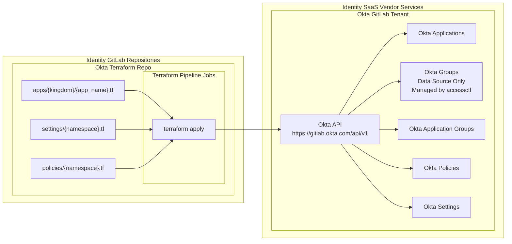

{}
You are viewing a preview of documentation for the future state of GitLab Identity v3 (mid 2024). See the <a href="/handbook/security/security-and-technology-policies/access-management-policy/">Access Management Policy</a> for the GitLab Identity v2 current state with baseline entitlements and access requests. See the roadmap in the <a href="https://gitlab.com/groups/gitlab-com/gl-security/identity/eng/-/roadmap?state=all&sort=start_date_asc&layout=QUARTERS&timeframe_range_type=THREE_YEARS&group_path=gitlab-com/gl-security/identity/eng&progress=WEIGHT&show_progress=true&show_milestones=false&milestones_type=ALL&show_labels=true">epics gantt chart</a>.
{}

{}
This page is specific to the Okta backend configuration. You may also be interested in the <a href="/handbook/security/identity/platform/provisioning/okta">Okta group and user provisioning</a> documentation, <a href="/handbook/security/identity/guide/app">Tech Stack application user guide</a> and <a href="/handbook/security/identity/approvals">merge request approvals</a> documentation.
{}

## Terraform Architecture

The Okta repository is used for managing any configuration that can be performed in the Admin UI. This moves all day-to-day administrative actions and global configuration into state management with MR approval rules and CI/CD automation.

## Okta Policies and Settings Configuration

The global settings and policies are managed in respective folders that are managed by the Identity kingdom.

| Configuration File        | CODEOWNERS                                    |
|---------------------------|-----------------------------------------------|
| `admins/{handle}.tf`      | `sec_identity_ops`                            |
| `policies/{namespace}.tf` | (2 Approvals) `sec_identity_ops` `sec_leader` |
| `settings/{namespace}.tf` | (2 Approvals) `sec_identity_ops` `sec_leader` |

## Applications and Assigned Groups

GitLab's tech stack has hundreds of applications that are managed by a variety of business owners and technical owners.

The `apps` directory has a nested directory structure based on our [Identity Kingdoms](/handbook/security/identity/kingdoms) to accommodate different compliance requirements. Each application that the Kingdom owns has it's own file that specifies the application configuration and the Okta groups that are assigned to the application.

| Configuration File                  | CODEOWNERS                                                |
|-------------------------------------|-----------------------------------------------------------|
| `apps/identity/{app_name}.tf`       | `sec_identity_eng`                                        |
| `apps/business_sox/{app_name}.tf`   | `it_ops_leader`                                           |
| `apps/business_stack/{app_name}.tf` | Per-file based on tech stack business and technical owner |
| `apps/product_ded/{app_name}.tf`    | Per-file based on tech stack business and technical owner |
| `apps/product_dev/{app_name}.tf`    | Per-file based on tech stack business and technical owner |
| `apps/product_prd/{app_name}.tf`    | Per-file based on tech stack business and technical owner |
| `apps/sandbox/{app_name}.tf`        | Per-file based on requester or service account owner.     |
| `apps/services/{app_name}.tf`       | Per-file based on requester or service account owner.     |

### Approval Rules

The configuration is broken into separate files based on the settings namespace or the kingdom that controls the specific resources.

We use `CODEOWNERS` for GitLab merge request (MR) approval rules to specify which Business Owner(s) and Technical Owner(s) can provide approval for changes to any given folder or file that contains configuration.

Since Okta groups and user memberships are managed outside of Terraform, the changes to state management are far and few between which simplifies auditability.

Learn more in the [merge request approvals](/handbook/security/identity/approvals) documentation.

### Application Users

We do not attach individually named users to applications. All users are assigned to groups and groups are assigned to applications.

You can attach three different categories of groups to applications:

1. **Type (`rbac_type_*` Group)** This lets you attach a category of users (ex. employees, contractors, etc). At GitLab, we use the [access level wristband color](https://internal.gitlab.com/handbook/it/it-self-service/access-level-wristband-colors/) so access can be mass assigned to all `blue`, `purple`, `brown`, and `black` users.

1. **Identity Role (`rbac_role_*` Group):** This lets you attach users based on the functional team that they are on, usually specific to a job title and/or manager.

1. **Identity Organizational Unit (`rbac_ou_*` Group):** This lets you attach users that belong to a department, sub-department or other functional area with multiple inherited Identity Roles or other rulesets.

All groups and user assignments are managed by `accessctl` and user memberships are synced via Okta API with the existing Okta groups that match the names for each `rbac_type_*`, `rbac_role_*`, or `rbac_group_*` groups.

This provides separation of duties and control plane separation between "who is a member of which group" and "which groups are allowed to access each application". This prevents `accessctl` control plane from attaching or detaching groups from applications, and requires the application owner to configure and/or approve those changes in the application's Terraform configuration.

### Automated Groups

When the scheduled background jobs run, `accessctl` will calculate the `rbac_type` and `rbac_role` for each user based on the policy rulesets that are managed by the Identity team, and sync the user list with the existing Okta groups for each `rbac_type` and `rbac_role`.

With predefined groups for each type of user and each job role, it is easy for application owners to "hard code" which roles have access to the applications for a "set it and forget it" configuration without managing user access requests day-to-day, while ensuring change management compliance.

Since the `rbac_role` policies are centrally and stringently managed by Identity team, this avoids the potential for teams or managers to create new groups that are arbitrarily or dynamically updated with additional users that should not have access.

### Dynamic Policy Organization Unit Groups

An **organization unit group** can be used for departments, sub-departments, teams, or any other larger grouping of user that consists of **two of more roles**. Organization unit groups are managed by division and department leaders or people managers to help centrally manage and group functional areas together.

With an organization unit group, you can specify one or more roles, one or more user attributes, or specific user handles (useful for cross-functional users). To prevent recursive complexity, you cannot attach other organization unit groups. This simplifies maintenance since you can centrally manage each organization unit and don't need to maintain a list of roles in multiple places for each application.

### Assigning Roles and Groups

Although organization units are managed with policies, there are a large number of contributors that may not fully understand the compliance and role-based access control implications for the systems that users can access.

For applications with strong permission or compliance requirements, application owners should only use the "trusted" `rbac_type` or `rbac_role` groups. For applications that are less stringent and are considered "mass assignable", organization unit groups are easier to maintain.

You can use a combination of `rbac_role_*` and `role_ou_*` groups as needed in the Terraform configuration.

Once you have defined the groups, the application owner does not need to handle day-to-day access requests since all access is automated. The only exception is if the system requires additional permissions to be granted inside the application once the user has signed in. We will consider iterating on this in the future on a system-by-system basis with the concept of Identity Blueprints which are provisioning scripts that use each vendor's API to grant access to specific resources.

### Access Requests

If additional users need access, there are several approaches:

1. The user's attributes **match the existing criteria** of a role or organization unit that has already been attached to the Okta application. Access is automatically granted without a request.

1. The **organization unit group** policy `CODEOWNER` (ex. division leader or department manager or Executive Business Assistant) can update the policy in `accessctl` to include the additional role. The manifest of users for the organization unit is automatically recalculated and the users will be added to the organization unit Okta group that has already been attached to the application.

1. The application CODEOWNER can add the additional **role group** to the application using Terraform.

This provides improved maintenance since the division and department leaders or their delegate (ex. Executive Business Administrator) centrally manage the policies for organization unit groups and which roles are members.

Since the *users* that are attached to each group are managed by `accessctl` policies and REST API calls (not Terraform), the changes to Terraform state management are far and few between which simplifies auditability.

## Administrative User Access

### Day-to-Day Administrator Access

Our Identity Engineering and Operations Okta system administrators and designated team members in IT and Security have `Read Only Administrator` role. They can request a temporary elevated (not Super Admin) role for break glass configuration changes using `accessctl`, however most changes will be performed in a Terraform MR.

### Super Administrator (Root) Access

We have two super administrator user accounts that are an additional separate user account that is not managed in the centralized control plane that provides back door administrative access. These credentials are secured out-of-band in a vault that requires declaring an incident and requires Identity team two person rule approval to get access to ensure compliance.

We have additional security measures in place for these accounts:

- IP Address access control list (ACL) restricted to VPN known gateway addresses
- All audit logs for the super administrator event log actions (similar to key logger) are exported by default to our centralized logging system. We also programmatically parse all logs and add them the incident issue comment for transparency.
- After each break glass incident, the password is rotated automatically to ensure that credentials on the user's machine are no longer usable.

Additional details are intentionally obscured for security risk reasons.
