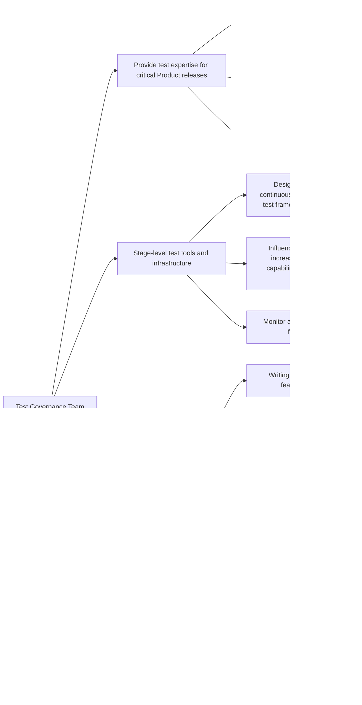

## Common Links

| **Category**            | **Handle**                                                                                      |
|-------------------------|-------------------------------------------------------------------------------------------------|
| **GitLab Group Handle** | [`@gl-dx/test-governance`](https://gitlab.com/gl-dx/test-governance)                            |
| **Slack Channel**       | [`#g_test-governance`](https://gitlab.enterprise.slack.com/archives/C064M4S0FU5)                |
| **Slack Handle**        | `@dx-development-analytics`                                                                     |
| **Team Boards**         |                                                                                                 |
| **Issue Tracker**       | [`tracker`](https://gitlab.com/groups/gitlab-org/developer-experience/test-governance/-/issues) |
| **GitLab Repositories** | [test-governance](https://gitlab.com/gitlab-org/developer-experience/test-governance)           |

## Mission

## Vision

## Team members



## Core Responsibilities

## Roadmap

## How we work

### Work related rituals

### Work management

#### Planning

#### Working with us through request for help

The Test Governance group aims to better enable teams to apply the principle that [quality is everyone's responsibility](/handbook/engineering/development/principles/#quality).
Please request all support via the RFH process below. This will allow us to prioritize requests against our planned project roadmap. 
Please use the following Request for Help process for all support requests.

#### Request for Help Process

1. Creates an issue in the [Request for Help](https://gitlab.com/gitlab-org/quality/test-governance/request-for-help#step-1-create-a-new-issue) project. Please complete all sections of the template so we can quickly triage your request
1. The Test Governance team will triage the request within a week, adding appropriate labels and assigning team members based on the request type and priority. Yu will recieve details about the prioritization and next steps on the request for help issue.

For more detailed guidance on E2E test coverage, consider these approaches:

* Engage with key DRIs to define [persona](/handbook/product/personas) use cases that illustrate how different customers will use new features
* Evaluate which parts of use cases can be covered by lower-level tests versus E2E tests, keeping the entire [testing pyramid](https://docs.gitlab.com/ee/development/testing_guide/testing_levels.html) in mind
* Refer to our documentation on [Testing Best Practices](https://docs.gitlab.com/development/testing_guide/end_to_end/best_practices) before submitting your request
