

[[_TOC_]]

## Glossary

| Term | Definition |
|------|------------|
| GPT | GitLab Performance Toolkit |
| Real world scenario | **Environment replicating production with representative data** |
| Component | Standalone element of GitLab architecture (e.g. Gitaly, AI Gateway etc.) |

## Executive Summary

This blueprint outlines a comprehensive approach to implementing component-level performance testing at GitLab, enabling teams to detect performance issues earlier in the development lifecycle ("shift-left"). The approach leverages containerization and automated testing to provide insights on individual component performance metrics as well as providing immediate feedback on performance impacts of code changes at the Merge Request level.

### Component Testing Tool Architecture

```mermaid
flowchart TD
    %% Force vertical arrangement with a clearer structure

    %% Component Repository
    subgraph CR["Component Repository"]
        repoStructure["Required Directory Structure:<br/>performance-test/<br/>├── k6-test/ (test files)<br/>└── setup/ (docker-compose.yml)"]:::highlight

        A1[Developer MR]
        A2[MR Pipeline Triggered on Commit]
        A3[dotenv-vars Job]
        A4[tests:performance Job]

        A1 --> A2 --> A3 --> A4

        note1[Saves test file and setup<br/>file as artifacts]:::note
        A3 --- note1
    end

    %% Connection point - this must be outside both subgraphs
    A4 --->|"Trigger Multi-Project Pipeline"| B

    %% Component Performance Test Tool Pipeline
    subgraph CPTT["Component Performance Test Tool Pipeline"]
        B[CPT Pipeline Job]
        C["☁️ GCP instance:<br/>Component Container"]
        D["⚡ Test Runner (K6)"]
        E["🗃️ InfluxDB"]
        F["📊 Performance Report"]
        G["📈 Baseline"]
        I["📉 Grafana Dashboard"]

        B -->|"Spins up"| C
        B -->|"Spins up"| D
        D -->|"Execute Tests"| C
        D -->|"Collect Metrics"| E
        B -->|"Generate"| F
        F -->|"Compare with"| G
        E -->|"Visualize"| I
    end

    %% Results feedback loop - must be drawn last
    F -->|"Post/Update result as comment to MR"| A1

    %% Style definitions
    classDef componentRepo fill:#f9f9f9,stroke:#fc6d26,stroke-width:2px;
    classDef cptTool fill:#f0f0ff,stroke:#4285f4,stroke-width:2px;
    classDef note fill:#ffffcc,stroke:#999,stroke-width:1px,stroke-dasharray: 5 5;
    classDef highlight fill:#e6f7ff,stroke:#1890ff,stroke-width:2px;
    %% Dark theme compatible subgraph titles
    classDef subgraphTitle fill:#f9f9f9,stroke:#fc6d26,stroke-width:2px,color:#333333;
    classDef cptTitle fill:#f0f0ff,stroke:#4285f4,stroke-width:2px,color:#333333;

    class A1,A2,A3,A4 componentRepo;
    class B,C,D,E,F,G,I cptTool;
    class note1,repoStructure note;
    class CR subgraphTitle;
    class CPTT cptTitle;
```



## Problem Statement

Currently, performance testing in GitLab primarily relies on the GitLab Performance Tool (GPT) running against self-managed instances following reference architectures.

While comprehensive, this approach has significant limitations:

1. **Delayed Detection**: Performance issues often emerge only after MR has been merged
2. **Extended Setup Time:** Environment and data preparation requires approximately 2 hours before testing
3. **Resource Intensive**: Full instance testing demands significant computational resources
4. **Limited Isolation**: Difficult in attributing performance issues to specific components
5. **Delayed Feedback**: Teams must review numerous MRs to identify performance regressions
6. **Limited Component Visibility:** Lack of granular insights into individual component performance
7. **Test Ownership Misalignment:** Tests primarily developed by Dev Ex rather than component teams
8. **Operational Overhead**: Requires dedicated performance on-call rotations

Component-level performance testing addresses these challenges through isolated testing, accelerated feedback loops, and targeted performance analysis.

## Goal

Develop a self-service performance testing framework that component teams can integrate to gain insights into individual component performance and detect [some](#limitation-of-component-performance-testing-tool) performance issues early in the development lifecycle.

## Responsibilities

<table>
<tr>
<th>Team and roles</th>
<th>Responsibilities</th>
<th>Location</th>
</tr>
<tr>
<td>

Performance Enablement

* Owner

</td>
<td>

* Maintains the core framework
* Regularly updates to testing tools and infrastructure
* Applies security patches and dependency updates to the framework
* Maintains comprehensive documentation
* Provides training for new teams to onboard
* Shares best practices and lessons learned
* Acts on any feedback provided by the respective component teams
* Updates the framework to provide proper performance insights to various component teams

</td>
<td>Component Performance Testing Tool repository</td>
</tr>
<tr>
<td>

Respective Component Teams

* Owner

</td>
<td>

* Ensures the component meets the [pre-requisites](#prerequisites-to-use-the-tool) for adding component level performance test
* Ensures any new feature of the component meets the [pre-requisites](#prerequisites-to-use-the-tool) for adding component level performance test
* Maintains their specific performance test scenarios
* Constantly monitors the performance of their component
* Grows the test suite by adding more performance related tests
* Update tests as the component interfaces changes
* Monitors the performance on each MR runs and updates the MR accordingly to gain the right performance
* Adjusts thresholds in tests based on performance requirement
* Updates the component setup as the configuration of the component changes

</td>
<td>Respective Component repository</td>
</tr>
</table>

## Limitation of Component Performance Testing tool

Component performance testing cannot detect issues related to:

* **Integration Bottlenecks**: Performance problems emerging from component interaction
* **Data volume scaling problems**: Degradation occurring only with production-scale data
* **Network latency effects**: End-to-end latency issues not apparent in isolated testing
* **Cascading failures**: System-wide issues triggered by component interdependencies
* etc.

Lets say, any issues that may arise due to huge data or production environment like setup, would not be caught by component performance testing.

The tool focuses on identifying:

* **Throughput bottlenecks**: Component-specific request handling limitations
* **Caching effectiveness**: Performance impact of component-specific caching strategies
* **Error handling overhead**: Performance degradation caused by excessive or inefficient error handling
* **Configuration-related performance issues**: Suboptimal component configuration settings
* **Serialization/deserialization overhead**: Data transformation inefficiencies
* etc.

GPT testing will continue on current schedules to maintain comprehensive real-world scenario coverage.

## Approach

Implement component-level performance testing at the MR level to identify performance regressions before production deployment.

Components meeting the [pre-requisites](#prerequisites-to-use-the-tool) can integrate this tool in their CI Pipeline

Component-specific `docker-setup.yml` and `k6-test.js` files would be residing in the component repository, managed by the development teams. The tool will spin up the containerized component and execute Grafana K6 tests against it in a controlled setup.

## Prerequisites to use the tool

Components should have the following capabilities before starting to use the tool

* Containerization Support: Dockerized implementation deployable in isolation
* API/ Interface capability: Exposed interfaces using [one of the protocol supported](https://grafana.com/docs/k6/latest/using-k6/protocols/) by GrafanaLabs K6
* Mocking/Isolated Testing Capability: Testable in isolation or with interface mocking
* Metrics Collection: Clear point for collecting performance metrics (endpoints, methods, etc.)

## Tool Implementation Challenges

The following points represent challenges that may be faced while implementing the tool

1. **Environment Isolation**: Managing component dependencies in isolated testing
2. **Test and Setup Orchestration:** Maintaining separation between tool orchestration and component-specific files
3. **Test Data Variability**: Ensuring consistent performance metrics across test data
4. **Resource Management**: **Efficiently allocating resources for MR-level testing**
5. **Metrics Collection**: Gathering and analyzing performance metrics from containerized components
6. **Baseline Comparison**: Establishing reliable performance baselines for comparison
7. **Integration with CI/CD**: Seamless integration with existing CI/CD pipelines
8. **Reporting Limitations:** Extending beyond standard [K6 reporting](https://grafana.com/docs/k6/latest/get-started/results-output/#end-of-test-summary) capabilities
9. **Tool Generalization**: Balancing component-specific needs with framework standardization

## Self Service Challenges

Adoption challenges include:

* Components lacking [pre-requisites](#prerequisites-to-use-the-tool) capabilities
* Team bandwidth constraints for test development
* Additional maintenance of environment setup and test scripts for developers
* Learning curve for K6 test developlment
* Competing priorities and deadlines

## Implementation Approach

### Phase 1: PoC, Gathering Requirements and Identifying component

1. Identifying Component for PoC
   1. Identify component which satisfies [pre-requisites to use the tool](#prerequisites-to-use-the-tool)
   2. Gather performance requirements from the stakeholder groups
2. Proof Of Concept
   1. Develop basic K6 test implementation for MR-level testing

### Phase 2: Core Infrastructure, Framework Setup & Pilot

1. **Component Testing Framework**
   * Create a reusable framework for component-level performance testing
   * Support containerized component deployment using Docker/Docker Compose
   * Implement secure credential management (git-crypt)
   * Configure test runners with appropriate resources
2. **Testing Tools Integration**
   * Integrate k6 for HTTP-based performance testing
   * Configure xk6 extensions for enhanced metrics collection
   * Implement telegraf for container metrics collection
   * Set up InfluxDB for metrics storage
3. **CI/CD Integration**
   * Implement MR pipeline integration
   * Configure performance report generation
   * Establish MR feedback mechanisms
4. **Metrics & Visualization**
   * Define key performance metrics for components
   * Develop Grafana dashboards
   * Implement trend analysis for long-term monitoring
5. **Pilot Component Selection**
   * Select initial component for pilot (e.g., AI Gateway)
   * Document component-specific requirements
   * Implement component-specific test scenarios

### Phase 3: Pilot, Gather Feedback and Enhace tools

1. **Test Scenario Development**
   * Add more tests to ai-assist repository
2. **Feedback Collection**
   * Gather feedback from ai-assist team
   * Refine testing approach based on feedback
   * Document lessons learned
3. Tool Enahancement
   * Create CI templates for component performance testing
   * Compare test results with runs on main branch
   * Create main branch baselines for the component
   * Document baseline performance
   * Implement automatic baseline updates

### Phase 4: Expansion & Refinement

1. **Additional Component Onboarding**
   * Identify next components for onboarding by getting in touch with Support and knowing which component lags in performance
   * Provide onboarding documentation
   * Understand setup of component and kickstart the team by adding 1 test for their component
2. **Framework Enhancements**
   * Implement multi-component testing capabilities
   * Enhance reporting and visualization
   * Optimize resource utilization
3. **Documentation & Self-Service**
   * Create comprehensive documentation
   * Implement self-service onboarding
   * Provide templates and examples

## Technical Implementation Details

### Tech Stack

* **GitLab CI**: Used for triggering multi project pipeline
* **Google Cloud Platform**: Used to run docker container of a component in a GCP instance as well as to run test scripts from a separate GCP instance
* **Docker**: Running Dockerized container on GCP instances
* **Ruby**: Massaging report to create leaner report
* **Bash Scripts**: Run gcloud commands to create various GCP resources
* **Telegraf**: Send metrics to InfluxDB
* **InfluxDB**: Store metrics in buckets
* **Grafana**: Create dashboard using metrics in InfluxDB.

### Architectural flow

The flow mentioned in [architecture diagram](#component-testing-tool-architecture) can be explained as follows

* The component repository contains the component setup file in the form of `performance-tests/setup/docker-compose.yml` and the `performance-tests/k6-test/test-file.js`
* The `.gitlab-ci.yml` file should include the performance testing job as shown in the projects [README](https://gitlab.com/gitlab-org/quality/component-performance-testing/-/tree/main?ref_type=heads).
* When a MR is created or a commit has been pushed to an existing MR, it would run the following jobs
  * `dotenv-var` job: stores the `performance-test` directory as artifacts and also stores some `dotenv` vars
  * `tests:performance` job: This triggers the downstream multi-project pipeline while passing some env vars
* The downstream multi-project pipeline gets triggered in [Component performance testing tool](https://gitlab.com/gitlab-org/quality/component-performance-testing/-/pipelines) project which does the following
  * Download artifacts saved by `dotenv-var` upstream job and performs some validation on the `docker-compose.yml` and `test-file.js` gfiles
  * Creates a GCP instance, downloads few dependencies and spins up the component using docker container
    * Sends container metrics to InfluxDB
  * Creates a GCP instance, downloads few dependencies and spins up a test runner container which runs the tests against the component docker container running on the other GCP instance
    * Sends test run metrics to InfluxDB
  * Extracts the test results and creates a leaner test report
  * Posts a comment on the MR with the test result or updates an existing comment with the updated result
* Developer can see the performance test results as a comment in their MR

### MR cycle time impact

The current performance testing job in ai-assist takes [~10 mins](https://gitlab.com/gitlab-org/quality/component-performance-testing/-/pipelines/1742959393) to finish. So this has increased the MR cycle time by 10mins. Bear in mind that each performance test runs for 1 min, so the more tests we add the more time it would take for the job to run.

However, following can be optimized to bring the timing down in case it is required.

* installing dependencies
* running sequential tests

### Metrics and Dashboard

[Telegraf](https://www.influxdata.com/time-series-platform/telegraf/) is used to send following metrics to influxDB

* Docker container metrics (CPU, Mem etc)
* Docker Logs

[xk6-output-influxdb](https://github.com/grafana/xk6-output-influxdb) is used to send [test summary metrics](https://grafana.com/docs/k6/latest/get-started/results-output/#end-of-test-summary) of the k6 test container to influxDB.

Following metrics to be gathered as part of the tool setup

1. **Test Execution Specific Metrics**:
   * Response time (min, max, p95, p99)
   * Throughput (requests per second)
   * Error rate
   * Custom component metrics
   * Test duration
   * Setup time
   * Teardown time
2. **Resource Utilization Metrics from Component**:
   * CPU usage
   * Memory consumption
   * Network I/O
   * Disk I/O
3. **Pipeline Metrics**:
   * Job ID
   * SHA Commit

Grafana will be used to create dashboards using the metrics stored in InfluxDB.

### Reporting

k6 by default generates [test summary metrics](https://grafana.com/docs/k6/latest/get-started/results-output/#end-of-test-summary) which is ingested by the tool and a much more leaner reporting is created that is posted in MR as a comment by a bot. The example of the report will be

```text
+---------------------+-----+--------------+----------+----------------+------------+--------+
| NAME                | RPS | RPS RESULT   | TTFB AVG | TTFB P90       | REQ STATUS | RESULT |
+---------------------+-----+--------------+----------+----------------+------------+--------+
| v2_code_completions | 2   | 1.97 (> 2/s) | 11.77    | 15.47 (< 25ms) | 100%       | Passed |
+---------------------+-----+--------------+----------+----------------+------------+--------+
```

This pipeline will also run on main branch of the respective component repository, which will be considered as a baseline for performance results. Future iteration will involve comparing the test results generated in MRs and providing variance as a results.

### Data Storage & Analysis

1. **Time-Series Data**:
   * Store performance metrics in InfluxDB
   * Tag data with relevant metadata (commit SHA, environment, test type)
   * Set appropriate retention policies
2. **Baseline Management**:
   * Store baselines in both InfluxDB and JSON files
   * Update baselines automatically based on statistical analysis
   * Support version-specific baselines
3. **Report Generation**:
   * Generate comprehensive JSON reports
   * Create summarized reports for MR comments
   * Provide links to detailed dashboards

## Rollout Strategy

<table>
<tr>
<th>Financial Quarter</th>
<th>Task</th>
</tr>
<tr>
<td rowspan="8">

`FY26::Q1`
</td>
<td>

Identify component which satisfies [pre-requisites to use the tool](#prerequisites-to-use-the-tool)
</td>
</tr>
<tr>
<td>

Create a POC demonstrating the component performance testing in action for AI Gateway

* https://gitlab.com/gitlab-org/quality/quality-engineering/team-tasks/-/issues/3339

</td>
</tr>
<tr>
<td>

Gather performance requirements from AI Framework group and AI Model validation group

* https://gitlab.com/gitlab-org/quality/quality-engineering/team-tasks/-/issues/3310

</td>
</tr>
<tr>
<td>

Create a reusable basic framework for component-level performance testing

* Support containerized component deployment using Docker/Docker Compose
* Implement secure credential management (git-crypt)
* Generate a lean report which is posted as a comment in MRs

</td>
</tr>
<tr>
<td>

Create a `tests:performance` job in ai assist which leverages the component performance testing framework and runs the job on each MR pipeline with a single tests for code completion.
</td>
</tr>
<tr>
<td>

Gather feedback from ai-assist team to improve the framework and optimize their `tests:performance` job.
</td>
</tr>
<tr>
<td>Create basic documentation for ai-assist team</td>
</tr>
<tr>
<td>Pilot this framework in ai-assist team</td>
</tr>
<tr>
<td rowspan="8">

`FY26::Q2`
</td>
<td>Add additional performance tests to ai-assist repository</td>
</tr>
<tr>
<td>Plan for onboarding second component(Gitaly)</td>
</tr>
<tr>
<td>Improve the stability of the performance testing</td>
</tr>
<tr>
<td>Continue gathering feedback from the team</td>
</tr>
<tr>
<td>Develop dashboards in Grafana for performance metrics visualization</td>
</tr>
<tr>
<td>Enhance the framework by improving its generalizability</td>
</tr>
<tr>
<td>Enhance the framework based on collected feedback</td>
</tr>
<tr>
<td>Investigate performance-related support issues to identify the next suitable component for framework adoption</td>
</tr>
<tr>
<td rowspan="5">

`FY26::Q3`
</td>
<td>Begin onboarding a second component(Gitaly)</td>
</tr>
<tr>
<td>Enhance onboarding documentation</td>
</tr>
<tr>
<td>Tracking adoption and effectiveness through Grafana dashboards</td>
</tr>
<tr>
<td>

Collaborate with the development team to ensure the new component meets the [pre-requisites for onboarding](#prerequisites-to-use-the-tool).
</td>
</tr>
<tr>
<td>Perform framework maintenance as needed</td>
</tr>
<tr>
<td rowspan="6">

`FY26::Q4`
</td>
<td>Integrate the framework by creating jobs in the new component repository that leverage the framework for MR testing</td>
</tr>
<tr>
<td>Enhance the framework to accommodate specific component needs while maintaining generalizability</td>
</tr>
<tr>
<td>Update documentation to support self-service for the new component</td>
</tr>
<tr>
<td>Continue tracking adoption and effectiveness through Grafana dashboards</td>
</tr>
<tr>
<td>Perform ongoing framework maintenance</td>
</tr>
<tr>
<td>Providing initial support to the newly onboarded component</td>
</tr>
</table>

## Performance Feedback Management Workflow


## Success Metrics

The success of this implementation will be measured by:

1. **Early Detection**: Number of performance issues caught at MR level
2. **Developer Adoption**: Number of teams actively using component performance testing
3. **Performance Trends**: Improvement in key performance metrics over time
4. **Test Execution Time**: Reduction in time required for performance testing
5. **Integration Effectiveness**: Seamless integration with CI/CD pipelines
6. **Decision Impact**: Number of data-driven decisions made using performance insights

## Maintenance & Support

1. **Framework Maintenance**:
   * Performance Enablement team maintains the core framework
   * Performance Enablement team regularly updates to testing tools and infrastructure
   * Performance Enablement team applies security patches and dependency updates
2. **Component Test Maintenance**:
   * Component teams maintain their specific test scenarios
   * Component teams update tests as component interfaces change
   * Component teams adjust thresholds based on performance requirements
3. **Documentation & Training**:
   * Performance Enablement team maintains comprehensive documentation
   * Performance Enablement team provides training for new teams
   * Performance Enablement team shares best practices and lessons learned

## References

* [Component Performance Testing Repository](https://gitlab.com/gitlab-org/quality/component-performance-testing)
* [k6 Documentation](https://k6.io/docs/)
* [Docker Compose Documentation](https://docs.docker.com/compose/)
* [InfluxDB Documentation](https://docs.influxdata.com/)
* [Telegraf Documentation](https://docs.influxdata.com/telegraf/)
* [GitLab CI/CD Documentation](https://docs.gitlab.com/ee/ci/)
* [GitLab Performance Tool (GPT)](https://gitlab.com/gitlab-org/quality/performance)
* [Shift Left and Right Performance Testing](../shift_left_right_performance/)
