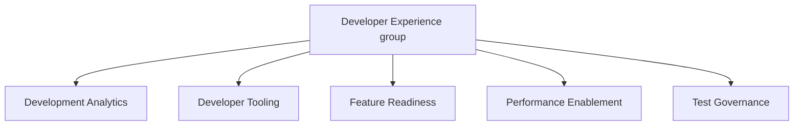

## Mission

Our mission is to empower developers to focus on innovation, build, and deliver high-quality products to our customers. We aim to achieve this through:

1. State-of-the-art developer tooling.
2. Robust and reliable test infrastructure.
3. Data-driven analysis for informed decision-making.
4. Streamlined release and test governance to ensure consistency, compliance, and quality across the development lifecycle.
5. Continuous performance profiling.

## Team Structure

[Infrastructure Platforms Department structure](/handbook/engineering/infrastructure-platforms/#organization-structure) is documented in our handbook.                                                                                                                   |

### Developer Experience group structure

## Team Members

### Management team



### Individual contributors

The following people are members of the [Development Analytics group](development-analytics):



The following people are members of the [Developer Tooling group](developer-tooling):



The following people are members of the [Feature Readiness group](feature-readiness):



The following people are members of the [Performance Enablement group](performance-enablement):



The following people are members of the [Test Governance group](test-governance):



## Project Management

We use epics, issues, and issue/epic boards to organize our work, as they complement each other.

The structure of epics, and the responsibilities of the DRI are documented on the [The Infrastructure Platforms Project Management handbook page](/handbook/engineering/infrastructure/platforms/project-management/)

## Weights

When estimating work, we use Fibonacci Series for weights and limit the highest number to 8. The definitions are as below:

| Weight      | Description                                                                                                                                                                                |
|-------------|--------------------------------------------------------------------------------------------------------------------------------------------------------------------------------------------|
| 1 - Trivial | Simple and quick changes such as typo fixes, test tag updates, or trivial documentation additions                                                                                          |
| 2 - Small   | Straight forward changes with no underlying dependencies needed, such as new tests that use existing factories or page objects                                                             |
| 3 - Medium  | Well understood changes with a few dependencies. Few surprises can be expected, such as new tests that require new factories or page objects/components                                    |
| 5 - Large   | A task that will require some investigation and research, in addition to the above weights, such as tests that need framework level changes which can impact other parts of the test suite |
| 8 - X-large | A very large task that will require much investigation and research. Pushing initiative level                                                                                              |
| 13 or more  | Please break the work down further, we do not use weights higher than 8. |
