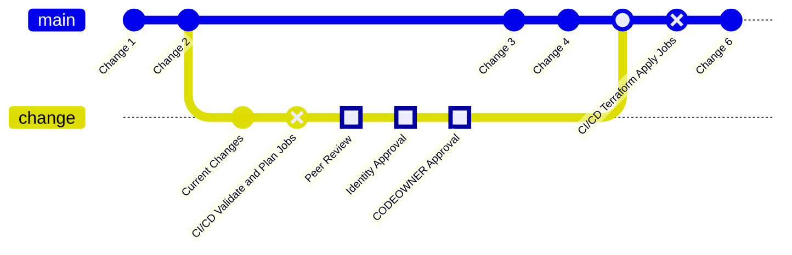

{}
You are viewing a preview of documentation for the future state of GitLab Identity v3 (mid 2024). See the <a href="/handbook/security/security-and-technology-policies/access-management-policy/">Access Management Policy</a> for the GitLab Identity v2 current state with baseline entitlements and access requests. See the roadmap in the <a href="https://gitlab.com/groups/gitlab-com/gl-security/identity/eng/-/roadmap?state=all&sort=start_date_asc&layout=QUARTERS&timeframe_range_type=THREE_YEARS&group_path=gitlab-com/gl-security/identity/eng&progress=WEIGHT&show_progress=true&show_milestones=false&milestones_type=ALL&show_labels=true">epics gantt chart</a>.
{}

## GitOps Workflow

We have a GitLab repository for each vendor instance with a `.gitlab-ci.yml` file with CI/CD pipeline jobs for `terraform validate`, `checkov` (Iac SAST scanning), `terraform plan`, `terraform apply`, and `terraform destroy` jobs.

All changes are performed in GitLab branches that have a `terraform validate`, `checkov`, and `terraform plan` job. Merge requests are configured to require all jobs to succeed, all approvals to be obtained and are merged automatically after all approvals.

## Approval Rules

Each merge request requires a peer review and is configured with three (2) [GitLab approval rules](https://docs.gitlab.com/ee/user/project/merge_requests/approvals/). The peer reviewer is allowed to add commits to make fixes or make suggestions in merge request review comments.

1. The **Identity Approval** approval requires review from the Identity Engineering or Identity Operations team to ensure technical accuracy. This can be performed by the Identity Peer Reviewer if they did not make commits. If the Peer Reviewer makes commits, then an additional person must provide approval for separation of duties.
1. The **System Owner** approval uses the [CODEOWNERS](https://docs.gitlab.com/ee/user/project/codeowners/) file that specifies the business owner and technical owner for each directory or file in the Terraform GitLab repository. We rely on GitLab's Tech Stack by default, however this can be updated by the Identity Operations team to be the domain subject matter expert (SME) for the specific configuration.

The merge request is automatically merged after all approvals are provided. **Approval should not be provided until changes are ready to go live.**

When the branch is merged into the `main` branch, the `terraform apply` job is included in the CI/CD pipeline and is run automatically if the `terraform plan` job passes and the changes go live automatically.

## Standardized Modules and Syntax

We have a library of pre-defined modules (configuration templates) that allow us to simply define a few variables in a module configuration block and all of the other syntax is handled within the module for standardization.

Each module can be used in the appropriate Terraform configuration file. See the respective vendor repository for more details.
