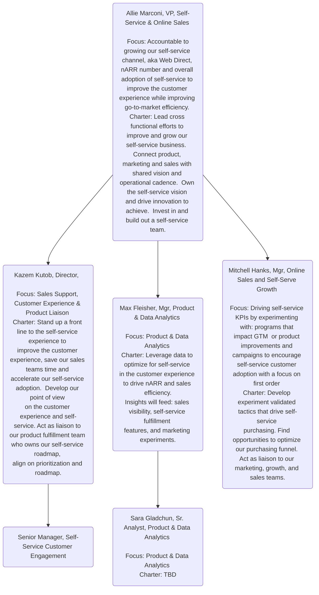

<link rel="stylesheet" type="text/css" href="/stylesheets/biztech.css" />

## Welcome to the Self-Service Handbook

{}
The Self-Service Team is responsible for delivering a cohesive go-to-market (GTM) that enables customers and prospects to self-serve: from discovery and adoption, purchasing, expanding, and managing their GitLab subscription.
{}

## Self-Service Vision

GitLab engages with customers on their terms, offering seamless self-service options.  We deliver a best in class self-service experience for discovering & adopting GitLab, purchasing, expanding and managing your GitLab subscription.

We are easy to do business with. Our customers get time back to do what matters most - use GitLab to build the best software possible. And our customer-facing teams get time back to focus on higher value customer interactions, allowing us to accelerate and scale our growth.

We are a showcase of GitLab's culture. Interacting with us is flexible, asynchronous enabled and transparent.

## Navigating the Self-Service Handbook

  <a href="#our-strategy" class="btn btn-purple" style="white-space: initial;min-width: 0;width: auto;margin:5px;display:grid;align-items:center;height:100%;">Our Strategy</a>
  <a href="#success-metrics" class="btn btn-purple" style="white-space: initial;min-width: 0;width: auto;margin:5px;display:grid;align-items:center;height:100%;">Success Metrics</a>
  <a href="#the-self-service-team" class="btn btn-purple" style="white-space: initial;min-width: 0;width: auto;margin:5px;display:grid;align-items:center;height:100%;">The Self-Service Team</a>
  <a href="#self-service-in-the-customer-journey" class="btn btn-purple" style="white-space: initial;min-width: 0;width: auto;margin:5px;display:grid;align-items:center;height:100%;">Customer Journey</a>
  <a href="#our-partners" class="btn btn-purple" style="white-space: initial;min-width: 0;width: auto;margin:5px;display:grid;align-items:center;height:100%;">Our Partners</a>
  <a href="#coming-soon-dashboards" class="btn btn-purple" style="white-space: initial;min-width: 0;width: auto;margin:5px;display:grid;align-items:center;height:100%;">WIP Dashboards</a>
  <a href="#resources--communications" class="btn btn-purple" style="white-space: initial;min-width: 0;width: auto;margin:5px;display:grid;align-items:center;height:100%;">Resources</a>

## Our Strategy

**This section contains forward-looking content and may not accurately reflect current-state or planned feature sets or capabilities.**

1. Accelerate ARR

   - **Align AEs to highest ARR uplift**: Adjust go-to-market and incentives to focus AEs on highest value interactions for the customer.  Enhance self-service options for simple, fast interactions and build customer awareness.
   - **Discover new customer insights**: Buying cycles are changing, a large majority start before an AE engages.  Allow self discovery and monitor through product analytics to create (very) qualified leads.
   - **Become a tool for direct sales**: GitLab operates in a self-service hybrid model.  Provide customer visibility to AEs to enhance their selling conversations.
   - **Align our self-service GTM motion**: Work jointly across Sales, Product, Marketing, Customer Success & Channels to create definition of success, leverage best technology, build a joint roadmap and deliver best experience.

2. Deliver a best-in-class Self-Service experience

   - **Understand our customers**: Use product analytics and customer conversations to understand personas & buying journeys by segment.  Define ideal seamless omnichannel experience for our customers.
   - **"Always on" customer feedback**:  Collect and summarize customer feedback into a single view.  Quantify feedback to prioritize product & go-to-market changes. (e.g., Top 5 requested self-service feature based on customer survey)
   - **Flexible self-service engagement models**: Introduce chat for on-demand support that customers can access in-context.  While also creating rich feedback for our product and go-to-market teams.
   - **Product & Data Analytics**: Without human interaction, product analytics will be our window into customer interactions.  It is foundational to self-service.  It will influence the product roadmap, drive interactions and identify issues.

3. Improve go-to-market efficiency, accelerate growth

   - **Self-Service go-to-market models**: Introduce a self-service segment.  Leverage an inbound 'on-demand' account team to help customers and feed our backlog.  Grow the self-service channel full stack.
   - **Self-Service marketing campaigns**: Leverage self-service product analytics to drive high performing marketing campaigns based on specific customer insights. (e.g., abandoned cart campaigns, personalized marketing automation, featured products)
   - **Increase Rep productivity**: Increase self-service adoption in territory.  Minimizing time spent on account management, operational tasks and simple transactions. Introduce new customer engagement models to connect with sales. (e.g., hand raise for sales conversation, schedule a time with a sales rep)

## Success Metrics

- **Accelerate Self-Service nARR**: nARR vs. plan > 1
  - This is our north star metric
- **Efficiency**: growth efficiency >= 1.5 by FY'23
- **Customer Experience**: self-service utilization `target coming soon`
  - What is self-service utilization? % of self-service functionality used by customers

Illustrative example of self-service utilization.

X = indicates the customer conducted the action via self-service.

|  **Customers** | **Trial** | **Purchase** | **Growth** | **Upgrade** | **Renew** | **Outreach** | **Utilization** |
| :--------------- | :----------------- | :----------------- | :----------------- | :----------------- | :----------------- | :----------------- | :----------------- |
| **Customer A** | X | X |  |  | X |  | **50%** |
| **Customer B** |  |  | X |  |  | X | **33%** |
| **Customer C** | X |  |  | X | X | X | **66%** |
| **Total** | **2** | **1** | **1** | **1** | **2** | **2** | **50%** |

## The Self-Service Team

Our team reports into the [VP of Commercial Sales](/job-families/sales/vp-of-commercial-sales/).

## Self-Service in the Customer Journey

This section is to give you a sense of how the Self-Service team interacts with the differents parts of the customer journey.

|  **Customer Journey** | **Self-Service Team Role** |
| :--------------- | :----------------- |
| Discovery, Trial, & Free | Partner with owners (Marketing, Growth, and Fulfillment) in cross-functional working group.  Potential partnerships: chat offering, transactional emails, commerce experience. |
| Paid, Upgrade, Growth, & Renewal | Provide continuous feedback to inform product roadmap and experience changes.  Automate as much as possible through the self-service experience.  Partner with sales to provide visibility and engagement opportunities with customers.   Create buying intent through self-service and in product experiences.  Provide self-service on demand & in context support for customers. |
| Support | Partner with owners (Customer Success) in cross-functional working group.  Potential partnerships: chat offering, customer success planning |

## Our Partners

Below is a list of our cross-functional partners and high-level description of how we partner with them. Partners, please feel free to submit an MR to update or edit.

|  **Team** | **Sub-Team** | **How We Partner** |
| :--------------- | :----------------- | :----------------- |
| Fulfillment | [Analytics Instrumentation](/handbook/product/product-processes/analytics-instrumentation-guide/) | The Self-Service Team works with the product intelligence team in cases where our product data set is incomplete (i.e. instrumentation gaps, accessibility, accuracy) when the Self-Service Team team is attempting to answer product questions related to self-service. |
| Fulfillment | License, Purchase, and Utilization | |
| Growth | [Product Analysis](/handbook/product/groups/product-analysis/#working-with-us) | Our teams have similar functions as it relates to product analytics (e.g. experiment analysis, product KPI tracking, ad hoc product analyses); however the lens through which we ask questions (product v. self-service) and our stakeholders (PMs v. Self-Service Team/sales) differ.     We share knowledge, best practices and output of our analyses across our two teams. |
| Growth | [Conversion](/handbook/engineering/development/growth/) | We partner on experiments related to trial/free to paid self-service conversion. Example: define product qualified lead strategy (PQL) to understand how we can maximize for nARR while emphasizing efficiency through self-service. |
| [Data](/handbook/enterprise-data/) | [GTM Data Fusion & R&D Data Fusion](/handbook/enterprise-data/#data-fusion-teams) | Self-Service Team is a ['spoke' and works closely with the core data team 'hub'](/handbook/enterprise-data/#how-data-teams-work-together). Self-Service Team digests the aggregated data tables created and maintained by the core data team. Self-Service Team provides input and creates issues for the core team when we have gaps in our data needed for decision making. In the case that analyses become important and repeatable, Self-Service Team works with the core data team to create long term solutions.    Self-Service Team partners with the GTM Data Fusion Team on special projects that impact sales and marketing teams as it relates to self-service (e.g. surfacing product insights to sales teams, PTB). |
| [Marketing](/handbook/marketing/) |  | |
| [Sales](/handbook/sales/) |  | |
| Analytics & Business Insights |  | We divide and conquer as it relates to analyses involving the self-service business: Analytics & Business Insights team primarily focuses on first orders (FO), while the Self-Service Team focuses on growth and account management. We collaborate to ensure we are telling a cohesive self-service story and share findings from analyses. |
| [Sales Strategy](/handbook/sales/field-operations/sales-strategy/) |  | The Sales Strategy team is responsible for incorporating self-service into their workflow: forecasting calls, monthly key reviews, GTM planning, target setting, and high level reporting. The Self-Service Team analysts are responsible for building self-service specific dashboards, proactively identifying self-service data trends, investigating the 'why' behind target attainment, providing self-service experiment read-outs, providing data to influence GTM or product changes, etc. |

## Resources & Communications

- **Slack Channel**: `#self-service_public`
- Create an issue in the [Self-Service project](https://gitlab.com/gitlab-com/sales-team/self-service) and use the `Self-Service` label
