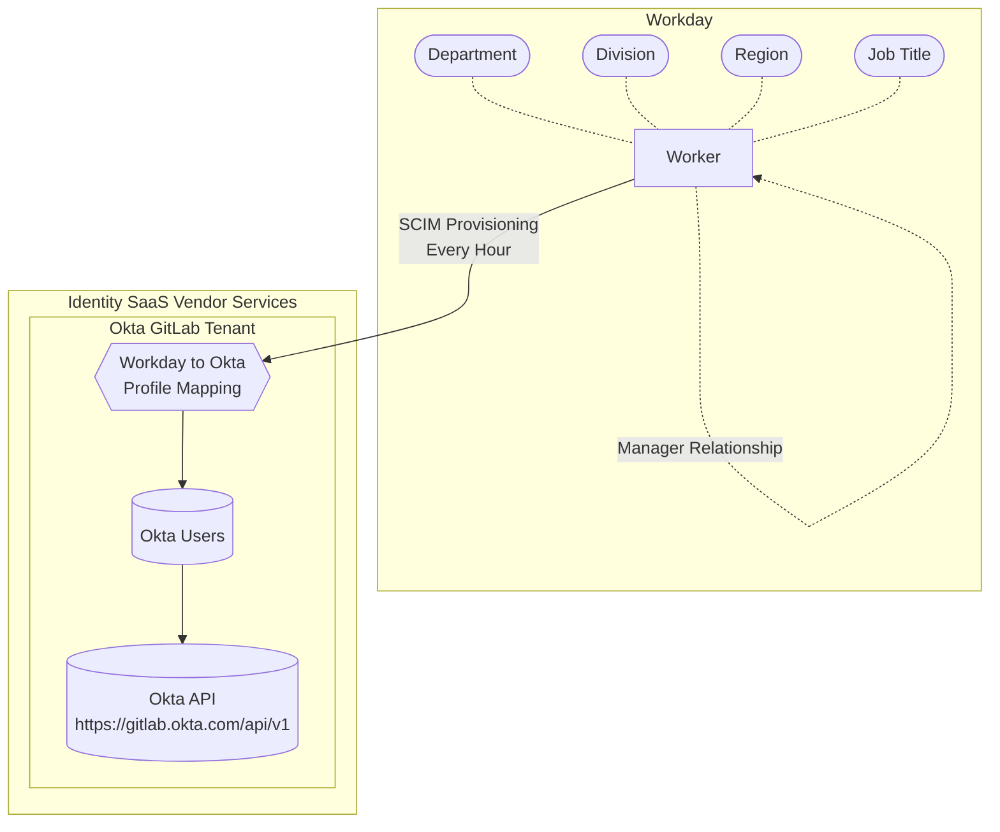

<link rel="stylesheet" type="text/css" href="/stylesheets/biztech.css" />

{}
You are viewing a preview of documentation for the future state of GitLab Identity v3 (mid 2024). See the <a href="/handbook/security/security-and-technology-policies/access-management-policy/">Access Management Policy</a> for the GitLab Identity v2 current state with baseline entitlements and access requests. See the roadmap in the <a href="https://gitlab.com/groups/gitlab-com/gl-security/identity/eng/-/roadmap?state=all&sort=start_date_asc&layout=QUARTERS&timeframe_range_type=THREE_YEARS&group_path=gitlab-com/gl-security/identity/eng&progress=WEIGHT&show_progress=true&show_milestones=false&milestones_type=ALL&show_labels=true">epics gantt chart</a>.
{}

{}
This page focuses on the architecture and documentation of our Identity Platform and Security Program. If you are looking to get access an application or infrastructure, see the <a href="/handbook/security/identity/guide/user">Team Member User Guide</a>. To manage access for team members that report to you, see the <a href="/handbook/security/identity/guide/manager">Manager User Guide</a>. You can scroll to the bottom of this page to see the other user guides.
{}

## Mission

GitLab is one of the stewards of the world's source code and intellectual property. Our mission is to ensure that internal and administrative access to customer and product data is protected and industry trust is preserved.

### Risks and Process Improvements

Our work focuses on the following risks and process improvement areas:

1. **Lateral Movement Risk:** Restricting and securing access to GitLab's internal data and systems based on "need to know" and least privilege security principles to prevent data leakage or data loss.
1. **Penetration Risk:** Implement and manage security boundaries ("castle walls") related to authentication, authorization, device trust, and least privilege for GitLab team members, temporary service providers, and service accounts that have access to internal GitLab systems and/or administrative access.
1. **Cloud Infrastructure Control Plane:** We manage the top-level access and architecture for AWS and GCP cloud providers to enforce least privilege and separation of accounts and resources for workloads.
1. **Last Mile Process Automation:** Implement custom code for vendor feature gaps for last mile compliance and provisioning automation that improve business efficiency and change management auditability. This improves back office and team member end user experience, automation, and audit reports with onboarding, career mobility, offboarding, and ad-hoc access requests using improved role-based access control architecture.
1. **Configuration State Management:** Use GitOps configuration/infrastructure-as-code for system configuration where feasible to avoid risks with manual configuration and drift detection.

### Future State Goals

#### Provisioning and Approvals

As we look ahead, we have a North Star vision that access and permissions are provisioned programatically, not manually by system administrators.

We also want to ensure that all approvals are systematic in nature to allow automated audit log exports. For example:

1. A GitLab issue Markdown checkbox is visually auditable, but not programatically auditable. Anyone can select the box so manual effort is needed to verify that the appropriate person checked the box.
1. A GitLab label is auditable if it exists, but not who applied it and timestamp of application. Although the UI shows which user applied the label, this isn't easily accessible in the event log. Any user can apply the label, so there are risks with assurance of who had the authority to apply the label.
1. When we use a Slack bot or Web UI form with a green and red button, the user is already authenticated and only that user has the ability to click that button based on policies that our systems define. We use API calls to perform actions that have additional validation checks and audit logs for tracking.

We want to provide a streamlined user experience for admins, managers, and end users alike to reduce friction and provide self service wherever possible. We have had success with past projects and want to bring our experience and lessons learned to the next generation of Identity Management.

> "I created an AWS account with [gitlabsandbox.cloud](/handbook/company/infrastructure-standards/realms/sandbox/#individual-aws-account-or-gcp-project) today. To be honest, I did not expect it to be fully automated. I got my AWS credentials in 5 minutes without bothering anyone. That's amazing!" - Dmitriy Zaporozhets (DZ), GitLab Co-Founder, 2020-12-14

We will be using SaaS vendors (Google Workspace, Okta, Okta IGA, Workday) where possible and providing last mile automation, auditing, and user experience with our custom [Identity Platform](/handbook/security/identity/platform).

#### Auditability

We perform manual visual audits in Identity v2 with screenshots and CSV exports.

In Identity v3, we will use programmatic provisioning so every action and metadata diff is logged with a standardized schema for improved alerting, auditability, and dispatching automation for provisioning and deprovisioning. This also improves transparency for team members to self service the information they need and streamlines our user access review process with a history of point-in-time records of what changed, when, and automates any observations.

#### Elevated, Just-in-Time, and Admin Access

Our next-gen architecture will allow us to automate just-in-time access for elevated and administrative actions that are burdensome to manage manually.

For users that need perpetual administrative access, we have an additional admin account for each of the users in Customer Support, Infrastructure, IT, Security and other roles. See [access level wristbands](https://internal.gitlab.com/handbook/it/it-self-service/access-level-wristband-colors/) to learn more.

We are also investing in additional administrative control plane separation. Details are not published in the public handbook for security reasons.

## Roadmap

As any company grows, they go through phases of growth with many organic iterations throughout the journey. GitLab is currently outgrowing Identity v2 and is building our Identity v3 program.

### GitLab Identity v1

GitLab Identity v1 was managed using Tech Ops practices by the Infrastructure and People Operations team prior to 2018.

### GitLab Identity v2

GitLab Identity v2 is what we do today and have been doing since 2018 with [baseline entitlements](https://internal.gitlab.com/handbook/it/end-user-services/access-request/baseline-entitlements/) and [access requests](/handbook/it/end-user-services/onboarding-access-requests/access-requests/). See the [Access Management Policy](/handbook/security/security-and-technology-policies/access-management-policy/) to learn more.

The processes that we do today meets audit and compliance requirements, however the processes are mostly manual that results in internal inefficiency. It takes a lot of labor hours to manage onboarding, access requests, access reviews, and offboarding processes.

You can see historical stats on access requests in this (internal) [spreadsheet](https://docs.google.com/spreadsheets/d/15MSlSmeT9sirHJquNkzXwMQLYyHz3DvjEe5VAoMUwyE/edit#gid=0).

### GitLab Identity v3

{}
We are in the architecture and early engineering incubation phase. Please continue to use existing Identity v2 processes (business as usual) for all requests through mid-2024.
{}

GitLab Identity v3 is where we want to be in FY25-2H (mid-late 2024) with a pseudo-greenfield approach to automate all of our policies and as much of our approvals, provisioning, and access reviews as possible.

#### Role Based Access Control (RBAC)

With the introduction of [Identity Roles and Identity Groups](/handbook/security/identity/platform#terminology), we can reduce the number of ad-hoc access requests by using predefined policies and automated provisioning based on role-based access control rather than named user access control.

If you are familiar with job families in Identity v2, this is the next generation with an improved architecture and schema for IAM and RBAC.

#### Identity Governance (IGA) Implementation

Identity Governance and Administration (IGA) vendor products are typically focused on a compliance lens, with the goal of managing the approval process when a user requests access to an application, and providing a UI for compliance team members to perform user access review audits for existing users that have access to an application.

We are in the early stages of implementing Okta's IGA platform. You can learn more in the [internal slide deck](https://docs.google.com/presentation/d/1B-H2YFm6nLCsGIHXg6_Nh_oss-0mQ-CnYuHoMM5n2WE/edit) and materials in the [Google Drive](https://drive.google.com/drive/folders/18VWrD-dEZOYeLi6t01DMko6VcnCa5CQu) folder. You can also see additional feedback from team members during the RFP process in [it/engops#289](https://gitlab.com/gitlab-com/it/engops/issue-tracker/-/issues/289).

The high level goal is that Okta IGA provides an improved user experience for users to request access to Okta applications with a Web UI and Slack Bot that are not managed by baseline entitlements, and has helpful compliance backend UI features for performing user access reviews.

#### Custom Code

The Security department is leveraging vendors that specialize in Identity Management (ex. Okta, IGA solution, etc.), however no SaaS vendor has all of the features that we need.

Due to the existential and security risks associated with IAM/RBAC, the Security department is supporting our Identity Engineers who are building in-house infrastructure, scripts, and software integrations to build the last mile automation and tools.

The [Identity Platform](/handbook/security/identity/platform) provides the API integration and plumbing of our vendor solutions and allow us to meet the challenges of the future, make GitLab easier to do business with internally, and unilaterally address our IAM and RBAC risks with a holistic approach.

The Identity Platform is a well architected library of scripts that use [CI/CD pipeline jobs](/handbook/security/identity/platform/#cicd-pipeline-jobs) to parse [YAML policy files](https://gitlab.com/gitlab-com/gl-security/identity/data-poc/policies/-/tree/main/role/policies?ref_type=heads), generate [user manifests](https://gitlab.com/gitlab-com/gl-security/identity/data-poc/manifests/-/tree/main/accessctl/manifests/role?ref_type=heads), and use the [REST API](/handbook/security/identity/platform/#group-user-sync) for each respective vendor to check if the user belongs to the group, should be removed from the group, and sync the group members against our policy. See the full [data flow](/handbook/security/identity/platform#data-flow) for more details.

We will be using [GitOps](/handbook/security/identity/gitops/) (a.k.a. Terraform and GitLab CI/CD pipelines) approach for assigning groups to [Okta applications with state management](/handbook/security/identity/gitops/okta/).

#### Complex Systems

We have identified several key systems and applications that need our focus and investment to optimize Identity Security. We are focusing on managing the admin control plane and tech stack systems that are causing a lot of business inefficiencies related to onboarding and offboarding.

We describe these as the "complex" systems that don't have easy button provisioning that 3rd party vendors can easily manage. We have to build custom automation using Terraform or REST API calls to handle the complex systems.

- (New) Admin Control Plane with GitOps and Admin Accounts
- GitLab SaaS Instance Admins
- Google Cloud
- Google Workspace Groups
- GitLab SaaS Groups and Members (ex. `gitlab-com`, `gitlab-org`, `gitlab-*`, `gl-*` namespaces)
- Okta Group Membership Policies/Rules (used by Okta Applications)

We are also closely involved with processes and systems that cause the most inefficiency or pain and suffering.

- Onboarding issues and access requests
- Baseline entitlement architecture and automation
- Offboarding issues and access deprovisioning
- Okta architecture
- Google Workspace architecture
- 1Password administration
- Google Cloud architecture

For more details, see the related handbook pages, reach out to `#security-identity-ops` with questions, or schedule a call with Jeff Martin.

### Automation Options

This is a low context simplified explanation.

#### Okta Authentication

A large number of our tech stack applications have **authentication** federated by Okta single-sign on (SSO) using any combination of SCIM, SAML, and OIDC protocols.

It is important to keep in mind that Okta is not an **authorization** platform. In other words, when you sign in, the application can see your name, email address, and profile attributes or a list of group names that you are a member of, however Okta cannot provision/grant you roles or permissions on the application itself.

Most applications have "simple" provisioning that requires adding the user and they are assigned baseline permissions and users do not need additional permissions. For discussion purposes, this covers ~80% of our applications.

A few applications have code logic with their Okta authentication integration that allows you to specify which user profile attributes or group names should be used to grant access to additional roles and permissions inside of the application, however we rarely see this functionality in applications. Most applications provide a UI that lets you manually assign a role to the existing user.

#### Authorization Automation

For ~20% of applications that require "resource" or "role" provisioning, we have to use no-code or our own scripts to achieve this. There are no features in Okta or other Identity solutions that offer these features. This requires using the vendor's REST API with our own scripts to call endpoints respectively. Any integrations that you see advertised are usually Professional Services custom integrations that their engineers wrote scripts for.

You can see the GitLab product [Members API](https://docs.gitlab.com/ee/api/members.html) endpoint as an example. We can force users to sign in with Okta, however Okta cannot automate which groups and projects the user has access to or the role/permission level for each of those groups or projects.

#### No Code Automation

You may have heard of no code solutions like Okta Workflows, Tines, Workato, Zapier, etc that can solve these needs. While they work reasonably well in simple use cases for users who do not have code experience, they are not the tool for the job in all cases, particularly complex ones.

Remember that no-code workflows are point-to-point and are not usually part of a shared ecosystem that might provide economies of scale. In other words, you can't call a function/method from another class.

With any WYSIWYG tool, you cannot use expression language syntax natively like you can when writing a few lines of code, so you have to catch data, pull an attribute, then plug that string attribute into the next function. The end result is that no-code workflows become overly complicated and can become 50 steps that can be accomplished with 5 lines of code.

In other words, no-code is great for something very simple, but should not be relied on for complex workflows without good reason. In Identity v2, we've tried to stretch the limits of no-code workflows, and believe that scripts running in CI/CD pipelines offer easier maintenance if well architected.

#### Custom Code Automation

The concept of writing code or custom applications can be perceived as burdensome and requires significant investment. Our strategy is to use small scripts that are run with GitLab CI/CD pipelines, allowing us to keep the code base small and dogfooding the GitLab product while maintaining the smallest possible codebase footprint for automation.

See the [Identity Platform](/handbook/security/identity/platform) to learn more about our approach.

## Separation of Concerns

### Tech Stack Kingdoms

We have refactored our tech stack into **Identity Kingdoms** (analogous to a realm) to provide separation of concerns between Business, Cloud, and Product (SaaS and Dedicated) unique needs, particularly with administrative control planes and least privilege configuration. This allows us to create automation and policies specific to each kingdom's compliance requirements to enable the respective teams to operate efficiently within our top-level architecture and guardrails.

Learn more on the [Identity Kingdoms](/handbook/security/identity/kingdoms) handbook page.

### Trust Landscape DRIs

The Security team focuses on customer, compliance, and product trust, while the Business Technology and IT team focuses on corporate and financial trust.

- **Administrator Trust:** Security Department - Identity Ops
- **Automation Trust:** Security Department - Identity Engineering
- **Boundary Trust:** Security Department - Identity Engineering
- **Compliance Trust:** Security Department - Commercial Compliance Team
- **Customer Trust:** Engineering, Product, and Security division
- **Financial Trust:** Business Technology/IT Department
- **Product Feature Trust:** Development Department and Product Management
- **Product Reliability Trust:** Infrastructure Department

### Technological Trust

In addition to maintaining human confidence, we also need to ensure supply chain confidence and that no single vendor breach can compromise the integrity of our architecture, particularly the boundaries that we refer to as castle walls. By using a defense-in-depth approach, we are able to minimize the external attack surface.

Learn more on the [Identity Boundaries](/handbook/security/identity/boundaries) handbook page.

### Data Sources

We consider Workday to be the source of truth for [team members](/handbook/people-group/employment-solutions/#team-member-types-at-gitlab). All users and their attributes are synced with Okta every hour with built-in vendor integrations.

The [Temporary Service Provider](/handbook/it/end-user-services/onboarding-access-requests/temporary-service-providers/) process is the SSOT for contractors and external users. The IT team manages automation that creates temporary service provider users in Okta with `-ext@gitlab.com` email addresses.

Workday has department, job title, and manager metadata, but does not have sufficient sub-department/team/role metadata that is needed for RBAC (that are being evaluated). Workday also does not have any of our temporary service provider contractors. In our current iteration, we consider Workday to be focused on People Group related use cases.

We have flexible control of custom attributes in Okta that we can pull (and push) so we consider Okta Users and their attributes to be the aggregated SSOT for Identity.

When a user's Okta status changes to `deprovisioned` (pushed from Workday), we consider them to be offboarded.

The Identity Team aggregates the information from each team to create a consolidated hierarchy of teams that are used for role-based access control and add them to our policy files that are used to generate manifests. See [Identity Roles](/handbook/security/identity/platform#identity-roles) for a full list of data sources and policies.



#### Workday Fields

Here is a non-exhaustive list of Okta profile fields that we use for identity management.

- Okta ID
- Name
- Email
- Manager Email (`managerId`)
- Cost Center (`costCenter`)
- Division (`division`)
- Department (`department`)
- Job Title (`title`)
- Hire Date (overlaps with `created_at` usually)
- Management Level (`workday_managementLevel`)
- Region (Americas, EMEA, APAC)
- GitLab SaaS Username
- GitLab SaaS ID
- Slack ID

We have additional fields that we could use but choose not to for PII risk or irrelevant field reasons. This is a two way door decision on an attribute-by-attribute basis.

- Corporate Entity (`gitlab_loc`)
- Employee Number
- Workday Job Code
- Workday ID (similar to Employee Number)
- Postal Address
- City
- State/Province
- Postal Code
- Mobile Phone Number
- Country

#### User Array Fields

The [Identity Platform](/handbook/security/identity/platform) automation uses our centralized (single) API call to Okta every hour to [extract users](https://gitlab.com/gitlab-com/gl-security/identity/data-poc/manifests/-/blob/main/accessctl/extract/okta/prod/users/users.yml?ref_type=heads) that are used as the data source for additional automation.

```yml
dmurphy:
  provider_id: 00u1b2c3d4e5fg7h8357
  anonymized: false
  type: purple
  first_name: Dade
  last_name: Murphy
  full_name: 'Dade Murphy'
  email: dmurphy@gitlab.com
  handle: dmurphy
  manager: klibby
  id_role: sec_identity_eng
  organization_name: null
  cost_center: rd
  division: security
  department: security
  title: security_engineer
  management_level: individual_contributor
  region: americas
  gitlab_saas_id: 12345678
  gitlab_saas_username: z3r0c00l-example
  slack_id: UA1B2C3D4
  status: active
  created_at_date: 'YYYY-MM-DD'
  created_at_timestamp: 'YYYY-MM-DDTHH:MM:SS.000000Z'
  created_at_age_days: 123
  last_login_at_date: 'YYYY-MM-DD'
  last_login_at_timestamp: 'YYYY-MM-DDTHH:MM:SS.000000Z'
  last_login_at_age_days: 2
  password_updated_at_date: 'YYYY-MM-DD'
  password_updated_at_timestamp: 'YYYY-MM-DDTHH:MM:SS.000000Z'
  password_updated_at_age_days: 123
  profile_updated_at_date: 'YYYY-MM-DD'
  profile_updated_at_timestamp: 'YYYY-MM-DDTHH:MM:SS.000000Z'
  profile_updated_at_age_days: 123
  status_updated_at_date: 'YYYY-MM-DD'
  status_updated_at_timestamp: 'YYYY-MM-DDTHH:MM:SS.000000Z'
  status_updated_at_age_days: 123
```

## Identity Team Functions

The [Identity Engineering](/handbook/security/threat-management/identity) team was formed in the [Security Threat Management](/handbook/security/threat-management) sub-department with a cross-department realignment on 2023-12-01 to lead the design and implementation of our next-generation of identity and access management framework and program at GitLab that has been branded as [Identity v3](#gitlab-identity-v3) that will be released [iteratively throughout 2024](https://gitlab.com/groups/gitlab-com/gl-security/identity/eng/-/roadmap?state=all&sort=start_date_asc&layout=QUARTERS&timeframe_range_type=THREE_YEARS&group_path=gitlab-com/gl-security/identity/eng&progress=WEIGHT&show_progress=true&show_milestones=false&milestones_type=ALL&show_labels=true).

The Identity Team has three functional specialties and collaborates cross-functionally with our [stable counterparts](/handbook/security/identity/counterparts).

### Identity Infrastructure Engineering

The Identity Infrastructure team is focused on our top-level cloud provider infrastructure organization-level management for AWS and GCP in collaboration with the [Infrastructure Security](/handbook/security/product-security/infrastructure-security) team.

We build self-service tools for users to create their own AWS accounts and GCP projects and provide castle wall hardening.

Each team that deploys infrastructure resources is responsible for managing their own infrastructure workloads and DevOps operations using industry best practices. In other words, the Security team creates the scaffolding for your castle and provides hardened castle walls, while your team is responsible for anything you build inside the castle walls.

See the [Identity Infrastructure](/handbook/security/identity/infrastructure) handbook page to learn more.

- **Slack Channel:** `#security-identity-ops`
- **Slack Tag:** `@security-identity`
- **GitLab Tag:** `@gitlab-com/gl-security/identity/infra`
- **Epics:** [gitlab.com/gl-security/identity/infra](https://gitlab.com/groups/gitlab-com/gl-security/identity/infra/-/epics)
- **Issue Tracker:** [gitlab.com/gl-security/identity/infra/issue-tracker](https://gitlab.com/gitlab-com/gl-security/identity/infra/issue-tracker/-/issues)
- **Escalation DRI:** Jeff Martin or Vlad Stoianovici

### Identity Operations

When we operationalize GitLab Identity v3 in mid-2024, we will have cross-functional team members from IT Operations, People Operations, and Security Operations teams that will perform day-to-day administration of Okta, Okta IGA, and the Identity Platform and handle business and user requests.

In the interim, the Identity Platform Engineering and Identity Infrastructure team members provide coverage in collaboration with our [counterparts](/handbook/security/identity/counterparts).

- **Slack Channel:** `#security-identity-ops`
- **Slack Tag:** `@security-identity`
- **GitLab Tag:** `@gitlab-com/gl-security/identity/ops`
- **Epics:** [gitlab.com/gl-security/identity/ops](https://gitlab.com/groups/gitlab-com/gl-security/identity/ops/-/epics)
- **Issue Tracker:** [gitlab.com/gl-security/identity/ops/issue-tracker](https://gitlab.com/gitlab-com/gl-security/identity/ops/issue-tracker/-/issues)
- **Escalation DRI:** Jeff Martin

### Identity Platform Engineering

The GitLab Identity Security team has CI/CD script and fullstack development skills to build our own open source policy and provisioning automation for our IAM and RBAC needs to supplement our vendors and provide last mile automation "plumbing".

You may already use [GitLab Sandbox Cloud](/handbook/company/infrastructure-standards/realms/sandbox) that is powered by HackyStack. We are refactoring HackyStack to become a component of the Identity Platform.

We are in the early incubation stage of building the [Identity Platform](/handbook/security/identity/platform) that is powered by [accessctl](https://gitlab.com/gitlab-identity/accessctl), a new open source project. As our Identity Platform matures throughout 2024, we will add documentation for the community to adopt our platform and best practices.

### Real-Time Updates

- **Slack Channel:** `#security-identity-eng`
- **Slack Tag:** `@security-identity`
- **GitLab Tag:** `@gitlab-com/gl-security/identity/eng`
- **Epics:** [gitlab.com/gl-security/identity/eng](https://gitlab.com/groups/gitlab-com/gl-security/identity/eng/-/epics)
- **Issue Tracker:** [gitlab.com/gl-security/identity/eng/issue-tracker](https://gitlab.com/gitlab-com/gl-security/identity/eng/issue-tracker/-/issues)
- **Escalation DRI:** Jeff Martin

### Transparency

Due to the nature of the risks that we mitigate, our roadmap is only visible to internal team members in our [epics roadmap](https://gitlab.com/groups/gitlab-com/gl-security/identity/eng/-/roadmap?state=all&sort=start_date_asc&layout=QUARTERS&timeframe_range_type=THREE_YEARS&group_path=gitlab-com/gl-security/identity/eng&progress=WEIGHT&show_progress=true&show_milestones=false&milestones_type=ALL&show_labels=true).

You can learn more about our progress in our [Identity Engineering epics](https://gitlab.com/groups/gitlab-com/gl-security/identity/eng/-/epics) and [Identity Engineering issues](https://gitlab.com/gitlab-com/gl-security/identity/eng/issue-tracker/-/issues).

We use public issue trackers for platform feature requests, however all issues related to GitLab's business, data, infrastructure, and risks are created and managed in the [Identity Engineering (internal) issue tracker](https://gitlab.com/gitlab-com/gl-security/identity/eng/issue-tracker/-/issues) and are linked in open source project merge requests (without disclosing title or contents) after the risk has been mitigated and merged.

After a risk has been mitigated and we believe that we have the latest best practices in place, we publish the documentation in our public handbook, internal handbook, and/or in the Access Control documentation.
