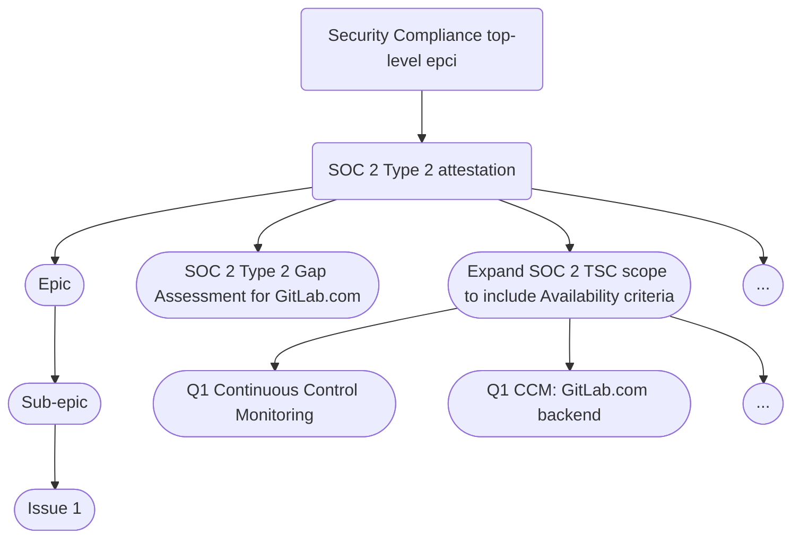

## Our objectives

We support the Security division's [mission and operating principles](/handbook/security/_index.md) by:

1. Maintaining GitLab's position as the most trusted DevSecOps offering on the market
1. Maintaining and achieving [security certifications and attestations](../security-compliance/certifications/) that meet the needs of our customers
1. Identifying and mitigating information security risk through [continuous control monitoring](/handbook/security/security-assurance/security-compliance/sec-controls/) and [risk-based-control-testing](/handbook/security/security-assurance/security-compliance/risk-based-control-testing/) of assets
1. Applying compliance automation and [policy-as-code](/handbook/security/security-assurance/security-compliance/policy-as-code/)  guardrails to minimize [toil](https://sre.google/sre-book/eliminating-toil/) and enable product, development, and infrastructure teams
1. Using our own product ([dogfooding](/handbook/values/#dogfooding)) to meet key security controls, improve our offering, and demonstrate to customers how they can do the same

## Core Competencies

1. [Security certifications and attestations](../security-compliance/certifications/)
   - Gap Analysis Program: feasibility analysis for certification expansion
   - External Audit coordination and execution
1. [Continuous Monitoring of GitLab's Security Controls](/handbook/security/security-assurance/security-compliance/sec-controls/) which are mapped to applicable regulatory requirements and security certifications/frameworks we have committed to.
   - [Policy-as-code](./policy-as-code.md)
   - [Automated evidence collection and control testing](./automated-control-testing.md)
   - [User Access Reviews](./access-reviews.md)
   - [Business Continuity Plan (BCP)](/handbook/business-technology/entapps-documentation/policies/gitlab-business-continuity-plan/) and [Information System Continuity (ISCP)](../../information-system-contingency-plan-iscp.md) testing
   - [Risk-based control testing](./risk-based-control-testing.md)
   - [PCI Internal Control Review](./pci-internal-control-review.md)
1. [Observation and Remediation Management](../observation-management-procedure.md)
   - Specific to Tier 3 (system-level) risks
   - Identify control weaknesses and gaps (observations)
   - Provide remediation recommendations and guidance
   - Track remediation to completion
1. Industry and Regulatory Monitoring and Insights
   - Monitoring drafts and changes to relevant laws, executive orders, directives, regulations, policies, standards, and guidelines.
   - Collaborating on responses to relevant RFIs, RFQs, RFPs, and requests for public comment.
   - Monitoring changes to government contractual language that could impact public sector security and compliance posture.

## Where we work

The single source of truth for all of in-progress work is the Security Compliance [team top-level epic](https://gitlab.com/groups/gitlab-com/gl-security/security-assurance/-/epics/289), which has detailed status updates, along with the [team epic board](https://gitlab.com/groups/gitlab-com/-/epic_boards/1063538?label_name[]=seccomp-roadmap) which we use to visualize workflow status and compare to our [roadmap](https://docs.google.com/presentation/d/1TEJzAkdoi_U-ubg7qhj1ZUpi2_VQYNF5DTOT5Mj1Mqo/edit?usp=sharing). All work that is directly associated with our roadmap should take place via these and issues should be opened in the [Security Compliance Team Issue Tracker project](https://gitlab.com/gitlab-com/gl-security/security-assurance/security-compliance/team). This is important for two reasons: It allows us to work efficiently by centralizing and organizing our work in a single place using a robust labeling scheme and it allows us to report on various operational metrics (performance indicators).

Much of our work related to the [FedRAMP Authorization Program](/handbook/security/security-assurance/security-compliance/fedramp-compliance/) is unfortunately not visible to the rest of GitLab due to regulatory mandates outside of our control. In order to bring as much transparency and visibility into our work, and to continue to track basic metrics, it is critical that we continue to use our epic board and issue tracker as much as possible, even if used to track high-level tasks with links to detailed issues within the authorization boundary.

All team members are encouraged to regularly start Slack discussions in `# sec-assurance` instead of the private `sec-assurance-team` channel which was the default before October 2024. Most of the work we do is actually not limited access and therefore can be discussed openly.

## How we work

We use agile program management and project management best practices to organize our work with the goal of being as efficient as possible while continuously iterating towards our objectives. Security Compliance team members are encouraged to regularly bring up feedback on how we can improve the way we work and this is a standing topic in our weekly team meeting agenda.

### Scheduled meetings

We try to avoid meetings when possible and prefer to work async. However, if we don't make progress async we should not hesitate to schedule a meeting. Our only recurring, mandatory meetings are the monthly department meeting, weekly team meeting, and 1:1s. However, don't wait for our team meeting or 1:1s to start a discussion; instead start a Slack thread and/or an issue and let's use these meetings to finish the discussion and make final decisions.

We have a weekly call with all of Security Compliance, which includes time for a breakout discussion specific for Dedicated Markets. In addition to that, we also have recurring calls necessary for our FedRAMP program which are necessary for contributing to the working group, and logging meeting minutes (external audit artifacts) associated with the configuration control board and compliance sync.

Our weekly team meeting follows this agenda:

- Personal Updates / weekend highlights / looking ahead  (5 mins)
- Team Stand-Up (15 mins)
  - Progress Updates: Each team member shares key updates focusing on:
    - Major accomplishments since the last meeting / celebrations and wins
    - Blockers or dependencies that require team support
  - Limit updates to 1-2 minutes per person. Use the epic/issue boards for details outside this meeting.
- Focus Topic: Priority Epic/Issue Discussion, Problem Solving, Brainstorming (20 mins)
  - Deep Dive into Key Epics: Choose one or two epics/issues where the team’s input or collaboration is crucial for progress.
  - Examples: Major compliance audit preparation, urgent security remediation efforts, etc.
  - Discuss blockers, decisions, or resource needs.
- Team Dynamics & Collaboration (10 mins)
  - What went well / What can be improved?
    - How the team can improve collaboration or efficiency.
    - Feedback on communication practices (e.g., storytelling, visibility, impact)
    - Identify any friction points or areas for support.
  - Action: Agree on one improvement or experiment to try until the next meeting (e.g., better retrospective process, additional support, or skill-sharing).
- Miscellaneous Topics / Open Floor (5 mins)
  - Address any other topics that didn’t fit into the above sections.
  - Team members can raise quick, time-sensitive issues, or suggestions for future discussion.
- Wrap-Up & Action Items (5 mins)
  - Summarize key takeaways, decisions, and next steps.
  - Assign action items, if any, and set timelines.

#### Epic hierarchy

The our team top-level epic is simply a SSOT for status updates for epic assignees / directly responsible individuals (DRIs). The immediate child epics get a `seccomp-roadmap` label to appear in our epic board and effectively constitute our roadmap.

1. Sub-epics group tasks required to deliver an item mentioned
1. Sub-epics represent an item from the roadmap and are delivered in a specific phase
1. Sub-epics can span multiple months, but their end date should match the 'anticipated completion date' of the roadmap phase they are added to.

The diagram below shows an example of traversing the complete hierarchy:



#### Epic assignee responsibilities

Each epic has a single DRI who is ultimately responsible for delivering the project. This does not mean they are doing all of the work, rather they are ensuring the work is progressing, blockers are quickly addressed or escalated if needed, and reporting on the status each week.

The DRI needs to:

1. Work with others to move issues through the boards (e.g. from triage to in progress to complete)
1. Ensure epic and any nested child epics and issues are using the appropriate labels
1. Ensure the epic meets criteria outlined in epic structure (next section)
1. Provide status updates on the epic each week including accomplishments, what's next, overall health status, and any blockers

#### Epic structure

Each immediate child epic under our top-level team epic must include the following (adjust quick actions as necessary):

```markdown
## Background

## Objective

## Exit criteria
- [ ]

/label ~"FY26-Q1" ~"seccomp-function::gap assessments"  ~"seccomp workflow::triage" ~"team::security compliance" ~"seccomp-roadmap"
/health_status on_track
/set_parent &289

-----------
<!--DO NOT EDIT BELOW THIS LINE-->

<!--STATUS NOTE START-->

<!--STATUS NOTE END-->
```

The bottom status note comments at the bottom are important as this is what is used to automatically post [status updates](#status-updates) to these epics and the team epic.

**Epic meta data to include**

1. **Assignee** is the DRI which should be populated whenever an epic moves to `seccomp workflow::in progress`
1. **Start date** is set to the expected start date, and updated to be the actual start date when the project begins
1. **Due date** is set to be the expected end date
    1. The due date is set based on the Roadmap
    1. The date that a project actually ended is taken from the date that the epic was closed
1. **Health status** should be kept updated (on track, needs attention, at risk)

Labels are described in the [Labels section](#labels).

#### Roadmap

All epics and issues are set with due dates according to the official [roadmap](https://docs.google.com/presentation/d/1TEJzAkdoi_U-ubg7qhj1ZUpi2_VQYNF5DTOT5Mj1Mqo/edit?usp=sharing).

Process to update epic due dates / roadmap items:

1. After the end of each month Security Compliance management reviews the epic (expected) due dates and works with epic assignees / DRIs to determine any roadmap changes if an epic extends beyond the epic's planned phase.
1. Management then determines roadmap adjustments so that planned work in future phases remains realistic after shifting open work.
1. Roadmap changes are shared in the next weekly sync.

### Status updates

We leverage automation to ensure team members only need to provide a status update once and management only ever has to go to one place to review it. This has historically been a big problem at GitLab with epics and issues spread across various subgroups and projects.

The status for all work relating to the Security Compliance roadmap is maintained in the description of the [top-level team epic](https://gitlab.com/groups/gitlab-com/gl-security/security-assurance/-/epics/289) so that it is visible at a glance.

#### Weekly status update process

DRIs should provide weekly updates for the DRI's epics according to following process:

1. **Every Thursday afternoon** the epic assignee / DRI of *active* epics (anything that is not `seccomp workflow::triage`) will get @mentioned in a comment on the epic asking them to reply with a status update.
1. **By 17:00 UTC / 12:00 PM ET on Fridays** DRIs of *active* epics (or the person covering if DRI is OOO) provide an update in the [status section of the description](#epic-structure) of the epic regarding status of the epic including any relevant details of child epics and issues.
   - If the DRI for a child-epic is different than the epic DRI, the epic DRI is responsible for getting updates from the child-epic DRI.
     - Format for weekly update should be a brief update (~sentence or couple bullets) for each of these three items:
       - **Progress since last update** - Changes deployed to production, unblocked blockers, any other progress achieved.
       - **Risk and Confidence** - Any new blockers identified or existing blockers that persist? Any other challenges now or in the near future? How do these blockers and/or challenges affect our confidence of completing by scheduled due date per the roadmap?
       - **Mitigations** -  What is required to overcome challenges or blockers identified?  Should this be escalated to other team members, teams, executives, or domain experts?
   - **Update Workflow and Health label** - After each status update, the workflow label and health status should be updated. See [Labels](#labels).
1. **Top-Level Epic Status Update** [automation](https://gitlab.com/gitlab-com/gl-infra/epic-issue-summaries) periodically synthesizes updates from the DRI's status update reply comment to automatically populate their epic with the status and the top-level team epic.
1. In order to ensure efficiency we will use these same status updates across any other department, division, or OKR status updates, to include broadcasts in Slack.

### Backlog refinement

Prior to the start of a new quarter, the team will spend time refining the epic backlog. This process will be led by the team Manager, who will go through the epics targeted for the upcoming quarter according to the roadmap and ensure each epic contains the following information (pulling in different stakeholders to help fill in the details as necessary):

- Background (e.g. provide context and the purpose of this work, what is it and why is it relevant?)
- Objective (SMART goal explaining the plan/solution: Specific, Measurable, Achievable, Relevant, Time-bound)
- Exit criteria (break down the work into smaller, logical chunks and highlight dependencies and predecessors)

When the above information is being added, the Epic will move from Triage to Ready status. The goal is to start each quarter with our planned roadmap items for that quarter in the Ready list.

### Labels

At GitLab, we like to label everything. It provides critical metadata on epics and issues because GitLab does not yet [support custom fields](https://gitlab.com/groups/gitlab-org/-/epics/235). We will work on automation that automatically applies labeling logic to issues or reminds assignees, however this is a work in progress. The SSOT for our labeling schemes will soon become our [team's issue tracker](https://gitlab.com/gitlab-com/gl-security/security-assurance/security-compliance/team) (new as of Oct 2024).

The easiest way to ensure all labels are applied to issues is to use issue templates for everything which can have [quick actions](https://docs.gitlab.com/ee/user/project/quick_actions.html) with pre-populated labels that can be modified as needed. A [feature that includes epic templates](https://gitlab.com/gitlab-org/gitlab/-/issues/428690) will hopefully be coming soon but for now refer back to the.

**All epics and issues should have the following labels:**

1. **All epics and issues should have our team label: `team::security compliance`.**
1. Scoped `seccomp workflow::` labels.
1. Scoped `seccomp-function::` labels
1. Issues will likely need other labels that may be specific to a function's workflow or critical for capturing metrics.

**In addition to the above, roadmap epics (direct child epics on the top-level team epic) should have:**

1. `seccomp-roadmap` which is used by the team epic board
1. Fiscal year and quarter(s) (e.g. `FY25-Q4` (and `FY26-Q1` if it spans multiple quarters))

#### Workflow Labels

Workflow steps can be skipped. For example, if an issue is well-defined when it is created, feel free to add the ready or in progress label. The proposal step may not be used frequently and that is ok.

| Label                      | Description                                  |
|----------------------------|----------------------------------------------|
| seccomp workflow::triage   | Initial review to determine priority and next steps. |
| seccomp workflow::proposal | An idea that is in planning and being refined  |
| seccomp workflow::ready    | Task is well-defined and ready to be worked on.  |
| seccomp workflow::in progress | Actively being worked on by the assignee.  |
| seccomp workflow::blocked  | Task is halted due to dependencies. |
| seccomp workflow::stalled  | Work has paused but can be resumed later.    |
| seccomp workflow::complete | Task has been successfully finished and the issue closed.  |
| seccomp workflow::canceled| Task is no longer relevant and has been stopped and the issue closed. |

#### Function Labels

| Label                          | Description                                    |
|--------------------------------|------------------------------------------------|
| seccomp-function::audit-attestation | Preparation and support for external audits.  |
| seccomp-function::certification maintenance | Ongoing work to maintain existing certifications. |
| seccomp-function::observation mgmt | Tracking and managing audit observations.    |
| seccomp-function::gap assessments | Identifying gaps in controls or compliance.  |
| seccomp-function::automation   | Developing and implementing automated solutions. |
| seccomp-function::continuous monitoring | Ongoing checks to ensure control effectiveness. |
| seccomp-function::user access reviews | Reviewing user permissions for compliance.  |
| seccomp-function::projects     | Work related to specific projects or initiatives. |
| seccomp-function::miscellaneous| Tasks that do not fall under a specific function. |
| seccomp-function::team mgmt    | Activities related to managing and supporting the team. |

## Metrics and Measures of Success

Metrics are absolutely critical in order for us to tell a story about the impact we have as a team and make data-informed decisions. Our metrics can be classified as strategic (informs business strategy / direction), risk indicators, or operational / performance indicators (health and performance of our team). They can also be either leading or lagging.

The SSOT for our metrics is Tableau. Our metrics are largely collected from issues labels. For that reason, it is critical to ensure all epics/issues have appropriate labels and new labeling schemes are designed in a way that allows us to capture meaningful metrics.

## Contact the Team

- Slack
  - Feel free to tag `@sec-compliance-team` to reach the entire Security Compliance team
  - The `#sec-assurance` slack channel is the best place for questions relating to our team (please add the above tag)
- Tag us in GitLab
  - `@gitlab-com/gl-security/security-assurance/security-compliance`

## References

- [Security Certifications](../security-compliance/certifications/)
- [GCF Security Control Lifecycle](/handbook/security/security-assurance/security-compliance/security-control-lifecycle/)
- [GCF Security Controls](/handbook/security/security-assurance/security-compliance/sec-controls/)
- [User Access Reviews](/handbook/security/security-assurance/security-compliance/access-reviews/)
- [Observation Methodology](/handbook/security/security-assurance/observation-management-procedure/)
- [Gap Analysis Program](/handbook/security/security-assurance/security-compliance/gap-analysis-program/)

<a href="/handbook/security/security-assurance/" class="btn bg-primary text-white btn-lg">Return to the Security Assurance Homepage</a>
