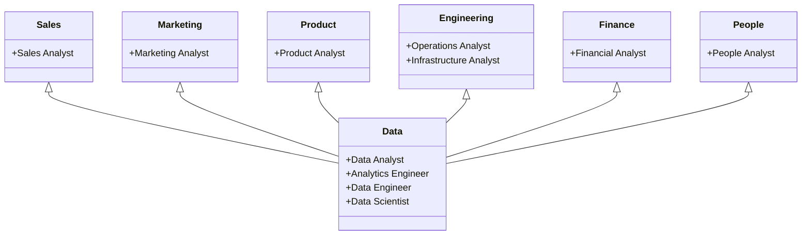

<link rel="stylesheet" type="text/css" href="/stylesheets/biztech.css" />

## Welcome to the Enterprise Data Team Handbook

* Our Vision is to **Contribute to GitLab's journey of becoming the leading AllOps platform by responsibly harnessing the power of data.**
* In pursuit of our vision, we will focus on 4 outcomes:

1. **Drive** company results by building trusted, reliable, and innovative data products and insights when and where needed.
2. **Minimize** time from question to insight to action, enabling team members to move faster by implementing efficient processes and enabling self-service analytics.
3. **Develop** and secure our data into a uniform, trusted asset through data protection & privacy, iterating on processes, people, and platforms.
4. **Enable** every team member to contribute to initiatives responsibly and with trust, building a powerful data-driven culture.

* Read our [Direction](https://internal.gitlab.com/handbook/enterprise-data/direction/) page to learn _what_ we are doing to improve data at GitLab.
* Our [Principles](/handbook/enterprise-data/organization/principles/) inform how we accomplish our mission.
* Watch our [Data Recruiting Video](https://youtu.be/4DlwsBIPxUw) to learn about the growing Data Program.

**Would you like to contribute? [Recommend an improvement](https://gitlab.com/gitlab-data/analytics/-/issues), [visit Slack #data](https://gitlab.slack.com/messages/data/), [watch a Data Team video](https://www.youtube.com/playlist?list=PL05JrBw4t0KrRVTZY33WEHv8SjlA_-keI). We want to hear from you!**

## How Data Works at GitLab

The collective set of people, projects, and initiatives focused on advancing the state of data at GitLab is called the **GitLab Data Program**. GitLab has two primary distinct groups within the Data Program who use data to drive insights and business decisions. These groups are complementary to one another and are focused on specific areas to drive a deeper understanding of trends in the business. The two teams are the (central) Enterprise Data Team and, separately, Function Analytics Teams located in Sales, Marketing, Product, Engineering or Finance. Watch the [Data Recruiting Video](https://youtu.be/4DlwsBIPxUw) to hear from some of the teams involved and what they are working on.

* The **Data Team** reports into Marketing office and is the Center of Excellence for enterprise insights & analytics (not operational), data science, data platform & infrastructure, BI technologies, master data, data governance and data quality. The Data Team is also responsible for the enterprise data strategy, building [enterprise-wide data models](/handbook/enterprise-data/platform/edw/), providing Self-Service Data capabilities, maintaining the [data platform](/handbook/enterprise-data/platform/#our-data-stack), developing [Data Pumps](/handbook/enterprise-data/platform/#data-pump), and monitoring and measuring [Data Quality](/handbook/enterprise-data/data-governance/data-quality/). The Data Team is responsible for data that is defined and accessed on a regular basis by GitLab team members from the [Snowflake Enterprise Data Warehouse](/handbook/enterprise-data/platform/#data-warehouse). The Data Team builds data infrastructure to power approximately 80% of the data that is accessed on a regular basis. The Data Team also provides a Data Science center of excellence to launch new advanced analytics initiatives and provide guidance to other GitLab team members.

* **Function Analytics Teams** reside and report into their respective divisions and departments. These teams perform specific analysis for business activities and workflows that take place within the function. These teams perform ad-hoc analysis and develop dashboards based on the urgency and importance of the analysis required, following the [Data Development](/handbook/enterprise-data/how-we-work/data-development/) approach. The most important and repeatable analysis will be powered by the centralized [Trusted Data Model](/handbook/enterprise-data/how-we-work/data-development/#trusted-data-development) managed by the central Data Team. Function Analytics Teams also build function-specific/ad-hoc data models and business insights models to solve for urgent and operational needs, not requiring trusted data features. Function Analytics Teams work closely with the Data Team in a variety of ways: expand GitLab's overall analytics capabilities, extend the [Data Catalog](/handbook/enterprise-data/data-governance/data-catalog/), provide requirements for new Trusted Data models and dashboards, validate metrics, and help drive prioritization of work asked of the Data Team. When data gaps are found in our business processes and source systems, the team members will provide requirements to product management, sales ops, marketing ops, and others to ensure the source systems capture correct data.

### Data Program Teams

The GitLab Data Program includes teams focused in the following areas:

* [Customer Success Operational Data Team](/handbook/customer-success/product-usage-data/)
* [Enterprise Data Team](/handbook/enterprise-data/)
* [Finance Analytics & Insights](/handbook/enterprise-data/analytics-and-insights/)
* [Marketing Strategy and Performance](/handbook/marketing/strategy-performance/)
* [Marketing Web Analytics](/handbook/marketing/inbound-marketing/search-marketing/analytics/)
* [People Analytics Team](/handbook/people-group/people-ops-tech-analytics/people-analytics/)
* [Product Data Insights](/handbook/product/groups/product-analysis/)
* [Analytics Instrumentation Group](/handbook/engineering//development/analytics/monitor/analytics-instrumentation/)
* [Sales Analytics](/handbook/sales/field-operations/sales-strategy/)

### How Data Teams Work Together

On a normal operational basis, the Data Team and Function Analyst teams work in a "Hub & Spoke" model, with the Data Team serving as the "Hub" and Center of Excellence for analytics, analytics technology, operations, and infrastructure, while the "Spokes" represent each Division or Departments Function analysts. Function analysts develop deep subject matter expertise in their specific area and leverage the Data Team when needed.  From time to time, the Data Team provides limited development support for GitLab Departments that do not yet have dedicated Function Analysts or those teams which do have dedicated Function Analysts, but might need additional support. The teams collaborate through [Slack Data Channels](/handbook/enterprise-data/#data-slack-channels), the [GitLab Data Project](https://gitlab.com/gitlab-data/), and ad-hoc meetings.

### The Data Platform & Architecture Team

The **[Data Platform Team & Architecture Team](/handbook/enterprise-data/organization/engineering/)** is part of the Enterprise Data Team and focuses on building and maintaing secure, efficent, and reliable data systems [data infrastructure](/handbook/enterprise-data/platform/). The Data Platform & Architecture Team is both a development team and an operations/site reliability team. The team supports all Data Pods with **available, reliable, and scalable** data compute, processing, and storage. Platform components include the Data Warehouse, New Data Sources, Data Pumps, Data Security, and related new data technology. The Data Platform team also drives the [Data Management processes](/handbook/enterprise-data/data-governance/data-management/). The Data Platform Team is composed of [Data Engineers](/job-families//marketing/enterprise-data/data-engineer/).

### Analytics Engineering Team

The **[Analytics Engineering Team](/handbook/enterprise-data/organization/)** transforms raw data into clean, structure and usable formats for data decision-making. The Analytics Engineering team also drives Enterprise Data Program and supports the wider data community. The team focuses on inventorying, integrating, maintaining, and governing the data at an Enterprise level. This includes collaborating with the business units and data teams in establishing and facilitating commonly accepted guidelines around Enterprise data along with building [enterprise-wide data models](/handbook/enterprise-data/platform/edw/), supporting Self-Service BI and Analytical capabilities by providing Data Enablement and required training to the Users on Enterprise Data Models.

### The Enterprise Insights & Data Science Team

The **[Enterprise Insights & Data Science Team](/handbook/enterprise-data/organization/data-science/)** utilize analytics and Machine Learning (ML) for insights into customer behavior and company performance. The Enterprise Insights & Data Science team focuses on delivering a complete view of the customer (Customer 360), predict customers that are likely to buy, expand or churn, develop models to predict the long-term value of customers, create detailed customer profiles, and deliver insights on company performance.  The Team acts as a Center of Excellence for predictive analytics and supports other teams in their data science endeavours by developing tooling, processes, and best practices for data science and machine learning. List of the current projects can be found in the [Data Science handbook page](/handbook/enterprise-data/organization/data-science/).

### Data Governance and Data Quality Team

The **[Data Governance and Data Quality Team](/handbook/enterprise-data/organization/)** focuses on building a data governance and data quality program that ensures our organization leverages data as a strategic asset with the highest standards of **integrity, reliability, and secure accessibility** which are enabled through robust policies, advanced technologies and a culture of collaboration. The team partners with cross functional teams including Enterprise Apps, Security and Legal to establish data policies, quality controls, metadata management and compliance with regulatory requirements.

### Data Job Families

The job families are designed to support all of the routine activities expected of a Data Team. In FY22 we are introducing two new job families, Data Scientist and Analytics Engineer.

* [Data Analyst](/job-families/marketing/enterprise-data/data-analyst/)
* [Data Scientist](/job-families/marketing/enterprise-data/data-science)
* [Analytics Engineer](/job-families/marketing/enterprise-data/analytics-engineer/)
* [Data Engineer](/job-families/marketing/enterprise-data/data-engineer/)
* [Data Governance and Quality Analyst](/job-families/marketing/enterprise-data/data-governance-and-quality-analyst/)
* [Data Governance and Quality Program Manager](/job-families/marketing/enterprise-data/data-governance-and-quality-program-manager/)
* [Manager, Data](/job-families/marketing/enterprise-data/manager-data/)
* [Director, Data](/job-families/marketing/enterprise-data/data-and-insights-executive/)

### How We Measure Impact

Our impact will be measured against 4 dimensions (these metrics will adjust as our data maturity increases and our focus areas change):

#### Data Platform Stability

* Infrastructure Cost vs Plan: This performance indicator tracks the financial position of the actual cost vs the planned costs for the data infrastructure (warehouse, ETL pipelines, etc.).
* Data Uptime: This performance indicator measures the % of time a data pipeline was providing data without reported incidents. This indicator is currently measured based on Monte-Carlo data, according to the configured (automatic) monitors on any given table in the `raw` data layer.

#### Data Governance and Data Quality

* % improvement in data quality metrics
* % data assets enriched with metadata
* % reduction in time to discover data

#### Data Adoption

* Data Monthly Active Users (DMAU): DMAU Measures the direct usage of the Data Platform by GitLab Team Members based on usage of the primary analysis tools we provide: Snowflake and Tableau. Over time we will include additional tools such as Jupyter and Data Studio, as well as usage of data pumped into EApps such as Marketo (PQLs), Gainsight (Usage Data), and Salesforce (Propensity Scores). A visualization of these numbers can be found in the [Data Monthly Active Users](https://10az.online.tableau.com/#/site/gitlab/workbooks/2049753/views) report.

* Data Monthly Active Users (DMAU) = Unique users of a Data system (i.e. Snowflake, Tableau) in a given month
* Data Maturity Score: measured annually, evaluates our current data maturity against 8 data capabilities:
  1. Strategy & Approach
  2. Culture & leadership
  3. Metrics & KPIs
  4. Organization & Skills
  5. Architecture & Integration
  6. Governance & Quality
  7. Deployment & Usage
  8. Technology & Operations
* Number of certified Tableau dashboards
* % total views from certified dashboards

#### Revenue/Efficiency Impact

First we have the evaluation criteria known as Dollar Value of our Results as calculated by the Data Value Calculator. We can use the [Data Team Value Calculator](/handbook/enterprise-data/how-we-work/#data-team-value-calculator) to calculate the dollar value of the initiatives we contribute to and the issues we complete.
Additionally we want to shift to a more aspirational measurement which is to measure the ARR impact or efficiency gain from each of our data products. Our data science models will be measured in the following ways:

* Propensity to Expand (PtE) and Purchase (PtP) - We will evaluate two metrics: 1) Incremental revenue impact 2) # of leads generated that are not currently in the sales funnel
* Propensity to Churn (PtC) - We will evaluate two metrics: 1) # of high propensity to churn customers that didn't churn 2) Incremental revenue impact

## How To Connect With Us

  <a href="https://gitlab.slack.com/messages/data/" class="btn btn-purple" style="white-space: initial;min-width: 0;width: auto;margin:5px;display:grid;align-items:center;height:100%;">Primary #Data Slack Channel</a>

  <a href="https://gitlab.com/gitlab-data/analytics/-/issues" class="btn btn-purple" style="white-space: initial;min-width: 0;width: auto;margin:5px;display:grid;align-items:center;height:100%;">Issue tracker</a>
  <a href="https://www.youtube.com/playlist?list=PL05JrBw4t0KrRVTZY33WEHv8SjlA_-keI" class="btn btn-purple" style="white-space: initial;min-width: 0;width: auto;margin:5px;display:grid;align-items:center;height:100%;">GitLab Unfiltered Data Team Playlist</a>
  <a href="https://www.worldtimebuddy.com/?pl=1&lid=2950159,5746545,4180439,1271439" class="btn btn-purple" style="white-space: initial;min-width: 0;width: auto;margin:5px;display:grid;align-items:center;height:100%;">What time is it for folks on the data team?</a>

 

### Data Slack Channels

* [#data](https://gitlab.slack.com/messages/data/) is the primary channel for all of GitLab's data and analysis conversations. This is where folks from other teams can link to their issues, ask for help, direction, and get general feedback from members of the Data Team.
* [#data-daily](https://gitlab.slack.com/messages/data-daily/) is where the Data Team tracks day-to-day productivity, blockers, and fun. Powered by [Geekbot](https://geekbot.com/), it's our asynchronous version of a daily stand-up, and helps keep everyone on the Data Team aligned and informed.
* [#data-lounge](https://gitlab.slack.com/messages/data-lounge/) is for links to interesting articles, podcasts, blog posts, etc. A good space for casual data conversations that don't necessarily relate to GitLab. Also used for intrateam discussion for the Data Team.
* [#data-engineering](https://gitlab.slack.com/messages/data-engineering/) is where the GitLab Data Platform team collaborates.
* [#bt-data-science](https://gitlab.slack.com/messages/bt-data-science/) is where the GitLab Data Science team collaborates.
* [#business-technology](https://gitlab.slack.com/messages/business-technology/) is where the Data Team coordinates with Business Technology in order to support scaling, and where all Business Technology-related conversations occur.
* [#analytics-pipelines](https://gitlab.slack.com/messages/analytics-pipelines/) is where slack logs for dbt runs and monte carlo analysis are output and is for analytics engineers to maintain. The DRI for tracking and triaging issues from this channel is shown [here](/handbook/enterprise-data/how-we-work/triage/#enterprise-data-triager).
* [#data-triage](https://gitlab.slack.com/messages/data-triage/) is an activity feed of opened and closed issues and MR in the data team project.
* [#data-pipelines](https://gitlab.slack.com/archives/C0384JBNVDJ) is where alerts from  the ELT pipelines / FiveTran/ Monte Carlo RAW layer anomalies  published and is for data engineers to maintain. The DRI for tracking and triaging issues from this channel is shown [here](/handbook/enterprise-data/how-we-work/triage/#enterprise-data-triager).

You can also tag subsets of the Data Team using:

* @datateam - this notifies the entire Data Team
* @data-engineers - this notifies just the Data Engineers
* @data-analysts - this notifies just the Data Analysts
* @analytics-engineers - this notifies just the Analytics Engineers
* @data-governance - this notifies just the data governance and quality team members

Except for rare cases, conversations with folks from other teams should take place in #data, and possibly the fusion team channels when appropriate.  Posts to other channels that go against this guidance should be responded to with a redirection to the #data channel, and a link to this handbook section to make it clear what the different channels are for.

### GitLab Groups and Projects

The Data Team primarily uses these groups and projects on GitLab:

* [GitLab Data](https://gitlab.com/gitlab-data) is the main group for the GitLab Data Team.
* [GitLab Data Team](https://gitlab.com/gitlab-data/analytics) is the primary project for the GitLab Data Team.

Though many of our GitLab projects are [internal only](/handbook/communication/confidentiality-levels/#internal), the rest are still [public by default](/handbook/values/#public-by-default).

You can tag the Data Team in GitLab using:

* @gitlab-data  - this notifies the entire Data Team
* @gitlab-data/engineers  - this notifies just the Data Engineers
* @gitlab-data/analysts - this notifies just the Data Analysts

### Team, Operations, and Technical Guides

|  **TECH GUIDES** | **INFRASTRUCTURE** | **DATA TEAM** |
| :--------------- | :----------------- | :-------------- |
| [SQL Style Guide](/handbook/enterprise-data/platform/sql-style-guide/) | [High Level Diagram](/handbook/enterprise-data/platform/#our-data-stack) | [How We Work](/handbook/enterprise-data/how-we-work/) |
| [dbt Guide](/handbook/enterprise-data/platform/dbt-guide/) | [System Data Flows](/handbook/enterprise-data/platform) | [Team Organization](/handbook/enterprise-data/organization/) |
| [Python Guide](/handbook/enterprise-data/platform/python-guide/) | [Data Sources](/handbook/enterprise-data/platform/)| [Calendar](/handbook/enterprise-data/how-we-work/calendar/) |
| [Airflow & Kubernetes](/handbook/enterprise-data/platform/infrastructure/#common-airflow-and-kubernetes-tasks) | [Snowplow](/handbook/enterprise-data/platform/snowplow/)  | [Triage](/handbook/enterprise-data/how-we-work/triage/) |
| [Docker](/handbook/enterprise-data/platform/infrastructure/#docker) | [Permifrost](/handbook/enterprise-data/platform/permifrost/) | [Merge Requests](/handbook/enterprise-data/how-we-work/mr-review/) |
| [Data CI Jobs](/handbook/enterprise-data/platform/ci-jobs/) | [DataSiren](/handbook/enterprise-data/platform/#datasiren) | [Planning Drumbeat](/handbook/enterprise-data/how-we-work/planning/) |
| [Rstudio Guide](/handbook/enterprise-data/platform/rstudio/) | [Trusted Data](/handbook/enterprise-data/how-we-work/data-development) | [Data Science Team](/handbook/enterprise-data/organization/data-science) |
| [Jupyter Guide](/handbook/enterprise-data/platform/jupyter-guide/) | | [Data Management](/handbook/enterprise-data/data-governance/data-management/) |
| [Meltano Guide](https://internal.gitlab.com/handbook/enterprise-data/platform/Meltano-Gitlab/) | | |
| [Data Onboarding](/handbook/enterprise-data/organization/programs) | | |
| [Learning Library](/handbook/enterprise-data/organization/learning-library/) | | |
| [Tableau Guide](/handbook/enterprise-data/platform/tableau/) | | |
| [Tableau Style Guide](/handbook/enterprise-data/platform/tableau/tableau-developer-guide/tableau-style-guide/) | | |

## Data Team Handbook Structure

* [Dashboards & Data You Can Use](/handbook/enterprise-data/data-governance/data-catalog/)
* [Data Learning and Resources](/handbook/enterprise-data/organization/learning-library/)
* [Data Programs](/handbook/enterprise-data/organization/programs/)
* [How The Data Team Works](/handbook/enterprise-data/how-we-work/)
  * [Calendar](/handbook/enterprise-data/how-we-work/calendar/)
  * [Data Analytics Team](/handbook/enterprise-data/organization/analytics/)
  * [Data Platform Team](/handbook/enterprise-data/organization/engineering/)
  * [Data Science Team](/handbook/enterprise-data/organization/data-science)
  * [Data Team Principles](/handbook/enterprise-data/organization/principles/)
  * [Data Management](/handbook/enterprise-data/data-governance/data-management/)
  * [Data Handbook Documentation](/handbook/enterprise-data/documentation/)
  * [Planning Drumbeat](/handbook/enterprise-data/how-we-work/planning/)
  * [Triage](/handbook/enterprise-data/how-we-work/triage/)
* [How The Data Platform Works](/handbook/enterprise-data/platform/)
  * [Data CI Jobs](/handbook/enterprise-data/platform/ci-jobs/)
  * [Data Infrastructure](/handbook/enterprise-data/platform/infrastructure/)
  * [Data Onboarding](/handbook/enterprise-data/organization/programs)
  * [Internship Experience](/handbook/enterprise-data/internship-experience/internship-experience.md)
  * [Data for Product Managers](/handbook/enterprise-data/organization/programs/data-for-product-managers/)
  * [Data Quality](/handbook/enterprise-data/data-governance/data-quality/)
  * [Data Services](/handbook/enterprise-data/data-service/)
  * [dbt Guide](/handbook/enterprise-data/platform/dbt-guide/)
  * [Enterprise Data Warehouse](/handbook/enterprise-data/platform/edw/)
  * [Jupyter Guide](/handbook/enterprise-data/platform/jupyter-guide)
  * [Meltano Guide](https://internal.gitlab.com/handbook/enterprise-data/platform/Meltano-Gitlab/)
  * [Permifrost](/handbook/enterprise-data/platform/permifrost/)
  * [Python Guide](/handbook/enterprise-data/platform/python-guide/)
  * [RStudio Guide](/handbook/enterprise-data/platform/rstudio/)
  * [SQL Style Guide](/handbook/enterprise-data/platform/sql-style-guide/)
  * [Snowplow](/handbook/enterprise-data/platform/snowplow/)
  * [Tableau](/handbook/enterprise-data/platform/tableau/)
  * [Tableau Style Guide](/handbook/enterprise-data/platform/tableau/tableau-developer-guide/tableau-style-guide/)
  * [Trusted Data Framework](/handbook/enterprise-data/platform/dbt-guide/#trusted-data-framework)
