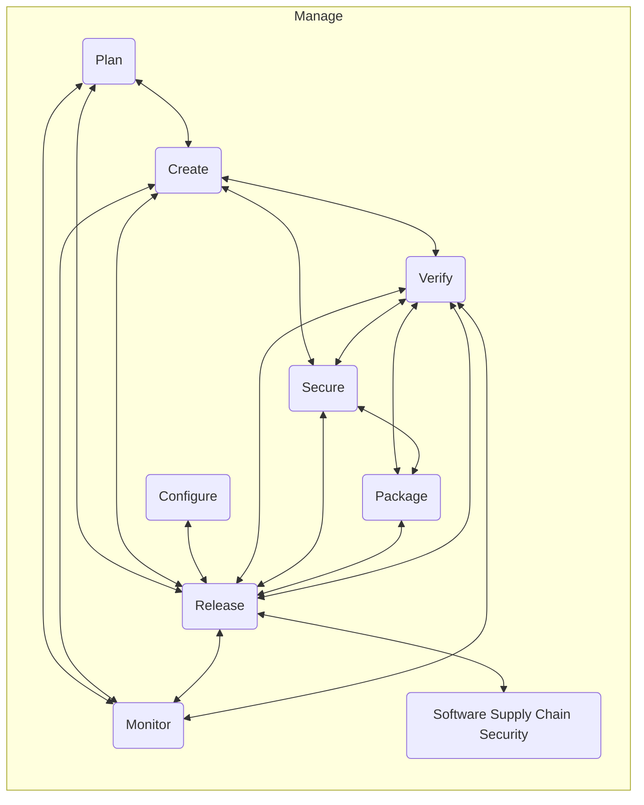

## Single application

GitLab is a [complete DevOps platform](https://about.gitlab.com/solutions/devops-platform/), delivered as a single application that does everything from project planning and source code management to CI/CD, monitoring, and security. The advantages of a single application are listed in the following paragraphs.

By delivering a single application we shorten cycle times, increase productivity,
and thus create value for our customers.

Other vendors offer a kit plane you have to assemble yourself, GitLab is a type certified aircraft.

### Single application vs multiple applications

For example, the experience of one enterprise customer that converted from multiple DevOps tools to GitLab was:

- Nine-times fewer hours of elapsed time from when a developer chooses to work on a change to when it is in production
- Ten-times fewer separate tools for purchasing to buy, for IT to install, and for users to have to authenticate to
- Four-times fewer hours of hands-on keyboard time and four-times fewer tasks for people to do, allowing them to be more productive
- Five-times fewer different teams requiring to be involved and four-times fewer handoffs between teams, allowing them to be more productive and making the time to value more predictable

### How does having one application vs many applications impact the workflow?

[Dataflow and source data](dataflow.html)

### Single authentication

You only have to login to one application. Users don't waste time logging in. You only have to set up one account. It is clear to users what account they should use. Due to less confusion phishing is harder.

### Single authorization

GitLab does not require you to manage authorizations for each of
its tools. This means that you set permissions once and everyone in your organization has the right access to every component.

### Single project

Users don't have to set up or ask others to set up a project across applications. This can be a major source of delays.

### Single setup

With [Auto DevOps](https://docs.gitlab.com/topics/autodevops/) your new projects have all the needed testing and deployment from the get go. And by having logging and security scanning happen automatically you reduce risk.

### Single interface

A single interface for all tools means that GitLab can always present the
relevant context. Relatedly, any feature is always in its most optimal location.
We don't have to force ourselves to create a new page to serve a new feature. The feature
will just appear in the best designed existing location, simplifying navigation.

Also, you don't lose information due to constant context switching between different interfaces.

Users don't have to switch between applications constantly.
Furthermore, if you're comfortable with one part of GitLab, you're comfortable
with all of GitLab, as it all builds on the same interface components.

### Single installation

Running GitLab means that there is only one single application to install, maintain, scale, backup, network, and secure.

### Single upgrade

Updating GitLab means that everything is guaranteed to work as it did before.
Maintaining separate components is often complicated by upgrades that change
or break integration points, essentially breaking your software delivery pipeline.
This will never happen with GitLab because everything is tested as an integrated whole.

### Single data-store

GitLab uses a single data-store so you can get information about the whole software development lifecycle instead of parts of it. With multiple applications you not only have multiple databases but also different definitions, processes. Multiple data-stores lead to redundant and inconsistent data. You don't have to duplicate data nor do manual entry. There is a single source of truth without having to build a data warehouse.

### Single overview

Automated links between environments, code, issues, and epics provide a better overview of project state and progress. All information is realtime and there is a coherent set of concepts and definitions.

### Single flow

Using a single application means you don't have to integrate 10 different products. This saves time from your developers, reduces risk, increases reliability, and lowers the bill of external integrators. The flow is better for the more than 100,000 organizations and over 2,000 people using GitLab that use the same flow to contribute and make it great. If you have a developer tools department, they can now focus on other tasks to make your developers more effective.

### Single vendor

You can deal with one vendor instead of multiple vendors pointing to each-other.

### Single training

Your end user training becomes less complex; a multi-vendor environment means
multiple trainers to manage.

### Single codebase

We prefer to offer a single application instead of a network of services or
offering plugins for the following reasons:

1. We think a single application provides a better user experience than a modular approach, as detailed by [this article from Stratechery](https://stratechery.com/2013/clayton-christensen-got-wrong/).
1. The open source nature of GitLab ensures that we can combine great open source products.
1. Everyone can contribute to create a feature set that is [more complete than other tools](https://about.gitlab.com/why-gitlab/). We'll focus on making all the parts work well together to create a better user experience.
1. Because GitLab is open source, the enhancements can become [part of the codebase instead](https://docs.gitlab.com/user/project/integrations/) of being external. This ensures the automated tests for all
functionality are continually run, ensuring that additions keep working. This is in contrast to externally maintained plugins that might not be updated.
1. Having the enhancements as part of the codebase also
ensures GitLab can continue to evolve with its additions instead of being bound
to an API that is hard to change and that resists refactoring. Refactoring is essential to maintaining a codebase that is easy to contribute to.
1. Many people use GitLab on-premises, and in such situations it is much easier to install one tool than install and integrate many tools.
1. GitLab is used by many large organizations with complex purchasing processes, and having to buy only one subscription simplifies their purchasing.

## Emergent benefits of a single application

A single application across the entire DevOps lifecycle has unique, emergent
benefits.

- It's no longer necessary to ask for access to each separate tool; everyone is
able to make use of all tools. Expect non-engineers to monitor deploys, follow
the development process, and directly contribute to QA by reporting findings.
- Vastly improved cycle time. Constant context switching, re-authentication and
lack of information slows down teams immensely. It sounds obvious, but having
everything you need available at all times makes for more efficient work.
- Tracking whether a change is being worked on, is live in an environment, or is
blocked no longer requires detective work. It's available everywhere and
accessible to everyone.

This is highlighted by analyst specified benefits of [Value Stream Delivery Platforms](https://about.gitlab.com/press/releases/2021-11-03-gitlab-inc-named-a-representative-vendor-in-new-gartner-market-guide/), of which GitLab is considered a representative vendor.

Some additional example benefits include:

### CI and container registry

Pushing from CI to the container registry: before GitLab, this requires you to create a
project and user account in a separate registry - and then on each job, credentials have to be passed
between CI and the registry. With GitLab, none of this is necessary, because GitLab knows who you are
and what your authorizations are in that project.

### Debugging issues

Because all decisions, code, changes and deploys happen in the same place and are linked to issues and merge
requests, GitLab has a full audit log of every decision, change and deploy. So if anything goes wrong,
discovering the source of the issues is simple and doesn't require checking multiple apps, teams and logs.

### Monitoring from merge request

You deploy a change by merging a merge request. Because GitLab has monitoring built-in, it's able to show
in the merge request that e.g. the error rate has increased. The responsible developer sees this with the
correct context and can start to solve the issue immediately.

## No need to integrate multiple tools

Enterprises that use a complex toolchain often need [20 people to manage all the interconnections](https://about.gitlab.com/customers/) while a single person can do the same work to administer GitLab. Here is a list of the various integrations necessary between tools:

1. Issue tracking <=> Kanban boards, preferably they show the same issues.
1. Issue tracking <=> Version control, close issues when you merged code in your branch.
1. Issue tracking <=> Code review, the code review has a link to the issue it is related to.
1. Issue tracking <=> CD/Release automation, see which changes are implemented by which deploy / are live and where.
1. Issue tracking <=> Monitoring, link the initiative to the impact on metrics.
1. Kanban boards <=> Version control, close issues when you merged code in your branch.
1. Version control <=> Code review, the code review happens on a branch that is updated.
1. Version control <=> Continuous integration, run CI automatically on the default branch, see CI status per branch.
1. Version control <=> CD/Release automation, see whether a particular commit is live somewhere.
1. Version control <=> Security testing, see whether a commit is vulnerable / with out-of-date dependencies.
1. Code review <=> Continuous integration, see the test results in the code review screen.
1. Code review <=> Security testing, see the test results in the code review screen.
1. Code review <=> CD/Release automation, see and control pushing to new environments in the code review screen.
1. Code review <=> Monitoring, see the effect of a code change on the metrics.
1. Continuous integration <=> Security testing, run security testing as part of CI.
1. Continuous integration <=> Container registry, push the container that is built to the registry.
1. Continuous integration <=> CD/Release automation, deploy if green, or don't deploy when red.
1. Continuous integration <=> Configuration management, configure the testing.
1. Security testing <=> CD/Release automation, prevent insecure code from being deployed.
1. Security testing <=> Container registry, scan the container registry.
1. Container registry <=> CD/Release automation, pull the container.
1. CD/Release automation <=> Configuration management, configure the deployment.
1. CD/Release automation <=> Monitoring, see the release in the monitoring.
1. Configuration management <=> Monitoring, configure the monitoring.

### Flowchart

Below is a flowchart illustration of the various integrations necessary between tools specified above.

### Security benefits

When we have [added aggregated logging](https://gitlab.com/gitlab-org/gitlab-ee/issues/3711) we can move on to some security features that only a single application for the whole DevOps lifecycle can offer out of the box:

1. Log complete requests (header, payload, cookie) from Nginx to Elastic Search to form the basis of an Intrusion Detection System (IDS) and give you complete sitemaps. We can probably use something like `client_body_in_file_only` and we don't need something like [MITM proxy](https://mitmproxy.org/) since we can use the SSL keys.
1. Log complete sessions, that contain multiple requests over time, such as logging in and creating a new object before the final request is possible.
1. Modify the payload or headers with something like [wfuzz](https://github.com/xmendez/wfuzz) and content like [seclists](https://github.com/danielmiessler/SecLists), run it against a review app and see what http status returns change from 2xx to 5xx and/or where you can do a [SQL string escape](https://github.com/thlorenz/sql-escape-string). Show a sorted list of starting with the most likely vulnerabilities.
1. When running the above fuzzing payloads see if they hit new code paths by instrumenting the application with runtime application self protection and then sort by seeing what code paths are the least covered by the unit tests ran by GitLab CI.
1. Any [error tracking](https://gitlab.com/gitlab-org/gitlab-ee/issues/5686) report contains all the requests in that user session to generate that state.
1. When someone submits a vulnerability report combine this with any 500 error stack traces stored in [error tracking](https://gitlab.com/gitlab-org/gitlab-ee/issues/5686).
1. When fuzzing or a human hits a vulnerability generate a [pcap file](https://en.wikipedia.org/wiki/Pcap) with the request and start scanning production traffic for this.

### Lower operating expense (OpEx)

Building and maintaining integration between multiple individual point tools comes with additional overt and
hidden costs.

#### Overt cost

The overt cost of paying for [licensing and support of multiple tools](https://about.gitlab.com/calculator/) is
higher than a single application. A single application can charge less because its fixed costs are distributed
across the functionality, whereas separate vendors each need to pay those costs themselves for each of their solutions.

#### Hidden cost

Businesses that manage a toolchain pay hidden operating costs in the form of engineering time needed to
build and maintain the toolchain instead of using those engineering resources to write software with
business logic that delivers differentiated value. For a large enterprise this can be the difference
between [paying 20 engineers vs one engineer](/handbook/marketing/brand-and-product-marketing/product-and-solution-marketing/)
to maintain your tools.

### Further examples

1. Planning (code merge closes issues updates epic) - Always up to date and across different projects
1. Move from issue board to issue tracker - Kanban boards are consistent with issue tracker
1. Getting the stack running for a new developer - Can start developing without setup time or help
1. Merge request contains monitoring, security, etc. information - Can see overview in MR of tests, quality, performance, browser performance, artifacts, discussion, environment, rollback
1. Security (security in parallel, instead of separate) - Security tests results can be aggregated
1. Identify vulnerable applications quickly and automate the remedy
1. Add the build application to a container registry - No need to set up a project in the container registry and pass credentials around
1. Need to find an artifact from a CI build - Artifacts are accessible directly from any merge request
1. Reviewing the application - QA test can start work immediately
1. Run CI/CD/Security/Quality without having to configure anything - One click to deploy to production
1. Need to scale up a containerized application - Scaling up and down is just another button inside your project with all relevant data to make a decision
1. A project adopts containerization - New servers are automatically provisioned via Kubernetes
1. Rollback a failing deployment automatically without human intervention
1. Activity feeds span all product categories, across DevOps lifecycle
1. Cycle time (real time and integrated) - Can view activity across DevOps lifecycle
1. Permission levels and settings - User rights are consistent across all applications
1. Audit log - What a person was able to do across the lifecycle in audit logs
1. Geo does not just to SCM, it also does CI, CD, issue tracking - People at other location have quick access to the whole DevOps-lifecycle, not just repos
1. Easier to administer then 10 different applications - The flow between the activities doesn't break because of updates to a single step in the life-cycle
1. Start a new microservice project - A project has all tools in it, no need to find out how this project is named in other tools
1. Someone new joins the organization - Users automatically have access to all tools that are relevant for their role, without creating a ticket and waiting

### Conversational Development

Conversational development carries a conversation across Departments and teams
through the DevOps lifecycle, involving gatekeepers at every step. By providing
relevant context, a feature that is only possible with an integrated solution
like GitLab, we can reduce cycle time, making it easier to diagnose problems and
make decisions.

Concretely, conversational development in GitLab means that a change can be
easily followed from inception to the changes it made in performance and
business metrics and feeding this information back to *all* stakeholders
*immediately*.

Effectively, this allows cross-functional teams to collaborate effectively.

### Review Apps

Review apps are the future of change review. They allow you to review not just
the code, but the actual changes in a live environment. This means one no longer
has to check out code locally to verify changes in a development environment,
but you simply click on the environment link and try things out.

Only a tool that combines code review with CI/CD pipelines and integration with
container schedulers (Kubernetes) is able to quickly create and shut down review
apps and make them part of the review process.

### Cycle Analytics

Cycle analytics tell you how what your time to value, from planning to
monitoring is. Only by having direct access to each step in the software
development lifecycle, GitLab can give actionable data on time to value.

This means you can see where you are lagging and make meaningful change to ship
faster.

### Container registry integrates with CI

Every GitLab projects comes with a container registry. That means there is no
need for elaborate configuration to be able to use and push container images in
CI. Rather, all you have to do is use a [pre-defined](https://docs.gitlab.com/user/packages/container_registry/)
variable in
your CI configuration file (`.gitlab-ci.yml`).

### Use cases, not modules

Sometimes users ask if GitLab has particular module that contains a set of
features. A modules-mindset results in narrowly-focused solutions and redundant
features and abstractions. GitLab is a single application that solves entire use
cases that might touch many parts of GitLab, without creating additional
unnecessary complexity.

### Existing features and data accrue value over time

As GitLab breadth expands, but is maintained as a single application, new
features are continually back-integrated into existing features. This means that
existing features and the data that they have already generated over time accrue
new value for very little cost in the context of the new features and their
use cases.

## Trend Towards DevOps Platform Consolidation

Continuing apace after Microsoft's 2018 [acquisition of GitHub](https://blogs.microsoft.com/blog/2018/10/26/microsoft-completes-github-acquisition/), the trend to consolidate DevOps companies seems here to stay. In January 2019, [Travis CI was acquired by Idera](https://techcrunch.com/2019/01/23/idera-acquires-travis-ci/), and in February 2019 we saw [Shippable acquired by JFrog](https://techcrunch.com/2019/02/21/jfrog-acquires-shippable-adding-continuous-integration-and-delivery-to-its-devops-platform/). Atlassian and GitHub now both bundle CI/CD with SCM, alongside their ever-growing related suite of products. In January 2020, [CollabNet acquired XebiaLabs to build out their version of a comprehensive DevOps solution](https://www.tpg.com/news-and-insights/collabnet-versionone-and-xebialabs-combine-create-integrated/).

It's natural for technology markets go through stages as they mature: when a young technology is first becoming popular, there is an explosion of tools to support it. New technologies have rough edges that make them difficult to use, and early tools tend to center around adoption of the new paradigm. Once the technology matures, consolidation is a natural part of the lifecycle. GitLab is in a fantastic position to be ahead of the curve on consolidation, as we're already considered a representative vendor in this [newly defined market](https://about.gitlab.com/analysts/gartner-vsdp21/), but it's a position we need to actively defend as more competitors start to bring legitimately integrated products to market.
