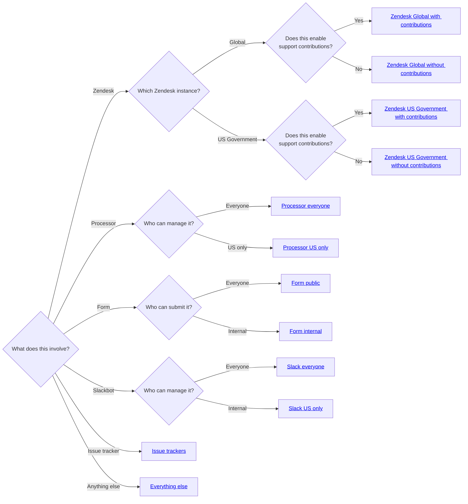

The exact methods to setup a project managed by Support Readiness highly depend
on a number of factors. These factors will determine exactly *how* on will setup
the project in question. To determine which method to use, follow the below
questions and subsequent information.

**NOTE** If you are looking to make a contact management project, you are on the
wrong page! Go [here](../../gitlab/contact_management_projects) instead.

## Is this in any way related to our Zendesk instances?

If what you are working with is going to be managing anything within our Zendesk
instances (such as macros, triggers, SLA, etc.), this is the section you want to
use.

**NOTE** This does include processors that run solely off data sent from Zendesk
to the processor itself. An example of this situation would be a "ticket
processor".

### Is this related to Zendesk Global?

If what you are working with is going to be managing anything within our Zendesk
Global instance (such as macros, triggers, SLA, etc.), this is the section you
want to use.

To determine how to setup the project, the final question you need to ask
yourself is "Does this enable support contributions?"

- If it does enable support contributions, refer to
  [Zendesk Global with contributions](zendesk_global_with)
- If it does not enable support contributions, refer to
  [Zendesk Global without contributions](zendesk_global_without)

### Is this related to Zendesk US Government?

To determine how to setup the project, the final question you need to ask
yourself is "Does this enable support contributions?"

- If it does enable support contributions, refer to
  [Zendesk US Government with contributions](zendesk_usgov_with)
- If it does not enable support contributions, refer to
  [Zendesk US Government without contributions](zendesk_usgov_without)

## Is this a processor?

If what you are working with is going to be acting as a processor (i.e. it takes
submissions via a form and processes those), this is the section you want to
use.

To determine how to setup the project, the final question you need to ask
yourself is "Can all of Support Readiness manage this?"

- If all of Support Readiness can manage it, refer to
  [Processor (everyone)](processor_all)
- If only US citizens can manage it, refer to
  [Processor (US only)](processor_us_only)

## Is this a form?

If what you are working with is going to be acting as a form, this is the
section you want to use.

To determine how to setup the project, the final question you need to ask
yourself is "Who is the form open to?"

- If it is open to the public (i.e. anyone can file submissions), refer to
  [Form (public)](form_all)
- If it is only for internal use only (i.e. only GitLab team members can file
  submissions), refer to [Form (internal)](form_private)

## Does this solely interact with Slack?

If what you are doing has the primary purpose of interacting with Slack, this is
the section you want to use.

To determine how to setup the project, the final question you need to ask
yourself is "Can all of Support Readiness manage this?"

- If all of Support Readiness can manage it, refer to
  [Slack (everyone)](slack_all)
- If only US citizens can manage it, refer to [Slack (US only)](slack_us_only)

## Is the project solely an issue tracker?

If what you are doing has the primary purpose of acting as an issue tracker,
this is the section you want to use.

Refer to [Issue trackers](issue_trackers).

## Does nothing on this page fit your situation?

If nothing above has matched, refer to [Everything else](everything_else)

## I like mermaid charts instead

No worries, we got you covered:

