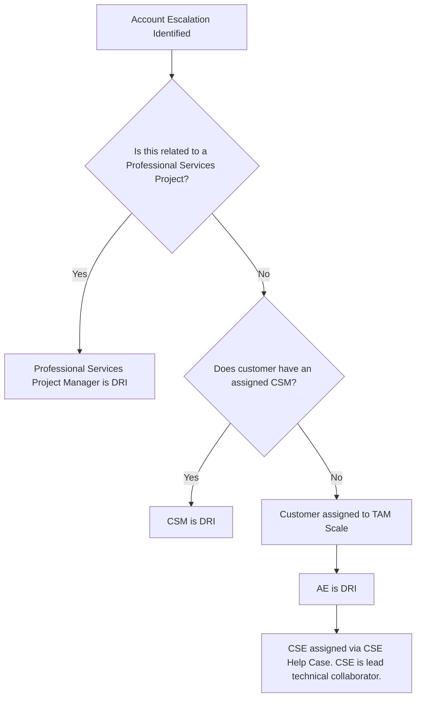

View the [CSM Handbook homepage](/handbook/customer-success/csm/) for additional CSM-related handbook pages.

---

## Background

Escalations can take at least two different forms:

1. Account Escalation.  This occurs when the customer expresses or a GitLab team member identifies that a customer is facing a challenging situation that may or may not relate to a specific support ticket. Anyone in GitLab can [open an account escalation](#opening-the-escalation) and [circulate it to the leadership of the appropriate group to find a DRI](#escalation-dri).
1. Support Ticket Attention Requests (STAR).  This occurs when an open support ticket is deemed moving too slowly.

The purpose of this handbook entry is to describe the process for account escalations.  Please see the [Support Ticket Attention Requests](/handbook/support/internal-support/support-ticket-attention-requests/) for details on how to request a support ticket escalation. For a detailed walkthrough of the process, please login to GitLab Unfiltered and view this [video](https://youtu.be/-nDaRndgy4Y).

## Objective

Define the process for managing account escalations and define a framework for communications, activities, and expectations for customer escalations.

## Scope

This process addresses escalations for CSM-assigned customers. This process can also apply to other segments if a strategic partnership or relationship exists. Any GitLab team member can escalate an account on behalf of the customer.

## Definitions of Severity Levels

| Severity Level | Description | Cadence | Levels of Involvement |
| -------------- | ----------- | ------- | --------------------- |
| Critical | Major issue(s) significantly impact customers' ability to deploy or use a solution, risk loss of or use of a solution, high risk loss of a customer or significant contraction, or significant risk to the relationship and brand. | Daily | VP of Sales, Product, CRO, CEO, VP of Customer Success, Global/PubSec CSM Leader |
| High | Major issue(s) significantly impact a customer's ability to deploy or use a solution, risking current adoption, risk of loss of customer or contraction, future growth on the account, and damage to the relationship. | Multiple times per week | VP of Sales, Product, CRO, CEO, VP of Customer Success, Global/PubSec CSM Leader |
| Medium | Issue(s) impact a customer's ability to deploy or use the product, risking current adoption and renewal. | Weekly to Bi-weekly | Global/PubSec CSM Leader |
| Low | Issue(s) impacting a customer's ability to deploy or use the product, risking customer value realization, timeline, customer satisfaction, and adoption levels. | Standard Communication | Regional CSM Manager, Account Manager |

- Cadence refers to the cadence of internal and external meetings and communications to the customer.
- Level of involvement defines scope of internal communication and awareness. Others can be included based on the type of issues involved.

### Escalation DRI

The DRI for the escalation is determined by evaluating these options in order:

1. If the escalation is related to an ongoing Professional Services project, the Professional Services Project Manager will be the DRI of the escalation.
1. If the escalation is NOT related to an ongoing Professional Services project and there is a CSM assigned to the account, the CSM will be the DRI.
1. If the customer does not have an assigned CSM but is assigned to TAM Scale (Customer Success Engineering), then the CSE assigned via the  [CSE Help case](/handbook/customer-success/csm/segment/cse/cse-operating-rhythm/#cse-engagement-request-process) will be lead technical collaborator on the escalation. The AE will be the DRI (managing the account), as defined by the [CSE DCI Matrix](/handbook/customer-success/csm/segment/cse/#cse-operating-rhythm).

At the beginning of the escalation, the DRI must be determined - the DRI owns the following responsibilities and key steps:

- Overall articulation of the approach to resolution, including ensuring the plan and approach is understood
- Coordination of internal GitLab and customer resources to drive troubleshooting and resolution of the issue
- Management of customer and internal communications, both async and synchronous
- Ownership of next steps, ensuring these are determined, communicated clearly with appropriate timelines to meet the level of urgency

### Escalation (For Non Professional Services Projects)

- The DRI is responsible for managing the account engagement (not the ticket), including:

  - Management of internal team and customer meetings for follow-up activities
    - Note: To ensure the DRI does not slow the resolution of issues, the DRI doesn't need to be in all meetings (e.g., technical troubleshooting with the customer and support/development)
  - Driving and coordinating the escalation process internally and with the customer, including associated communications and executive-level meetings
  - Opening the CS Help - Escalation Support case in Salesforce
  - Managing all assigned escalation tasks in Gainsight
  - Acting as an escalation point for customer-related issues (e.g., delayed response, open actions, non-compliance installation or product use, etc.)
  - Developing the business case justification and escalation to Product for escalations related to enhancement requests
  - Posting updates to Gainsight timeline & keeping the temporary Slack channel and the `#escalated_customers` slack channel updated.

- Support Engineering is responsible for:

  - Collaborating with technical resources (e.g., Development, Quality Assurance, SREs, and Support Engineering staff) to drive resolution of the technical issues
  - Managing the 24x7 incident resolution and escalation process (i.e., Support Engineering, SRE, Development)
  - Supporting executive and customer calls (as needed)

If an escalation is opened as high or critical, and the escalation is product related, a Product DRI is required. Please assign the applicable Product DRI from this [list](https://docs.google.com/spreadsheets/d/1x44kzJE4_Ixj20utn4g5Mggn1Jc3kKMWaY16F2WmLWg/edit#gid=242012002).

### What's the difference between an account escalation or an incident escalation?

- This page describes the account level risk meaning the customer impacting issues could be a single incident or an aggregation of issues. The assessment considers impact to the customer, risk to future business with that customer, and GitLab brand.
- Technical Support is ultimately accountable for driving resolution to the support case, including escalation to Engineering, Security, and/or Infrastructure teams.  Incident escalation processes should be leveraged for a single incident / support case.

- [Declare a GitLab.com Incident](/handbook/engineering/infrastructure/incident-management/#report-an-incident-via-slack) if you suspect a widespread issue on GitLab.com
- [Escalate an individual support ticket to Support Management](/handbook/support/internal-support/support-ticket-attention-requests) for cases with context that necessitate they should be handled outside of standard priority order.
- Have the customer [trigger Emergency Support](https://about.gitlab.com/support/#how-to-trigger-emergency-support) for S1/instance down issues to connect directly with the Support Engineer on-call.
  - You can also [page the on-call support manager](/handbook/support/on-call/#engaging-the-on-call-manager) in cases where you've received word that a customer attempted to raise an emergency, but the on-call engineer was not paged.
- This page outlines the additional support and operational procedures for the varying levels of account escalation.

## Initiating, Managing and Closing an Escalation

The following steps are to be taken by the escalation DRI:

### Opening the Escalation

**Immediately**

1. Create a [slack channel](#temporary-slack-channel) to facilitate communication internally at GitLab during the escalation.
1. [Identify Escalation DRI and immediate asks](#identify-escalation-dri-and-immediate-asks)
1. Ensure that the [escalation is declared](#declare-the-escalation) in `#escalated_customers`.
1. Create an [CS Help request](#cs-help-request)

**Within 24 hours**

1. Set up and document an [internal standup cadence](#internal-standup-cadence) series while the escalation is running and put the details in the escalation case.

**Ongoing**

1. Post updates in the Gainsight case CTA & Slack channels according to the cadence described in the [definitions of severity levels](#definitions-of-severity-levels).
1. Keep exit criteria and DRIs up to date in the [CS Help request](#cs-help-request)

#### Temporary Slack Channel

This channel will remain open until the escalation is closed and should be listed in the escalation case. Name the channel #esc_customername (must start with #esc_ to be included in our data retention policy) and ensure it is a public channel so that relevant parties can be easily added/find the channel. Some more tips & tricks for opening and managing the temporary slack channel can be found below:

- a. Create an opening message in the escalation channel which should include the link to the escalation case + the initial ask. Also link to the customer notes doc.
  - Example for a potential opening message to get things going:
    - "*Welcome! This is the channel for the <CUSTOMER_NAME> escalation regarding ongoing performance problems which are impacting the whole user base.*"
      - *The escalation case is ready and available at "<*LINK*>"*
      - *The initial ask/need from DRI (CSM) to GitLab management is defined in the escalation case - Quote:*
        - "*We need a GitLab team (member) who can engage with the customer on a daily basis to further analyze the performance issues root cause(s) and identify potential changes to reduce the performance problems for the  users.*"
        - "*Once the root causes are identified, we need a team working with the customer to implement required changes, which may range from configuration updates to changing the architecture of the GitLab platform or involving cloud vendor support for changes in underlying infrastructure.*"
    - "Whats next?"
      - "Our next sync with the customer team is scheduled for Monday at 10:30am CEST where we would like to have the team (member) defined internally, who can then be introduced to the customer (can be a separate call at afternoon time) to engage in the following days."

- b. If posted, pin the opening message to the channel, so that it is easily available for everyone. Also add the escalation case link as a SLACK channel bookmark.

#### CS Help Request

If an [Escalation (For Non Professional Services Projects)](#escalation-for-non-professional-services-projects) has been created, CSMs should create an escalation case in Salesforce. Steps for opening the case:

1. Navigate to the account page in Salesforce
1. Navigate to the next open renewal opportunity under "Opportunities" (Note: if you're having trouble finding the opportunity, you may need to change the Salesforce App. Click the 9-dotted box in the upper left corned and change the Salesforce App to "Sales")
1. In the top right corner, select the "CS Help" button
1. Select the case type: At-Risk Account Help (CSM red accounts & CSM/CSE escalations)
1. Fill out the required fields in the At-Risk Account Case
1. Click "Create case"
1. Complete other fields in the opened case: Customer Escalation Slack channel, Customer Collaboration project, Customer meeting notes, Escalation Exit criteria. At this time, you can also edit any of the fields initially filled out when opening the case.

For a CSM Managed account, the Case Owner should be the assigned CSM. For a CSE account, the Case Owner should be the regional CSE leader who will then assign to a CSE.

The Salesforce case will create a Gainsight CTA. A sync between Salesforce and Gainsight happens every 2 hours. Once the Gainsight CTA is created, the Case Owner will receive Gainsight notifications to complete required tasks. Data is bidirectional between Salesforce and Gainsight, so changes can be made in either tool. However, all escalation updates must be made in the Gainsight CTA.

#### Internal Standup Cadence

Set up and document an internal standup cadence series while the escalation is running and put the details in the escalation case.

- Major stakeholders from each team involved in the escalation should be invited directly to any calendar invite.
- Post about the internal standup in the temporary slack channel.
- Post the escalation case URL in the temporary slack channel and pin the message so it's easy to find.
- Tip: 10min before each standup, post the link to the escalation case and customer notes doc with a note that the standup will happen at the scheduled time. You can also schedule & automate the message via SLACK.

During the internal cadence, be sure to note any changes in exit criteria or DRI and make those changes in the escalation case.

#### Identify Escalation DRI and immediate asks

Make sure you write down the initial ask & needs (to initially make progress) in this escalation, as clearly as possible and add a [bookmark](https://support.google.com/docs/answer/45893?hl=en&co=GENIE.Platform%3DDesktop#zippy=%2Ccreate-a-bookmark) to it. You can link to it in the initial message within the [escalation slack channel](#temporary-slack-channel) channel. As mentioned, be as specific as possible, as the GitLab exec / management team needs to understand the escalation exit criteria.

For example:
    - Required skills (Remote EMEA Timezone)
    - Ability to analyze production logs
    - Familiarity with large-scale production architecture for GitLab
    - Ability to understand SQL queries
    - Familiarity with PostgreSQL, Patroni, PGBouncer

#### Declare the escalation

After the escalation case is opened in Salesforce, you will need to post in the `#escalated_customers` channel to declare the escalation. Here's an example message:

- New Escalation
- **Customer**: "<customer_name>"
- **Slack Channel**: "#<esc_customername>"
- **Meeting Notes**: "<LINK: customer meeting notes>"
- **SFDC Escalation case URL**: "<LINK: escalation case>
- **Severity**: High
- **Status**: Opened
- **Product DRI**: "[Assigned Product DRI](https://docs.google.com/spreadsheets/d/1x44kzJE4_Ixj20utn4g5Mggn1Jc3kKMWaY16F2WmLWg/edit#gid=242012002)"
- **Support DRI**: "If support involvement is necessary use the @support-manager-oncall slack handle. Please ensure a support ticket is opened with a description of the issue. Support will engage with Engineering by following their [RFH process](/handbook/support/workflows/how-to-get-help/#how-to-formally-request-help-from-the-gitlab-development-team)."
- **Description**: "<Example <Customer> platform is impacted by performance problems since several weeks and users are affected on a daily base which is driving the customer into a critical state. The performance problems are also risking their our license expansion.>"
- **FYI**: "<TAG_YOUR_MANAGER_HERE>"

If the escalation is product related, a Product DRI is required. Please assign the applicable Product DRI from this [list](https://docs.google.com/spreadsheets/d/1x44kzJE4_Ixj20utn4g5Mggn1Jc3kKMWaY16F2WmLWg/edit#gid=242012002). The Product DRI should be added to the #esc_customername channel and will drive any product related items throughout the escalation.

#### Posting in `escalated_customers`

To keep noise to a minimum, posting in `#escalated_customers` should happen only at key moments:

- when the escalation is identified and created
- when the escalation is closed or risk reduced to standard business process to manage (i.e., issue resolved and monitoring the solution)
- when there is a change in the priority of the escalation

The `#escalated_customers` channel is for awareness only and is not intended to replace the dedicated account slack channel, support channels, or the temporary escalation channel. Leverage the temporary escalation channel for daily communication, collaborating with team members, and providing executive updates.

### Managing the Escalation

The DRI owns the functions as outlined here:

- If an escalation status significantly changes, make an update in the `#escalated_customers` slack channel. Be sure to ping all DRIs involved in the escalation, as well as post in the temporary customer slack channel
- Update the temporary escalation slack channel daily, at minimum
- The escalation progress should also be communicated to the customer on a regular basis - expectation is 3 or more times a week depending on the situation.

Tips & Tricks:

- Create a daily reminder (at afternoon before you leave, for example) in your Google calendar just for yourself to update the escalation case + temporary slack channel with latest status/next steps. This ensures everyone is kept informed.
- Depending on the state of the escalation, also think about setting up an internal cadence meeting and include all necessary team members.
  - CSM, AE, SA, CSM & Sales leadership, and potentially other involved stakeholders.

### Closing the Escalation

- To close an escalation, a clear alignment between GitLab stakeholders and the customer (including documentation in an issue or email) is required. Both parties need to agree the situation is resolved.

- If the customer requests an RCA and the escalation was platform-related, GitLab engineering will lead the RCA and will provide it in writing to the corresponding GitLab DRI, who is managing & closing the escalation.

- When the issue(s) related to the escalation are resolved or move into a non-escalated state:

  - Post an Escalation Closure in the Gainsight CTA with the status and resolution. Be sure to use the "At-Risk/Escalation - Closure" template in the update.
  - Copy that Escalation Closure update and post in the `#escalated_customers` slack channel.
  - Archive the temporary Slack channel
  - Update the customer's CSM Sentiment in Gainsight to reflect the new state of the account.

- Gainsight Escalation Closure question template:

Please provide a closure update answering the following questions:

1. Did the at-risk situation end with a positive outcome, negative outcome, or no outcome?
1. Were the defined exit criteria met?
1. Give a brief summary of the actions of the team that helped close out this at-risk ticket

## CSM Manager's role in Escalations

The CSM Manager's responsibility is to ensure that the CSM is familiar with the above process and is actively managing the escalation, including the Slack Channel updates and the management of the escalation doc.

When a customer is in an escalated state, the path to resolution must continue to move forward, with both the internal stakeholders and the customer clear on current actions and next steps. The CSM manager is responsible for ensuring that this forward-motion and clear alignment is present and for stepping in and driving action or alignment where necessary.

## Engineering's role in Escalations

Engineering support will usually come via Support Engineering, however it's worth noting that under some conditions [Engineering / Product may prioritize bug fixes and feature requests](/handbook/engineering/#critical-customer-escalations) related to an escalation.

## Product's role in Escalations

At times Product may be needed to support an escalation. This could be due to uncovering a flaw or issue or surfacing feedback to help influence prioritization or workarounds to address the escalations. In most cases CSM and Support will work directly with a PM responsible for the area.

Occasionally, customers will require a product leader to act as a stable counterpart to support an escalation. This will ensure customers don't need to understand how we're organized, or need to get bounced around between PMs during an escalation. To achieve this we will follow this process:

1. CSMs will evaluate each account that reaches a high or critical escalated state, and determine if a Product member is needed.
1. From there, if the escalation reaches a High state a Group Product Manager or Product Director will be assigned. If it reaches a critical state a PLT member will be assigned.
1. During the escalation the GMP+ Product leader will stick with the customer and escalation and operate as a stable counterpart. They will bring in additional PMs as needed to help address the concerns, but will remain engaged in Slack, and on calls with the customer to be a consistent face and representative of the Product division.
1. Individual PMs may roll in and out of the escalation but the assigned GMP+ product counterpart will remain attached until the escalation is resolved.

## CSE's role in Escalations

- Lead customer facing calls focused on discovery, de-escalation, technical guidance. Determine the customer's exit/success criteria to consider the escalation resolved.
- Coordinate cross-functionally to determine path forward, potential workarounds and best practice recommendations.
- Provide summaries in account escalation Slack channel on a cadence appropriate to the [defined escalation severity level](/handbook/customer-success/csm/escalations/#definitions-of-severity-levels).
- Share updates to the customer via email.
- Document in new GitLab issue for tracking/pattern matching for future reference. Example: https://gitlab.com/gitlab-com/customer-success/customer-success-engineering/scale-cse/-/issues/140

## Related Links

- [Support Engineering Page](/handbook/support/) and [Support Engineering Escalation Procedures](/handbook/support/workflows/working-with-issues/)
- [Product Escalation Issue Template](https://gitlab.com/gitlab-com/Product/issues/new?issuable_template=Product-Support-Request) to request Product Team support for roadmap / future needs, prioritization of enhancements and/or issues and troubleshooting of customer issues.
- [Customer Health Assessment and Account Triaging](/handbook/customer-success/csm/health-score-triage/)
