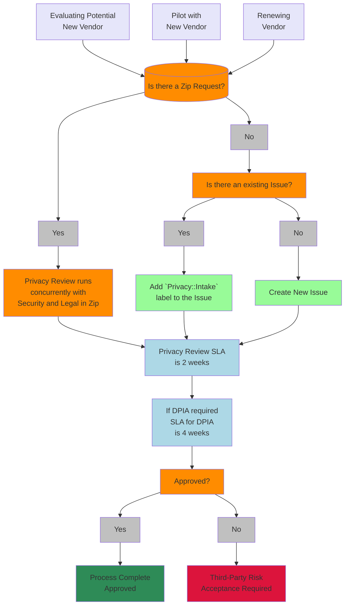

The Privacy Team is part of the Legal and Corporate Affairs Team. We provide support and guidance to uphold consistent business processes around the proteciton of personal data as it relates to GitLab customers, users, Team Members, and other natural persons. We collaborate cross-functionally and serve as advocates to ensure that the data privacy practices of GitLab meet the needs of our cross-functional partners and are continually balanced with an ever-changing global data privacy and protection landscape.

## Quick Links

- [What is data privacy](/handbook/legal/privacy/#what-data-privacy-means)
- [Privacy Terms](/handbook/legal/privacy/#privacy-terms)
- [Vendor Privacy Review Process](/handbook/legal/privacy/#privacy-review-process)
- [Internal Product Feature/Release Privacy Review](/handbook/legal/privacy/#internal-privacy-review)
- [Guidelines for Law Enforcement Requests](/handbook/legal/privacy/law-enforcement-guidelines/)

## Privacy Statement Links

- [GitLab Privacy Statement](https://about.gitlab.com/privacy/)
- [GitLab Cookie Policy](https://about.gitlab.com/privacy/cookies/)
- [GitLab Team Member Privacy Notice](/handbook/legal/privacy/employee-privacy-policy/)

## Contact the Team

Slack channel - #legal is the best place for questions relating to our team that do not require legal advice, deliverables, or any discussion of confidential information.

For issues that require action from the Privacy Team, apply the label `Privacy::Intake`. This will update the [Privacy_Legal Issue Board](https://gitlab.com/groups/gitlab-com/-/boards/5278056) and allow the team to triage the issue appropriately. We also use the following labels:

- `Privacy::In Process` - when the Privacy Team is actively working on the issue
- `Privacy::Pending Requestor` - when the Privacy Team has a requirement or task that must be met by the business owner before the issue progresses
- `Privacy::Done` - when the Privacy Team has finished their portion of the issue
- `Privacy::Attention` for awareness only, no action needed.

For sensitive, private, or confidential requests email legal_internal@gitlab.com. Please do not send emails to this address for engineering, marketing, sales or procurement requests. These should be directed to #legal or an issue should be created in the [Legal and Compliance](https://gitlab.com/gitlab-com/legal-and-compliance) project.

## What Data Privacy Means

Tell people what you are doing with personal data and why you are doing it so that the person can make an informed decision about whether they want to allow it to happen. Do not be creepy about what personal data is collected or how it is used and do not change the way personal data is used without first giving people notice and an opportunity to object, or, where required, obtaining prior consent. Make it easy for people to tell us their privacy preferences and honor those preferences even if they change over time. Build a product or service that has privacy-focused settings turned on by default and let the consumer decide if and when they want to change that. Transparency is a core value and every team member is responsible for the proper collection and use of personal data consistent with our [Privacy Statement](https://about.gitlab.com/privacy/).

## Privacy Terms

{}
***Anonymization*** The process of permanently and irreversibly altering personal data in a way that it is no longer capable of being related back to a specific individual.

***Consent*** A freely given, specific, informed and unambiguous indication of an individual's wishes. Consent is captured by an unticked checkbox or other unequivocal statement which signifies agreement to the processing of personal data before or at the time of collection.

***Data Classification*** A method of determining types of data associated by risk. See [GitLab Security Data Classification Standards](/handbook/security/data-classification-standard/) for more information.

***Data Controller*** A natural or legal person, agency, or other entity which alone, or jointly with others, determines the purpose and means of processing personal data. For example, GitLab is a Data Controller is in the areas of marketing and sales where the personal data of prospects and leads is managed solely at our discretion. GitLab also serves as a Data Controller for all personal data collected from Team Members for employment purposes and any administration of benefits.

***Data Processor*** A natural or legal person, agency, or other entity which processes personal data on behalf of a Data Controller. GitLab acts as a Data Processor when we manage personal data native to a Customer's instance or namespace.  GitLab acts as a Processor in these situations because the Customer is the ultimate owner of the data it submits to the service offerings, and our contracts servce as Customer's instructions to GitLab regarding the processing of their data.

***Data Subject*** An identified or identifiable natural person.
<!-- vale handbook.Repetition = NO -->
***Data Subject Rights*** Rights granted to individuals in relation to personal data or information processed about them.  Because Data Subjct Rights are instrumental to the privacy and protection of data subjects, many of these rights are codified under global privacy legilsation, such as the GDPR, CCPA, and LGDP. If a business processes personal data pursuant to certain bases such as consent or legitimate interest, then a data subject may assert one of its fundamnetal rights and a business is obligated to respond under law.  The rights granted vary slightly by country, region, province or state. GitLab treats all users and Team Members the same and will respond to a data subject request from any individual user or team member even if they live in a country, region, or state/province without specific data protection laws. Expand the following section for more information about the data subject rights available.

{}
**Right of Access** A request seeking access to the specific pieces of personal data that have been collected and used by a Data Controller.

**Right to Correct** A request asking for inaccurate or incomplete personal data to be corrected.

**Right to Delete** A request which seeks the erasure of personal data relating to the data subject. Deletion requests must meet certain conditions and businesses are not required to delete any personal data that is processed to meet legal obligations, including that data which may be processed in pursuit or in defense of claims.

**Right to Portability** A request where the data subject wants to transfer their data to another Data Controller; typically seen when the individual changes service providers that share a compatible electronic filing system.

**Right to Restrict Processing** This is a request for the Data Controller to stop processing personal data under certain circumstances. This may also include a request to limit the use and disclosure of Sensitive Personal Data.

**Right to Object** A request to opt-out of all data processing or specific processing of personal data based on consent or legitimate interest. Generally this is a request to opt-out of processing for targeted advertising, which includes the sale or sharing of personal data for profiling or cross-context behavioral advertising.

**Right Not to be Subject to Fully Automated Decisions** This is a request that the data subject not be subjected to a decison based solely on automated processing, including profiling, which would have a significant legal impact. An example might be an algorithm that excludes someone of a certain race from obtaining a credit card.
{}

***DPIA*** A Data Protection Impact Assessment is a method to review and document identified privacy compliance risks, as well as evalute higher risks to the rights and freedoms of individuals, including any that pose potential for significant harm. Learn more about GitLab's process for completing DPIAs [here](/handbook/legal/privacy/dpia/).

***Personal Data*** Any data, individually or when combined with other data, that identifies, relates to, describes or is reasonably capable of being associated with or linked to an identifiable natural person (a 'data subject'), whether directly or indirectly. See also, Sensitive Personal Data.

***Privacy by Default*** A concept that should be implemented at the product development stage and uses appropriate measures to ensure that, by default, the only personal data processed is what is truly necessary. In practice, this means a user's privacy settings prioritize privacy in their default state.

***Privacy by Design*** A concept which focuses on intentionally designing a product that incorporates foundational privacy principles and ensures that Controllers and Processors are able to fulfill data protection obligations. This may include appropriate technical and organizational measures such as pseudonymisation and encryption.

***Pseudonymization*** The process of altering personal data so that it can no longer be attributed to a specific individual without the use of additional re-identifying information.  In order to practice successful Pseudonymization, the re-identifying information should be kept separate from the pseudonymized data.

***Publicly Available Personal Data*** Refers to personal data that is publicly available from federal, state, or local government records or made manifestly public by the data subject. Under limited data privacy laws this may also include personal data made public through widely distributed media.

***Sensitive Personal Data*** Data that is particularly personal and intimately tied to the core identity of a person. This type of data generally includes racial or ethnic origin, political opinions, religious or philosophical beliefs, trade union membership, genetic data, biometric data, data related to health, data related to sex life or sexual orientation, criminal offenses, and citizenship/immigraion status.  In some jurisdictions, Sensitive Personal Data includes government identifiers and financial data.
<!-- vale handbook.Repetition = YES -->

{}

## Privacy Review Process

Every vendor that handles personal data is required to go through a Privacy Review prior to being onboarded, which includes completion and approval of the privacy due diligence questionnaires detailed in the [Procurement process](/handbook/finance/procurement/#privacy-review-4-14-days). Certain vendors who are classified as handling red or orange data under our [Data Classification Standards](/handbook/security/data-classification-standard/) are reviewed annually. Additionally, when new product features are designed, there are times when a formal privacy review is required.

This section outlines the process for these reviews.

## Vendor Privacy Review

*For Third-Party Risk Acceptance, any Moderate/High risk requires VP and/or above approval*

## Internal Privacy Review

{}
Anytime a new feature or a change to an existing feature is planned, Product Managers and Engineering Managers should evaluate if the planned development presents a legal risk where personal data is involved. If Personal Data is impliciated, utilize the [Legal Risk Checklist and Workflow](https://internal.gitlab.com/handbook/legal-and-corporate-affairs/legal-and-compliance/legal-risk-checklist/#product-and-feature-development---legal-risk-checklist) (*internal only*)
{}

## Privacy Training

GitLab Team Members are required to complete annual training which covers general privacy practices worldwide. The goal of annual training is to ensure that Team Members understand what personal data is and how to handle it to ensure that GitLab maintains the trust our customers have placed in us as well as to ensure that GitLab remains compliant with frequently changing legal and regulatory obligations.
