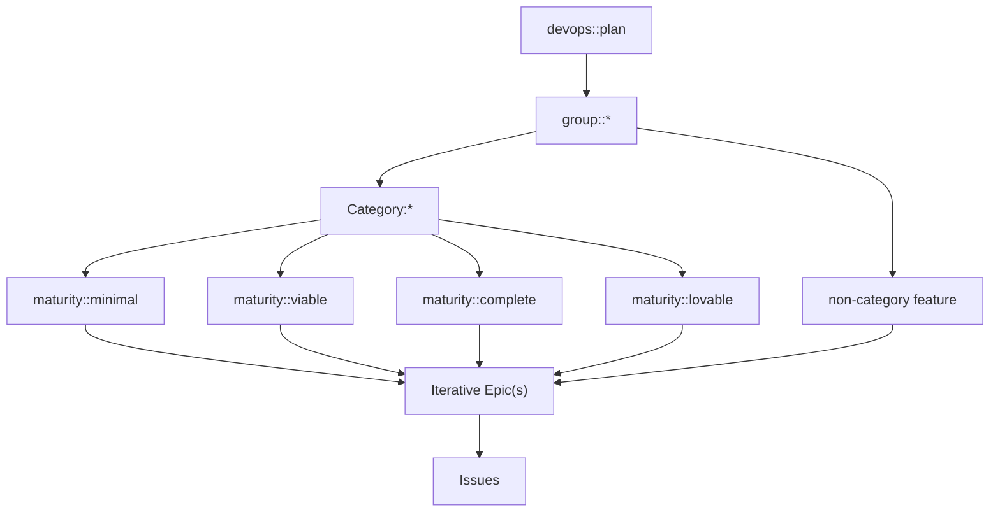
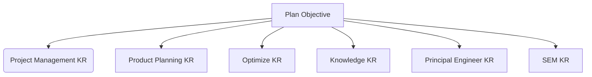

Plan teams:

- [Plan:Project Management Team](/handbook/engineering/development/dev/plan/project-management/)
- [Plan:Product Planning Team](/handbook/engineering/development/dev/plan/product-planning/)
- [Plan:Optimize Team](/handbook/engineering/development/analytics/monitor/optimize/)
- [Plan:Knowledge Team](/handbook/engineering/development/dev/plan/knowledge/)

The responsibilities of this collective team are described by the [Plan stage](/handbook/product/categories/#plan-stage). Among other things, this means
working on GitLab's functionality around issues, boards, milestones, to-do list, issue lists and filtering, roadmaps, time tracking, requirements management, notifications, value stream analytics (VSA), wiki, and pages.

- I have a question. Who do I ask?

In GitLab issues, questions should start by @ mentioning the Product Manager for the [corresponding Plan stage group](/handbook/product/categories/#plan-stage). GitLab team-members can also use [#s_plan](https://gitlab.slack.com/messages/C72HPNV97).

For UX questions, @ mention the Product Designers on the Plan stage; [Nick Leonard](https://gitlab.com/nickleonard) for Plan:Project Management, [Nick Brandt](https://gitlab.com/nickbrandt) for Plan:Product Planning, and [Libor Vanc](https://gitlab.com/lvanc) for Plan:Optimize. Plan:Knowledge should follow the [process for groups without a designer](/handbook/product/product-processes/).

### How we work

- In accordance with our [GitLab values](/handbook/values/).
- Transparently: nearly everything is public, we record/livestream meetings whenever possible.
- We get a chance to work on the things we want to work on.
- Everyone can contribute; no silos.
- We do an optional, asynchronous daily stand-up in [#s_plan_standup](https://gitlab.slack.com/messages/CF6QWHRUJ).

### Workflow

We work in a continuous Kanban manner while still aligning with Milestones and [GitLab's Product Development Flow](/handbook/product-development-flow/).

#### Capacity Planning

When we're planning capacity for a future release, we consider the following:

1. Availability of the teams during the next release. (Whether people are out of the office, or have other demands on their time coming up.)
1. Work that is currently in development but not finished.
1. Historical delivery (by weight) per group.

The first item gives us a comparison to our maximum capacity. For instance, if the team has four people, and one of them is taking half the month off, then we can say the team has 87.5% (7/8) of its maximum capacity.

The second item is challenging and it's easy to understimate how much work is left on a given issue once it's been started, particularly if that issue is blocking other issues. We don't currently re-weight issues that carry over (to preserve the original weight), so this is fairly vague at present.

The third item tells us how we've been doing previously. If the trend is downwards, we can look to discuss this in our [retrospectives](#retrospectives).

Subtracting the carry over weight (item 2) from our expected capacity (the product of items 1 and 3) should tell us our capacity for the next release.

#### Estimating effort

Groups within Plan use the same numerical scale when estimating upcoming work.

{}

#### Issues

Issues have the following lifecycle. The colored circles above each workflow stage represents the emphasis we place on collaborating across the entire lifecycle of an issue; and that disciplines will naturally have differing levels of effort required dependent upon where the issue is in the process. If you have suggestions for improving this illustration, you can leave comments directly on the [whimsical diagram](https://whimsical.com/2KEwLADzCJdDfPAb2CULk4).


Everyone is encouraged to move issues to different workflows if they feel they belong somewhere else. In order to keep issues constantly refined, when moving an issue to a different workflow stage, please review any open discussions within the issue and update the description with any decisions that have been made. This ensures that descriptions are [laid out clearly](/handbook/values/#say-why-not-just-what), keeping with our value of Transparency.

#### Epics

If an issue is `> 3 weight`, it should be promoted to an epic (quick action) and split it up into multiple issues. It's helpful to add a task list with each task representing a vertical feature slice (MVC) on the newly promoted Epic. This enables us to practice "Just In Time Planning" by creating new issues from the task list as there is space downstream for implementation. When creating new vertical feature slices from an epic, please remember to add the appropriate labels - `devops::plan`, `group::*`, `Category:*` or `feature label`, and the appropriate `workflow stage label` - and attach all of the stories that represent the larger epic. This will help capture the larger effort on the roadmap and make it easier to schedule.

#### Themes

A small number of high priority features will be chosen as 'themes' for a period of time. Themes provide an opportunity for the whole team to rally around a deliverable, even if they don't contribute directly to it. These items are given especially close attention by all those involved with a view to delivering small iterations and keeping work unblocked. There should never be more than two themes in progress at a time per team.

- A Slack channel is created with the convention #f_[feature name].
- An epic hierarchy is created with sub-epics mapping to iterations, each achievable within a milestone.
- Iterations are broken into multiple issues that can be accomplished independently, and PMs schedule those as normal.
- Other actions may be established, such as regular 'office hours' calls.

Team-members work together to continuously refine the iterations as complexity is revealed.

Examples of successful themes:

1. **Requirements Management** ([#f_requirements-management](https://app.slack.com/client/T02592416/CUEQBQ7K8), [Epic](https://gitlab.com/groups/gitlab-org/-/epics/2703))
1. **Jira Importer** ([#f_jira-importer](https://app.slack.com/client/T02592416/CUS6GB2JH), [Epic](https://gitlab.com/groups/gitlab-org/-/epics/2738))

### Roadmap

In product development at GitLab, Product is responsible for the **what** and **why**, Engineering is responsible for the **how** and **when** [[1](https://docs.google.com/presentation/d/1xd2-G8i68dNOd-dsa78xzYectz68T2EETQz2wJye6EA/edit#slide=id.g30963720e56_3_516)]. Maintaining a credible roadmap is therefore a collaborative process, requiring input from both.

The Product Roadmap outlines what the team aims to accomplish over a 4-6 quarter timeline. It is shared across the organization to ensure alignment with the go-to-market strategy and enable reliable commitments to customers.

Changes to the Plan Product Roadmap, made by the Product Manager, are reviewed and accepted by the Engineering Manager of the affected group. This happens at least once a month and is captured in a [Wiki Page](https://gitlab.com/gitlab-org/plan-stage/plan-engineering/-/wikis/Plan-Roadmap-Signoffs).

Most items being reviewed during roadmap planning have not yet had detailed technical investigation from engineering. Planning at this resolution is intended to be thoughtful but not perfect. Velocity [remains our priority](/handbook/engineering/development/principles/#velocity).

#### Reviewing the Roadmap

By performing a review, Engineering Managers play a key role by ensuring the roadmap is achievable and effectively sequenced to maximize velocity. Below are some best practices to guide a thoughtful review:

- Assess Achievability: Is the timeline realistic given the team's current capacity, skills, and dependencies?
- Account for Technical Preparation: Does the roadmap allocate time for necessary technical preparation, such as technical spikes or investigations?
- Optimize Team Utilization: Does the sequence of work align with the team’s skill profile, avoiding periods of underutilization or skill mismatches?
- Evaluate Redundancy: How robust is the rest of the roadmap if one item takes longer than anticipated?
- Clarify Requirements: Do you sufficiently understand each proposed change or do you need additional information?
- Ensure Shared Understanding: Do you and your Product and UX counterparts have a shared understanding of all terminology used?
- Seek Opportunities to Optimize: Have you identified opportunities to iterate or increase velocity by adjusting the order of work?
- Reduce Friction: Is the sequence of work likely to cause avoidable conflicts, such as multiple engineers committing to the same codebase areas simultaneously?
- Identify Process-Driven Delays: Are there items expected to take longer due to process requirements (e.g., multi-version compatibility) rather than capacity constraints?
- Account for Cross-Team Dependencies: Are there cross-team dependencies that could put parts of the timeline at risk?
- Incorporate a Buffer: Is a proportion of capacity allowed for exogenous shocks; such as unexpected PTO, or a high-severity incident?
- Lean on Your Experience: When you look at the roadmap as a whole and think about recent quarters, does it look achievable?

#### Roadmap Organization



### Talking With Customers

In a perfect world, we would have cross-functional representation in every conversation we have with customers.

#### Customer Conversations calendar

Anyone who is scheduling a call with a customer via sales, conducting usability reasearch, or generally setting up a time to speak with customers or prospects is encouraged to add [the Plan Customer Conversations calender](https://calendar.google.com/calendar/u/0/embed?src=gitlab.com_5icpbg534ot25ujlo58hr05jd0@group.calendar.google.com) as an invitee to the event. This will automatically populate the shared calendar with upcoming customer and user iteractions. All team members are welcome and encouraged to join -- even if it's just to listen in and get context.

You can subscribe to the calendar and invite it as a participant in a customer meeting that you are scheduling using the URL [gitlab.com_5icpbg534ot25ujlo58hr05jd0@group.calendar.google.com](mailto:gitlab.com_5icpbg534ot25ujlo58hr05jd0@group.calendar.google.com).

#### Shadow a customer call

All team members are welcome and encouraged to join customer calls -- even if it's just to listen in and get context.

To ensure upcoming calls appear in your calendar, subscribe to the Plan Customer Conversations calendar. Product Managers add upcoming customer interviews to this calendar and you're welcome to shadow any call.

1. In GCal, next to "Other Calendars" in the left sidebar, click the +
1. Select "Subscribe to Calendar"
1. In the "Add Calendar" input, paste gitlab.com_5icpbg534ot25ujlo58hr05jd0@group.calendar.google.com

Upcoming customer calls will often be advertised in the #s_plan channel in advance, so look out there also.

#### Review previous calls

All recorded customer calls, with consent of the customer, are made available for Plan team-members to view in Dovetail.

To access these, simply go to the [Plan Customer Calls](https://gitlab.dovetailapp.com/projects/3Smr4JOoU7a5pnWqazMfr2/readme) project on Dovetail and log in with Google SSO. More information is available in the Readme of this project.

If you find you do not have access, reach out to a Plan PM and ask to be added as a Viewer.

#### Review previous UX Research calls

UX Research calls are scripted calls designed to mitigate bias and to address specific questions related to user needs and/or usability of the product. A selection of UX Research calls are available in the [Plan Customer Calls](https://gitlab.dovetailapp.com/projects/3Smr4JOoU7a5pnWqazMfr2/readme) Dovetail Project in the column titled UXR - Research and Validation.

### Board Refinement

We perform many board refinement tasks asynchronously, using GitLab issues
in the [Plan project](https://gitlab.com/gitlab-org/plan). The policies for these issues are defined in
[triage-ops/policies/plan-stage](https://gitlab.com/gitlab-org/quality/triage-ops/tree/master/policies/plan-stage). A full list of refinement issues is available
by [filtering by the ~"Plan stage refinement" label](https://gitlab.com/gitlab-org/plan/issues?label_name%5B%5D=Plan+stage+refinement).

### Tracking Committed Work for an Upcoming Release

While we operate in a continuous Kanban manner, we want to be able to report on and communicate if an issue or epic is on track to be completed by a Milestone's due date. To provide insight and clarity on status we will leverage [Issue/Epic Health Status](https://docs.gitlab.com/ee/user/project/issues/index.html#health-status) on priority issues.

### Keeping Health Status Accurate

At the beginning of the Milestone, Deliverable issues will automatically be updated to "On Track". As the Milestone progresses, assignees should update Health Status as appropriate to surface risk or concerns as quickly as possible, and to jumpstart collaboration on getting an issue back to "On Track".

At specific points through the milestone the Health Status will be automatically degraded if the issue fails to progress. Assignees can override this setting any time if they disagree. The policy that manages this automation is [here](https://gitlab.com/gitlab-org/quality/triage-ops/-/blob/master/policies/groups/gitlab-org/hygiene/adjust-health-status.yml). It can be disabled for any individual issue by adding the ~"Untrack Health Status" label.

#### Health Status Definitions for Plan

- _On Track_ - We are confident this issue will be completed and live for the current milestone
- _Needs Attention_ - There are concerns, new complexity, or unanswered questions that if left unattended will result in the issue missing its targeted release. Collaboration needed to get back On Track
- _At Risk_ - The issue in its current state will not make the planned release and immediate action is needed to rectify the situation

#### Flagging Risk is not a Negative

We feel it is important to document and communicate, that changing of any item's Health Status to "Needs Attention" or "At Risk" is not a negative action or something to be cause anxiety or concern. Raising risk early helps the team to respond and resolve problems faster and should be encouraged.

### OKRs

#### Active Quarter OKRs

FY25-Q2 Stage-level Objectives are available [here](https://gitlab.com/gitlab-com/gitlab-OKRs/-/issues/?sort=created_date&state=opened&label_name%5B%5D=devops%3A%3Aplan&label_name%5B%5D=division%3A%3AEngineering&amp;not%5Blabel_name%5D%5B%5D=group%3A%3A%2a&type%5B%5D=objective&milestone_title=FY25-Q2&first_page_size=20) (internal).

#### Previous Quarter OKRs

FY25-Q1 Stage-level Objectives all closed out between 74% and 88% and are available [here](https://gitlab.com/gitlab-com/gitlab-OKRs/-/issues/?sort=created_date&state=closed&label_name%5B%5D=devops%3A%3Aplan&label_name%5B%5D=division%3A%3AEngineering&amp;not%5Blabel_name%5D%5B%5D=group%3A%3A%2a&type%5B%5D=objective&milestone_title=FY25-Q1&first_page_size=20) (internal).

#### Drafting OKRs using GitLab

Guidance is available, including a video guide, on [Approach to OKRs at GitLab](/handbook/company/okrs/).
GitLab currently offers some freedom in how to structure OKR hierarchies. We take the following approach in Plan:

- EMs are encouraged to create group-level KRs under stage-level Objectives directly, without creating their own OKR structure.
- Group KRs and Stage Objectives should ladder into a higher Objective, which can exist anywhere in the organization. In the development of OKRs a stage-level Objective laddered directly into a CEO KR.
- They should be created or added as **child objectives and key results** of their parent so that progress roll-ups are visible.
- Product development goals are established in milestone planning, following the regular [Product Development Flow](/handbook/product-development-flow/), and not in OKRs.

Doing this ensures the hierarchy will be as simple, consistent and shallow as possible. This improves navigability and visibility, as we currently don't have good hierarchy visualization for OKRs.

An example of a valid single OKR hierarchy is:



Ownership is indicated using labels and assignee(s). The label indicates the group and/or stage, assignee the DRI.

OKRs should have the following labels:

- Group, Stage, and Section (as appropriate).
- Division (~"Division::Engineering") to distinguish from other functions.
- updates::[weekly, semi-monthly, monthly] depending on how often the OKR is expected to be updated by the DRI.

### Retrospectives

The Plan stage conducts [monthly retrospectives asynchronously using GitLab issues](https://gitlab.com/gl-retrospectives/plan/issues?scope=all&utf8=%E2%9C%93&state=all&label_name[]=retrospective). Monthly retrospectives are performed in a Confidential Issue made Public upon Close. Confidentiality of these Issues while Open aligns with [GitLab SAFE Framework](/handbook/legal/safe-framework/).

The Plan Stage team encourages the use of Internal Notes as well to further adhere to SAFE Guidelines. Internal notes remain confidential to participants of the retrospective even after the issue is made public, including Guest users of the parent group. Dogfooding this feature aligns with an FY23 Q4 OKR of improving the GitLab Product development flow by driving the adoption of Plan features.

Examples of information that should remain Confidential per SAFE guidelines are any company confidential information that is not public, any data that reveals information not generally known or not available externally which may be considered sensitive information, and material non-public information.

The retrospective issue is created by a scheduled pipeline in the
[async-retrospectives](https://gitlab.com/gitlab-org/async-retrospectives) project. It is then updated once the milestone
is complete with shipped and missed deliverables. For more information on how
it works, see that project's README.

An EM from the Plan stage is assigned to each retrospective on a rotational
basis as the DRI for conducting and concluding the retrospective, along with
summary and corrective actions. The rotation for upcoming milestones is as follows:

| Milestone | DRI |
|---   | ---       |
| 16.10 | Donald Cook |
| 16.11 | Kushal Pandya |
| 17.0 | John Hope |
| 17.1 | Brandon Labuschagne |
| 17.2 | Vladimir Shushlin |
| 17.3 | Kushal Pandya |
| 17.4 | Donald Cook |
| 17.5 | John Hope |
| 17.6 | Donald Cook |
| 17.7 | Kushal Pandya |
| 17.8 | Vladimir Shushlin |
| 17.9 | John Hope |
| 17.10 | Donald Cook |
| 17.11 | Kushal Pandya |

The role of the DRI is to facilitate a psychologically safe environment where team-members
feel empowered to give feedback with candour. As such they should refrain from participating
directly. Instead they should publicise, conclude and make improvements to the retrospective
process itself.

#### Timeline

- **27th (Previous Month)** A retrospective issue is automatically created for the milestone in progress.
- **18th** The milestone is **closed** and open issues in the build phase are labeled with ~"missed deliverable".
- **21st** The issue description is automatically updated with shipped and missed deliverables and the team are tagged to add feedback.
- **4th (Next Month)** A final reminder is created automatically in #s_plan for final feedback.
- **5th (Next Month)** The DRI [concludes the retrospective](#concluding-the-retrospective).

#### Dogfooding Value Stream Analytics (VSA) in the Milestone Retrospective

To improve the retrospective data-driven experience, we are [dogfooding](/handbook/engineering/development/principles/#dogfooding) VSA to simplify the [data collection for the retrospective](https://gitlab.com/gitlab-org/plan/-/issues/753). This been done by automatically adding a link to the VSA of the current milestone filtered by group/stage to the retrospective.
With Value stream analytics (VSA) our team is getting visibility to the [lifecycle metrics](https://docs.gitlab.com/ee/user/group/value_stream_analytics/#lifecycle-metrics) of each milestone through the breakdown of the [end-to-end workflow into stages](https://docs.gitlab.com/ee/user/group/value_stream_analytics/#value-stream-stages). This allows us to identify bottlenecks and take action to [optimize actual flow of work](https://about.gitlab.com/blog/2023/06/26/three-steps-to-optimize-software-value-streams/).

For example, for the review phase, we are using VSA to count the [time between “Merge request reviewer first assigned" to “Merge request last approved at”.](https://gitlab.com/groups/gitlab-org/-/analytics/value_stream_analytics?created_after=2025-01-01&created_before=2025-02-26&project_ids[]=278964&label_name[]=devops%3A%3Aplan&value_stream_id=631&stage_id=4581&milestone_title=17.9&sort=duration&direction=desc&page=1). With this data, we can identify:

- MRs that were bottlenecked due to limited reviewers/maintainers capacity.
- Slow review start times & Idle time post-approval.
- MRs with multiple feedback loops.
- Whether long review time originates from `same-team MR reviews` or `out-of-team MR reviews`.

Please leave your feedback in [this issue](https://gitlab.com/gitlab-org/plan-stage/product/-/issues/27).

#### Concluding the Retrospective

The DRI is responsible for completing the following actions:

- Adding a comment to the retrospective issue summarizing actionable discussion items and suggesting corrective actions.
- Finding a DRI for each corrective action. Creating an issue in `gl-retrospectives/plan` for each is optional, but doing so and adding the ~"follow-up" label will ensure they're included automatically in the next retrospective.
- Recording a short summary video and sharing in #s_plan. This can be discussed in the next weekly team call and can be added to the Plan Stage playlist on Youtube so that it shows up on team pages.
- Closing the issue and making it public.

In both the summary comment and video the DRI should be particularly careful to ensure all information disclosed is [SAFE](/handbook/legal/safe-framework/). If the retrospective discussion contains examples of unSAFE information, the issue should not be made public.

### Regressions

Regressions contribute to the impression that the product is brittle and unreliable. They are a form of waste, requiring the original (lost) effort to be compounded further with a fix or a reversion and reimplementation of the intended behavior.

Engineering Managers are strongly encouraged to conduct a simple [Root Cause Analysis](/handbook/engineering/root-cause-analysis/#what-is-a-root-cause-analysis) (RCA) when a regression takes place in a feature owned by their group, in order to:

- Inform the author and reviewers of the original MR that it caused a regression.
- Define corrective actions that might prevent or reduce the likelihood of a similar regression in future.
- Identify trends or patterns that can lead to human error.

The following RCA format was trialed in a FY23 Q2 OKR. It can be posted as a comment on the original MR when the regression has been successfully reverted.

```markdown
**Description of the regression:**
_One-line description of the regression in behavior._

**Bug report:** _[Issue link]_

`@author`` (if internal) `@approvers` Please could you reply to this comment, copying the questions below and giving some short answers?

1. Were you aware this MR was reverted in the course of your normal work (e.g. through email notification, general work process)?
1. Did you identify the problematic behavior before approving this MR?
1. If not, what would've made the regression more obvious during review?
1. What changes to our tooling or review process would have prevented this regression from being merged?
1. Were the steps to test the MR mentioned clearly in the description? Were they easy to follow?
1. Do you have any other comments/suggestions?
```

Please reassure the participants that the purpose is not to apportion blame but to gather data, identify causal factors and implement corrective actions - but ask for a swift and brief response while the information is still fresh.

### Technical Debt

The ~"technical debt" label, used in combination with ~"devops::plan," helps track opportunities for improving the codebase. These labels should be applied to issues that highlight:

- improvements to existing code or architecture;
- shortcuts taken during development;
- features requiring additional refinement;
- any other items deferred due to the high pace of development.

For example, a [follow-up issue](https://docs.gitlab.com/ee/development/contributing/issue_workflow.html#technical-debt-in-follow-up-issues) to resolve non-UX feedback during code review should have the ~"technical debt" label.

Issues marked with this label are prioritized alongside those proposing new features and will be scheduled during milestone planning.

### UX

The Plan UX team supports [Product Planning](/handbook/product/categories/#product-planning-group), [Project Management](/handbook/product/categories/#project-management-group) and [Optimize](/handbook/product/categories/#optimize-group). Product Planning and Project Management are focused on the work items architecture effort. This page focuses mainly on the specifics of how we support this, since it requires alignment and cross-group collaboration.

#### UX issue management, weights and capacity planning

Product Planning, Project Management and Optimize will create issues for UX work and pre-pend the title with [UX]. Here is an example - https://gitlab.com/groups/gitlab-org/-/epics/10224#note_1337213171+

- UX issues are the SSOT for design goals, design drafts, design conversation and critique, and the chosen design direction that will be implemented.
- Product requirement discussions should continue to happen in the main Issue or Epic as much as possible.
- When the Product Designer wants to indicate that the design is ready for ~"workflow::planning breakdown", they should apply this label to their issue, notify the PM and EM, and close the issue.

_When should a UX issue be used?_

UX issues should be used for medium or large projects that will take more than one dev issue to implement (e.g., end-to-end flows, complicated logic, or multiple use cases / states that will be broken down by engineering into several implementation issues). If the work is small enough that implementation can happen in a single issue, then a separate [UX] issue is not needed, and the designer should assign themselves to the issue and use workflow labels to indicate that it's in the design phase.

_Weighting UX issues_

All issues worked on by a designer should have a UX weight before work is scheduled for a milestone.

- Issue weights should follow the [UX Department's definitions](/handbook/product/ux/product-designer/capacity-management/#ux-issue-weights).
- If the issue is a dedicated [UX] issue, then the issue weight can be added to the `weight` field, but it should also be duplicated as a ~'design weight:" label. This is for UX Department planning purposes. For smaller issues where implementation and UX work happen in the same issue, UX weight should be added using the ~'design weight:" label (the `weight` field is used by engineering).
- Product Managers and Product Designers can use issue weights to ensure the milestone has the right amount of work, to discuss tradeoffs, or to initiate conversations about breaking work into smaller pieces for high-weight items.

#### Work Items

When designing for objects that use the [work items architecture](https://docs.gitlab.com/ee/architecture/blueprints/work_items/) we will follow this process intending to ensure that we are providing value-rich experiences that meet users needs. The work items Architecture enables code efficiency and consistency, and the UX team supports the effort by identifying user needs and the places where those needs converge into similar workflows.

##### About work items

The first objects built using the work items architecture support the [Parker](/handbook/product/personas/#parker-product-manager), [Delaney](/handbook/product/personas/#delaney-development-team-lead) and [Sasha](/handbook/product/personas/#sasha-software-developer) personas in tasks related to planning and tracking work. Additional objects will be added in the future, supporting a variety of user personas.

Read more about work items

- [Work items architecture](https://docs.gitlab.com/ee/architecture/blueprints/work_items/)
- [Work items terminology](https://docs.gitlab.com/ee/development/work_items.html#work-item-terminology)

##### Terminology

Work items refers to objects that use the work items architecture. You can find more terms defined related to the architecture here: [work items terminology](https://docs.gitlab.com/ee/development/work_items.html#work-item-terminology).

When we talk about the user experience, we avoid using the term 'work items' for user facing concepts, because it's not specific to the experience and introduces confusion. Instead, we will use descriptors specific to the part of the product we're talking about and that support a similar JTBD. Here are examples of how we are categorizing these:

- Team Planning Objects: Objects that belong to the Planning JTBD. Currently these are Epics, Issues and Tasks but could include others in the future.
- Strategy Objects: Objects that support strategic, organization wide objects. Currently these are Objectives and Key results.
- Development/Build Objects: Objects that support development tasks. These could be MRs, Test Cases, or Requirements
- Protecting Objects: These may include Incidents, Alerts, Vulnerabilities, Service Desk Tickets

This enables us to differentiate these by persona and workflow. While they may share a common architecture on the backend and similar layout on the frontend, in the UI they may:

- appear in different workflows and areas of the application
- have different data fields
- have different actions users can take on them

##### Guiding principles

- The DRI for the user experience is the Product Designer assigned to the group that is using the work item architecture for their object(s).
- We work in a user-first mindset, rather then technology-first.
- [Pajamas](https://design.gitlab.com/) is our design system and new patterns introduced via work item efforts need to solve a real problem that users have, be validated by user research, and follow the [Pajamas contribution process](https://design.gitlab.com/get-started/contributing/).
- We follow [Pajamas principles](https://design.gitlab.com/get-started/principles/) for the user experience.
- MVCs provide value to users, are bug-free and a highly usable experience, as described in [Product Principles](/handbook/product/product-principles/#the-minimal-valuable-change-mvc).

#### How the architecture is intended to work

When designing with the work items architecuture, Product Designers should understand roughly how the architecture works and what implications exist for the user experience.

- A work item has a type (epic, incident), and this controls which widgets are available on the work item and what relationships the work item can have to other work items and non-work item objects.
- The behavior of the work item in terms of performing its targeted JTBD(s) is powered by the collection of widgets enabled for a work item type.
- We want to avoid building logic or views specific to a type. When you need to support a workflow that isn't currently supported, you can introduce new behaviors through widgets (fields, apps, actions). A practical example: Epics can parent other Epics and Issues. Instead of interconnecting epics and issues this behavior is encapsulated in a 'hierarchy' widget, which could be utilized in other work item types that implement hierarchies; such as Objectives and Key Results.
- Similarly, the work item view should not be customized directly for a type. However, the Product Designer can propose a different user experience and the team implementing the work item will incorporate the necessary use cases into the work items architecture.
- Work items can be organized and presented to users in any groupings from an IA/Nav standpoint so long as all views leverage the same SSoT grouping FE components (ex: list, board, roadmap, grid, ...). We should only ever need to build and maintain one version of each grouping view that can then be re-used across anywhere we want to display that set of work items. Groupings are determined iteratively based on user needs.

If the quad discovers that the desired user experience would require a greater contribution to the work item architecture than initially thought, they would discuss trade-offs as a team in order to decide whether to proceed or leave the object separate.

##### Design Process for Work Items

_Problem Validation_

The quad that owns the code for the object (incident, epic, etc) decides if something should use the work item architecture based on trade-offs around code reuse and user experience. This should be a cross-functional decision, and the group Product Designer should advise their team regarding how well the user's ideal workflow could or could not be supported by the work items architecture. This will allow the team to evaluate how much existing frontend pieces of the architecture could be re-used, and what would need to be added or customized in order to support the desired experience.

1. As part of the decision making process, Product Designers should do problem validation user research (or leverage existing) to understand the desired user experience, including user goals, tasks, content/data field needs, and whether or not this work item type has relationships and the nature of those relationships.
1. During this phase, the Product Designer and Product Manager should ensure that success metrics are defined per our work item research process (link TBD)
1. High level wireframes should be produced to ensure everyone has a shared understanding of what is wanted and to establish a medium term vision for the work.

_Solution Validation_

After the quad decides the work item architecture is suitable, the Product Designer will design the experience in detail. As part of the detailed design, Product Designers, in collaboration with the quad, will:

1. Design how existing widgets will be utilized, and any new widgets needed or if existing widgets could be abstracted to fit a new use case. For example: The Timeline widget for incidents was designed in isolation specific to the incident use case. It could be reworked slightly to support more use cases, such as objective or key result check-ins.
1. Define how users will access this work item. Design how this work item will appear in existing views, such as lists, or any new views needed for this work item.
    - Ensure new components and patterns are contributed back to Pajamas.
1. Solution validation should be conducted as needed to ensure the workflow and usability meets the user needs.

##### Research Process for Work Items

We use the methods and tools in the [UX Research handbook](/handbook/product/ux/ux-research/).

In addition to these, we're working on gaining an efficiency bonus by using a common screener and building a mini-database of qualified participants aligned to our research needs.

We do a confidence check at different points in the process, particularly before moving a design into the build phase. Sometimes, a design solution is straightforward enough where we're very confident to move ahead without solution validation. However, there are times when we're unsure how the design solution will perform in production, thereby resulting in a low level of confidence. When this happens we will do usability testing to build confidence.

#### UX Paper Cuts

The UX Paper Cuts team has a dedicated role addressing Paper Cuts concerns within the Plan stage.

The UX Paper Cuts team member covering Plan will regularly triage the list of UX Paper Cuts issues that are related to the Plan stage as outlined above, but will also add actionable candidates to a Plan-specific epic for transparency.

Triaged Plan-specific Paper Cuts issues can be found in https://gitlab.com/groups/gitlab-org/-/epics/12061. Currently, quarterly child epics will be created under that parent epic to organize work.

See further details at https://handbook.gitlab.com/handbook/product/ux/product-designer/#suggesting-paper-cuts-to-the-team

### Plan Weekly Digest

#### Background

There are many company, team, process (and other) updates that are important to communicate to team members so that they are not missed. Besides that, there is other information important for day-to-day work. In Plan we use async Weekly updates, called Plan Weekly digest, to communicate these to our team members.

The Engineering Managers in the Plan stage alternate each week as the DRIs. There are 4 groups in the Plan stage, and one SEM, so every EM is the DRI roughly once / 5 weeks.

The responsibility of the DRI is simply to collect information and to ensure the issue is ready to be publicized in time for the coming week. All team-members are welcome to participate in suggesting content using discussions or adding it directly by editing the description.

#### Process

1. A new confidential issue is created every **Monday, 8 UTC**. (automatically)
1. The issue is assigned to all Plan Engineering Managers.
1. The EM **responsible** for the content of the issue can be found in the schedule below but all other EMs can contribute to the issue as well.
1. On **Saturday, 8 UTC** all team members are alerted on the issue via a comment (automatically).
1. On Friday, 8 UTC (next week) the issue is closed.

#### DRIs

| Issue creation (auto) | DRI |
|---   | ---       |
| 2024-12-30 | Vladimir Shushlin |
| 2025-01-06 | Kushal Pandya |
| 2025-01-13 | Donald Cook |
| 2025-01-20 | John Hope |
| 2025-01-27 | Vladimir Shushlin |
| 2025-02-03 | Kushal Pandya |
| 2025-02-10 | Donald Cook |
| 2025-02-17 | John Hope |
| 2025-02-24 | Vladimir Shushlin |
| 2025-03-03 | Kushal Pandya |
| 2025-03-10 | Donald Cook |
| 2025-03-17 | John Hope |
| 2025-03-24 | Vladimir Shushlin |
| 2025-03-31 | Kushal Pandya |
| 2025-04-07 | Donald Cook |
| 2025-04-14 | John Hope |

#### Links

- [Current Weekly Digests](https://gitlab.com/gitlab-org/plan-stage/plan-engineering/-/issues/?sort=created_date&state=opened&label_name%5B%5D=weekly%20update&first_page_size=20)
- [Closed Weekly Digests](https://gitlab.com/gitlab-org/plan-stage/plan-engineering/-/issues/?sort=created_date&state=closed&label_name%5B%5D=weekly%20update&first_page_size=20)
- [Issue Template](https://gitlab.com/gitlab-org/plan-stage/plan-engineering/-/blob/master/.gitlab/issue_templates/plan-weekly-digest.md)

### Meetings

Most of our group meetings are recorded and publicly available on
YouTube in the [Plan group playlist](https://www.youtube.com/playlist?list=PL05JrBw4t0KoceqcTneOVmAzhEp6NinY0).

<iframe width="560" height="315" src="https://www.youtube.com/embed/videoseries?list=PL05JrBw4t0KoceqcTneOVmAzhEp6NinY0" frameborder="0" allow="autoplay; encrypted-media" allowfullscreen></iframe>

#### Weekly group meeting

Plan held a weekly team-meeting as a stage until 2023-11-01. The [agenda](https://docs.google.com/document/d/1cbsjyq9XAt9UYLIxDq5BYFk47VA5aaTeHfkY2dttqfk/edit) is still available.

The meeting was removed as its functions are now covered in other ways:

- Slack
- [Stage Working Groups](#stage-working-groups)
- Group meetings
- Smaller ad-hoc meetings
- Social call

#### Links / References

- `~group::project management`
  - [Board](https://gitlab.com/groups/gitlab-org/-/boards/1285239)
  - [Roadmap](https://gitlab.com/groups/gitlab-org/-/roadmap?scope=all&utf8=%E2%9C%93&state=opened&label_name[]=devops%3A%3Aplan&label_name[]=group%3A%3Aproject%20management)
- `~group::product planning`
  - [Board](https://gitlab.com/groups/gitlab-org/-/boards/1569369?not[milestone_title]=Backlog)
  - [Roadmap](https://gitlab.com/groups/gitlab-org/-/roadmap?scope=all&utf8=%E2%9C%93&state=opened&label_name[]=devops%3A%3Aplan&label_name[]=group%3A%3Aproduct+planning)
- `~group::optimize`
  - [Board](https://gitlab.com/groups/gitlab-org/-/boards/1401511)
  - [Roadmap](https://gitlab.com/groups/gitlab-org/-/roadmap?scope=all&utf8=%E2%9C%93&state=opened&label_name[]=devops%3A%3Aplan&label_name[]=group%3A%3Aoptimize)
- `~group::knowledge`
  - [Board](https://gitlab.com/groups/gitlab-org/-/boards/5454834)
  - [Roadmap](https://gitlab.com/groups/gitlab-org/-/roadmap?scope=all&utf8=%E2%9C%93&state=opened&label_name[]=devops%3A%3Aplan&label_name[]=group%3A%3Aknowledge)

#### Shared calendar

There is a shared Plan stage calendar which is used for visibility into meetings within the stage.

- To add this shared calendar to your Google Calendar do one of the following:
  - Visit this [link](https://calendar.google.com/calendar/u/1?cid=Y19iNzIwMjMxNzdmMDE4ZDYzMWM4NTJlZDFlODgyZTdmYTdhMDI0NGM4NjFmN2U4OWY5NjA4NTY4ODJkNWY1NDlhQGdyb3VwLmNhbGVuZGFyLmdvb2dsZS5jb20) (GitLab internal) from your browser.
  - Click the '+' next to 'Other calendars' in Google Calender, select 'Subscribe to calendar', paste `c_b72023177f018d631c852ed1e882e7fa7a0244c861f7e89f960856882d5f549a@group.calendar.google.com` into the form and hit enter.
- To add an event to the shared calendar, create an event on your personal calendar and add `Plan Shared` as a guest.

### Team Day

Team Days are organized on a semi-regular basis. During these events we take time to celebrate wins since the last team day, connect with each other in remote social activities, and have fun!

Anyone can organize a team day. It starts with creating a Team Day planning issue in the [plan-stage tracker](https://gitlab.com/gitlab-org/plan-stage/plan-engineering/-/issues) and then proceeding to find a suitable date.

#### Setting a date

A time-boxed vote no more than 3 months but no less than 1 month out has proven to be the most inclusive way to set a date so far. This allows enough time to organize sessions but is usually close enough to avoid colliding with off-sites, or other company-wide activities.

Including at least three major timezones, one for each of AMER, EMEA, and APAC, in the issue description allows people to better see how the day will be divided for them and what they can attend.

It's good practice to rotate the 'base' timezone of the Team Day to spread the opportunity for attendance. For example; the [FY23-Q4](https://gitlab.com/gitlab-org/plan-stage/plan-engineering/-/issues/787) Team Day was based on a full UTC day, the [FY24-Q3](https://gitlab.com/gitlab-org/plan-stage/plan-engineering/-/issues/100) on a full day AEST.

#### Sessions

The day is composed of sessions proposed and organized by team-members. These are typically allocated 1hr, though they can be longer or shorter. Sessions can be scheduled in advance to allow other team-members to plan their attendance and participation.

Sessions can be anything really, so long as it aligns with the [values](/handbook/values/). Team-members can organize a game, teach a skill, give a talk on something they know, or anything else they think others might enjoy.

Some examples of sessions we've had on previous team days include:

- A cooking class with a former professional chef.
- Watching a holiday film together.
- Lateral Thinking Games.
- A home woodworking workshop tour and demonstration.
- Remote games; such as Gartic Phone and Drawsaurus.

Free time slots can be used on the day to hold impromptu events requiring little or no preparation.

#### Participation

Participation in team day is encouraged for any team-member or stable counterpart in Plan. If you collaborate with Plan team-members on a regular basis you're also very welcome to attend.

Participating team-members are encouraged to drop non-essential work and take part in any sessions during the day that they wish to. Those assigned to essential work; such as critical bugs, incidents, or IMOC shifts, are encouraged to participate between their other obligations.

Team day is a normal workday for those choosing not to participate.

#### Expenses

Some sessions may require small purchases to participate fully; for example, ingredients for a cooking class or hosting of a private video game server.

Unless communicated in advance these are **not expensable**.

The DRI for organizing Team Day may pursue a budget for expenses under existing budgets; such as the [team building](/handbook/finance/expenses/#team-building) budget. If successful it should be made clear to team-members well in advance:

- What purchases qualify for reimbursement.
- The policy the expense qualifies under; including handbook link, policy category, and classification in Navan.
- Any additional handbook guidance that will help team-members utilize the budget.

#### Past Team Days

- [2023-10-13 Team Day](https://gitlab.com/gitlab-org/plan-stage/plan-engineering/-/issues/1004)
- [2022-12-20 Holiday Party](https://gitlab.com/gitlab-org/plan-stage/plan-engineering/-/issues/787)

#### Tips for a Successful Team Day

- Watch out for [Daylight Savings Time](https://www.timeanddate.com/time/dst/about.html) when organizing for Q1 and Q3. When the date is set, check that the timeszones in the planning issue still match the timezones in use on the day (for example, AEST vs. AEDT).
- Secure expense budget and communicate at least a week in advance of the Team Day.
- Ensure Google Calendar events are transferred from the planning issue to the Plan [Shared Calendar](#shared-calendar) a week in advance of the event date.
- Ensure everyone has access to the calendar, and have easy step-by-step directions for creating a new event on the calendar (Adding events to a shared calendar can be slightly confusing).
- Communicate this change in SSOT, and encourage participants to add their own sessions in the calendar as free slots.

### Team Process

Each group within the Plan stage follows GitLab's [product development flow](/handbook/product-development-flow/) and [process](/handbook/product/product-processes/). This allows for consistency across the stage, enables us to align with other stages and stable-counterparts, and enables us to clearly understand our throughput and velocity. We're currently focused on strictly following the process stated in the handbook, as opposed to creating our own local optimizations.

In some cases we need to dogfood a new Plan feature that may adjust our adherence to the GitLab's process. If that happens we assign a DRI responsible for setting the objective, reporting on the outcomes and facilitating feedback to ensure we prioritize improvements to our own product. This ensures we're not making a change for the sake of making changes, and gives us clarity into our own evaluation of a change to the product.
In some cases we need to dogfood a new Plan feature that may adjust our adherence to the GitLab's process. If that happens we assign a DRI responsible for setting the objective, reporting on the outcomes and facilitating feedback to ensure we prioritize improvements to our own product. This ensures we're not making a change for the sake of making changes, and gives us clarity into our own evaluation of a change to the product.

There are a couple of process-related improvements we'll continue to adopt:

- **Iterations:** We've recently started organizing the prioritized work in a given milestone into weekly iterations. This doesn't change any of the canonical process, and allows us to break a months worth of work into sizeable timeboxes. Intended outcome: Dogfood iterations (the feature), improve velocity and give more granular visibility into the progress of issues. DRI: @donaldcook

### Stage Working groups

Like all groups at GitLab, a working group is an arrangement of people from different functions. What makes a working group unique is that it has defined roles and responsibilities, and is tasked with achieving a high-impact business goal fast. A working group disbands when the goal is achieved (defined by exit criteria) so that GitLab doesn't accrue bureaucracy.

Stage Working Groups are focused on initiatives that require collaboration between multiple groups within the stage. The structure of stage working groups is similar to [company-wide working groups](/handbook/company/working-groups/), with DRI and well-defined roles. The initiatives are driven by a stage-level product direction rather than an [Executive Sponsor](/handbook/company/working-groups/#executive-sponsor),
and can be formed of just Functional Leads and members who participate in fulfilling the exit criteria.

#### Active Stage Working Groups

1. [Work Items API Performance](/handbook/engineering/development/dev/plan/working-groups/work-items-api-performance/)

#### Archived Stage Working Groups

1. [Epic Work Items Migration](/handbook/engineering/development/dev/plan/working-groups/epic-work-items-migration/)

### Product Outreach

There can be a gap in understanding between Engineering and Product on a team. We are experimenting with a pilot program that will allow engineers to spend time in the world of Product, with the goal of greater mutual communication, understanding and collaboration. It helps us work more effectively as a team for better features.

#### Product Shadowing schedule

Engineering team-members can shadow a product stable-counterpart. Shadowing sessions last two working days, or the equivalent split over multiple days to maximize experience with different functions of the role. In particular, the session should include at least one customer call. To shadow a counterpart on the team:

1. Create an issue in the [plan](https://gitlab.com/gitlab-org/plan) project tracker using the `Product-Shadowing` template;
1. Create a WIP MR to this page to update the table below, adding your name and issue link, and
1. When your counterpart is assigned to the issue, add their name, remove WIP status and assign to your manager for review.

| Month | Engineering counterpart | Product counterpart | Issue link |
| ----- | ----------------------- | ------------------- | ---------- |
| 2020-07 | Charlie Ablett ([@cablett](https://gitlab.com/cablett)) | Keanon O'Keefe ([@kokeefe](https://gitlab.com/kokeefe)) | [gitlab-org/plan#118](https://gitlab.com/gitlab-org/plan/-/issues/118) |
| 2020-10 | Jan Provaznik ([@jprovaznik](https://gitlab.com/jprovaznik)) | Gabe Weaver ([@gweaver](https://gitlab.com/gweaver)) | [gitlab-org/plan#185](https://gitlab.com/gitlab-org/plan/-/issues/185) |

### Speed Runs

- Labels
  - [Scoped Labels](https://youtu.be/ebyCiKMFODg)
- Issues
  - [Description Change History](https://youtu.be/-JgfJSSLYlI)
- Epics
  - [Organize sub-Epics with the Epic Tree](https://youtu.be/TzRCan5ki6o)
- Requirements Management
  - [Requirements MVC](https://youtu.be/uSS7oUNSEoU)
  - [Satisfy Requirements from CI Pipeline](https://youtu.be/4m1mSEb2ywU)

### Engineering Scaling Targets

We're tracking a number of issues that we believe could cause scalability problems in the future.

| Type | Description | Estimated Timeline for Failure | Resolution Due Date | 12 Month Target | Issue | Status |
| ---- | ---          | ---                            | ---                | ---    | ---   | ---    |
| Redis Primary CPU | Unexpected load on the Shared State Redis instance caused by `SUBSCRIBE`, `UNSUBSCRIBE` and `PUBLISH` commands. | Unknown | November 2023 | [150k Concurrent WebSocket Connections](https://gitlab.com/gitlab-com/www-gitlab-com/-/issues/11747#action-cable-websockets) at peak | | <span style='border-radius:0.2em; font-weight:bold; padding-left:1em; padding-right:1em; color:white; background-color:green;'>Okay</span> |
| Redis Memory | Retention of Action Cable messages in Redis Shared State memory due to high numbers of and/or stalled/hung clients.  | Unknown | November 2023 | [150k Concurrent WebSocket Connections](https://gitlab.com/gitlab-com/www-gitlab-com/-/issues/11747#action-cable-websockets) at peak | [#326364](https://gitlab.com/gitlab-org/gitlab/-/issues/326364) | <span style='border-radius:0.2em; font-weight:bold; padding-left:1em; padding-right:1em; color:white; background-color:green;'>Okay</span> |
| Primary DB | Scaling a combined 'Work Items' table consisting of all current issues, epics, requirements and test cases. | Unknown | November 2024 | [50k Work Items](#work-items) created per day| | <span style='border-radius:0.2em; font-weight:bold; padding-left:1em; padding-right:1em; color:white; background-color:green;'>Okay</span> |

Note: Work is ongoing on [migration helpers](https://gitlab.com/gitlab-org/gitlab/-/issues/292874) to mitigate Int4 Primary Key Overflows. These will provide a standard way to resolve these issues.

#### Current Large Tables

Some tables in our database have grown significantly and may pose scalability issues.

| Table Name            | Current Size (Bytes) | Planned Mitigation Issue                             | Status                                                                                                                                          |
| --------------------- | -------------------- | ---------------------------------------------------- | ----------------------------------------------------------------------------------------------------------------------------------------------- |
| description_versions  | 424.2                | https://gitlab.com/gitlab-org/gitlab/-/issues/412704 | <span style='border-radius:0.2em; font-weight:bold; padding-left:1em; padding-right:1em; color:white; background-color:red;'>Critical</span> |
| issues                | 278.4                | https://gitlab.com/groups/gitlab-org/-/epics/10987   | <span style='border-radius:0.2em; font-weight:bold; padding-left:1em; padding-right:1em; color:white; background-color:orange;'>Warning</span>  |
| resource_label_events | 165.3                | https://gitlab.com/gitlab-org/gitlab/-/issues/412705 | <span style='border-radius:0.2em; font-weight:bold; padding-left:1em; padding-right:1em; color:white; background-color:orange;'>Warning</span>  |
| sent_notifications    | 508.1                | https://gitlab.com/gitlab-org/gitlab/-/issues/417233 | <span style='border-radius:0.2em; font-weight:bold; padding-left:1em; padding-right:1em; color:white; background-color:red;'>Critical</span> |
| system_note_metadata  | 173.5                |                                                      | <span style='border-radius:0.2em; font-weight:bold; padding-left:1em; padding-right:1em; color:white; background-color:yellow;'>Warning</span>  |

By continually monitoring these tables and applying the planned mitigations, we aim to maintain optimal performance and prevent any scalability issues.

### Metrics

#### Plan xMAU

- [Product Planning Performance Indicators](https://internal.gitlab.com/handbook/company/performance-indicators/product/)
