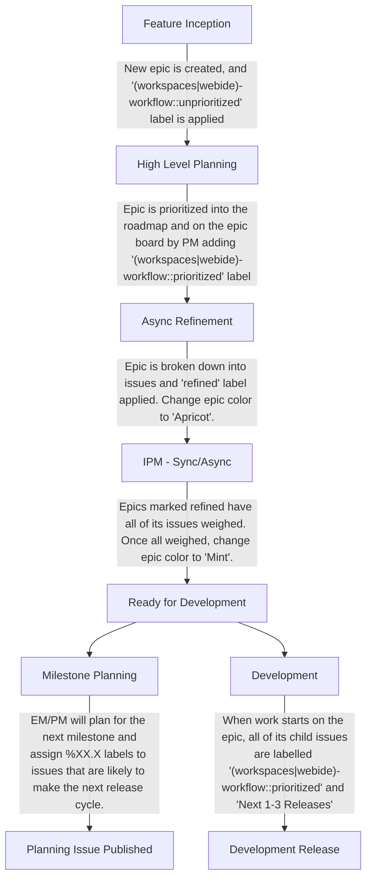

## Overview

The group is part of [Create Stage](/handbook/engineering/development/dev/create/) in the [Dev Sub-department](/handbook/engineering/development/dev/). We focus on two [categories](https://about.gitlab.com/direction/create/#categories-in-create): `Workspace` and the `Web IDE`.

### 👌 Group OKRs

<span id="-team-okrs" data-message="alias anchor for old links"></span>

If you're interested in the group's Objectives and Key Results (OKRs), you can find them on [GitLab](https://gitlab.com/gitlab-com/gitlab-OKRs/-/issues/?sort=created_date&state=opened&label_name%5B%5D=OKR&label_name%5B%5D=group%3A%3Aremote%20development&type%5B%5D=objective&first_page_size=20).

### 🤴 Group Principles

<span id="-team-principles" data-message="alias anchor for old links"></span>

[Create:Remote Development Principles](principles/): What Are the Create:Remote Development Group Principles?

### 🚀 Team Members

The following people are permanent members of the Remote Development Engineering Group:

**Engineering Manager & Engineers**



**Product, Design, Technical Writing, Security & Quality**



### ☕ Category DRIs

<span id="-team-category-dris" data-message="alias anchor for old links"></span>

| Category                 | DRI                                     |
|--------------------------|-----------------------------------------|
| Workspaces                |      |
| Web IDE                  |  |

### 📚 Architecture Design Document

Design documents are the primary artifact that the architecture design workflow revolves around. A design document describes a technical vision and a set of principles that will guide feature implementation, as we move forward. It acts as guardrails to keep team aligned.

- [Workspaces](../../../../architecture/design-documents/workspaces/_index.md)

### 🎓 New Hires

**As the Remote Development team and tech stack continue to mature, it's essential to have a team-specific onboarding process for new hires.** This checklist is designed to guide new team members through the key areas and processes specific to our team, starting two weeks after company onboarding. It covers our mission, essential tools, and workflows related to the Web IDE and Workspaces. Existing team members are encouraged to review the checklist regularly and contribute any missing or updated information to ensure it remains accurate and useful for newcomers. You can find the template https://gitlab.com/gitlab-com/create-stage/remote-development/-/blob/main/.gitlab/issue_templates/remote-development-onboarding.md.

### ☎️ How to reach us

Depending on the context here are the most appropriate ways to reach out to the Remote Development Group:

- Slack Channel: [`#g_create_remote_development`](https://gitlab.slack.com/archives/CJS40SLJE)
- Slack Groups: `@create-remote-development-team` (entire team) and `@create-remote-development-engs` (just engineers)

### 🗣️ Capturing Customer Engagements

To improve our understanding and traceability of customer needs and to ensure followups action items are systematically done, we want to capture customer engagement notes in a SSoT.
Please use the confidential issues below to capture all customer engagements for the feature categories:

- [Web IDE Customer Engagements](https://gitlab.com/gitlab-org/gitlab/-/issues/474518)
- [Workspaces Customer Engagements](https://gitlab.com/gitlab-org/gitlab/-/issues/473627)

These epics are meant for internal team members only. If you are a user wanting to provide feedback, see [Capturing User Feedback](#️-capturing-user-feedback).

### 🗣️ Capturing User Feedback

We highly value user feedback! Please use the epics below to capture feedback and insights for the two feature categories:

- [Web IDE User Feedback & Insights](https://gitlab.com/groups/gitlab-org/-/epics/10543)
- [Workspaces User Feedback & Insights](https://gitlab.com/groups/gitlab-org/-/epics/12601)

For non-team members, feel free to create issues in these epics if you have general feedback or suggestions. If you have feedback related to existing or ongoing features, please drop a comment in the appropriate epic or issue.

### 🤝 Customer Collaboration Issues Dashboard

At times, it is required to create private collaboration projects under https://gitlab.com/gitlab-com/account-management to collaborate with the customers on their needs. For such issues, add the appropriate labels so that they show up in our dashboard mentioned below.

Use the comment template to apply the approrpiate labels for the feature categories:

- Workspaces - `/label ~"Category:Workspaces" ~"customer-collaboration"`

You can find the customer collaboration issues dashboard for the feature categories:

- [Workspaces](https://gitlab.com/gitlab-org/gitlab/-/issues/517442)

### Group Metrics Dashboards

[Create::Remote Development Group Metrics Tableau Workbook](https://10az.online.tableau.com/#/site/gitlab/workbooks/2067787/views)

### 📆 Group Meetings

<span id="-team-meetings" data-message="alias anchor for old links"></span>

**❗️Important**: For every meeting, the [Remote Development group's meeting document](https://docs.google.com/document/d/1b-dgL0ElBf_I3pbBUFISTYBG9VN02F1b3TERkAJwJ20/edit#) should be used apart from High Level Planning which has a document of it's own, and filled with the meeting notes, as well as references to any other sync meeting agendas/notes/recordings which have recently occurred. This will make it easier for people to find any meeting notes.

Please note that sync meeting schedules are flexible and can be moved to accomodate required participants. For up to date schedule of all team meetings, please consult the [Group's Calendar](https://calendar.google.com/calendar/u/0?cid=Z2l0bGFiLmNvbV92ZGc3bW04NDRuczVrN3JxZGlyMzM0N2YwOEBncm91cC5jYWxlbmRhci5nb29nbGUuY29t).

The table below briefly outlines the objectives and key details of regular team meetings:

| Meeting Title                       | What                                                                                                                                      |
|-------------------------------------|-------------------------------------------------------------------------------------------------------------------------------------------|
| High Level Planning                 | Set overall direction and validate higher-priority issues/epics to be worked on in the upcoming releases.                                 |
| Iteration Planning Meeting (IPM)    | Review backlog and iteration status; estimate and prioritize work for next iterations.                                                    |
| Remote Development Retro Call       | Review feedback from async retro, identify action items and next steps to improve efficiency.                                             |
| Engineering Sync                    | Discuss engineering topics and brainstorming. Cancelled if no topics. Alternates APAC/AMER friendly times.                                |
| Remote Development Pairing          | Pairing sessions for engineers. Cancelled if no topics.                                                                                   |

## 📦 Group Processes

<span id="-team-processes" data-message="alias anchor for old links"></span>

### 🖖 Weekly EM Updates

Each week the group EM provides a Weekly Status update issue which aims to capture the most important items for the team to be aware of. These can be found [here](https://gitlab.com/gitlab-com/create-stage/remote-development/-/issues/?sort=created_date&state=all&label_name%5B%5D=Weekly%20Team%20Announcements&first_page_size=20).

### 😷 Issue Workflow Hygiene

In the Create:Remote Development group we leverage an automatic issue hygiene system via the [triage bot](https://gitlab.com/gitlab-org/quality/triage-ops/-/tree/master/policies/groups/gitlab-org/ide). This helps to ensure issues and label hygiene are respected, currently, our rules are:

### 🌉 Architecture Plans vs. Iteration Plans

We use the terms _Architecture Plan_ and _Iteration Plan_ when we think of outcomes to broad high-level issues. An investigative spike should result in an Architecture Plan and an Iteration Plan.

- **Architecture Plan**: A high-level vision of a technical approach that is shown to solve user problems. This plan includes a formulation of specific [quality attributes](https://en.wikipedia.org/wiki/List_of_system_quality_attributes) that are important for this use cases (such as performance, usability, or security). It also includes an outline of technical approaches that will satisfy these quality attributes in addition to the functional requirement. A [spike effort](https://en.wikipedia.org/wiki/Spike_(software_development)) should be created to verify and explore the technical approach for an architecture plan. The spike could result in new architectural concerns, resulting in an iteration of the plan.
- **Iteration Plan**: A plan for how we'll iteratively implement an Architecture Plan or another objective. This can be composed of low-level technical steps, or medium-level slices of use cases. The iteration plan should result in a set of issues (and possible epics) with clearly defined scope and weights.

**Sometimes it takes a time to develop a well fleshed-out iteration plan. In these cases, a "Formulate Iteration Plan" weighted issue can be used.**

### 📝 Issue Guidelines

These guidelines apply to all issues we use for planning and scheduling work within our group. Our Engineers can define specific implementation issues when needed, but the overall goal for our issues are as follows:

- Treat the wider community as the primary audience ([see relevant summary for rationale](community-contributions/#wider-community-as-primary-audience)).
- Provide a meaningful **title** that describes a deliverable result.
  - ✅ `Add a cancel button to the edit workspace form page`
  - ✅ `Automatically save Devfile changes after 2 seconds of inactivity`
  - ❌ `Make WebIDE better`
- Provide a meaningful description that clearly explains the goal of the issue, and provide some technical details if necessary.
- Should there be critical implementation steps or other useful ways to create small tasks as part of the issue, please use a checklist as part of the issue descriptions.
- The issue should have a weight assigned.

It's okay to create specific engineering-driven implementation issues for more complex features. These would be called **Child Issues** and they should always link back to their parent. If one issue would spawn many child issues, consider creating an Epic.

## 🤖 Planning Process

<span id="-category-specific-planning-processes" data-message="alias anchor for old links"></span>

The Remote Development group has decided to use an alternate planning process for the following reasons:

1. Workspace is a large, greenfield category, with many engineering, infrastructure, and technical concerns and unknowns which will continue to evolve and change as the category matures.
1. The Workspace category is also currently receiving much attention as part of GitLab's competitive strategy, and thus has greater internal and external expectations for accurate estimates of feature delivery and timelines.
1. In order to meet this need for more accurate and realistic planning and delivery estimates, the Workspace category team has decided to modify parts of the [Plan](/handbook/product-development-flow/#build-phase-1-plan) and [Build & Test](/handbook/product-development-flow/#build-phase-2-develop--test) phases of the GitLab Product Development Flow to a more lightweight velocity-based estimation and planning process inspired by the widely-used and popular [XP](https://www.amazon.com/Extreme-Programming-Explained-Embrace-Change/dp/0321278658) and [Scrum](https://www.scrum.org/resources/blog/agile-metrics-velocity) methodologies. The goal is to provide accurate delivery estimates based on ["Yesterday's Weather"](https://gitlab.com/gitlab-com/www-gitlab-com/uploads/283f165896e2851bdc324f790d9c90e4/Screen_Shot_2023-03-27_at_6.16.51_PM.png) historical velocity analysis.
1. To better support the use of these methodologies, the Remote Development group has committed to dogfooding the [Iterations feature](https://docs.gitlab.com/ee/user/group/iterations/index.html), and following the [documented process for running agile iterations](https://docs.gitlab.com/ee/tutorials/agile_sprint/) where possible.
1. However, due to existing limitations of the Iterations and Boards features in fully supporting these methodologies, we will also experiment with new and alternate tools and processes, with the goal of informing and potentially contributing back to improve GitLab's support for them. More details will be shared as this effort evolves.

Even though the Web IDE category does not have all these constraints (e.g. it is based on VS Code and is not greenfield code, and has fewer unknowns), the Web IDE category will follow a similar process in order reduce the cognitive overhead of the entire group.

### Planning Process Overview

<span id="-remote-development-planning-process" data-message="alias anchor for old links"></span>
<span id="remote-development-planning-process-overview" data-message="alias anchor for old links"></span>

The Remote Development group has modified parts of the [Plan](/handbook/product-development-flow/#build-phase-1-plan) and [Build & Test](/handbook/product-development-flow/#build-phase-2-develop--test) phases of the GitLab Product Development Flow to a more lightweight velocity-based estimation and planning process inspired by the widely-used and popular [XP](https://www.amazon.com/Extreme-Programming-Explained-Embrace-Change/dp/0321278658) and [Scrum](https://www.scrum.org/resources/blog/agile-metrics-velocity) methodologies.

The crux of these changes is focused around the following process phases:

1. "High Level Planning". This is analogous to the [Validation Track in the GitLab Product Flow](/handbook/product-development-flow/#validation-track), because it needs to achieve the same [Validation Goals & Outcomes](/handbook/product-development-flow/#validation-goals--outcomes) before we can start refining and prioritizing issues.
1. The "Async Refinement Process". This is analogous to ["backlog refinement"](/handbook/product-development-flow/#outcomes-and-activities-4) in the standard GitLab product development flow. The goal of the refinement is to ensure that all issues which are to be prioritized in the upcoming iteration(s) are ready for the wider team to briefly discuss and estimate in the next IPM.
1. The "Iteration Planning Meeting", or "IPM". This is analogous to the ["Weekly Cycle" in XP](https://www.amazon.com/Extreme-Programming-Explained-Embrace-Change/dp/0321278658) or ["Sprint Planning" in Scrum](https://www.scrum.org/resources/what-is-sprint-planning).

These components allow us to provide realistic velocity-based estimates based on ["Yesterday's Weather"](https://gitlab.com/gitlab-com/www-gitlab-com/uploads/283f165896e2851bdc324f790d9c90e4/Screen_Shot_2023-03-27_at_6.16.51_PM.png) historical velocity analysis.

**IMPORTANT: note that these process changes do not represent a full adoption of XP or Scrum methodologies. Instead, they are a minimal and lightweight process "inspired" by XP and Scrum. The primary goal is to allow the team to provide realistic planning and delivery estimates to leadership based on accurate velocity measurements. The Pre-IPM and IPM processes are the minimal components which allow us to meet that goal.**

### Custom workflow labels

To facilitate the Remote Development group's specific planning process, we make use of custom workflow scoped labels under `~workspaces-workflow::` or `~webide-workflow::`.
These custom workflow labels are necessary to work around [current limitations of GitLab iterations and boards in implementing this process](https://gitlab.com/cwoolley-gitlab/gl-velocity-board-extension#why-doesnt-standard-gitlab-support-this).

The Web IDE category uses the separate set of `~webide-workflow::` scoped labels, because this makes management of boards and workflows easier, especially in the case of issues which may have both categories' labels applied.

### GitLab Velocity Board Chrome Extension

To facilitate this process, especially around calculating emergent iterations based on velocity, we will use the
[GitLab Velocity Board Chrome Extension](https://gitlab.com/cwoolley-gitlab/gl-velocity-board-extension).

See [this video](https://www.youtube.com/watch?v=XcHpLhs7Fl0) for an overview of the extension, and also for an explanation of
this general process, and why we need to use an extension to support it rather than the current standard GitLab Iteration and Board features.

This extension is in support of a [GitLab OKR](https://gitlab.com/gitlab-com/gitlab-OKRs/-/work_items/2085) for Create.
We plan to continue iterating in this area, with the goal of eventually having GitLab directly support this workflow.

### Wider Board Columns

The default width of lists on boards can make the board harder to use, since you see fewer items and have to scroll more.

There is [an open issue to address this](https://gitlab.com/gitlab-org/gitlab/-/issues/15927). In the meantime, though, you can use the following javascript bookmarklet suggested in [this comment on the issue](https://gitlab.com/gitlab-org/gitlab/-/issues/15927#note_214871708), which will make the lists take up the full board width. Just make a bookmark named "Wider board lists" with this as the link:

```text
javascript:(function(){var el=document.getElementsByClassName('boards-list');for(i=0;i<el.length;++i){el[i].style.padding=0;el[i].style.display='table';}el=document.getElementsByClassName('board');for(i=0;i<el.length;++i){el[i].style.padding=0;el[i].style.border='0';el[i].style.display='table-cell';}el=document.getElementsByClassName('board-inner');for(i=0;i<el.length;++i){el[i].style.padding=0;el[i].style.border='0';}})();
```

### Iteration Planning Report

TODO: We need to create a Web IDE version of this report and link it in the category slack channel - there is [an issue for this](https://gitlab.com/gitlab-org/gitlab/-/issues/452218).

In addition to the Velocity Board chrome extension, there is a [Workspace Iteration Planning Report](https://gitlab-org.gitlab.io/remote-development/remote-development-team-automation/workspaces-iteration-planning-report-latest.html) and [Web IDE Iteration Planning Report](https://gitlab-org.gitlab.io/remote-development/remote-development-team-automation/web-ide-iteration-planning-report-latest.html) which are automatically published every 6 hours.

This report shows the same auto-calculated iteration/velocity data, and uses the same logic as the Velocity Board Chrome Extension, but you don't have to install the extension to see it.

The pipeline to generate it can also be run [directly from CI](https://gitlab.com/gitlab-org/remote-development/remote-development-team-automation/-/pipelines).

### Process Phases

NOTE: All issues in this process _must_ be assigned the `~Category:Workspace` or `~Category:Web IDE` label, _even if they are also assigned another category label_. Otherwise the board and velocity calculation tools will not work properly.



#### 1. Feature Inception

Ideas can come from anywhere and anyone. If you have an idea...

1. Capture it in an issue under the [Workspaces](https://gitlab.com/groups/gitlab-org/-/epics/12601) or [Web IDE](https://gitlab.com/groups/gitlab-org/-/epics/10543) User Feedbback & Insights epic.
1. Pre-fix the issue title with "Feedback:..." or "Idea:..."
1. Add this as a topic of discussion on the [Workspaces](https://docs.google.com/document/d/1Xfr5YHdStC7_3kVAognj0SxbXlcavj2ofgp1mH2zH4U/) or [Web IDE](https://docs.google.com/document/d/18l9wI2tRcFgvX8nJfmO3qVG9-smEQL0VwDh5aOOZj0s/) High Level Planning agenda

#### 2. High Level Planning

The **High Level Planning** meeting is an open forum where new and ongoing work is identified, discussed, and prioritized. Team members can propose topics by adding them to the agenda in advance. The meeting typically covers:

- **New Feature Ideas**: Proposals for new work to be considered for the roadmap.
- **Roadmap Adjustments**: Reordering, shifting, or reprioritizing ongoing work.
- **Escalation of Bugs/Technical Debt**: Issues that need urgent attention or adjustments to the timeline.

In addition to validating features, this process can also result in Engineering identifying high-priority issue which are necessary to [address Technical Debt or "Friction"](https://www.mechanical-orchard.com/insights/friction-over-debt).

- **Identify and Discuss Topics:** Team members are encouraged to propose any relevant topics in advance and discuss them during the meeting.

- **Prioritize Work:** The meeting serves to clarify the most important work and make decisions on what should take priority.

**Post-Meeting Actions:**

- **Roadmap Assessment:** After the meeting, the Product Manager will assess the proposed changes and update the epic board(s), which serves as the source of truth for work prioritization.

- **Epic Creation and Prioritization:** Features will be converted into epics and the Product Manager will determine the order of feature work and mark upcoming work with the `~"(workspaces|webide)-workflow::prioritized"` label.

- **Board Order Guidelines:** Please avoid changing the order of items on the epic board without consulting the Engineering Manager or Product Manager first.

#### 3. Async Refinement Process

The **Async Refinement** process is designed to prepare upcoming work efficiently focusing on issue breakdowns and identifying any unknows of implementation.

**Key Principles:**

- **Epic Board:** The epic board organizes and prioritizes upcoming work, following a color scheme to reflect each epic’s status.
  - <span style="color:#1068bf">Blue</span>: Default color for new epics that need refinement.
  - <span style="color:#f3ad5d">Apricot</span>: Indicates that an epic is fully refined and ready for weighing in the next planning stage.
  - <span style="color:#4dd787">Mint</span>: Used after the **Iterative Planning Meeting** once all issues within an epic have been weighed and finalized for execution.

- **Just-in-Time Planning:** We refine only the next 1-2 epics to avoid over-preparing, which helps ensure epics remain relevant when work begins. If these are refined, no further refinement is necessary.

**Refinement Process:**

1. **Identify Epics in Need of Refinement:**

   - Look for epics marked in <span style="color:#1068bf">blue</span> on the epic board.

1. **Break Down the Epic:**
   - Divide the epic into smaller, actionable issues.
   - Define the work necessary to meet the epic’s acceptance criteria.

1. **Mark as Refined:**
   - Once refined, change the epic color to <span style="color:#f3ad5d">apricot</span> to indicate it is ready for weighing.
   - Add the label **"refined"** to signal readiness.

1. **Next Steps - Iterative Planning Meeting:**
   - Following refinement, epics enter the **Iteration Planning Meeting** where all issues within an epic are weighed.
   - After this stage, epics are marked <span style="color:#4dd787">mint</span> to indicate they are fully weighed and ready for execution.

#### 4. Iteration Planning Meeting

The **Iteration Planning Meeting** is a collaborative session where the team reviews and weighs issues within epics marked as <span style="color:#f3ad5d">apricot</span> on the epic board. This process ensures that each refined epic is fully understood, in scope, and aligned with the team’s goals.

**Meeting Objectives:**

- **Review and Weigh Issues:**

  - For each issue, the facilitator reads the description, and the team **_briefly_** discusses the issue and clarifying any uncertainties. If there are no blocking concerns/risks raised, the team collectively estimates the issue with rock-paper-scissors fibonacci scale, and the collectively agreed weight is assigned. See[What Weights to Use](#-what-weights-to-use) for more details on weights.
  - If there are other prioritized issues that have not yet been weighed, these are also reviewed and weighed during the meeting.

**Async Process**

**TL;DR: Sometimes issues need to be weighted quickly before the offical IPM meeting. This is how we weight those issues.**

**Prerequisite:** Add the Polly app to your Slack if you have not already.

1. Navigate to Polly application under that Apps section in Slack.
1. Select Create a Polly.
1. Select Create New.
1. Fill out creation Options:
    1. Create Question: Weight for: **_Add link to issue here._**
    1. Question Type: Select **_1-to-10_** option.
    1. Choose audience: Select **_remote_development_async_ipm_** channel.
    1. Make sure "Send polly as direct message" is **_unchecked_**.
    1. Select Settings Button.
    1. Responses: Select **_Non-anonymous_**.
    1. Results: Select **_Show after close_**.
    1. Select Submit to save changes.
1. Send Polly.

**Optional Steps: Template Creation**

This allows you make following Async IPMs faster by standardizing the configurations. After creation, all a user needs to do is select the template from the "My Templates" section, select Use Template, and update the Issue link in the "Create Question" field.

1. Navigate to Polly application under that Apps section in Slack.
1. Select Go to Polly Dashboard.
1. Select the Polly you just made.
1. Select Controls button.
1. Select Save as Template.
1. Title Template: **_Remote development async ipm_**.
1. Ensure "Save audience with template" is **_checked_**.
1. Select Save.

**Explanation:**

**Async Weighing Option:**

- Weighing can also be done asynchronously through the `#remote_development_async_ipm` Slack channel.
- To initiate async weighing, post the issue that needs to be weighed along with a [Polly poll](https://www.polly.ai/help/slack/creating-polls) to gather input.

This structure allows for both synchronous and asynchronous participation, enabling thorough preparation and alignment on upcoming work.

#### 5. Milestone Planning & Starting Development

TODO: Assigning prioritized issues to specific releases based on calculated iterations can be automated in the future by adding functionality to the chrome extension. For now, it will be a manual process.

The **Milestone Planning & Starting Development** process is used to plan issues for development in upcoming releases and to align team efforts with milestone.

**Epic and Issue Setup:** When starting work on a new epic, all child issues are labeled assigned the milestone **`%"Next 1-3 Releases"`** to indicate they are prioritized for near-term development.

If any **unplanned work or issues need to be added to an active milestone, discuss them with the EM beforehand**, as they may impact delivery projections and milestone commitments.

**Milestone Planning and Creating Planning Issue**:

1. Before each milestone begins, the Engineering Manager along with Product Manager reviews and assigns issues for the upcoming release based on the team’s velocity. Specific milestone number `%XX.X` to designate them as part of the planned release.

1. A **Planning Issue** is automatically created two weeks before start of the new release cycle. This issue is populated with relevant details to guide the team through the milestone. You can view and access all active Planning Issues [here](https://gitlab.com/gitlab-com/create-stage/remote-development/-/issues/?sort=updated_desc&state=opened&search=planning%20issue&first_page_size=50).

This structure enables smooth planning, tracking, and alignment of development work within each milestone, ensuring work progresses as planned and within scope.

### Example Lifecycle for a Feature Issue

1. Product and Design work together to identify a new feature requirement.
1. An issue is created using the [Workspace issue template](https://gitlab.com/gitlab-org/gitlab/-/blob/master/.gitlab/issue_templates/Workspaces%20Category%20-%20issue.md). The correct labels are automatically applied by the template,
   so the issue shows up in the `~"(workspaces|webide)-workflow::unprioritized` list of the Iteration Planning board.
   Note that the issue description may be incomplete/unrefined and high-level at this point.
1. Product decides the issue is a high priority, so they apply the `%"Next 1-3 Releases"` milestone to signal this.
1. As part of the async Pre-IPM process, someone is assigned to refine the issue, by finishing filling out the issue template, then applying the `~refined` label
1. During the refinement process, consider documentation for the feature. If needed, add the requirements and the `~documentation` and `~Technical writing` labels to the issue.
   For question and assistance, tag your assigned Technical Writer.
1. As part of the sync Pre-IPM meeting, product and engineering leadership move the refined issue to the `~(workspaces|webide)-workflow::prioritized` list,
   in the appropriate position based on its priority relative to other issues.
1. In the sync IPM meeting, the wider team discusses and estimates the issue, and it is assigned to whoever will do the work.
1. Once the priority and weight are determined, the current velocity will tell us what iteration the issue should be completed in, and a specific
   release milestone can be assigned to the issue based on that.
1. The assignee opens an MR for the issue and ensures that the issue and MR are cross-referenced on the first lines of their descriptions.
1. While the feature implementation is in progress, the assignee creates a documentation MR that follows the appropriate [topic type](https://docs.gitlab.com/development/documentation/topic_types/) format and [style guide](https://docs.gitlab.com/development/documentation/styleguide/).
1. The documentation MR is reviewed by the Technical Writer, and merged along with or shortly after the feature implementation MR.
1. When the work is completely done, for example when the feature MR is reviewed and merged, the documentation is published, the feature is verified and tested in production, etc.,
   then the issue is closed, and moved to the `~(workspaces|webide)-workflow::done` list.

**QUESTION: Why isn't there a `~(workspaces|webide)-workflow::refined` phase instead of using the `~refined` label?**

For a few reasons:

1. We want to keep the main process and board simple and easy to understand. The three columns for `unprioritized`, `prioritized`, and `done` phases
   are intuitive and self-explanatory. Also, the movement between `unprioritized` and `prioritized` is a sync process, which ensures the team leadership
   are all on the same page about current priorities.
1. The refinement and prioritization process may vary among different teams that use this process in the future. Keeping the three core phases simple
   means that the basic process and board approach can still be used with simpler or more complex refinement/prioritization processes.
1. Finally (and most importantly from a pragmatic perspective), the implementation of the logic for velocity and iteration calculations on the board is
   much simpler if we enforce a standardized three-phase/three-column process and UI.

### Relationship of Issues to MRs

<span id="1-to-1-relationship-of-issues-to-mrs" data-message="alias anchor for old links"></span>

We want to enforce that:

1. Every MR is owned by a weighted issue

This is in order to facilitate accurate and granular velocity calculations and issue prioritization under this process.
The merge request is the atomic unit of deliverable work in most cases, so it must be represented in the prioritization
and calculations by being owned by one and only one issue.

In order to enforce this via triage-ops automations
(/handbook/engineering/development/dev/create/remote-development/#automations-for-remote-development-workflow),
the first line of the issue should have the format: `MR: <...>`:

1. For new issues, the first description line should be: `MR: Pending`
1. Once an MR is created for the issue and work is started, the first description line of the issue should be: `MR: <MR link with trailing +>`,
   and the first description line of the MR should be `Issue: <Issue link with trailing +>`.
1. If the work for an issue was iteratively split into multiple MR's, the first description line of the issue should be:

   ```markdown
   MR:
     - <MR link with trailing +>
     - <MR link with trailing +>
   ```

   Each description line of the MR's in this list should be `Issue: <Issue link with trailing +>`. **Please note:** If breaking out an issue's implementation
   into multiple MR's unexpectedly increases the scope of the work, please consider creating a new weighted and prioritized issue to
   capture the extra scope. This is important in order to accurately reflect scope increases, and their impact on reporting and velocity.
1. If there is _NO MR_ associated with this issue, the first line should be: `MR: No MR`.
   However, this should be rare, because most issues should have some sort of committed deliverable, even if it is only
   a documentation addition or update. If it is an issue which represents a larger piece of work split across smaller issues,
   then it should be promoted to an epic.

**QUESTION: Why does every MR need a backing issue?**

- If boards and epics allowed MRs to be added and estimated as well as issues, this would not be necessary - for feature/maintenance
involving an MR, we could have the MR directly represent the full lifecycle of the discussion and implementation, and not
have an issue at all.
- We also cannot rely on the Crosslinking Issues feature (https://docs.gitlab.com/ee/user/project/issues/crosslinking_issues.html),
because this shows ALL linked MRs that have mentioned the issue anywhere, and cannot enforce this 1-1 relationship.

### 📝 Ad-Hoc Work

It is normal that team members may identify issues that need to be resolved promptly prior to the next planning cycle. This may be because they are blocking other prioritized issues, or just because a team member wishes to tackle an outstanding bug or small piece of technical debt.

In these situations, it is acceptable for a team member to take the initiative to create an issue, assign proper labels, estimate it, assign it to the current iteration, and work on it, _as long as it does not adversely impact the delivery of other prioritized issues_. However, if it becomes large or risks impacting other issues which were collectively prioritized as part of an IPM, then the issue should be brought up for discussion with the wider team in the next pre-IPM and/or IPM.

### 🏋 What Weights to Use

To assign weights to issues effectively, it's important to remember that issue weight should not be tied to time. Instead, it should be a purely abstract measure of the issue's significance. To accomplish this, the our team uses the Fibonacci sequence starting from weight 0:

- **Weight 0:** Reserved for the smallest and easiest issues, such as typos or minor formatting changes, or very minor code changes with no tests required.
- **Weight 1:** For simple issues with little or no uncertainty, risk or complexity. These issues may have labels like "good for new contributors" or "Hackathon - Candidate". For example:
  - Changing copy text which may be simple but take some time.
  - Making CSS or UI adjustments.
  - Minor code changes to one or two files, which require tests to be written or updated.
- **Weight 2:** For more involved issues which are still straightforward without much risk or complexity, but may involve touching multiple areas of the code, and updating multiple tests.
- **Weight 3:** For larger issues which may have some unforeseen complexity or risk, or require more extensive changes, but is still not large enough to warrant [breaking down into smaller separate issues](#-investigations-and-breaking-down-large-issues).
- **Weight 5:** Normally, this weight should be avoided, and indicate that the issue ideally [should be broken down into smaller separate issues](#-investigations-and-breaking-down-large-issues). However, in some cases a issue with a weight of 5 might still be prioritized. For example, if there is a large amount of manual updates to be made which will require a large amount of effort, but doesn't necessarily involve significant risk or uncertainty.
- **Weight 8/13+:** Weights above 5 are used to clearly indicate work that is not yet ready to be assigned for implementation, and _must_ be broken down because it is too large in scope to start implementing, and/or still has too many unknowns/risks. This weight is temporarily assigned to "placeholder" issues to capture the scope of the effort in our velocity-based capacity planning calculations. For more information, see ["Breaking Down Large Issues"](#-investigations-and-breaking-down-large-issues).

### 📝 Investigations and Breaking Down Large Issues

If a task is too large, has too many unknowns, or requires proof of concept (POC), it should be broken down into smaller investigation tasks or POC issues. These tasks help clarify the scope, reduce risks, and identify the necessary steps to proceed with implementation and ideally should fit into a single milestone.

1. **Create an Investigation Issue:**
   - **Purpose:** Research, investigate, and document or breakdown the necessary work.
   - **Weight:** Default to 3 for investigations, POCs, or breakdown tasks. If a different weight is needed, discuss it with PM/EM/Team stakeholders.
   - **Label:** Assign the ~spike label to the issue.
   - **Updates:** Provide an async weekly update in the investigation issue.
   - You're allowed to adjust the weight dynamically to reflect ongoing efforts if they differ from initial estimates as new information becomes available [see [Responding to change over following a plan](https://agilemanifesto.org)].

1. **Break Down and Close:**
   - Once the investigation task is complete, document the findings and break down the work into actionable refined issues.

### Should bugs be estimated?

There are differing opinions on this in agile philosophy ([1](https://www.reddit.com/r/scrum/comments/n4uhl5/estimating_bugsdoes_it_matter/), [2](https://medium.com/agilelab/estimating-bugs-yes-or-no-cbfe1bc25db1)). 

On our team, we have decided that bugs should not be estimated. Here's why:

- The point of estimating weight in a velocity-based process is to help predict the rate at which a team can expect user value be delivered.
- From that perspective, bugs should not be estimated, because the "user value" was delivered by the original feature, which _did_ have a weight.
- But fixing a bug isn't adding any new user value, it's just "finishing" delivery of the user value which was already accounted for by the original feature. So, they shouldn't get a weight.
- Now, if it's a huge "bug" in the category of "we got this feature entirely wrong and need to rewrite it significantly, and it will take a lot of effort", then that should be considered new feature work, not a "bug". And it should be refined and broken down into weighted issues, just like all feature work.

### 🧹 Follow-up issues which span multiple releases

Gitlab standards often require breaking down issues that need to be resolved in a specific set of steps that span multiple releases. Typically these are issues related to database migrations ([Dropping Columns](https://docs.gitlab.com/ee/development/database/avoiding_downtime_in_migrations.html#dropping-columns)) or breaking changes in GraphQL such as ["Deprecation and Removal"](https://docs.gitlab.com/ee/api/graphql/index.html#deprecation-and-removal-process).

In such cases where we have pending or follow up tasks for future releases such as removing an ignore rule, removing a deprecated field from GraphQL, finalizing background migrations, etc., we must create follow up issues so we do not forget to complete the work in the future. Here is the process to follow:

**Create a Followup Issue:**

1. **References:** Link the issue to the original issue that spawned it.
1. **Label:** Assign these labels:
    - `~due-date-followup`
    - `~refined`
    - `~webide-workflow::prioritized` or `~workspaces-workflow::prioritized`
1. **Milestone:** Assign it a specific milestone - i.e Drop column (17.5) -> Followup remove ignore rule (17.6).
1. **Iteration:** Assign it to the current/latest iteration for Workspaces or Web IDE (this is required in order to assign a specific milestone)
1. **Due Date:** Assign a due date 1 week into the assigned milestone. To see the dates for the milestone, you can click "Preview" after adding the Milestone, then open the milestone link in a new tab, and find its date range at the top of the page.
1. **Epic:** Assign it to the [WebIDE | Technical Debt/Friction](https://gitlab.com/groups/gitlab-org/-/epics/14656) or [Workspaces Technical Debt Work](https://gitlab.com/groups/gitlab-org/-/epics/11041) epic.

Here's a shortcut of label commands which you can use to easily apply this metadata.

Workspaces:

```text
/relate #<original issue number or link>
/milestone %"<target milestone>"
/due date <one week into milestone's date, obtained from clicking on milestone link>
/label ~due-date-followup ~refined ~workspaces-workflow::prioritized
/iteration [cadence:"Workspaces"] --current
/epic &11041
```

Web IDE:

```text
/relate #<original issue number or link>
/milestone %"<target milestone>"
/due date <one week into milestone's date, obtained from clicking on milestone link>
/label ~due-date-followup ~refined ~workspaces-workflow::prioritized
/iteration [cadence:"WebIDE"] --current
/epic &14656
```

Note that these sorts of issues which we are _required_ to defer
until future releases should not be confused with "tech debt"
work that we are _choosing_ to defer. That is why they use the
following process involving milestones, custom labels, and due date reminders
to ensure that we do not forget to follow up and complete them.

### 🍨 Handling Issues Outside the Process

<span id="-handling-remote-development-issues-outside-the-process" data-message="alias anchor for old links"></span>

Certain `group::remote development` issues may be categorized under the `(workspaces|webide)-workflow::ignored` label. These categories include:

1. **QA-Owned Issues:**
   - Issues owned by QA that may not require the standard Workspaces process.
1. **PM-Owned Issues with `type::ignore`:**
   - Issues owned by Product Managers marked with `type::ignore`, such as reporting, blogs, OKRs, etc.
1. **Long-Lived Security Issues:**
   - Security-owned issues with extended timelines that don't align with the typical Workspaces workflow.

This approach ensures that these types of issues do not have an undesired impact on our velocity, and that our Workspaces process remains streamlined while accommodating different issue categories that may not fit the standard workflow.

## 👏 Communication

The Remote Development Team communicates based on the following guidelines:

1. Always prefer async communication over sync meetings.
1. Don't shy away from arranging a [sync call](#-ad-hoc-sync-calls) when async is proving inefficient, however always record it to share with team members.
1. By default communicate in the open.
1. All work-related communication in Slack happens in the [#g_create_ide](https://gitlab.slack.com/archives/CJS40SLJE) channel.

### ⏲ Time Off

Team members should add any [planned time off](/handbook/people-group/paid-time-off/#paid-time-off) in Workday, so that the Engineering Manager can use the proper number of days off during capacity planning.

### 🤙 Ad-hoc sync calls

We operate using async communication by default. There are times when a sync discussion can be beneficial and we encourage team members to schedule sync calls with the required team members as needed.

## 🔗 Other Useful Links

### 🏁 Developer Cheatsheet

[Developer Cheatsheet](developer-cheatsheet/): This is a collection of various tips, tricks, and reminders which may be useful to engineers on (and outside of) the team.

### 🤗 Fostering Wider Community Contributors

We want to make sure that all the fields of the Create:Remote Development team are approachable for outside contributors.
In this case, if issues should be good for any contribution it should be treated with extra care. Therefore have a look at this excellent guide written by our own Paul Slaughter!

[Cultivating Contributions from the Wider Community](community-contributions/): This is a summary of why and how we cultivate contributions from the wider community.

### 📹 GitLab Unfiltered Playlist

The Remote Development Group collates all video recordings related to the group and its team members in [a playlist](https://www.youtube.com/playlist?list=PL05JrBw4t0KrRQhnSYRNh1s1mEUypx67-) in the [GitLab Unfiltered](https://www.youtube.com/channel/UCMtZ0sc1HHNtGGWZFDRTh5A) YouTube channel.


  



  



  



  


### Create:Remote Development Error Budget

- https://dashboards.gitlab.net/d/stage-groups-detail-ide/stage-groups-ide-group-error-budget-detail?orgId=1
- https://dashboards.gitlab.net/d/stage-groups-ide/stage-groups-ide-group-dashboard?orgId=1

## Automations

Automations should be set up via [triage-ops](https://gitlab.com/gitlab-org/quality/triage-ops/) if possible.

Other more complex automations may be set up in the
[Remote Development Team Automation project](https://gitlab.com/gitlab-org/remote-development/remote-development-team-automation).

### Automations for Group Workflow

Ideally we should automate as much of the [Remote Development Planning Process](#-remote-development-planning-process) workflow as possible.

We have the following automation goals for this Workflow. Unless otherwise noted, these rules are all defined in the [triage-ops `policies/groups/gitlab-org/ide/remote-development-workflow.yml` config files](https://gitlab.com/gitlab-org/quality/triage-ops/-/tree/master/policies/groups/gitlab-org/remote-development).

TODO: None of these are set up yet for the Web IDE category and `webide-workflow::*` labels yet - there is [an issue for this](https://gitlab.com/gitlab-org/gitlab/-/issues/452218). These need to be set up, and the references to "`workspace`" in the table below should be updated accordingly to also include "`webide`".

| ID | Goal | Automation | Link(s) to implementation |
| --- | --- | --- | --- |
| <a id="automation-01">01</a> | Ensure every issue in the category is assigned to an epic | Issues in `~"Category:Workspace"` but no epic assigned should get a warning comment | TODO: implement |
| <a id="automation-02">02</a> | Ensure category issues show up on the Iteration Planning board | Issues in `~"Category:Workspace"` but no `~workspaces-workflow` label should be added to `~workspaces-workflow::unprioritized`. | [triage-ops link](https://gitlab.com/gitlab-org/quality/triage-ops/-/blob/master/policies/groups/gitlab-org/remote-development/workspaces/workflow-02.yml) |
| <a id="automation-03">03</a> | Avoid premature assignment of specific milestones before an issue has gone through IPM, to avoid getting this warning: https://gitlab.com/gitlab-org/gitlab/-/issues/411933#note_1419147845 | 1. Issues with a specific milestone but not in `~workspaces-workflow::prioritized` should have the milestone automatically set back to `%"Next 1-3 releases"`. <br> 2. Issues with a specific milestone but no weight should have the milestone automatically set back to `%"Next 1-3 releases"`. <br> 3. Issues with a specific milestone but no iteration should have the milestone automatically set back to `%"Next 1-3 releases"`. | [triage-ops link](https://gitlab.com/gitlab-org/quality/triage-ops/-/blob/master/policies/groups/gitlab-org/remote-development/workspaces/workflow-03.yml) |
| <a id="automation-04">04</a> | Ensure prioritized issues are in the correct state | Issues in `~workspaces-workflow::prioritized` but not assigned to the current Iteration of the Iteration Cadence should automatically get assigned to the Current Iteration | TODO: implement |
| <a id="automation-05">05</a> | Ensure closed issues are in the correct state | Every Issue in `~"Category:Workspace"` which is closed must have the `~workspaces-workflow::done` label applied. | [triage-ops link](https://gitlab.com/gitlab-org/quality/triage-ops/-/blob/master/policies/groups/gitlab-org/remote-development/workspaces//workflow-05.yml) |
| <a id="automation-06">06</a> | Sync Workspace workflow and GitLab workflow labels | 1. Issues in `~workspaces-workflow::unprioritized` but with no GitLab workflow label should have `~"refined"` assigned. <br> 2. Unstarted issues in `~workspaces-workflow::prioritized` but with `~"refined"` assigned should get `~"workflow::ready` for development" assigned. | [triage-ops link](https://gitlab.com/gitlab-org/quality/triage-ops/-/blob/master/policies/groups/gitlab-org/remote-development/workspaces/workflow-06.yml) |
| <a id="automation-07">07</a> | Ensure all prioritized issues have a milestone assigned | All issues with `~workspaces-workflow::prioritized` but no milestone should have `%"Next 1-3 releases"` milestone assigned. | TODO: implement |
| <a id="automation-08">08</a> | Ensure all issues with `~workspaces-workflow-unprioritized` have a milestone assigned | All issues with `~workspaces-workflow::unprioritized`, but no milestone, should have: <br> - `~needs-milestone` label applied <br> - along with a comment with a link to the "1. High level validation and planning section", and instructions that one of the following milestones must be assigned to all issues in `~workspaces-workflow::unprioritized`: <br> - `%"Next 1-3 releases"` <br> - `%"Next 4-6 releases"` <br> - `%"Next 7-12 releases"` <br> - `%Backlog` <br> - `%Awaiting further demand` | TODO: implement |
| <a id="automation-09">09</a> | Apply correct ~workspaces-workflow label to reopened issues | Re-opened issues which are open but in `~workspaces-workflow::done` should have `~"workspaces-workflow::prioritized"` assigned. | TODO: implement |
| <a id="automation-10">10</a> | Ensure issues and MRs are 1-1 | - Every MR in `~"Category:Workspace"` must have the first line of the description matching: `Issue: <issue link>\n\n`. See <https://about.gitlab.com/blog/2023/07/27/gitlab-flow-duo/> <br> - Every Issue in `~"Category:Workspace"` must have the first line of the description matching: `"MR: <MR link>"` or `"MR: Pending"`. See <https://about.gitlab.com/blog/2023/07/27/gitlab-flow-duo/> | TODO: implement |
| <a id="automation-11">11</a> | Automate Label Assignment for Ignored Issues | Issues with the `type::ignore` label should have the `workspaces-workflow::ignored` label assigned. | TODO: implement |
| <a id="automation-12">12</a> | Ensure all prioritized issues with an assignee have a weight assigned | All issues with `~workspaces-workflow::prioritized` and an assignee but no weight should get a reminder note to either add a weight estimate or remove the assignee. | TODO: implement |
| <a id="automation-13">13</a> | Assign a `rd-maturity::*` label of `viable`, `complete`, etc based on epic hierarchy | All issues should have appropriate labels added/removed based on epic hierarchy | TODO: implement |
| <a id="automation-14">14</a> | Add an error comment if an issue is assigned to an iteration in the [RD cadence](https://gitlab.com/groups/gitlab-org/-/cadences/) but not assigned to `~Category:Workspace` | TODO: implement | |
