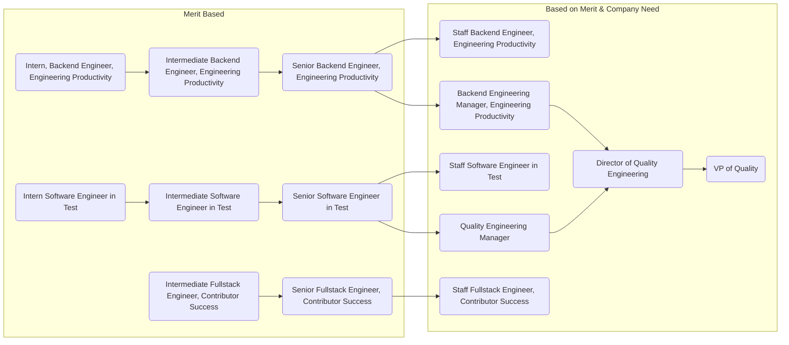
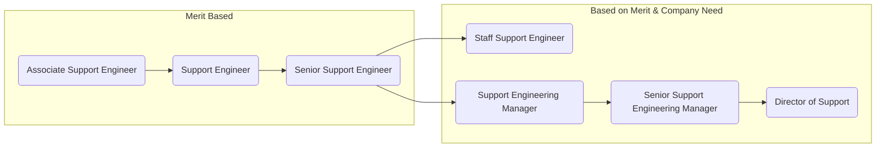
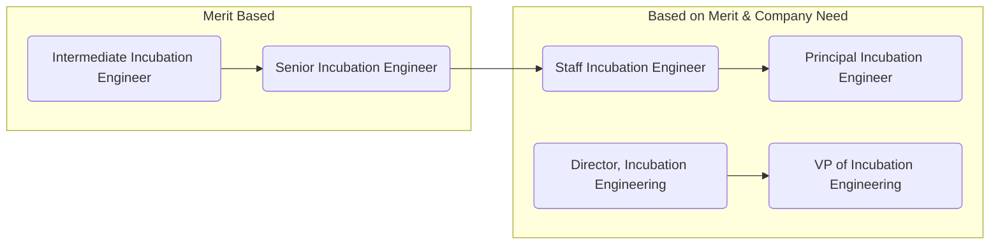

## The Three Components of Career Development

There are three important components of developing one's career:

### Structure

Team members who are (or want to be) on track for promotion should be engaged in
a career coaching conversation with their manager. Some basic information about
this process can be found in the [People Ops](/handbook/people-group/learning-and-development/career-development/#career-mapping-and-development) handbook.
Specific coaching plan templates are listed here to help start the conversation:

- [Senior Engineer](https://docs.google.com/document/d/11xZpY2RuTldp1g6bHRFYKwwlQjNjYaPquLPo5uD6hrg/edit#)
- (Others to come)

We want to build these documents around the career matrix for Engineering. Since this career
matrix is still being developed, these documents are currently based on the [job family requirements](/job-families/engineering/).

The first career matrix being developed is for [Individual Contributors in Engineering](/handbook/engineering/careers/matrix/).

When a team member is deemed ready for promotion, their manager should follow
the [promotion process outlined by People](/handbook/people-group/promotions-transfers/) Ops.

Remember that the coaching process helps team members understand what they need
to do in order to prepare for a more senior position on the team. The promotion
process documents what an engineer has already done to deserve a more senior
position on the team. The two processes are related, but they are not
substitutes for each other.

### Individual Initiative

Most career opportunities involve stepping into a position of informal or formal leadership. As such, the initiative
of the individual is a necessary component, as well as a qualification. However, for the sake of inclusion, we do ask that
managers periodically bring up the possibilities for advancement so that individuals know the avenues available to them
and receive encouragement to pursue them. Managers and individual contributors should strive to have a career development
conversation at least once a quarter.

### Opportunity

The GitLab Engineering career track offers a full path of opportunity for individuals to contribute.
There are scenarios where a position must become available before a promotion can occur. On the engineering track, there must be a position of need to be promoted from a Senior Engineer to either a Staff Engineer or an Engineering Manager, depending on your chosen path. Progression beyond these types of roles (e.g. Senior Engineer) are not guaranteed by time in role. There must be a justifiable need for the role and the candidate must have some level of demonstrated ability to thrive in these roles to be considered for the new position.

These next level opportunities are not guaranteed to be available and should not be viewed as career limiting. Again, using the Senior Engineering role as an example, is a critical role within GitLab. It is an accomplishment to thrive at the Senior level and should be celebrated as such.

## Mobility Principles

The Engineering Mobility Principle is an add-on to the company's mobility guidelines. For cases not covered in this section, please visit the [People Ops Internal Mobility guidelines](/handbook/people-group/promotions-transfers/#internal-mobility)

Career mobility is a part of career development, we support and encourage development and opportunities of our team members while maintaining or making conscious choices of impact to business objectives, current business team capacity, and budget constraints. The following steps must be followed

- Internal mobility should not be an easier path than a promotion for level change
- All new roles will follow inclusive hiring guidelines for posting and making them available to all potential internal candidates (must be open for a minimum of 5 days before any offer is made)
- All new roles have a recommended level that is determined by the expected return on investment for the given budget. Managers who wish to consider candidates above or below the given role may offer an interested internal candidate, the following two options:
  - Re-level the role with a business justification for how this change will benefit the company.
    - A [template (google document)](https://docs.google.com/document/d/1BAIty-x7otBpohe5w6Kl8DKD-C2nUS9MCm4JwognfVI/edit#heading=h.5onpwyv1o0vg) has been provided, please create a copy and fill in the business justification.
  - After evaluating the potential readiness of the candidate to meet the expected criteria within a given time period, accept the candidate for an interim period, up to 6 months, and evaluate readiness and impact of level change at the end of the interim period.
- Transfers between career paths (IC->EM, EM->IC) the person should be moved into an available role on an [interim/acting](/handbook/engineering/careers/#types-of-interim-roles) basis for 4-6 months before the change is made permanent with a promotion/evaluation rationale based on performance
- All role changes will be reviewed by R&D leadership on a weekly basis. This review will include impact on roadmaps and mitigation of the budget impact if the change requires additional budget to accommodate the request.
- All internal transfer candidates should have an aligned transition and communication plan to address impact on the previous team, including finalizing a plan for backfill and completing any milestones that are already underway.

## Individual Contribution vs. Management

Most important is the fork between purely technical work and managing teams. It's important that Engineering Managers self-select into that track and don't feel pressured. We believe that management is a craft like any other and requires dedication. We also believe that everyone deserves a manager that is passionate about their craft.

Once someone reaches a Senior-level role, and wants to progress, they will need to decide whether they want to remain purely technical or pursue managing technical teams. Their manager can provide opportunities to try tasks from both tracks if they wish. Staff-level roles and Engineering Manager roles are equivalent in terms of base compensation and prestige. Learn more about what it means to be a Staff-level engineer at GitLab in an [Engineering IC Leadership page](/handbook/engineering/ic-leadership/).

### Trying the Management Track

It's important that team members interested in the people management track have opportunities to try it out prior to committing themselves. Managers can provide multiple opportunities to Senior and Staff Engineers who want to consider moving into an available or upcoming manager role. Examples include hosting a Group Conversation, acting as the hiring manager for an intern position, or running a series of demo meetings for an important deliverable. These occasions for trying out management functions are useful and can provide good coaching opportunities for the individual looking to move to management. Some engineers may find through these experiences that they are better suited to remain on the technical path, and this gives them the ability to decide before investing a significant amount of time in the transition.

In order to facilitate the transition, we recommend any person moving from an Individual Contributor role to an Engineering Manager role work with their manager to create a focused transition plan. The goal is to provide a concentrated look into the responsibilities and challenges of people management with the understanding that, if the role is not for them, they can return to the IC track. A good example of how to build such a plan can be found in [this article](https://review.firstround.com/this-90-day-plan-turns-engineers-into-remarkable-managers/). Another good resource for when you are ready for the critical career path conversation is [this 30 mins video](https://www.youtube.com/watch?reload=9&v=hMz6QDURQOM&list=PLBzScQzZ83I8H8_0Qete6Bs5EcW3p0kZF&index=6).

### Temporary Management Positions

We create temporary management positions when there is organizational need, and we imprint these in our company org chart. These may be filled by someone who is transitioning into the role ([Interim Manager](/handbook/engineering/careers/#interim-manager)), experimenting with the role as they work on determining their career path ([Interim Manager](/handbook/engineering/careers/#interim-manager) or [Acting Manager](/handbook/engineering/careers/#acting-manager)) or, someone who is just filling in while we hire and who is not interested in pursuing an Engineering Manager role long term ([Acting Manager](/handbook/engineering/careers/#acting-manager)). This difference should be made explicit with the individual and team members before the temporary role is created. See the [types of temporary roles](#types-of-interim-roles) for more information on this distinction.

When someone fills a temporary role they are providing a service to the company, and perhaps getting a valuable career development opportunity for themself; so, poor performance against those duties would not result in termination. At worst, the person would return to their prior responsibilities. That does not mean, however, that an individual is immune to termination of their employment, for example if they commit a breach of their prior responsibilities or of the company's Code of Business Conduct & Ethics while in a temporary position.

Once you have been designated as filling a temporary management role, the current manager should update all reports to in Workday with a job information change request and create an access level request to grant interim manager access in Workday. Note that direct reports in Workday generally are [not moved to Acting managers](/handbook/people-group/promotions-transfers/#acting).

Those interested in these roles must:

- show managerial interest
- have experience in the individual contributor role for which they would be managing
- have been employed at GitLab for at least 6 months and thriving in our remote-only context
- exemplify [GitLab Values](/handbook/values/)
- For Acting Manager roles: be subject to a talent review depending on the length of appointment
- For Interim Manager roles: Apply through [Greenhouse](/handbook/people-group/promotions-transfers/#greenhouse-process-requirements) and go through selection process

Process for selection:

- Upcoming Interim and Acting manager roles will be discussed over the Staff/Department meetings and/or via Department Slack channels.
- Leadership can gather interest from their team members for the upcoming roles.
- Based on the above criteria the assessment will take place and most suitable team member will be selected for the role.

#### Types of Interim Roles

##### Acting Manager

An [Acting Manager](/handbook/people-group/promotions-transfers/#acting) is someone who occupies a role temporarily and will move back to their original role after a set amount of time or other conditions. An Acting Manager may be experimenting with the role as a part of determining their career development path, or may be filling in for a vacant role while we hire.

##### Interim Manager

When a team member is pursuing a people manager role (Level Manager+) long term we apply an interim period in the following instances:

| Current level      | Desired level  | Previous Management experience (3+ months) | Application of interim period |
|--------------------|----------------|--------------------------------------------|-------------------------------|
| Senior             | Manager        | No                                         | Yes                           |
|                    |                | Yes                                        | Yes                           |
| Staff              | Manager        | No                                         | Yes                           |
|                    |                | Yes                                        | No                            |
| Manager            | Senior Manager | No (managing managers)                     | Yes                           |
|                    |                | Yes (managing managers)                    | No                            |
| Manager/Sr Manager | Director       | No (managing managers)                     | Yes                           |
|                    |                | Yes (managing managers)                    | No                            |

*Note that `previous management experience` can be management experience in a previous organization, or management experience at GitLab. ["Acting"](/handbook/people-group/promotions-transfers/#acting) role management experience at GitLab can also count towards the 3 month threshold if that acting role was similar in scope and influence as the interim period would have been as evaluated by the hiring manager.*

##### Exceptions

For Director+ positions no interim is required.

Exceptions can also be reviewed on a case-by-case basis depending on readiness for team members who have served in acting roles, and who have passed the interview process for a permanent role.

#### Timeline for interim roles

The set timeline is for interim roles to be 3 months, and we recommend that interim periods do not exceed this timeframe.

There might be situations where an interim role does not need to be 3 months but a shorter period. This can happen when either the below success criteria are met before the 3 months pass or the team member has had experience with the new role prior to starting the interim period (for example via an acting role). If this is the case please reach out to your Department Head and People Business Partner to review.

If there is an exceptional case in which the manager feels they need *more than 3 months* to assess team member readiness in an interim position, they should discuss this with their Department Head and People Business Partner.

For acting roles, there is no set timeline for duration. This can be reviewed on a case-by-case basis.

##### Success criteria for Interim Roles

The main success criteria for interim managers at GitLab is to make one successful hire. The official promotion will not occur before 30 days after that person's hire, so that we can assess whether the hire was truly successful. If the new hire's success is indeterminate at the 30-day mark, then we will continue to review until a firm decision is made. If the new hire is not successful, that does not mean that the Interim Manager cannot eventually move into the full-time role.

In some cases, it may not be practical, fitting with the interim timeline or headcount planning might not allow for the Interim Manager to make a new hire. In this case the Interim Manager and the interim manager's manager should agree on success criteria based on the requirements of the role. The interim period not exceeding three months should take precedence over not being able to make a hire (so long as other success criteria are in place). Examples of other success criteria are (multiselect):

- Successfully pass an interview(s) with the Leader(s) of the department(s) around team management competencies/scorecard for Manager;
- Successfully pass team member relations case role play with the [People Business Partner](/handbook/people-group/#people-business-partner-alignment-to-division);
- Performing career development conversations with direct reports successfully;
- Perform a [Talent Assessment](/handbook/people-group/talent-assessment/) with the manager's manager to determine readiness for the role;
- Gather 360 feedback via Culture Amp for the manager.

Once the Interim Manager's first new hire has been at GitLab for 30 days, or other agreed success criteria has been met, the Interim Manager and Manager can work together to create and submit a [promotion document](/handbook/people-group/promotions-transfers/#for-managers-requesting-a-promotion-or-compensation-change) for approval.

On top of the success criteria we require that before moving into fulltime positions, interim managers begin the [Becoming A Manager](https://gitlab.com/gitlab-com/people-group/Training/-/blob/master/.gitlab/issue_templates/becoming-a-gitlab-manager.md) training. While up to 3 months in an interim position with hands on experience is helpful in determining whether people management track is right for team members, many situations and processes that people managers drive are not covered in this time period. The `Becoming A Manager` issue helps ensure that potential managers have a fuller picture in terms of policies, processes, and situations managers work through as part of their roles. The `Becoming A Manager` training is structured to be spread over the course of 3 months. Given that interim periods should last a maximum of 3 months, it may not be viable to fully complete the training before the interim period ends. The requirement is that the training issue is open and well underway before we move to permanent positions, and that it is finished aligned with the 3 month training timeframe.

For more details on logistics of ending an interim or acting period please refer to the [promotions and transfers page](/handbook/people-group/promotions-transfers/#interim-and-acting-roles).

## Roles

### Development Department

```mermaid
  graph LR;
  %% frontend roles
  eng:tfe(Intern Frontend Engineer);
  click eng:tfe "https://handbook.gitlab.com/job-families/engineering/development/frontend/#intern-frontend-engineer";

  eng:afe(Associate Frontend Engineer);
  click eng:afe "https://handbook.gitlab.com/job-families/engineering/development/frontend/#associate-frontend-engineer";

  eng:ife(Intermediate Frontend Engineer);
  click eng:ife "https://handbook.gitlab.com/job-families/engineering/development/frontend/#intermediate-frontend-engineer";

  eng:sfe(Senior Frontend Engineer);
  click eng:sfe "https://handbook.gitlab.com/job-families/engineering/development/frontend/#senior-frontend-engineer";

  eng:stfe(Staff Frontend Engineer);
  click eng:stfe "https://handbook.gitlab.com/job-families/engineering/development/frontend/#staff-frontend-engineer";

  %% backend roles
  eng:tbe(Intern Backend Engineer);
  click eng:tbe "https://handbook.gitlab.com/job-families/engineering/development/backend/#intern-backend-engineer";

  eng:abe(Associate Backend Engineer);
  click eng:abe "https://handbook.gitlab.com/job-families/engineering/development/backend/#associate-backend-engineer";

  eng:ibe(Intermediate Backend Engineer);
  click eng:ibe "https://handbook.gitlab.com/job-families/engineering/development/backend/#backend-engineer";

  eng:sbe(Senior Backend Engineer);
  click eng:sbe "https://handbook.gitlab.com/job-families/engineering/development/backend/#senior-backend-engineer";

  eng:stbe(Staff Backend Engineer);
  click eng:stbe "https://handbook.gitlab.com/job-families/engineering/development/backend/#staff-backend-engineer";

  %% fullstack roles
  eng:tfs(Intern Fullstack Engineer);
  click eng:tfs "https://handbook.gitlab.com/job-families/engineering/development/fullstack/#intern-fullstack-engineer";

  eng:afs(Associate Fullstack Engineer);
  click eng:afs "https://handbook.gitlab.com/job-families/engineering/development/fullstack/#associate-fullstack-engineer";

  eng:ifs(Intermediate Fullstack Engineer);
  click eng:ifs "https://handbook.gitlab.com/job-families/engineering/development/fullstack/#intermediate-fullstack-engineer";

  eng:sfs(Senior Fullstack Engineer);
  click eng:sfs "https://handbook.gitlab.com/job-families/engineering/development/fullstack/#senior-fullstack-engineer";

  eng:stfs(Staff Fullstack Engineer);
  click eng:stfs "https://handbook.gitlab.com/job-families/engineering/development/fullstack/#staff-fullstack-engineer";

  %% Engineering Manager
  eng:em(Engineering Manager);
  click eng:em "https://handbook.gitlab.com/job-families/engineering/development/management/engineering-manager/";

  %% engineering leadership
  eng:sme(Senior Engineering Manager);
  click eng:sme "/job-families/engineering/engineering-management/#senior-manager-development";

  eng:dir(Director of Engineering);
  click eng:dir "/job-families/engineering/engineering-management/#director-development";

  eng:pre(Principal Engineer);
  click eng:pre "/job-families/engineering/engineering-management/#principal-engineer";

  eng:dis(Distinguished Engineer);
  click eng:dis "/job-families/engineering/engineering-management/#distinguished-engineer";

  eng:sde(Senior Director of Engineering);
  click eng:sde "/job-families/engineering/engineering-management/#senior-director-development";

  eng:vpd(VP of Development);
  click eng:vpd "/job-families/engineering/engineering-management/#vp-of-development";

  eng:fel(Engineering Fellow);
  click eng:fel "/job-families/engineering/engineering-management/#engineering-fellow";

  %% career progression
  subgraph Based on Merit & Company Need
  eng:stfe & eng:em
  eng:stbe & eng:em
  eng:stfs & eng:em;

  eng:em-->eng:sme-->eng:dir-->eng:sde-->eng:vpd;
  eng:stbe & eng:stfe & eng:stfs-->eng:pre-->eng:dis-->eng:fel;
  end
  subgraph Merit Based
  eng:tfe-->eng:afe-->eng:ife-->eng:sfe-->eng:stfe & eng:em
  eng:tbe-->eng:abe-->eng:ibe-->eng:sbe-->eng:stbe & eng:em;
  eng:tfs-->eng:afs-->eng:ifs-->eng:sfs-->eng:stfs & eng:em;
  end
```

### Quality Department

### Support Department

### Infrastructure Department

```mermaid
  graph LR;

  subgraph Merit Based
  %% Backend Engineers
    eng:abe(Intern, Backend Engineer)-->eng:be(Senior Backend Engineer);
    eng:be(Backend Engineer)-->eng:sbe(Senior Backend Engineer);
  %% Site Reliability Engineer
    eng:asre(Intern, Site Reliability Engineer)-->eng:sre(Site Reliability Engineer);
    eng:sre(Site Reliability Engineer)-->eng:srsre(Senior Site Reliability Engineer);
  %% Database Reliability Engineer track
    eng:adbre(Intern, Database Reliability Engineer)-->eng:dbre(Database Reliability Engineer);
    eng:dbre(Database Reliability Engineer)-->eng:srdbre(Senior Database Reliability Engineer);
  %% Infrastructure Analyst
    eng:ia(Infrastructure Analyst)
  end

subgraph Based on Merit & Company Need
  %% Backend Engineers
    eng:sbe(Senior Backend Engineer)-->eng:stbe(Staff Backend Engineer);
    eng:stbe(Staff Backend Engineer)-->eng:pei(Principal Engineer Infrastructure);
    eng:pei(Principal Engineer Infrastructure)-->eng:dei(Distinguished Engineer Infrastructure);
    eng:dei(Distinguished Engineer Infrastructure)-->eng:efi(Engineering Fellow Infrastructure);

  %% Site Reliability Engineer
    eng:srsre(Senior Site Reliability Engineer)-->eng:stsre(Staff Site Reliability Engineer);
    eng:stsre(Staff Site Reliability Engineer)-->eng:pei(Principal Engineer Infrastructure);

  %% Database Reliability Engineer track
    eng:srdbre(Senior Database Reliability Engineer)-->eng:stdbre(Staff Database Reliability Engineer);
    eng:stdbre(Staff Database Reliability Engineer)-->eng:pei(Principal Engineer Infrastructure);

    %% Management
    eng:sbe(Senior Backend Engineer)-->eng:em(Engineering Manager);
    eng:srsre(Senior Site Reliability Engineer)-->eng:em(Engineering Manager);
    eng:srdbre(Senior Database Reliability Engineer)-->eng:em(Engineering Manager);
    eng:em(Engineering Manager)-->eng:sem(Senior Engineering Manager);
    eng:sem(Senior Engineering Manager)-->eng:di(Director of Infrastructure);
    eng:di(Director of Infrastructure)-->eng:vpi(VP of Infrastructure);

    %% Infrastructure Analyst
    eng:ia(Infrastructure Analyst)-->eng:vpi(VP of Infrastructure);
  end

  %% Backend engineer
  click eng:abe "/job-families/engineering/infrastructure/backend-engineer/";
  click eng:be "/job-families/engineering/infrastructure/backend-engineer/";
  click eng:sbe "/job-families/engineering/infrastructure/backend-engineer/";
  click eng:stbe "/job-families/engineering/infrastructure/backend-engineer/";

  %% Site Reliability Engineer
  click eng:asre "/job-families/engineering/infrastructure/site-reliability-engineer/";
  click eng:sre "/job-families/engineering/infrastructure/site-reliability-engineer/";
  click eng:srsre "/job-families/engineering/infrastructure/site-reliability-engineer/";
  click eng:stsre "/job-families/engineering/infrastructure/site-reliability-engineer/";

  %% Database Reliability Engineer
  click eng:adbre "/job-families/engineering/infrastructure/database-reliability-engineer/";
  click eng:dbre "/job-families/engineering/infrastructure/database-reliability-engineer/";
  click eng:srdbre "/job-families/engineering/infrastructure/database-reliability-engineer/";
  click eng:stdbre "/job-families/engineering/infrastructure/database-reliability-engineer/";

  %% Infrastructure Management
  click eng:em "/job-families/engineering/infrastructure/engineering-management/";
  click eng:sem "/job-families/engineering/infrastructure/engineering-management/";
  click eng:di "/job-families/engineering/infrastructure/engineering-management/";
  click eng:vpi "/job-families/engineering/infrastructure/engineering-management/";

  %% Individual contributors
  click eng:ia "/job-families/engineering/infrastructure/analyst";
  click eng:dei "/job-families/engineering/infrastructure/distinguished-engineer/";
  click eng:efi "/job-families/engineering/infrastructure/engineering-fellow/";
```

### Incubation Engineering Department

## Apprenticeship for Learning

Typically, an apprenticeship provides an individual with an overview of a position or field over a short period of time. It's surface-level learning geared towards team members who are still exploring their interests and deciding what options they'd like to pursue. If the field of interest, it's subject matter experts and the department they want to learn more about can support this effort, then this offers a good opportunity for an internship. For more information on the process please review this handbook section on [Internship for Learning](/handbook/people-group/learning-and-development/internship-for-learning/).

Eligibility criteria:

- You are excelling in your role (no performance issues)
- You have been working full time with GitLab for at least 6 months

The apprentice agrees to:

- Continue to support their current role and report to their current manager
- Dedicate a pre-determined percentage of their time to the apprenticeship role
- Have clear timelines and deliverables throughout the apprenticeship
- Communicate their assignments and availability clearly to both departments

In return, the department with which they are interning agrees to:

- Provide guidance and support to the apprentice
- Offer meaningful projects for the apprentice to work on
- Be flexible, so that the apprentice can continue to support their primary team and carry an appropriate workload

By default, apprenticeships last for 6 months. At the end of 6 months, both the intern and the department will determine whether it makes sense to extend the timeframe further.

If you wish to apprentice with an Engineering team, start by speaking with your manager.

**Important**: The Apprenticeship for Learning program should differ from any situations where there is actual temporary or permanent [realignment/redeployment/secondment](/handbook/people-group/promotions-transfers/#realignment-of-resources-impacting-multiple-team-members) as a result of changing business needs. If you are unsure whether your situation is aligned with the Apprenticeship for learning program or falls into a resources realignment, please discuss with your aligned [People Business Partner](/handbook/people-group/#people-business-partner-alignment-to-division).

## Associates Engineers

Learn more about the career and skill growth support we provide our Associate Engineers [here](/handbook/hiring/associate-engineer-development/).

As of 2024 this is currently being piloted with the Core Development and Expansion sub-departments.

## Senior Engineers

Note that we have a specific section for [Senior Engineer](/job-families/engineering/backend-engineer/#senior-backend-engineer) because it's an important step in the technical development for every engineer. But "Senior" can optionally be applied to any role here indicating superior performance. However, it's not required to pass through "senior" for roles other than Engineer.

The Senior Engineer role is a critical role where we need the most contributions. It should also be considered a destination role. It is not a given that you will naturally progress into the next role, whether it is Staff or Management. There are different needs and expectations for the next role. Individual growth and progression is supported and encouraged at GitLab, however progression beyond the Senior Engineering role is gated on availability and need. There may not be a need for another Staff or Management position.

Senior engineers typically receive fewer trivial comments on their merge requests. Attention to detail is very important to us. They also receive fewer *major* comments because they understand the application architecture and select from proven patterns. We also expect senior engineers to come up with simpler solutions to complex problems. Managing complexity is key to their work. [Staff](/job-families/engineering/backend-engineer/#staff-backend-engineer) and [Distinguished](/job-families/engineering/infrastructure/distinguished-engineer/) positions extend the Senior Engineer role.

## Promotion

We strive to set the clearest possible expectations with regard to performance and [promotions](/handbook/people-group/promotions-transfers/). Nevertheless, some aspects are qualitative. Examples of attributes that are hard to quantify are communication skills, mentorship ability, accountability, and positive contributions to company culture and the sense of psychological safety on teams. For these attributes we primarily rely on the experience of our managers and the [360 feedback](/handbook/people-group/360-feedback/) process (especially peer reviews). It's our belief that while a manager provides feedback and opportunities for improvement or development, that it's actually the team that elevates individuals.

### Engineering Promotion Rate

People Operations tracks the [Promotion Rate](/handbook/people-group/people-success-performance-indicators/#promotion-rate) for the company overall and each division separately. The target is 15% annually. This metric is treated as an organizational health indicator for the quality of decisioning making our leaders are employing, and for the fairness in our process. In FY21 Engineering was exactly on its target of 12%. So we would not currently consider blocking any individual promotion based on the overall rate. If that were to change, and Engineering became an outlier, we would reevaluate. Here is the company-wide [process](/handbook/people-group/promotions-transfers/).

#### Transfer Options

The following table outlines some of the possible lateral transfer options at any level of the role, but don't feel limited by this table. Compa Ratio might differ per individual to determine leveling for each of the positions listed.

| Starting Role       | Lateral Options           |
|---------------------|---------------------------|
| Frontend Engineer   | Product Designer          |
| Product Designer    | Frontend Engineer         |
| Backend Engineer    | Production Engineer       |
| Production Engineer | Backend Engineer          |
| Backend Engineer    | Support Engineer          |
| Support Engineer    | Backend Engineer          |
| Support Engineer    | Solutions Architect       |
| Support Engineer    | Customer Success Manager |
| Support Engineer    | Implementation Specialist |
| Automation Engineer | Backend Engineer          |
| Backend Engineer    | Automation Engineer       |

Lateral transfers among backend teams are also an option. Those teams include Distribution, Create, Verify, Release, Geo, Monitoring, Gitaly, etc.

## Team members on loan to another team

A team member may be "on loan" to another team for various reasons. This is less formal and handled differently than [interim](#types-of-interim-roles) roles. When this occurs it is recommended to:

- Invite the team member to all Slack channels used by the team. (Don't worry about Slack channel overload. The team member can unsubscribe if they don't find it useful.)
- Invite the team member to any standup activities used by the team. To avoid task overload, the team member can choose to stop participating in their home team standup.
- The manager of the team should schedule weekly 1-1 meetings with the on-loan team member. The team member can choose to stop having weekly 1-1s with their home team manager.

Team members who were on loan to another team documented these best practices in a retrospective.
