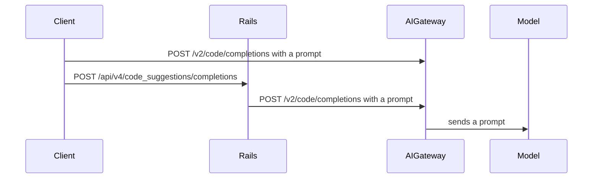
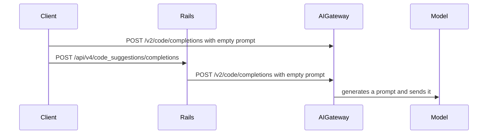
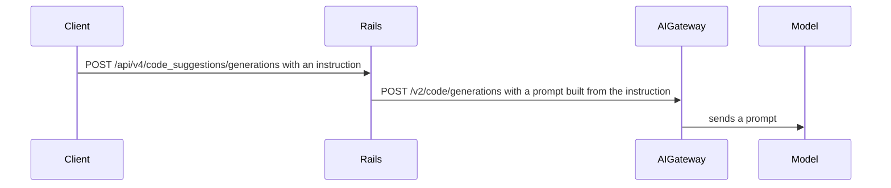
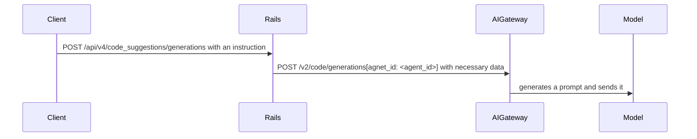
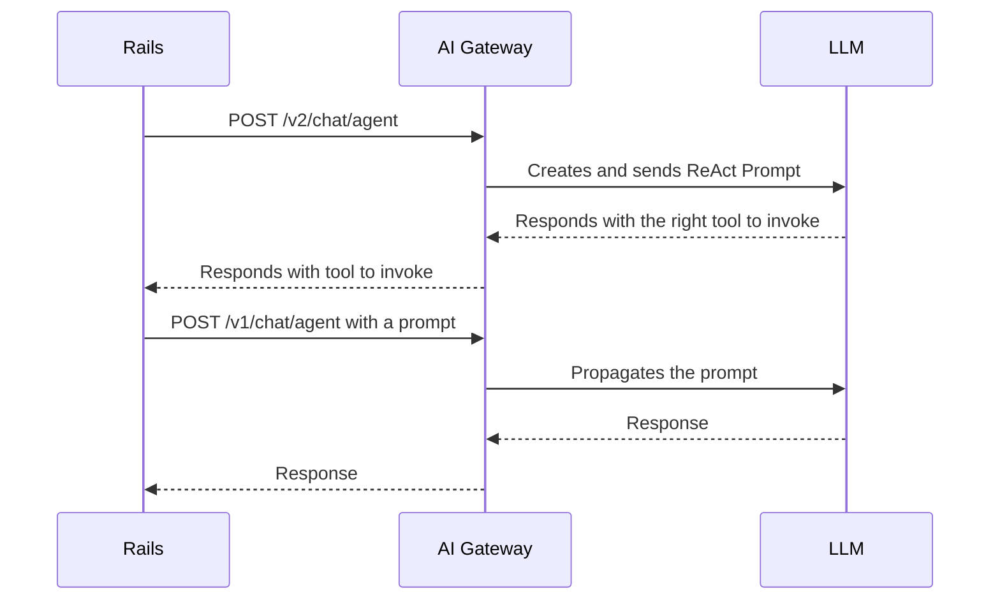
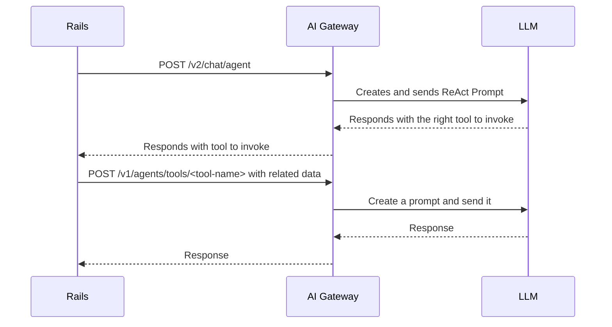

<!-- Design Doucments often contain forward-looking statements -->

<!-- This renders the design document header on the detail page, so don't remove it-->


## Summary

The LLM prompts were developed in the Rails codebase to leverage existing Ruby expertise and as the AI Gateway was evolving. Now that the AI Gateway is a stable and key part of the GitLab infrastructure the prompts can be migrated from Rails into the AIGW. The Rails monolith remains the persistence and control layer, with AI features becoming a thin entrypoint which refer to the prompt and wrapper code in the AI Gateway. The Rails monolith also has to pass all parameters required for the referenced prompt. Prompt definitions are moved to YAML files on the AI Gateway with Python wrappers. GitLab AI functionality is expected to be unchanged during evaluations.

## Motivation

Moving prompts to the AI Gateway offers the following advantages:

- Native access to data science libraries written in Python
- Ability to iterate on AI features and prompts without changing Ruby code and upgrading GitLab Rails
- The clients with direct access to the AI Gateway don't need to rely on Rails to retrieve prompts or duplicate the prompt logic
- Ability to maintain or analyze the prompts data that is now stored in a single place

### Goals

- Migrate most of the prompts from GitLab Rails Ruby code to YAML files in the AI Gateway
- Preserve the existing AI functionality: product coverage, performance, observability
- Cleanup the prompts that are no longer used ([example](https://gitlab.com/gitlab-org/gitlab/-/issues/469377))

## Proposal

Use [Agents](https://docs.gitlab.com/ee/development/ai_features/#2-create-an-agent-definition-in-the-ai-gateway) to implement the functionality that executes a model request based on the given information and agent definition. The agent definition is stored in a YAML file: prompt template, model and client information, and LLM params.

[Agent](https://docs.gitlab.com/ee/development/ai_features/glossary.html#duo-workflow-terminology)
is an AI-driven entity that performs various tasks. In the context of this blueprint, we refer to the agents [implemented](https://gitlab.com/gitlab-org/modelops/applied-ml/code-suggestions/ai-assist/-/tree/main/ai_gateway/agents?ref_type=heads) in the AI Gateway: an entity that basically locates the defined prompt template and executes it with the passed parameters.

The agents functionality can be exposed by using a generic endpoint, defining a
separate endpoint or extending the existing endpoints to use agents.

### Use generic endpoint

[Generate issue description](https://gitlab.com/gitlab-org/gitlab/-/merge_requests/152429) uses the generic [`v1/agents/{agent_id}`](https://gitlab.com/gitlab-org/modelops/applied-ml/code-suggestions/ai-assist/-/blob/61f45843f759345f884f4b902cf20390a4682cae/ai_gateway/api/v1/agents/invoke.py#L25) endpoint that accepts agent id and the [parameters](https://gitlab.com/gitlab-org/modelops/applied-ml/code-suggestions/ai-assist/-/blob/61f45843f759345f884f4b902cf20390a4682cae/ai_gateway/api/v1/agents/invoke.py#L14).

Agent id indicates the location of the prompt definition. For example,
`v1/agents/chat/explain_code` expects to find a prompt in the
`ai_gateway/agents/definitions/chat/explain_code` folder. If a new version of a
prompt is introduced, it can be accessed through a new endpoint. For example,
`v1/agents/chat/explain_code/v1` looks for a definition in the
`ai_gateway/agents/definitions/chat/explain_code` folder.

The parameters are sent directly to the prompt template of the agent definition.
If any parameter is missing, an error is raised, therefore, if the prompt
template is changed to include a new parameter, it's a breaking change and a new
version of a prompt is recommended.

### Define separate endpoint

[Duo Chat React](https://gitlab.com/gitlab-org/gitlab/-/issues/456258) uses [`v2/chat/agent`](https://gitlab.com/gitlab-org/modelops/applied-ml/code-suggestions/ai-assist/-/blob/61f45843f759345f884f4b902cf20390a4682cae/ai_gateway/api/v2/chat/agent.py) because it's a complex feature that requires pre and post processing.

The prompt version can be controlled by parameters passed to the endpoint.

### Extend existing endpoint

[Code Completions](https://gitlab.com/gitlab-org/gitlab/-/issues/473156) extends the existing [`v2/code/completions`](https://gitlab.com/gitlab-org/modelops/applied-ml/code-suggestions/ai-assist/-/blob/61f45843f759345f884f4b902cf20390a4682cae/ai_gateway/api/v2/code/completions.py#L150) endpoint to use agents. It enables gradual migration of complex features with a lower risk of breaking the existing functionality.

The prompt version can be controlled by existing or new parameters passed to the endpoint.

## Iteration plan

[Prompt Migration to AI Gateway](https://gitlab.com/groups/gitlab-org/-/epics/14259) is used to track the progress.

- Migrate [Code Completions/Generations prompts for Custom Models](https://gitlab.com/groups/gitlab-org/-/epics/14430). The features backed by Custom Models are experimental/beta, i.e lower risk of degrading the experience of existing customers.
  - Migrate Code Completions/Generations prompts for GA Models.
- Migrate Duo Chat ReAct prompt (currently in [progress](https://gitlab.com/gitlab-org/gitlab/-/issues/456258)).
  - Migrate Duo Chat ReAct prompt for Custom Models
- Migrate [Duo Chat Tools prompts for Custom Models](https://gitlab.com/groups/gitlab-org/-/epics/14431). The features backed by Custom Models are experimental/beta, i.e lower risk of degrading the experience of existing customers.
  - Migrate Code Completions/Generations prompts for GA Models.
- Migrate other Duo Features.

## Design and implementation details

### Prompt Definition

Agents are defined in  [AI Gateway](https://gitlab.com/gitlab-org/modelops/applied-ml/code-suggestions/ai-assist) at [ai_gateway/agents/definitions](https://gitlab.com/gitlab-org/modelops/applied-ml/code-suggestions/ai-assist/-/tree/main/ai_gateway/agents/definitions). The definitions are `.yml` files stored in a folder per feature: `generate_issue_description` or `chat/react` or `code_suggestions/generations/v2`. The folder is the agent-id.

The name of YAML files is either the name of the model for which the prompt is defined or `base.yml`: `code_suggestions/completions/codegemma.yml` or `chat/react/base.yml`. If an agent definition for a specific model is requested by passing model metadata, then a definition for the model is used; otherwise, the base definition is used.

This folder structure also supports versioning. For example, `v2`
subfolder can be created in a feature folder and contain new prompts for all
models: `code_suggestions/generations/v2/base.yml` and  `code_suggestions/generations/v2/mistral.yml`.
The feature then uses `code_suggestions/generations/v2` instead of `code_suggestions/generations` as agent-id to point to the new prompt based on a condition, for example, a feature flag.

As a result, the definitions are stored in the following structure:

```yaml
ai_gateway/agents/definitions

chat
  react
    base.yml
    mistral.yml
  explain_code
    base.yml
    mistral.yml
code_suggestions
  completions
    base.yml
    codegemma.yml
    codestral.yml
  generations
    v2
      base.yml
      mistral.yml
    base.yml
    mistral.yml
...
```

This structure has the following benefits:

- Related features can be grouped. For example (`code-completions` and `code-generations`)
- A feature can contain multiple versions of a prompt in a folder
- Ambiguity can be resolved by putting features with identical names in different folders: for example, `explain-code` tool and `explain-code` feature

The definitions can be potentially improved by introducing inheritance. When a feature has mostly the same definition for all models, it can inherit from or include a base definition and extend it.

#### Versioning

By versioning our prompts, we allow feature developers to pin the prompt they are using to an immutable value, enabling other developers to safely work on iterations with the guarantee that this [will not cause regressions](https://gitlab.com/groups/gitlab-org/-/epics/15816). For example, [Custom Models prompts for Duo Chat on Mistral prompts were broken due to changes to upstream Claude prompts](https://gitlab.com/gitlab-org/gitlab/-/issues/498290).

##### Why Semantic Versioning

 We use semantic versioning for versioning our prompts, where each version is a file within the target prompt. Using semantic version enables us to communicate expectations about compatibility:

- A bump to the patch means a fix to the prompt that is backwards compatible.
  - Example: [removing a rogue `\n`](https://gitlab.com/gitlab-org/modelops/applied-ml/code-suggestions/ai-assist/-/merge_requests/1589)
- A bump to the minor means a feature addition that doesn't require any changes to the api
  - Example: a new parameter is added to the template but a default is provided
- A bump to the major means a non-backwards compatible change:
  - Example: the template prompt new parameters but providing a default is not possible.

Since this versions are pinned on consumers of the prompts, new iterations will not affect existing released features.

Another benefit we get by using semantic versioning is the extensive [tooling](https://pypi.org/project/semantic-version/) for resolving a version. Intead of receiving a specific version, AIGW can resolve a version based on a spec (for example, `1.x` would fetch the highest stable version with major being 1).

##### Version structure

If we have a version `1.0.0` and `2.0.0` for prompts support completion for gpt, versions `1.0.0` and `1.0.1` for claude_3 and only `1.0.0` for the default model, then the versioned prompt directory will look like:

```yaml
definitions/
  code_suggestions/
    completion/
      gpt/
        1.0.0.yml
        1.0.0-rc.yml
        2.0.0.yml
      claude_3/
        1.0.0.yml
        1.0.1.yml
    partials/
      completion/
        user/
          1.0.0.yml
```

##### Pinning a version

Clients should provide a specific range of the prompt to indicate which updates they want to use automatically (patch, minor). For most AI features, this means setting a version range in the Rails app (e.g. `^1.0`), which also allows us to control version changes using feature flags. Some other features, like code completions, will require setting the range in their respective clients (e.g. the VSCode extension, the GitLab Language Server, etc).

##### Releasing new versions and version expectations

Release candidates (`-alpha`, `-beta`, `-rc`) are ignored by version resolvers, and must be mentioned manually. They are not required to be immutable, which makes them useful for testing a new feature or fix behind a feature flag:

```ruby
def prompt_version
  return '1.0.1-rc' if Feature.enabled?(:feature_fix)

  '^1.0'
end
```

This ensures that self-hosted instances can still receive tested updates: self-hosted will only fetch stable versions, as well as evaluations with CEF.

Once results with the release candidate prompt match the expectations, the suffix can be removed. At this point, the version becomes immutable. This can be done once usage was tested (ideally with a feature flag) AND evaluations were run and taken into account.

Some prompts also use template partials to reuse parts across different features: these must also be versioned, since changing them can affect multiple different features. To release a new version of a prompt partial, first create a release version of the partial, and mention that partial in the a new release version for the main prompt.

##### Migration process

This change requires no action by feature teams initially. The change will be automated: the current prompt directory will be migrated automatically, and every prompt will be assigned `1.0.0` as initial version. The version requested by clients, when not provided, will be `1.0.0` as well. That way, changes initially transparent to feature teams. Once the migration to prompt versioning takes place however, the versioning expectations will be enforced.

Migration work is highlighted in [this epic](https://gitlab.com/groups/gitlab-org/-/epics/15837)

##### Disadvantages

- We do not have diffing between consecutive versions in GitLab. We can still diff between files using command line.

- The immutability of a prompt file might not fit our workflow, and require too many new files to be created. As alternative, we can relax the requirement for patches, and just create new files at the minor updates.

Both downsides can be tackled by moving prompts to it's own repository, so that version updates become new commits instead of new files.

### Code Completion

#### Current behavior

Code Completions request either:

- Goes through Rails to generate a prompt and sends it to the AI Gateway
- Goes to the AI Gateway directly if direct access is enabled



#### Proposal

Code Completions sends an empty or nil prompt and additional data to indicate that the prompt must be generated by the AI Gateway. The AI Gateway uses the request data to generate a prompt itself and sends it to a model:



#### PoC

- This [MR](https://gitlab.com/gitlab-org/modelops/applied-ml/code-suggestions/ai-assist/-/merge_requests/1063) demonstrates extending the existing `/v2/code/completions` that uses agents to build and execute the prompt.
- This [collaboration issue](https://gitlab.com/gitlab-org/gitlab/-/issues/473156) contains more details for using the endpoint.

### Code Generation

#### Current behavior

Code Generations requests go through Rails to generate a prompt and send it to the AI Gateway:



#### Proposal

Code Generation sends a request that contains user instructions only and additional data and the AI Gateway generates a prompt to send it to a model.



For Code Generations, we can use the `prompt` field to pass the additional information for code generation, so we cannot nullify it to indicate agent usage:

- Use `agent_id` fields to indicate agent usage with the location of the prompt
- Eventually, `prompt` field contains the user instruction only
- For the first iterations, we can pass the whole prompt and then iteratively migrate different parts from the Rails prompt to the AI Gateway

#### PoC

- This [PoC](https://gitlab.com/gitlab-org/modelops/applied-ml/code-suggestions/ai-assist/-/merge_requests/1096) demonstrates extending the existing `/v2/code/generations` that uses agents to build and execute the prompt.
- This [collaboration issue](https://gitlab.com/gitlab-org/gitlab/-/issues/473394) contains more details for using the endpoint.

### Duo Chat Tools

#### Current behavior

Rails receives from AI Gateway the information about which tool to invoke,
generates a prompt and sends it to AI Gateway.



#### Proposal

Rails receives from AI Gateway the information about which tool to invoke, sends
all related data to generate a prompt to AI Gateway. AI Gateway generates a
prompt and sends a request to LLM.



When a new version of a prompt is introduced (like
`ai_gateway/agents/definitions/chat/explain_code/v1`), then `/v1/agents/tools/<tool-name>/<version>` endpoint will be called.

#### PoC

These [Rails](https://gitlab.com/gitlab-org/gitlab/-/merge_requests/160252)
and [AI Gateway](https://gitlab.com/gitlab-org/modelops/applied-ml/code-suggestions/ai-assist/-/merge_requests/1132) MRs
demonstrate the execution of a chat tool via agents.

Migrating any other tools comes down to:

- Defining unit primitive and creating a feature flag in
  [Rails](https://gitlab.com/gitlab-org/gitlab/-/merge_requests/160252/diffs?commit_id=94fe5361f0c9815639b0e0471f68189445c25f80)
- Adding a prompt in [AI Gateway](https://gitlab.com/gitlab-org/modelops/applied-ml/code-suggestions/ai-assist/-/merge_requests/1132/diffs?commit_id=aaaee478eddeccd4fb51cefc1491ec2ad3b7e36f)
- Cleaning up the Rails part after the feature flag is enabled

## Testing and Validation Strategy

Ideally, the migration shouldn't change the prompt or any LLM parameters. That's
why testing and validation strategy comes down to verifying that the requests to
the model are identical before and after the migration.

For Anthropic models, run the AI Gateway with the following env variable and verify
that the parameters sent to the Anthropic server are the same:

```bash
ANTHROPIC_LOG=debug poetry run ai_gateway
```

For LiteLLM models, run the
[proxy](https://docs.gitlab.com/ee/administration/self_hosted_models/litellm_proxy_setup.html#example-setup-with-litellm-and-ollama)
with [detailed debug](https://docs.litellm.ai/docs/proxy/debugging#detailed-debug) enabled and
verify that the parameters sent to the model are the same:

```bash
litellm --detailed_debug
```

If the prompt or the LLM parameters are changed, then an additional evaluation
is recommended before rolling out
([example](https://gitlab.com/gitlab-org/gitlab/-/issues/470819)).

## Rollout Plan

The rollout plan depends on the individual feature, but the following
collaboration issues can be used as examples:

- [Code Generations](https://gitlab.com/gitlab-org/gitlab/-/issues/473394)
- [Code Completions](https://gitlab.com/gitlab-org/gitlab/-/issues/473156)

The changes should be introduced behind a feature flag:

- If the features are experimental/beta and can be grouped into a single logical
  section (like Custom Models), a single feature flag can be used.
- If a feature is GA, a separate feature flag per feature is recommended.
