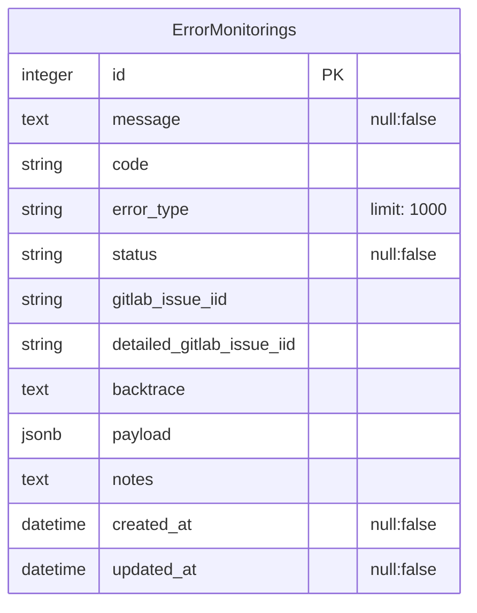
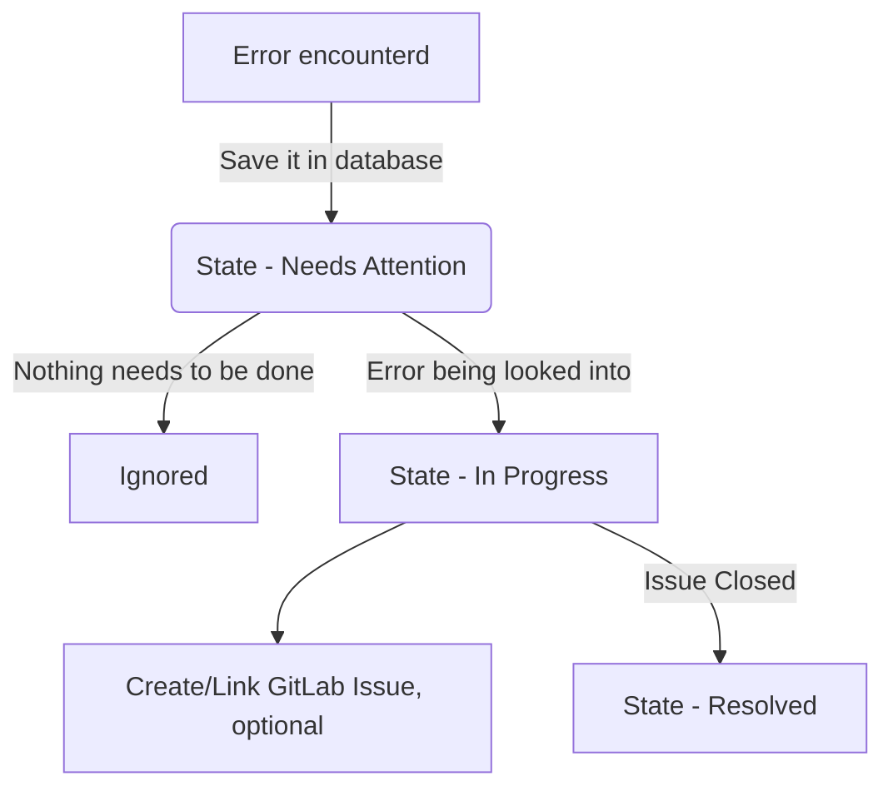
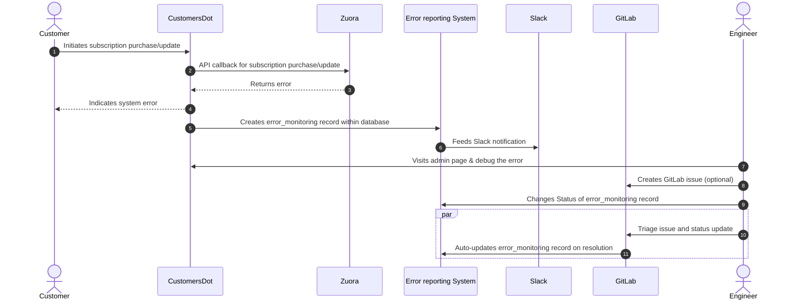

---
# This is the title of your design document. Keep it short, simple, and descriptive. A
# good title can help communicate what the design document is and should be considered
# as part of any review.
title: CustomersDot revenue impacting error monitoring & improvements
status: proposed
creation-date: "2024-09-02"
authors: [ "@shreyasagarwal", "@aish.sub", "@vshumilo" ]
coaches:
dris: [ "@ppalanikumar", "@jameslopez" ]
owning-stage: "~devops::fulfillment"
participating-stages: []

toc_hide: true
---

<!-- This renders the design document header on the detail page, so don't remove it-->


## Summary

CustomersDot is a powerful platform designed for customers to seamlessly purchase and manage their subscriptions. For SaaS applications, CustomersDot communicates with GitLab.com through API calls to update subscription details in real-time. For self-managed (SM) applications and dedicated instances, it generates a license for installation on the customer's system. The latest version enhances this process by enabling license installation through the cloud, offering greater convenience and flexibility.

CustomersDot integrates with several third-party tools, such as [Zuora](../../../../business-technology/enterprise-applications/guides/zuora/) and Salesforce. Zuora is an end-to-end order-to-revenue SaaS platform that drives GitLab's quoting, billing, revenue collection, revenue recognition, and subscription metrics reporting. It also supports the back-office teams responsible for these operations.

## Motivation

From a SOX compliance perspective, it is crucial to identify and track any errors that occur during the purchase, update and provisioning of subscriptions within the CustomersDot application. Currently, we utilize the [Provision Tracking System](https://gitlab.com/gitlab-org/customers-gitlab-com/-/blob/de36e3ddef5c875aa2c675b3d9e0f34767a43bfc/doc/provision_tracking_system/failure_monitoring.md) to monitor the provisioning process after a subscription is created or updated. However, there is a tracking gap for certain revenue recognition-impacting errors that occur before a subscription purchase or update. It is crucial to address this gap to ensure comprehensive error tracking and improve the accuracy of revenue recognition processes.

### Goals

The goal is to deliver a tracking and monitoring system for revenue-impacting errors that occur during the purchase, update, renewal, and reconciliation flows. This will cover the following aspects of CustomersDot integrations (Zuora, Salesforce for Q3 & others in Q4 2025).

A spike issue for the proposal can be found at gitlab-org/customers-gitlab-com#10430.

* Enhanced visibility for stakeholders (Accessing different systems to verify data)
* Document edge cases
* Automated error monitoring/Alerting system
* Document fixes or processes for 3rd party errors (like Zuora unavailability etc)

## Proposal

The [Fulfillment Platform group](../../../development/fulfillment/fulfillment-platform/) currently handles the manual process of monitoring the described errors. Each week, an engineer is assigned to a [Job monitoring issue](https://gitlab.com/gitlab-org/customers-gitlab-com/-/blob/main/.gitlab/issue_templates/Job%20monitoring%20weekly.md?ref_type=heads), where they must gather a collection of errors daily by running a script. These errors are then reviewed individually to identify actionable items, such as those not related to user validation, payment method validation, or location issues. The engineer manually resolves these errors with the use of console or Admin panel.

To improve efficiency and results, we need to automate this process.

* **Develop a new system for error tracking** to improve the monitoring of provisioning and revenue recognition errors.
  * **Create a new database table** to store error logs.
  * **Add a new view in the admin panel** to display and manage these errors.
* **Enhance the codebase** to automatically store relevant errors in the new database.
* Implement **Slack notifications** to alert the team whenever a new error is encountered.
* **Automate issue creation**:
  * Generate a daily issue summarizing new errors encountered each day.
  * Generate a weekly issue summarizing all errors encountered throughout the week.
* **Set up a cron job** to run daily as an audit, tracking reconciliations and renewals that failed to process, and add them to the error log.

## Design and implementation details

### Proposed DB schema

The `error_monitorings` table is designed to store meaningful errors that are valuable for monitoring as they occur. Most of the columns are self explanatory. Taking an example of the [current logging in google cloud](https://console.cloud.google.com/logs/query;query=resource.type%3D%22gce_instance%22%0Aseverity%3DERROR%0AinsertId%3D%22va7ahf34wc3i%22;cursorTimestamp=2024-09-06T03:18:44.840Z;aroundTime=2024-09-06T03:18:44.840Z;duration=PT24H?project=gitlab-subscriptions-prod).

* `code` -> VALIDATION_ERROR
* `error_type` -> This code is not valid. Try re-entering the code from your email.
* `message` -> Subscription update failed

Currently, we are tagging error messages with `fulfillment_job_monitoring` within the codebase and using GCloud to look up and resolve them individually. Moving forward, the plan remains the same: we will begin by logging errors with the `fulfillment_job_monitoring` tag into the database.

Errors will continue to be addressed individually. As soon as an error is encountered, we will send an immediate notification to the designated Slack channel, probably through the background job, to ensure timely resolution.

Right now, most of the errors being tagged are considered noise. In the future, once the error list is addressed, unnecessary noise will be filtered out and not saved in the database.

#### Error states

The status column stores the state of the error encountered.

### Workflow

### Places of interest to add entries within `error_monitorings` table?

1. When a customer is purchasing a subscription.
    * [SubscriptionController's create action](https://gitlab.com/gitlab-org/customers-gitlab-com/-/blob/main/app/controllers/subscriptions_controller.rb#L304)
1. When a customer is updating a subscription.
    * [SubscriptionController's update action](https://gitlab.com/gitlab-org/customers-gitlab-com/-/blob/main/app/controllers/subscriptions_controller.rb#L304)
1. When a customer upgrades the subscription.
    * [SubscriptionUpgradesController create action](https://gitlab.com/gitlab-org/customers-gitlab-com/-/blob/main/app/controllers/subscription_upgrades_controller.rb#L59)
1. When syncing the product catalog to local cache
    * [Zuora::SyncProductCatalogLocalCacheJob](https://gitlab.com/gitlab-org/customers-gitlab-com/-/blob/main/app/jobs/zuora/sync_product_catalog_local_cache_job.rb)
    * [Zuora::EvictMissingProductCatalogEntitiesJob](https://gitlab.com/gitlab-org/customers-gitlab-com/-/blob/main/app/jobs/zuora/evict_missing_product_catalog_entities_job.rb)
    * [Zuora::SyncProductResourceJob](https://gitlab.com/gitlab-org/customers-gitlab-com/-/blob/main/app/jobs/zuora/sync_product_resource_job.rb)
1. When the reconciliation is being performed
    * [ReconciliationService](https://gitlab.com/gitlab-org/customers-gitlab-com/-/blob/main/app/services/reconciliation_service.rb)
    * [Reconciliations::UpdateSaasUserCountService](https://gitlab.com/gitlab-org/customers-gitlab-com/-/blob/main/app/services/reconciliations/update_saas_user_count_service.rb)
1. When Salesforce entities are getting created/updated
    * [Salesforce::CreateAccountWorker](https://gitlab.com/gitlab-org/customers-gitlab-com/-/blob/main/app/workers/salesforce/create_account_worker.rb)
1. When the subscription is getting auto renewed
    * [AutoRenewService](https://gitlab.com/gitlab-org/customers-gitlab-com/-/blob/main/app/services/auto_renew_service.rb)
