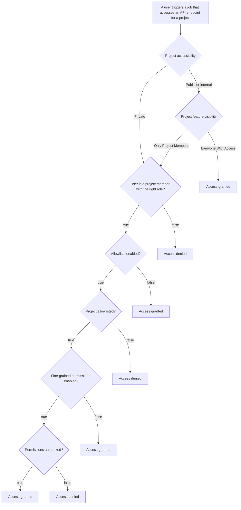

<!-- vale gitlab.FutureTense = NO -->


## Summary

GitLab CI is a Continuous Integration platform widely used to run various jobs,
builds, and pipelines.

Each CI job is provided with a [CI job token](https://docs.gitlab.com/ee/ci/jobs/ci_job_token.html)
(a kind of a security token) that allows it to interact with other GitLab APIs
to accomplish a task. Currently, this token has the same level of access as the
user who triggered the pipeline, which violates the [principle of least privilege (PoLP)](https://csrc.nist.gov/glossary/term/least_privilege).

This proposal outlines the development needed to reduce the access granted by
this token in order to adhere to the principle of least privilege, while
delivering incremental value along the way.

## Motivation

Currently, when a CI job runs, it is provided with a `CI_JOB_TOKEN`, which the
job uses to interact with GitLab resources. This token is tied to the identity
of the user who triggered the CI job, carrying a fixed set of permissions based
on that user's roles and access levels.

When an API request includes a `CI_JOB_TOKEN`, the authorization process checks
the role of the user who triggered the pipeline and restricts access to the API
using CI allowlist rules. However, this method of computing the runtime access
of the `CI_JOB_TOKEN` can unintentionally expose new APIs, increasing the risk
of abuse.

We do support more types of tokens than just a CI job token. Authorization
behavior varies based on the type of token presented, and these differences can
create gaps in enforcement as new API endpoints are introduced or modified.

This proposal introduces a different kind of a `CI_JOB_TOKEN`, following a
standardized format we might be able to apply across the various token types in
use today, simplifying the process of authorization.

### Goals

This proposal aims to establish a consistent format for generating a CI job token,
allowing for more granular control over access scopes. In particular, it seeks
to limit the scope of the `CI_JOB_TOKEN` by defining the minimum necessary
permissions for each token.

- The `CI_JOB_TOKEN` should be ephemeral and grant only the minimal required access.
- Permissions CI job tokens can have should be customizable per project.
- The token should support extensions, such as the inclusion of fields like [`organization_id`](https://gitlab.com/gitlab-com/content-sites/handbook/-/merge_requests/8527).
- Current `CI_JOB_TOKEN` behavior should be preserved following our breaking
  changes policy.

### Non-Goals

- A [Security Token Service](https://datatracker.ietf.org/doc/html/rfc8693) will not be created.
- Reducing the duration of `CI_JOB_TOKEN` access is not a focus.
- Unifying [PAT scopes](https://docs.gitlab.com/ee/user/profile/personal_access_tokens.html#personal-access-token-scopes) with [custom abilities](https://gitlab.com/gitlab-org/gitlab/-/tree/master/ee/config/custom_abilities) will not be pursued.
- [Token types](https://docs.gitlab.com/ee/security/tokens/index.html) will not be consolidated into a single token.
- The [permission set](https://gitlab.com/gitlab-com/content-sites/handbook/-/merge_requests/7856) for the `CI_JOB_TOKEN` will not be expanded.
- We will not handle cases where specific projects can override group-level permissions.

## Proposal

This document proposes a change in the handling of `CI_JOB_TOKEN` to enhance
security and fine-tune resource access. Projects will gain the ability to specify
which resources CI job tokens can access. Access can be configured by project or
by group.

The token's final set of permissions will be the result of the intersection of
the following three models:

- **Job Token Scope (allowlist):** Serves as a boundary, specifying the maximum allowable access the token can grant. (This is configured by Maintainer+)
- **Fine-grained Permissions:** Specifies the allowed resources a token can access. (This is configured by Maintainer+)
- **User Role:** Defines the overall permissions of the user, ensuring proper auditability and supporting different environments or refs, such as protected versus non-protected branches

To determine the exact level of access granted to a token,
access will be progressively narrowed:

1. First, by limiting access to projects that appear on the allowlist.
1. Then, by restricting access based on the permissions defined for each project on the allowlist.
1. Finally, the user role permissions will limit token access.

### Proposed Design

Since fine-grained permissions are an extension of allowlists, we can only apply fine-grained permissions on endpoints
that enforce allowlists. Allowlists are enforced on endpoints that use the `route_settings :authentication` metadata:

```ruby
route_setting :authentication, job_token_allowed: true
```

Fine-grained permission will be using the `route_settings :authorization` metadata, for example:

```ruby
route_setting :authorization, job_token_policies: :read_packages,
  allow_public_access_for_enabled_project_features: :package_registry
```

If this metadata is defined on an endpoint, it is saying the `Packages` resource should have at least `Read` permissions
defined in the allowlist entry.

The `allow_public_access_for_enabled_project_features` keyword says fine-grained permissions do not need to be enforced
if the accessed project is public or internal and the specified project features have their visibility set to
'Everyone with Access'.

Fine-grained permissions will be enforced on all endpoints that enforce allowlists. The `ci:job_tokens:check_policies` rake task,
that is run as part of static analysis on pipelines and when pushing changes, ensures this. The same script also ensures the
defined permissions are valid.

### Example

Let's say `user_a` has developer access to both `project_a` and `project_b` and `project_b` is a private project with
both allowlists and fine-grained permissions enabled.

Now `user_a` can trigger a pipeline from `project_a` that accesses an endpoint on `project_b` by authenticating with a
`CI_JOB_TOKEN`. For example `project_a/.gitlab-ci.yml` might look like this:

```yaml
build-job:
  script:
    - 'curl -s https://gitlab.com/api/v4/projects/{project_b.id}/environments -H "JOB-TOKEN: $CI_JOB_TOKEN"'
```

This specific endpoint is defined (in `lib/api/environments.rb`) like this:

```ruby
route_setting :authentication, job_token_allowed: true
route_setting :authorization, job_token_policies: :read_environments,
 allow_public_access_for_enabled_project_features: [:repository, :builds, :environments]
get ':id/environments' do
  ...
```

This means that when `user_a` triggers a pipeline in `project_a`, this job will fail unless the allowlist entry for `project_a`,
defined in `project_b`, has the `Environments` resource set to either `Read` or `Read and write` permissions.

### Flowchart

This is a flowchart that shows the decisions made to determine the accesibility of an endpoint.



### Permissions

The complete list of endpoints that can currently be controlled by fine-grained permissions can be seen here: https://docs.gitlab.com/ci/jobs/fine_grained_permissions/#available-api-endpoints. This list is automatically generated by running:

```shell
bundle exec rake ci:job_tokens:compile_docs
```

This list is ensured to be up-to-date by the `ci:job_tokens:check_docs` rake task, which is included as part of the `ci:job_tokens:check_policies`
rake task, that is run in the `ci-job-token-policies-verify` job in the pipeline and when pushing changes from lefthook.

## Alternative Solutions

- Build a Security Token Service
  - Pros: Standards compliant solution
  - Cons: Additional up front effort and maintenance is required before we can
    realize any value.
- Migrating to the [GitLab OAuth2 provider](https://docs.gitlab.com/ee/api/oauth2.html)
  - Pros: Standards compliant solution
  - Cons: More effort is required up front before any value can be realized
- Do nothing
  - Pros: No work required
  - Cons: See the Motivation section of this document for details
