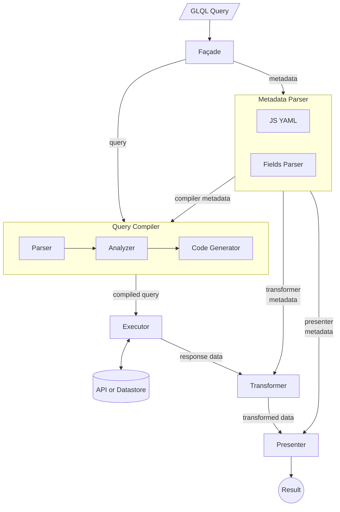

<!-- Design Documents often contain forward-looking statements -->
<!-- vale gitlab.FutureTense = NO -->



## Summary

GitLab Query Language (GLQL) is born out of the need for a unified, powerful,
and user-friendly way to query and present data across the entire GitLab platform.
As GitLab continues to evolve and expand its feature set, the ability to efficiently
access, filter, and visualize information becomes increasingly crucial for users
to manage their workflows effectively.

## Motivation

GLQL addresses the growing need for a unified and powerful way to access and visualize
data across the GitLab platform. As GitLab's feature set expands, GLQL aims to simplify
complex data retrieval tasks, enhance user productivity, and provide a consistent
querying experience. This initiative positions GitLab as a comprehensive data management
solution within the DevOps ecosystem, catering to the evolving needs of developers and
organizations managing large-scale projects.

## Goals

The primary motivations behind GLQL are:

1. **Unified Query Interface**: GLQL aims to provide a single, consistent syntax for
   querying various GitLab objects, starting with issues and expanding to work items.

1. **Enhanced Data Accessibility**: By embedding GLQL blocks in text editors anywhere
   across GitLab, GLQL empowers users to access precisely the information they need,
   when they need it. This is especially essential for large-scale projects that manage
   complex workflows.

1. **Improved Visualization**: GLQL's data agnostic presentation layer allows users
   to customize how query results are displayed, enabling more effective data analysis.

1. **AI Integration**: With its structured syntax, GLQL is positioned to integrate
   seamlessly with GitLab's AI offerings, paving the way for natural language query
   capabilities and enhancing user productivity.

1. **Extensibility**: While initially focused on issues and work items, GLQL is designed
   with the future in mind, allowing for expansion to cover more GitLab objects and
   use cases as the platform grows.

## Proposal

GLQL introduces a versatile model designed to adapt a single query syntax for fetching
various objects and presenting them uniformly. A GLQL query consists of two components:
the query expression and metadata. The model consists of the following components:

1. **Façade**: Acts as the entry point for processing GLQL queries, coordinating the flow
   between various components of the system.
1. **Query Compiler**: Responsible for parsing and transforming the GLQL query into
   executable code. It consists of three sub-components:
    - Parser: Breaks down the raw query string into an AST (abstract syntax tree).
    - Analyzer: Validates the parsed query, checking for semantic correctness.
    - Code Generator: Converts the analyzed query into executable code for the Executor.
1. **Metadata Parser**: Processes the metadata associated with the query, which includes
   transformation (or aggregation) and presentation instructions. It has two
   sub-components:
    - JS YAML: Parses YAML-formatted metadata.
    - Fields Parser: Interprets the fields specified in the metadata and transformations
      to apply, if any.
1. **Executor**: Runs the compiled query against the API or datastore to retrieve the
   requested data. Currently, GraphQL is used as a datastore.
1. **Transformer**: Processes the response data returned by the Executor, applying any
   transformations specified in the metadata.
1. **Presenter**: Presents the final transformed data using data-agnostic Vue components.

Here's an example of a GLQL query:

````md
```glql
---
display: list
fields: title, health, due, labels("workflow::*"), labels
limit: 5
---
project = "gitlab-org/gitlab" AND assignee = currentUser() AND opened = true
```
````

In the above example, the front matter block enclosed in `---` contains metadata.
`display` is an example of presenter metadata, and `fields` and `limit` are examples of
compiler metadata. Using functions in metadata values allow `fields` to be used as
transformer metadata.

## Design and implementation details



### Façade

Serving as the entry-point to parsing, executing and presenting a GLQL query, the façade
component consists of two parts: [the model](https://gitlab.com/gitlab-org/gitlab/-/blob/master/app/assets/javascripts/glql/core/index.js)
and [the view](https://gitlab.com/gitlab-org/gitlab/-/blob/master/app/assets/javascripts/glql/components/common/facade.vue).
The model part does all the hard work, while the view part is an abstraction to handle
loading and error states, and present the data using the appropriate root presenter component in case of success.

### Query Compiler

The query compiler is built with Haskell and is hosted
[here](https://gitlab.com/gitlab-org/gitlab-query-language/gitlab-query-language).
It is built using Haskell Stack and is compiled to WASM, which is then deployed to
[@gitlab/query-language](https://www.npmjs.com/package/@gitlab/query-language) on NPM.

**Syntax:**

The query syntax consists primarily of logical expressions. These expressions follow the
syntax of `[fieldName] [<|>|=|!=|in] [value|function] [AND] [anotherExpression]`.

Currently supported field names to query by include: `assignee`, `author`, `label`,
`epic` etc. Support for more fields will be added in later stages.

- **Supported comparison operators:** `<`, `>`, `=`, `!=`, `in`.
- **Supported logical operators:** Currently only `AND` operator is supported.
- **Supported operands:** Currently only `currentUser()` and `today()` are supported. Some
  fields like `milestone` and `iteration` support dynamic values like `none`, `any`, `current` or
  `upcoming`.

**Components**:

The query compiler is built from the ground up to support multiple targets of output.
Its components include:

1. Parser: This includes a combinator parser that converts a string, including the query, into an
   abstract syntax tree. The AST is optimized by extracting global attributes like `project` or
   `group`.
1. Analyzer: A static analyzer that analyzes the query for semantic correctness.
1. Code Generator(s): Converts the analyzed query into executable code for the Executor, depending
   on the target. For GraphQL target, it generates a GraphQL query.

**Examples:**

1. All bugs created for my stage in the last 28 days

   `label = ("devops::plan", "type::bug") and created > -28d`

2. Open issues assigned to me that haven’t been updated in a week

   `status = "opened" and assignee = currentUser() AND updated < -7d`

3. Issues late in the build stage of the upcoming milestone

   `milestone = upcoming and label in ("workflow::in review", "workflow::verification")`

### Metadata Parser

Metadata for a GLQL query is written in a combination of YAML and a special syntax to
allow transformations to happen on top of the query result. The metadata parser consists
of the following:

1. JS YAML: Converts a YAML block into a JSON config.
1. [Fields Parser](https://gitlab.com/gitlab-org/gitlab/-/blob/master/app/assets/javascripts/glql/core/parser/fields.js):
   A combinator parser to allow dynamically creating new fields in the transformer later.

**Syntax**: Currently supported options:

- `display`: How to display the data. Currently supported options: `table`, `list` or
  `orderedList`. Default: `table`.
- `limit`: How many items to display.
- `fields`: A comma separated value of fields. If not provided, only `title` field is
  included by default.

The fields option may also include functions to derive new columns. For example:
`labels("workflow::*")` can be used to derive a new column with just workflow labels
extracted.

This capability to generate derived columns allows us in the future to derive custom
computed columns, that are a function of existing custom fields. For example:
`div(mult(reach, impact, confidence), effort) as "RICE Score"`.

### Executor

The [executor](https://gitlab.com/gitlab-org/gitlab/-/blob/master/app/assets/javascripts/glql/core/executor.js)
is a simple module that executes the query compiled by the query compiler for the target
platform, which is currently GraphQL.

Finally, the executor executes the GraphQL query and returns back the response data and
the parsed YAML front matter config.

### Transformer

The [transformer](https://gitlab.com/gitlab-org/gitlab/-/blob/master/app/assets/javascripts/glql/core/transformer/data.js) module is responsible for two things:

- Normalizing the data for the presenter.
- Transforming data as requested by the user, for example, to derive new columns.

In a future iteration, the transformer module can also be used to aggregate data.

The transformer takes response data returned by the executor and some metadata, and
generates a transformed output that can be passed on to the presenter.

### Presenter

The [presenter](https://gitlab.com/gitlab-org/gitlab/-/blob/master/app/assets/javascripts/glql/core/presenter.js)
takes the output of the query transformed by the transfomer and presents it by selecting
appropriate presenter components.

The presenter presents the root object according to the display parameter provided (table
or list), and represents the values of fields returned by the executor using appropriate
object presenters. Each presenter is a Vue component that takes the data it needs to
present and optionally a config object containing presentation options. The presenter
module makes sure all data and fields are presented using appropriate presenters.

The result of the GraphQL query is recursively mapped to a presenter.

Currently supported presenters:

**Data presenters**: This includes [List](https://gitlab.com/gitlab-org/gitlab/-/blob/master/app/assets/javascripts/glql/components/presenters/list.vue)
and [Table](https://gitlab.com/gitlab-org/gitlab/-/blob/master/app/assets/javascripts/glql/components/presenters/table.vue)
presenters. They represent a collection of, say, issues, as a list or table of data.

Both presenters include a config prop containing fields and caption telling the presenter
what fields to display, and an optional caption to render alongside the presented data.

**Object presenters:** These are of two types:

1. **Generic object presenters:** This includes presenters for generic data types like
   [Null](https://gitlab.com/gitlab-org/gitlab/-/blob/master/app/assets/javascripts/glql/components/presenters/null.vue),
   [Text](https://gitlab.com/gitlab-org/gitlab/-/blob/master/app/assets/javascripts/glql/components/presenters/text.vue),
   [Bool](https://gitlab.com/gitlab-org/gitlab/-/blob/master/app/assets/javascripts/glql/components/presenters/bool.vue),
   [Time](https://gitlab.com/gitlab-org/gitlab/-/blob/master/app/assets/javascripts/glql/components/presenters/time.vue),
   [Link](https://gitlab.com/gitlab-org/gitlab/-/blob/master/app/assets/javascripts/glql/components/presenters/link.vue) and
   [Collection](https://gitlab.com/gitlab-org/gitlab/-/blob/master/app/assets/javascripts/glql/components/presenters/collection.vue).
    1. **Null**: Displays null values as _None_. Useful for fields that have no data set, like `health`, or `due`.
    2. **Text**: For all text or numeric fields like `title` or `weight`.
    3. **Bool**: Represents true or false values as _Yes_ or _No_. Applies to fields like `confidential`.
    4. **Time**: Represents all non-null time field values like `created` or `updated` as _X days ago_, or _in X days_.
    5. **Link**: For objects that don’t have presenters yet but have a `title` field and a `webUrl` or `webPath` fields available, it is represented as a link.
    6. **Collection**: When a field contains a collection of other objects, for example `assignees` or `labels`, it is represented as a space separated list of presenters.
1. **GitLab reference presenters:** This includes presenters for various gitlab objects like
   [Label](https://gitlab.com/gitlab-org/gitlab/-/blob/master/app/assets/javascripts/glql/components/presenters/label.vue),
   [Issue](https://gitlab.com/gitlab-org/gitlab/-/blob/master/app/assets/javascripts/glql/components/presenters/issue.vue),
   [Milestone](https://gitlab.com/gitlab-org/gitlab/-/blob/master/app/assets/javascripts/glql/components/presenters/milestone.vue),
   [State](https://gitlab.com/gitlab-org/gitlab/-/blob/master/app/assets/javascripts/glql/components/presenters/state.vue),
   [User](https://gitlab.com/gitlab-org/gitlab/-/blob/master/app/assets/javascripts/glql/components/presenters/user.vue) and
   [Health](https://gitlab.com/gitlab-org/gitlab/-/blob/master/app/assets/javascripts/glql/components/presenters/health.vue).
    1. **Label**: Presents a GitLab group or project label with its appropriate colors with a link to issues in that label in the current project.
    2. **Issue**: Presents an issue like it is rendered in Markdown: with its title, link and issue ID, and a popover containing additional information of the issue.
    3. **Milestone**: Similar to the issue presenter, presenting a milestone, with its title, link and a popover containing additional information.
    4. **State**: Presents the issue status, whether open or closed, as a badge.
    5. **User**: Presents a user’s username with a link to their profile, and a popover containing more information about the user.
    6. **Health**: Presents the issue’s health status: either of `on track`, `needs attention` or `at risk` as a badge.

## Extensibility

GLQL's architecture is designed with extensibility as a core principle, allowing for seamless integration of new features and capabilities. This modular design enables the system to evolve with GitLab's growing needs while maintaining consistency and reliability.

### Key Extensibility Features

1. **New Data Sources**
   - To support new APIs or datastores:
     - Implement new Code Generators tailored to the specific data source
     - Develop corresponding transformers to normalize the data returned by the API
   - Existing Parser and Presenter components can be reused, ensuring consistency in query input and output formats

1. **New Query Objects**
   - To add support for querying new GitLab objects:
     - Create new Analyzers to validate object-specific query semantics
     - Implement dedicated Code Generators for the new API or data source
     - Develop specialized Transformers to process the new object types
     - Extend or create new Presenters if unique display formats are required

1. **Component Modularity**
   - Each component (Parser, Analyzer, Code Generator, Transformer, Presenter) is designed as a standalone module
   - This modularity allows for:
     - Independent updates and improvements to individual components
     - Easy replacement or addition of components without affecting the entire system

1. **Metadata Extensibility**
   - The Metadata Parser can be extended to support new metadata fields, display formats or functions.
   - This allows for the introduction of new query options or presentation styles without altering the core query language

## Portability

GLQL's current implementation as a frontend-only solution demonstrates its initial focus
on user interaction and rapid prototyping. However, the system's architecture is designed
with portability in mind, allowing for future adaptations and optimizations.

### Current Implementation

- **Compiler**: Written in Haskell, leveraging its strong type system and pattern matching capabilities
- **Other modules (e.g., Transformer)**: Implemented in JavaScript for frontend integration

### Future Portability Options

1. **Language Migration**

   - The system can be ported to more widely adopted languages such as Rust or Go
   - Benefits:
     - Improved performance and memory management
     - Broader developer ecosystem for maintenance and contributions
     - Potential for both frontend (using WASM) and backend implementations

2. **Backend Integration**

   - GLQL can be integrated with GitLab's Ruby on Rails backend
   - Advantages:
     - Direct access to GitLab's data models and business logic
     - Reduced network overhead for complex queries
     - Enhanced security and access control management

3. **Cross-Platform Compatibility**

   - The modular design allows for implementation across various platforms:
     - Web browsers (current implementation)
     - Command-line interfaces
     - IDE plugins

By prioritizing portability in its design, GLQL ensures long-term flexibility and
adaptability, allowing it to evolve alongside GitLab's architecture and meet emerging
performance and integration requirements.
