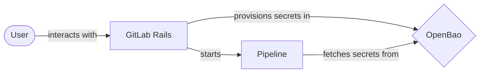
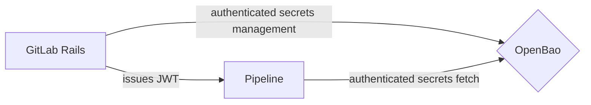
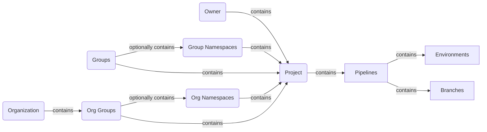
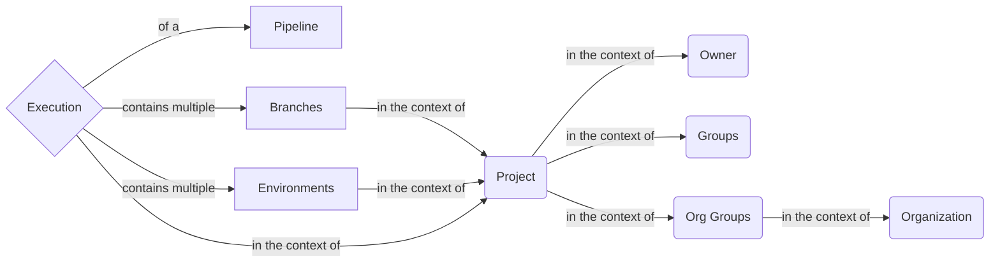
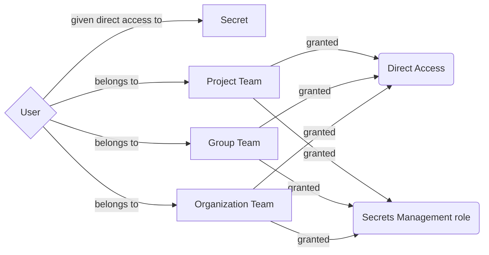
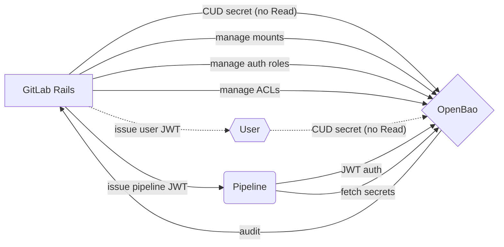



## Summary

GitLab users need a secure and easy-to-use solution to
store their sensitive credentials that should be kept confidential ("secret").
GitLab Secrets Manager is the desired system that provides GitLab users
to meet that need without having to access third party tools.

## Motivation

The current de-facto approach used by many to store a sensitive credential in GitLab is
using a [Masked Variable](https://docs.gitlab.com/ee/ci/variables/index.html#mask-a-cicd-variable) or a
[File Variable](https://docs.gitlab.com/ee/ci/variables/index.html#use-file-type-cicd-variables).
However, data stored in variables (masked or file variables) can be inadvertently exposed even with masking.
A more secure solution would be to use native integration
with external secret managers such as HashiCorp Vault or Azure Key Vault.

Integration with external secret managers requires GitLab to maintain the integration
with the third-party products and to assist customers in troubleshooting configuration issues.
In addition, customer's engineering teams using these external secret managers
may need to maintain these systems themselves, adding to the operational burden.

Having a GitLab native secret manager would provide customers a secure method to store and access secrets
without the overhead of third party tools and to leverage the tight integration with other GitLab features.

### Goals

Provide GitLab users with a way to:

- Securely store secrets in GitLab
- Use the stored secrets in GitLab components (for example, CI Runner)
- Use the stored secrets in external environments (for example, production infrastructure).
- Manage access to secrets across a root namespace, subgroups and projects.

#### Use cases

To help design the architecture, we need to understand how users, in their roles, would
operate and use the system. Here are significant use case scenarios that can help drive our
design decisions:

1. As a Compliance Manager or Security Ops engineer, I want to use dynamic secrets to provide an additional layer of security for my system.
1. As a Compliance Manager or Security Ops engineer, I want to use automatic secret rotation to provide an additional layer of security for my system.
1. As a Compliance Manager or Security Ops engineer, I want to set secrets expiration policies to provide an additional layer of security for my system.
1. As a Developer, I want sensitive credentials to be fully encrypted so I am not accidentally leaking this information in my deliverables.
1. As a Developer, I want to use secrets to store sensitive credentials to avoid storing this information inside of my code.
1. As a GitLab Admin and as a GitLab Group Owner, I want to have the ability to disable secrets management feature altogether if my organization requires the use of a 3rd party tool.
1. As a Compliance Manager or Security Ops engineer, I need to have audit tools which will show me the status of the secrets and their usage so I can identify any suspicious behavior and ensure our security and compliance of our sensitive credentials.
1. As a Compliance Manager, I need to audit log of secrets usage and management to ensure my organization is following compliance policy.
1. As a DevOps Engineer, I want the deployment process to fetch secrets necessary for deployment directly from a secrets manager.
1. As a Customer of a regulated industry, I need a secrets manager with HSM support so I can meet FIPS requirements.
1. As a US Public Sector customer, I need a secrets manager that is FedRAMP certified to meet security requirements.
1. As a Customer with an air-gapped system, I need a secrets managers that can be installed on-prem and managed on-site to meet network requirements.
1. As a Secret Owner, I need to quickly update or rotate the secret in case there has been a vulnerability to ensure the security of my software supply chain.
1. As a Secret Owner, I need the ability to rollback change to a secret in the event of an accidental change.
1. As a Security Engineer, I want to ensure all secrets are properly deleted/destroyed if they are no longer needed.

#### Non-functional requirements

- Security
- Compliance
- Auditability

### Non-goals

This blueprint does not cover the following:

- Secrets created within GitLab to allow external resources to access GitLab personal access tokens, such as personal access tokens.

## Decisions

- [ADR-005: Non-hierarchical key structure for secrets in OpenBao](decisions/005_secrets_key_structure/)
- [ADR-007: Use OpenBao as the secrets management service](decisions/007_openbao/)
- [ADR-008: Redesigning secrets manager without a Rails database table](decisions/008_no_database.md)

### Superseded

These documents are part of the initial iteration of this blueprint.

- [ADR-001: Use envelope encryption](decisions/001_envelop_encryption/)
- [ADR-002: Use GCP Key Management Service](decisions/002_gcp_kms/)
- [ADR-003: Build Secrets Manager in Go](decisions/003_go_service/)
- [ADR-004: Stateless Key Management Service](decisions/004_stateless_kms/)
- [ADR-006: Use AppRole authentication method between Rails and OpenBao](decisions/006_approle_authentication_rails/)

## Proposal

The secrets manager feature will be available on both SaaS and Self-Managed installations
and will consist of two core components:

1. GitLab Rails
1. OpenBao Server



Because pipelines can be external to GitLab infrastructure, OpenBao thus
needs to be open to externally accessible and ACL protected. However, we'll
initially restrict the provisioning of secrets and authentication roles
through the GitLab Rails UI and limit JWT token creation to pipeline
execution, until we can build multi-tenancy extensions into OpenBao.

<details>

<summary> Digression on OpenBao visibility </summary>

Technically there are two approaches to make OpenBao visible:

 1. Directly, making the API address listen globally to the public internet.
 2. Via GitLab Rails proxying requests on behalf of callers.

In particular, with the latter, while we have the option of replacing the
backend secret store with a different provider in the future, we incur
additional effort for every dynamic secret provider we support: we can either
implement a thin proxy over the OpenBao API (making switching harder as we're
still tightly coupling to OpenBao), or we can implement a bespoke translation
layer per call.

Outside of a few proprietary vendors offering dynamic secrets, we'd thus
likely have to rewrite the functionality from scratch anyways if we were to
switch. Thus, we could stick to a vaguely OpenBao/Vault-compatible API design
(for clients) but modify it as necessary.

With this trade-off, and given there's interest in expanding past static K/V
secrets (into dynamic secrets -- whether for databases, cloud providers, or
even GitLab tokens), we suggest using the former approach, exposing OpenBao
publicly. This enables non-Pipeline workloads in the future (that simply read
secrets, leaving policy creation to GitLab Rails) and lets us use more
advanced features such as Transit for other solutions inside GitLab Rails.

</details>

Within OpenBao, we'll use two authentication engines:

 1. [JWT](https://openbao.org/docs/auth/jwt/), to authenticate Rails to OpenBao
    and created pipeline jobs to OpenBao. All of these JWTs will will be issued
    by GitLab Rails, using GitLab [OIDC ID Tokens](https://docs.gitlab.com/ee/ci/secrets/id_token_authentication.html)
    supported by the existing [HashiCorp Vault Runner integration](https://docs.gitlab.com/ee/ci/secrets/hashicorp_vault.html).
    Claims on tokens for administrative use by Rails will have different
    values than those issued for GitLab's OIDC ID tokens.



Importantly, while GitLab Rails authorizes the pipeline's execution of a
particular job, the pipeline's token must be adequately scoped to a
particular execution context. A pipeline's execution context is defined
as follows:



Both groups and organization groups can contain many nested subgroups
("namespaces"). The existing OIDC ID token contains sufficient context
information for these purposes.

From the context of an execution of a pipeline, a secret may come from
many sources:



Here, an execution of a pipeline can, in the restriction of a set of branch
or environment match patterns (e.g., `main`, `*`, or `release/*`), can get
secrets from:

 1. A project,
 1. The (user) owner of a project or equivalently,
 1. The hierarchical groups up to and including the organization owner of a
    project, or a parent group (prior to the introduction of organizations).

That is, if a secret is to be used by multiple projects, it should be
provisioned up a level and the branch and/or environment restricted
appropriately, ensuring that the relevant environment does not conflict
across projects it should not be visible in.

Similarly, in the context of user access and management of secrets, the
following hierarchy applies:



A team at any level (project, group, or organization) can be given permission
to manage all secrets at or below its level ("Secrets Management capability"
above). However, on an individual secret, a user or team can also be given
direct access even if they don't otherwise have secrets management
capabilities.

Initially, users will manage secrets through GitLab Rails and its broader
privileged JWT tokens, but the intent longer-term is to use per-user JWTs. The
current design necessitates that GitLab Rails sees the value of the secret,
proxying it on behalf of the Browser UI to OpenBao. By using a per-user JWT
issued to the browser session in LocalStorage, the UI can directly contact
the public OpenBao instance and GitLab Rails will not have access to the
secret during provisioning and thus, risk inadvertently logging it. However,
the privileged JWT token will still be used to safely limit changes to
the ACL policies.

### Secret and authentication hierarchy

Design of OpenBao's mount path will greatly affect available security
parameters. When encoding user values (`{value}`), we'll use URL-safe
Base64: this lets us have a unique, canonical transformation of
potentially non-path-safe components into individual path segments. For
components with dynamic names (like user, organization, and group names),
which aren't glob-aware and which are subject to renaming, we'll use their
internal integer database identifiers to prevent having to rename the
underlying mounts.

#### Tenant definition

We assume every project has a parent component: this is either a user, a
group, or an organization. In the event of legacy groups with `org_id=1`
we will use the owning group instead.

#### Secrets

We propose the following structure for mounts for user-owned projects:

- `/user_{userid}/secrets`
- `/user_{userid}/proj_{projectid}/secrets`

And for organization-owned projects:

- `/org_{orgid}/secrets`
- `/org_{orgid}/namespace_{nsid}/secrets`
- `/org_{orgid}/proj_{projectid}/secrets`

For groups which use the existing group-based system, the top-level entity
would be the parent group:

- `/group_{groupid}/secrets`
- `/group_{groupid}/namespace_{nsid}/secrets`
- `/group_{groupid}/proj_{projectid}/secrets`

Here, the first `group_{groupid}` would be the top-most group-id, but would
not be repeated for the nested sub-group secrets.

`namespace_{nsid}` indicates a nested entity (whether a group, subgroup, or
user namespace within a top-level organization or group). With the eventual
introduction of top-level organizations, if groups belong to orgid=1 meta-org,
we'll use group-based tenant separation for these.

Within each `secrets` folder, we'll initially mount a K/V secrets engine at
`/kv`; eventually other types of secrets engines can also be mounted to
provide dynamic secrets, with some consideration as to naming engines.

Within each K/V secrets engine, we'll use the following nesting structure to
restrict access to secrets (with a given `<name>` in pipelines:

- `.../secrets/kv/data/explicit/<name>`

Similarly, when using dynamic secrets engines with roles, we'll suggest using
the following structure of mounts and allow configuring secret names inside of
these mounts as appropriate to the specified dynamic secret engine:

- `.../secrets/<mount-name>/.../explicit-<role-name>`

Succinctly, the requirement that any given path a secret could live at is
prefix-free: we use `explicit` to indicate that provisioning auth engines must
_explicitly_ grant secret-level access to specific fields. If later types of
secret protection schemes are used (such as placing environment or branch
protections in the URL to allow broad access to any secret for that branch
or environment), we suggest using `env-` and `branch-` as prefixes.

#### Authentication

Authentication uses five sets of mounts:

- `/auth/user_{userid}/pipeline_jwt`
- `/auth/group_{groupid}/pipeline_jwt`
- `/auth/org_{orgid}/pipeline_jwt`
- `/auth/user_jwt`
- `/auth/gitlab_jwt`

In particular, because pipelines may need access to nested secrets, but
won't need access to anything outside the tenant's scope, we will provision
ACL policies and authentication at the top-most tenant namespace (`user_`,
`group_` or `org_`). With namespaces, this will help with restricting the
pipeline from escaping its sandbox and accessing other tenant's secrets;
however, we rely on careful ACLs to protect access to other projects and
secrets within the tenant namespace.

Later, user authentication can be added to each tenant
(`/auth/org_{orgid}/jwt_user` or `/auth/group_{groupid}/jwt_user`) and the
user can request scoped JWTs (and subsequent OpenBao tokens) so that they
aren't requesting tokens with broad access beyond the scope they are modifying
the secrets of.

Aside: presently the order is auth and then tenant segment, but when adding
proper namespace support, auth mounts could be inside of a tenant and thus
the order will be swapped to e.g., `/user_{userid}/auth/pipeline_jwt`.

##### GitLab Privileged JWT

Initially using the same JWT issuer, though potentially migrating to a
purpose-built issuer, GitLab will issue itself JWTs to authenticate against
the privileged `/auth/gitlab_jwt` path. The subject of this token and other
fields will be uniquely different than the OIDC ID tokens issued to pipelines,
preventing them from successfully authenticating against this endpoint.

Long-term, we'll attempt to tie inbound GitLab Rails requests to outbound,
user-initiated management actions via custom claims on these JWTs, allowing
auditing and attribution from source request through to OpenBao.

Using JWTs instead of AppRole removes the need for additional, external
secrets management in the operational side of GitLab Rails: it already has
access to the provisioned JWT issuer and thus can self-issue JWTs to auth
against OpenBao as it remains in a privileged place in the design.

#### ACL design

We propose a group-based approach to ACL policies: each scope (for a pipeline)
and role (for users, when not using explicit grants) will grant access to
specific subsets of secrets. These policies are maintained and stored in
OpenBao, but GitLab Rails is tasked with managing and provisioning them.

Notably, no Rails-initiated [operations](decisions/008_no_database.md#types-of-operations) are expected
to span multiple tenant contexts. This allows us to add per-namespace ACLs
in the future and create smaller path->policy indices in the future.
Furthermore, we can use nested paths to segment different policies and build
per-segment indices, reducing the list operation overhead as well.

For each policy, we'll present create a [group alias](https://openbao.org/api-docs/secret/identity/group-alias/)
to allow a `groups_claim` on the Rails-issued JWT to select applicable ACL
policies based. A [future enhancement](decisions/008_no_database.md#jwt-direct-profiles) will allow us
to get rid of all but [glob-based group matches](decisions/008_no_database.md#group-alias-glob-matching).

##### Hierarchy of policies

Policies will be prefixed by their tenant information (e.g., `user_{id}/`)
until they are migrated to proper namespaces.

For each project, we'll provision ACL policies prefixed with `project_{id}/`:
this path separator component is an allowed character in policy names and
allows us to use a [future extension](decisions/008_no_database.md#acl-list-prefix) to list just policies
we are interested in and will let us reduce the size (and increase the
relevance) of indices.

Additionally in the future, hierarchical secrets can be supported by also
supporting `group_{id}` and other constructs as top-level categories. With
multi-tenant support, we'll have fewer top-level items (as they'll be
explicitly bounded by the tenant), making iterating over all such items
easier. However, we'll usually have fairly few items.

Note that these do not necessary reflect the secret's path and only notate
where ACL policies exist. Because tenant information will eventually be
conveyed within a namespace (and the policies moved appropriately), we'll
eventually end up with a secret-like ACL policy hierarchy.

Each top-level segment essentially represents all access to a particular
secrets management section of the UI: `project_{id}/`, `group_{id}/` &c.

##### Pipeline ACL

To restrict a pipeline's JWT token to only allowed paths, we'll use GitLab
Rail to provision a just-in-time ACL policy for the pipeline and a JWT
role tightly scoping to the [expected claims](https://docs.gitlab.com/ee/ci/secrets/id_token_authentication.html#token-payload)
from the existing CI/CD OIDC ID token integration.

OpenBao's ACLs are directly [stored on disk](https://github.com/openbao/openbao/blob/7fca5c0baebd3f55254da06d26bc160f465a7e1a/vault/policy_store.go#L287-L345),
with a [moderate cache](https://github.com/openbao/openbao/blob/7fca5c0baebd3f55254da06d26bc160f465a7e1a/vault/policy_store.go#L28-L29)
for recently-used policies. Policies are loaded and evaluated at
[request validation time](https://github.com/openbao/openbao/blob/7fca5c0baebd3f55254da06d26bc160f465a7e1a/vault/policy_store.go#L605-L629),
meaning that if a pipeline ACL name is modified and reused, the latest
version (at the time of the request) will win.

Likewise, the [JWT auth method's login](https://openbao.org/api-docs/auth/jwt/#jwt-login)
will require a role parameter to select the correct role for authentication.

For naming roles, we suggest the format:

- `project_{projid}`

###### Layout

Within the `project_{id}/` top-level path segment, we'll provision an
additional path segment, `pipelines/`, to separate pipeline-related
policies for a project from other types of access.

We create the following types of pipeline policies with Rails:

- `global`: secrets any pipeline can access
- `env/{context}`: environment restriction policies
- `branch/{context}`: branch restriction policies
- `combined/env/{context}/branch/{context}`: combined environment and branch restrictions (`AND`)

A full path of an ACL would thus look like the following examples:

- `project_12345/pipelines/global`,
- `project_12345/pipelines/env/prod-*`,
- `project_12345/pipelines/branch/release/*`, or
- `project_12345/pipelines/combined/env/prod-*/branch/release/*`.

Notably, the direct encoding of restriction to path allows for us to create
groups with [the same encoding](decisions/008_no_database.md#group-alias-glob-matching), reducing the
need for GitLab Rails to query the set of restrictions before issuing the
JWT. Use of `combined` as a prefix ensures we cannot have confusion attacks
with poorly named environments and branches.

In the future, explicit grants could also occur: stages could have a path
segment and policies (`stages/{name}/global`) and each job in a stage could
also have direct secret access (`stages/{name}/job/{name}/global`). Or, we
could even support ANDing between stage, name, and the above restrictions
(environment/branch) to support rather granular execution contexts for these
jobs.

When issuing a JWT, presently GitLab Rails will need to query relevant
ACLs within a path and issue [a `groups_claim` field](https://openbao.org/api-docs/auth/jwt/#parameters-1)
with all the relevant glob values from the ACL list. However, with the
mentioned glob enhancements, GitLab Rails should be able to directly compute
these without requiring a lookup from OpenBao as this information already
appears [on the `id_token`](https://docs.gitlab.com/ee/ci/secrets/id_token_authentication.html).

The one exception is that the future enhancement for direct explicit grant
(by stage/job name) does not yet exist on the id token and thus cannot
be used for ACLing. However, this can easily be added as the information
exists on the `Ci::Build` object (`stage` and `name` fields).

###### Contents

Each ACL policy will be an explicit grant of capabilities over a path. We
will set these with GitLab Rails and will not use globbing (`+` or `*`) to
grant access to multiple secrets; only access to specific secrets will be
allowed.

For example, if any pipeline running with an `env/prod-<DATE>` context is to
have access to the production database credentials, we will create a policy
named `user_12345/project_54321/pipelines/env/prod-*` with the contents:

```hcl
path "user_12345/project_54321/secrets/kv/data/explicit/PROD_DB_PASS" {
    capabilities = [ "read" ]
}
```

Notably, because a pipeline will have multiple contexts which might provision
different ACL policies, we'll eventually want to implement something similar
to [policy unions](decisions/008_no_database.md#policy-unions).

##### User ACL

While the user wouldn't initially contact OpenBao directly (and instead have
secrets management operations proxied through GitLab Rails), we want to switch
GitLab Rails to using scoped user-level JWTs and then ultimately to the client
having direct access to OpenBao (without necessarily contacting GitLab Rails),
so that no user-confusion attacks are viable and so that GitLab Rails does
not see the secrets during provisioning, preventing them from accidentally
being logged in the future.

Notably, a user token would be rather privileged: it would have complete
access to all secrets within the users' purview and thus should be suitably
short-lived to avoid potential side-channel attacks. Further hardening (like
[auto-binding to CIDRs](https://github.com/openbao/openbao/issues/32)) would
help avoid these issues. To solve this, we'd need to scope access along team
lines (e.g., any teams with access to manage a certain category of secrets
would have a separate ACL policy) along with any location-specific secrets
granted in a given view and expand OpenBao to allow templating of profiles
(so that the JWT could contain a concrete list of profiles to grant this
user). This would be rather involved but would help scope user JWTs more
specifically.

The upgrade path (from privileged JWT token to incrementally using tightly
scoped policies) would simply be changing the Rails code to generate a user
JWT and updating the Ruby client's request to authenticate and use the
subsequent token for a particular request instead of the privileged JWT token.

Note that users lack read permissions on the actual secret; they can only set
the value. When rolling out dynamic secrets, users would be granted full
permissions on the role, but no permissions on the dynamic secret endpoint
(e.g., for PKI, they could have full permissions on `pki/roles/:name`, but
none on `pki/issue/:name`).

###### Layout

Similar to pipelines, we'll create policies under the relevant top-level
path, with a `roles/` or `direct/` subcomponent. Here, `roles/` will have
various default or custom roles which get access to secrets at various
levels. For instance, `roles/maintainers` and `roles/owners`: this allows
each project to control what scope of access these roles get, if the defaults
are not ideal.

Further, with `direct/user_{id}` roles, users will be given explicit grants
to certain secrets, beyond what they might normally see given their role.

###### Contents

For both roles and direct access, there are two types of grants:

1. Broad grants to the entire category of secrets.
2. Specific grants to individual secrets.

For the former, the policies might look like:

```hcl
path "org_{orgid}/project_{projectid}/secrets/kv/data/explicit/+" {
    capabilities = [ "sudo", "create", "update", "patch", "delete", "list" ]
}
```

for read-write access and

```hcl
path "org_{orgid}/project_{projectid}/secrets/kv/data/explicit/+" {
    capabilities = [ "list" ]
}
```

for view-only access.

For the latter (specific grants), the policies might look like the above,
just with explicit names in them (e.g., `DB_PASS_PROD`).

When accessing a secrets management page, GitLab Rails will issue a JWT
to the user which will contain the relevant `groups_claims` to groups with
specific policies within the project. Notably, this will not delay load:
this token will only be used by the user to set specific secrets, though
a similar JWT and secret could be used on the GitLab Rails' backend to
render the initial page. The assumption here being the Rails->OpenBao
interconnect is faster than User->OpenBao and potentially Rails could
have caching of user or secret lists.

##### Modifying ACL policies

Notably, ACL policies are written in HCL: this presents a problem since
[Ruby lacks good HCL support](https://rubygems.org/search?query=hcl).
However, [HCL is JSON-compatible](https://developer.hashicorp.com/vault/tutorials/policies/policies#hashicorp-configuration-language-hcl).

This means that, for any given ACL policy above, we can construct its
equivalent in JSON, giving GitLab Rails native capabilities to edit it
without pulling in another dependency or building our own parser.

For example, the policy in HCL:

```hcl
path "org_{orgid}/project_{projectid}/secrets/kv/data/explicit/+" {
    capabilities = [ "list" ]
}
```

would be equivalent to the following JSON:

```json
{
    "path": {
        "org_{orgid}/project_{projectid}/secrets/kv/data/explicit/+": {
            "capabilities": [
                "list"
            ]
        }
    }
}
```

This becomes much easier for GitLab Rails to query and update.

### Static vs Dynamic Secrets

GitLab Secrets Manager will initially only support static secrets, stored in
a KVv2 engine. Some improvements to OpenBao can be added to static secrets,
such as:

 1. Using leases, to support one-time use secrets. These could be written by
    another workflow and removed on use.
 1. Supporting automatic deletion of secrets: a given expiration date could be
    strictly enforced, preventing use of the secret and requiring rotation of
    even long-lived manual secrets.

However, ultimately automatic rotation is an important consideration. By using
fully dynamic secrets, the problem of rotation is avoided: secrets are scoped
to a particular access and are automatically revoked (trough lease expiration
or revocation) once the pipeline or access finishes. This prevents reliance on
static values and ensures compromise of values require time-limited use and
prevent persistence. We can build several improvement to OpenBao to help the
adoption of dynamic secrets:

 1. Add a plugin registry to allow custom, external plugins or allow
    containerized execution of plugins.
 1. Create additional backend-pluggable plugin types beyond database: this
    could allow various access-token providers to be more easily created by
    exposing common APIs in a standardized format.

We ultimately wish to push more users towards dynamic secrets. These are
more secure and don't have long-term data retention and security concerns.

### Sources of Truth

GitLab Rails is the source of truth for:

- JWT issuance via OIDC
  - Pipeline issuance
  - User-level issuance (eventually)

OpenBao is the source of truth for:

- Definitions of secrets
  - Canonical locations inferable from the pipeline definition and contextual
    information like project, namespace, &c.
  - Ownership information (direct access, role access, &c)
  - Scope of pipeline access (environments, branches, &c)
  - Any textual description of the secret available to operators
- Values of secrets
- ACL policies; these will be pushed from GitLab Rails based on ownership
  information (just before usage in the case of pipelines).
- Configuration of dynamic secrets, including K/V extensions for one-time use
  secrets, and automatic deletion.

### GitLab Rails

GitLab Rails would be the main interface that users would interact with when
managing secrets using the Secrets Manager feature. We would not provision
direct user access to the underlying OpenBao instance and thus OpenBao's
[lack of a UI](https://openbao.org/docs/release-notes/2-0-0/#200) would not
impact us: we wish to provide a more native, integrated UI than redirection
through OpenBao's UI would provide.

This component is a facade to OpenBao server, initiating several requests and
workflows to OpenBao:



Initially all operations will through GitLab Rails including CUD operations
on secrets, but not requests for secrets from pipelines (hence, excluding the
R in CRUD -- though this action is of course initiated by a pipeline job
started from, and with a JWT issued by, GitLab Rails). Eventually the
privileged token for CUD operation will be replaced with a user JWT and
subsequently directly by the user (through a JavaScript OpenBao client running
in the context of the GitLab UI).

Within the [GitLab Rails monolith](https://docs.gitlab.com/ee/development/architecture.html#component-diagram),
two components will need access to the secrets manager: [Puma](https://docs.gitlab.com/ee/development/architecture.html#puma),
where the majority of the GitLab backend code executes; and
[Sidekiq](https://docs.gitlab.com/ee/development/architecture.html#sidekiq),
a background job processor to allow long-lived background operations (such
as initial provisioning of OpenBao and secret engine mounts).

#### Management of secrets

Because OpenBao remains the source of truth for many decisions, GitLab can
retain only a minimum table indicating the enablement status of secrets on
projects.

In `SQL`, this could look like:

```sql
CREATE TABLE secrets (
    id bigint NOT NULL,

    // Scope information; only one is set. Currently only project-level
    // secrets are allowed.
    // user_id bigint,
    // organization_id bigint,
    // group_id bigint,
    project_id bigint,

    // enablement status: provisioning, active, or disabled.
    status state_machine,
);
```

Here, `group_id` references the closet-most subgroup that owns the secret
instance. Parent subgroups and the namespace can then be queried.

#### Management of authentication

GitLab Rails needs to issue two types of JWTs:

1. JWTs within the scope of a project for a particular pipeline execution.
1. JWTs for user authentication.

GitLab already supports issuance of both JWT types through its OIDC
for [CI/CD](https://docs.gitlab.com/ee/ci/secrets/id_token_authentication.html)
and as an [Identity Provider (IDP)](https://docs.gitlab.com/ee/integration/openid_connect_provider.html).
Within each [auth method](#authentication), we'll need to ensure that we
create the necessary roles to ensure OIDC tokens get exchanged for OpenBao
tokens with appropriate JWT-specific policies attached. As discussed in
[ADR-008: Redesigning secrets manager without a Rails database table](decisions/008_no_database.md),
this will require simple extensions to OpenBao to do.

#### Necessary cleanup hooks

The following places need to be hooked to update secrets (both internally to
the database and in OpenBao):

- Deletion of project
- Deletion of group
- Deletion of organization
- Deletion of user
- Cancellation of a pipeline
- Disabling of secrets on a project
- Non-renewal of secrets management subscription

Because IDs are used in place of names, few mount move operations will be
incurred except when enabling multi-tenant namespaces for the first time.

### OpenBao server

[OpenBao](https://openbao.org/) server will be a new component in the GitLab
overall architecture. This component provides all the secrets management
capabilities including storing the secrets themselves. An overview of
[its internals](https://openbao.org/docs/internals/) and
[threat model](https://openbao.org/docs/internals/security/) are available
on its project website.

In summary, storage is encrypted with a root key, which in turn encrypts a
barrier keyring, which in turn encrypts storage. Access to the root key is
protected through either a [Shamir's derived AES key](https://openbao.org/docs/concepts/seal/#shamir-seals)
(which requires a quorum present to unseal) or an automatic unseal mechanism
(such as [GCP KMS](https://openbao.org/docs/configuration/seal/gcpckms/)).

#### Storage backend

OpenBao on Runway will initially be deployed with the Postgres engine. This
is a sane default for self-hosted as well, as GitLab Rails already requires
a database and can create tables in it. However, support for the more widely
deployed Raft backend can also be added in the future fairly easily.

#### Seal mechanisms

For GitLab.Com deployments, OpenBao will use the GCP KMS auto-unseal
mechanism. For self-hosted environments, if an existing supported KMS
mechanism is not provided, we can use the Shamir seal for MVC. Later
improvements might include tying into the existing
[secrets file](https://docs.gitlab.com/ee/administration/backup_restore/troubleshooting_backup_gitlab.html#when-the-secrets-file-is-lost)
as an auto-unseal mechanism for OpenBao, supporting PKCS#11 seals,
and multi-unseal capabilities (discussed below).

#### Audit logging

OpenBao supports audit logging through file, syslog, or socket mechanisms.
Because OpenBao will not necessarily be co-located with GitLab Rails or
our audit logging (into Postgres), it is suggested to either use the syslog
backend or use a custom audit logging backend.

Note that, in the event audit logging goes down, OpenBao will not be able to
handle any requests until this is fixed.

#### High availability

GitLab Rails includes [Geo support](https://docs.gitlab.com/ee/administration/geo/)
for self-hosted clustering, allowing multiple sites to exist, each with its
own set of nodes. Each site has its own [PostgreSQL replica](https://docs.gitlab.com/ee/administration/geo/#architecture).
One site is designated primary and nodes in the site are allowed to perform
write operations to the Postgres database. All PostgreSQL data is available
on all sites. While Gitaly has selective syncing of repository data, projects
are globally accessible from all sites and nodes. While currently only
secondary nodes talk to the primary site,
[this should be a bidirectional channel](https://docs.gitlab.com/ee/administration/geo/replication/multiple_servers.html#architecture-overview).

OpenBao natively includes [High Availability](https://openbao.org/docs/internals/high-availability/)
support; this is either provided by [Raft](https://openbao.org/docs/internals/integrated-storage/)
or the [PostgreSQL](https://openbao.org/docs/configuration/storage/postgresql/)
storage backends. The latter uses a lock table to implement leadership
election. Only one node is marked active at a time, with secondary nodes
not performing any operations except forwarding requests to the primary.

Notably, the semantics of Geo and OpenBao roughly align. We propose that Geo
will need no additional enhancements to support GitLab Secrets Manager and
that replication will be handled by the latter when using Raft.

On all front-end service nodes, we'll start the self-hosted OpenBao server
instance. One node will be designated primary by OpenBao HA election:
initially this will be a random node, but in the future we could let Geo
inform OpenBao which site is designated primary and the leader election
process could be changed. This node will use OpenBao's native HA
capabilities: standby nodes will proxy all operations (initially, later
serving read requests) to the active OpenBao instance.

With the Raft storage backend, each front-end node will have local storage
it can use for placing Raft's underlying [`bbolt`](https://openbao.org/docs/internals/integrated-storage/#writing-logs)
K/V store. In the event of an even number of nodes in the primary site, we
will proactively designate one node to be a [non-voter node](https://github.com/openbao/openbao/issues/578).
From Geo's information, we'll populate all node's [`retry_join`](https://openbao.org/docs/configuration/storage/raft/#retry_join-stanza)
configurations with reference to the other nodes for discoverability.
In the future, we can also designate non-primary sites to be non-voter nodes
as well. The number of sites or latency of replication will thus not impact
the latency of writes in the general case.

With the PostgreSQL storage backend, we can rely on Geo's existing replication
of the PostgreSQL backend and no additional changes will be necessary.

When runners contact the OpenBao instance, if their request does not hit the
active node, OpenBao will route the request through its GRPC request forwarding
mechanism.

In the event of a failover, Geo will be able to bring up the new site
designated as primary and data will already have been replicated, either
through PostgreSQL's replication or through Raft's synchronization process.
In the future and in the case of the latter, Rails, via Geo's indication, will
update the node's Raft configuration to no longer be non-voter and restart the
node so a new leader is elected. In the event of later improvements to
Postgres backend to indicate desired leadership status, a similar change could
be applied there as well when a site's status changes. This will also help to
align the definitions of primary sites between Geo and OpenBao.

The net result is that Geo is not responsible for data replication for
OpenBao, but is still used as a source of leadership data so that a consistent
customer experience is achieved.

#### Cells and multi-replication zones

Initially we will support one logical OpenBao cluster per instance. In the
future [with cells](/handbook/engineering/architecture/design-documents/cells/),
we'd expect each tenant to cluster affinity:

#### Required enhancements

OpenBao will require enhancements to improve security prior to GA of this
feature. These are discussed more below.

##### Multi-unseal capabilities

In the event an unseal method has faulted and is unrecoverable, OpenBao today
will be unable to decrypt its secrets and thus fail to start. In the event
of infrastructure outages, this makes recovery hard. Upstream Vault Enterprise
has introduced [Seal HA capabilities](https://developer.hashicorp.com/vault/docs/configuration/seal/seal-ha),
whose design was influenced by the additional requirements of
[Seal Wrapping](https://developer.hashicorp.com/vault/docs/enterprise/sealwrap).
OpenBao does not have Seal Wrapping and thus can rely on a design similar
to an [earlier, retracted PR](https://github.com/hashicorp/vault/pull/18683).

We can allow several parallel unseal mechanisms, each of which encrypts the
same root key. This would allow a mix of auto-unseal and Shamir's, allowing
a hybrid recovery procedure in the event the auto-unseal mechanism were
unavailable or the key was lost. Notably, reuse of the root key isn't bad:
any loss of unseal key material (that compromises root key integrity) with
separate root keys would still allow recovery of the barrier encryption key.
Rotation of the root key would require all unseal mechanisms to either be
online or removed prior to use. However, we wouldn't have to contend with
secrets encrypted using a combination of mechanisms, as they only encrypted
entry is the root key.

##### Multi-tenancy through namespaces

In the current design document, separate tenants' secrets would be encrypted
using the same barrier encryption keys. This means compromise of a single
tenant would result in compromise of all tenants.

OpenBao lacks [namespaces from Vault Enterprise](https://developer.hashicorp.com/vault/docs/enterprise/namespaces).
These allow for logical [separation of tenants](https://github.com/orgs/openbao/discussions/293),
as discussed upstream. In particular, we can grant limited, scoped `sys/`
capabilities to admins within a namespaces:

- [`sys/auth`](https://openbao.org/api-docs/system/auth/) to mount new auth plugins.
- [`sys/mounts`](https://openbao.org/api-docs/system/mounts/) to mount new secret engine plugins.
- [`sys/namespaces`](https://openbao.org/api-docs/system/namespaces/) to allow nested namespaces.
- [`sys/policies`](https://openbao.org/api-docs/system/policies/) to control namespace-restricted policies.
- Optionally [`sys/quotas/config`](https://openbao.org/api-docs/system/quotas-config/) and [`sys/quotas/rate-limit`](https://openbao.org/api-docs/system/rate-limit-quotas/) to control namespace-restricted quotas (if tenants want to set their own, subject to global quoata limits).

The intention of this change would be to safely allow customers to directly
interact with their OpenBao instances, bringing non-Pipeline workloads to
use the same secrets store.

Further, we can add layered seal encryption to namespaces, creating a separate
root key and barrier keyring encrypted by both the parent namespace's barrier
key but also a separate unseal mechanism. This would likely expose the
following scoped `sys/` routes within a namespace:

- [`sys/rotate`](https://openbao.org/api-docs/system/rotate/) to rotate the per-namespace barrier encryption key.
- [`sys/rekey`](https://openbao.org/api-docs/system/rekey/) and [`sys/rekey-recovery-key`](https://openbao.org/api-docs/system/rekey-recovery-key/) to rotate the per-namespace root and recovery keys (if any).
- [`sys/seal`](https://openbao.org/api-docs/system/seal/) and [`sys/unseal`](https://openbao.org/api-docs/system/unseal/) to seal and unseal the namespace. Note that sealing an auto-unseal mount would require the recovery keys.

In the event a customer wanted to revoke access to secrets from GitLab,
they could seal their namespace and prevent GitLab from accessing the
unseal mechanism of choice.

Lastly, we can strengthen the memory isolation of customers by only allowing
plugin multiplexing within a namespace. When coupled with external runners
for plugins, such as a container or cgroups, we could further isolate tenants
data in memory.

##### Chosen leader and Raft updates

When working in a Geo cluster, we'd ideally like the OpenBao primary node
to align with the Geo cluster's definition of the primary site. We'll want
update OpenBao to give a suggested leader or add non-leader/voter status to
nodes on secondary sites.

### Packaging and deployment

OpenBao maintains an upstream [Helm chart](https://github.com/openbao/openbao-helm)
that can be used for deploying OpenBao in a Kubernetes environment. This can
be referenced and configured from the [GitLab Helm chart](https://docs.gitlab.com/charts/)
as required.

For self-hosted, OpenBao server will also be executed by GitLab Rails.

### Use case studies

- [Using secrets in a CI job](studies/ci_job_secrets/)

### Further investigations required

1. Authentication of clients other than GitLab Runner.
   GitLab Runner authenticates using JWT, for other types of clients, we need a secure and reliable method to authenticate requests to decrypt a secret.
1. Infrastructure setup, including how OpenBao will be installed for self-managed instances.
1. How to best implement sharing of secrets between multiple groups in GitLab.
1. Establish our protocol and processes for incidents that may require sealing the secrets vault.
1. How to support protected and environment specific rules for secrets.
1. How to audit secret changes. Do we want to use [audit socket](https://openbao.org/docs/audit/socket/)?
1. Should the secrets be revoked if a project or subgroup is moved under a different top-level group/organization?

## Alternative solutions

Other solutions we have explored:

- Separating secrets from CI/CD variables as a separate model with limited access, to avoid unintended exposure of the secret.
- [Secure Files](https://docs.gitlab.com/ee/ci/secure_files/index.html)
- Implementing secrets management from scratch (see [Superseded](#superseded)).

## References

The following links provide additional information that may be relevant to secret management concepts.

- [OWASP Secrets Management Cheat Sheet](https://cheatsheetseries.owasp.org/cheatsheets/Secrets_Management_Cheat_Sheet.html)
- [OWASP Key Management Cheat Sheet](https://cheatsheetseries.owasp.org/cheatsheets/Key_Management_Cheat_Sheet.html)

## Who

DRIs:

<!-- vale gitlab.Spelling = NO -->

| Role                | Who                                            |
|---------------------|------------------------------------------------|
| Author              | Erick Bajao, Senior Engineer                   |
| Co-Author           | Alex Scheel, Staff Engineer                    |
| Recommender         | Fabio Pitino, Principal Engineer               |
| Product Leadership  | Jocelyn Eillis , Product Manager               |
| Engineering Leadership | Scott Hampton, Engineering Manager          |
| Lead Engineer       | Erick Bajao, Senior Backend Engineer           |
| Senior Engineer     | Maxime Orefice, Senior Backend Engineer        |
| Engineer            | Shabini Rajadas, Backend Engineer              |

<!-- vale gitlab.Spelling = YES -->
