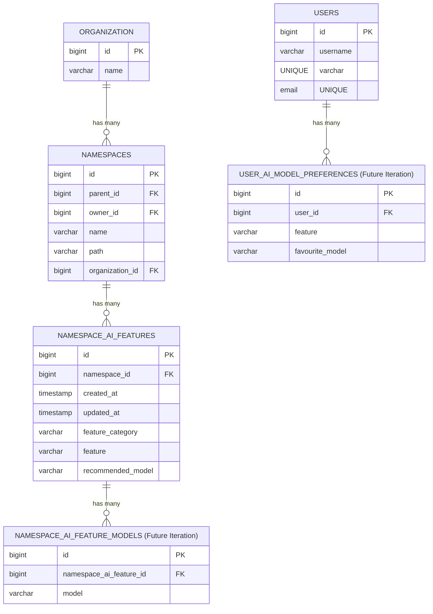
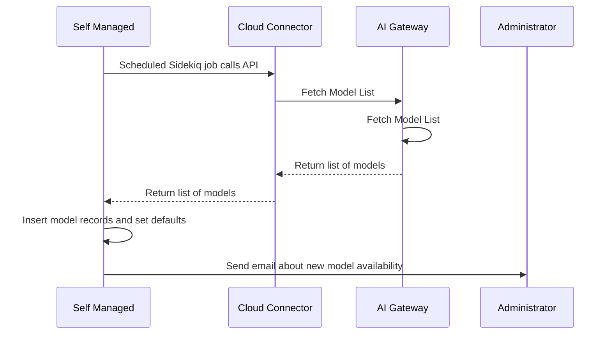
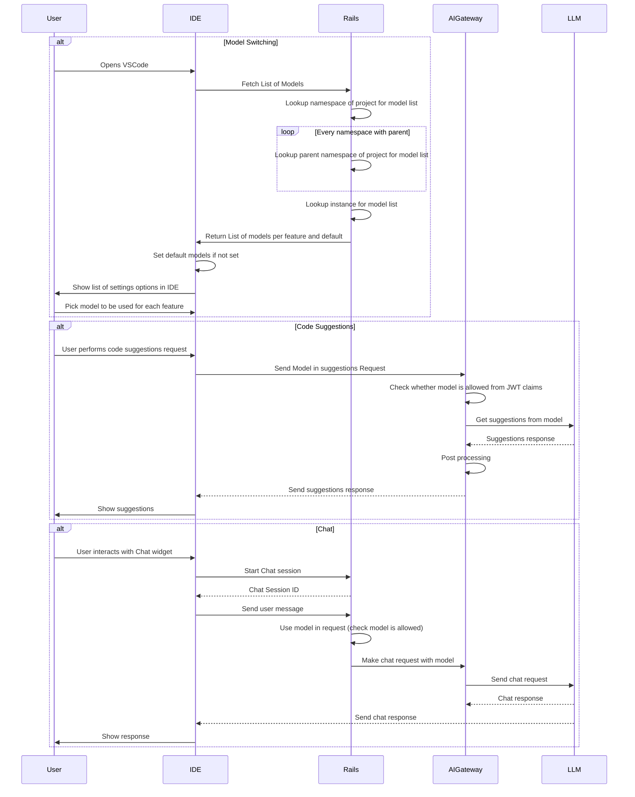

<!-- Design Documents often contain forward-looking statements -->

<!-- This renders the design document header on the detail page, so don't remove it-->


## Background

A growing number of AI models—both open-source and proprietary—are continually emerging, each with distinct characteristics such as latency, maximum token length, training approach, and output quality. Today, GitLab Duo relies on a fixed set of models for features like Code Suggestions, Chat, Duo Code Review, and Vulnerability Analysis. This rigidity limits administrators, operations teams, and end users in selecting the model that best suits their needs.

Additionally, whenever we introduce a new sub-processor or model, customers must undertake a thorough review and threat assessment process. These procedures that can span several months. This review is crucial for compliance and governance but also slows our ability to adopt new and potentially better-performing models.

In light of these challenges, we need an end-to-end solution that spans multiple feature groups to allow flexible model selection. This blueprint outlines the technical architecture required to integrate model selection options throughout GitLab Duo, providing administrators, operators, and end users with fine-grained control over which models can be used while also streamlining the governance and compliance workflow. For further background, please see [Issue #513430](https://gitlab.com/gitlab-org/gitlab/-/issues/513430).

## Current State

**Model Switching with Feature Flags:**

On gitlab.com and Self-Managed instances, model selection is currently controlled by feature flags. These flags are typically toggled on or off by an administrator or operations user. Because these flags apply at the instance level rather than at a user or group level, individual users and enterprises do not have the freedom to switch between different models based on their specific tasks.

**Self-Hosted Model Configuration:**

For Self-Managed installations, administrators can configure self-hosted models at an instance level. While this allows some flexibility in choosing or updating models, it still does not permit end users (developers) to select models on a per-feature basis in the UI or IDE. Furthermore, .com customers currently have no governance mechanism to specify which models their organization members can use.

## Phases

We can deliver this work in iterations so that we deliver value to the customer incrementally

**Iteration 1: Managed Model Configuration**: In this phase we enable managed model configuration for `.com`, `self-managed` and `dedicated`. Supported models will be stored in the AI Gateway. These models will then be retrieved by gitlab.com, Self-managed instances and dedicated instances.

**Iteration 2: Namespace Level Configuration**: In this phase customers will be able to select a recommended model at a namespace level, where the models available will be a subset of the ones allowed at an instance level (group-subgroup). This will allow `.com` customers to decide which models they want their organization to use. Related [Issue](https://gitlab.com/gitlab-org/gitlab/-/issues/514948).

**Future Iterations :**

Future iterations will cover the ability to let the user decide the model to be used for a specific feature in both the IDE and the GitLab UI. Users would be able to select from a subset selected at the namespace level.

We will build out the capabilities for model switching in Duo Code Review, Vulnerability analysis and other features. In addition to this we also want to allow self hosted customers to bring their own models.

> Note: This design does not handle the scenario where we might want to pick from different `recommended_model`s based on the user query. For example we might want to pick `Google Gemini` when the context length becomes very large or `Claude Sonnet` when its a coding related question. Dynamic model switching would have to be covered in a separate blueprint.

## New Design (End State)

This represents the end state and is not broken down by phase. Every phase would deliver a section of this architecture.

### Data Model

The data model is designed to provide a structured way for organizations to manage AI feature settings at different levels. It allows **namespace administrators** to define default AI models for various features (e.g., Code Suggestions, Chat, etc.), while also enabling **individual users** to override these defaults with their preferred AI models.

The objective is to balance administrative control with user flexibility, ensuring that AI-powered features align with both organizational policies and personal preferences.



#### **Entities and Relationships**

##### **1. NAMESPACES**

- Represents groups/subgroups in GitLab.
- **Existing**

##### **2. NAMESPACE_AI_FEATURES**

- A set of features enabled for the namespace. 
- This table consists of a feature category (such as Code Suggestions) and a feature (such Code Completion)
- This also stores the organization level recommended model
- **New**
- **Why?**
  - We need to enable group admins to optionally set the models they want to use for each of the features.

##### **5. NAMESPACE_AI_FEATURE_MODELS**

- Stores a list of allowed models for each feature. If this list if empty then we will show all the GitLab supported models to the user
- **Future**

##### **6. USERS**

- Represents individual users who can interact with AI features.
- **Existing**

##### **7. USER_AI_MODEL_PREFERENCES**

- Allows users to select their **preferred AI model** per feature, overriding the namespace default.
- **Future**
- **Why?**
  - Empowers users with flexibility while maintaining organizational defaults.
  - Allows for personalization of AI-assisted workflows.

> **Note**: An `organization_id` field will be added to AI_SELF_HOSTED_MODELS, AI_FEATURE_SETTINGS and USER_AI_SETTINGS so that those work with cells.

#### **Key Design Considerations**

##### **1. Default & Override Mechanism**

- **Namespace Admins** define default AI models for each feature.
- **Users** can override these defaults for personal preferences (in the future).
- **Fallback Logic:**
  1. Check `USER_AI_SETTINGS` for user preference.
  2. If no user preference, check `NAMESPACE DEFAULTS`.
  3. If no namespace default, revert to a system-wide default.
- **Why?**
  - Ensures a structured decision-making process.
  - Gives users autonomy without breaking organizational policies.

##### **2. Scalability & Performance**

- We need to be able to hierarchically look up the list of models across
  the namespace hierarchy.

##### **3. Flexibility for Deprecation**

- We need to be able to think about how administrators can deprecate models
  and what the process would be to cascade that down to other levels and the database performance implications of that.

### Changes to GitLab rails

1. The list of instance level models will be fetched from AI Gateway periodically and cached in the instance.

1. We need a way to sync models to all cells in `.com` and all self managed instances. This could be done using a separate sidekiq job that will sync GitLab Managed models with each cell and the self-managed instance.



1. We need to build the rails models, controllers and views as described in the `Data Model` section.

1. Every feature when making an API call to AI Gateway needs to be able to pick a model from the list of models allowed for a specific namespace, group, etc. Every feature also needs to be able to look at the default model for the feature.

1. We need to be able to build the Group Settings screen to be able to select a list of models from the set offered at the instance level.

1. When a model is depreciated / inactivated then we need a way to cascade the deprecations down to the namespace level. We will need to build a Sidekiq job that can do that.

1. In rails when the user is picking a recommended_model / default_model at a namespace level they would be able to choose between the GitLab managed models (from the AI gateway config) and from the list of models configured in the self-hosted models screen.

**Future changes when we allow users to pick a model:**

1. Every feature (chat, code suggestions, code review) needs to be able to display a list of available models on the UI. When the customer selects a model that should be set as the default model.

> For some features such as `Duo Code Review` where the customer is not actively interacting with the UI, we may only allow the selection of a single model.

1. We will need to build a new API to fetch the list of models that user is allowed to use

```gql
query {
  aiFeatureSettings {
    nodes {
      feature,
      defaultModel,
      validModels {
        nodes {
          name
        }
      }
    }
  }
}
```

### AI Gateway Changes

The AI Gateway will have to support a new API that will allow rails to fetch the allowed list of models.

The following configuration file in AI Gateway will be updated when we need to release a new model.

```yaml
apiVersion: v1
kind: HostedModelConfiguration
features:
- name: Code Suggestions
  subfeatures:
  - name: Code Completion
    default: code-gecko
    models:
    - code-gecko
    - codestral
  - name: Code Generation
    default: claude-3.5
    models:
    - claude-3.5
    - gpt-4.5
- name: Chat
  subfeatures:
  - name: Chat
    default: claude-3.5
    models:
    - claude-3.5
    - claude-3.7
```

The AI Gateway already supports model passing for various APIs such as `/v2/chat` and `/v4/suggestions`.

The AI Gateway also already supports prompt versioning for different providers so we can tune the prompt in certain cases.

We will need to test our prompt changes across different model families and versions to ensure that we are backwards compatible with what customers are running.
We should collect metrics across different features to figure out the most popular models so that we can focus our model tuning efforts to those.

### Changes to Duo Workflow

In order to allow Model Switching for Duo Workflow we will need to have to create a new field showing the list of models that are available for the GitLab project. Since GitLab project is required for starting a Duo Workflow, we can use the project to determine the group / sub group information to fetch the list of allowed models. When the user selects a model that model information will need to be added to the parameters passed to Duo Workflow Executor which in turn will pass the model name to Duo Workflow Service. The [protobuf contract](https://gitlab.com/gitlab-org/duo-workflow/duo-workflow-service/-/blob/main/contract/contract.proto?ref_type=heads) between the Duo Workflow Service and Executor will need to have a new field called model.

```proto
message StartWorkflowRequest {
    string clientVersion = 1;
    string workflowID = 2;
    string workflowDefinition = 3;
    string goal = 4;
    string workflowMetadata = 5;
    repeated string clientCapabilities = 6;
    string model = 7;
}
```

In addition to this we will be need to be able to update the model [factory](https://gitlab.com/gitlab-org/duo-workflow/duo-workflow-service/-/blob/main/duo_workflow_service/llm_factory.py?ref_type=heads) in Duo Workflow to support different models.

### IDE Changes (Future Iteration)

The IDE must call GitLab to retrieve the list of allowed models for each feature and pass the selected model in the request to AI Gateway or Rails.

**1. Model List Update**

- The IDE periodically fetches the updated list of available models or listens for a specific GitLab: Update Model List command.
- Changes could also be triggered when the user switches GitLab accounts or when an admin updates model availability.

**2. User Preferences**

- A settings screen in the IDE lets users select their default model per feature.
- The IDE continues to pass the chosen model in chat and code suggestion requests.



> **Note:** This is a simplified diagram and does not contain all details such as Authentication/Authorization of the requests

## Open Questions / Risks

**Conflict Resolution**

What happens if multiple namespace admins set conflicting default models at different levels of the hierarchy. Which default should we choose? 
> **Decision**: Configurations on a child namespace to take precedence over the parent namespace.

**Future Model Feature Parity**

Some models have different capabilities (e.g., Google Gemini 2.0 supports internet search and o1 supports `thinking`). How do we handle enable such sub-features?

**Deprecation & Enforcement**

Should we force a hard switch if an AI model is marked as deprecated, or provide a grace period?
