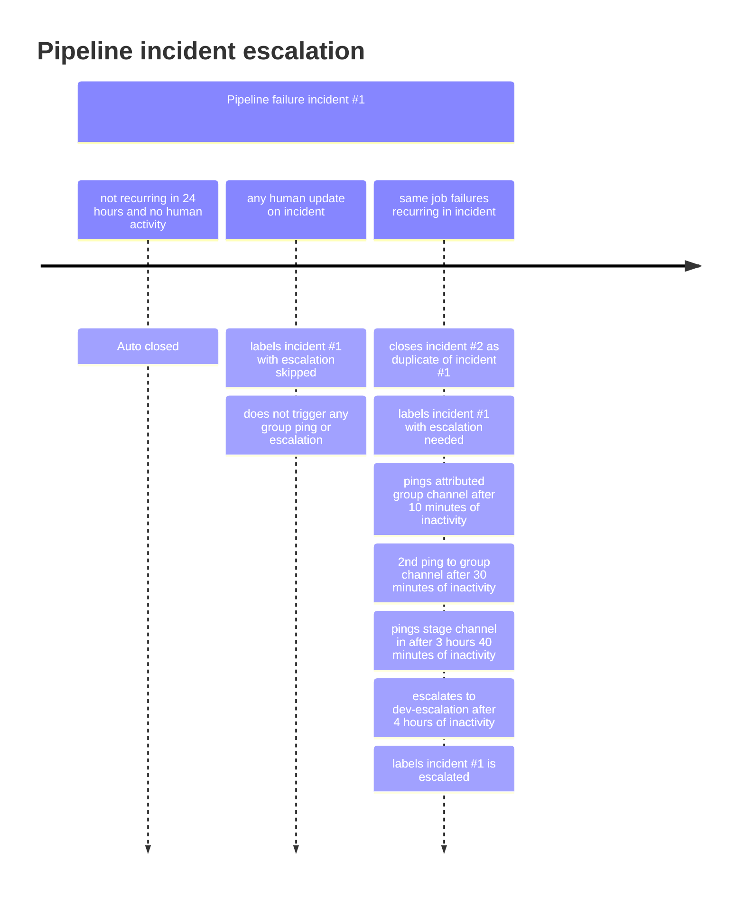

This document explains the workflow for anyone working with issues in GitLab Inc.
For the workflow that applies to the wider community see the [contributing guide](https://docs.gitlab.com/ee/development/contributing/).

## GitLab Flow

Products at GitLab are built using the [GitLab Flow](https://about.gitlab.com/blog/2023/07/27/gitlab-flow-duo/).

We have [specific rules around code review](/handbook/engineering/workflow/code-review/).

## Reverting a merge request

In line with our values of [short toes](/handbook/values/#short-toes), [making two-way-door decisions](/handbook/values/#make-two-way-door-decisions)
and [bias for action](/handbook/values/#bias-for-action), anyone can
propose to revert a merge request. When deciding whether an MR should be reverted,
the following should be true:

- Something broke and there is no acceptable work around. Examples of this include:
  - A feature broke and is categorized as `~severity::1` or `~severity::2`.
  [See severity labels](/handbook/engineering/infrastructure/engineering-productivity/issue-triage/#severity)
  - [Master broken](#broken-master)
  - There are failing migrations
- There are no dependencies on the change. For example, a database
migration has not been run on production.

Reverting merge requests that add non-functional changes and don't remove any existing capabilities
should be avoided in order to prevent designing by committee.

The intent of a revert is never to place blame on the original author. Additionally, it is helpful
to inform the original author so they can participate as a DRI on any necessary follow up actions.

The `pipeline::expedited` label, and `master:broken` or `master:foss-broken` label must be set on merge requests that fix `master` to skip some non-essential jobs in order to speed up the MR pipelines.

## Broken `master`

If you notice that pipelines for the `master` branch of [GitLab](https://gitlab.com/gitlab-org/gitlab) or [GitLab FOSS](https://gitlab.com/gitlab-org/gitlab-foss) are failing, returning the build to a passing state takes priority over everything else development related, since everything we do while tests are broken may:

- break existing functionality
- introduce new bugs and security issues
- impede productivity for all of engineering and our release processes

### What is a broken `master`?

A broken master is an event where a pipeline in `master` is failing.

The cost to fix test failures increases exponentially as time passes due to [merged results pipelines](https://docs.gitlab.com/ee/ci/pipelines/merged_results_pipelines.html) used. Auto-deploys, as well as monthly releases and security releases, depend on `gitlab-org/gitlab` master being green for tagging and [merging of backports](https://gitlab.com/gitlab-org/release/docs/-/blob/master/general/security/release-manager.md#regular-security-releases).

Our aim should be to keep `master` free from failures, not to fix `master` only after it breaks.

Any question or suggestion is welcome in the `#g_development_analytics` channel who owns the broken `master` automation proceess.

### Broken `master` service level objectives

There are two phases for fixing a broken `master` incident which have a target SLO to clarify the urgency. The resolution phase is dependent on the completion of the triage phase.

| Phase | Service level objective | DRI |
| --- | --- | --- |
| [Triage](#triage-broken-master) | 4 hours from the 2nd occurrence of a broken `master` incident creation until assignment | group labeled on the incident |
| [Resolution](#resolution-of-broken-master) | 4 hours from assignment to DRI until incident is resolved | Merge request author or team of merge request author or dev on-call engineer |

Note: Recurring incidents are negatively impacting master pipeline stability and development velocity. Any untriaged, recurring incident will be automatically escalated to `#dev-escalation` following this timeline:



If an incident becomes a blocker for MRs and deployments before being auto-escalated, the team member being impacted should refer to the [broken `master` escalation](#broken-master-escalation) steps to request help from the current [engineer on-call](/handbook/engineering/infrastructure/incident-management/#who-is-the-current-eoc) as early as needed.

Additional details about the phases are listed below.

### Broken `master` escalation

Recurring broken `master` incidents are automatically escalated to `#dev-escalation` unless it is triaged within 4 hours.

If a broken `master` is blocking your team before auto-escalation (such as creating a security release) then you should:

1. See if there is a non-resolved [broken `master` incident](https://gitlab.com/gitlab-org/quality/engineering-productivity/master-broken-incidents/-/issues) with a DRI assigned and check discussions there.
1. Check discussions on the failure notification in the triage DRI's group Slack channel to see if anyone is investigating the incident you are looking at. See [Triage broken master](#triage-broken-master) for information on who the triage DRI is.
1. If there is not a clear DRI or action to resolve, use the [dev escalation](/handbook/engineering/development/processes/infra-dev-escalation/process/) process to solicit help in the broken `master` incident.

#### Escalation on weekends and holidays

Master broken incidents must be manually escalated to `#dev-escalation` on [weekends and holidays](/handbook/engineering/development/processes/infra-dev-escalation/process/#weekends-and-holidays-utc) if necessary. Without a manual escalation, the service level objective can extend to the next working day; that is, triage DRI is expected to triage the incident on the next working day. Regardless of when the label was applied, we always consider an incident to be in an `escalated` state as long as it has the ~"escalation::escalated" label, until the incident is resolved.

### Triage broken master

#### Definitions

- Flaky test: A test that fails, then succeeds when the CI job running the test is retried.
- Broken master:
  - A test that fails even when the CI job running the test is retried.
  - A failing test that can be reproduced locally on the `master` branch.

#### Attribution

If a failed test can be traced to a group through its `feature_category` metadata, the broken `master` incident associated with that test will be automatically labeled with this group as the triage DRI through [this line of code](https://gitlab.com/gitlab-org/quality/triage-ops/-/blob/5ad6a19bd1b37a304fbd02701a002f4dd83e1fcf/triage/triage/pipeline_failure/incident_creator.rb#L23). In addition, Slack notifications will be posted to the group's Slack channel to notify them about ongoing incidents. The triage DRI is responsible for monitoring, identifying, and communicating the incident.

A notification will be sent to the attributed group's Slack channel and `#master-broken`.

#### Triage DRI Responsibilities

1. Monitor
   - Pipeline failures are sent to the triage DRI's group channel, if one is identified, and will be reviewed by its group members. The failures will also be sent to [`#master-broken`](https://gitlab.slack.com/archives/CR6QH3D7C) for extra communication. If an incident is announced in a DRI group's Slack channel, the channel member should acknowledge it and assume the triage DRI responsibilities.
   - If the incident is a duplicate of an existing incident, use the following quick actions to close the duplicate incident:

      ```shell
      /assign me
      /duplicate #<original_issue_id>
      /copy_metadata #<original_issue_id>
      ```

   - If the incident is not a duplicate, and needs some investigation:
     - Assign the incident to yourself: `/assign me`
     - Change the incident status to `Acknowledged` (in the right-side menu).
     - In Slack, the `:ack:` emoji reaction should be applied by the triage DRI to signal the linked incident status has been changed to `Acknowledged` and the incident is actively being triaged.

1. Identification
   - Review non-resolved [broken `master` incidents](https://gitlab.com/gitlab-org/quality/engineering-productivity/master-broken-incidents/-/issues) for the same failure. If the broken `master` is related to a test failure, [search the spec file in the issue search](https://gitlab.com/gitlab-org/gitlab/-/issues?sort=created_desc&state=opened&label_name[]=failure::flaky-test) to see if there's a known `failure::flaky-test` issue.
   - If this incident is **due to non-flaky reasons**, communicate in `#development`, `#backend`, and `#frontend` using the Slack Workflow.
      - Announce that `master` is fixed by enter `/broadcast master fixed` in the chat bar of the `#master-broken` channel to invoke this workflow, and then click `Continue the broadcast`.
      - [Create a revert MR directly](#reverting-a-merge-request) to save some time in case we need to revert down the line.
        - If you are reverting an MR that performs a database migration, you need to follow the [Deployment blockers process](/handbook/engineering/deployments-and-releases/deployments/#deployment-blockers) to prevent the migration from proceeding to deploy and running on staging and production.
        - If the migration is executed in any environments, communicate to the release managers in `#releases` channel and discuss whether it's appropriate to create another migration to roll back the first migration or turn the migration into a no-op by following [Disabling a data migration steps](https://docs.gitlab.com/ee/development/database/deleting_migrations.html#how-to-disable-a-data-migration).
   - If you identified that `master` fails **for a flaky reason**, and it cannot be reliably reproduced (i.e. running the failing spec locally or retrying the failing job):
      - [Quarantine](https://docs.gitlab.com/ee/development/testing_guide/flaky_tests.html#quarantined-tests) the failing test to restore pipeline stability within 30 minutes if the flakiness is continuously causing master pipeline incidents.
      - Alternatively, if the failure does not seem disruptive, and you have a fix that you are confident with, submit the fix MR with the ~"master:broken" label to ensure your pipeline is expedited.
      - If a flaky test issue already exists, add a comment in it with a link to the failed broken master incident and/or failed job. We have automation in place to create test failure issues automatically. The issue is named after the spec path, which can be a search keyword.
      - If a flaky test issue doesn't exist, create an issue from the `New issue` button in top-right of the failing job page (that will automatically add a link to the job in the issue), and apply the `Broken Master - Flaky` description template.
      - Add the appropriate labels to the main incident:

        ```shell
        # Add those labels
        /label ~"master-broken::flaky-test"
        /label ~"failure::flaky-test"

        # Pick one of those labels
        /label ~"flaky-test::dataset-specific"
        /label ~"flaky-test::datetime-sensitive"
        /label ~"flaky-test::state leak"
        /label ~"flaky-test::random input"
        /label ~"flaky-test::transient bug"
        /label ~"flaky-test::unreliable dom selector"
        /label ~"flaky-test::unstable infrastructure"
        /label ~"flaky-test::too-many-sql-queries"
        ```

      - Close the incident
   - Add the stacktrace of the error to the incident (if it is not already posted by gitlab-bot), as well as Capybara screenshots if available in the job artifacts.
     - To find the screenshot: download the job artifact, and copy the screenshot in `artifacts/tmp/capybara` to the incident if one is available.
   - Identify the merge request that introduced the failures. There are a few possible approaches to try:
      - Check the commit in the failed job, and find the associated MR, if any (it's not as simple most of the times though).
      - [Look at the project activity](https://gitlab.com/gitlab-org/gitlab/activity), and search for keywords in the recent merged events.
      - [Look at the recent commits on master](https://gitlab.com/gitlab-org/gitlab/-/commits/master) and search for keywords you might see in the failing job/specs (e.g. if you see a `geo` spec file is failing, specifically the `shard` spec, search for those keywords in the commit history).
        - You can [filter with the `Merge branch` text](https://gitlab.com/gitlab-org/gitlab/-/commits/master?search=Merge%20branch) to only see merge commits.
      - Look at the spec file history or blame views, by clicking respectively the `History` or `Blame` button at the top of a file in the file explorer, e.g. at <https://gitlab.com/gitlab-org/gitlab/-/blob/master/lib/backup.rb>.
   - If you identified a merge request, assign the incident to its author if they are available at the moment. If they are not available, assign to the maintainer that approved/merged the MR. If none are available, mention the team Engineering Manager and seek assistance in the `#development` Slack channel.
      - You can find the team somebody is in and who's the manager for that team by searching in https://handbook.gitlab.com/handbook/product/categories/.
   - If no merge request was identified, ask for assistance in the `#development` Slack channel.
   - Please set the appropriate `~master-broken:*` label from the list below:

      ```shell
      /label ~"master-broken::caching"
      /label ~"master-broken::ci-config"
      /label ~"master-broken::dependency-upgrade"
      /label ~"master-broken::external-dependency-unavailable"
      /label ~"master-broken::flaky-test"
      /label ~"master-broken::fork-repo-test-gap"
      /label ~"master-broken::pipeline-skipped-before-merge"
      /label ~"master-broken::test-selection-gap"
      /label ~"master-broken::need-merge-train"
      /label ~"master-broken::gitaly"
      /label ~"master-broken::state leak"
      /label ~"master-broken::infrastructure"
      /label ~"master-broken::infrastructure::failed-to-pull-image"
      /label ~"master-broken::infrastructure::frunner-disk-full"
      /label ~"master-broken::infrastructure::gitlab-com-overloaded"
      /label ~"master-broken::job-timeout"
      /label ~"master-broken::multi-version-db-upgrade"
      /label ~"master-broken::missing-test-coverage"
      /label ~"master-broken::undetermined"
      ```

1. (Optional) Pre-resolution
   - If the triage DRI believes that there's an easy resolution by either:
      - Reverting a particular merge request.
      - Making a quick fix (for example, one line or a few similar simple changes in a few lines).

     The triage DRI can create a merge request, assign to any available maintainer, and ping the resolution DRI with a `@username FYI` message.
     Additionally, a message can be posted in `#backend_maintainers` or `#frontend_maintainers` to get a maintainer take a look at the fix ASAP.
   - If the failures occur only in `test-on-gdk` jobs, it's possible to stop those jobs from being added to new pipelines while the cause is being fixed. See the [runbook](https://gitlab.com/gitlab-org/quality/runbooks/-/tree/main/test_on_gdk#disable-the-e2etest-on-gdk-pipeline) for details.

#### Pro-tips for Triage DRI

1. For an initial assessment of what might have contributed to the failure, we can try the experimental AI-assisted [root cause analysis](https://docs.gitlab.com/ee/user/gitlab_duo/index.html#root-cause-analysis) feature following [this documentation](https://docs.gitlab.com/ee/user/gitlab_duo_chat/examples.html#troubleshoot-failed-cicd-jobs-with-root-cause-analysis).
2. To confirm flakiness, you can use the `@gitlab-bot retry_job <job_id>` or the `@gitlab-bot retry_pipeline <pipeline_id>` command to retry the failed job(s), even if you are not a project maintainer.

   - **Note**, The `retry_job` command can fail for the following reasons:
     - Retrying the same job twice with the `retry_job` command will result in a failure message because each failed job can only be retried once.
     - If there is no response to either of the `retry` commands, you are likely invoking them in non-supported projects. If you'd like to request for the commands to be added to your project, please [make an issue](https://gitlab.com/gitlab-org/quality/triage-ops/-/issues/new) and inform `#g_development_anallytics`. You are encouraged to self-serve the MR following [this example](https://gitlab.com/gitlab-org/quality/triage-ops/-/merge_requests/2536) and submit it for review for maximum efficiency.

### Resolution of broken master

The merge request author of the change that broke `master` is the resolution DRI.
In the event the merge request author is not available, the team of the merge request author will assume the resolution DRI responsibilities.
If a DRI has not acknowledged or signaled working on a fix, any developer can take assume the resolution DRI responsibilities by assigning themselves to the incident.

#### Responsibilities of the resolution DRI

1. Prioritize resolving recurring broken `master` incidents over new bug/feature work. Resolution options include:
   - **Default**: Revert the merge request which caused the broken `master`. If a revert is performed,
     create an issue to reinstate the merge request and assign it to the author
     of the reverted merge request.
       - Reverts can go straight to maintainer review and require 1 maintainer approval.
       - The maintainer can request additional review/approvals if the revert is not trivial.
       - The `pipeline::expedited` label, and `master:broken` or `master:foss-broken` label must be set on merge requests that fix `master` to skip some non-essential jobs in order to speed up the MR pipelines.
   - [Quarantine](https://docs.gitlab.com/ee/development/testing_guide/flaky_tests.html#quarantined-tests) the failing test if you can confirm that it is flaky (e.g. it wasn't touched recently and passed after retrying the failed job).
     - Add the `quarantined test` label to the `failure::flaky-test` issue you previously created during the identification phase.
   - Create a new merge request to fix the failure if revert is not possible or would introduce additional risk. This should be treated as a `priority::1` `severity::1` issue.
     - To ensure efficient review of the fix, the merge request should only contain the minimum change needed to fix the failure. Additional refactor or improvement to the code should be done as a follow-up.
1. The resolution DRI must address all failures in the pipeline. Be mindful that the initial opened issue for the incident will only announce the jobs that failed so far. But after you fix those jobs, other subsequent jobs could fail on the same pipeline that you're triaging. The triage DRI is responsible for this whole pipeline, and not only for the initial failed jobs.
1. Apply the `Pick into auto-deploy` label (along with the needed `severity::1` and `priority::1`) to make sure deployments are unblocked.
1. If the broken `master` incident affects any stable branches (e.g. <https://gitlab.com/gitlab-org/gitlab/-/merge_requests/25274>) or is caused by a flaky failure,
   open new merge requests **directly against the active stable branches** and ping the current release manager in the merge requests to avoid
   delays in releases / security releases.
   See [How to fix a broken stable branch guide](https://gitlab.com/gitlab-org/release/docs/-/blob/master/general/how-to-fix-broken-stable-branch.md) for more details.
1. Communicate in `#master-broken` when the fix was merged
1. Once the incident is resolved, select the `Broadcast Master Fixed` workflow in the `#master-broken` channel, and click `Continue the broadcast` to communicate it.
1. When `master` build was failing and the underlying problem was quarantined /
   reverted / temporary workaround created but the root cause still needs to be
   discovered, the investigation should continue directly in the incident.
1. Create an [issue](https://gitlab.com/gitlab-org/quality/analytics/team/-/issues/new) for the [Development Analytics group](/handbook/engineering/infrastructure-platforms/developer-experience/development-analytics/) describing how the broken `master` incident could have been prevented in the Merge Request pipeline.
1. When resolution steps are completed and all of the required fixes are merged, close the incident.

#### Responsibilities of authors and maintainers

Once the resolution DRI announces that `master` is fixed:

- Maintainers should start a new merged results pipeline (for canonical MRs)
  and enable "Auto-merge".
  There's no need to rebase once `master` has been fixed since we use [merged results pipelines](https://docs.gitlab.com/ee/ci/pipelines/merged_results_pipelines.html).
- (For forks only) Authors should rebase their open merge requests (since
  [merged results pipelines](https://docs.gitlab.com/ee/ci/pipelines/merged_results_pipelines.html)
  isn't supported in these cases).

### Merging during broken master

Merge requests **can not be merged** to `master` until the incident status is changed to `Resolved`.

This is because we need to try hard to avoid introducing **new** failures,
since it's easy to lose confidence if it stays red for a long time.

In the rare case where a merge request is [urgent](#criteria-for-merging-during-broken-master)
and must be merged **immediately**, team members can follow the process below to have a merge
request merged during a broken `master`.

#### Criteria for merging during broken master

Merging while `master` is broken can only be done for:

- Merge requests that need to be deployed to GitLab.com to alleviate an ongoing production incident.
- Merge requests that fix broken `master` issues (we can have multiple broken `master` issues ongoing).

#### How to request a merge during a broken `master`

First, ensure the latest pipeline has completed less than 2 hours ago (although it is likely to have failed due to
`gitlab-org/gitlab` using
[merged results pipelines](https://docs.gitlab.com/ee/ci/pipelines/merged_results_pipelines.html)).

Next, make a request on Slack:

1. Post to either the `#frontend_maintainers` *or* `#backend_maintainers` Slack
   channels (whichever one is more relevant).
1. In your post outline *why* the merge request is [urgent](#criteria-for-merging-during-broken-master).
1. Make it clear that this would be a merge during a broken `master`, optionally add a link to this
   page in your request.

#### Instructions for the maintainer

A maintainer who sees a request to merge during a broken `master` must follow this process.

Note, if any part of the process below disqualifies a merge request from being merged
during a broken `master` then the maintainer must inform the requestor as to *why* in the
merge request (and optionally in the Slack thread of the request).

First, assess the request:

1. Add the `:eyes:` emoji to the Slack post so other maintainers know it is being assessed.
   We do not want multiple maintainers to work on fulfilling the request.
1. Assess whether the merge request [is urgent or not](#criteria-for-merging-during-broken-master). If in doubt, ask the requestor for more
   details in the merge request about why it is urgent.

Next, ensure that all the following conditions are met:

1. The latest pipeline has completed less than 2 hours ago (although it is likely to have failed due to
   `gitlab-org/gitlab` using
   [merged results pipelines](https://docs.gitlab.com/ee/ci/pipelines/merged_results_pipelines.html)).
1. All of the latest pipeline failures also happen on `master`.
1. There is a corresponding non-resolved [broken `master` incidents](https://gitlab.com/gitlab-org/quality/engineering-productivity/master-broken-incidents/-/issues).
   See the "Triage DRI Responsibilities" steps above for more details.

Next, add a comment to the merge request mentioning that the merge request will be merged
during a broken `master`, and link to the broken `master` incident. For example:

```md
Merge request will be merged while `master` is broken.

Failure in <JOB_URL> happens in `master` and is being worked on in <INCIDENT_URL>.
```

Next, merge the merge request:

- If the "Merge" button is enabled (this is unlikely), then click it.
- Otherwise, you must:
  1. Unset the
    ["Pipelines must succeed" setting](https://docs.gitlab.com/ee/user/project/merge_requests/auto_merge.html#require-a-successful-pipeline-for-merge)
    for the [`gitlab-org/gitlab` project](https://gitlab.com/gitlab-org/gitlab/edit).
  1. Click the "Merge" button.
  1. If the merge train is enabled, a warning will be displayed stating the code changes won't be validated by the merge train. Considering the criticality of the merge request it is acceptable to dismiss the warning.
  1. Set the "Pipelines must succeed" setting to be on again.

### Broken `master` mirrors

[`#master-broken-mirrors`](https://gitlab.slack.com/archives/C01PK38VAN8) was created to remove duplicative notifications from the `#master-broken` channel which provides a space for [Release Managers](https://about.gitlab.com/community/release-managers/) and the [Developer Experience teams](/handbook/engineering/infrastructure-platforms/developer-experience/) to monitor failures for the following projects:

- <https://gitlab.com/gitlab-org/security/gitlab>
- <https://dev.gitlab.org/gitlab/gitlab-ee>

The `#master-broken-mirrors` channel is to be used to identify unique failures for those projects and flaky failures are not expected to be retried/reacted to in the same way as `#master-broken`.

### Broken JiHu validation pipelines

We run JiHu validation pipelines in some of the merge requests, and it can be
broken at times. When this happens, check [What to do when the validation pipeline failed](../../ceo/office-of-the-ceo/jihu-support/jihu-validation-pipelines.html#what-to-do-when-the-validation-pipeline-failed) for more details.

## Security Issues

Security issues are managed and prioritized by the security team. If you are assigned to work on a security issue in a milestone,
you need to follow the [Security Release process](https://gitlab.com/gitlab-org/release/docs/blob/master/general/security/process.md).

If you find a security issue in GitLab, create a **confidential issue** mentioning the relevant security and engineering managers, and post about it in `#security`.

If you accidentally push security commits to `gitlab-org/gitlab`, we recommend that you:

1. Delete the relevant branch ASAP
1. Inform a release manager in `#releases`. It may be possible to execute a garbage collection (via the Housekeeping task in the repository settings) to remove the commits.

For more information on how the entire process works for security releases, see the
[documentation on security releases](https://gitlab.com/gitlab-org/release/docs/blob/master/general/security/process.md).

## Regressions

A `~regression` implies that a previously **verified working functionality** no longer works.
Regressions are a subset of bugs. The `~regression` label is used to imply that the defect caused the functionality to regress.
The label tells us that something worked before and it needs extra attention from Engineering and Product Managers to schedule/reschedule.

The regression label does not apply to bugs for new features for which functionality was **never verified as working**.
These, by definition, are not regressions.

A regression should always have the `~regression:xx.x` label on it to designate when it was introduced. If it's unclear when it was introduced, the latest released version should be added.

Regressions should be considered high priority issues that should be solved as soon as possible, especially if they have severe impact on users. When identified in time, for example in a SaaS deployment, fixing them within the same milestone avoids their being included with that release.

### Use of the ~regression label on MRs

For better efficiency, it's common for a regression to be fixed in an MR without an issue being created, either through reversion of the original MR or a code change. Regardless of whether there is an issue or not, the MR should also have the `~regression` and `~regression:xx.x` labels. This allows for trends to be accurately measured.

## Basics

1. Start working on an issue you're assigned to. If you're not assigned to any issue, find the issue with the highest priority and relevant label you can work on, and assign it to yourself. [You can use this query, which sorts by priority for the started milestones](https://gitlab.com/groups/gitlab-org/-/issues?scope=all&utf8=%E2%9C%93&state=opened&milestone_title=%23started&assignee_id=None&sort=priority), and filter by the label for your team.
1. If you need to schedule something or prioritize it, apply the appropriate labels (see [Scheduling issues](#scheduling-issues)).
1. If you are working on an issue that touches on areas outside of your expertise, be sure to mention someone in the other group(s) as soon as you start working on it. This allows others to give you early feedback, which should save you time in the long run.
1. If you are working on an issue that requires access to specific features, systems, or groups, open an [access request](https://gitlab.com/gitlab-com/team-member-epics/access-requests/-/issues/new?issuable_template=Access_Change_Request) to obtain access on staging and production for testing your changes after they are merged.
1. When you start working on an issue:

   - Add the `workflow::in dev` label to the issue.
   - Create a merge request (MR) by clicking on the **Create merge request** button in the issue. This creates a MR with the labels, milestone and title of the issue. It also relates the just created MR to the issue.
   - Assign the MR to yourself.
   - Work on the MR until it is ready, it meets GitLab's [definition of done](https://docs.gitlab.com/ee/development/contributing/merge_request_workflow.html#definition-of-done), and the pipeline succeeds.
   - Edit the description and click on the **Remove the Draft: prefix from the title** button.
   - Assign it to the suggested reviewer(s) from [Reviewer Roulette](https://docs.gitlab.com/ee/development/code_review.html#reviewer-roulette). If there are reviewers for multiple categories, for example: frontend, backend and database, assign all of them. Alternatively, assign someone who specifically needs to review. When assigning, also @mention them in the comments, requesting a review.
   - (Optionally) Unassign yourself from the MR. Some may find leaving the MR assigned to themselves easier to track the MRs they are responsible for by using the built in MR button/notification icon in the GitLab navigation bar.
   - Change the workflow label of the issue to `workflow::in review`. If multiple people are working on the issue or multiple workflow labels might apply, consider breaking the issue up. Otherwise, default to the workflow label farthest away from completion.
   - Potentially, a reviewer offers feedback and assigns back to the author.
   - The author addresses the feedback and this goes back and forth until all reviewers approve the MR.
   - After approving, the reviewer in each category unassigns themselves and assigns the suggested maintainer in their category.
   - Maintainer reviews take place with any back and forth as necessary and attempts to resolve any open threads.
   - The last maintainer to approve the MR, follows the [Merging a merge request](https://docs.gitlab.com/ee/development/code_review.html#merging-a-merge-request) guidelines.
   - (Optionally) Change the workflow label of the issue to `workflow::verification`, to indicate all the development work for the issue has been done and it is waiting to be deployed and verified. We will use this label in cases where the work was requested to be verified by product OR we determined we need to perform this verification in production.
   - When the change has been verified, change the workflow label to `workflow::complete` and close the issue.

1. You are responsible for the issues assigned to you. This means it has to ship with the milestone it's associated with. If you are not able to do this, you have to communicate it early to your manager and other stakeholders (e.g. the product manager, other engineers working on dependent issues). In teams, the team is responsible for this (see [Working in Teams](#working-in-teams)). If you are uncertain, err on the side of overcommunication. It's always better to communicate doubts than to wait.
1. You (and your team, if applicable) are responsible for:

   - Ensuring that your changes [apply cleanly to GitLab Enterprise Edition](https://docs.gitlab.com/ee/development/ee_features.html).
   - The testing of a new feature or fix, especially right after it has been merged and packaged.
   - Creating any [relevant feature or API documentation](https://docs.gitlab.com/ee/development/documentation/workflow.html#developers)
   - Shipping secure code, (see [Security is everyone's responsibility](#security-is-everyones-responsibility)).

1. Once a release candidate has been deployed to the staging environment, please verify that your changes work as intended. We have seen issues where bugs did not appear in development but showed in production (e.g. due to CE-EE merge issues).

Be sure to read general guidelines about [issues](https://docs.gitlab.com/ee/development/contributing/issue_workflow.html) and [merge requests](https://docs.gitlab.com/ee/development/contributing/merge_request_workflow.html).

## Updating Workflow Labels Throughout Development

Team members use labels to track issues throughout development. This gives visibility to other developers, product managers, and designers, so that they can adjust their plans during a monthly iteration. An issue should follow these stages:

- `workflow::in dev`: A developer indicates they are developing an issue by applying the `in dev` label.
- `workflow::in review`: A developer indicates the issue is in code review and UX review by replacing the `in dev` label with the `in review` label.
- `workflow::verification`: A developer indicates that all the development work for the issue has been done and is waiting to be deployed, then verified.
- `workflow::complete`: A developer indicates the issue has been verified and everything is working by adding the `workflow::complete` label and closing the issue.

Workflow labels are described in our [Development Documentation](https://gitlab.com/gitlab-org/gitlab-foss/-/blob/master/doc/development/labels/index.md#workflow-labels) and [Product Development Flow](/handbook/product-development-flow/).

## Working in Teams

For larger issues or issues that contain many different moving parts, you'll be likely working in a team. This team will typically consist of a [backend engineer](/job-families/engineering/backend-engineer/), a [frontend engineer](/job-families/engineering/development/frontend/), a [Product Designer](/job-families/product/product-designer/) and a [product manager](/job-families/product/product-manager/).

1. Teams have a shared responsibility to ship the issue in the planned release.
    1. If the team suspects that they might not be able to ship something in time, the team should escalate / inform others as soon as possible. A good start is informing your manager.
    1. It's generally preferable to ship a smaller iteration of an issue, than ship something a release later.
1. Consider starting a Slack channel for a new team, but remember to write all relevant information in the related issue(s). You don't want to have to read up on two threads, rather than only one, and Slack channels are not open to the greater GitLab community.
1. If an issue entails frontend and backend work, consider separating the frontend and backend code into separate MRs and merge them independently under [feature flags](https://docs.gitlab.com/ee/development/feature_flags/index.html). This will ensure frontend/backend engineers can work and deliver independently.
    1. It's important to note that even though the code is merged behind a feature flag, it should still be production ready and continue to hold our [definition of done](https://gitlab.com/gitlab-org/gitlab-foss/-/blob/master/doc/development/contributing/merge_request_workflow.md#definition-of-done).
    1. A separate MR containing the integration, documentation (if applicable) and removal of the feature flags should be completed in parallel with the backend and frontend MRs, but should only be merged when both the frontend and backend MRs are on the master branch.

In the spirit of [collaboration](/handbook/values/#collaboration) and [efficiency](/handbook/values/#efficiency-for-the-right-group), members of teams should feel free to discuss issues directly with one another while [being respectful of others' time](/handbook/communication/#be-respectful-of-others-time).

## Convention over Configuration

Avoid adding configuration values in the application settings or in
`gitlab.yml`. Only add configuration if it is absolutely necessary. If you
find yourself adding parameters to tune specific features, stop and consider
how this can be avoided. Are the values really necessary? Could constants be
used that work across the board? Could values be determined automatically?
See [Convention over Configuration](/handbook/product/product-principles/#convention-over-configuration)
for more discussion.

## Choosing Something to Work On

Start working on things with the highest priority in the current milestone. The priority of items are defined under labels in the repository, but you are able to sort by priority.

After sorting by priority, choose something that you're able to tackle and falls under your responsibility. That means that if you're a frontend developer, you work on something with the label `frontend`.

To filter very precisely, you could filter all issues for:

- Milestone: Started
- Assignee: None (issue is unassigned)
- Label: Your label of choice. For instance `CI/CD`, `Discussion`, `Quality`, `frontend`, or `Platform`
- Sort by priority

[Use this link to quickly set the above parameters](https://gitlab.com/groups/gitlab-org/-/issues?scope=all&utf8=%E2%9C%93&state=opened&milestone_title=%23started&assignee_id=None&sort=priority). You'll still need to filter by the label for your own team.

If you're in doubt about what to work on, ask your lead. They will be able to tell you.

## Triaging and Reviewing Code from the rest of the Community

It's every [developers' responsibilities](/job-families/engineering/backend-engineer/#responsibilities) to triage and review code contributed by the rest of the community, and work with them to get it ready for production.

Merge requests from the rest of the community should be labeled with the `Community contribution` label.

When evaluating a merge request from the community, please ensure that a relevant PM is aware of the pending MR by mentioning them.

This should be to be part of your daily routine. For instance, every morning you could triage new merge requests from the rest of the community that are not yet labeled `Community contribution` and either review them or ask a relevant person to review it.

Make sure to follow our [Code Review Guidelines](https://docs.gitlab.com/ee/development/code_review.html).

## Working with GitLab.com

GitLab.com is a very large instance of GitLab Enterprise Edition. It runs release candidates for new releases, and sees a lot of issues because of the amount of traffic it gets. There are several internal tools available for developers at GitLab to get data about what's happening in the production system:

### Performance Data

There is extensive [monitoring](https://dashboards.gitlab.com/) publicly available for GitLab.com. For more on this and related tools, see the [monitoring handbook](/handbook/engineering/monitoring/).

### Error Reporting

- [Sentry](https://sentry.gitlab.net/) is our error reporting tool
- [log.gprd.gitlab.net](https://log.gprd.gitlab.net/) has production logs
- [prometheus.gitlab.com](https://prometheus.gitlab.com/alerts) has alerts for the [production team](/handbook/engineering/infrastructure/#production-team)

## Scheduling Issues

GitLab Inc has to be selective in working on particular issues. We have a limited capacity to work on new things. Therefore, we have to schedule issues carefully.

Product Managers are responsible for scheduling all issues in their respective [product areas](/handbook/product/categories/#devops-stages), including features, bugs, and tech debt. Product managers alone determine the [prioritization](/handbook/product/product-processes/#how-we-prioritize-work), but others are encouraged to influence the PMs decisions. The UX Lead and Engineering Leads are responsible for allocating people making sure things are done on time. Product Managers are *not* responsible for these activities, they are not project managers.

Direction issues are the big, prioritized new features for each release. They are limited to a small number per release so that we have plenty of capacity to work on other important issues, bug fixes, etc.

If you want to schedule an issue with the `Seeking community contributions` label, please remove the label first.

Any scheduled issue should have a team label assigned, and at least one type label.

### Requesting Something to be Scheduled

To request scheduling an issue, ask the [responsible product manager](/handbook/product/categories/#devops-stages)

We have many more requests for great features than we have capacity to work on.
There is a good chance we'll not be able to work on something.
Make sure the appropriate labels (such as `customer`) are applied so every issue is given the priority it deserves.

## Product Development Timeline

[](https://gitlab.com/gitlab-org/gitlab/-/snippets/3670861)

Teams (Product, UX, Development, Quality) continually work on issues according to their respective workflows.
There is no specified process whereby a particular person should be working on a set of issues in a given time period.
However, there are specific deadlines that should inform team workflows and prioritization.

With the monthly [release date](/handbook/engineering/releases/) being the third Thursday of the release month, the **code cut-off** is the Friday prior.

The **next milestone begins** the Saturday after code cut-off.

All other important dates for a milestone are relative to the release date:

- **Monday, 19 days before the milestone begins**:
  - Draft of the issues that will be included in the next release (released next month).
  - Start capacity and technical discussions with engineering/UX.
  - Assess error budgets to determine feature/reliability balance.
  - Development engineering manager provides product manager with prioritization input for `~type::maintenance` issues per [cross-functional prioritization](/handbook/product/product-processes/#cross-functional-prioritization)
  - [Quality](/handbook/product/product-processes/#cross-functional-prioritization) provides product manager with prioritization input for `~type::bug` issues per [cross-functional prioritization](/handbook/product/product-processes/#cross-functional-prioritization)
- **Monday, 12 days before the milestone begins**:
  - Product manager, taking into consideration prioritization input from development EM, Quality, and UX to create a plan of issues for the upcoming milestone.
  - Release scope is finalized. In-scope issues marked with milestone `%x.y`; label `~deliverable` applied.
  - Kickoff document is updated with relevant items to be included.
- **Monday, 5 days before the milestone begins**:
  - Release scope is finalized. In-scope issues marked with milestone `%x.y`; label `~deliverable` applied.
  - Kickoff document is updated with relevant items to be included.
- **Friday before the milestone begins**:
  - [Group Kickoffs calls](/handbook/product/product-processes/#kickoff-meetings) recorded and uploaded.
- **Monday immediately after the milestone begins**: ***Kick off!*** 📣
  - [Company Kickoff](#kickoff) call live streamed.
  - Development on milestone begins.
- **Monday, 9 days after the milestone begins**:
  - The development lead for each stage/section coordinates a stage/section level review with the quad [cross-functional dashboard review process](/handbook/engineering/cross-functional-prioritization/#cross-functional-dashboard-reviews). After the stages/section level reviews are complete, the VP of Development coordinates a summary review with the CTO, VP of Product, VP of UX, and VP of Quality.
- **Wednesday, 11 days after the milestone begins**:
  - GitLab Bot opens [Group Retrospective](/handbook/engineering/management/group-retrospectives/) issue for the current milestone.
- **Friday, the day the milestone ends**:
  - Issues for milestone completed, with docs, and have been merged into master.
  - Feature flags should be flipped from default off to default on after verification to be in the release. See [feature flags](/handbook/product-development-flow/feature-flag-lifecycle/#including-a-feature-behind-feature-flag-in-the-final-release).
  - Merging by the milestone code cut-off (Friday) **does not guarantee** that the feature will be in the release. See [release timelines](/handbook/engineering/releases/#timelines).
  - Individual [release post entries](/handbook/marketing/blog/release-posts/#contribution-instructions) merged for all relevant issues.
  - By end of the day, milestone `%x.y` is expired.
- **On or around Wednesday, the day before the release date**:
  - [Group Retrospective issues](/handbook/engineering/management/group-retrospectives/) are updated with shipped and missed deliverables and team-members are tagged in the discussion.
- **Wednesday, the day before the release date**:
  - [Milestone Cleanup](#milestone-cleanup) runs on the schedule at [Milestone cleanup schedule](#milestone-cleanup-schedule).
- **Third Thursday of the release month**: ***Release Day!*** 🚀
  - Release shipped to production.
  - Release post published.
- **Friday immediately after release day**:
  - The patch release process for the milestone starts. This includes regular and security patch releases.
  - All of the milestone's unfinished issues and merge requests are automatically moved to the next milestone, with the exception of `~security` issues.
- **On or around the Wednesday immediately following the release day**:
  - [Product plans](/handbook/product/product-processes/#managing-your-product-direction) are updated to reflect previous and current releases, including category epics and direction pages.
- **On or around the second Monday following the release day**:
  - Non-critical security patches are [released](/handbook/engineering/infrastructure/library/security-releases-development/).

Refer to [release post content reviews](/handbook/marketing/blog/release-posts/#content-reviews) for additional deadlines.

Note that deployments to GitLab.com are more frequent than monthly major/minor releases.
See [auto deploy transition](https://gitlab.com/gitlab-org/release/docs/blob/21cbd409dd5f157fe252f254f3e897f01908abe2/general/deploy/auto-deploy-transition.md#transition) guidance for details.

## Kickoff

At the beginning of each release, we have a kickoff meeting, publicly livestreamed to YouTube. In the call, the Product Development team (PMs, Product Designers, and Engineers) communicate with the rest of the organization which issues are in scope for the upcoming release. The call is structured by [product area](/handbook/product/categories/#devops-stages) with each PM leading their part of the call.

The [Product Kickoff page](https://about.gitlab.com/direction/kickoff/) is updated each month, which follows the content on the livestream.

## Milestone Cleanup

Engineering Managers are responsible for capacity planning and scheduling for their respective teams with guidance from their counterpart Product Managers.

To ensure hygiene across Engineering, we run scheduled pipelines to move
unfinished work (open issues and merge requests) with the expired milestone to
the next milestone, and label `~"missed:x.y"` for the expired milestone.
Additionally, label `~"missed-deliverable"` whenever `~"Deliverable"` is
presented.

This is currently implemented as part of our [automated triage operations](https://gitlab.com/gitlab-org/quality/triage-ops/blob/master/policies/move-milestone-forward.yml). Additionally, issues with the `~Deliverable` label which have a milestone beyond current +1, will have the `~Deliverable` label removed.

We keep the milestone open for 3 months after it's expired, based on the [release and maintenance policy](https://docs.gitlab.com/ee/policy/maintenance.html).

The milestone cleanup is currently applied to the [following groups and projects](https://gitlab.com/gitlab-org/quality/triage-ops/blob/master/.gitlab/ci/missed-resources.yml):

- [GitLab](https://gitlab.com/gitlab-org/gitlab), [schedule](https://gitlab.com/gitlab-org/quality/triage-ops/pipeline_schedules/10515/edit)
- [GitLab Runner](https://gitlab.com/gitlab-org/gitlab-runner), [schedule](https://gitlab.com/gitlab-org/quality/triage-ops/pipeline_schedules/29681/edit)
- [GitLab Gitaly](https://gitlab.com/gitlab-org/gitaly), [schedule](https://gitlab.com/gitlab-org/quality/triage-ops/pipeline_schedules/29054/edit)
- [GitLab charts](https://gitlab.com/gitlab-org/charts), [schedule](https://gitlab.com/gitlab-org/quality/triage-ops/pipeline_schedules/39481/edit)
- [GitLab QA](https://gitlab.com/gitlab-org/gitlab-qa), [schedule](https://gitlab.com/gitlab-org/quality/triage-ops/pipeline_schedules/29050/edit)
- [Omnibus GitLab](https://gitlab.com/gitlab-org/omnibus-gitlab), [schedule](https://gitlab.com/gitlab-org/quality/triage-ops/pipeline_schedules/31880/edit) (only moving milestone for now, not labelling)

Milestones closure is in the remit of [the Delivery team](/handbook/engineering/infrastructure-platforms/gitlab-delivery/delivery/). At any point in time a release might need to be created for an active milestone,and once that is no longer the case, the Delivery team closes the milestone.

### Milestone cleanup schedule

The milestone cleanup will happen on the milestone due date.

These actions will be applied to open issues:

- Open issues and merge requests will be moved to the next milestone, and
  labeled with `~"missed:x.y"`.
- `~"missed-deliverable"` will also be added whenever `~"Deliverable"`
    is presented.

Milestones are closed when the Delivery team no longer needs to create a backport release for a specific milestone.

## Kickoff Public Stream Instructions

The monthly kickoff meeting is publicly streamed to the [GitLab Unfiltered YouTube Channel](https://www.youtube.com/channel/UCMtZ0sc1HHNtGGWZFDRTh5A?view_as=subscriber). The [EBA](/job-families/people-group/executive-business-administrator/) for Engineering is the [moderator](/handbook/company/group-conversations/#moderator) and responsible for initiating the Public Stream or designating another moderator if EBA is unable to attend.

## Use Group Labels and Group Milestones

When working in GitLab (and in particular, the GitLab.org group), use group labels and group milestones as much as you can. It is easier to plan issues and merge requests at the group level, and exposes ideas across projects more naturally. If you have a project label, you can promote it to a group milestone. This will merge all project labels with the same name into the one group label. The same is true for promoting group milestones.

## Technical debt

We definitely don't want our technical debt to grow faster than our code base. To prevent this from happening we should consider not only the impact of the technical debt but also consider the impacts spreading like a contagion. How big and how fast is this problem going to be over time? Is it likely a bad piece of code will be copy-pasted for a future feature? In the end, the amount of resources available is always less than amount of technical debt to address.

To help with prioritization and decision-making process here, we recommend thinking about contagion as an interest rate of the technical debt. There is [a great comment](https://disq.us/p/1ros2o9) from the internet about it:

> You wouldn't pay off your $50k student loan before first paying off your $5k credit card and it's because of the high interest rate. The best debt to pay off first is one that has the highest loan payment to recurring payment reduction ratio, i.e. the one that reduces your overall debt payments the most, and that is usually the loan with the highest interest rate.

Technical debt is prioritized like [other technical decisions](/handbook/engineering/development/principles/#prioritizing-technical-decisions) in [product groups](/handbook/company/structure/#product-groups) by [product management](/handbook/product/product-processes/#how-we-prioritize-work).

For technical debt which might span, or fall in gaps between groups they should be brought up for a [globally optimized](/handbook/values/#global-optimization) prioritization in [retrospectives](/handbook/engineering/management/group-retrospectives/) or directly with the appropriate member of the [Product Leadership team](/handbook/product/product-leaders/product-leadership/). Additional avenues for addressing technical debt outside of product groups are [Rapid Action issues](/handbook/engineering/development/#rapid-action-issue) and [working groups](/handbook/company/working-groups/).

## Deferred UX

Sometimes there is an intentional decision to deviate from the agreed-upon [MVC](/handbook/product/product-principles/#the-minimal-valuable-change-mvc), which sacrifices the user experience. When this occurs, the Product Designer creates a follow-up issue and labels it `Deferred UX` to address the UX gap in subsequent releases.

For the same reasons as technical debt, we don't want Deferred UX to grow faster than our code base.

These issues are prioritized like [other technical decisions](/handbook/engineering/development/principles/#prioritizing-technical-decisions) in [product groups](/handbook/company/structure/#product-groups) by [product management](/handbook/product/product-processes/#how-we-prioritize-work).

As with [technical debt](#technical-debt), Deferred UX should be brought up for [globally optimized](/handbook/values/#global-optimization) prioritization in [retrospectives](/handbook/engineering/management/group-retrospectives/) or directly with the appropriate member of the [Product Leadership team](/handbook/product/product-leaders/product-leadership/).

## UI polish

UI polish issues are visual improvements to the existing user interface, touching mainly aesthetic aspects of the UI that are guided by [Pajamas](https://design.gitlab.com/) foundations. UI polish issues generally capture improvements related to color, typography, iconography, and spacing. We apply the `UI polish` label to these issues. UI polish issues don't introduce functionality or behavior changes to a feature.

### Examples of UI polish

- **Aesthetic improvements** ([example](https://gitlab.com/gitlab-org/gitlab/-/issues/290262)): removing unnecessary borders from a UI, updating the background color of an element, fixing the font size of a heading element.
- **Misalignment of text, buttons, etc** ([example](https://gitlab.com/gitlab-org/gitlab/-/issues/280538)): although because many times something isn't broken, these improvements are considered UI polish. These could also be considered a bug.
- **Incorrect spacing between UI elements** ([example](https://gitlab.com/gitlab-org/gitlab/-/issues/7905)): when two interface elements are using inconsistent spacing values, such as 10px instead of 8px. It could also be considered technical debt. Note that if two interface elements have zero space between them, its an obvious bug.
- **Visual inconsistencies across different product areas** ([example](https://gitlab.com/gitlab-org/gitlab/-/issues/296948)): visual inconsistencies could occur when we have a series of buttons on a particular view. For example, when 3/4 of them have been migrated to use the Pajamas component, and 1/4 of them are still using a deprecated button, resulting in a visual inconsistency. This is considered a UI polish.

### What is not UI polish

- **Functional inconsistency related to the experience**: for example, using a manual action to add an assignee automatically shows the assignee in the sidebar but using a manual action to add a weight to an issue does not automatically show the weight in the sidebar. This is not currently considered UI polish. It would be considered a UX issue.
- **Improving visibility of system status**: status indicator improvements are experience improvements and are not classified as UI polish.
  - Even when updating something that is purely visual, such as a status icon, to improve the meaning the user has of what they are viewing, we are trying to improve the experience of that user.

## Monitor Merge Request Trends

Open merge requests sometimes become idle (not updated by a human in more than a month). Once a month, engineering managers will receive an [`Merge requests requiring attention triage issue`](/handbook/engineering/infrastructure/engineering-productivity/triage-operations/#group-level-merge-requests-that-may-need-attention) that includes all (non-WIP/Draft) MRs for their group and use it to determine if any action should be taken (such as nudging the author/reviewer/maintainer). This assists in getting merge requests merged in a reasonable amount of time which we track with the [Open MR Review Time (OMRT)](/handbook/engineering/development/performance-indicators/#open-mr-review-time-omrt) and [Open MR Age (OMA)](/handbook/engineering/development/performance-indicators/#open-mr-age-oma) performance indicators.

Open merge requests may also have other properties that indicate that the engineering manager should research them and potentially take action to improve efficiency. One key property is the number of threads, which, when high, may indicate a need to update the plan for the MR or that a synchronous discussion should be considered. Another property is the number of pipelines, which, when high, may indicate a need to revisit the plan for the MR. These metrics are not yet included in an automatically created a triage issue.

## Security is everyone's responsibility

[Security](https://about.gitlab.com/security/) is our top priority. Our Security Team is raising the bar on security every day to protect users' data and make GitLab a safe place for everyone to contribute. There are many lines of code, and Security Teams need to scale. That means shifting security left in the [Software Development LifeCycle (SDLC)](https://about.gitlab.com/stages-devops-lifecycle/). Each team has an [Application Security Stable Counterpart](/handbook/security/product-security/application-security/stable-counterparts/) who can help you, and you can find more secure development help in the `#sec-appsec` Slack channel.

Being able to start the security review process earlier in the software development lifecycle means we will catch vulnerabilities earlier, and mitigate identified vulnerabilities before the code is merged. You should know when and how to proactively [seek an Application Security Review](/handbook/security/product-security/application-security/appsec-reviews/). You should also be familiar with our [Secure Coding Guidelines](https://docs.gitlab.com/ee/development/secure_coding_guidelines.html).

We are fixing the obvious security issues before every merge, and therefore, scaling the security review process. Our workflow includes a check and validation by the reviewers of every merge request, thereby enabling developers to act on identified vulnerabilities before merging. As part of that process, developers are also encouraged to reach out to the Security Team to discuss the issue at that stage, rather than later on, when mitigating vulnerabilities becomes more expensive. After all, security is everyone's job. See also our [Security Paradigm](https://about.gitlab.com/direction/application_security_testing/#security-paradigm).

## Rapid Engineering Response

From time to time, there are occasions that engineering team must act quickly in response to urgent issues. This section describes how the engineering team handles certain kinds of such issues.

### Scope

Not everything is urgent. See below for a non-exclusive list of things that are in-scope and not in-scope. As always, use your experience and judgment, and communicate with others.

- In Scope
  - Last-minute release blocking bug or security patch before an imminent release.
  - High severity (severity::1/priority::1) security issues. Refer to [security severity and priority](/handbook/security/#severity-and-priority-labels-on-security-issues).
  - Highest priority and severity customer issues based on the [priority and severity definitions](https://gitlab.com/gitlab-org/gitlab-foss/-/blob/master/doc/development/contributing/issue_workflow.md#priority-labels).
- Not In Scope
  - An operational issue of GitLab.com or a self managed customer environment. This falls under the [on-call](/handbook/engineering/on-call/) process.
  - Self developed and maintained tools that are not officially supported products by GitLab.
  - Feature request by a specific customer.

### Process

1. Person requesting Rapid Engineering Response creates an issue supplying all known information and applies [priority and severity](https://gitlab.com/gitlab-org/gitlab-foss/-/blob/master/doc/development/contributing/issue_workflow.md#priority-labels) (or [security severity and priority](/handbook/security/#severity-and-priority-labels-on-security-issues)) to the best of their ability.
1. Person requesting Rapid Engineering Response raises the issue to their own manager and the [subject matter domain](/handbook/product/categories/) engineering manager (or the delegation if OOO).
   1. In case a specific group cannot be determined, raise the issue to the Director of Engineering (or the delegation if OOO) of the [section](/handbook/product/categories/).
   1. In case a specific section cannot be determined, raise the issue to the Sr. Director of Development (or the delegation if OOO).
1. The engineering sponsor (subject matter Manager, Director, and/or Sr. Director) invokes all stakeholders of the subject matter as a rapid response task force to determine the best route of resolution:
   1. Engineering manager(s)
   1. Product Management
   1. QE
   1. UX
   1. Docs
   1. Security
   1. Support
   1. Distribution engineering manager
   1. Delivery engineering manager (Release Management)
1. Adjust [priority and severity](https://gitlab.com/gitlab-org/gitlab-foss/-/blob/master/doc/development/contributing/issue_workflow.md#priority-labels) or [security severity and priority](/handbook/security/#severity-and-priority-labels-on-security-issues) if necessary, and work collaboratively on the determined resolution.

## Performance Refinement

A bi-weekly performance refinement session is held by the Development and QE teams jointly to raise awareness and foster wider collaboration about high-impact performance issues.
A high impact issue has a direct measurable impact on GitLab.com [service levels or error budgets](/handbook/engineering/infrastructure/library/service-levels-error-budgets/).

### Scope

The [Performance Refinement issue board](https://gitlab.com/groups/gitlab-org/-/boards/1233204) is reviewed in this refinement exercise.

### Process

1. To participate in the bi-weekly refinement, ask your engineering director to forward the invite of the *Performance Refinement* meeting which is at 15:00 UTC every other Thursday. Here is the [meeting agenda](https://docs.google.com/document/d/1icG6yrW2oebXz8iXvgfM5JjtMqpsDBCn1v3_VO2ghS0/edit#).
1. To nominate issues to the board:
   1. Assign [a performance severity](/handbook/engineering/infrastructure/engineering-productivity/issue-triage/#severity) on the issue to help asses the priority assignment for the refinement session.
   1. Ensure that the issue clearly explains the problem, the (potential) impact on GitLab.com's availability, and ideally, clearly defines a proposed solution to the problem.
   1. Use the label `bug::performance`.
1. For the issues under the **Open** column:
   1. An engineering manager will be assigned if either the `Milestone` or the label `workflow::ready for development` is missing.
   1. Engineering manager brings assigned issue(s) to the Product Manager for prioritization and planning.
   1. Engineering manager unassigns themselves once the issue is planned for an iteration, i.e. associated with a `Milestone` and the label `workflow::ready for development`.
1. To highlight high-impact issues which need additional discussion, please add an agenda item.
1. If a guest attendee would be helpful for collaboration, please forward the invite. For example, a CSM or Support Engineer may have information that would be helpful for an upcoming topic.

## Infradev

The infradev process is established to identify issues requiring priority attention in support of SaaS availability and reliability. These escalations are intended to primarily be asyncronous as timely triage and attention is required. In addition to primary management through the Issues, any gaps, concerns, or critical triage is handled in the  [SaaS Availability weekly standup](/handbook/engineering/#saas-availability-weekly-standup).

### Scope

The [infradev issue board](https://gitlab.com/groups/gitlab-org/-/boards/1193197?label_name[]=infradev) is the primary focus of this process.

### Roles and Responsibilities

#### Infrastructure

1. Nominate issues by adding `Infradev` label.
1. Assess [Severity](/handbook/engineering/infrastructure/engineering-productivity/issue-triage/#severity-slos) and `Priority` and apply the corresponding label as appropriate.
1. Provide [as much information as possible](#a-guide-to-creating-effective-infradev-issues) to assist development engineering troubleshooting.

#### Development

1. Development directors are responsible for [triaging Infradev issues](/handbook/engineering/development/#daily-duties-for-engineering-directors) regularly by following the [triage process](#triage-process) below.
1. Development managers are encouraged to [triage issues](#triage-process) regularly as well.
1. Development managers collaborate with their counterpart Product Managers to refine, schedule, and resolve Infradev issues.
1. Usually, issues are nominated as Infradev issues by SREs or Managers in the Infrastructure Department. Development engineers/managers are not expected to nominate Infradev issues.
   1. However, when it's necessary to spin off new issues from an existing Infradev issue, development engineers and managers may also apply `Infradev` label to the new issues.
   1. When development engineers and managers split off new Infradev issues, they must have a `Severity` and `Priority` labels to the new issues.  The labels should correspond to the importance of the follow-on work.

#### Product Management

1. Product Managers perform holistic prioritization of both product roadmap and Infradev issues as one unified backlog.
1. Product Managers collaborate with their counterpart Development Managers to refine, schedule, and resolve Infradev issues.

### Triage Process

(To be completed primarily by Development Engineering Management)

Issues are nominated to the board through the inclusion of the label `infradev` and will appear on the [infradev board](https://gitlab.com/groups/gitlab-org/-/boards/1193197?label_name[]=infradev).

1. Review issues in the Open column. Look for issues within your Stage/Group/Category, but also for those which lack a clear assignment or where the assignment may need correction.
1. Review the [severity](/handbook/engineering/infrastructure/engineering-productivity/issue-triage/#severity) on the issue to validate appropriate prioritization.
1. Ensure that the issue clearly explains the problem, the (potential) impact on GitLab.com's availability, and ideally, clearly defines a proposed solution to the problem.
1. Assign a Development Manager and a Product Manager to any issue where the `Milestone` or the label `workflow::ready for development` is missing.
   1. Development Manager and Product Manager collaborate on the assigned issue(s) for prioritization and planning.
   1. Development Manager and Product Manager unassign themselves once the issue is planned for an iteration, i.e. associated with a `Milestone` and the label `workflow::ready for development`.
1. All Issues should be prioritized into the appropriate workflow stage. It is the intent to maintain no Open (un-triaged) items.

Issues with `~infradev ~severity::1 ~priority::1 ~production request` labels applied require immediate resolution.

`~infradev` issues requiring a ~"breaking change" should not exist.  If a current `~infradev` issue requires a breaking change then it should split into two issues.  The first issue should be the immediate `~infradev` work that can be done under current SLOs.  The second issue should be  ~"breaking change" work that needs to be completed at the next major release in accordance with [deprecation guidance](https://docs.gitlab.com/ee/development/deprecation_guidelines/). Agreement from development DRI as well as the infrastructure DRI should be documented on the issue.

Infradev issues are also shown in the monthly [Error Budget Report](/handbook/engineering/error-budgets/#budget-reporting).

### A Guide to Creating Effective Infradev Issues

Triage of infradev Issues is desired to occur asynchronously. These points below with endure that your infradev issues gain maximum traction.

1. **Use the [InfraDev issue template](https://gitlab.com/gitlab-org/gitlab/-/issues/new?issuable_template=InfraDev) to create the issue on the gitlab-org/gitlab issue tracker.**
1. **Clearly state the scope of the problem, and how it affects GitLab.com**. Examples could include:
   1. Reliability issues: the problem could cause a widespread outage or degradation on GitLab.com. [example](https://gitlab.com/gitlab-org/gitlab/-/issues/244865)
   1. Saturation issues: the problem could leave to increased saturation, latency issues due to resource over-utilization. [example](https://gitlab.com/gitlab-org/charts/gitlab/-/issues/2458)
   1. Service-level degradation: the problem is causing our service-level monitoring to degrade, impacting the overall SLA of GitLab.com and potentially leaving to SLA violations. [example](https://gitlab.com/gitlab-org/gitlab/-/issues/292732)
   1. Unnecessary alerts: the problem does not have a major impact on users, but is leading to extraneous alerts, impacting the ability of SREs to effectively triage incidents due to alerting noise. [example](https://gitlab.com/gitlab-org/gitlab/-/issues/292732)
   1. Problems which extend the time to diagnosis of incidents: for example, issues which degrade the observability of GitLab.com, swallow user-impacting errors or logs, etc. These could lead to incidents taking much longer to clear, and impacting availability. [example](https://gitlab.com/gitlab-com/gl-infra/infrastructure/-/issues/10933#note_464394760)
   1. Deficiencies in our public APIs which lead to customers compensating by generating substantially more traffic to get the required results. [example](https://gitlab.com/gitlab-org/gitlab/-/issues/232887)
1. **Quantify the effect of the problem** to help ensure that correct prioritization occurs.
   1. Include costs to availability. The [Incident Budget Explorer](https://dashboards.gitlab.net/d/general-incident-budget-explorer/general-incident-budget-explorer?orgId=1) dashboard can help here.
   1. Include the number of times alerts have fired owing to the problem, how much time was spent dealing with the problem, and how many people were involved.
   1. Include screenshots of visualization from Grafana or Kibana.
   1. **Always include a permalink to the source of the screenshot so that others can investigate further**.
1. **Provide a clear, unambiguous, self-contained solution to the problem**. Do not add the `infradev` label to architectural problems, vague solutions, or requests to investigate an unknown root-cause.
1. **Ensure scope is limited**. Each issue should be able to be owned by a single stage group team and should not need to be broken down further. Single task solutions are best.
1. **Ensure a realistic severity is applied**: review the [availability severity label guidelines](/handbook/engineering/infrastructure/engineering-productivity/issue-triage/#availability) and ensure that applied severity matches. Always ensure all issues have a severity, even if you are unsure.
1. **If possible, include ownership labels** for more effective triage. The [product categories](/handbook/product/categories/) can help determine the appropriate stage group to assign the issue to.
1. **Cross-reference links to Production Incidents, PagerDuty Alerts, Slack Alerts and Slack Discussions**. To help ensure that the team performing the triage have all the available data.
   1. By adding "Related" links on the infradev issue, the [Infradev Status Report](https://gitlab.com/gitlab-org/infradev-reports/-/issues) will display a count of the number of production incidents related to each infradev issue, for easier and clearer prioritization.
1. **Ensure that the issue title is accurate, brief and clear**. Change the title over time if you need to keep it accurate.
1. **By adding an infradev label to an issue, you are assuming responsibility and becoming the sponsor/champion of the issue**.
1. **Provide a method for validating that the original issue still exists**
   1. Sometimes infradev issues will resolve on their own, or are resolved as a side-effect of an unrelated change.
   1. In the infradev issue description, provide a clear way of checking whether the problem still exists.
   1. Having a way of checking validity can save on a great deal of back-and-forth discussion between Infradev Triage participants including Engineering Managers, Directors and Product Managers and make space for other non-resolved issues to get scheduled sooner.
   1. Ideally, provide a link to a Thanos query or an ELK query and clear instructions on how to interpret the results to determine whether the problem is still occurring. [Check the "Verfication" section in this issue as an example of this](https://gitlab.com/gitlab-org/gitaly/-/issues/3670#verification).
   1. Alternatively, provide clear instructions on how to recreate or validate the problem.
   1. If an issue has been resolved, use the following process:
      1. Reassign the issue back to the author, or an appropriate owner, requesting that they confirm the resolution, and close the issue  if they concur. If not, they should follow up with a note and unassign themselves.
