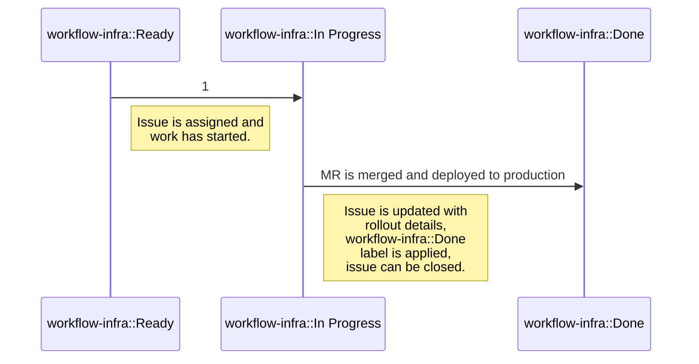

## Common Links

|   |   |
|---|---|
| **Workflow** | [Team workflow](#how-we-work) |
| **GitLab.com** | `@gitlab-org/delivery` |
| **Issue Tracker** | [**Delivery**](https://gitlab.com/gitlab-com/gl-infra/delivery) |
| **Slack Channels** | [#g_delivery](https://gitlab.slack.com/archives/g_delivery) / `@delivery-team` |
| **Delivery Handbook** | [Team training](/handbook/engineering/infrastructure-platforms/gitlab-delivery/delivery/training/) |
| **Delivery Metrics** | [Metrics](/handbook/engineering/infrastructure-platforms/gitlab-delivery/delivery/metrics/) |
| Deployment and Release process | [Deployments and Releases](/handbook/engineering/deployments-and-releases/) |
| Release Tools Project | [Release tools](/handbook/engineering/infrastructure/release-tools) |
| Release Manager Runbooks | [release/docs/runbooks](https://gitlab.com/gitlab-org/release/docs/-/blob/master/runbooks/README.md) |

## Mission

The Delivery Group enables GitLab Engineering to deliver features in a
**safe**, **scalable** and **efficient** fashion to GitLab.com, GitLab Dedicated and self-managed customers.
The group ensures that GitLab's monthly, and patch releases are deployed to GitLab.com, GitLab Dedicated and
publicly released in a timely fashion.

## Vision

The Delivery Group is a behind the scenes, primarily internal user facing team whose product
and output has a direct impact on Infrastructure's primary goals of **availability**, **reliability**,
**performance**, and **scalability** of all of GitLab's user-facing services as well as self-managed
customers. The group creates the workflows, frameworks, architecture and automation for Engineering teams
to see their work reach production effectively and efficiently.

The Delivery Group is focused on building a fully-automated deployment and release platform that builds on the [CI/CD blueprint](https://gitlab.com/gitlab-com/gl-infra/readiness/-/blob/master/library/ci-cd/index.md) to enable fast, flexible releases and deployments with rapid rollout, failure detection and recovery.

Each member of the Delivery group is part of this vision:

- Each team member is able to work on all team projects
- The team is able to reach a conclusion independently all the time, consensus most of the time
- Career development paths are clear
- The team creates a database of knowledge through documentation, training sessions and outreach

### Short-term

- Develop tooling and processes to allow the [Maintenance Policy](https://docs.gitlab.com/ee/policy/maintenance.html) to be extended to fully support three versions
- Improve deployment pipeline observability to allow deployment inefficiencies to be measured and reduced
- Measure Release Manager workload to drive process improvements

### Mid-term

- Significantly reduce Release Manager workload through improved processes and automation
- Develop flexible capabilities for routing traffic within our infrastructure to target desired resources for testing and deployments
- Develop the capability of creating new environments on-demand to aid with new testing requirements and rollout strategies
- Improve test execution flexibility to shift it left and allow simultaneous testing of multiple packages
- Scale security releases to meet organization needs whilst maintaining or reducing release manager workload
- Improve the tools and process we have for testing changes to the deployment and release tools to reduce the time it takes to develop and test tool changes

### Long-term

- Support progressive deployments strategies to enable standard, experimental and risky changes to be rolled out quickly, and safely with minimum impact on other deployment processes or MTTP
- Provide tooling to allow team members outside of Delivery to safely self-serve deployment and release tasks
- Fully automate the release processes used for Monthly, Security, and Patch releases for self-managed users to increase release velocity, and reduce Release Manager workload
- Significantly reduce MTTP below the current 12-hour target
- Increase the speed of deployment failure detection and recovery by enhancing health checks and rollback processes

## Guiding Principles

These are a set of statements or questions we can use within the group to evaluate whether what we are doing is the right thing to do. When deciding on a piece of work to commit to, we should ask ourselves whether the work aligns with these principles. The principles will be driven by the Delivery Group Strategy, domain experts and Delivery Group Members. These are likely to change slightly over time as we learn and should not be considered static. Additionally, these principles are additive to the [GitLab Values](/handbook/values/) and we aim not to duplicate those here.

These principles are intended to help everyone work independently in a way that is aligned with our Group and strategy.

### When designing a solution

1. Simplify Release Management. We always want to be reducing work for release managers either by removing tasks or by improving automation. Be very cautious about introducing new tasks without removing something else
1. Don't add functionality to [Deployer](https://gitlab.com/gitlab-com/gl-infra/deployer). We aim to deprecate [Deployer](https://gitlab.com/gitlab-com/gl-infra/deployer) as part of our work to migrate away from VMs
1. Always consider metrics. If we don't have the metrics to track the value, we should look to add them
1. UX consistency. Strive for consistency across tool interactions and naming
1. Low-context designs. Design tools as if non-delivery team members need to use them. Keep things simple and let the tools do the hard work

### When implementing a solution

1. Choose the smallest implementation. The less code we write, the less code we have to maintain (or debug)

## Strategy

We've moved this subsection to the [Delivery direction pages](https://about.gitlab.com/direction/saas-platforms/delivery/) so that it's in the same place as the rest of our product direction.

## Top-level Responsibilities

The group regularly works on the following tasks, in the order of priority:

1. Ensuring continuous delivery of GitLab application software to GitLab SaaS.(e.g. [GitLab SaaS auto-deploy](https://gitlab.com/groups/gitlab-org/release/-/epics/13))
1. Coordination and preparation of GitLab releases for self-managed users for the monthly patch and security releases.
1. Participating in incident resolution and acting on corrective actions for SaaS and self-managed software delivery.
1. Increasing velocity of both SaaS and self-managed software delivery through foundational project work (e.g. [Running GitLab SaaS on Kubernetes](https://gitlab.com/groups/gitlab-com/gl-infra/-/epics/112)).
1. Improving the robustness of SaaS software delivery by creating and improving tooling (e.g. [Deployment rollback](https://gitlab.com/groups/gitlab-com/gl-infra/-/epics/282)).
1. Minimizing the use of custom tooling by building or enhancing features within GitLab (e.g. [Create a Changelog feature](https://gitlab.com/groups/gitlab-com/gl-infra/-/epics/351)).
1. Support other teams' needs related to software delivery on GitLab SaaS (e.g. [New Container Registry deployment](https://gitlab.com/groups/gitlab-com/gl-infra/-/epics/412)).

## Teams

The Delivery Group is composed of two teams: `Delivery:Releases` and `Delivery:Deployments`.

The Delivery:Releases and Delivery:Deployments OKRs, while contributing to the wider GitLab objectives, are tailored and structured to achieve the [Delivery Group Strategy](#strategy) as a single team.

### Delivery:Releases

The primary goal of the Releases team is to provide everything to do with creating GitLab releases for customers and enabling internal customers to get their changes into releases. Major, minor and patch releases as well as a platform on which we can verify changes to various installation types (release environments) and create visibility for GitLab team members and customers into our release schedule (release dashboard).

### Delivery:Deployments

The primary goal of the Deployments team is to provide everything to do with rolling out changes to active platforms managed by GitLab, including but not limited to continuous deployment to GitLab.com (deployment safety), changing gitlab.com architecture to support continuous deployment (eliminate staging 🤞 ) and optimizing the zero downtime rollout experience of GitLab Dedicated.

### Team Members

The following people are members of the Delivery:Releases Team:



The following people are members of the Delivery:Deployments Team:



## Team counterparts

The following members of other functional teams are our stable counterparts:



## Performance indicators

Delivery Group contributes to [Engineering function performance indicators](/handbook/engineering/performance-indicators/) through [Infrastructure department performance indicators].
The group's main performance indicator is [**M**ean **T**ime **T**o **P**roduction](/handbook/engineering/infrastructure/performance-indicators/#mean-time-to-production-mttp) (MTTP), which serves to show how quickly a change introduced through a Merge Request
is reaching production environment (GitLab.com).
At the moment of writing, the target for this PI is defined in this [key result](https://gitlab.com/groups/gitlab-com/gl-infra/-/epics/107) epic.

MTTP is further broken down into charts and tables at the Delivery Team Performance Indicators Sisense dashboard.

## Delivery domain ownership between Delivery teams

The Delivery Group owns the tools and capabilities needed for GitLab deployments and releases. The diagram below shows the split of domain ownership between the two teams and the current release managers. Where the domain overlaps with teams outside of the Delivery Group, we focus primarily on the deployments and releases capabilities and needs.


- [Diagram source](https://docs.google.com/presentation/d/1KdrrdYpjdHinYyUa2V3nUCWico74twXWfCCJg-m0ODI/edit?usp=sharing)

### Release Manager ownership

Release Managers are members of the Delivery group but during their time as release managers, they're wearing a different hat. The primary customers are GitLab users.

1. Auto-deploys: Release Managers operate the auto-deploy process. Largely this will make use of capabilities provided by the Deployments team, but the Orchestration tools will be making use of the Deployments team capabilities. Environment health checks are an example of a Deployments capability that will be integral to the process and tools the release managers use.
2. Self-managed releases: Release Managers operate the release processes (patch and security) using the capabilities provided by the Releases team.
3. Post-deploy migrations: Release Managers operate the PDM process using the capabilities provided by the Deployments team.
4. Hot patch process: Release Managers, working with EOCs, will manage the hot patch process. Hot patch capabilities are provided by the Releases team with heavy dependence on Deployments capabilities due to the shortened process and therefore reduced pipeline jobs.
5. Deployment blockers: Release Managers are responsible for identifying, and reporting on deployment blockers in order to provide the teams with data needed to plan improvements.
6. Release Manager dashboards: Release Managers own <https://dashboards.gitlab.net/d/delivery-release_management/delivery-release-management?orgId=1> plus have the freedom to create any additional dashboards that they think would be useful for release management. The data needed for dashboards will be made available from a centralized place, owned by Deployments.
7. Escalation of Deployment Blockers.  When facing deployment blockers in any environment of more than 2 hours without a clear path to resolution, [escalate](/handbook/engineering/infrastructure-platforms/gitlab-delivery/delivery/#release-management-escalation) to the `Release Management Escalation` Schedule in PagerDuty to help coordinate and unblock deployments.

### Delivery:Releases ownership

The primary customers of the Releases team are:

- the internal GitLab users who want to deploy & release changes i.e.,
- Release Managers and Stage Groups.
- customers for the monthly Release

1. Release metrics: Providing A centralized store for metrics related to releases. Deployments will primarily be concerned with providing a metrics capability to allow all deployment pipelines to record metrics in a useful way to fuel all required dashboards.
1. Releases/Packages Pipeline visibility: Providing visibility of pipeline configuration, status, and outcome.
1. Release change management tooling: Providing the ability for changes to be included, or excluded from releases to Self-Managed users.
1. Release/packaging execution log: Ensuring that an accurate log of releases is maintained.
1. Deployment & release metadata: Tracking component versions and dependencies to allow for quality gates to be accurate, and to ensure predictable releases.
1. QA test execution & results visibility: Ensuring that all deployments and releases pass the required testing. Releases will be particularly concerned with timing of test execution and making sure that the correct dependencies are in place for reliable results.
1. Releases dashboards: Delivery:Releases will own a set of dashboards to guide the team's work on designing effective release processes. Dashboards, or templates, will also be needed to evaluate the effectiveness of individual release pipelines.
1. Release Publishing: Publishing packages to various distribution sites (e.g., packages.gitlab.com, Docker Hub, etc.), publishing tooling, and guaranteeing a reliable publishing process.

### Delivery:Deployments ownership

The primary customers of the Deployments team are:

- Release managers who rely on the deployment tooling
- GitLab SaaS (GitLab.com, Dedicated and Cells) customers expecting deployments of updated code to their various infrastructures.

1. Deployment changelock: will make sure that all deployments observe planned and ad-hoc changelocks. Examples include PCLs, S1/S2 incidents, as well as other Change Requests.
1. Environment changelock: will make sure that environments can be locked to schedule, or on an ad-hoc basis if required by planned maintenance or poor environment health. Guaranteeing that changes are rolled out in a predictable way will also be a Deployments responsibility.
1. Environment health: Ensuring that environment health is assessed and available to guide deployment decisions.
1. Release & deployment metrics: Providing A centralized store for metrics related to deployments & releases. Deployments will primarily be concerned with providing a metrics capability to allow all deployment and release pipelines to record metrics in a useful way to fuel all required dashboards.
1. Deployment change management tooling: Providing the ability for changes to be included, or excluded from deployments.
1. Deployment execution log: Ensuring that an accurate log of deployments is maintained.
1. Application rollout: will be responsible for applying changes to the required clusters and environments. Rollout strategies, e.g., canary, blue/green, with gradual traffic increase etc, will be capabilities provided by Deployments.
1. Rollout dashboards: will own a set of dashboards to guide the team's work on managing effective rollouts to all environments. Examples could include the timing of changes applied to individual servers and visibility into environment use.
1. Canary environments: will own the rollout capability of the canary environments. They'll work closely with Reliability to ensure full environment management.
1. Deployment and release test environments: Pre, Staging, Release: will own the rollout capability of the test environments. They'll work closely with Reliability to ensure full environment management.
1. Deployment and release production environment: will own the rollout capability of the Production environment. They'll work closely with Reliability to ensure full environment management.
1. Deployment dashboards: Delivery:Deployments will own a set of dashboards to guide the team's work on designing effective deployment processes. Dashboards, or templates, will also be needed to evaluate the effectiveness of individual deployment and release pipelines.

## How we work

### Reaching our Team

| Reason | Contact | Via |
| ------ | ------- | --- |
| S1/P1 Deployment/Release related issues | `@release-managers` | Slack |
| Any Priority Deployment/Release related issues | `@gitlab-org/delivery` | GitLab |

Release Managers have a weekday follow-the-sun rotation and can be reached via the `@release-managers` handle on Slack. For weekend support or other escalations please use the Release Management Escalation steps below to reach Delivery Leaders.

#### Release Management Escalation

During weekday working hours you can reach the current Release Manager via the `@release-managers` handle on Slack.

For release management support outside of working hours, or if you need to escalate to Delivery Leadership please follow the steps below to page using PagerDuty.

1. Open the PagerDuty app in Slack and use the `/pd trigger` slack command to trigger a new incident

2. Select the `Release Management Escalation` service and provide request details in the `Title` field. You can leave all other fields empty

3. Click `Create` and one of the Delivery leaders will respond

### Project Management

The Delivery Group's work is tracked through a number of epics, issues, and issue boards.

Epics and issue boards are complementary to each other, and we always strive to have a 1-1 mapping between a working epic and an issue board.
Epics describe the work and allows for general discussions, while the issue board is there to describe order of progress in any given epic.

Each project should have a project-label applied to all epics and issues to allow issue boards to show a full project view.

Issues should primarily be created in the [delivery issue tracker](https://gitlab.com/gitlab-com/gl-infra/delivery) for
visibility and prioritization.  Repositories that Delivery maintain should have
their own issue trackers disabled.  The purpose of this is to ensure a single
source of truth for work to be prioritized and visible within the team.

### Epics

The [Release Velocity](https://gitlab.com/groups/gitlab-com/gl-infra/-/epics/170) epic tracks all work related to the group mission. Any working epic that the team creates should be directly added as a child to this top level tracking.

Working epic should always have:

1. [A Problem Statement](https://lamport.azurewebsites.net/pubs/state-the-problem.pdf).
1. [Directly responsible individuals](/handbook/people-group/directly-responsible-individuals/) responsible for the project completion.
1. Defined exit criteria
1. Issue admin section to provide the issue priority, labels and epic for quick actions. [Example](https://gitlab.com/groups/gitlab-com/gl-infra/-/epics/273#issue-template).
1. Status YYYY-MM-DD to indicate what is being worked on, why, and planned next steps. The DRI is responsible for updating the epic status every Wednesday. Note, this must be the last heading in the epic to support automated epic summary updates
1. Start date and estimated due date
1. Labels:
    - 
    - Label used as part of the project scope (eg. `kubernetes`, `security-release`). The DRI should create a suitable project scope label and add it to the [Delivery-triage rules](https://gitlab.com/gitlab-com/gl-infra/triage-ops) if needed.
    - Epic status label using the 'workflow-infra::triage', 'workflow-infra::proposal', 'workflow-infra::in-progress', 'workflow-infra::done'

In cases where the work is tracked in a project in a different group outside of our canonical project location, we will create two epics for the same topic and state in the epic description which one is the working epic.

### Issue Boards

Each working epic should be accompanied by an issue board. Issue boards should be tailored to the specific project needs, but at minimum it should contain the [workflow labels](#workflow) shown on the workflow diagram.

### Labels

The canonical issue tracker for the Delivery group is at [gl-infra/delivery](https://gitlab.com/gitlab-com/gl-infra/delivery). Issues are automatically labeled if no labels are applied using the [triage ops](https://gitlab.com/gitlab-com/gl-infra/triage-ops) project.
The default labels defined in the [labeling library](https://gitlab.com/gitlab-com/gl-infra/triage-ops/-/blob/master/lib/delivery/default_labeling.rb).

By default, an issue needs to have a:

1. Workflow Label - Default: `workflow-infra::Triage`
1. Priority Label - Default: `Delivery::P4`
1. Group Label - `group::delivery`
1. Team Label - `team::Delivery-Deployments` or `team::Delivery-Releases`
1. Other Label - project or team management related label.

#### Workflow

The Delivery group leverages scoped `workflow-infra` labels to track different stages of work.

Not every issue will be prioritised for building as soon as it is ready. Instead we manage a [Build board](https://gitlab.com/gitlab-com/gl-infra/delivery/-/boards/1918862) with all `workflow-infra::In Progress`, and `workflow-infra::Ready` issues focused on the team's current goals.

The standard progression of workflow is described below:



There are three other workflow labels of importance omitted from the diagram above:

1. `workflow-infra::Cancelled`:

    - Work in the issue is being abandoned due to external factors or decision to not resolve the issue. After applying this label, issue will be closed.

1. `workflow-infra::Stalled`

    - Work is not abandoned but other work has higher priority. After applying this label, team Engineering Manager is mentioned in the issue to either change the priority or find more help.

1. `workflow-infra::Blocked`

    - Work is blocked due external dependencies or other external factors. After applying this label, issue will be regularly triaged by the team until the label can be removed.

Label `workflow-infra::Done` is applied to signify completion of work, but its sole purpose is to ensure that issues are closed when the work is completed, ensuring issue hygiene.

#### Priority Labels

The Delivery group uses priority labels to indicate order under which work is next to be picked up. Meaning attached to priorities can be seen below:

| Priority level  | Definition |
| --------------- | ---------- |
| Delivery::P1 | Issue is blocking other team-members, or blocking other work. Needs to be addressed immediately, even if it means postponing current work. |
| Delivery::P2 | Issue has a large impact, contributes towards current OKRs or will create additional work. Work should start as soon as possible after completing ongoing task. |
| Delivery::P3 | Issue should be completed once other urgent work is done. |
| Delivery::P4 | **Default priority**. A nice-to-have improvement, non-blocking technical debt, or a discussion issue. Issue might be completed in future or work completely abandoned. |

The group uses priority labels differently to the [general issue triage priority definition](/handbook/engineering/infrastructure/engineering-productivity/issue-triage/#priority) in order to avoid ambiguity that comes with difference in timelines between Stage teams and Infrastructure teams. We have different timelines (release brings different expectations for Delivery), different DRI's (no PM for Delivery), and different importance (Blocked release means that no one can ship anything).

#### Other Labels

Some of the labels related to the team management are defined as:

1. `onboarding` - issues are related to granting access to team resources.
1. `team-tasks` - issues related to general team topics.
1. `Discussion` - meta issues that are likely to be promoted to a working epic or generate separate implementation issues.
1. `Announcements` - issues used to announce important changes to wider audience.

Project labels are defined as needed, but they are required unless the issue describes a team management task.

Incidents impacting Delivery may optionally include an [impact label](/handbook/engineering/releases/#delivery-impact-labels).

#### Delivery:Deployments specific ways of working

In addition to the Epics, Issue Boards, Labels, and Workflow practices common to the entire team, the Delivery:Deployments team adopts a few extra approaches to improve its communication and better share knowledge and decisions within the team.

- Each Epic should contain a `Decision Log`: this helps to keep a single, centralized SSOT where all decisions taken during project work are listed. For completeness, we should report the date of the decision,
who was involved in the discussion and decision, and the outcome of the decision.

  For simplicity, you can use the snippet below to add Decision Log to Epics Description:

  ```markdown
  ### Decision Log

  <details>
    <summary>Decision List</summary>

    <details>
      <summary>YYYY-MM-DD</summary>
        <Discussion details, people involved in the discussion and decision, decision outcome>
    </details>
  </details>
  ```

- Each Issue should contain a `Progress Thread` as a comment: this helps make the work visible in an async environment and shares knowledge while the work progresses.
Comments within the progress thread should highlight the progress achieved, the intermediate steps/results we got, assumptions, discoveries, and blockers we face.
This approach allows people from the team and outside of the team to build a clear idea and eventually contribute with comments and suggestions.

### Choosing something to work on

The Delivery group generally has working epics assigned to a [DRI](/handbook/people-group/directly-responsible-individuals/) who is responsible for making sure work is broken down into issues, and appropriate issues are moved onto the [Build board](https://gitlab.com/gitlab-com/gl-infra/delivery/-/boards/1918862) to keep the project on track. However, anyone is welcome to pick up any tasks from the [Build board](https://gitlab.com/gitlab-com/gl-infra/delivery/-/boards/1918862) regardless of which project it belongs to.

### Merge Requests

The Delivery group respects the Company principle of [everything starting with a merge request](/handbook/communication/#start-with-a-merge-request).

1. All Merge Requests (MRs) must go through the review process.
1. MRs should be labeled with the [Delivery labels](/handbook/engineering/infrastructure-platforms/gitlab-delivery/delivery/#labels).
1. It is expected that MR author assigns reviewers once the MR is ready to go.
1. Follow [GitLab Code Review Guidelines](https://docs.gitlab.com/ee/development/code_review.html).
1. We [dogfood the Reviewers feature](https://docs.gitlab.com/ee/development/code_review.html#dogfooding-the-reviewers-feature) to assign reviewers to an MR.

Besides, we try to apply some best practices when doing Merge Requests:

- Choosing reviewers: Commonly, any team member on Delivery can be assigned for reviews with a few considerations:
  - We avoid adding the entire Delivery group to Merge Requests Review to avoid too many pings.
  - GitLab team is globally distributed, so think about timezone when assigning someone as reviewer.
  - Project - The reviewer should be knowledgeable or at least familiarized with the project, for example, release-tools reviews are normally handled by backend engineers, while k8s-workloads reviews are handled by SREs.
  - Context - If you're working closely with a peer, it's recommended to assign it to this team member for shorter review cycles.
  - Release manager (or capacity) - If a team member is a [release manager](https://about.gitlab.com/community/release-managers/) and they're working on a release task, they should not be bothered with reviews.
- The usual [code-review turnaround](/handbook/engineering/workflow/code-review/#review-response-slo) is two business days.
  - This doesn't apply if the merge request is associated with a ~Delivery::P1 item. In that case, the Merge Request review has to be treated with priority and urgency.
- If the merge request has all the required approvals it can be merged by the author.
- If you are assigned as a Reviewer, and you think to not be the best fit for the Merge Request (out of working hours, not enough understanding, don't have the capacity to review, etc.), please mention this to the merge request author so they can find another maintainer available or select an alternate team member that you feel would be better suited.
- For Delivery team projects, one approval is usually sufficient to merge an MR, but the reviewer or author can request another review if they prefer. A second review might be requested because the reviewer is not comfortable being the only reviewer, or the author would like a second pair of eyes, or for any other reason.

## Project demos

As part of the project, we might decide to organize project demos. The decision on creating a demo depends on the expected longevity of the project, but also on the complexity of it.

The purpose of the demo is to ensure that everyone who participates in the project has a way of sharing their findings and challenges they might have encountered outside of the regular async workflow. The demos do not have presentations attached to them, and they require no prior preparation.
The demoer shouldn't feel like they have to excuse themselves for being unprepared, and expect that their explanation without faults. In fact, if what is being demoed is showing off no weaknesses, we might have not cut scope in time.

It is encouraged to show and discuss:

1. The imperfectness of the specific code implementation.
1. How broken the used tool might be.
1. How an established process breaks down.
1. How challenging a problem being resolved might be.

## Team training

Every Delivery Group member is responsible for sharing skills either through creating a training session for the rest of the group or through paired work.
See the page on [team training](/handbook/engineering/infrastructure-platforms/gitlab-delivery/delivery/training/) for details.

## History

The Delivery team officially [came into existence on 2018-10-23](https://gitlab.com/gitlab-com/www-gitlab-com/-/merge_requests/15348/). This was the culmination of a larger alignment that was happening throughout that year, exposed by the need to streamline releases for self-managed users and creating a better experience for GitLab.com users.

All throughout GitLab's existence, Release Management had been a monthly rotating role served by developers. The idea behind it was to keep developers close to the whole lifecycle of the software they create, and ensure that they automate their work. This worked well until the number of application changes, and developer tasks grew too large for anyone to handle as a secondary task. The event that indicated the need for a change was a near miss event near the end of 2017, when the first Release Candidate was deployed to GitLab.com just 2 days before the 22nd. That whole month was riddled with challenges, from release managers struggling to deliver their day to day development tasks and RM tasks, to multiple unsuccessful deployments to GitLab.com. Most importantly, this was a first indication that the company was growing and that the processes that worked previously, might need to change to accommodate the larger growth that was planned.

After some internal discussions, we entered 2018 with an attempt to [work on process improvements](https://gitlab.com/gitlab-org/release/tasks/-/issues/39), rather than changing everything in one go. We went from a monthly rotation to two month [release manager rotation](https://about.gitlab.com/community/release-managers/), started [noting down spent time](https://gitlab.com/gitlab-org/release/tasks/-/issues/1). Over the next several months we'd seen general stabilization of the process but it became apparent that spending 4 engineers time in Release Manager rotation was not getting us anywhere closer to improving the deployment process for GitLab.com, and with each developer we hired the task list grew bigger.

The initial discussion on [what is in front of us to achieve Continuous Delivery](https://gitlab.com/gitlab-com/gl-infra/delivery/-/issues/1) on GitLab.com exposed a clear need for a team focused on this specific task.

With the team created, we set out to work on the [release we designed](https://gitlab.com/gitlab-com/www-gitlab-com/-/merge_requests/16028), [change the way we deploy to GitLab.com](https://gitlab.com/gitlab-com/www-gitlab-com/-/merge_requests/17842/diffs), [merge GitLab Rails codebases](https://gitlab.com/gitlab-com/www-gitlab-com/-/merge_requests/19037/diffs) and many more other tasks.

After a successful [team onsite (aka Fast boot)](https://gitlab.com/groups/gitlab-org/release/-/epics/17) where we executed on our tasks while being in the same room together for the first time, [we announced the first step towards Continous Delivery on GitLab.com](https://gitlab.com/gitlab-com/gl-infra/delivery/-/issues/345). This was a very large change that changed the deployment frequency from deploying from the default branch once per month (for the total of 4-6 deploys to include bug fixes), to taking commits from the default branch once per week.

The team focus then shifted to getting deployment time measured in hours, and migration of GitLab.com to Kubernetes.

Prior to 2020, the team impact overview was created in Slack, and in the years that followed the overview was logged in issues:

1. [Year overview for 2020](https://gitlab.com/gitlab-com/gl-infra/delivery/-/issues/1446)
1. [Year overview for 2021](https://gitlab.com/gitlab-com/gl-infra/delivery/-/issues/2171)
1. [Year overview for 2022](https://gitlab.com/gitlab-com/gl-infra/delivery/-/issues/2726)
1. [Year overview for 2023](https://gitlab.com/gitlab-com/gl-infra/delivery/-/issues/19887)
1. [Year overview for 2024](https://gitlab.com/gitlab-com/gl-infra/delivery/-/issues/20754)
