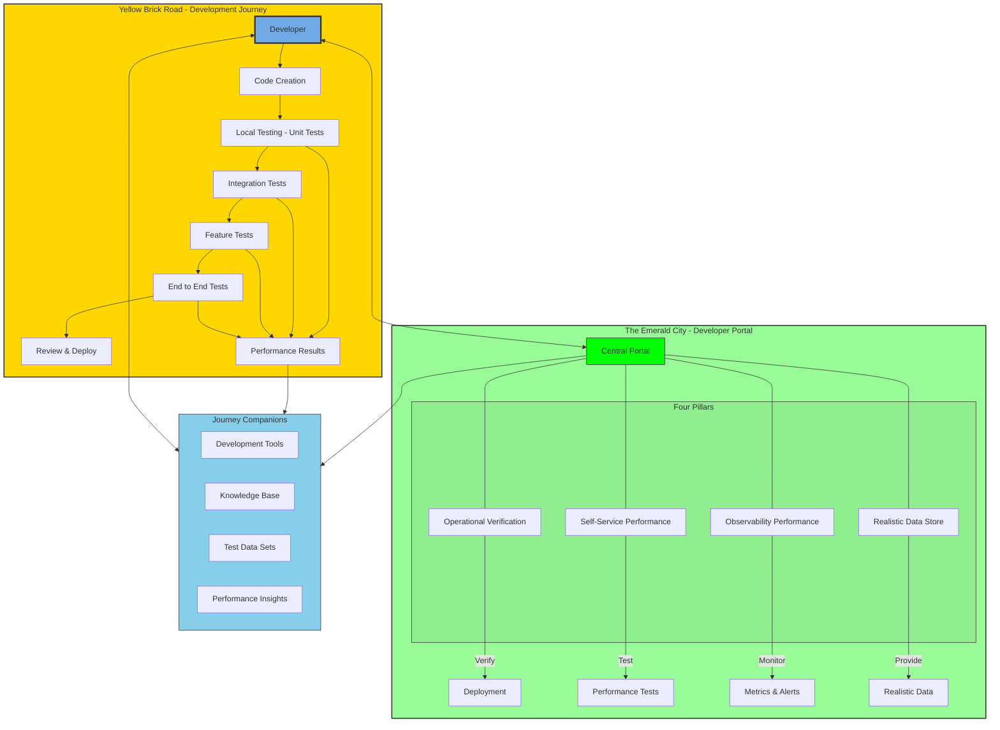

## Mission

To build and maintain a framework/developer portal which enables internal teams to develop reliable systems and deliver seamless customer experiences.

## Vision

To transform GitLab's performance testing from reactive to proactive while fostering a culture of performance awareness by providing:

- Optimized and efficient feedback loops
  - Faster times between test execution and result analysis
  - Enhance setup and execution process for performance testing
  - Empower engineers to detect and prevent performance issues as early as possible
- Reduced cognitive load
  - Improve documentation for better clarity and accessibility of performance testing best practices and available tooling
  - Simplify complexity in tools and dashboards used for performance testing
- Improved flow state
  - Define feature readiness at the performance level
  - Ensure self-servicing of performing performance testing at the adequate layer of the SDLC

The first four pillars in our [teams roadmap](https://gitlab.com/groups/gitlab-org/quality/quality-engineering/-/epics/117) will be:

- Operational Verification
- Self-Service Feature Performance
- Shift performance testing left
- Performance testing with realistic data

Journey Diagram

## Common Links

| S.No     | Section                                                                                                             |
|------    |---------------------------------------------------------------------------------------------------------------------|
| **GitLab Team Handle** | [`@gl-dx/performance-enablement`](https://gitlab.com/gl-dx/dperformance-enablement)                               |
| **Team Boards** | [Team Board](https://gitlab.com/groups/gitlab-org/-/boards/8955771?label_name[]=team%3A%3Aperformance%20enablement) |

Engineers in this team support Performance Enablement projects.

## Team members

Engineering Manager: Kassandra Svoboda

| S.No     |                    |
|------    |-------------------------|
| 1        | Andy Hohenner    |
| 2        | Brittany Wilkerson     |
| 3        | Jim Baumgardner       |
| 4        | John McDonnell      |
| 5        | Nivetha Prabakaran |
| 6        | Vishal Patel  |

## OKRs

Every quarter, the team commits to [Objectives and Key Results (OKRs)](/handbook/company/okrs/). The below shows current quarter OKRs and is updated regularly as the quarter progresses.

## Primary Projects

## All Projects

| Name | Description |
| :---: | :--- |
| [Backup and Restore](https://gitlab.com/gitlab-org/quality/gitlab-environment-toolkit-configs/backup-and-restore) | The Backup and Restore pipelines are designed to build environments using GET that are based on different Reference Architectures. Each is designed to run through the backup and restore process and verify the data that has been restored. |
| [GitLab Browser Performance Tool](https://gitlab.com/gitlab-org/quality/performance-sitespeed)| A sister pipeline to GPT's backend performance pipelines, these pipelines are designed to specifically test web page frontend performance in browsers. |
| [Performance Test Data](https://gitlab.com/gitlab-org/quality/performance-data)| This Project serves as an LFS data repository for the GitLab Performance Tool |
| [Performance Docker Images](https://gitlab.com/gitlab-org/quality/performance-images)| Docker builder and registry for GitLab Performance testing |
| [AI Gateway Latency Baseline Executor](https://gitlab.com/gitlab-org/quality/gitlab-environment-toolkit-configs/aigw-latency-baseline-executor)| Gets the latency baseline for AI Gateway in a specific region |

## Roadmap

## Working with us

To request for help with performance testing of a new feature, please create a new issue within the GPT project with the request for help template.

For individual questions please reach out to the team through our Slack channels.

### Slack Channels

| Channel | Purpose |
| :---: | :--- |
| [#g_performance_enablement](https://gitlab.slack.com/archives/C081476PPAM) | Channel to engage with the Performance Enablement Team |

## How we work

### Meetings and Scheduled Calls

Our preference is to work asynchronously, within our projects issues trackers.

The team does have a set of regular synchronous calls:

- Performance Enablement Team meeting
- 1-1s between the Individual Contributors and Engineering Manager

### Project Management

The majority of our [project management process is described at the Platforms level](/handbook/engineering/infrastructure/platforms/project-management/) and is shared between all Infrastructure Platform teams. Please read this first.

Project management links

- [Team board for Developer Experience: Performance Enablement](https://gitlab.com/groups/gitlab-org/-/boards/8955771?label_name[]=team%3A%3Aperformance%20enablement)
- Team [project status epic](https://gitlab.com/groups/gitlab-org/quality/-/epics/96)
- Team [roadmap epic](https://gitlab.com/groups/gitlab-org/quality/quality-engineering/-/epics/117)

#### Status Updates

- By 20:00 UTC / 03:00 PM ET on Fridays DRIs of OKRs to provide a status update in the comment section of the OKR
  - Format for weekly update:
    - Date of Update (YYYY-MM-DD)
    - Brief update (~sentence or couple bullets) for each of these four bullets:
      - Status update - Progress has been updated to X %.
      - What was done :white_check_mark: - Unblocked blockers, any other progress achieved
      - Next steps :construction_worker:
      - Blockers :octagonal_sign: - Issues or unexpected work that blocked/affected progress. For example, customer escalations/on-call DRI
- ASYNC weekly epic status updates

#### Performance Enablement in Distribution group

[See the documentation](/handbook/engineering/infrastructure-platforms/developer-experience/performance-enablement/distribution/)
