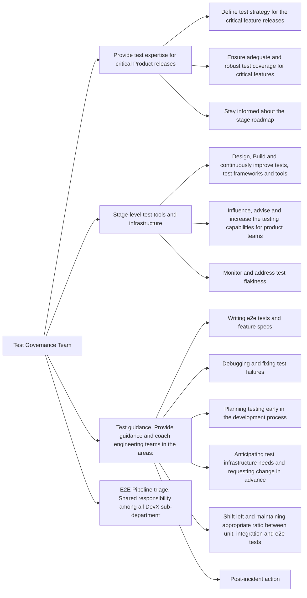

## Common Links

| **Category**            | **Handle**                                                                                      |
|-------------------------|-------------------------------------------------------------------------------------------------|
| **GitLab Group Handle** | [`@gl-dx/test-governance`](https://gitlab.com/gl-dx/test-governance)                            |
| **Slack Channel**       | [`#g_test-governance`](https://gitlab.enterprise.slack.com/archives/C064M4S0FU5)                |
| **Slack Handle**        | `@dx-development-analytics`                                                                     |
| **Team Boards**         |                                                                                                 |
| **Issue Tracker**       | [`tracker`](https://gitlab.com/groups/gitlab-org/developer-experience/test-governance/-/issues) |
| **GitLab Repositories** | [test-governance](https://gitlab.com/gitlab-org/developer-experience/test-governance)           |

## Mission

## Vision

## Team members



## Core Responsibilities

## Roadmap

## How we work

### Work related rituals

### Work management

#### Planning

#### Working with us through support requests

The Test Governance group aims to better enable teams to apply the principle that [quality is everyone's responsibility](/handbook/engineering/development/principles/#quality).

To that aim, we have been working to make it easier to contribute to E2E test development, and we want to begin gradually transitioning product teams to own E2E tests. During and after the transition, the Test Governance team will act more as coaches, helping to provide the platform that enables effective testing among the team.

Below is a general template that teams can use to get started on this transition process.

Teams should feel encouraged to tailor this process to what works best for them. Like everything we do at GitLab, this is an iterative process, and we always welcome feedback for improvement.

#### Transition Process

1. Engineering Manager (EM) or Product Manager (PM) creates an issue to request support from a team member for a new `~priority::1` project, and tags the Test Governance manager and respective engineers for that stage.
2. An engineer is assigned to the project for coaching and developer experience needs.
3. Engineer reviews project requirements and creates a test planning issue to collaborate with EM, PM, UX and the engineers who will be DRIs for the project to define new test cases and determine where existing tests need to be updated.
    * With [Defining a criteria on when to write E2E tests](https://gitlab.com/gitlab-org/developer-experience/test-governance/team-tasks/-/issues/2359), we will be reinventing the way we think about E2E test coverage. While the full details are still being decided, below are a few ways teams can get started with this new approach:
        * Engage with key DRIs listed above to define [persona](/handbook/product/personas) use cases, with the goal of illustrating how different customers will use these new features.
        * Keeping the entire [testing pyramid](https://docs.gitlab.com/ee/development/testing_guide/testing_levels.html) in mind, evaluate which parts of the use cases can be sufficiently covered by lower level tests, and which ones should have coverage in E2E tests.
        * This screenshot illustrates an example of what test coverage for a use case might look like once all tests are implemented:
        * 
4. Engineer evaluates what E2E framework, tooling or infrastructure work (if any) will need to be completed ahead of time, and creates the respective issues.
    * The Test Governance team should collaborate with the Developer Tooling & Development Analytics team for these changes, especially if the scope is large and could affect all E2E tests / frameworks.
    * If the scope of the change is more specific to the features or product area to be tested within the project, the Test Governance team is encouraged to implement these changes.
5. Engineer is assigned to any E2E testing issues, and EM also assigns the appropriate feature engineer(s).
6. The feature engineer can reach out to this engineer as their coaching buddy for pairings, questions and reviews while they develop / update the E2E tests.
7. If there is a change mid-project in implementation or direction that would affect the previously planned E2E test changes, it is the responsibility of the developer to update the test issues and notify the Engineer to keep them in the loop.
8. After E2E test(s) are merged, if a test failure is encountered within a merge request, it is the responsibility of the author to investigate. If an SET creates or is assigned to a failure issue from a scheduled pipeline, the SET will also assign the issue to the relevant developer. The SET can then help guide the developer through troubleshooting and supporting them with test maintenance.
