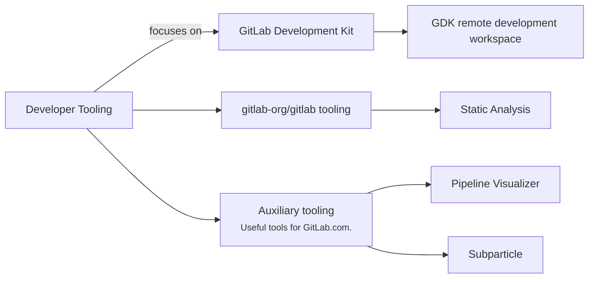

## Mission

- Build state-of-the-art developer tools that are efficient and reliable, empowering developers to keep their development environments up-to-date painlessly.
- Enable contributors to contribute to our tools.
- Measure what matters: improvements in developer experience, efficiency, and toil reduction, using both quantitative and qualitative metrics.

## Vision

The Developer Tooling team's vision is to create tools that enable GitLab team members and the wider community to contribute to GitLab efficiently, without the friction and manual toil that often come with working on large, complex software projects like GitLab.

## Areas of responsibilities

## Team structure

### Members

| Team Members                             | Role                                      |
| ---------------------------------------- | ----------------------------------------- |
| [Mohga Gamea](https://gitlab.com/mgamea) | Engineering Manager                       |
|     | Backend Engineer, Developer Tooling       |
|    | Backend Engineer, Developer Tooling       |
|        | Frontend Engineer, Developer Tooling      |
|    | Staff Backend Engineer, Developer Tooling |

### Stable counterpart

| Person                               | Role                                                                                                                       |
| ------------------------------------ | -------------------------------------------------------------------------------------------------------------------------- |
|  | [GDK Project Stable Counterpart](/handbook/engineering/infrastructure/engineering-productivity/gdk/), Application Security |

## OKRs

Objectives and Key Results (OKRs) help align our sub-department towards what really matters. These happen quarterly and are based on company OKRs. We follow the OKR process defined [here](/handbook/company/okrs/#okr-process-at-gitlab).

Here is an [overview](https://gitlab.com/gitlab-com/gitlab-OKRs/-/issues/?sort=created_date&state=opened&type%5B%5D=objective&label_name%5B%5D=team%3A%3ADeveloper%20Tooling&first_page_size=100) of our current OKRs.

## Communication

| Description            | Link                                                                                                           |
| ---------------------- |----------------------------------------------------------------------------------------------------------------|
| **GitLab Team Handle** | [`@gl-dx/developer-tooling`](https://gitlab.com/gl-dx/developer-tooling)                                       |
| **Slack Channel**      | [`#g_developer_tooling`](https://gitlab.enterprise.slack.com/archives/C07UW7F3FL2)                             |
| **Team Boards**        | [Team Board](https://gitlab.com/groups/gitlab-org/-/boards/8974136?label_name[]=team%3A%3ADeveloper%20Tooling) |
| **Issue Tracker**      | [`gitlab-org/dx/tooling/team`](https://gitlab.com/gitlab-org/quality/tooling/team/-/issues/)                   |
