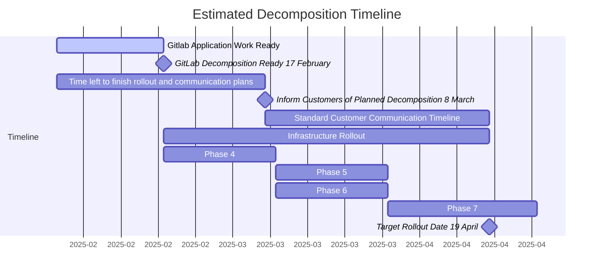

## Attributes

| Property        | Value           |
|-----------------|-----------------|
| Date Created    | 1 May 2024 |
| Start Date      | 13 May 2024 |
| End Date        |  |
| Slack           | [#wg_sec-database-decomposition](https://gitlab.slack.com/archives/C01NB475VDF) (only accessible from within the company) |
| Google Doc      | [Working Group Agenda](https://docs.google.com/document/d/16JxSsh7AleszlsXU8h0Xevk5nZ-if7YJtRPjpwgqhn4/edit) (only accessible from within the company) |
| Issue Board     | [Epic Dashboard list](https://epic-dashboard-gitlab-org-tenant-scale-group-4aecf10d1d02154641.gitlab.io/epic_13043#only-open) |
| Meeting Cadence | Weekly on Mondays. Recorded. EMEA and APAC options. |

### Exit Criteria

The charter of this working group is to:

- Successfully decompose the Sec datasets to a separate `gitlab_sec` database in order to reduce pressure on the primary GitLab.com DB and assist in future scalability and stability concerns.
- Consider the timing, scope, and impact of the decomposition related to prioritization and implementation of additional efforts to support GitLab.com db performance and optimization for related tables - [OKR](https://gitlab.com/gitlab-com/gitlab-OKRs/-/work_items/7863) (GitLab internal)
- Evaluate the impact of the decomposition on Self-Managed instances regarding feature parity, performance/hardware requirement, improvements for different size of DBs, and admin's effort to support.

Support for decomposition in Self-managed or Dedicated is not in scope for this working group.

### Objectives

Key results we'd like to achieve within the scope of the working group to ensure the outcome has the most desireable outcome.

| Objective  | Notes | Achieved On |
| --- | --- | --- |
| To the best of our ability, ensure implementation does not result in increased costs or burden for self-managed users, similar to the CI decomposition outcome. | |  |
| Modifications have been signed off on by Reference Architecture and appropriately documented.  | Raise an issue in the Reference Architecture tracker to gather needed advice on an ad hoc basis. | |
| Minimise disruption to GitLab.com in the process of decomposition. | This may be unavoidable if we opt to use Phsyical Replication, which will require all traffic to the database to be ceased prior to cutover. | |

### Glossary

| Preferred Term | What Do We Mean | Terms Not To Use | Examples |
|----------------|-----------------|------------------|----------|
| Cluster | A database cluster is a collection of interconnected database instances that replicate data. | | The PostgreSQL cluster of GitLab.com (managed by Patroni) that hosts the main logical database and consists of the primary database instance along with its read-only replicas. |
| Decomposition | Feature-owned database tables are on many logical databases on multiple database instances. In terms of GitLab.com, our desired decomposition outcome includes the separation of these instance to different database servers as well. The application manages various operations (ID generation, rebalancing etc.) | Y-Axis, Vertical Sharding | All Sec tables in separate logical database from Core tables. [Design illustration](https://gitlab.com/groups/gitlab-org/-/epics/5883#design-overview) |
| Instance | A database instance is comprised of related processes running in the database server. Each instance runs its own set of database processes. | Physical Database | |
| Logical database  | A logical database groups database objects logically, like schemas and tables. It is available within a database instance and independent of other logical databases. | Database | GitLab's rails database.  |
| Node | Equivalent to a Database Server in the context of this working group. | Physical Database | |
| Replication    | Replication of data with no bias. | X-Axis, Cloning | What we do with our database clusters to enable splitting read traffic apart from write traffic.|
| WAL (Write Ahead Log) | Write ahead logs are the mechanism by which Postgres records inserted data. WAL records are then processed to modify the stored dataset in a separate process. These logs can be replicated.  | | |
| Logical Replication | Replication of data using the built-in Postgres replication processes to transfer WAL via a PUB-SUB model | | |
| Physical Replication | Replication of data by copying the actual files on the written disk to a new Phsyical Database.| | |
| Application Replication | Replication of data to a separate database by the configuration of replication routines in GitLab itself. | | |
| DB Schema | A SQL database schema is a namespace that contains named database objects such as tables, views, indexes, data types, functions, stored procedures and operators, [see docs](https://www.postgresql.org/docs/current/ddl-schemas.html) | | |
| GitLab DB Schema | An application-level table classification schema that abstracts away the underlying database connection, [see docs](https://docs.gitlab.com/ee/development/database/multiple_databases.html#gitlab-schema) | | |
| Server | A database server is a physical or virtual system running an operating system that is running one or more database instances. | Physical Database | |
| Table | A database table is a collection of tuples having a common data structure (the same number of attributes, in the same order, having the same name and type per position) ([source](https://www.postgresql.org/docs/13/glossary.html#GLOSSARY-TABLE)) | | |
| Table Partitioning | A table that contains a part of the data of a partitioned table (horizontal slice). ([source](https://www.postgresql.org/docs/12/ddl-partitioning.html))| Partition | |
| Dataset | A set of tables and their contained data that is contained within a logical database. | | The Sec Dataset includes all tables related to GitLab's security features, including but not limited to vulnerability and dependency tracking. |
| Featureset | A set of features associated with some kind of concept within GitLab for ease of reference. | | Core, Sec |
| Core | Referred to in terms of Dataset or Featureset, this is information of functionality related to standard GitLab operations, such as Projects, Namespaces, Users and others.  | | |
| Sec | Referred to in terms of Dataset or Featureset, this is information of functionality related to standard GitLab operations, such as Vulnerabilities, Dependencies (SBOM), Security Findings, Policies and more. | | |

### Overview

There is high impetus within GitLab to reduce pressure on the primary GitLab database server. The Database and Scalability teams have been taking a variety of steps to mitigate the ongoing pressure on the database server to maintain the growth and stability of GitLab in the long term. One such endeavour is Cells, however, there is desire to provide further mitigation in the short to medium term. Decomposition of the Sec dataset from the primary database was identified as a strong possible solution, similar to how the CI decomposition aided in this regard in the past.

Decomposition of the Sec dataset is a significant engineering effort due to the magnitude of the data interactions related to these features. The domain accounts for 25% of all database write traffic, and is only set to grow as we expand our feature set and grow our customer base. Further statistics and technical details can be found on the associated [epic](https://gitlab.com/groups/gitlab-org/-/epics/13043).

As this has become a scalability and stability concern for all of GitLab.com, as well as significantly constraining the ability of the Stages in the Sec section to implement new features due to continuously growing performance concerns, it is necessary to form an organised effort to effectively achieve this project.

We have the benefit of being able to lean heavily on the prior art and experience of the database-scalability working group who decomposed the CI database to achieve this goal. However, some key challenges we may face is the scale of the existing Sec codebase, and the need to maintain ongoing operations with (no/minimal) disruption to our customer base. A full GitLab.com downtime is heavily disfavoured due to our uptime SLA agreements with customers, but the scale of our operations may mean that some processes for this kind of decomposition may not be feasible.

### Benefits

1. Reduce write pressure on the GitLab.com primary Write database in advance of Cells 1.5
2. Improve stability of GitLab operations, by isolating the primary database from Sec feature pressure
3. General performance improvement for both the Core and Sec feature sets due to seperation of concerns.
4. Improve iteration speed of Sec feature development without significant concern for compromising stability of the platform.

### Risks

1. Significant developer commitment for a currently unknown duration.
2. Increased database maintenance requirement for the new decomposed database and it's associated replicas.
3. Possibly unable to be delivered prior to the delivery of Cells 2.0
4. May require a full downtime of GitLab.com, which may be difficult to arrange with our customers.

### Interdependencies

Sec Data has a high degree of integration with CI and standard GitLab data, such as Users, Projects and Namespaces. The past CI decomposition has succesfully delinked query interdependency of the associated CI dataset, however, significant effort will be necessary to do the same between the core GitLab dataset and Sec functionality.

### Timeline

The group has determined that a gradual rollout is not advisable since it doesn't relieve pressure
on the main database cluster, and increases the amount of work to be done. As such, all slices will
be rolled-out simultaneously to gitlab.com.

#### Progress

[Source](https://gitlab.com/groups/gitlab-org/-/epics/14165#note_2351215673).

##### Decomposition

| Slice              | % Done | Estimated completion |
| ---                | ---    | ---                  |
| [Slice 1](https://gitlab.com/groups/gitlab-org/-/epics/14116?force_legacy_view=true) | 100% | Complete |
| [Slice 2](https://gitlab.com/groups/gitlab-org/-/epics/14196?force_legacy_view=true) | 100% | Complete |
| [Slice 3](https://gitlab.com/groups/gitlab-org/-/epics/14197?force_legacy_view=true) | 100% | Complete |
| [Non-slice work](https://gitlab.com/groups/gitlab-org/-/epics/13043?force_legacy_view=true) | 97% | 2025-02 |

Last update: [2025-02-18](https://gitlab.com/groups/gitlab-org/-/epics/14165#note_2351215673).

### Plan

1. Introduce separate `gitlab_sec` schema
1. Introduce `gitlab_sec` database connection (defaulting to fallback to using `gitlab_main` database)
1. In parallel, begin decomposition of foreign keys and cross-database transactions following the loose order of SBOM, Security, and Vulnerability code boundaries. For each slice perform the following breakdown:
    1. Migrate tables with low referentiality (few foreign keys)
    1. Migrate tables with higher referentiality (many foreign keys)
    1. Identify and [allowlist cross-joins](https://docs.gitlab.com/ee/development/database/multiple_databases.html#allowlist-for-existing-cross-database-foreign-keys) to be addressed
    1. Identify and allowlist cross-database transactions to be addressed
    1. Remove previously identified cross-joins and cross-database transactions allowances
1. Formulate a logical replication path for the safe migration of the Sec dataset to a new physical database.
1. Open Change Request to migrate tables using a single replication event for all tables in scope of decomposition

#### Data Migration Proposal

See [rollout for full details](https://gitlab.com/groups/gitlab-org/-/epics/15236)

1. With physical-to-logical replication we replicate the full DB before converting to logical replication for the relevant sec tables
    1. Deploy the decomposed database instance as a streaming replica of main
    1. Begin replicating the full Sec data to the new database instance
    1. Establish a separate sec DB connection pointed at the same main DB
    1. Write the necessary code to enable GitLab.com to begin utilising the new DB connection generically and for all Sec features.
    1. As this is a potentially risky operation, ensure production snapshots are ready and that customers are sufficiently informed of potential problems or dataloss in the event of failure.
    1. Begin testing transition of the Sec featureset to using the new database instance as it's new primary (gstg -> canary -> grpd)
    1. If successful, globally rollout usage of the decomposed database for the full featureset.
2. Truncate legacy sec tables from the GitLab main database.

## Roles and Responsibilities

| Working Group Role                   | Name              | Title |
| -----------                          | -----------       | ----------- |
| Executive Stakeholder                | Jerome Ng         | Engineering Director, Expansion |
| Functional Lead                      | Gregory Havenga   | Senior Backend Engineer, Govern: Threat Insights  |
| Functional Lead                      | Lucas Charles     | Principal Software Engineer, Sec |
| Facilitator AMER                     | Neil McCorrison   | Manager, Software Engineering |
| Facilitator APAC                     | Thiago Figueiró   | Manager, Software Engineering |
| Member                               | Fabien Catteau    | Staff Engineer, SSCS: Pipeline Security |
| Member                               | Arpit Gogia       | Backend Engineer, AST: Dynamic Analysis |
| Member                               | Schmil Monderer   | Staff Backend Engineer, APM: Threat Insights |
| Member                               | Ethan Urie        | Staff Backend Engineer, AST: Secret Detection |
| Member                               | Jon Jenkins       | Senior Backend Engineer, Database |
| Member                               | Ved Prakash       | Staff Data Engineer, Data Science|
| Member                               | Dylan Griffith    | Principal Engineer, Create |
| Member                               | Thong Kuah        | Principal Engineer, Data Stores |
| Member                               | Rick Mar          | Manager, Core Infrastructure |

### Related Performance Projects

1. [Tuple Reduction](https://gitlab.com/groups/gitlab-org/-/epics/13616)
   - Brian Williams (DRI)
   - Fabien Catteau
   - Michael Becker
1. [Vulnerability Management Application Limits](https://gitlab.com/groups/gitlab-org/-/epics/13571) and [Vulnerability Management Retention Policy](https://gitlab.com/groups/gitlab-org/-/epics/12229)
   - Mehmet Emin Inaç (DRI)
   - Joey Khabie
1. [Cells 1.0](https://gitlab.com/groups/gitlab-org/-/epics/13087)
   - Subashis Chakraborty (DRI)

## Useful References

| Reference | Description |
| ---       | ---         |
| [Link](https://gitlab.com/gitlab-org/omnibus-gitlab/-/blob/master/doc/architecture/multiple_database_support/_index.md) | Proposal for support levels for multiple databases in GitLab deployment architecture.  |
| [Link](https://epic-dashboard-gitlab-org-tenant-scale-group-4aecf10d1d02154641.gitlab.io/epic_13043) | Epic dashboard for tracking outstanding work towards completion of decomposition |

## Thanks

Much information and inspiration and experience is being enjoyed from the database-scalability working group who accomplished the succesful decomposition of the CI database.
