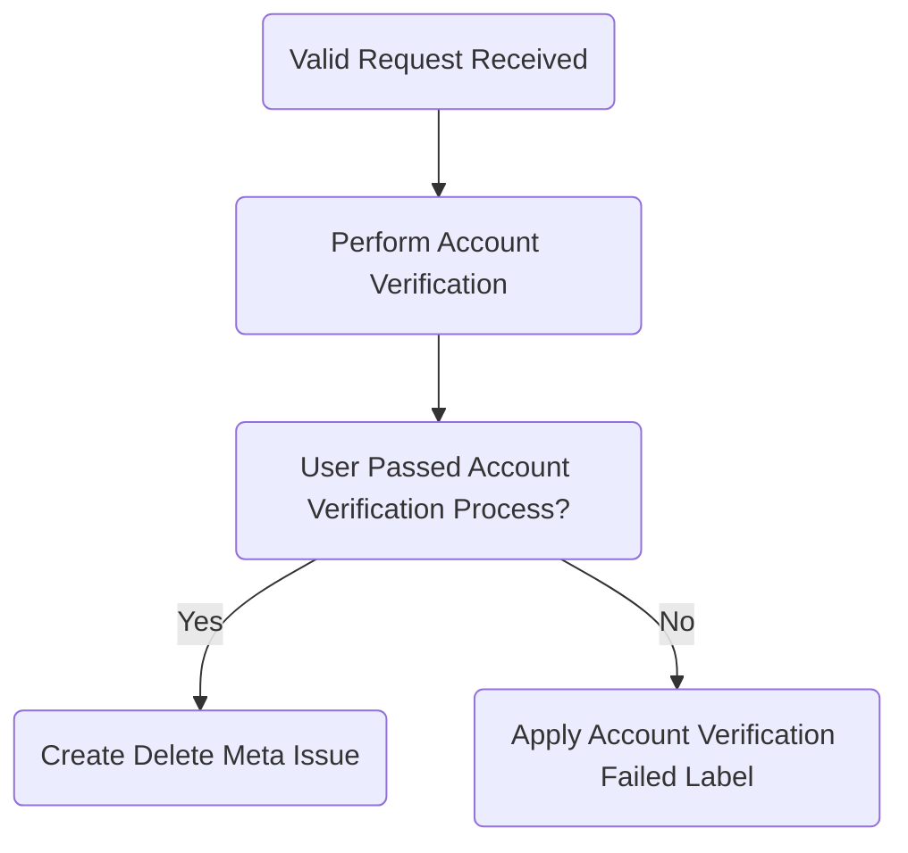

## Overview

This document contains instructions on how to process each type of Account Deletion or Data Access request. It is split into two stages; **Submission Handling** and **Request Processing**, to be followed in that order. Each request will go through the same flow from opening to completion that is outlined in the chart below. **All requests must be fulfilled within 30 calendar days.**



## **Stage 1:** Submission Handling

We are only able to process Account Deletion and Data Access requests if they are submitted through the official [Personal Data Request form](https://support.gitlab.io/account-deletion/). If a request is received via any other method, we will close it and direct the user to open a request through the form.

When a user submits a request through the form, an issue is [automatically created](/handbook/support/readiness/operations/docs/gitlab/account_deletions.md) in the [Personal Account Requests Service Desk](https://gitlab.com/gitlab-com/gdpr-request/-/issues/service_desk), *even for invalid requests*. Comments made in the issue will be emailed to the user. You will communicate with the user through the issue on the progress of their request.

The purpose of this stage is to instruct you on how to close out invalid requests.

### Zendesk Submissions

When a request is received through Zendesk as a support ticket, do one the following:

- If the ticket is regarding an **Account Deletion** request, apply the [Support::SaaS::Gitlab.com::Account Deletion Instructions - GitLab.com](https://gitlab.com/gitlab-com/support/zendesk-global/macros/-/blob/master/active/Support/SaaS/GitLab.com/Account%20Deletion%20Instructions-%20GitLab.com.md?ref_type=heads) macro, and mark the ticket as solved.

- If the ticket is regarding a **Data Access** request, apply the [General::Personal Data Access Request Instructions](https://gitlab.com/search?search=6147154241180&nav_source=navbar&project_id=17008590&group_id=15990755&search_code=true&repository_ref=master) macro, and mark the ticket as solved.

- If the ticket is regarding a combination of both, use a variation of both macros above, and mark the ticket as solved.

### Direct Email Submissions

If a request to the [Personal Account Requests Service Desk](https://gitlab.com/gitlab-com/gdpr-request/-/issues/service_desk) is submitted directly via email, add the `account-deletion::invalid` label, add a comment to the issue with the snippet below, then close the issue.

<details>
  <summary markdown="span">Request Closed - Request Submitted Directly</summary>

  <p>Greetings,</p>

  <p>It looks like you've emailed this request in to us directly. In order for us to best assist you please re-submit this request via our [Personal Data Request form](https://support.gitlab.io/account-deletion/). Doing so will allow us to process your request more quickly and efficiently. This request will now be closed. We eagerly await your resubmission. Thank you!</p>

  <p>Regards,</p>
</details>

**NOTE:** Requests sent in through the official form will include a copy of the form entries in the initial description of the issue.

### Spam Submissions

If the request submitted is spam, apply the label `Invalid Request::Spam`, then close the issue.

### Duplicate Form Submissions

If a user has submitted multiple requests via the form, apply the `/duplicate` quick action to the duplicate issues, and respond with the following before closing the duplicates:

<details>
 <summary markdown="span">Request Closed - Duplicate </summary>

 <p>Greetings,</p>

 <p>It looks like you have submitted multiple requests for the same purpose. </p>

 <p>I'm closing this issue in favor of #123, and we will continue processing your request on the other issue.</p>

 <p>Regards,</p>
</details>

## **Stage 2:** Request Processing

Find the appropriate workflow below to process requests submitted to our [Personal Account Requests Service Desk](https://gitlab.com/gitlab-com/gdpr-request/-/issues/service_desk), based on their request type.

- [Deletion Requests](#deletion-requests)
- [Data Access Requests](#data-access-requests)
- [Data Export (Right to Portability)](#data-export-requests-right-to-portability)
- [General Questions](#general-questions)

As a reminder, before processing a request you should make sure that you have already [Streamlined Your Workflow](/handbook/support/workflows/personal_data_access_account_deletion#streamlining-your-workflow) to make requests easier to process.

### **Deletion Requests**

The following are the types of requests that a user can file. Click the link for each to jump to the associated workflow for processing that request.

- [GitLab.com Account Deletion](#gitlabcom-account-deletion-and-full-deletion) (delete the GitLab.com account only)
- [GitLab.com Account Deletion - Deceased User](#gitlabcom-account-deletion---deceased-user) (delete users data that belongs to deceased owner)
- [Portal Account Deletion](#portal-account-deletion) (delete data in customers.gitlab.com only)
- [Full Deletion](#gitlabcom-account-deletion-and-full-deletion) (delete everything across all systems)
- [Marketing or Sales Account Deletion](#marketing-or-sales-account-deletion) (delete marketing and sales-related data only)

Currently, only **GitLab.com Account Deletion** or **Full Deletion** requests are auto-checked upon form submission.

#### **GitLab.com Account Deletion and Full Deletion**

This workflow applies to both **GitLab.com Account Deletion** and **Full Deletion** requests. When a request is submitted for either of these types, the following form entries are verified using [built-in automated checks](/handbook/support/readiness/operations/docs/gitlab/account_deletions.md):

- Username (must exist)
- Email address (must exist)
- Username and email must match for the same account
- Account is not part of a paid namespace
- User checked the box confirming their intent to delete (deletion requests only)

After submission, the automated checks will either fail or succeed.

```plain
You Should Know:

If any of the automated checks fail, the user will receive an auto-generated response detailing the reason we are unable to process their request. The issue created will be marked as invalid with "Invalid Request Received" noted in the title. These issues are scheduled to automatically close, and the label "account-deletion::invalid" will be applied. No action is required.
```

##### **Step 1:** Await Challenges

If all of the automated checks succeed, the user will receive a set of [Verification Challenge questions](https://internal.gitlab.com/handbook/support/#account-verification-challenge-questions) in an auto-generated response. Users have a total of **7 calendar days** to respond to the challenge questions.

At this stage, do the following:

1. If the account in question is a `FREE` account, add the `account-deletion::personal` label to the issue. If the account is tied to a paid namespace with a signed contract in Salesforce (a corporate request), add the `account-deletion::corporate` label to the issue.
1. Add the `Awaiting::Challenge Answers` label and wait for the user to reply with the answers to the questions. If they do not reply within **7** calendar days, proceed to [No Response](#no-response). If they do reply within 7 calendar days, proceed to [**Step 2:** Evaluate](#step-2-evaluate).

###### No Response

If the user fails to respond within 7 calendar days, close it using the following snippet (note the 2 labels that are set: `Account Verification Failed` and `deletion request::denied`):

<details>
  <summary markdown="span">Request Closed - No Response</summary>

  <p>Greetings,</p>

  <p>We have not heard back from you with responses to our verification challenge questions, which are required in order to verify your identity before we process your request. We will now close this request. If you still wish to proceed please feel free to submit a new request via our [Personal Data Request Form](https://support.gitlab.io/account-deletion/).</p>

  <p>Regards,</p>

  `/label ~"Account Verification Failed" ~"deletion request::denied"`
</details>

##### **Step 1.5:** Blocked or Banned Accounts

If the user account is not blocked or banned, skip this section.

If the user is blocked due to a user deleting their own account (see the admin note on the account):

<details>
  <summary markdown="span">Account Blocked - User initiated account deletion</summary>

  <p>Greetings,</p>

  <p>As an account deletion has been initiated, the account stays in a blocked state for 7 days until it is permanently deleted. New accounts with the same email address or username cannot be created during that time.</p>

  <p>You will need to wait 7 days, starting the day of the deletion request, to create a new account with the same email address or username.</p>

  <p>Regards,</p>
</details>

For all other blocked or banned reasons, proceed to [step 2](#step-2-evaluate) first.

##### **Step 2:** Evaluate

Evaluate the answers to the challenge questions that the user has provided using the [Account Verification](/handbook/support/workflows/account_verification#evaluating-challenge-answers) workflow with a data classification of `RED` along with the [Risk Factor](https://internal.gitlab.com/handbook/support/#risk-factors-for-account-ownership-verification) (GitLab internal) for data and privacy requests to confirm if the verification passes or fails.

- If the verification passes, proceed to [**Step 3:** Create Meta Issue](#step-3-create-meta-issue).

- If the verification passes, but the account is blocked/banned, proceed to [**Step 2.5:** Verification Passed - Unblock User](#step-25-verification-passed---unblock-user).

- If the verification fails and the user **is not** the sole owner of the groups and projects in their account, proceed to [Verification Failed](#verification-failed).

- If the verification fails and the user **is** the sole owner of the groups and projects on their account, proceed to [Verification Failed (Sole Owner Exception)](#verification-failed---sole-owner-exception).

###### Verification Failed

If the user fails the challenge questions, apply the `Account Verification Failed` and `deletion request::denied` labels, and respond with the following snippet before closing the issue:

<details>
  <summary markdown="span">Request Closed - Verification Failed</summary>

  <p>Greetings,</p>

  <p>Unfortunately, the answers to our verification challenges have failed. As a result, we are unable to process your account deletion request. This issue will be closed.</p>

  <p>Regards,</p>

  `/label ~"Account Verification Failed" ~"deletion request::denied"`
</details>

###### Verification Failed - Sole Owner Exception

If the user fails the challenge questions, but they are the sole owner of groups and projects, we can consider approval for an exception by working through the following:

1. Validate that the user is the **only** owner of any top-level groups and that any projects associated with their account are in their personal namespace.
1. Check that the user has not logged in for at least 1 year.
1. Check that the projects and groups owned by the user have not been updated in at least 1 year.
1. Reach out to the [#privacy-team_help](https://gitlab.slack.com/archives/C04357HVCJD) Slack channel to engage a Support Manager and Privacy for review and approval (approver will add `Deletion Request::Exception Approved` to the issue if approved).
1. Proceed with the deletion process.

**Note:** If a situation requires further review, and falls outside of the above criteria for a sole owner, please reach out to the [#privacy-team_help](https://gitlab.slack.com/archives/C04357HVCJD) Slack channel to discuss approving an exception with a Support Manager and the Privacy team.

If the above conditions are not met, respond with the following before closing the issue:

<details>
  <summary markdown="span">Request Closed - Verification Failed</summary>

  <p>Greetings,</p>

  <p>Unfortunately, the answers to our verification challenges have failed, and your account appears to have had recent activity within the last year. As a result, we are unable to process your account deletion request at this time. This issue will be closed, however you may try your request again at a later date.</p>

  <p>Regards,</p>
</details>

##### **Step 2.5:** Verification Passed - Unblock user

1. Ensure that the user has passed the challenge questions and has been properly evaluated.
1. Proceed to follow the [reinstating a blocked account workflow](). Generally, this means opening a Trust and Safety issue for evaluation.
1. Reply to the user to let them know.

<details>
  <summary markdown="span">Account Blocked - For Security review</summary>

  <p>Greetings,</p>

  <p>The account which you have submitted a request for is blocked. We have submitted a request for our Security team to review. Once they have reviewed, we will provide you with an update.</p>

  <p>Regards,</p>
</details>

If the account is unblocked or unbanned, let the user know, then follow the rest of the process as normal. If needed, include other information about the verification process in the next reply.

<details>
  <summary markdown="span">Account Unblocked by Security</summary>

  <p>Greetings,</p>

  <p>Our security team has unblocked the account. We are proceeding with the request.</p>

  <p>Regards,</p>
</details>

If the account stays blocked or banned, apply the `Account Verification Failed` and `deletion request::denied` labels to the issue, and close it with the following:

<details>
  <summary markdown="span">Request Closed - Account Blocked by Security</summary>

  <p>Greetings,</p>

  <p>At this time, we cannot delete your account because your data must be retained in order for us to comply with our legal obligations, such as protecting against illegal or fraudulent activities; infringement of IP rights; distribution of harmful or offensive content; violations of the security or integrity of a computer or network.</p>

  <p>Regards,</p>
</details>

##### **Step 3:** Create Meta Issue

Proceed with processing the request by doing the following:

1. Let the customer know they have been verified and that you are initiating the deletion process by leaving a comment on the issue with the following snippet. Take care to replace `TYPE_OF_REQUEST` with the appropriate type of request.

<details>
  <summary markdown="span">Verification Succeeded - Deletion Process Started</summary>

  <p>Greetings,</p>

  <p>Thank you for stepping through the process with us and verifying your account ownership. We have now started the process to fulfill your TYPE_OF_REQUEST request. Please note that it takes up to 30 days for the request to be processed as it's handled by different teams.</p>

  <p>I will let you know once the deletion process is complete.</p>

  <p>Regards,</p>
</details>

1. Create a new **confidential** issue in the [Personal Account Requests Service Desk](https://gitlab.com/gitlab-com/gdpr-request/-/issues/new) using one of the following templates, depending on the request type, and populate the issue title with the email address of the original request:

   - [Deletion Meta Issue - Full](https://gitlab.com/gitlab-com/gdpr-request/-/issues/new?issuable_template=Deletion%20Meta%20Issue%20-%20Full) for **Full Deletion** requests.

   - [Deletion Meta Issue - GitLab-com](https://gitlab.com/gitlab-com/gdpr-request/-/issues/new?issuable_template=Deletion%20Meta%20Issue%20-%20GitLab-com) for **GitLab.com Account Deletion** requests.

1. Follow the instructions in the top of the template, then complete each step in the issue that begins with `Support Engineer:` in order.

#### **GitLab.com Account Deletion - Deceased User**

Use this workflow for requests to delete user data where the sole owner of that data is deceased. No automated checks will take place with this request type.

The requestor will receive an initial reply with a set of verification challenges and documents to provide in an auto-generated response. The requester will have 10 calendar days to provide the requested information when the request was initially made. Once they have responded with the details, follow the steps below.

IMPORTANT NOTE: If at any point you are unsure of next steps or have any questions or concerns about the information in which the requester has provided, please reach out to the [#privacy-team_help](https://gitlab.slack.com/archives/C04357HVCJD) Slack channel for help.

1. Add the `Awaiting::Challenge Answers` label, and wait for the requestor to reply.
   1. If no response is received after 10 calendar days, apply the `Account Verification Failed` and `deletion request::denied` labels to the issue, and close it using the following snippet:

<details>
  <summary markdown="span">Request Closed - No Response (Account Deletion - Deceased User) </summary>

  <p>Greetings,</p>

   <p>We have not heard back from you with responses to our verification questions or the required documentation, which are needed in order to process your request. We will now close this request. If you still wish to proceed please feel free to submit a new request via our Personal Data Request Form.</p>

   <p>Regards,</p>
</details>

1. Notify [#privacy-team_help](https://gitlab.slack.com/archives/C04357HVCJD) of the request so that they can begin review of the evidence provided by the requester proving their authority to act on behalf of the deceased account owner.
1. If the user has access to the account and provided answers to the [Verification Challenge questions](https://internal.gitlab.com/handbook/support/#account-verification-challenge-questions), then [evaluate answers](/handbook/support/workflows/account_deletion_access_request_workflows#step-2-evaluate) for verification.
   1. If the user fails verification, please reach out to the [#privacy-team_help](https://gitlab.slack.com/archives/C04357HVCJD) Slack channel for further direction.
   1. If the requester fails the challenge questions, and you get instruction from #privacy-team-help to proceed to verification fail, apply the `Account Verification Failed` and `deletion request::denied` labels, and respond with the following snipped before closing the issue:

<details>
<summary markdown="span">Request Closed - Failed Verification</summary>

<p>Greetings,</p>

<p>Unfortunately, the answers to our verification challenges have failed. We are required to obtain satisfactory documentation evidencing your authority to act on behalf of a deceased account owner and to obtain some minimum information to locate the account in our system. As a result, we are unable to process your account deletion request. This issue will be closed.</p>

<p>Regards,</p>

</details>

1. If the requester passes the challenge questions, or #privacy-team-help has provided instruction to continue with this request:
   1. comment on [the gitlab#330669 feature request](https://gitlab.com/gitlab-org/gitlab/-/issues/330669) to note that we're having to manually process a relevant request.
   1. let the requester know they have been verified and that you are initiating the deletion process by leaving a comment on the issue with the following snippet.

<details>
<summary markdown="span">Request Closed - Verification Pass</summary>
 <p>Greetings,</p>

 <p>Thank you for stepping through the process with us and verifying your authority to act on behalf of the deceased account owner. We have now started the process to fulfill your deletion request. Please note that it takes up to 30 days for the request to be processed. I will let you know once the deletion process is complete.</p>

 <p>Regards,</p>

</details>

1. Create a new confidential issue using the [Deletion Meta Issue - Deceased.md](https://gitlab.com/gitlab-com/gdpr-request/-/blob/master/.gitlab/issue_templates/Deletion%20Meta%20Issue%20-%20Deceased.md) template, populating the title with the email address of the original request.
1. Complete each step in the issue that begins with `Support Engineer:` in order.

#### **Portal Account Deletion**

Use this workflow for requests to delete user data from the Portal (customers.gitlab.com).

1. In the [Personal Account Requests Service Desk](https://gitlab.com/gitlab-com/gdpr-request/-/issues/new), create a new confidential issue using the [Deletion Meta Issue - Customers Portal](https://gitlab.com/gitlab-com/gdpr-request/-/issues/new?issuable_template=Deletion%20Meta%20Issue%20-%20Customers%20Portal) template, populating the title with the email address of the original request.
1. **Follow the instructions in the top of the template**, then complete each step in the issue that begins with `Support Engineer:` in order.

#### **Marketing or Sales Account Deletion**

Use this workflow for requests to delete user data from Sales or Marketing systems.

1. In the [Personal Account Requests Service Desk](https://gitlab.com/gitlab-com/gdpr-request/-/issues/new), create a new confidential issue using the [Deletion Meta Issue - Marketing](https://gitlab.com/gitlab-com/gdpr-request/-/issues/new?issuable_template=Deletion%20Meta%20Issue%20-%20Marketing) template, populating the title with the email address of the original request.
1. **Follow the instructions in the top of the template**, then complete each step in the issue that begins with `Support Engineer:` in order.

### **Data Access Requests**

Users can request the following to obtain information about their data. Use this workflow for requests to access full details about what data we have on the user.

- Data Access Request (provide all data from all systems GitLab has related to the user)
- General Questions (any other inquiries related to the users data)

Use the following workflows based on the type of request submitted.

1. [ ] Support Engineer: Ensure the user has replied from the same email on the request issue. If the user fails to respond within 7 calendar days, close the issue using the following snippet, and apply the `Account Verification Failed` label to the issue:

<details>
  <summary markdown="span">Request Closed - No  Response to Verify Email</summary>

  <p>Greetings,</p>

  <p>We have not heard back from you, which is required in order to validate your email address before we process your request. We will now close this request. If you still wish to proceed please feel free to submit a new request via our [Personal Data Request Form](https://support.gitlab.io/account-deletion/).</p>

  <p>Regards,</p>
</details>

1. Review the requested data by the user. If the requested data is out of scope, apply the `data-access-request::denied` label to the issue:

<details>
  <summary markdown="span">Request Closed - Out of Scope</summary>

  <p>Greetings,</p>

  <p>You've opened a Data Access Request which is used specifically to obtain a copy of any personal data GitLab holds on you. In the course of filing this request, you've asked for data beyond the scope of what can be provided.</p>

  <p>Usage and other out-of-scope account data can be obtained by logging into your GitLab.com account and cannot be provided through a Data Access Request. If you have specific questions about this kind of data, please review your options for support at https://about.gitlab.com/support.</p>

  <p>Regarding this request, we can:</p>

  <ul>
  <li>continue the process and provide a report of all in-scope personal data.</li>
  <li>close this request with no further action.</li>
  </ul>

  <p>Please let us know how you would like to proceed. </p>

  <p>Regards,</p>

</details>

1. In the [Personal Account Requests Service Desk](https://gitlab.com/gitlab-com/gdpr-request/-/issues/new), create a new confidential issue using the [personal_data_access_request](https://gitlab.com/gitlab-com/gdpr-request/-/issues/new?issuable_template=personal_data_access_request) template, populating the title with the email address of the original request.
1. **Follow the instructions in the top of the template**, then complete each step in the issue that begins with `Support Engineer:` in order.

### **Data Export Requests (Right to Portability)**

Use this workflow for data export request submissions. Note that we can only action on this if the request is for personal namespace projects, or projects in groups where the user is the *only* member. You can visit the [#privacy-team_help](https://gitlab.slack.com/archives/C04357HVCJD) Slack channel if you have any questions.

1. The user will receive an auto-response directing them to [the project export steps for self-serve](https://docs.gitlab.com/ee/user/project/settings/import_export.html#export-a-project-and-its-data). Keep this issue opened for 7 days and close after that time if there are no further updates. Apply the `Export Request::self-serve` label.
1. If the user runs into any issues using the self-serve steps, they can reply to the auto-response with more details about the error they are receiving. If they reply *after* the issue has been closed, re-open the issue.
1. Before we continue to assist, we must validate their identity. Manually send the customer the [Verification Challenge questions](https://internal.gitlab.com/handbook/support/#account-verification-challenge-questions) through the issue. Users have a total of **7 calendar days** to respond to the challenge questions.
1. Follow the same steps we use for account deletion requests to validate their account:
    - [Await challenges](/handbook/support/workflows/account_deletion_access_request_workflows#step-1-await-challenges)
    - [Evaluate answers](/handbook/support/workflows/account_deletion_access_request_workflows#step-2-evaluate)
1. Only if the user passes account validation, start the process to get them project exports.
   1. If the user cannot sign in, export project using [the UI](https://docs.gitlab.com/ee/user/project/settings/import_export.html#export-a-project-and-its-data) or [the API](https://docs.gitlab.com/ee/api/project_import_export.html#schedule-an-export).
   1. If there are errors, follow [the project exports workflow](/handbook/support/workflows/importing_projects#project-exports). You can also search ZenDesk for examples of past project export tickets from *paid* customers for additional troubleshooting help and ideas.
1. Upload the project exports to a new folder in the "Personal Data Requests" shared drive. Share the request specific folder with the user and let them know they should download the files within 7 days.
1. After 7 days, unshare the request related folder and ask them to confirm they have the files.
1. Once their issue is resolved, close the issue and apply the `Export Request::complied` label.

**Important Note:** Because we can not deny free users from support to export their data if they run into a problem, we will need to assist them through the issue (not ZenDesk).

### **General Questions**

Use this workflow for general question submissions.

1. If the question is something Support can answer, respond to the user's inquiry.
1. If needed, engage a Support Manager or the Privacy team for guidance and messaging. You can visit the [#privacy-team_help](https://gitlab.slack.com/archives/C04357HVCJD) Slack channel to ask for help.
1. Close the issue once the users question(s) have been answered.

### Escalating to the Privacy Team

While processing a request, certain scenarios may arise that necessitate the escalation of the request to the Privacy team. The most common of these scenarios can be found in the [Privacy Escalation Meta Issue](https://gitlab.com/gitlab-com/gdpr-request/-/blob/master/.gitlab/issue_templates/Privacy%20Escalation%20Meta%20Issue.md) template. If a request needs to be escalated to the Privacy team, do the following:

1. Create a new related issue using the [Privacy Escalation Meta Issue](https://gitlab.com/gitlab-com/gdpr-request/-/blob/master/.gitlab/issue_templates/Privacy%20Escalation%20Meta%20Issue.md) template.

If you're ever unsure if a particular scenario requires escalating, reach out to the Privacy team via the `#privacy-team_help` Slack channel.
