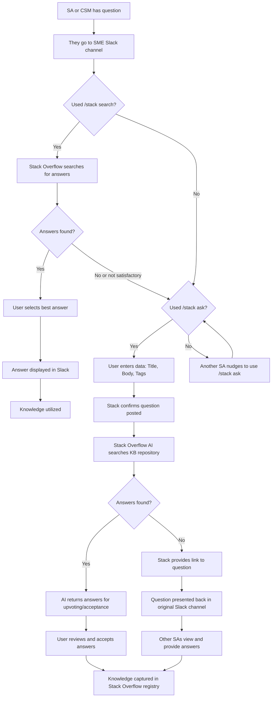

The process to ask a question, provide an answer, write Knowledge Articles/ How to Guides, improving GitLab docs from Stack Overflow content is described here. 

## Asking a Question

Please refer to Stack Overflow training on

- [Slack and Stack Overflow](https://fast.wistia.com/embed/channel/0dp7wdz6v5?wchannelid=0dp7wdz6v5&wmediaid=8enr7931re)
- [Questions and Answers](https://fast.wistia.com/embed/channel/0dp7wdz6v5?wchannelid=0dp7wdz6v5&wmediaid=9am7itotlg)
- [Overflow AI- Auto Answer in Slack](https://fast.wistia.com/embed/channel/0dp7wdz6v5?wchannelid=0dp7wdz6v5&wmediaid=4g33s9kaw2)
- [General User Enablement (Stack)](https://fast.wistia.com/embed/channel/0dp7wdz6v5?wchannelid=0dp7wdz6v5&wmediaid=susdknl5lj)

---

1. Anyone with a question should do so in one of the [SME (Subject Matter Expert) Slack channels](/handbook/solutions-architects/sa-practices/subject-matter-experts/sme-operations/#sme-channels)
1. Use the `/stack ask` prompt to ask a question.
1. If a question was asked without the prompt `/slack ask`, another SA or CSM can nudge them to ask the question in Slack or select the content in Slack and use the Stack Overflow app to create it as a question.
   - TBD: A Slack bot can potentially be executed anything a question was asked, to initiate a `/slack search` and provided answers from Stack under the Slack thread.
1. Stack Overflow prompts the SA or CSM to enter the required data (Title, Body, Tags).
1. Stack confirms the question was posted.
1. Stack Overflow AI searches the Stack Overflow KB repository and returns one or more answers in Slack as a thread to the original question, for upvoting or acceptance by SA.
1. Once an SA or CSM accepts and answer it is displayed in Slack as a thread under the original question.
1. If there is no answer found, Stack Overflow presents a link and the original question in the Slack channel.
1. Other SAs can view the link and provide additional answers in StackOverflow.
1. Knowledge is ultimately captured in your Stack Overflow registry.

---

## Providing an Answer

## Upvoting an Answer

## Writing Knowledge Articles/ How to Guides/ Best Practices {#best-practices-guide}

Please refer to Stack Overflow training on

- [Articles](https://fast.wistia.com/embed/channel/0dp7wdz6v5?wchannelid=0dp7wdz6v5&wmediaid=47gvmszf3o)

---

One of the goals on the [SME Program](/handbook/solutions-architects/sa-practices/subject-matter-experts/), is to enhance the expertise of SAs and CSMs with the provision and creation of architectural blueprints, best practices, knowledge guides.

There are two types of considerations for architectural blueprints and best practices (and only one type is the focus of StackOverflow KB):

1. **Platform Team/ Producer Adoption Considerations**: This is usually the focus of Professional services, and Support Engineers.  They encompass:

   - Deployment Architecture/Integration at Scale
   - Configuration at Scale
   - Deployment/ Migration
   - Ongoing Management/ Administration at Scale
   - Monitoring, Alerts, Audit

   Best Practices around Deployment at Scale: Configuration, Migration, Administration, Monitoring, Break Fix, would most likely be written by and for Support Engineers and would be found in the [Zendesk KB](/handbook/support/knowledge-base/#implementation).

1. **Consumer Adoption/ Maturity Considerations**: This is usually the focus of Customer Success, Solutions Architects and Professional Services.  They encompass:

   - Conceptual Architecture/ Design/ Data Flows
   - Sizing and impact on Deployment Recommendations
   - Onboarding new Users, Business Units, Infra, App at Scale,
   - Manage Adoption at Scale, 
   - Decommission Infra. App, Platform
   - Offboarding Users
   - Value Metrics
   - Monitoring, Observability

   We encourage SMEs, CSEs, PSEs and others to create Best Practices around the above, especially concerning Adoption at Scale in Stack Overflow.

## Creating Collections

Please refer to Stack Overflow training on

- [Collections](https://fast.wistia.com/embed/channel/0dp7wdz6v5?wchannelid=0dp7wdz6v5&wmediaid=5iwkghxben)
- [Onboarding via Collections](https://fast.wistia.com/embed/channel/0dp7wdz6v5?wchannelid=0dp7wdz6v5&wmediaid=asfwdr24im)

---

Think of a collection as a folder than span multiple Tags.

TBD: We would like to use Collections for onboarding SMEs into the various SME Areas.

Suggested Collections (based on appropriate tags) would be around

- Each SME Area: AI, Dedicated, App Sec, Agile Planning, CICD, Metrics & Observation
- Each Vertical: Financials, Embedded DevOps, Telecommunications

## Communities of Practices

Please refer to Stack Overflow training on

- [Communities)](https://fast.wistia.com/embed/channel/0dp7wdz6v5?wchannelid=0dp7wdz6v5&wmediaid=uufpib80x7)

---

Suggested Communities of Practices (based on appropriate tags) should be aligned with Product focuses such as:

- Modernization & Analytics
- AI
- Core DevOps Workflows
- Security & Compliance
- Platforms
- Competitive
- Internal Development Platforms
- Platform Engineering
