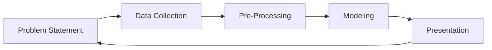

The mission of the Data Analytics team is to **maximize** the impact of business decisions and strategy with data solutions that are trusted and scalable.

We do this by helping all GitLab teams move up the [**Data maturity**](https://internal.gitlab.com/handbook/enterprise-data/direction/#current-data-maturity) **by means of our** [**GitLab values**](/handbook/values/) and our [**Data Team Principles**](/handbook/enterprise-data/organization/principles/).

## Data Analytics Responsibilities

The **Data Analytics Team** is **directly responsible** for:

- Managing and governing the company's Key Performance Indicator definitions, database, and data visualizations
- Providing customizable Data Services, including Data Visualization, Data Modeling, Data Quality, and Data Integration
- Supporting the company's governance, risk, and compliance programs as they relate to Data & Analytics systems

Additionally, the **Data Analytics Team** supports the following responsibilities

- With the **Data Leadership Team**:
  - Defining and publishing a Data Strategy to help maximize the value of GitLab's Data Assets
  - Broadcasting regular updates about data deliverables, ongoing initiatives, and upcoming plans
- With the [**Data Platform Team**](/handbook/enterprise-data/organization/engineering/#data-platform-responsibilities):
  - Building and maintaining the company's central Enterprise Data Warehouse to support Reporting, Analysis, Dimensional Modeling, and Data Development for all GitLab teams
  - Developing Data Management features such as master data, reference data, data quality, data catalog, and data publishing
  - Providing Self-Service Data capabilities to help everyone leverage data and analytics
  - Helping to define and champion Data Quality practices and programs for GitLab data systems

## Handbook First on the Data Analytics Team

At GitLab we are [Handbook First](/handbook/about/handbook-usage/#why-handbook-first) and drive this by:

1. Helping our Business Partners (all GitLab team members) update the handbook with the most up-to-date and accurate information.
1. Reviewing content and ensure that the information in the handbook best represents the data, taking into account data sensitivity and security.
1. Updating the Data Team handbook section
    - with exciting Data Analytics content
        - Examples of upcoming content: `Data Visualization: Tips and Tricks` and `Data Storytelling`
    - to reflect changes in Data Team process or codebase  (and yes we get very excited about better processes and code! Who doesn't!)

---

## What Is Analytics And Why Do We Do It?

**Analytics** is the practice of turning **data** into **information, knowledge, and wisdom** to:

1. **Improve Efficiency & Avoid Costs**
    1. Human Capital - Location Factor, Offer Accept Rate, Cost Per Hire
    1. Finance - ARR, New Pipeline Created, CC Failure Rate
    1. Sales Channel - Win Rate, Services Attach Rate,
    1. Marketing - Opportunities Created, Product Downloads
1. **Improve the Business Model**
    1. Analytics Instrumentation - Sign-up Growth, New Features Delivered, Top Features
    1. Customer Analytics - Firmographics, Adoption Trends, Usage vs. Subscription
    1. Customer Purchasing Trends - Renewals, Upgrades, Downgrades
1. **Improve the Customer Experience**
    1. Data Products - Industry Benchmarks, Data APIs, Algorithms
    1. Data-Informed Process Improvements
    1. In-Product Insights

## Data Analysis Process

Data Analytics, Advanced Data Analytics, and Data Science all start with the `Data Analysis Process`.

The `Data Analysis Process` has five steps:

In Data Analytics, context is everything. It guides the way Data Analyst view the problem, the data, and the methodology taken to generate the data insights.

### Problem Statement

In the `Problem Statement` step, it is crucial that we **define the business problem** with the Business Partner. By clearly defining the business problem that the Business Partner is seeking data insights into, Data Analyst can set success criterias to ensure that the problem is **technically solvable with the data available** and to provide the **maximum business insight** into the problem.

### Data Collection

In the `Data Collection` step, it's important for Data Analyst to explore and understand the **Data Caveats** that may limit the impact or generalization of the analysis as well as to evaluate any **Data Biases** or **Data Concerns**. Understanding how the data is collected in each business system will ensure that we are reporting on accurate data in an appropriate manner. During this step, it's important to ensure that the **Data Types** are accurate for reliable transformations.

Therefore, this step is actually a part of a feedback loop with the source system owners. If a Data Team member finds that a data field is `missing` or `inaccurately captured`, it is the responsibility of anyone at GitLab to reach out to the source system owners and ask them to update or add the data field in question.

### Pre-Processing

In the `Pre-Processing` step, Data Analyst prepare and cleanse the data and exam the data quality to design the optimal **Data Structures** for scalable reporting. It's important in this step to review the model and ensure that the model is business-friendly.

### Modeling

In the `Modeling` step, we aim to create new data models in the [Enterprise Dimensional Model](/handbook/enterprise-data/platform/edw/) format for all GitLab team members. We start first with an **Entity Relationship Diagram (ERD)** to ensure that the new data structures reflect accurate business processes. All data models are reviewed by the [Data Platform Team](/handbook/enterprise-data/organization/engineering/#data-platform-responsibilities).

### Presentation

In the `Presentation` step, Data Analyst radiate in their **Data Storytelling** skills with strong **Data Visualizations**. Data Analyst recognizes that it is important to [package and display the actionable business insights to effectively communicate with stakeholders](https://www.forbes.com/sites/evamurray/2019/01/28/how-data-visualization-supports-communication/#3a8d1972cced). In fact, it is as vital as ensuring that the data solution, such as a Business Intelligence (BI) dashboards with drill-downs to show the granular reasoning behind the insights, has robust data quality checks for our Business Partners (all GitLab team members) to trust the data.

The wonderful thing about Data Analytics is that each insight should propagate a wave of additional business questions to solve, which then allows the `Data Analysis Process` to cycle again.
