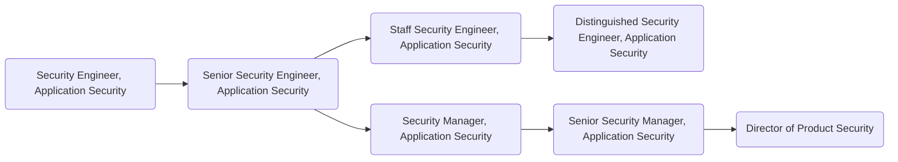

## What's it like to work in security at GitLab?

🤝 Application Security Engineers work closely with development teams, product managers (PM), and third-party groups (including the paid bug bounty program) to ensure that GitLab products are secure.

🎉 **Hear from two team members about what it's like working here at GitLab in our Security department.** 🎉

*AppSec Engineer [Nick Malcolm](/handbook/company/team/#nmalcolm) talks about what makes him proud to work at GitLab and what makes the experience unique, as well as what helps someone succeed on the team.*

<figure class="video_container">
  <iframe src="https://www.youtube.com/embed/DgJhvait4gI" frameborder="0" allowfullscreen="true"> </iframe>
</figure>

*[Andrew Kelly](/handbook/company/team/#ankelly), one of our former AppSec team managers talks about his experience here at GitLab, including what makes GitLab a unique and exciting place to learn and grow.*

<figure class="video_container">
  <iframe src="https://www.youtube.com/embed/5RYc0KqX48Q" frameborder="0" allowfullscreen="true"> </iframe>
</figure>

## Responsibilities

- Perform security-focused code reviews
- Support and consult with product and development teams in the area of application security, including threat modeling and appsec reviews
- Assist teams in reproducing, triaging, and addressing application security vulnerabilities.
- Support the bug bounty program.
- Support the preparation of security releases.
- Assist in development of security processes and automated tooling that prevent classes of security issues.

Learn more about our role [on the Application Security Handbook page](/handbook/security/product-security/application-security/) including our work as [Stable Counterparts](/handbook/security/product-security/application-security/stable-counterparts.html) and our [HackerOne process](/handbook/security/product-security/application-security/runbooks/hackerone-process.html)

## Requirements

- Ability to use GitLab.
- Able to work well with software development teams.
- Experience identifying security issues through code review.
- Excellent and professional communication skills (written and verbal) with an ability to articulate complex topics in a clear and concise manner.
- Familiarity with some common security libraries and tools (e.g. static analysis tools, proxying / penetration testing tools).
- Familiarity and ability to explain common security flaws and ways to address them (e.g. OWASP Top 10).
- Basic development or scripting experience and skills. Ruby, Ruby on Rails, JavaScript, and/or Go are preferred.
- A basic understanding of network and web related protocols (such as TCP/IP, UDP, HTTP, HTTPS, protocols).

## Levels

### Application Security Engineer (Intermediate)

This position reports to the [Security Manager, Application Security](#security-manager-application-security) role at GitLab.

#### Application Security Engineer (Intermediate) Job Grade

The role is a [grade 6](/handbook/total-rewards/compensation/compensation-calculator/#gitlab-job-grades).

#### Application Security Engineer (Intermediate) Responsibilities

- Includes responsibilities listed [here](#responsibilities)

#### Application Security Engineer (Intermediate) Requirements

- Includes requirements listed [here](#requirements)

### Senior Application Security Engineer

This position reports to the [Security Manager, Application Security](#security-manager-application-security) role at GitLab.

#### Senior Application Security Engineer Job Grade

The role is a [grade 7](/handbook/total-rewards/compensation/compensation-calculator/#gitlab-job-grades).

#### Senior Application Security Engineer Responsibilities

- Includes all [Intermediate level responsibilities listed](#responsibilities).
- Support and evolve the bug bounty program.
- Lead both critical and regular security releases.
- Lead application security reviews and threat modeling, including code review and dynamic testing.
- Lead in development of automated security testing to validate that secure coding best practices are being used.
- Guide and advise product development teams as SMEs in the area of application security.
- Assist with recruiting activities and administrative work.
- Develop security training and socialize the material with internal development teams.
- Participate and assist in initiatives to holistically address multiple vulnerabilities found in a functional area.

#### Senior Application Security Engineer Requirements

- Includes all [Intermediate level requirements listed](#requirements).
- Strong understanding and experience with common security libraries, security controls, and common security flaws.
- Some development or scripting experience and skills. Ruby and Ruby on Rails is preferred.
- Be a subject matter expert (SME) of at least 1 technical area impacting the security of the product.
- Strong experience working closely with developers.

### Staff Application Security Engineer

This position reports to the [Security Manager, Application Security](#security-manager-application-security) role at GitLab.

#### Staff Application Security Engineer Job Grade

The role is a [grade 8](/handbook/total-rewards/compensation/compensation-calculator/#gitlab-job-grades).

#### Staff Application Security Engineer Responsibilities

- Serve as mentor to other AppSec team members, providing guidance and support.
- Ability to assist in [Senior level responsibilities](#senior-application-security-engineer-responsibilities) if needed.
- Take initiative and drive changes in our bug bounty program which position us as the leading authority amongst other programs.
- Lead and influence cross-functional positive changes across the Security organization.
- Drive the most difficult or highly complex application security reviews and threat modeling. Provide expert guidance and direction for other team members when they encounter challenges in their security reviews. Own documentation and procedures surrounding application security reviews as well as lead by example for what successful application security reviews look like.
- Scale application security by developing automated security testing or centralized security libraries which scale directly with developers and enable them to more easily write secure code.
- Champion recruiting activities.
- Have significant ownership in and evangelize security training with development teams.
- Drive initiatives which scale application security and holistically address multiple vulnerabilities.

#### Staff Application Security Engineer Requirements

- Includes all [Senior level requirements listed](#senior-application-security-engineer-requirements).
- Leading expert with common security libraries, security controls, and common security flaws.
- Strong development or scripting experience and skills. You're able to significantly and effectively contribute to the product and its security. Ruby and Ruby on Rails is a must.
- Be a subject matter expert (SME) of at least 2 technical areas impacting the security of the product.

### Distinguished Application Security Engineer

This position reports to the [Product Security Director](/job-families/security/security-leadership/) role at GitLab.

#### Distinguished Application Security Engineer Job Grade

The role is a [grade 10](/handbook/total-rewards/compensation/compensation-calculator/#gitlab-job-grades).

#### Distinguished Application Security Engineer Responsibilities

- Includes all [Staff level responsibilities listed](#staff-application-security-engineer-responsibilities).
- Drive the technical direction, roadmap, and [6-month architecture blueprints](/handbook/engineering/architecture/#architecture-at-gitlab) of the Application Security program.
- Drive the business value relation of metrics calculations for the Application Security program.
- Represent the Application Security team across and outside of GitLab as a subject matter expert in technology, development, and application security concepts.
- Work in a leveraged manner influencing other organizations and teams across GitLab with application security approaches and a focus on problem solving.

#### Distinguished Application Security Engineer Requirements

- Includes all [Staff level requirements listed](#staff-application-security-engineer-requirements).
- 10+ years previous experience on a Security Operations, Software Development, Application Security team, or relevant education.
- Excellent written and verbal communication skills.
- Expert scripting/coding skills in one or more languages - Python, Ruby, and/or Golang experience a plus.
- Expert understanding of Internet security issues, application security technologies, cloud architectures, and threat landscape concepts.
- Expert understanding of the Software as a Service (SaaS) model.
- Experience leading efforts or managing application security teams working in the DevOps model.
- Hands on experience architecting, automating, maintaining, and securing Cloud Computing Platforms - GCP experience a plus.

## Application Security Engineer Specialties

### US Federal

A US Federal Application Security Engineer's main focus is supporting our Public Sector customers and related internal teams concerning the product's security.

#### Requirements

In addition to the general requirements for [Application Security Engineers](#application-security-engineer-intermediate-requirements):

- Must be a United States citizen.
- Must reside in one of the 50 states of the United States of America.
- Must conduct all GitLab related work within the United States of America.
- Experience working for or closely with the United States government or associated contractors.
- Ability and willingness to obtain a federal security clearance should it be necessary to perform job responsibilities.
- Experience working with Defense Information Security Agency (DISA) Security Technical Implementation Guides (STIGs).
- Successful completion of a [background check](/handbook/people-policies/).

#### Responsibilities

- Lead and perform application security reviews on all contributed code from [GitLab Information Technology (Hubei) Co., Ltd. (JiHu, pronounced "G Who")](https://about.gitlab.com/blog/2021/03/18/gitlab-licensed-technology-to-new-independent-chinese-company/).
- Work with and triage security reports from US government organizations and associated contractors.
- From an Application Security perspective, support our Federal Sales and Public Sector teams.
- Auxillary responsibilities include those [general to the Application Security Engineer role](#application-security-engineer-intermediate-responsibilities).

### Security Manager, Application Security

This position reports to the [Application Security Senior Manager](/job-families/security/application-security/) role at GitLab.

#### Job Grade

The Application Security Manager is a [grade 8](/handbook/total-rewards/compensation/compensation-calculator/#gitlab-job-grades).

#### Responsibilities

- Hire and oversee a world-class team of application security engineers.
- Help their team grow their skills and experience.
- Provide input on security architecture, issues, and features.
- Hold regular 1:1's with all members of their team.
- Create a sense of psychological safety on their team.
- Recommend security-related technical and process improvements.
- Author project plans for security initiatives.
- Draft and successfully execute on quarterly OKRs.
- Train team members to screen candidates and conduct managerial interviews.
- Sense of ownership, urgency, and drive.
- Excellent written and verbal communication skills, especially experience with executive-level communications.
- Ability to make concrete progress in the face of ambiguity and imperfect knowledge.
- Prepare and deliver meaningful metrics to Product Security leadership.

#### Requirements

- Demonstrable prior people management experience.
Enjoys working hard; is action-oriented and full of energy for the things he/she sees as challenging; not fearful of acting with a minimum of planning; seizes more opportunities than others.
- Can effectively cope with change; can shift gears comfortably; can decide and act without having the total picture; isn’t upset when things are up in the air; doesn’t have to finish things before moving on; can comfortably handle risk and uncertainty.
- Knows how businesses work; knowledgeable in current and possible future policies, practices, trends, and information affecting their business and organization; knows the competition; is aware of how strategies and tactics work in the marketplace.
- Deals with problem reports firmly and in a timely manner; doesn’t allow problems to fester; regularly reviews performance and holds timely discussions; can make negative decisions when all other efforts fail; deals effectively with troublemakers.
- Makes good decisions (without considering how much time it takes) based upon a mixture of analysis, wisdom, experience, and judgment; most of their solutions and suggestions turn out to be correct and accurate when judged over time; sought out by others for advice and solutions.
- Provides challenging and stretching tasks and assignments; holds frequent development discussions; is aware of each report’s career goals; constructs compelling development plans and executes them; pushes reports to accept developmental moves; will take reports who need work; is a people builder.
- Is good at establishing clear guidance; sets stretching goals; distributes the workload appropriately; lays out work in a well-planned and organized manner; maintains two-way dialogue with others on work and results; brings out the best in people; is a clear communicator.
- Is widely trusted; is seen as a direct, truthful; can present the unvarnished truth in an appropriate and helpful manner; keeps confidences; admits mistakes; doesn’t misrepresent him/herself for personal gain.
- Doesn’t hold back anything that needs to be said; provides current, direct, complete, and “actionable” positive and corrective feedback to others; lets people know where they stand; faces up to people problems on any person or situation (not including direct reports) quickly and directly; is not afraid to take negative action when necessary.
- Assigns responsibility for tasks and decisions; sets clear goals and measures; monitors process, progress, and results; designs feedback loops into work.
- Creates a climate in which people want to do their best; can motivate many kinds of reports and team or project members; can assess each person hot button and use it to get the best out of him/her; pushes tasks and decisions down; empowers others; invites input from each person and shares ownership and visibility; makes each person feel their work is important; is someone people like working for and with.
- Scopes out length and difficulty of tasks and projects; sets goals; breaks down work into the process steps; develops schedules and task/people assignments; anticipates and adjusts for problems and roadblocks; measures performance against goals; evaluates results.
- Uses rigorous logic and methods to solve difficult problems with effective solutions; probes all fruitful sources for answers; can see hidden problems; is excellent at honest analysis; looks beyond the obvious and doesn’t stop at the first answers.
- Can be counted on to exceed goals successfully; is constantly and consistently one of the top performers; very bottom-line oriented; steadfastly pushes self and others for results.

### Application Security Senior Manager

This position reports to the [Product Security Director](/job-families/security/security-leadership/#director-security-engineering--research).

#### Job Grade

The Application Security Senior Manager is a [grade 9](/handbook/total-rewards/compensation/compensation-calculator/#gitlab-job-grades).

#### Responsibilities

- The [same responsibilities of a Application Security Manager](#responsibilities-1), plus the below:
- Maintain reliable, up-to-date information regarding application security technologies trends.
- Execute strategic vision for the Application Security program.

#### Requirements

- At least 5 years prior experience managing Product Security teams.

## Segment

### Security Leadership

For details on the Security organization leadership roles, to include the Product Security Director and VP of Security, see the Security Leadership page.

## Performance Indicators

- <https://app.periscopedata.com/app/gitlab/641782/Appsec-hackerone-vulnerability-metrics?widget=8715519&udv=0>
- <https://app.periscopedata.com/app/gitlab/641782/Appsec-hackerone-vulnerability-metrics?widget=8729826&udv=0>

## Career Ladder

## Hiring Process

Candidates for this position can expect the hiring process to follow the order below. Please keep in mind that candidates can be declined from the position at any stage of the process. To learn more about someone who may be conducting the interview, find their job title on our [team page](/handbook/company/team/).

- Qualified candidates will be invited to schedule a 30 minute [screening call](/handbook/hiring/interviewing/#screening-call) with one of our Global Recruiters.
- Next, candidates will be invited to schedule 1 or 2 50-minute interviews with Application Security team member peers.
- Then, candidates will be invited to schedule a 50-minute interview with the Application Security team hiring manager.
- Finally, candidates will be invited to schedule a 30-minute interview with the Director, Product Security.

Additional details about our process can be found on our [hiring page](/handbook/hiring/).
