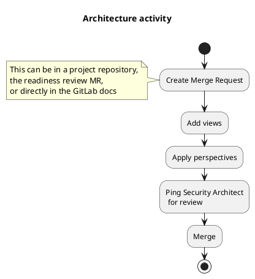

---

title: "GitLab CSF - Architecture activity"
description: "CSF Architecture activity and deliverables"
---

## Architecture

Software Architecture helps to achieve quality attribute requirements such as security, scalability,
performance, and resiliency. It is a vision of the future, and we'll provide here the tools to
communicate changes in an appropriate manner. They are not meant to be used for upfront design, but
rather for long-lived documentation.

The expectation of this Architecture activity is to provide the documentation of the change.
Multiple persona will benefit from having this documentation, whether they are a security
practitioner, a developer, a reliability engineer, or even a user. They will look for details that
are hard to represent and explain in a single diagram. That's why our approach for this activity is
to cover various aspects of the architecture, to answer the questions from different people.

*This process might change in the future, so make sure to visit this page regularly for updates.*

## Architectural decisions

[Architectural decisions](https://en.wikipedia.org/wiki/Architectural_decision) are design decisions
that addresses functional or non-functional requirements (see [perspectives](#perspectives) below).
These decisions are generally stored as Architectural Decision Records ("ADR"), which are simple
file explaining their rationale. For example, the [Backstage](https://backstage.io/) website
provides them directly in the
[documentation](https://backstage.io/docs/architecture-decisions/adrs-overview). These sections
helps to understand the conception of the software, and also bring some interesting details like
consequences (which can be drawbacks).

At GitLab, we already have everything to document decisions: git and Merge Requests are a perfect
way to document and keep track of decisions. We actually already [use this flow]()
since the creation of this handbook. So instead of
storing these discussions in a Markdown file, a Merge Request is enough to detail a change, discuss
it, and keep track of the evolution of the architecture. This way, your architecture doc remains the
free from lengthy discussions, and we don't scatter the actual architecture content with the decision making process.

## Getting started

To get started, create a document with the  relevant views to describe best your architecture using
the [viewpoints](#views-and-viewpoints) described in the next section. This document can be created
along with the [readiness review](/handbook/engineering/infrastructure/production/readiness/) merge
request, or directly in the [GitLab docs](https://gitlab.com/gitlab-org/gitlab/-/tree/master/doc/development) if possible.

Make sure to apply the relevant [perspectives](#perspectives) to your views.

Once the merge request is ready, you can ping a security architect
(`@gitlab-com/gl-security/security-architecture`) for a review.

Summary:

One common misconception about software architecture is that everything must be diagrams. Even
worse: everything must be in ONE diagram. This page provides tools and techniques to break down the
complexity of your architecture into smaller, detailed, and precise chunks that we call views.

### Deliverables

- Architecture description (views) with security perspective (at least) applied.

### Tools

Software architecture is not just about diagrams, but they can be very useful to communicate
knowledge about your architecture.

We don't have an official set of tools at GitLab for this activity. Just keep in mind these
constraints:

- Everything should be editable without a proprietary tool, especially if a license is required
  (even if the tool is free under some conditions).
- Arrows in diagrams must have a meaning. For example, in a network diagram, arrows must carry at
  least a port (or a socket) used for the connection.
- If you export a diagram as a PNG or SVG file, always include the source in your document to edit
  the diagram.

GitLab offers out of the box some nice integrations in Markdown files, like
[Mermaid](https://docs.gitlab.com/ee/user/markdown.html#mermaid) or
[PlantUML](https://docs.gitlab.com/ee/user/markdown.html#plantuml). These are great for sequence or
activity diagram, but don't work well for other views. [Diagrams](https://diagrams.net) is an
opensource tool to create drag and drop diagrams, and is the recommended tool for this activity as
of today.

## Views and Viewpoints

Views are the results of applying a viewpoint on an architecture. They're the representation and
description of a system from a specific angle, defined by viewpoints. These viewpoints helps to
cover various aspects and properties of a system

### Context viewpoint

Describes the relationships, dependencies, and interactions between the system and its environment
(the people, systems, and external entities with which it interacts). Includes the system’s runtime
context and its scope and requirements.

### Functional viewpoint

Describes the system’s functional elements, their responsibilities, interfaces, and primary
interactions; drives the shape of other system structures such as the information structure,
concurrency structure, deployment structure, and so on.

### Information viewpoint

Describes the way that the architecture stores, manipulates, manages, and distributes information.
This viewpoint develops a complete but high-level view of static data structure and information flow
to answer the big questions around content, structure, ownership, latency, references, and data
migration.

### Concurrency viewpoint

Describes the concurrency structure of the system and maps functional elements to concurrency units
to clearly identify the parts of the system that can execute concurrently and how this is
coordinated and controlled.

### Development viewpoint

Describes the architecture that supports the software development process. Development views
communicate the aspects of the architecture of interest to those stakeholders involved in building,
testing, maintaining, and enhancing the system.

### Deployment viewpoint

Describes the environment into which the system will be deployed, and the dependencies the system
has on its runtime environment. Deployment views capture the system’s hardware environment,
technical environment requirements, and the mapping of the software to hardware elements.

### Operational viewpoint

Describes how the system will be operated, administered, and supported when it is running in its
production environment, by identifying system-wide strategies for addressing operational concerns
and identifying solutions that address these.

## Quality attributes

Quality attributes describe the desired non-functional properties of systems. They can impact
multiple views, and will be considered when reviewing the architecture merge request.

The most important qualities to cover in your architecture description are:

- Security
- Performance and Scalability
- Availability and Resilience
- Evolution

Other quality attributes to consider:

- Accessibility
- Internationalization
- Location
- Regulation
- Usability

To understand how to address these qualities, perspectives can be used and are described in the
[next section](#perspectives).

## Perspectives

Perspectives are a collection of activities, tactics, and guidelines used to ensure that a system
exhibits the chosen set of quality attributes. They are used to discuss how particular quality
attributes affect each view of the overall architecture. Unlike viewpoints, perspectives usually
results in changes to the architectural views. To maintain consistency, consider the impact on other
qualities (for example on performance).

Not all perspectives are relevant to every view, therefore you should select the most appropriate
ones. In the context of this framework, the security perspective is always applied.

### Security perspective

The security perspective should address the concerns of availability, principals (identify
who or what is interacting with the system), controls and policies, threats, integrity, ...

To apply this perspective, start with identifying sensitive resources. A simple table is generally
enough, but annotation one of the diagrams works too.

## Resources

The content of this page is based on the following books and articles:

1. [Software Systems Architecture](https://www.viewpoints-and-perspectives.info/home/book/) -
   Rozanski & Woods - (ISBN-13: 978-0321718334)
1. [Continuous Architecture](https://learning.oreilly.com/library/view/continuous-architecture/9780128032855/) -
   Erder & Pureur - (ISBN-13: 978-0136523567)
1. [Continuous Architecture in Practice](https://continuousarchitecture.com/) -
   Erder, Pureur, & Woods - (ISBN-13: 978-0136523567)
1. [Architecture Tradeoff Analysis Method](https://resources.sei.cmu.edu/asset_files/TechnicalReport/2000_005_001_13706.pdf) -
   Kazman, Klein, & Clements - (CMU/SEI-2000-TR-004)
