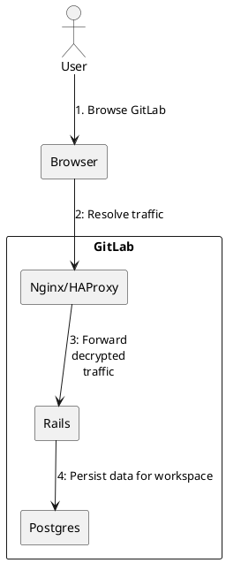
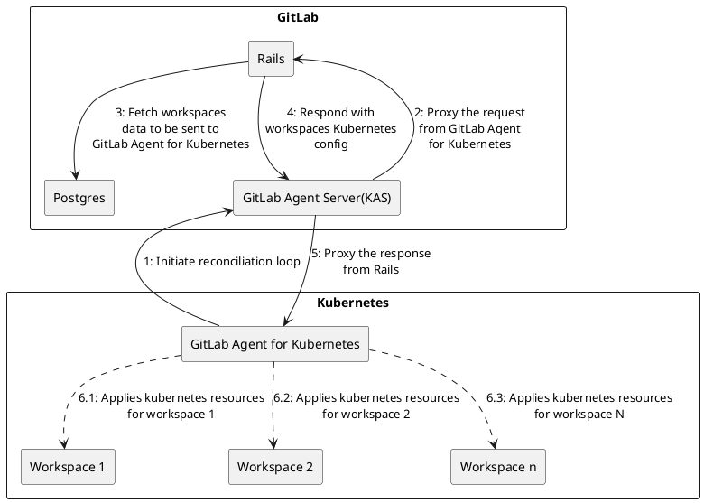
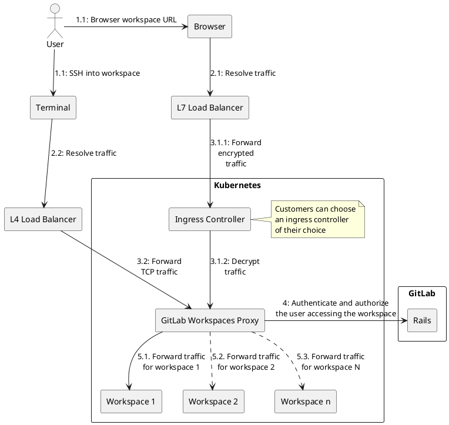
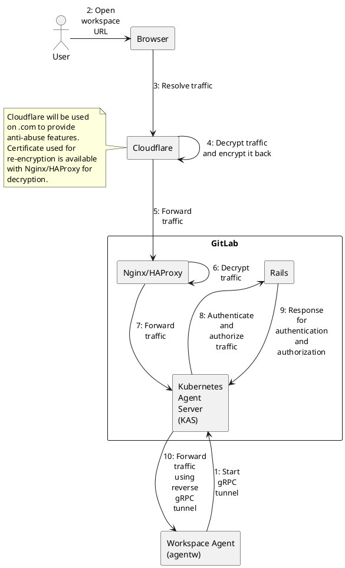
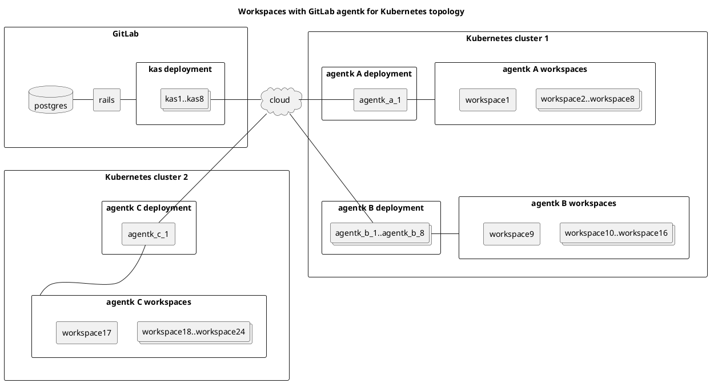
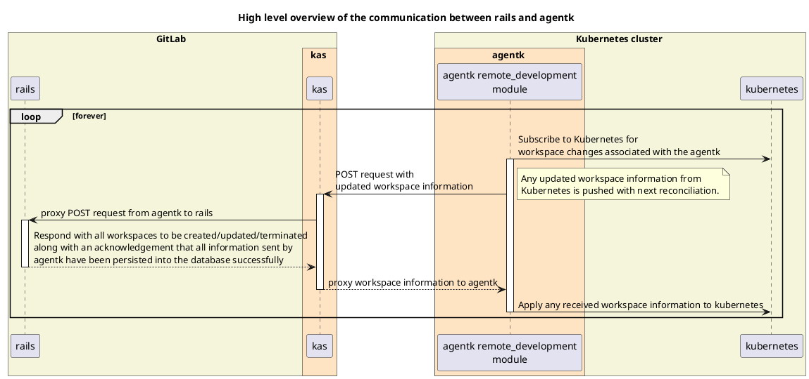

## Overview

Workspaces is delivered as a module(`remote_development`) in the
[GitLab agentk for Kubernetes](https://docs.gitlab.com/user/clusters/agent/index.html) project.
The overall goal of this architecture is to ensure that the **actual state** of all
workspaces running in the Kubernetes clusters is reconciled with the **desired state** of the
workspaces as set by the user.

This is accomplished as follows:

1. The desired state of the workspaces is obtained from user actions in the GitLab UI or API and persisted in the Rails database.
1. There is a reconciliation loop between the agentk and Rails, which:
   - Retrieves the actual state of the workspaces from the Kubernetes clusters through the agentk and sends it to Rails to be persisted.
   - Rails compares the actual state with the desired state and responds with actions to bring the actual state in line with the desired state for all workspaces.

## System design

### User actions to create/update/delete a workspace



### GitLab Agent for Kubernetes' reconciliation with Rails



### User accessing the workspace

#### With GitLab Workspaces Proxy



#### With GitLab Agent for Workspaces(agentw)

NOTE: The below diagram only reflects the HTTP traffic flow. SSH traffic flow needs investigation and will depend on https://gitlab.com/groups/gitlab-org/-/epics/13984 .



## GitLab Agent for Kubernetes topology

- The Kubernetes API is not shown in this diagram, but it is assumed that it is managing the workspaces through the agentk.
- The numbers of components in each Kubernetes cluster are arbitrary.



## High-level overview of the communication between Rails and the agentk



## Types of messages between Rails and the agentk

The agentk can send different types of messages to Rails to capture different information. Depending on what type of message the agentk sends, Rails will respond accordingly.

Different types of messages are:

- `reconcile` - Messages sent to Rails to persist the current state of the workspaces. There are two types of updates specified by the `update_type` field with the following possible values: `full` and `partial`. The payload schema remains the same for both update types.
  - `full`
    - Actions performed by the agentk:
      - Send the current state of all the workspaces in the Kubernetes cluster managed by the agentk.
      - To keep things consistent between the agentk and Rails, the agentk will send this message every time agentk undergoes a full reconciliation cycle that occurs
        - when an agentk starts or restarts
        - after a leader-election
        - periodically, as set using the full reconciliation interval configuration (default: once every hour)
        - whenever the agentk configuration is updated
    - Actions performed by Rails:
      - Update Postgres with the current state and respond with all the workspaces managed by the agentk and their last resource version that Rails has persisted in Postgres.
      - Returning the persisted resource version back to the agentk gives it a confirmation that the updates for that workspace have been successfully processed on the Rails end.
      - This persisted resource version will also help with sending only the latest workspaces changes from the agentk to Rails for `reconcile` message with `partial` update type.
  - `partial`
    - Actions performed by the agentk:
      - Send the latest workspace changes to Rails that are not yet persisted in Postgres. This persisted resource version will help with sending only the latest workspaces changes from the agentk to Rails.
    - Actions performed by Rails:
      - Update Postgres with the current state and respond with the workspaces to be created/updated/deleted in the Kubernetes cluster and their last resource version that Rails has persisted in Postgres.
      - The workspaces to be created/updated/deleted are roughly calculated by using the filter `desired state updated at >= agentk info reported at`.
      - Returning the persisted resource version back to the agentk gives it a confirmation that the updates for that workspace have been successfully processed on the Rails end.

## Event-driven polling vs full or partial reconciliation

It was initially considered desirable to be able to tell the agentk to not wait for the next reconciliation loop but instead poll immediately. This would grant the following benefits:

1. This would grant the ability to trigger a full reconciliation on demand that would allow on-demand recovery/resetting of module state in the agentk.
1. Apart from making the architecture more event-driven and real-time it would also help to increase the interval between reconciliation polls, thus reducing the load on the infrastructure.

However, as the prospective solutions were evaluated, it was concluded that there are very few/rare cases that would merit this capability, especially given the complexity of the viable options. An eventual reconciliation of state would suffice for most cases and it could be simply achieved through full reconciliation that is carried out periodically (with a longer interval as compared to partial reconciliation).

You can read more in this [issue](https://gitlab.com/gitlab-org/gitlab/-/issues/387090) and [conclusion comment](https://gitlab.com/gitlab-org/remote-development/gitlab-remote-development-docs/-/merge_requests/13#note_1282495106)

## Workspace states

- `CreationRequested` - Initial state of a Workspace; Creation requested by user but hasn't yet been acted on
- `Starting` - In the process of being ready for use
- `Running` - Ready for use
- `Stopping` - In the process of scaling down
- `Stopped` - Persistent storage is still available but workspace has been scaled down
- `Failed` - Kubernetes resources have been applied by `agentk` but are not ready due to various reasons (for example, crashing container)
- `Error` - Kubernetes resources failed to get applied by `agentk`
- `RestartRequested` - User has requested a restart of the workspace but the restart has not yet successfully happened
- `Terminating` - User has requested the termination of the workspace and the action has been initiated but not yet completed.
- `Terminated` - Persistent storage has been deleted and the workspace has been scaled down
- `Unknown` - Not able to understand the actual state of the workspace

### Possible `actual_state` values

The `actual_state` values are determined from the `status` attribute in the Kubernetes deployment changes, which the agentk listens to and sends to Rails.

The following diagram represents the typical flow of the `actual_state` values for a `Workspace` record based on the
`status` values received from the agentk. The `status` is parsed to derive the `actual_state` of the workspace based on different conditions.

However, any of these states can be skipped if there have been any
transitional `status` updates that were not received from the agentk for some reason (a quick transition, a
failure to send the event, etc).

```plantuml
[*] --> CreationRequested
CreationRequested : Initial state before\nworkspace creation\nrequest is sent\nto kubernetes
CreationRequested -right-> Starting : status=Starting
CreationRequested -right-> Error : Could not create\nworkspace

Starting : Workspace config is being\napplied to kubernetes
Starting -right-> Running : status=Running
Starting -down-> Failed : status=Failed\n(container crashing)

Running : Workspace is running
Running -down-> Stopping : status=Stopping
Running -down-> Failed : status=Failed\n(container crashing)
Running -down-> Terminated : status=Terminated
Running -right-> Error : Could not\nstop/terminate\nworkspace

Stopping : Workspace is stopping
Stopping -down-> Stopped : status=Stopped
Stopping -left-> Failed : status=Failed\n(could not\nunmount volume\nand stop workspace)

Stopped : Workspace is Stopped\nby user request
Stopped -left-> Failed : status=Failed\n(could not\nunmount volume\nterminate workspace)
Stopped -right-> Error : Could not\nstart/terminate\nworkspace
Stopped -down-> Terminated : status=Terminated
Stopped -up-> Starting : status=Starting

Terminated: Workspace has been deleted

Failed: Workspace is not ready due to\nvarious reasons(for example, crashing container)
Failed -up-> Starting : status=Starting\n(container\nnot crashing)
Failed -right-> Stopped : status=Stopped
Failed -down-> Terminated : status=Terminated
Failed -down-> Error : Could not\nstop/terminate\nworkspace

Error: Kubernetes resources failed to get applied
Error -up-> Terminated : status=Terminated

Unknown: Unable to understand the actual state of the workspace
```

### Possible `desired_state` values

The `desired_state` values are determined from the user's request to Rails and are sent to the agentk by Rails.

`desired_state` is a subset of the `actual_state` with only `Running`, `Stopped`, `Terminated` and `RestartRequested` values.
The state reconciliation logic in Rails will
continually attempt to transition the `actual_state` to the `desired_state` value, unless the workspace is in an unrecoverable state.

There is also an additional supported state of `RestartRequested` which is only valid for `desired_state`.
This value is not a valid value for `actual_state`. It is required in order for Rails to
initiate a restart of a started workspace. It will only persist until a `status` of `Stopped` is received
from the agentk, indicating that the restart request was successful and in progress or completed.
At this point, the `desired_state` will be automatically changed to `Running` to trigger the workspace to restart again.
If there is a failure to restart the workspace, and a `Stopped` status is never received, the
`desired_state` will remain `RestartRequested` until a new `desired_state` is specified.

```plantuml
[*] --> Running
Running : Workspace is running
Running -down-> Stopped : status=Stopped
Running -left-> Terminated : status=Terminated

Stopped : Workspace is Stopped\nby user request
Stopped -up-> Running : status=Running
Stopped -down-> Terminated : status=Terminated

Terminated: Workspace has been deleted

RestartRequested : User has requested a workspace restart.\n**desired_state** will automatically change\nto **'Running'** if actual state\nof **'Stopped'** is received.
RestartRequested -left-> Running : status=Running
```
