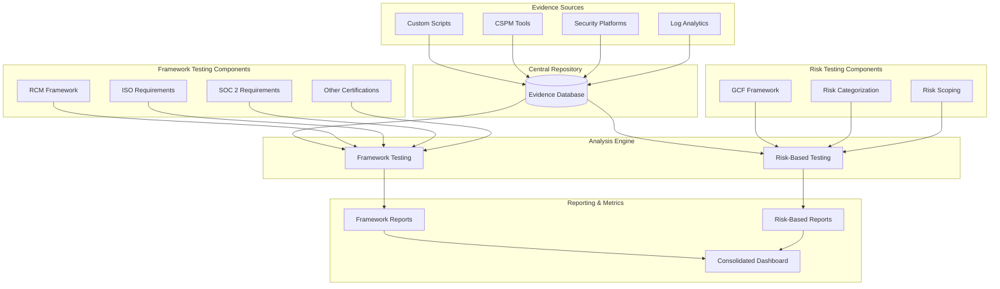

## Objectives

The automated evidence collection and control testing program aims to:

* Streamline the collection and validation of control evidence through automation
* Ensure comprehensive coverage of both compliance requirements and security risks
* Reduce manual effort in control testing and evidence gathering
* Provide real-time visibility into control effectiveness and compliance status
* Enable data-driven decisions about security and compliance priorities
* Support both certification maintenance and dynamic security needs

## Executive Summary

GitLab's automated evidence collection and control testing system consists of:

* Evidence Collection:

  * Multiple source integration (Scripts, CSPM, Security Platforms, Log Analytics)
  * Centralized evidence repository
  * Automated collection and validation

* Dual Testing Framework:

  * Framework-based: Using RCM for ISO, SOC 2, and other certification requirements
  * Risk-based: Using GCF with risk categorization and scoping

* Outputs:

  * Framework compliance reporting
  * Risk-based analysis
  * Consolidated metrics dashboard

## System Overview

## Evidence Collection Infrastructure

### Sources and Integration

The foundation of our control testing program is a robust evidence collection system that integrates multiple data sources through automated means:

1. Cloud Security Posture Management (CSPM):

    * Wiz for cloud infrastructure security assessment and compliance monitoring
    * GCP Security Command Center for Google Cloud environment security
    * AWS Config for AWS environment configuration monitoring

2. Infrastructure as Code (IaC) Security:

    * Checkov for static analysis of Terraform configurations
    * GitLab IaC scanning for pipeline-integrated security checks
    * Custom parsers for configuration validation

3. Custom Evidence Collection:

    * Python scripts for API-based data collection
    * Bash scripts for Linux system evidence collection
    * Custom integrations with internal tools and services

4. Security Information Management:

    * Log aggregation and analysis
    * Metrics collection
    * Custom log parsers for specific application evidence

Each source is integrated through standardized APIs or collection mechanisms, with specific data transformations:

* JSON-formatted output for consistency
* Standardized timestamp formats (UTC)
* Uniform metadata tagging for control mapping
* Structured evidence classification

### Central Repository

All collected evidence flows into a centralized repository designed for secure storage and efficient retrieval. The repository implements strict access controls, version tracking, and retention policies to maintain evidence integrity. Each piece of evidence is tagged with essential metadata including:

* Source identification
* Collection timestamp
* Control mapping
* Data classification
* Validation status

## Analysis Engine

### Framework-Based Testing

The framework-based testing component utilizes our Requirements and Controls Matrix (RCM) to evaluate evidence against specific certification requirements.

#### Certification Coverage

Our testing framework specifically addresses:

* ISO 27001:2013 certification requirements, including Annex A controls
* SOC 2 Type 2 Trust Services Criteria (Security, Availability, Confidentiality)
* Industry-specific standards (TISAX, Cyber Essentials)
* PCI DSS requirements where applicable

#### Testing Implementation

Evidence evaluation is performed through automated means:

1. Wiz Compliance Module:

    * Real-time cloud infrastructure compliance assessment
    * Automated evidence collection for cloud controls
    * Continuous compliance monitoring and alerting

2. Infrastructure Testing:

    * AWS Config Rules for infrastructure compliance
    * GCP Security Command Center compliance checks

3. Application Security:

    * GitLab security scanning results
    * Container security scanning
    * Dependency scanning results

4. Custom Control Testing:

    * Automated script execution for control validation
    * API-based control status checking
    * Scheduled evidence collection tasks

Testing follows predefined schedules aligned with certification cycles:

* Daily automated control validation
* Weekly comprehensive compliance checks
* Monthly detailed control assessment
* Quarterly full framework evaluation

### Risk-Based Testing

Risk-based testing leverages the GitLab Control Framework (GCF) combined with dynamic risk assessment to provide comprehensive security coverage beyond basic compliance requirements.

#### Testing Strategy

The risk-based approach implements:

1. Continuous Security Validation:

    * Wiz real-time security posture monitoring
    * Cloud infrastructure security assessment
    * Configuration drift detection
    * Vulnerability identification and tracking

2. Dynamic Risk Assessment:

    * Weekly automated risk scoring based on:
        * Threat intelligence feeds
        * Vulnerability scan results
        * Security incident data
        * Asset criticality ratings
    * Automatic adjustment of testing frequency based on risk scores
    * Integration with StORM risk management program

3. Operational Security Testing:

    * Daily security baseline checks
    * Automated security control validation
    * Integration with security incident management
    * Custom control effectiveness measurements

4. Enhanced Control Coverage:

    * Testing of controls beyond certification scope
    * Custom security requirements validation
    * Industry-specific security checks
    * GitLab-specific security controls

## Analysis and Reporting

### Framework Compliance Reporting

Framework compliance reports provide clear visibility into certification readiness and control effectiveness. These reports include:

* Control testing status
* Evidence completeness
* Compliance gaps
* [Observation Management](../observation-management-procedure.md)
* Audit preparation metrics

### Risk-Based Analysis

Risk-based analysis reports focus on security posture and risk mitigation effectiveness. Key components include:

* Control effectiveness trends
* Risk level indicators
* Threat exposure metrics
* Control coverage analysis
* Remediation priorities

### Consolidated Dashboard

The consolidated dashboard provides a unified view of both compliance status and risk posture. This integration enables:

* Holistic control effectiveness monitoring
* Resource allocation optimization
* Trend analysis across frameworks
* Executive-level reporting
* Operational metrics tracking

## Implementation and Maintenance

### Automation Development

Our automation framework is continuously evolved to improve efficiency and coverage. Development priorities include:

* New source integration
* Testing procedure automation
* Report generation enhancement
* Dashboard customization
* Analysis engine optimization

### Quality Assurance

To maintain the reliability of our testing program, we implement:

* Regular validation of automation scripts
* Evidence quality monitoring
* Testing procedure reviews
* Results verification
* System performance optimization

## Conclusion

This comprehensive approach to automated evidence collection and control testing provides GitLab with efficient coverage of both compliance requirements and security risks. The integration of RCM and GCF frameworks, supported by robust evidence collection and analysis capabilities, ensures effective management of our compliance and security posture. Continuous development of automation capabilities and regular system optimization maintain the program's effectiveness as requirements evolve.
